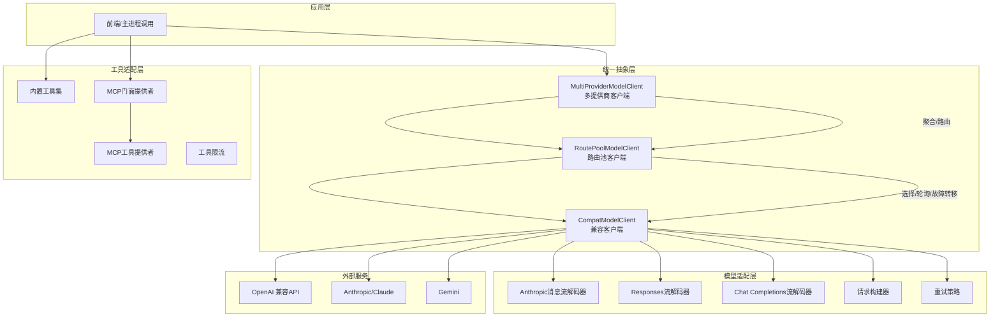
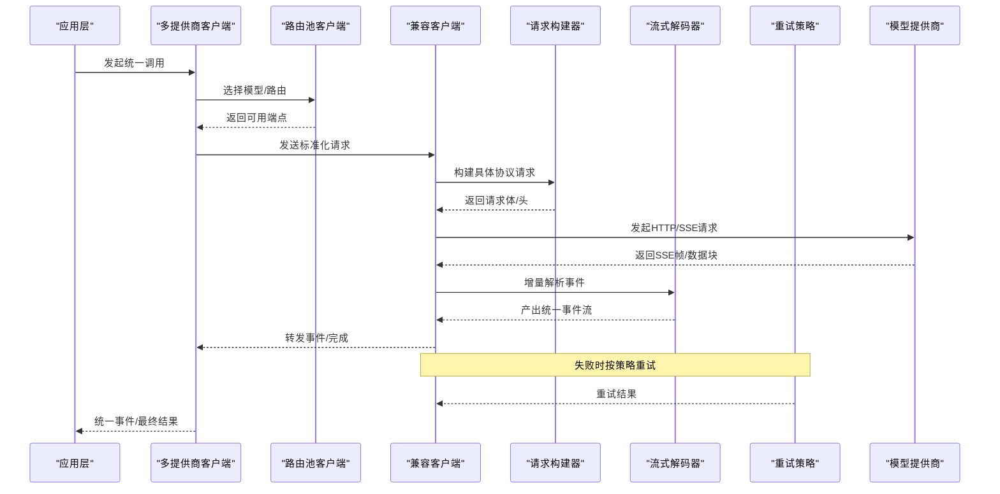
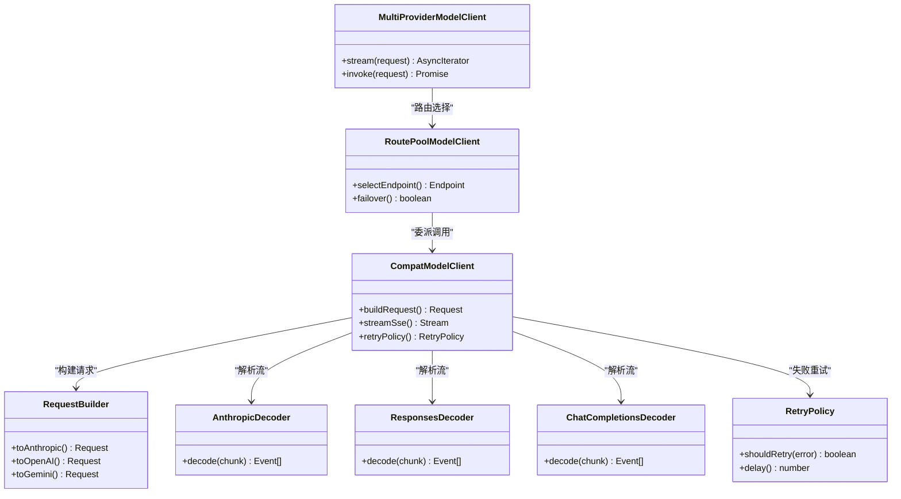
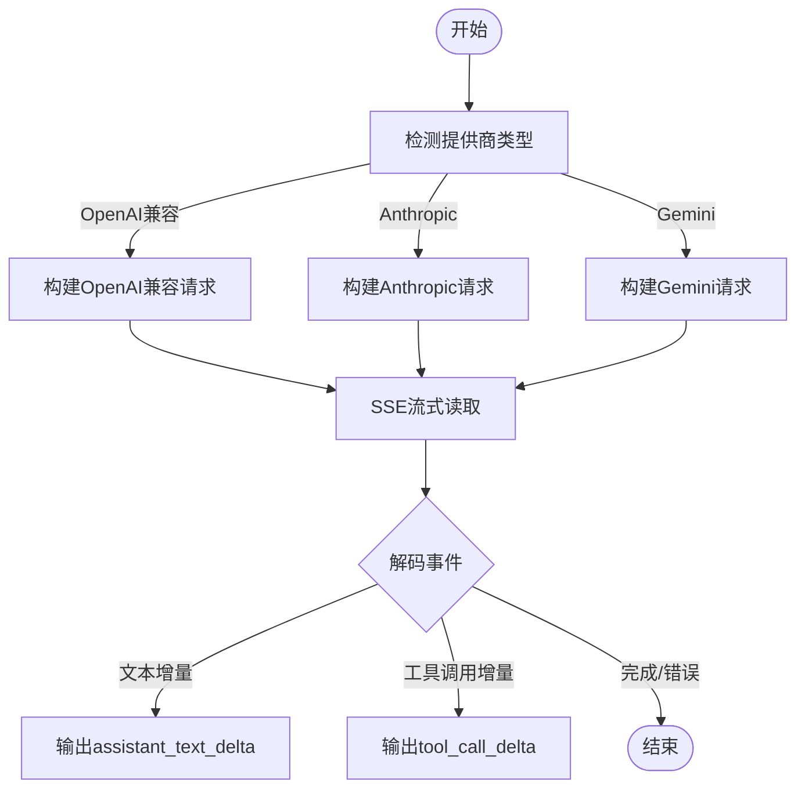
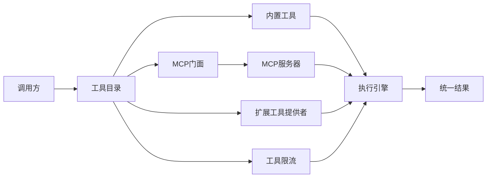
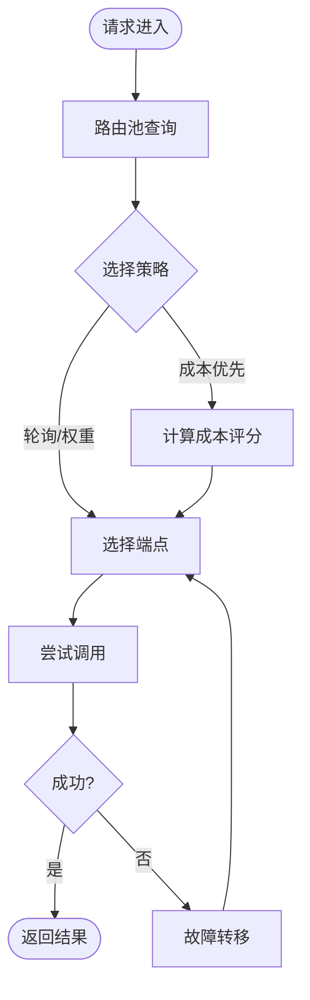
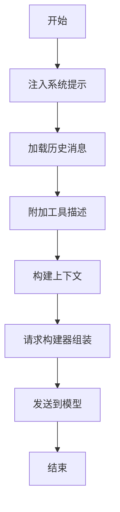
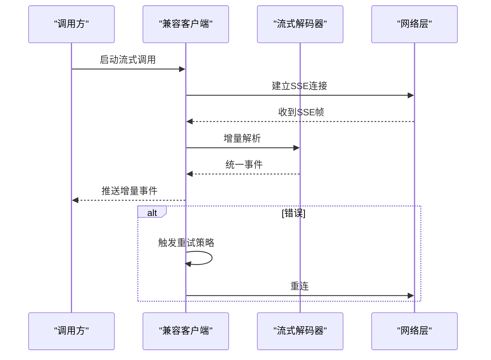
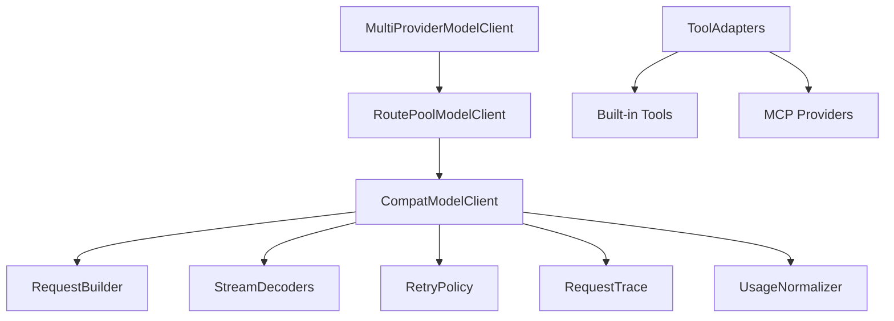

# AI集成

<cite>
**本文引用的文件**
- [anthropic-messages-stream-decoder.ts](file://kun/src/adapters/model/anthropic-messages-stream-decoder.ts)
- [compat-model-client.ts](file://kun/src/adapters/model/compat-model-client.ts)
- [route-pool-model-client.ts](file://kun/src/adapters/model/route-pool-model-client.ts)
- [multi-provider-model-client.ts](file://kun/src/adapters/model/multi-provider-model-client.ts)
- [responses-stream-decoder.ts](file://kun/src/adapters/model/responses-stream-decoder.ts)
- [chat-completions-stream-decoder.ts](file://kun/src/adapters/model/chat-completions-stream-decoder.ts)
- [compat-request-builder.ts](file://kun/src/adapters/model/compat-request-builder.ts)
- [compat-retry-policy.ts](file://kun/src/adapters/model/compat-retry-policy.ts)
- [mcp-tool-provider.ts](file://kun/src/adapters/tool/mcp-tool-provider.ts)
- [mcp-facade-provider.ts](file://kun/src/adapters/tool/mcp-facade-provider.ts)
- [builtin-tools.ts](file://kun/src/adapters/tool/builtin-tools.ts)
- [tool-rate-limit.ts](file://kun/src/adapters/tool/tool-rate-limit.ts)
- [model-route-pool.ts](file://kun/src/contracts/model-route-pool.ts)
- [model-endpoint-format.ts](file://kun/src/contracts/model-endpoint-format.ts)
- [model-request-trace.ts](file://kun/src/contracts/model-request-trace.ts)
- [usage.ts](file://kun/src/contracts/usage.ts)
- [model-provider-presets.ts](file://src/shared/model-provider-presets.ts)
- [openai-compat-url.ts](file://src/shared/openai-compat-url.ts)
</cite>

## 目录
1. [简介](#简介)
2. [项目结构](#项目结构)
3. [核心组件](#核心组件)
4. [架构总览](#架构总览)
5. [详细组件分析](#详细组件分析)
6. [依赖关系分析](#依赖关系分析)
7. [性能与调优](#性能与调优)
8. [故障排查指南](#故障排查指南)
9. [结论](#结论)
10. [附录](#附录)

## 简介
本文件面向DeepSeek-GUI的AI集成子系统，聚焦多模型提供商的统一抽象层、工具适配器架构、模型路由策略、提示词工程、流式响应处理以及性能调优与故障排查。目标是帮助开发者理解并扩展系统对OpenAI、Anthropic、Claude、Gemini等主流服务的接入能力，并在统一接口下实现负载均衡、故障转移与成本优化。

## 项目结构
AI集成相关代码主要分布在以下区域：
- 模型适配层：位于 kun/src/adapters/model，负责将不同模型的请求/响应格式统一为内部协议，支持SSE流式解码、重试、用量归一化、端点格式构建等。
- 工具适配器层：位于 kun/src/adapters/tool，提供内置工具、MCP协议工具、扩展工具等统一入口，并对执行进行限流与安全约束。
- 契约与配置：位于 kun/src/contracts 与 src/shared，定义模型路由池、端点格式、请求追踪、用量统计及提供商预设等。
- 共享能力：如OpenAI兼容URL解析、提供商预设等，便于在渲染进程或主进程中复用。

图表来源
- [multi-provider-model-client.ts](file://kun/src/adapters/model/multi-provider-model-client.ts)
- [route-pool-model-client.ts](file://kun/src/adapters/model/route-pool-model-client.ts)
- [compat-model-client.ts](file://kun/src/adapters/model/compat-model-client.ts)
- [anthropic-messages-stream-decoder.ts](file://kun/src/adapters/model/anthropic-messages-stream-decoder.ts)
- [responses-stream-decoder.ts](file://kun/src/adapters/model/responses-stream-decoder.ts)
- [chat-completions-stream-decoder.ts](file://kun/src/adapters/model/chat-completions-stream-decoder.ts)
- [compat-request-builder.ts](file://kun/src/adapters/model/compat-request-builder.ts)
- [compat-retry-policy.ts](file://kun/src/adapters/model/compat-retry-policy.ts)
- [builtin-tools.ts](file://kun/src/adapters/tool/builtin-tools.ts)
- [mcp-facade-provider.ts](file://kun/src/adapters/tool/mcp-facade-provider.ts)
- [mcp-tool-provider.ts](file://kun/src/adapters/tool/mcp-tool-provider.ts)

章节来源
- [multi-provider-model-client.ts](file://kun/src/adapters/model/multi-provider-model-client.ts)
- [route-pool-model-client.ts](file://kun/src/adapters/model/route-pool-model-client.ts)
- [compat-model-client.ts](file://kun/src/adapters/model/compat-model-client.ts)

## 核心组件
- 多提供商客户端（MultiProviderModelClient）：对外暴露统一的模型调用接口，屏蔽底层提供商差异。
- 路由池客户端（RoutePoolModelClient）：基于模型路由池实现负载均衡、故障转移与成本优化策略。
- 兼容客户端（CompatModelClient）：将上层请求转换为各提供商的具体协议，管理SSE流式解码、重试、用量归一化与端点格式。
- 流式解码器：针对Anthropic Messages、OpenAI Responses、Chat Completions等协议的增量事件解析。
- 工具适配器：内置工具、MCP工具、扩展工具的统一注册与执行框架，含限流与安全边界。
- 契约与配置：模型路由池、端点格式、请求追踪、用量统计、提供商预设等。

章节来源
- [multi-provider-model-client.ts](file://kun/src/adapters/model/multi-provider-model-client.ts)
- [route-pool-model-client.ts](file://kun/src/adapters/model/route-pool-model-client.ts)
- [compat-model-client.ts](file://kun/src/adapters/model/compat-model-client.ts)
- [model-route-pool.ts](file://kun/src/contracts/model-route-pool.ts)
- [model-endpoint-format.ts](file://kun/src/contracts/model-endpoint-format.ts)
- [model-request-trace.ts](file://kun/src/contracts/model-request-trace.ts)
- [usage.ts](file://kun/src/contracts/usage.ts)

## 架构总览
下图展示了从应用层到外部模型服务的完整调用链路，包括统一抽象、路由、请求构建、流式解码与重试机制。

图表来源
- [multi-provider-model-client.ts](file://kun/src/adapters/model/multi-provider-model-client.ts)
- [route-pool-model-client.ts](file://kun/src/adapters/model/route-pool-model-client.ts)
- [compat-model-client.ts](file://kun/src/adapters/model/compat-model-client.ts)
- [compat-request-builder.ts](file://kun/src/adapters/model/compat-request-builder.ts)
- [anthropic-messages-stream-decoder.ts](file://kun/src/adapters/model/anthropic-messages-stream-decoder.ts)
- [responses-stream-decoder.ts](file://kun/src/adapters/model/responses-stream-decoder.ts)
- [chat-completions-stream-decoder.ts](file://kun/src/adapters/model/chat-completions-stream-decoder.ts)
- [compat-retry-policy.ts](file://kun/src/adapters/model/compat-retry-policy.ts)

## 详细组件分析

### 多提供商统一抽象层
- 职责：对外提供一致的调用接口；对内协调路由、请求构建、流式解码与重试。
- 关键点：
  - 通过路由池选择最优端点，支持负载均衡与故障转移。
  - 使用请求构建器生成各提供商所需的具体请求体与头部。
  - 使用流式解码器将不同协议的事件统一为内部事件流。
  - 使用重试策略处理网络抖动与临时错误。

图表来源
- [multi-provider-model-client.ts](file://kun/src/adapters/model/multi-provider-model-client.ts)
- [route-pool-model-client.ts](file://kun/src/adapters/model/route-pool-model-client.ts)
- [compat-model-client.ts](file://kun/src/adapters/model/compat-model-client.ts)
- [compat-request-builder.ts](file://kun/src/adapters/model/compat-request-builder.ts)
- [anthropic-messages-stream-decoder.ts](file://kun/src/adapters/model/anthropic-messages-stream-decoder.ts)
- [responses-stream-decoder.ts](file://kun/src/adapters/model/responses-stream-decoder.ts)
- [chat-completions-stream-decoder.ts](file://kun/src/adapters/model/chat-completions-stream-decoder.ts)
- [compat-retry-policy.ts](file://kun/src/adapters/model/compat-retry-policy.ts)

章节来源
- [multi-provider-model-client.ts](file://kun/src/adapters/model/multi-provider-model-client.ts)
- [route-pool-model-client.ts](file://kun/src/adapters/model/route-pool-model-client.ts)
- [compat-model-client.ts](file://kun/src/adapters/model/compat-model-client.ts)

### 支持的模型服务与配置
- OpenAI兼容：通过OpenAI兼容URL解析与端点格式构建，适配多种兼容服务。
- Anthropic/Claude：Messages流式协议解码，包含思考块、工具调用增量、停止原因映射等。
- Gemini：通过端点格式与OAuth/CLI身份等能力接入（由测试与契约体现）。
- 提供商预设：集中管理默认模型、基础URL、鉴权方式等。

图表来源
- [openai-compat-url.ts](file://src/shared/openai-compat-url.ts)
- [model-endpoint-format.ts](file://kun/src/contracts/model-endpoint-format.ts)
- [compat-request-builder.ts](file://kun/src/adapters/model/compat-request-builder.ts)
- [anthropic-messages-stream-decoder.ts](file://kun/src/adapters/model/anthropic-messages-stream-decoder.ts)
- [responses-stream-decoder.ts](file://kun/src/adapters/model/responses-stream-decoder.ts)
- [chat-completions-stream-decoder.ts](file://kun/src/adapters/model/chat-completions-stream-decoder.ts)

章节来源
- [model-provider-presets.ts](file://src/shared/model-provider-presets.ts)
- [openai-compat-url.ts](file://src/shared/openai-compat-url.ts)
- [model-endpoint-format.ts](file://kun/src/contracts/model-endpoint-format.ts)

### 工具适配器架构
- 内置工具：文件系统、搜索、Git、LSP、任务图、图像生成等，提供开箱即用的能力。
- MCP协议支持：通过MCP门面与MCP工具提供者，将外部MCP服务器暴露的工具纳入统一工具目录。
- 自定义工具：扩展工具提供者机制，允许插件注入新工具。
- 安全与限流：沙箱策略、路径限制、输出限制与工具级速率限制。

图表来源
- [builtin-tools.ts](file://kun/src/adapters/tool/builtin-tools.ts)
- [mcp-facade-provider.ts](file://kun/src/adapters/tool/mcp-facade-provider.ts)
- [mcp-tool-provider.ts](file://kun/src/adapters/tool/mcp-tool-provider.ts)
- [tool-rate-limit.ts](file://kun/src/adapters/tool/tool-rate-limit.ts)

章节来源
- [builtin-tools.ts](file://kun/src/adapters/tool/builtin-tools.ts)
- [mcp-facade-provider.ts](file://kun/src/adapters/tool/mcp-facade-provider.ts)
- [mcp-tool-provider.ts](file://kun/src/adapters/tool/mcp-tool-provider.ts)
- [tool-rate-limit.ts](file://kun/src/adapters/tool/tool-rate-limit.ts)

### 模型路由策略（负载均衡、故障转移、成本优化）
- 负载均衡：路由池维护多个端点，按策略选择（如轮询、最少活跃连接、最低延迟）。
- 故障转移：当某端点不可用或超时，自动切换到备用端点。
- 成本优化：结合用量与定价信息，优先选择性价比更高的模型/端点。

图表来源
- [route-pool-model-client.ts](file://kun/src/adapters/model/route-pool-model-client.ts)
- [model-route-pool.ts](file://kun/src/contracts/model-route-pool.ts)

章节来源
- [route-pool-model-client.ts](file://kun/src/adapters/model/route-pool-model-client.ts)
- [model-route-pool.ts](file://kun/src/contracts/model-route-pool.ts)

### 提示词工程（系统提示、上下文构建、模板管理）
- 系统提示：通过请求构建器注入系统提示与角色设定，确保行为一致。
- 上下文构建：根据会话历史、工具描述、工作区信息等动态组装上下文。
- 模板管理：以配置化方式管理提示词模板，便于多语言与多场景复用。

图表来源
- [compat-request-builder.ts](file://kun/src/adapters/model/compat-request-builder.ts)
- [model-endpoint-format.ts](file://kun/src/contracts/model-endpoint-format.ts)

章节来源
- [compat-request-builder.ts](file://kun/src/adapters/model/compat-request-builder.ts)
- [model-endpoint-format.ts](file://kun/src/contracts/model-endpoint-format.ts)

### 流式响应处理（SSE连接、增量更新、错误重试）
- SSE连接：统一封装SSE读取，支持CRLF分隔与帧缓冲。
- 增量更新：将不同协议的增量事件统一为assistant_text_delta、tool_call_delta等。
- 错误重试：依据重试策略对网络错误、超时等进行指数退避重试。

图表来源
- [compat-model-client.ts](file://kun/src/adapters/model/compat-model-client.ts)
- [anthropic-messages-stream-decoder.ts](file://kun/src/adapters/model/anthropic-messages-stream-decoder.ts)
- [responses-stream-decoder.ts](file://kun/src/adapters/model/responses-stream-decoder.ts)
- [chat-completions-stream-decoder.ts](file://kun/src/adapters/model/chat-completions-stream-decoder.ts)
- [compat-retry-policy.ts](file://kun/src/adapters/model/compat-retry-policy.ts)

章节来源
- [compat-model-client.ts](file://kun/src/adapters/model/compat-model-client.ts)
- [compat-retry-policy.ts](file://kun/src/adapters/model/compat-retry-policy.ts)

## 依赖关系分析
- 耦合度：
  - 多提供商客户端与路由池强耦合，用于策略选择。
  - 兼容客户端与请求构建器、解码器、重试策略松耦合，便于替换与扩展。
- 直接依赖：
  - 模型适配层依赖契约模块（路由池、端点格式、用量、请求追踪）。
  - 工具适配层依赖内置工具与MCP提供者，并通过限流控制执行。
- 间接依赖：
  - 外部服务（OpenAI、Anthropic、Gemini）通过HTTP/SSE交互，不直接侵入内部逻辑。
- 循环依赖：未发现明显循环依赖，分层清晰。

图表来源
- [multi-provider-model-client.ts](file://kun/src/adapters/model/multi-provider-model-client.ts)
- [route-pool-model-client.ts](file://kun/src/adapters/model/route-pool-model-client.ts)
- [compat-model-client.ts](file://kun/src/adapters/model/compat-model-client.ts)
- [compat-request-builder.ts](file://kun/src/adapters/model/compat-request-builder.ts)
- [model-request-trace.ts](file://kun/src/contracts/model-request-trace.ts)
- [usage.ts](file://kun/src/contracts/usage.ts)
- [builtin-tools.ts](file://kun/src/adapters/tool/builtin-tools.ts)
- [mcp-tool-provider.ts](file://kun/src/adapters/tool/mcp-tool-provider.ts)

章节来源
- [multi-provider-model-client.ts](file://kun/src/adapters/model/multi-provider-model-client.ts)
- [route-pool-model-client.ts](file://kun/src/adapters/model/route-pool-model-client.ts)
- [compat-model-client.ts](file://kun/src/adapters/model/compat-model-client.ts)

## 性能与调优
- 并发控制：
  - 合理设置并发上限，避免过多SSE连接导致资源耗尽。
  - 使用路由池的端点池化与连接复用降低握手开销。
- 超时设置：
  - 为SSE连接与单次请求设置合理的超时阈值，配合重试策略提升鲁棒性。
  - 区分首字节超时与整体超时，避免长尾阻塞。
- 缓存策略：
  - 对静态提示词、工具描述、模型元数据进行缓存，减少重复构建。
  - 对高频查询结果（如工具列表）采用短期TTL缓存。
- 用量与成本：
  - 利用用量归一化与定价信息，评估不同模型的成本效益。
  - 在路由策略中引入成本权重，优先选择高性价比端点。
- 流式优化：
  - 增量事件尽早下发，减少端到端延迟。
  - 对大字段（如思考块）进行长度限制与截断，防止内存膨胀。

[本节为通用指导，无需特定文件引用]

## 故障排查指南
- SSE连接问题：
  - 检查网络连通性与代理设置，确认SSE端点可达。
  - 查看重试策略是否生效，必要时调整退避参数。
- 流式解码异常：
  - 核对协议版本与头部字段，确保解码器匹配。
  - 关注错误事件与停止原因，定位上游提供商返回的问题。
- 工具执行失败：
  - 检查沙箱策略与路径限制，确认工具权限与输入合法性。
  - 查看工具限流是否触发，适当放宽或拆分任务。
- 用量与配额：
  - 监控用量统计，识别异常消耗。
  - 检查提供商配额与订阅状态，避免超限中断。

章节来源
- [compat-model-client.ts](file://kun/src/adapters/model/compat-model-client.ts)
- [anthropic-messages-stream-decoder.ts](file://kun/src/adapters/model/anthropic-messages-stream-decoder.ts)
- [tool-rate-limit.ts](file://kun/src/adapters/tool/tool-rate-limit.ts)
- [model-request-trace.ts](file://kun/src/contracts/model-request-trace.ts)
- [usage.ts](file://kun/src/contracts/usage.ts)

## 结论
DeepSeek-GUI的AI集成系统通过统一抽象层、灵活的路由策略、完善的工具适配器与健壮的流式处理机制，实现了对多模型提供商的一致接入与高效调用。借助请求构建、解码器与重试策略的组合，系统在稳定性、可扩展性与成本优化方面具备良好表现。建议在生产环境中结合并发控制、超时与缓存策略进行调优，并持续监控用量与错误率以保障服务质量。

## 附录
- 快速上手：
  - 配置提供商预设与基础URL，启用OpenAI兼容或Anthropic/Gemini端点。
  - 使用多提供商客户端发起统一调用，观察流式事件与最终结果。
- 扩展指南：
  - 新增提供商：实现端点格式与请求构建，补充流式解码器。
  - 新增工具：注册到工具目录，遵循沙箱与限流规范。
- 参考文件：
  - 模型适配：compat-model-client、request-builder、stream-decoders、retry-policy
  - 工具适配：builtin-tools、mcp-tool-provider、tool-rate-limit
  - 契约与配置：model-route-pool、model-endpoint-format、model-request-trace、usage、model-provider-presets

[本节为补充说明，无需特定文件引用]