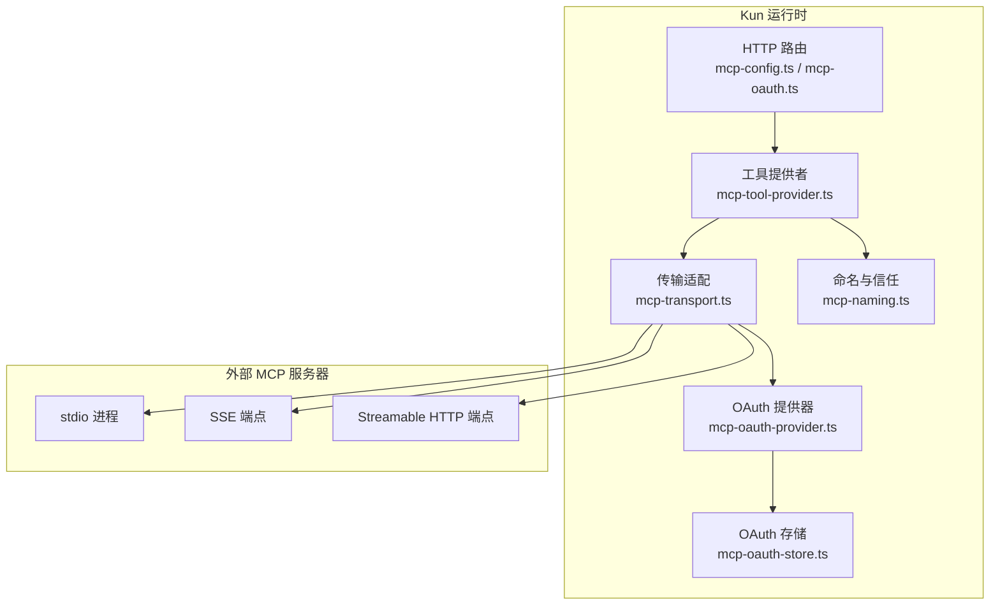
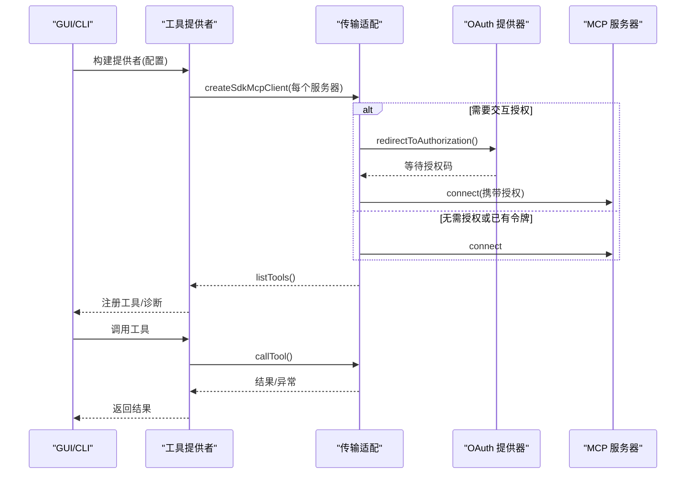
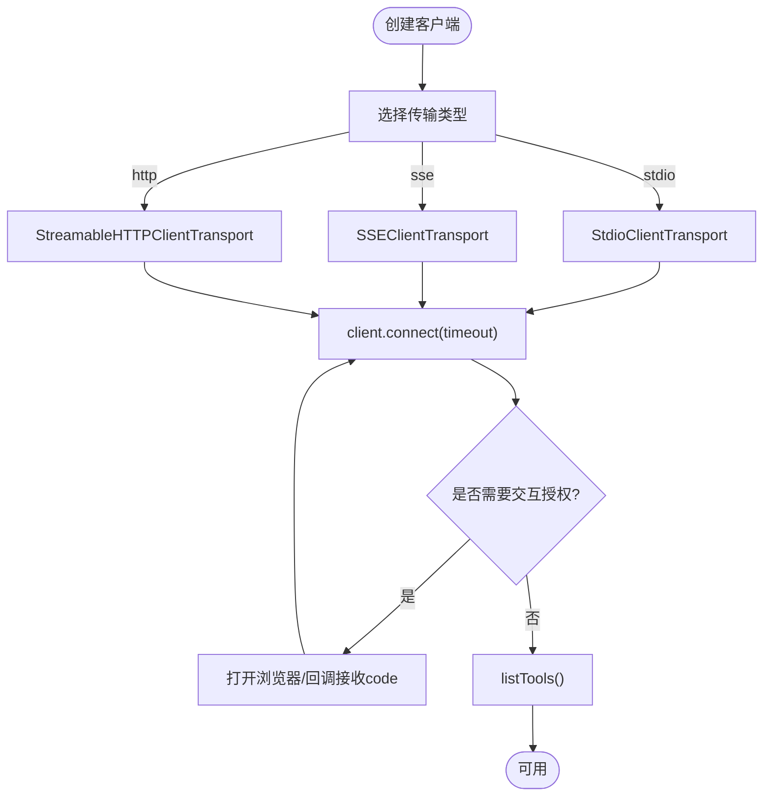
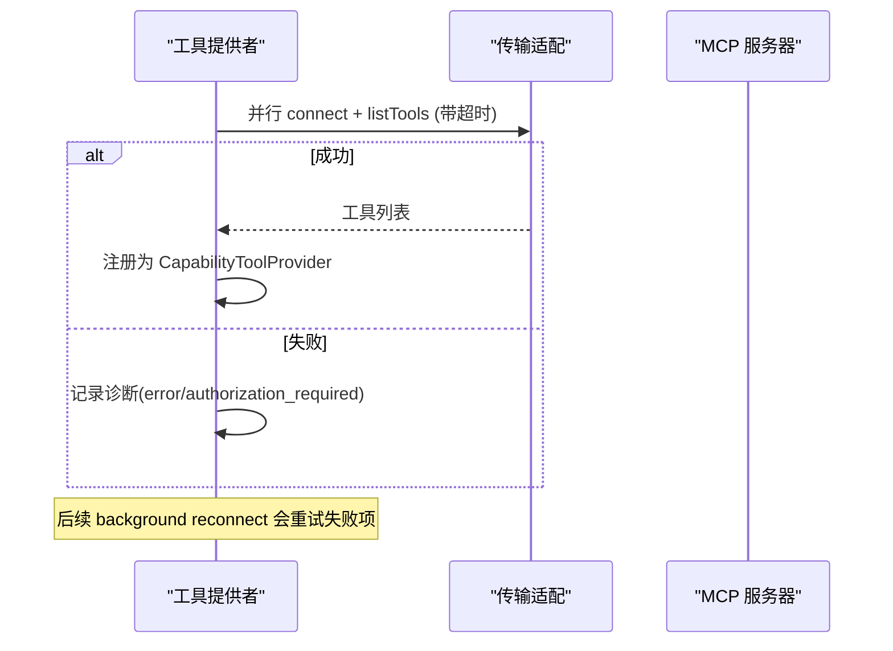
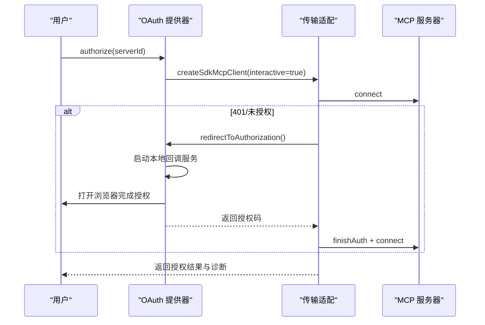
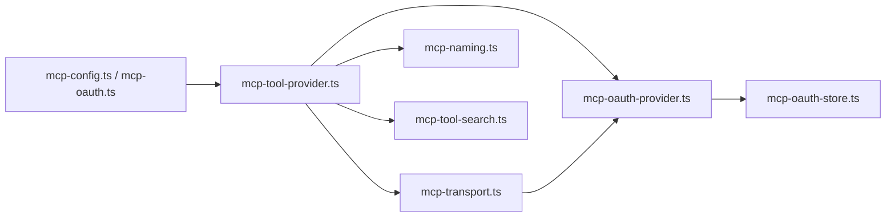

# MCP协议支持

<cite>
**本文引用的文件**
- [project-mcp-skills.md](file://docs/project-mcp-skills.md)
- [mcp-tool-provider.ts](file://kun/src/adapters/tool/mcp-tool-provider.ts)
- [mcp-transport.ts](file://kun/src/adapters/tool/mcp-transport.ts)
- [mcp-types.ts](file://kun/src/adapters/tool/mcp-types.ts)
- [mcp-oauth-provider.ts](file://kun/src/adapters/tool/mcp-oauth-provider.ts)
- [mcp-oauth-store.ts](file://kun/src/adapters/tool/mcp-oauth-store.ts)
- [mcp-naming.ts](file://kun/src/adapters/tool/mcp-naming.ts)
- [mcp-config.ts](file://kun/src/server/routes/mcp-config.ts)
- [mcp-oauth.ts](file://kun/src/server/routes/mcp-oauth.ts)
- [architecture.md](file://docs/extensions/architecture.md)
</cite>

## 目录
1. [简介](#简介)
2. [项目结构](#项目结构)
3. [核心组件](#核心组件)
4. [架构总览](#架构总览)
5. [详细组件分析](#详细组件分析)
6. [依赖关系分析](#依赖关系分析)
7. [性能与可靠性](#性能与可靠性)
8. [故障排除指南](#故障排除指南)
9. [结论](#结论)
10. [附录：版本管理与迁移](#附录：版本管理与迁移)

## 简介
本文件系统性说明 DeepSeek-GUI（Kun）对 Model Context Protocol（MCP）的集成实现，覆盖传输层、消息格式、工具发现与服务注册、OAuth 认证流程与安全性、客户端/服务端示例、与现有工具系统的集成方式、兼容性以及调试与排障方法。文档基于仓库内实际源码与文档进行提炼，避免臆测。

## 项目结构
MCP 能力主要分布在以下模块：
- 适配器层：将 MCP 服务器暴露为 Kun 的工具提供者，负责连接、工具目录、调用封装、重连与诊断。
- 传输层：基于官方 SDK 抽象 stdio、SSE、streamable-http 三种传输，并注入 OAuth 能力。
- OAuth 层：本地回调服务、令牌持久化、授权状态诊断与清理。
- 命名与信任：工具名规范化、工作区可见性与信任范围控制。
- 配置与路由：通过运行时 HTTP API 列出/更新 MCP 配置与 OAuth 诊断。
- 项目级配置：以 .kun/project.json 声明项目级 MCP 服务器与 Skills。

图表来源
- [mcp-tool-provider.ts:174-490](file://kun/src/adapters/tool/mcp-tool-provider.ts#L174-L490)
- [mcp-transport.ts:56-160](file://kun/src/adapters/tool/mcp-transport.ts#L56-L160)
- [mcp-oauth-provider.ts:60-187](file://kun/src/adapters/tool/mcp-oauth-provider.ts#L60-L187)
- [mcp-oauth-store.ts:45-111](file://kun/src/adapters/tool/mcp-oauth-store.ts#L45-L111)
- [mcp-naming.ts:12-28](file://kun/src/adapters/tool/mcp-naming.ts#L12-L28)
- [mcp-config.ts:11-43](file://kun/src/server/routes/mcp-config.ts#L11-L43)
- [mcp-oauth.ts:5-18](file://kun/src/server/routes/mcp-oauth.ts#L5-L18)

章节来源
- [project-mcp-skills.md:1-113](file://docs/project-mcp-skills.md#L1-L113)
- [architecture.md:1-124](file://docs/extensions/architecture.md#L1-L124)

## 核心组件
- 工具提供者构建器：并行连接所有 MCP 服务器，列举工具，生成 CapabilityToolProvider，维护连接状态、诊断与后台重连。
- 传输适配：创建 SDK Client，选择 stdio/SSE/streamable-http 传输，处理连接超时、错误分类、生命周期钩子与可选交互授权。
- OAuth 提供器：实现 SDK 的 OAuthClientProvider，启动本地回调服务，持久化令牌与发现状态，输出诊断。
- OAuth 存储：原子写入 JSON 文件，支持可选加密，记录令牌获取时间与最近错误。
- 命名与信任：规范化工具名，按工作区根与信任范围控制可见性与可用性。
- HTTP 路由：暴露 MCP 配置查询/更新与 OAuth 诊断/清理/授权接口。

章节来源
- [mcp-tool-provider.ts:174-490](file://kun/src/adapters/tool/mcp-tool-provider.ts#L174-L490)
- [mcp-transport.ts:56-160](file://kun/src/adapters/tool/mcp-transport.ts#L56-L160)
- [mcp-oauth-provider.ts:60-187](file://kun/src/adapters/tool/mcp-oauth-provider.ts#L60-L187)
- [mcp-oauth-store.ts:45-111](file://kun/src/adapters/tool/mcp-oauth-store.ts#L45-L111)
- [mcp-naming.ts:12-28](file://kun/src/adapters/tool/mcp-naming.ts#L12-L28)
- [mcp-config.ts:11-43](file://kun/src/server/routes/mcp-config.ts#L11-L43)
- [mcp-oauth.ts:5-18](file://kun/src/server/routes/mcp-oauth.ts#L5-L18)

## 架构总览
MCP 在 Kun 中以“工具提供者”的形式接入 Agent 工具系统。启动时并行连接各服务器，列举工具并注册到能力注册表；调用时通过统一封装执行，具备自动重连与错误分类；远程服务器若需要 OAuth，则在非交互模式下抛出“需授权”信号，由用户触发授权流程后即时重新连接并注册工具。

图表来源
- [mcp-tool-provider.ts:220-336](file://kun/src/adapters/tool/mcp-tool-provider.ts#L220-L336)
- [mcp-transport.ts:56-160](file://kun/src/adapters/tool/mcp-transport.ts#L56-L160)
- [mcp-oauth-provider.ts:130-187](file://kun/src/adapters/tool/mcp-oauth-provider.ts#L130-L187)

## 详细组件分析

### 传输层实现与通信机制
- 支持的传输：stdio、SSE、streamable-http。根据配置动态选择，并为 HTTP 类传输注入请求头与环境变量解析。
- 连接与超时：connect 使用服务器配置的 timeoutMs；启动阶段有独立超时保护，防止单个慢服务器阻塞整体就绪。
- 生命周期与错误：默认 onerror 处理器打印脱敏后的传输错误；上层可替换为自定义生命周期钩子驱动重连状态机。
- 资源与提示：当底层 SDK 暴露 listResources/readResource/listPrompts/getPrompt 时，透传至统一客户端接口。

图表来源
- [mcp-transport.ts:204-232](file://kun/src/adapters/tool/mcp-transport.ts#L204-L232)
- [mcp-transport.ts:56-160](file://kun/src/adapters/tool/mcp-transport.ts#L56-L160)

章节来源
- [mcp-transport.ts:56-160](file://kun/src/adapters/tool/mcp-transport.ts#L56-L160)
- [mcp-transport.ts:204-232](file://kun/src/adapters/tool/mcp-transport.ts#L204-L232)

### 消息格式与工具描述
- 工具描述：包含名称、标题、描述、输入/输出 Schema、注解（只读/破坏性/幂等/开放世界）、图标与元数据。
- 资源与模板：URI、名称、描述、MIME、大小与注解。
- 提示：名称、参数列表与描述。
- 客户端接口：统一的 listTools/callTool 及可选的资源/提示枚举与读取接口，均支持 cursor 分页、AbortSignal 与超时。

章节来源
- [mcp-types.ts:3-95](file://kun/src/adapters/tool/mcp-types.ts#L3-L95)

### 工具发现机制与服务注册
- 启动并行连接：对所有启用的服务器并发建立连接并列举工具，设置启动超时以避免阻塞。
- 工具注册：将 MCP 工具映射为 LocalTool，名称规范化为 mcp_<serverId>_<toolName>，并注入策略与可见性检查。
- 搜索网关：当工具数量达到阈值且存在已连接服务器时，启用 MCP 搜索提供者，聚合目录并支持刷新。
- 背景重连：对启动失败的服务器执行指数退避重试，成功后动态注册并提供诊断翻转。

图表来源
- [mcp-tool-provider.ts:220-336](file://kun/src/adapters/tool/mcp-tool-provider.ts#L220-L336)
- [mcp-tool-provider.ts:456-605](file://kun/src/adapters/tool/mcp-tool-provider.ts#L456-L605)

章节来源
- [mcp-tool-provider.ts:220-336](file://kun/src/adapters/tool/mcp-tool-provider.ts#L220-L336)
- [mcp-tool-provider.ts:456-605](file://kun/src/adapters/tool/mcp-tool-provider.ts#L456-L605)

### OAuth 认证流程与安全性
- 交互模式：仅在显式授权入口开启，避免启动时弹出浏览器；非交互模式下直接抛出“需授权”错误。
- 回调服务：本地 loopback 服务器监听固定路径，校验 state 与 code，超时与错误均有明确响应。
- 持久化：令牌、客户端信息、PKCE verifier、发现状态原子写入文件，支持可选加密；记录获取时间与最近错误。
- 诊断：导出 enabled/configured/url/status/token/scope/expiresAt/lastError 等字段，便于 GUI 展示。
- 安全要点：
  - 非交互启动不打开浏览器，防止意外弹窗。
  - 回调仅接受 http/https，严格校验 state。
  - 文件权限受限，支持可选加密存储。
  - 头部环境变量引用在运行时解析，避免泄露配置中的明文。

图表来源
- [mcp-oauth-provider.ts:130-187](file://kun/src/adapters/tool/mcp-oauth-provider.ts#L130-L187)
- [mcp-transport.ts:169-202](file://kun/src/adapters/tool/mcp-transport.ts#L169-L202)
- [mcp-oauth-store.ts:45-111](file://kun/src/adapters/tool/mcp-oauth-store.ts#L45-L111)

章节来源
- [mcp-oauth-provider.ts:60-187](file://kun/src/adapters/tool/mcp-oauth-provider.ts#L60-L187)
- [mcp-oauth-store.ts:45-111](file://kun/src/adapters/tool/mcp-oauth-store.ts#L45-L111)
- [mcp-transport.ts:169-202](file://kun/src/adapters/tool/mcp-transport.ts#L169-L202)

### 与现有工具系统的集成与兼容性
- 工具注册：MCP 工具被包装为 LocalTool，纳入 CapabilityRegistry，遵循统一的审批、取消、输出限制与历史顺序。
- 可见性与信任：通过工作区根与 trustScope 控制是否可见与可用，确保跨项目隔离。
- 扩展边界：遵循扩展平台约束，不创建第二套 Agent runtime，工具调用仍经由 ToolHost 与 Provider 路由。

章节来源
- [mcp-tool-provider.ts:616-663](file://kun/src/adapters/tool/mcp-tool-provider.ts#L616-L663)
- [mcp-naming.ts:12-28](file://kun/src/adapters/tool/mcp-naming.ts#L12-L28)
- [architecture.md:83-90](file://docs/extensions/architecture.md#L83-L90)

### 客户端与服务端实现示例
- 客户端（Kun 侧）：通过 buildMcpToolProviders 构建提供者，startBackgroundReconnect 启动后台重连，authorizeOAuth 触发交互授权，clearOAuthCredentials 清理凭据。
- 服务端（MCP 服务器）：任意实现 MCP 协议的进程或服务，暴露 tools/resources/prompts；可通过 stdio、SSE 或 streamable-http 接入。
- 项目级配置：在 .kun/project.json 中声明 servers（transport/command/args/url/env/oauth/timeoutMs），并通过 Settings 批准信任。

章节来源
- [mcp-tool-provider.ts:174-490](file://kun/src/adapters/tool/mcp-tool-provider.ts#L174-L490)
- [project-mcp-skills.md:13-49](file://docs/project-mcp-skills.md#L13-L49)
- [project-mcp-skills.md:78-95](file://docs/project-mcp-skills.md#L78-L95)

## 依赖关系分析
- 工具提供者依赖传输适配、OAuth 提供器、命名与信任、搜索提供者与本地工具宿主。
- 传输适配依赖官方 SDK 的 Client 与各传输实现，并组合 OAuth 提供器。
- OAuth 提供器依赖本地回调服务与文件存储，对外暴露诊断与清理能力。
- HTTP 路由依赖运行时上下文提供的 MCP 配置与 OAuth 能力。

图表来源
- [mcp-tool-provider.ts:174-490](file://kun/src/adapters/tool/mcp-tool-provider.ts#L174-L490)
- [mcp-transport.ts:56-160](file://kun/src/adapters/tool/mcp-transport.ts#L56-L160)
- [mcp-oauth-provider.ts:60-187](file://kun/src/adapters/tool/mcp-oauth-provider.ts#L60-L187)
- [mcp-oauth-store.ts:45-111](file://kun/src/adapters/tool/mcp-oauth-store.ts#L45-L111)
- [mcp-config.ts:11-43](file://kun/src/server/routes/mcp-config.ts#L11-L43)
- [mcp-oauth.ts:5-18](file://kun/src/server/routes/mcp-oauth.ts#L5-L18)

章节来源
- [mcp-tool-provider.ts:174-490](file://kun/src/adapters/tool/mcp-tool-provider.ts#L174-L490)
- [mcp-transport.ts:56-160](file://kun/src/adapters/tool/mcp-transport.ts#L56-L160)
- [mcp-oauth-provider.ts:60-187](file://kun/src/adapters/tool/mcp-oauth-provider.ts#L60-L187)
- [mcp-oauth-store.ts:45-111](file://kun/src/adapters/tool/mcp-oauth-store.ts#L45-L111)
- [mcp-config.ts:11-43](file://kun/src/server/routes/mcp-config.ts#L11-L43)
- [mcp-oauth.ts:5-18](file://kun/src/server/routes/mcp-oauth.ts#L5-L18)

## 性能与可靠性
- 启动优化：并行连接与独立启动超时，避免单台慢服务器阻塞整体就绪。
- 重连策略：指数退避与最大尝试次数，失败项在后台持续重试，成功后动态注册。
- 错误分类：区分业务错误与传输错误，仅对传输错误进行重连与可能的重试；非幂等调用中断时报告“状态未知”，避免重复副作用。
- 资源管理：统一关闭客户端，避免泄漏；回调服务一次性运行并在完成后释放。

章节来源
- [mcp-tool-provider.ts:220-336](file://kun/src/adapters/tool/mcp-tool-provider.ts#L220-L336)
- [mcp-tool-provider.ts:456-605](file://kun/src/adapters/tool/mcp-tool-provider.ts#L456-L605)
- [mcp-tool-provider.ts:705-793](file://kun/src/adapters/tool/mcp-tool-provider.ts#L705-L793)

## 故障排除指南
- 常见问题定位：
  - 连接失败：检查 transport、command/args/url、headers 环境变量解析是否正确。
  - 授权失败：确认 OAuth 配置、回调端口可达、state/code 匹配、超时设置合理。
  - 工具不可见：检查工作区根与 trustScope 是否允许当前工作区访问。
  - 启动阻塞：排查某服务器冷启动过慢，必要时调整 startupConnectTimeoutMs。
- 诊断接口：
  - 列出/更新 MCP 配置：GET/PUT/PATCH /v1/mcp-config（由运行时路由提供）。
  - OAuth 诊断与清理：GET/POST /v1/mcp-oauth（列出、清理、授权）。
- 日志与输出：
  - 传输错误会写入 stderr 并脱敏；工具调用错误会被分类并记录到诊断对象。
  - OAuth 提供器记录 lastError/lastErrorAt，便于 GUI 解释失败原因。

章节来源
- [mcp-config.ts:11-43](file://kun/src/server/routes/mcp-config.ts#L11-L43)
- [mcp-oauth.ts:5-18](file://kun/src/server/routes/mcp-oauth.ts#L5-L18)
- [mcp-transport.ts:62-72](file://kun/src/adapters/tool/mcp-transport.ts#L62-L72)
- [mcp-oauth-provider.ts:207-248](file://kun/src/adapters/tool/mcp-oauth-provider.ts#L207-L248)

## 结论
DeepSeek-GUI 对 MCP 的支持以“工具提供者”为核心，结合多传输适配、OAuth 认证、原子化凭证存储与健壮的重连机制，将外部 MCP 服务器无缝融入 Kun 的工具生态。通过项目级配置与工作区信任模型，既保证了灵活性又确保了安全性。HTTP 路由提供了运维与调试所需的最小接口集，便于集成到 GUI 与自动化流程中。

## 附录：版本管理与迁移
- 项目级配置版本：.kun/project.json 要求 version 字段，未知版本将被拒绝，保证向后兼容。
- 信任生命周期：项目文件变更需重新审阅与批准，digest 绑定生效；撤销后将移除本地授权并停止相关提供者。
- 兼容性：项目配置为用户级配置的叠加；缺失项目文件时回退到用户级配置与插件技能。
- 迁移建议：
  - 将敏感信息从项目配置移至用户级配置，并使用可信工作区根限制范围。
  - 逐步启用搜索网关，利用工具目录指纹检测漂移。
  - 对远程服务器优先使用 streamable-http 或 SSE，以获得更好的网络鲁棒性。

章节来源
- [project-mcp-skills.md:13-49](file://docs/project-mcp-skills.md#L13-L49)
- [project-mcp-skills.md:78-113](file://docs/project-mcp-skills.md#L78-L113)