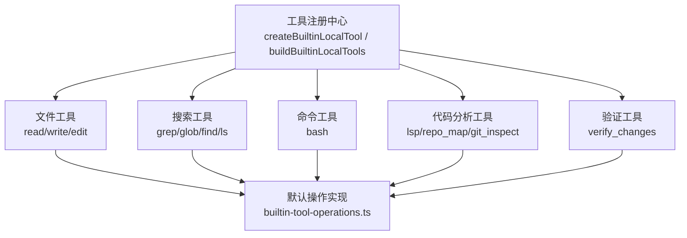
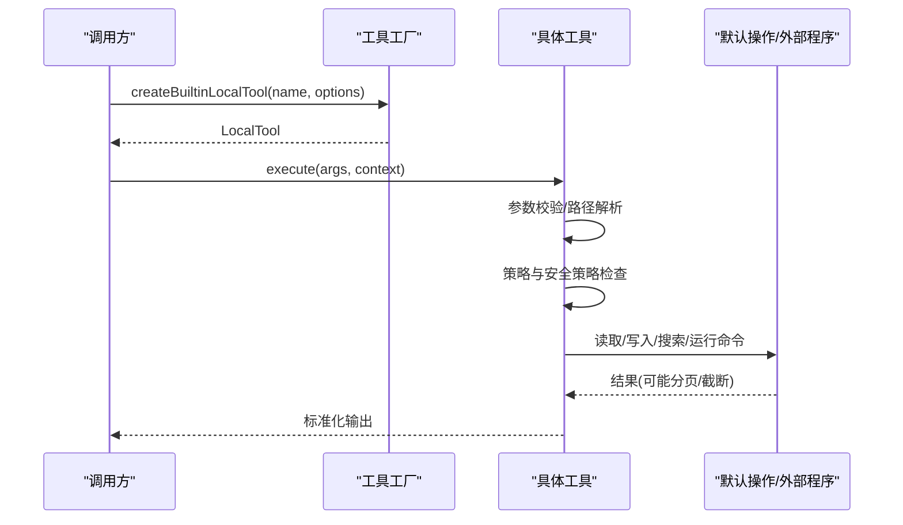
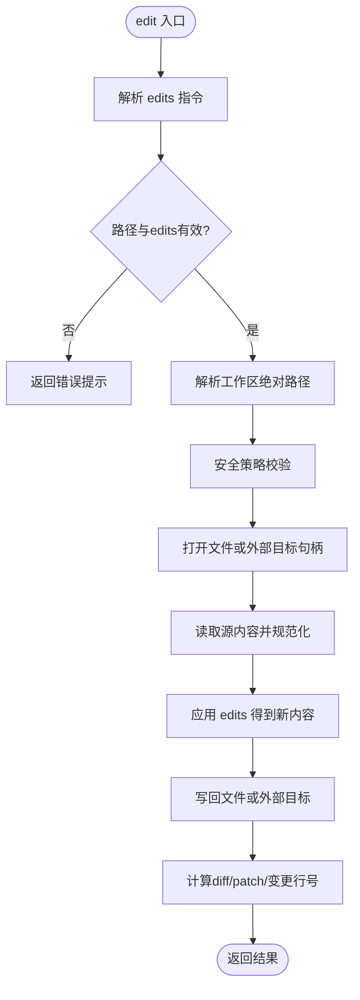
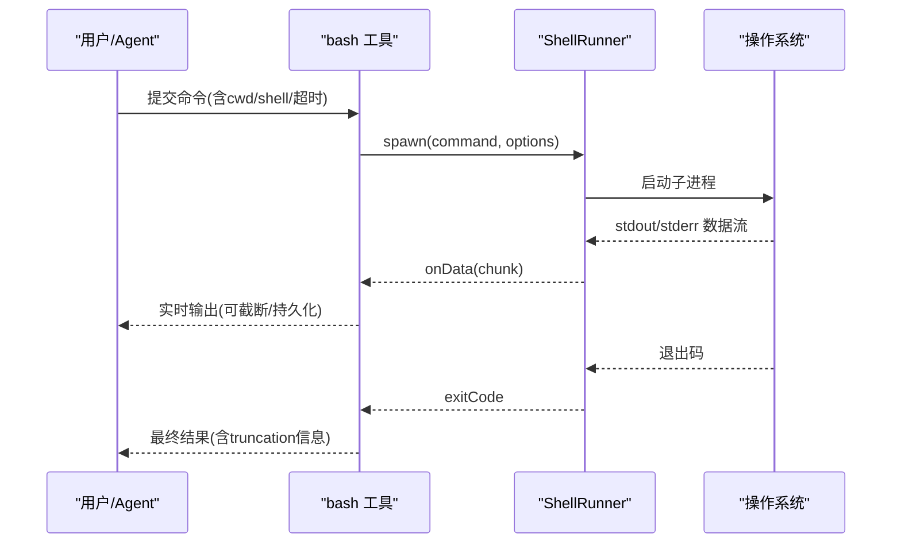
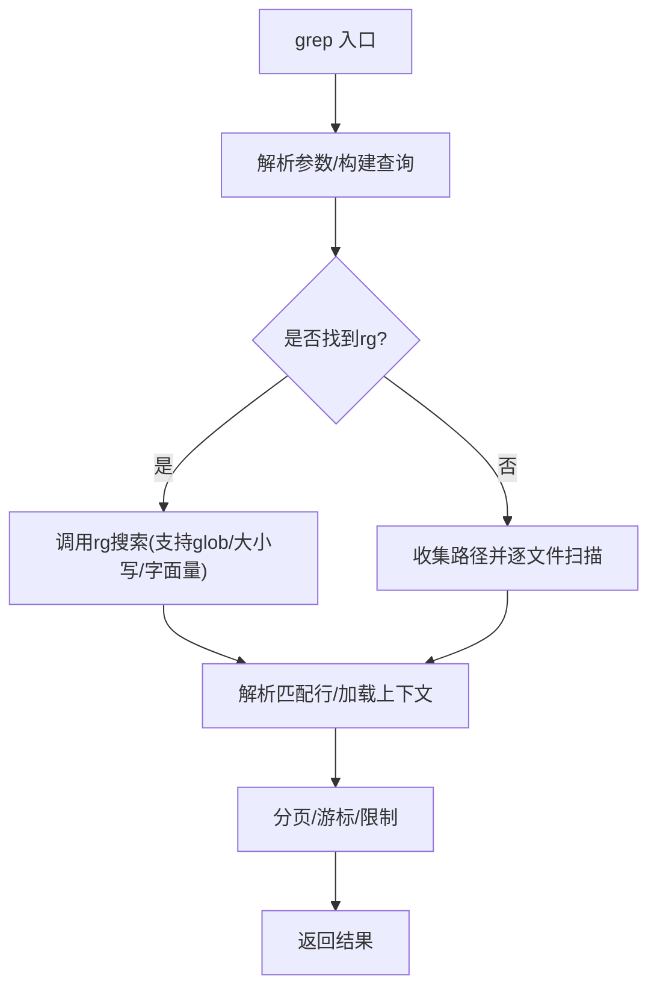
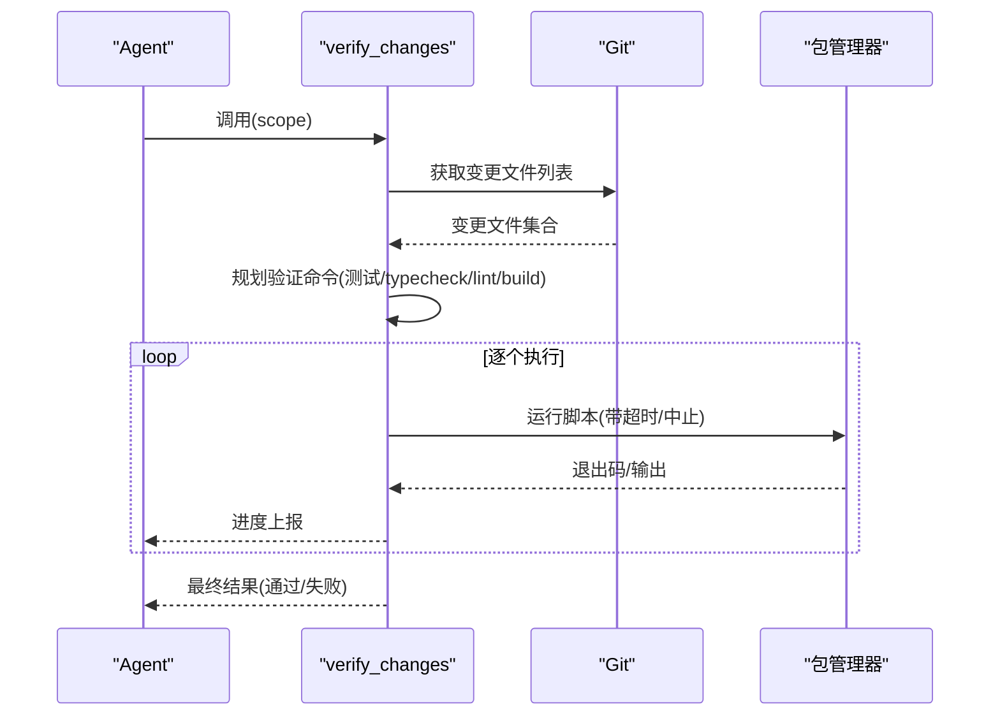
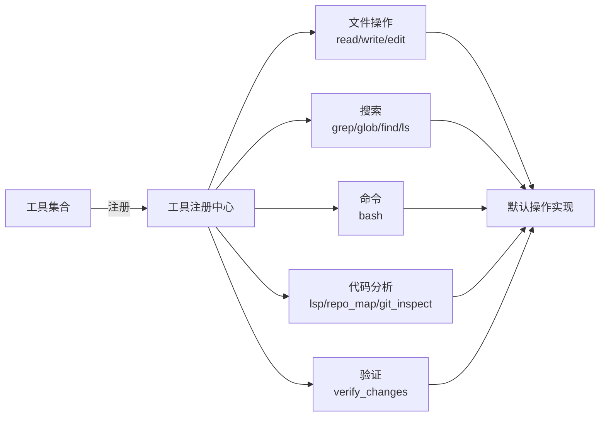

# 内置工具集

<cite>
**本文引用的文件**
- [builtin-tools.ts](file://kun/src/adapters/tool/builtin-tools.ts)
- [builtin-file-tools.ts](file://kun/src/adapters/tool/builtin-file-tools.ts)
- [builtin-search-tools.ts](file://kun/src/adapters/tool/builtin-search-tools.ts)
- [builtin-lsp-tool.ts](file://kun/src/adapters/tool/builtin-lsp-tool.ts)
- [builtin-git-inspect-tool.ts](file://kun/src/adapters/tool/builtin-git-inspect-tool.ts)
- [builtin-read-tool.ts](file://kun/src/adapters/tool/builtin-read-tool.ts)
- [builtin-repo-map-tool.ts](file://kun/src/adapters/tool/builtin-repo-map-tool.ts)
- [builtin-verify-tool.ts](file://kun/src/adapters/tool/builtin-verify-tool.ts)
- [builtin-bash-tool.ts](file://kun/src/adapters/tool/builtin-bash-tool.ts)
- [builtin-tool-types.ts](file://kun/src/adapters/tool/builtin-tool-types.ts)
- [builtin-tool-operations.ts](file://kun/src/adapters/tool/builtin-tool-operations.ts)
</cite>

## 目录
1. [简介](#简介)
2. [项目结构](#项目结构)
3. [核心组件](#核心组件)
4. [架构总览](#架构总览)
5. [详细组件分析](#详细组件分析)
6. [依赖关系分析](#依赖关系分析)
7. [性能考虑](#性能考虑)
8. [故障排除指南](#故障排除指南)
9. [结论](#结论)
10. [附录](#附录)

## 简介
本文件为 DeepSeek-GUI 的内置工具集提供系统化文档，覆盖文件操作（read、write、edit）、命令行（bash）、搜索（grep、glob、find、ls）、代码分析（lsp、repo_map、git_inspect）与验证（verify_changes）等工具的参数、使用场景、最佳实践、安全限制、执行环境、性能优化与故障排除。所有说明均基于仓库源码实现，便于在工程内定位具体逻辑。

## 项目结构
内置工具统一通过工厂函数注册并暴露，支持按能力组合（如只读工具集、编码工具集）。各工具以 LocalTool 形式定义，具备输入 Schema、策略（auto/on-request）、副作用标记与 execute 执行体。



图表来源
- [builtin-tools.ts:29-87](file://kun/src/adapters/tool/builtin-tools.ts#L29-L87)
- [builtin-tool-operations.ts:124-185](file://kun/src/adapters/tool/builtin-tool-operations.ts#L124-L185)

章节来源
- [builtin-tools.ts:1-153](file://kun/src/adapters/tool/builtin-tools.ts#L1-L153)
- [builtin-tool-types.ts:100-220](file://kun/src/adapters/tool/builtin-tool-types.ts#L100-L220)

## 核心组件
- 文件操作：read、write、edit
- 命令行：bash
- 搜索：grep、glob、find、ls
- 代码分析：lsp、repo_map、git_inspect
- 验证：verify_changes

这些工具由统一的工厂创建，并通过类型系统约束参数与行为。

章节来源
- [builtin-tools.ts:29-153](file://kun/src/adapters/tool/builtin-tools.ts#L29-L153)
- [builtin-tool-types.ts:100-220](file://kun/src/adapters/tool/builtin-tool-types.ts#L100-L220)

## 架构总览
工具调用流程遵循“参数校验 → 路径解析 → 策略与安全检查 → 执行 → 结果分页/截断”的统一模式。部分工具会启动外部进程（如 rg/fd/git/LSP），并受超时、输出大小、中止信号等保护。



图表来源
- [builtin-tools.ts:29-87](file://kun/src/adapters/tool/builtin-tools.ts#L29-L87)
- [builtin-search-tools.ts:88-191](file://kun/src/adapters/tool/builtin-search-tools.ts#L88-L191)
- [builtin-bash-tool.ts:141-306](file://kun/src/adapters/tool/builtin-bash-tool.ts#L141-L306)

## 详细组件分析

### 文件操作工具：read、write、edit
- read
  - 功能：分页读取文本或图片；大文件流式读取；自动识别图片并可选缩放；支持 revision 一致性检查。
  - 关键参数：path、offset、limit、expected_revision；可配置 maxLines/maxBytes/maxFileBytes/autoResizeImages。
  - 安全与限制：二进制文件拒绝；超大文件走流式；图像尺寸/字节上限；上下文预算控制返回行数。
  - 典型用法：先 ls/grep 定位文件，再 read 分页阅读；对图片启用 autoResizeImages 避免过大 payload。
  - 参考路径：[read 工具实现:16-229](file://kun/src/adapters/tool/builtin-read-tool.ts#L16-L229)、[大文件流式读取:234-307](file://kun/src/adapters/tool/builtin-read-tool.ts#L234-L307)
- write
  - 功能：创建或覆盖工作区文件；支持外部已批准目标的安全写入。
  - 关键参数：path、content；可注入 mkdir/writeFile/openExternal 操作。
  - 安全与限制：仅允许白名单外部路径；写前校验 inode/device/nlink/父目录；原子化 truncate。
  - 典型用法：生成骨架文件后多次 edit 增量修改；避免单次超大 JSON 导致模型输出被截断。
  - 参考路径：[write 工具实现:114-169](file://kun/src/adapters/tool/builtin-file-tools.ts#L114-L169)
- edit
  - 功能：精确文本替换，支持一次多段 edits；保留行尾风格与 BOM；输出 diff/patch。
  - 关键参数：path、oldText/newText 或 edits[]；可注入 readFile/writeFile/openExternal。
  - 安全与限制：同 write 的外部目标校验；编辑队列防并发冲突。
  - 典型用法：小步快改，保持 diff 可读；结合 repo_map/lsp 定位替换点。
  - 参考路径：[edit 工具实现:171-256](file://kun/src/adapters/tool/builtin-file-tools.ts#L171-L256)



图表来源
- [builtin-file-tools.ts:171-256](file://kun/src/adapters/tool/builtin-file-tools.ts#L171-L256)

章节来源
- [builtin-read-tool.ts:16-307](file://kun/src/adapters/tool/builtin-read-tool.ts#L16-L307)
- [builtin-file-tools.ts:114-256](file://kun/src/adapters/tool/builtin-file-tools.ts#L114-L256)
- [builtin-tool-operations.ts:167-175](file://kun/src/adapters/tool/builtin-tool-operations.ts#L167-L175)

### 命令行工具：bash
- 功能：执行 shell 命令；支持后台会话、实时输出、超时、中止、输出截断与持久化。
- 关键参数：command、cwd、shell、timeout、maxLines/maxBytes、后台会话限制等。
- 安全与限制：超时保护、进程树终止、输出大小限制、后台会话容量限制（全局/每线程）。
- 典型用法：构建/测试/脚本任务；长任务用 background=true 启动并轮询状态。
- 参考路径：[bash 执行主流程:141-306](file://kun/src/adapters/tool/builtin-bash-tool.ts#L141-L306)、[后台会话管理:646-800](file://kun/src/adapters/tool/builtin-bash-tool.ts#L646-L800)



图表来源
- [builtin-bash-tool.ts:141-306](file://kun/src/adapters/tool/builtin-bash-tool.ts#L141-L306)

章节来源
- [builtin-bash-tool.ts:1-800](file://kun/src/adapters/tool/builtin-bash-tool.ts#L1-L800)
- [builtin-tool-operations.ts:131-165](file://kun/src/adapters/tool/builtin-tool-operations.ts#L131-L165)

### 搜索工具：grep、glob、find、ls
- grep
  - 功能：全文搜索匹配行，支持忽略大小写、字面量匹配、上下文行、glob 过滤、游标分页。
  - 关键参数：pattern、path、glob、ignoreCase、literal、context、limit、cursor。
  - 性能：优先使用 rg；回退到扫描；单文件/总字节限制；跳过二进制与大文件。
  - 参考路径：[grep 工具实现:257-464](file://kun/src/adapters/tool/builtin-search-tools.ts#L257-L464)
- glob/find
  - 功能：按 glob 模式查找文件；支持 fd/rg/扫描三种后端；游标分页。
  - 关键参数：pattern、path、limit、cursor；可注入自定义 glob 操作。
  - 参考路径：[glob/find 工具实现:79-197](file://kun/src/adapters/tool/builtin-search-tools.ts#L79-L197)
- ls
  - 功能：列出目录内容，标注目录，排序输出；支持 limit。
  - 参考路径：[ls 工具实现:28-77](file://kun/src/adapters/tool/builtin-search-tools.ts#L28-L77)



图表来源
- [builtin-search-tools.ts:257-464](file://kun/src/adapters/tool/builtin-search-tools.ts#L257-L464)

章节来源
- [builtin-search-tools.ts:28-464](file://kun/src/adapters/tool/builtin-search-tools.ts#L28-L464)
- [builtin-tool-types.ts:188-208](file://kun/src/adapters/tool/builtin-tool-types.ts#L188-L208)

### 代码分析工具：lsp、repo_map、git_inspect
- lsp
  - 功能：调用语言服务器进行跳转定义、查找引用、悬停、文档符号、工作区符号、实现、诊断。
  - 关键参数：operation、filePath、line、character、query；位置 1-based。
  - 行为：按需打开文档；会话复用；结果精简以减少上下文占用。
  - 参考路径：[lsp 工具实现:66-233](file://kun/src/adapters/tool/builtin-lsp-tool.ts#L66-L233)
- repo_map
  - 功能：构建代码库地图，按路径/符号/导入/最近改动评分，返回 Top-N 文件及符号摘要。
  - 关键参数：query、path、maxFiles、maxSymbolsPerFile、maxScanFiles、refresh。
  - 特性：Git 最近文件加权；BM25-like 评分；短 TTL 缓存；跳过常见无关目录。
  - 参考路径：[repo_map 工具实现:114-228](file://kun/src/adapters/tool/builtin-repo-map-tool.ts#L114-L228)
- git_inspect
  - 功能：受限的只读 Git 检查（status/branch/log/grep/show/diff/merge-base/rev-list/rev-parse/ls-files/ls-tree）。
  - 关键参数：operation、args（字符串数组，长度/大小限制）。
  - 安全：禁止危险参数与分支写操作；强制只读语义。
  - 参考路径：[git_inspect 工具实现:44-122](file://kun/src/adapters/tool/builtin-git-inspect-tool.ts#L44-L122)

```mermaid
classDiagram
class LspTool {
+execute(args, context)
-acquireSession()
-openDocument()
-dispatch(operation)
}
class RepoMapTool {
+execute(args, context)
-buildIndex()
-rankFiles()
}
class GitInspectTool {
+execute(input, context)
-parseArgs()
-policyCheck()
}
LspTool --> "调用" LspClient
RepoMapTool --> "调用" Git/FS
GitInspectTool --> "调用" Git
```

图表来源
- [builtin-lsp-tool.ts:66-233](file://kun/src/adapters/tool/builtin-lsp-tool.ts#L66-L233)
- [builtin-repo-map-tool.ts:114-228](file://kun/src/adapters/tool/builtin-repo-map-tool.ts#L114-L228)
- [builtin-git-inspect-tool.ts:44-122](file://kun/src/adapters/tool/builtin-git-inspect-tool.ts#L44-L122)

章节来源
- [builtin-lsp-tool.ts:1-339](file://kun/src/adapters/tool/builtin-lsp-tool.ts#L1-L339)
- [builtin-repo-map-tool.ts:1-741](file://kun/src/adapters/tool/builtin-repo-map-tool.ts#L1-L741)
- [builtin-git-inspect-tool.ts:1-182](file://kun/src/adapters/tool/builtin-git-inspect-tool.ts#L1-L182)

### 验证工具：verify_changes
- 功能：根据工作区变更文件智能选择并执行验证脚本（相邻 Vitest 测试、typecheck、lint、build）。
- 关键参数：scope（focused/full）。
- 行为：检测包管理器与 package.json scripts；去重命令；超时与中止；逐步上报进度。
- 参考路径：[verify_changes 工具实现:40-136](file://kun/src/adapters/tool/builtin-verify-tool.ts#L40-L136)



图表来源
- [builtin-verify-tool.ts:40-136](file://kun/src/adapters/tool/builtin-verify-tool.ts#L40-L136)

章节来源
- [builtin-verify-tool.ts:1-343](file://kun/src/adapters/tool/builtin-verify-tool.ts#L1-L343)

## 依赖关系分析
- 工具注册与组合：通过 createBuiltinLocalTool/buildBuiltinLocalTools 集中装配，支持只读/编码/全量工具集。
- 默认操作抽象：文件系统、图像处理、Shell 执行等通过 operations 接口注入，便于测试与定制。
- 外部依赖：rg/fd（搜索）、git（版本控制）、语言服务器（lsp）、sips（macOS 图像缩放）。



图表来源
- [builtin-tools.ts:29-153](file://kun/src/adapters/tool/builtin-tools.ts#L29-L153)
- [builtin-tool-operations.ts:124-185](file://kun/src/adapters/tool/builtin-tool-operations.ts#L124-L185)

章节来源
- [builtin-tools.ts:1-153](file://kun/src/adapters/tool/builtin-tools.ts#L1-L153)
- [builtin-tool-types.ts:100-220](file://kun/src/adapters/tool/builtin-tool-types.ts#L100-L220)

## 性能考虑
- 搜索与读取
  - 优先使用 rg/fd 提升匹配与遍历速度；合理设置 limit/cursor 分页；利用 sourceResultBudgetTokens 控制输出预算。
  - 大文件采用流式读取与行级预算，避免一次性加载。
- Bash
  - 设置合理的 timeoutSeconds；使用后台会话与输出持久化；注意最大输出字节与行数限制。
- LSP
  - 会话复用减少启动开销；精简结果对象以降低上下文占用。
- Repo Map
  - 使用缓存与 refresh 控制；调整 maxScanFiles/maxFiles；利用 query 提高相关性。
- 验证
  - 聚焦范围（focused）优先运行相邻测试与 typecheck；full 再跑 lint/build；命令去重避免重复执行。

## 故障排除指南
- read
  - 错误：文件过大、二进制、revision 不匹配。处理：缩小范围、改用 grep、重新发起不带 expected_revision 的读取。
  - 参考：[read 错误分支:46-114](file://kun/src/adapters/tool/builtin-read-tool.ts#L46-L114)
- write/edit
  - 错误：外部目标变更、硬链接数异常、参数被截断。处理：重试较小负载、确保路径在白名单、分多次 edit。
  - 参考：[外部目标校验:23-69](file://kun/src/adapters/tool/builtin-file-tools.ts#L23-L69)、[截断参数提示:95-112](file://kun/src/adapters/tool/builtin-file-tools.ts#L95-L112)
- bash
  - 错误：超时、中止、无输出、后台会话超限。处理：缩短命令、增加超时、检查会话配额、查看输出文件。
  - 参考：[超时/中止处理:175-283](file://kun/src/adapters/tool/builtin-bash-tool.ts#L175-L283)、[后台会话限制:111-139](file://kun/src/adapters/tool/builtin-bash-tool.ts#L111-L139)
- grep/glob/find
  - 错误：无效 cursor、未找到 rg/fd、结果过多。处理：修正 cursor、安装 rg/fd、使用 limit/cursor 分页。
  - 参考：[cursor 解析:201-217](file://kun/src/adapters/tool/builtin-search-tools.ts#L201-L217)、[后端选择:131-179](file://kun/src/adapters/tool/builtin-search-tools.ts#L131-L179)
- lsp
  - 错误：未配置语言服务器、无法读取文件、位置参数缺失。处理：安装对应 LSP、传入 1-based line/character。
  - 参考：[lsp 错误分支:106-176](file://kun/src/adapters/tool/builtin-lsp-tool.ts#L106-L176)
- git_inspect
  - 错误：不支持的操作或参数、分支写操作。处理：仅使用只读操作与允许的分支列举参数。
  - 参考：[策略校验:146-181](file://kun/src/adapters/tool/builtin-git-inspect-tool.ts#L146-L181)
- verify_changes
  - 错误：无变更、无脚本、超时。处理：确认工作区有变更、完善 package.json scripts、延长超时或缩小 scope。
  - 参考：[命令规划与执行:138-171](file://kun/src/adapters/tool/builtin-verify-tool.ts#L138-L171)、[执行与超时:278-318](file://kun/src/adapters/tool/builtin-verify-tool.ts#L278-L318)

章节来源
- [builtin-read-tool.ts:46-114](file://kun/src/adapters/tool/builtin-read-tool.ts#L46-L114)
- [builtin-file-tools.ts:23-112](file://kun/src/adapters/tool/builtin-file-tools.ts#L23-L112)
- [builtin-bash-tool.ts:111-283](file://kun/src/adapters/tool/builtin-bash-tool.ts#L111-L283)
- [builtin-search-tools.ts:201-179](file://kun/src/adapters/tool/builtin-search-tools.ts#L201-L179)
- [builtin-lsp-tool.ts:106-176](file://kun/src/adapters/tool/builtin-lsp-tool.ts#L106-L176)
- [builtin-git-inspect-tool.ts:146-181](file://kun/src/adapters/tool/builtin-git-inspect-tool.ts#L146-L181)
- [builtin-verify-tool.ts:138-318](file://kun/src/adapters/tool/builtin-verify-tool.ts#L138-L318)

## 结论
DeepSeek-GUI 的内置工具集围绕“安全、可控、可扩展”设计，提供从文件读写、命令执行、代码搜索到分析与验证的全链路能力。通过统一的工具注册、严格的策略与资源限制、以及丰富的分页与截断机制，既满足复杂工程场景，又保障稳定性与安全性。建议在实际使用中结合 repo_map 与 lsp 精准定位，配合 grep/glob 高效检索，并以 verify_changes 收尾保证质量。

## 附录
- 工具名称与类型定义：参见 [工具类型定义:100-220](file://kun/src/adapters/tool/builtin-tool-types.ts#L100-L220)
- 默认操作实现：参见 [默认操作:124-185](file://kun/src/adapters/tool/builtin-tool-operations.ts#L124-L185)
- 工具装配与组合：参见 [工具装配:29-153](file://kun/src/adapters/tool/builtin-tools.ts#L29-L153)