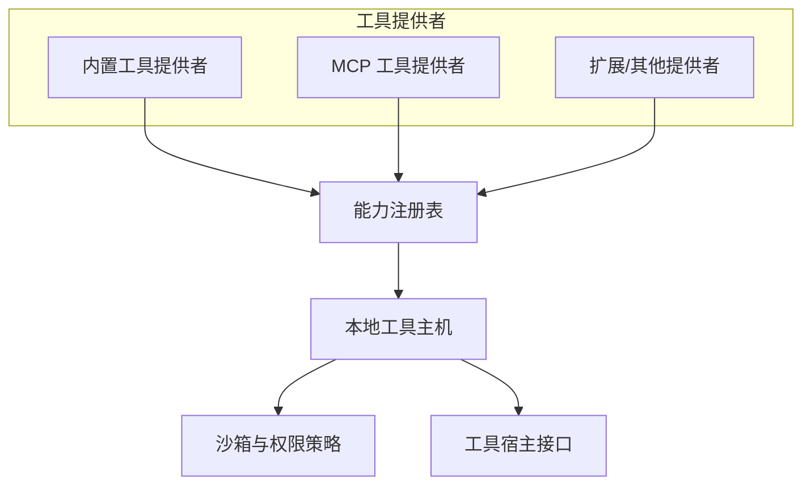
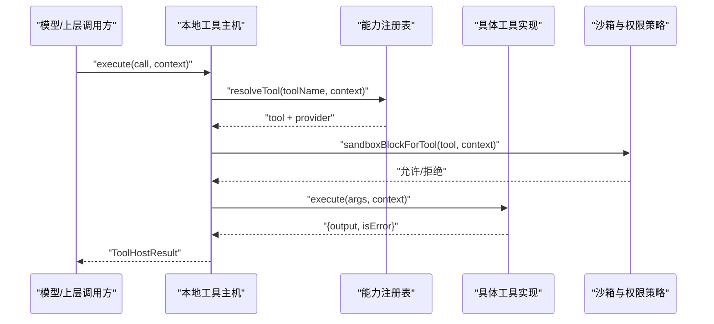
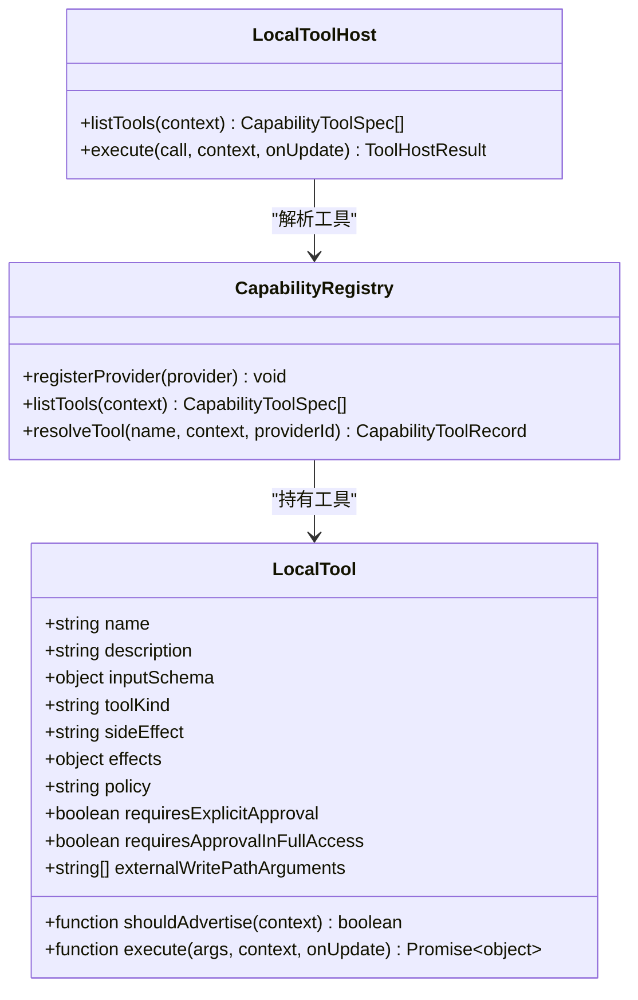
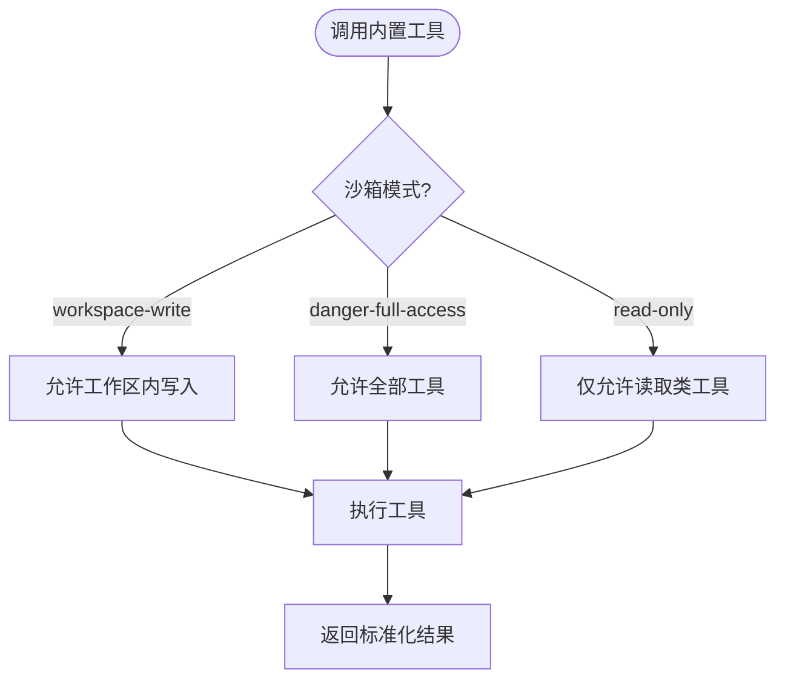
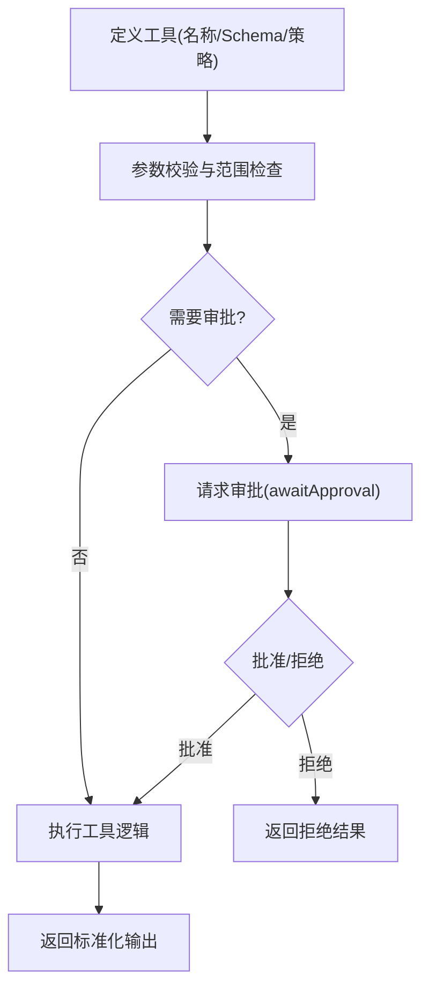
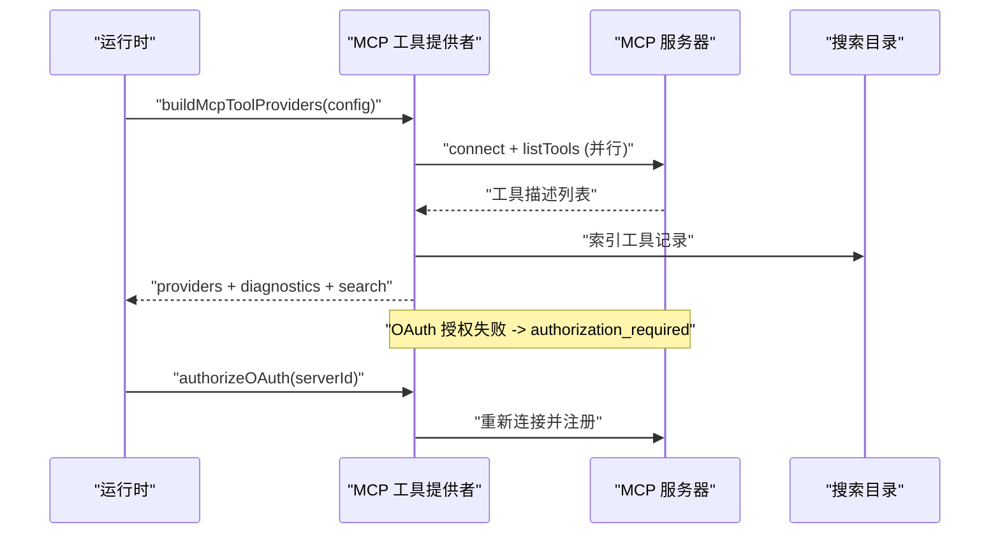
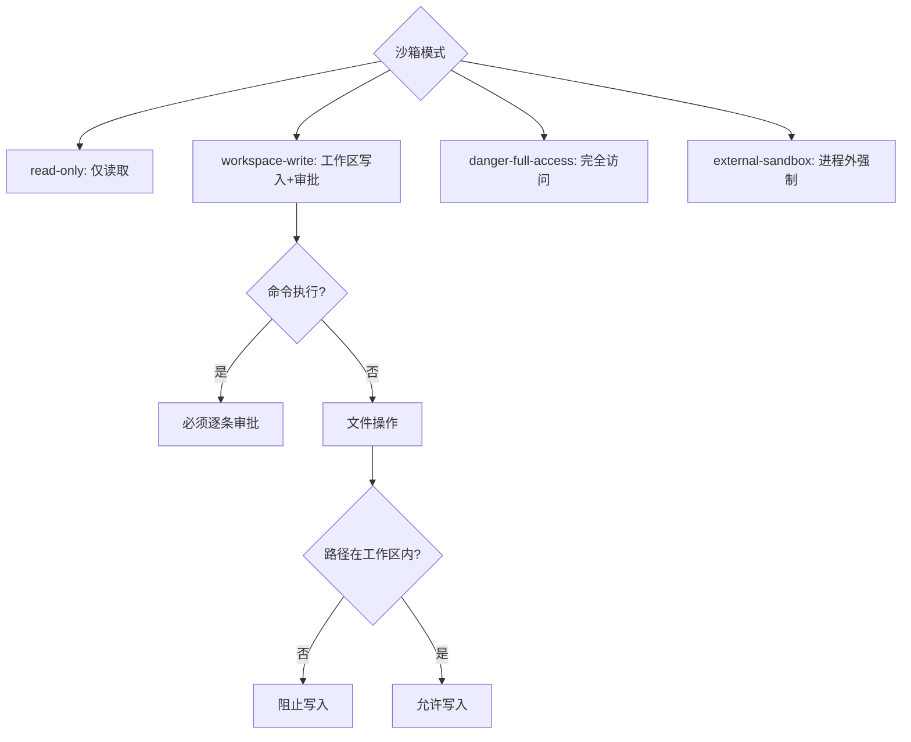
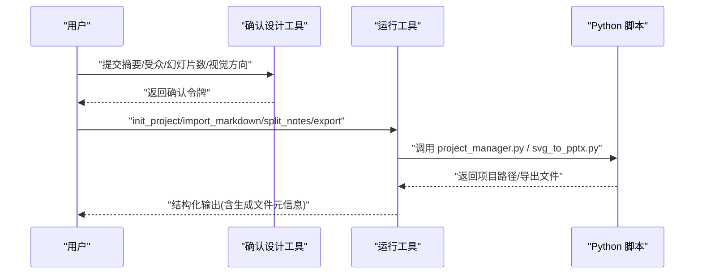
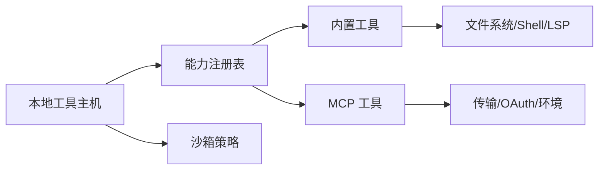

# 工具适配器

<cite>
**本文引用的文件**
- [kun/src/adapters/tool/index.ts](file://kun/src/adapters/tool/index.ts)
- [kun/src/adapters/tool/builtin-tools.ts](file://kun/src/adapters/tool/builtin-tools.ts)
- [kun/src/adapters/tool/local-tool-host.ts](file://kun/src/adapters/tool/local-tool-host.ts)
- [kun/src/adapters/tool/capability-registry.ts](file://kun/src/adapters/tool/capability-registry.ts)
- [kun/src/adapters/tool/sandbox-policy.ts](file://kun/src/adapters/tool/sandbox-policy.ts)
- [kun/src/adapters/tool/mcp-tool-provider.ts](file://kun/src/adapters/tool/mcp-tool-provider.ts)
- [kun/src/adapters/tool/mcp-naming.ts](file://kun/src/adapters/tool/mcp-naming.ts)
- [kun/src/adapters/tool/mcp-oauth-provider.ts](file://kun/src/adapters/tool/mcp-oauth-provider.ts)
- [kun/src/adapters/tool/mcp-transport.ts](file://kun/src/adapters/tool/mcp-transport.ts)
- [kun/src/adapters/tool/mcp-stdio-environment.ts](file://kun/src/adapters/tool/mcp-stdio-environment.ts)
- [kun/src/adapters/tool/mcp-facade-provider.ts](file://kun/src/adapters/tool/mcp-facade-provider.ts)
- [kun/src/adapters/tool/mcp-types.ts](file://kun/src/adapters/tool/mcp-types.ts)
- [kun/src/adapters/tool/builtin-bash-tool.ts](file://kun/src/adapters/tool/builtin-bash-tool.ts)
- [kun/src/adapters/tool/builtin-file-tools.ts](file://kun/src/adapters/tool/builtin-file-tools.ts)
- [kun/src/adapters/tool/builtin-lsp-tool.ts](file://kun/src/adapters/tool/builtin-lsp-tool.ts)
- [kun/src/adapters/tool/builtin-search-tools.ts](file://kun/src/adapters/tool/builtin-search-tools.ts)
- [kun/src/adapters/tool/builtin-repo-map-tool.ts](file://kun/src/adapters/tool/builtin-repo-map-tool.ts)
- [kun/src/adapters/tool/builtin-git-inspect-tool.ts](file://kun/src/adapters/tool/builtin-git-inspect-tool.ts)
- [kun/src/adapters/tool/builtin-verify-tool.ts](file://kun/src/adapters/tool/builtin-verify-tool.ts)
- [kun/src/adapters/tool/ppt-master-tool.ts](file://kun/src/adapters/tool/ppt-master-tool.ts)
- [kun/src/ports/tool-host.ts](file://kun/src/ports/tool-host.ts)
</cite>

## 目录
1. [简介](#简介)
2. [项目结构](#项目结构)
3. [核心组件](#核心组件)
4. [架构总览](#架构总览)
5. [详细组件分析](#详细组件分析)
6. [依赖关系分析](#依赖关系分析)
7. [性能与资源限制](#性能与资源限制)
8. [故障排查指南](#故障排查指南)
9. [结论](#结论)
10. [附录：开发最佳实践与调试技巧](#附录：开发最佳实践与调试技巧)

## 简介
本文件面向 DeepSeek-GUI 的工具适配器系统，系统性说明工具适配器的核心架构、内置工具集、自定义工具开发、MCP（Model Context Protocol）集成、执行环境与安全策略，并提供可操作的调试建议与使用场景。目标是帮助开发者快速理解并扩展工具能力，同时确保在沙箱与权限控制下的安全执行。

## 项目结构
工具适配器位于 kun/src/adapters/tool 目录下，采用“能力提供者 + 本地工具主机 + 注册表”的分层组织方式：
- 能力提供者：封装不同来源的工具集合，如内置工具、MCP 服务器工具、扩展工具等。
- 本地工具主机：统一执行入口，负责审批、沙箱、钩子、重试与结果归一化。
- 注册表：维护工具命名空间、可见性、模式与上下文过滤。

**图示来源**
- [kun/src/adapters/tool/builtin-tools.ts:29-87](file://kun/src/adapters/tool/builtin-tools.ts#L29-L87)
- [kun/src/adapters/tool/mcp-tool-provider.ts:174-337](file://kun/src/adapters/tool/mcp-tool-provider.ts#L174-L337)
- [kun/src/adapters/tool/capability-registry.ts:51-146](file://kun/src/adapters/tool/capability-registry.ts#L51-L146)
- [kun/src/adapters/tool/local-tool-host.ts:143-190](file://kun/src/adapters/tool/local-tool-host.ts#L143-L190)
- [kun/src/adapters/tool/sandbox-policy.ts:128-175](file://kun/src/adapters/tool/sandbox-policy.ts#L128-L175)

**章节来源**
- [kun/src/adapters/tool/index.ts:1-50](file://kun/src/adapters/tool/index.ts#L1-L50)
- [kun/src/adapters/tool/builtin-tools.ts:29-153](file://kun/src/adapters/tool/builtin-tools.ts#L29-L153)
- [kun/src/adapters/tool/capability-registry.ts:51-239](file://kun/src/adapters/tool/capability-registry.ts#L51-L239)
- [kun/src/adapters/tool/local-tool-host.ts:143-190](file://kun/src/adapters/tool/local-tool-host.ts#L143-L190)
- [kun/src/adapters/tool/sandbox-policy.ts:128-175](file://kun/src/adapters/tool/sandbox-policy.ts#L128-L175)

## 核心组件
- LocalTool 与 LocalToolHost：定义工具的最小契约与统一执行流程，包括参数校验、审批流、沙箱检查、前后置钩子、操作日志与输出归一化。
- CapabilityRegistry：管理工具提供者与工具名空间，支持按上下文（工作区、技能、计划模式）过滤与可见性控制。
- 内置工具工厂：集中创建 read、bash、edit、write、grep、glob、find、ls、lsp、repo_map、git_inspect、verify_changes、send_im_attachment 等工具。
- MCP 工具提供者：连接远程或本地 MCP 服务器，发现工具、处理 OAuth、建立连接、错误恢复与后台重连。

**章节来源**
- [kun/src/adapters/tool/local-tool-host.ts:52-109](file://kun/src/adapters/tool/local-tool-host.ts#L52-L109)
- [kun/src/adapters/tool/local-tool-host.ts:143-190](file://kun/src/adapters/tool/local-tool-host.ts#L143-L190)
- [kun/src/adapters/tool/capability-registry.ts:51-146](file://kun/src/adapters/tool/capability-registry.ts#L51-L146)
- [kun/src/adapters/tool/builtin-tools.ts:29-153](file://kun/src/adapters/tool/builtin-tools.ts#L29-L153)
- [kun/src/adapters/tool/mcp-tool-provider.ts:174-337](file://kun/src/adapters/tool/mcp-tool-provider.ts#L174-L337)

## 架构总览
工具调用从模型侧发起，经宿主接口进入本地工具主机；主机根据工具名称解析到具体实现，进行审批与沙箱检查，再执行工具并返回标准化结果。MCP 工具通过提供者动态接入，工具列表由注册表统一管理。

**图示来源**
- [kun/src/adapters/tool/local-tool-host.ts:196-283](file://kun/src/adapters/tool/local-tool-host.ts#L196-L283)
- [kun/src/adapters/tool/capability-registry.ts:148-173](file://kun/src/adapters/tool/capability-registry.ts#L148-L173)
- [kun/src/adapters/tool/sandbox-policy.ts:128-175](file://kun/src/adapters/tool/sandbox-policy.ts#L128-L175)

## 详细组件分析

### 工具接口与注册机制
- LocalTool 定义了工具的名称、描述、输入 Schema、工具种类（工具调用/命令执行/文件变更）、副作用分类、策略（auto/on-request/suggest/never/untrusted）、是否要求显式审批、是否受 shouldAdvertise 控制以及 execute 方法。
- CapabilityRegistry 将多个提供者（内置、MCP、扩展）聚合为统一工具名空间，支持按上下文过滤（工作区、技能、计划模式、客户端表面）。
- 内置工具通过 createBuiltinLocalTool/buildBuiltinLocalTools 等工厂函数集中创建，便于组合只读/编码/全量工具集。

**图示来源**
- [kun/src/adapters/tool/local-tool-host.ts:52-109](file://kun/src/adapters/tool/local-tool-host.ts#L52-L109)
- [kun/src/adapters/tool/capability-registry.ts:51-146](file://kun/src/adapters/tool/capability-registry.ts#L51-L146)
- [kun/src/adapters/tool/builtin-tools.ts:29-153](file://kun/src/adapters/tool/builtin-tools.ts#L29-L153)

**章节来源**
- [kun/src/adapters/tool/local-tool-host.ts:52-109](file://kun/src/adapters/tool/local-tool-host.ts#L52-L109)
- [kun/src/adapters/tool/capability-registry.ts:51-239](file://kun/src/adapters/tool/capability-registry.ts#L51-L239)
- [kun/src/adapters/tool/builtin-tools.ts:29-153](file://kun/src/adapters/tool/builtin-tools.ts#L29-L153)

### 内置工具集
- 文件系统操作：read、write、edit、ls、find、glob、grep，提供安全的读取与写入边界，支持大小限制、路径范围与元数据检测。
- Bash 命令执行：bash、background_shell，在沙箱模式下需要审批，支持超时与并发限制。
- LSP 集成：lsp 工具用于语言服务查询与诊断。
- 仓库与版本控制：repo_map、git_inspect、verify_changes，辅助代码库分析与变更验证。
- IM 附件发送：send_im_attachment，用于即时消息附件上传。

**图示来源**
- [kun/src/adapters/tool/sandbox-policy.ts:128-175](file://kun/src/adapters/tool/sandbox-policy.ts#L128-L175)
- [kun/src/adapters/tool/builtin-tools.ts:71-120](file://kun/src/adapters/tool/builtin-tools.ts#L71-L120)

**章节来源**
- [kun/src/adapters/tool/builtin-tools.ts:29-153](file://kun/src/adapters/tool/builtin-tools.ts#L29-L153)
- [kun/src/adapters/tool/builtin-bash-tool.ts](file://kun/src/adapters/tool/builtin-bash-tool.ts)
- [kun/src/adapters/tool/builtin-file-tools.ts](file://kun/src/adapters/tool/builtin-file-tools.ts)
- [kun/src/adapters/tool/builtin-lsp-tool.ts](file://kun/src/adapters/tool/builtin-lsp-tool.ts)
- [kun/src/adapters/tool/builtin-search-tools.ts](file://kun/src/adapters/tool/builtin-search-tools.ts)
- [kun/src/adapters/tool/builtin-repo-map-tool.ts](file://kun/src/adapters/tool/builtin-repo-map-tool.ts)
- [kun/src/adapters/tool/builtin-git-inspect-tool.ts](file://kun/src/adapters/tool/builtin-git-inspect-tool.ts)
- [kun/src/adapters/tool/builtin-verify-tool.ts](file://kun/src/adapters/tool/builtin-verify-tool.ts)

### 自定义工具开发
- 工具定义：实现 LocalTool 的 name、description、inputSchema、toolKind、policy、effects、shouldAdvertise 与 execute。
- 参数验证：在 execute 中校验参数类型与范围，必要时结合外部写目标审批（externalWritePathArguments）。
- 错误处理：返回 { output, isError } 或使用异常；主机将捕获并记录操作日志。
- 权限控制：通过 policy 与 requiresExplicitApproval 控制是否需要用户审批；结合沙箱模式限制可执行工具。

**图示来源**
- [kun/src/adapters/tool/local-tool-host.ts:196-283](file://kun/src/adapters/tool/local-tool-host.ts#L196-L283)
- [kun/src/adapters/tool/sandbox-policy.ts:45-111](file://kun/src/adapters/tool/sandbox-policy.ts#L45-L111)

**章节来源**
- [kun/src/adapters/tool/local-tool-host.ts:196-283](file://kun/src/adapters/tool/local-tool-host.ts#L196-L283)
- [kun/src/adapters/tool/sandbox-policy.ts:45-111](file://kun/src/adapters/tool/sandbox-policy.ts#L45-L111)

### MCP 协议支持与工具发现
- 构建提供者：buildMcpToolProviders 并行连接所有配置的 MCP 服务器，列出工具并注册为提供者。
- 工具发现：通过 listTools 分页获取工具描述，生成搜索目录记录，支持自动阈值与 BM25 检索。
- OAuth 授权：支持交互式授权流程，失败时标记 authorization_required，用户授权后重新连接并注册。
- 连接恢复：后台重连循环对启动失败的服务器进行指数退避重试，避免阻塞运行时就绪信号。
- 工具调用：createMcpLocalTool 包装 MCP 工具，包含可见性与信任检查、超时与中止信号、错误分类与状态未知处理。

**图示来源**
- [kun/src/adapters/tool/mcp-tool-provider.ts:174-337](file://kun/src/adapters/tool/mcp-tool-provider.ts#L174-L337)
- [kun/src/adapters/tool/mcp-tool-provider.ts:409-441](file://kun/src/adapters/tool/mcp-tool-provider.ts#L409-L441)
- [kun/src/adapters/tool/mcp-tool-provider.ts:529-605](file://kun/src/adapters/tool/mcp-tool-provider.ts#L529-L605)
- [kun/src/adapters/tool/mcp-tool-provider.ts:616-663](file://kun/src/adapters/tool/mcp-tool-provider.ts#L616-L663)

**章节来源**
- [kun/src/adapters/tool/mcp-tool-provider.ts:174-800](file://kun/src/adapters/tool/mcp-tool-provider.ts#L174-L800)
- [kun/src/adapters/tool/mcp-naming.ts](file://kun/src/adapters/tool/mcp-naming.ts)
- [kun/src/adapters/tool/mcp-oauth-provider.ts](file://kun/src/adapters/tool/mcp-oauth-provider.ts)
- [kun/src/adapters/tool/mcp-transport.ts](file://kun/src/adapters/tool/mcp-transport.ts)
- [kun/src/adapters/tool/mcp-stdio-environment.ts](file://kun/src/adapters/tool/mcp-stdio-environment.ts)
- [kun/src/adapters/tool/mcp-facade-provider.ts](file://kun/src/adapters/tool/mcp-facade-provider.ts)
- [kun/src/adapters/tool/mcp-types.ts](file://kun/src/adapters/tool/mcp-types.ts)

### 工具执行环境与沙箱隔离
- 沙箱模式：read-only、workspace-write、danger-full-access、external-sandbox，决定工具可见性与执行边界。
- 命令执行限制：command_execution 在窄路径边界下被阻止；workspace-write 仅暴露内置 shell 工具并要求逐条审批。
- 外部写入目标：针对 file_change 工具，精确计算物理目标并通过 inode/device 校验防止符号链接劫持。
- 审批策略：on-request/suggest/untrusted 与全局 approvalPolicy 共同决定是否提示用户。

**图示来源**
- [kun/src/adapters/tool/sandbox-policy.ts:128-175](file://kun/src/adapters/tool/sandbox-policy.ts#L128-L175)
- [kun/src/adapters/tool/sandbox-policy.ts:177-236](file://kun/src/adapters/tool/sandbox-policy.ts#L177-L236)
- [kun/src/adapters/tool/sandbox-policy.ts:45-111](file://kun/src/adapters/tool/sandbox-policy.ts#L45-L111)

**章节来源**
- [kun/src/adapters/tool/sandbox-policy.ts:128-236](file://kun/src/adapters/tool/sandbox-policy.ts#L128-L236)

### 示例：PPT Master 工具链
- 确认设计：createPptMasterConfirmDesignTool 收集用户意图并生成确认令牌。
- 运行工具：createPptMasterRunTool 调用 Python 脚本进行项目初始化、导入 Markdown、拆分笔记与导出 PPTX，严格限制项目与输出路径。
- 阅读指南：createPptMasterReadGuideTool 限制读取范围与行数，防止越界与大文件。

**图示来源**
- [kun/src/adapters/tool/ppt-master-tool.ts](file://kun/src/adapters/tool/ppt-master-tool.ts)
- [kun/src/adapters/tool/ppt-master-tool.test.ts:61-154](file://kun/src/adapters/tool/ppt-master-tool.test.ts#L61-L154)

**章节来源**
- [kun/src/adapters/tool/ppt-master-tool.ts](file://kun/src/adapters/tool/ppt-master-tool.ts)
- [kun/src/adapters/tool/ppt-master-tool.test.ts:61-329](file://kun/src/adapters/tool/ppt-master-tool.test.ts#L61-L329)

## 依赖关系分析
- 工具主机依赖注册表解析工具，注册表聚合各提供者；沙箱策略在主机执行前进行阻断判断。
- MCP 提供者依赖传输层、OAuth 存储与环境构建，工具名称规范化与信任检查贯穿工具生命周期。
- 内置工具依赖文件系统、Shell、LSP 与搜索工具的具体实现，统一通过工厂函数装配。

**图示来源**
- [kun/src/adapters/tool/local-tool-host.ts:143-190](file://kun/src/adapters/tool/local-tool-host.ts#L143-L190)
- [kun/src/adapters/tool/capability-registry.ts:51-146](file://kun/src/adapters/tool/capability-registry.ts#L51-L146)
- [kun/src/adapters/tool/mcp-tool-provider.ts:174-337](file://kun/src/adapters/tool/mcp-tool-provider.ts#L174-L337)
- [kun/src/adapters/tool/sandbox-policy.ts:128-175](file://kun/src/adapters/tool/sandbox-policy.ts#L128-L175)

**章节来源**
- [kun/src/adapters/tool/local-tool-host.ts:143-190](file://kun/src/adapters/tool/local-tool-host.ts#L143-L190)
- [kun/src/adapters/tool/capability-registry.ts:51-239](file://kun/src/adapters/tool/capability-registry.ts#L51-L239)
- [kun/src/adapters/tool/mcp-tool-provider.ts:174-800](file://kun/src/adapters/tool/mcp-tool-provider.ts#L174-L800)
- [kun/src/adapters/tool/sandbox-policy.ts:128-236](file://kun/src/adapters/tool/sandbox-policy.ts#L128-L236)

## 性能与资源限制
- 启动连接超时：MCP 服务器并行连接，设置启动超时避免单个慢服务器阻塞整体就绪。
- 后台重连：指数退避重试，最大尝试次数与延迟上限可调，避免无限重试。
- 输出归一化：大输出自动转存为工件，减少内存占用与传输开销。
- 搜索目录：基于指纹与漂移检测刷新工具索引，降低重复列举成本。

[本节为通用指导，不直接分析具体文件]

## 故障排查指南
- 工具不可见：检查 shouldAdvertise、沙箱模式、计划模式与客户端表面限制。
- 审批被拒：查看 requiresExplicitApproval、approvalPolicy 与外部写入目标校验。
- MCP 连接失败：关注 authorization_required、网络/超时错误与后台重连状态。
- 命令执行被阻：确认 command_execution 在 workspace-write 下需逐条审批，且不在窄路径边界。

**章节来源**
- [kun/src/adapters/tool/local-tool-host.ts:196-283](file://kun/src/adapters/tool/local-tool-host.ts#L196-L283)
- [kun/src/adapters/tool/sandbox-policy.ts:128-175](file://kun/src/adapters/tool/sandbox-policy.ts#L128-L175)
- [kun/src/adapters/tool/mcp-tool-provider.ts:498-503](file://kun/src/adapters/tool/mcp-tool-provider.ts#L498-L503)

## 结论
DeepSeek-GUI 的工具适配器以 LocalTool 为核心契约，通过 CapabilityRegistry 聚合多源工具，并由 LocalToolHost 统一执行与治理。内置工具覆盖文件、命令、LSP 与仓库操作；MCP 提供器实现远程工具发现与授权；沙箱与审批策略保障安全可控的执行环境。遵循本文档的架构与实践，可高效扩展工具能力并确保稳定性与安全性。

## 附录：开发最佳实践与调试技巧
- 明确工具种类与副作用：command_execution/file_change/tool_call 对应不同沙箱与审批策略。
- 使用 shouldAdvertise 控制工具可见性：按工作区、技能或模式动态隐藏/显示。
- 参数校验与边界检查：在 execute 中尽早失败，避免无效调用消耗资源。
- 利用外部写入目标审批：对敏感文件写入使用 externalWritePathArguments 精确授权。
- 调试 MCP 工具：启用诊断输出，观察连接状态、OAuth 状态与工具列表漂移。
- 性能优化：限制输出大小、使用搜索目录与工件存储，避免大对象阻塞主线程。

[本节为通用指导，不直接分析具体文件]