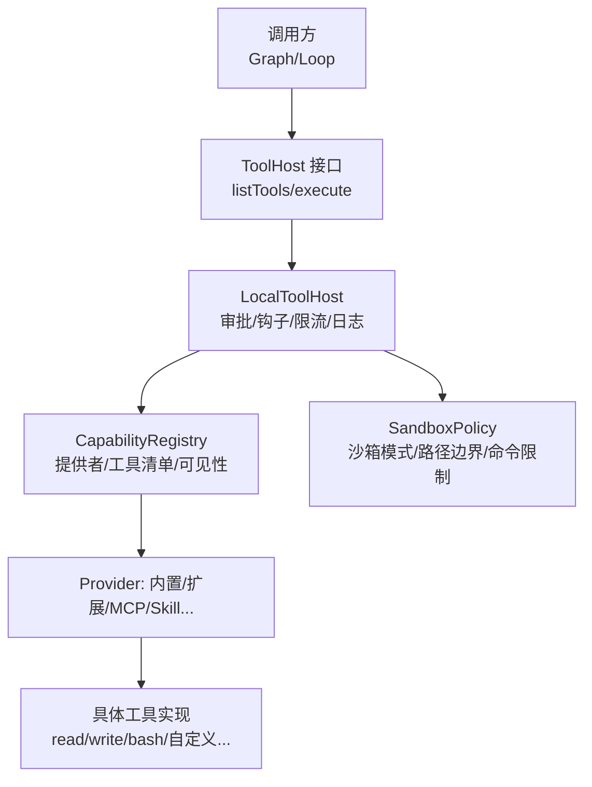
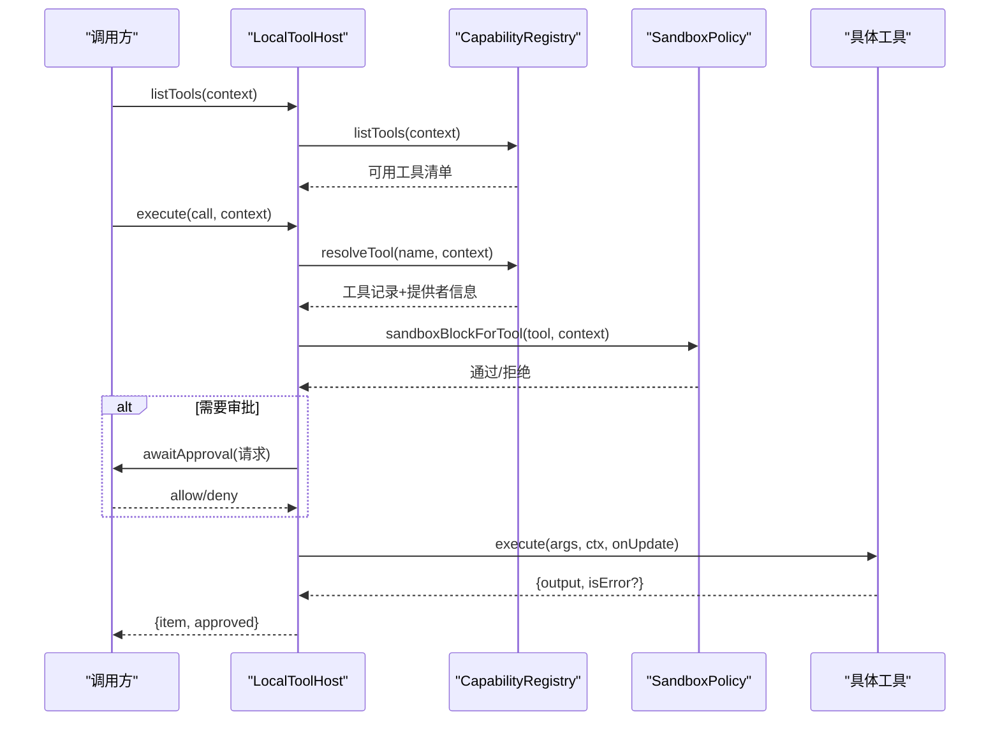
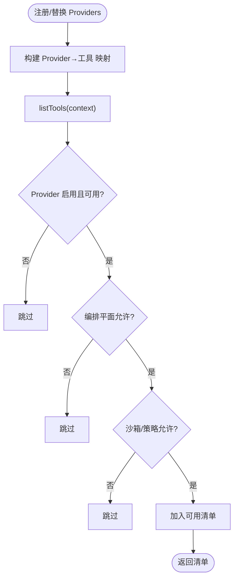
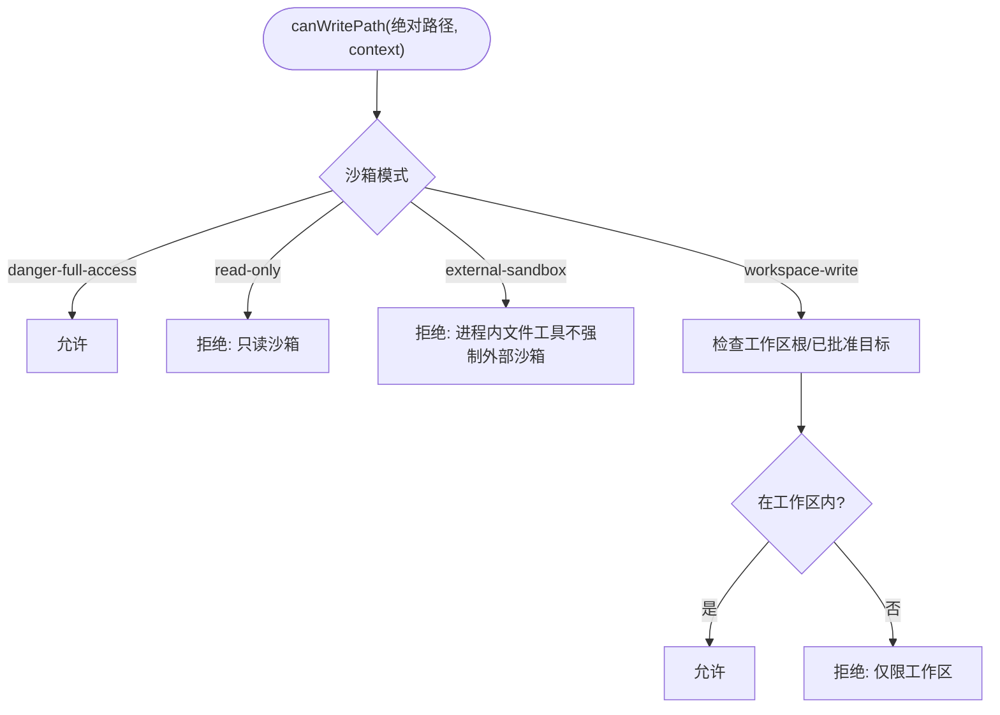
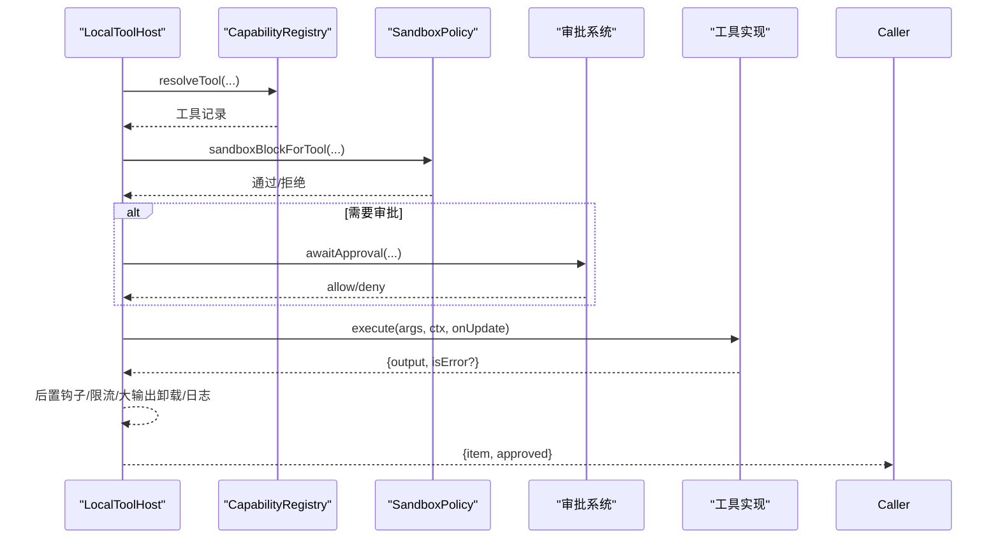
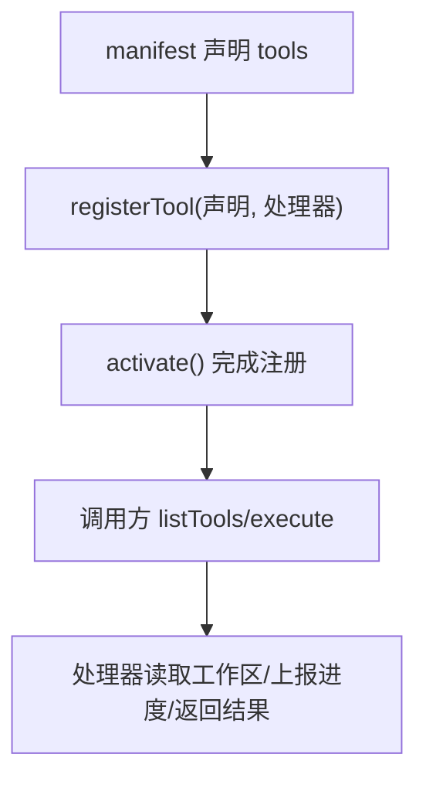
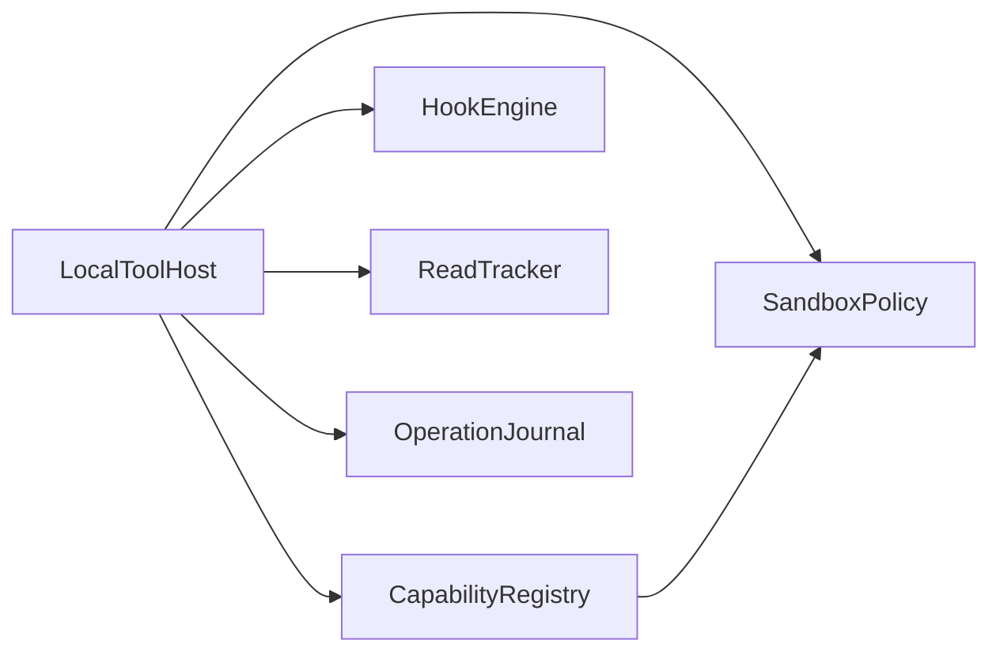

# 自定义工具开发

<cite>
**本文引用的文件**
- [local-tool-host.ts](file://kun/src/adapters/tool/local-tool-host.ts)
- [capability-registry.ts](file://kun/src/adapters/tool/capability-registry.ts)
- [sandbox-policy.ts](file://kun/src/adapters/tool/sandbox-policy.ts)
- [tool-host.ts](file://kun/src/ports/tool-host.ts)
- [extension.ts](file://examples/extensions/tool-provider/src/extension.ts)
- [kun-extension.json](file://examples/extensions/tool-provider/kun-extension.json)
- [ppt-master-tool.test.ts](file://kun/src/adapters/tool/ppt-master-tool.test.ts)
</cite>

## 目录
1. [简介](#简介)
2. [项目结构](#项目结构)
3. [核心组件](#核心组件)
4. [架构总览](#架构总览)
5. [详细组件分析](#详细组件分析)
6. [依赖关系分析](#依赖关系分析)
7. [性能考虑](#性能考虑)
8. [故障排查指南](#故障排查指南)
9. [结论](#结论)
10. [附录](#附录)

## 简介
本指南面向希望在 DeepSeek-GUI（Kun）中开发“自定义工具”的工程师与扩展作者。文档围绕以下目标展开：
- 解释工具定义、参数校验、执行逻辑与错误处理的最佳实践
- 说明工具注册机制与生命周期管理
- 介绍权限模型与安全沙箱，包括能力注册表与安全策略配置
- 提供从简单文件操作到复杂网络请求的完整示例路径
- 给出调试技巧、测试方法与发布分发的最佳实践

## 项目结构
本项目将“工具”抽象为可被编排器调用的本地或远程能力，并通过统一的 ToolHost 接口暴露给上层循环与 GUI/TUI。关键位置如下：
- 端口与契约：kun/src/ports/tool-host.ts
- 本地工具主机与执行管线：kun/src/adapters/tool/local-tool-host.ts
- 能力注册与可见性控制：kun/src/adapters/tool/capability-registry.ts
- 安全沙箱与写入边界：kun/src/adapters/tool/sandbox-policy.ts
- 扩展工具示例：examples/extensions/tool-provider/src/extension.ts 与 kun-extension.json
- 复杂工具流程参考（PPT Master）：kun/src/adapters/tool/ppt-master-tool.test.ts



图表来源
- [tool-host.ts:233-262](file://kun/src/ports/tool-host.ts#L233-L262)
- [local-tool-host.ts:143-190](file://kun/src/adapters/tool/local-tool-host.ts#L143-L190)
- [capability-registry.ts:51-146](file://kun/src/adapters/tool/capability-registry.ts#L51-L146)
- [sandbox-policy.ts:120-175](file://kun/src/adapters/tool/sandbox-policy.ts#L120-L175)

章节来源
- [tool-host.ts:233-262](file://kun/src/ports/tool-host.ts#L233-L262)
- [local-tool-host.ts:143-190](file://kun/src/adapters/tool/local-tool-host.ts#L143-L190)
- [capability-registry.ts:51-146](file://kun/src/adapters/tool/capability-registry.ts#L51-L146)
- [sandbox-policy.ts:120-175](file://kun/src/adapters/tool/sandbox-policy.ts#L120-L175)

## 核心组件
- LocalTool：最小可执行单元，包含名称、描述、输入/输出 Schema、副作用分类、执行函数、可选的可见性判定与显式审批要求等。
- LocalToolHost：统一执行入口，负责审批、沙箱检查、前后置钩子、读前写后校验、结果归一化与大输出卸载。
- CapabilityRegistry：维护 Provider 与工具映射，按上下文裁剪可用工具列表与可执行工具集合。
- SandboxPolicy：根据沙箱模式与路径范围决定工具是否可执行、是否允许写入、是否允许命令执行。
- ToolHost 接口：对外暴露 listTools 与 execute，屏蔽底层实现差异。

章节来源
- [local-tool-host.ts:52-127](file://kun/src/adapters/tool/local-tool-host.ts#L52-L127)
- [local-tool-host.ts:143-190](file://kun/src/adapters/tool/local-tool-host.ts#L143-L190)
- [capability-registry.ts:51-146](file://kun/src/adapters/tool/capability-registry.ts#L51-L146)
- [sandbox-policy.ts:120-175](file://kun/src/adapters/tool/sandbox-policy.ts#L120-L175)
- [tool-host.ts:233-262](file://kun/src/ports/tool-host.ts#L233-L262)

## 架构总览
下图展示一次工具调用的端到端流程，涵盖声明、注册、可见性过滤、审批、沙箱校验、执行与结果处理。



图表来源
- [local-tool-host.ts:181-190](file://kun/src/adapters/tool/local-tool-host.ts#L181-L190)
- [local-tool-host.ts:196-220](file://kun/src/adapters/tool/local-tool-host.ts#L196-L220)
- [capability-registry.ts:117-173](file://kun/src/adapters/tool/capability-registry.ts#L117-L173)
- [sandbox-policy.ts:120-175](file://kun/src/adapters/tool/sandbox-policy.ts#L120-L175)

## 详细组件分析

### 工具定义与执行（LocalTool）
- 工具必须声明 name、description、inputSchema 与 execute。
- 建议明确 toolKind（tool_call/command_execution/file_change）与 sideEffect（read-only/unknown），以便计划模式与 Graph 安全策略正确决策。
- 可通过 shouldAdvertise 在特定上下文（如 plan/design）才暴露工具；modelAdvertised=false 可隐藏兼容工具但保留直接执行。
- 对高风险操作设置 requiresExplicitApproval 或 requiresApprovalInFullAccess，确保即使在全访问模式下也需用户确认。
- 若涉及外部文件写入，使用 externalWritePathArguments 声明精确的目标参数名，配合沙箱进行一次性授权。

```mermaid
classDiagram
class LocalTool {
+string name
+string description
+object inputSchema
+string toolKind
+string sideEffect
+object effects
+string policy
+boolean requiresExplicitApproval
+boolean requiresApprovalInFullAccess
+string[] externalWritePathArguments
+function shouldAdvertise(context) boolean
+boolean modelAdvertised
+function execute(args, context, onUpdate) Promise~{output,isError?}~
}
```

图表来源
- [local-tool-host.ts:52-109](file://kun/src/adapters/tool/local-tool-host.ts#L52-L109)

章节来源
- [local-tool-host.ts:52-109](file://kun/src/adapters/tool/local-tool-host.ts#L52-L109)

### 工具注册与生命周期（CapabilityRegistry 与 Provider）
- 通过 CapabilityRegistry 集中管理 Provider 与工具，支持动态注册/替换/注销。
- listTools 会结合上下文、计划模式、活跃技能、沙箱策略与 shouldAdvertise 过滤出真正可用的工具。
- resolveTool 进一步校验 provider 可用性、编排平面限制与 turn 上下文，返回最终可执行记录。
- Provider 类型多样（内置、MCP、Web、Skill、Memory、GUI、Delegation、Image/Audio/Video、Extension）。



图表来源
- [capability-registry.ts:51-146](file://kun/src/adapters/tool/capability-registry.ts#L51-L146)

章节来源
- [capability-registry.ts:51-146](file://kun/src/adapters/tool/capability-registry.ts#L51-L146)

### 安全沙箱与权限模型（SandboxPolicy）
- 沙箱模式决定工具与路径的可用范围：read-only、workspace-write、external-sandbox、danger-full-access。
- 命令执行在窄路径边界下会被阻止，避免 shell 命令逃逸到受限子路径之外。
- 文件写入 canWritePath 严格校验工作区根、已批准的外部目标与 allowedWritePaths。
- 外部写入目标需在执行前解析并锁定物理路径与 inode，防止符号链接/硬链接绕过。



图表来源
- [sandbox-policy.ts:177-236](file://kun/src/adapters/tool/sandbox-policy.ts#L177-L236)

章节来源
- [sandbox-policy.ts:120-175](file://kun/src/adapters/tool/sandbox-policy.ts#L120-L175)
- [sandbox-policy.ts:177-236](file://kun/src/adapters/tool/sandbox-policy.ts#L177-L236)

### 执行管线与错误处理（LocalToolHost.execute）
- 执行前：解析工具、策略检查、沙箱阻断、前置钩子、计划模式阻断、读前写后校验、运行时策略阻断、外部写入目标提取。
- 审批：根据工具策略、上下文 approvalPolicy、是否需要显式审批决定是否发起审批；支持 full access 下的特殊审批标记。
- 执行：注入不可伪造的 KunActionApprovalGrant 与 approvedExternalWriteTargets；支持进度更新与取消信号。
- 执行后：后置钩子、速率限制归一化、大输出卸载、操作日志记录、结果封装。



图表来源
- [local-tool-host.ts:196-557](file://kun/src/adapters/tool/local-tool-host.ts#L196-L557)

章节来源
- [local-tool-host.ts:196-557](file://kun/src/adapters/tool/local-tool-host.ts#L196-L557)

### 扩展工具示例（从声明到运行）
- 在 kun-extension.json 中声明 tools 数组，包含 id、description、inputSchema、outputSchema、sideEffects、idempotent、maxOutputBytes 等元数据。
- 在 extension.ts 中导出工具声明对象，并通过 context.tools.registerTool 注册处理器。
- 激活时订阅工具，deactivate 时由宿主回收资源。
- 该示例演示了读取工作区、进度上报、取消支持与结构化输出。



图表来源
- [kun-extension.json:18-47](file://examples/extensions/tool-provider/kun-extension.json#L18-L47)
- [extension.ts:9-35](file://examples/extensions/tool-provider/src/extension.ts#L9-L35)
- [extension.ts:50-79](file://examples/extensions/tool-provider/src/extension.ts#L50-L79)

章节来源
- [kun-extension.json:18-47](file://examples/extensions/tool-provider/kun-extension.json#L18-L47)
- [extension.ts:9-35](file://examples/extensions/tool-provider/src/extension.ts#L9-L35)
- [extension.ts:50-79](file://examples/extensions/tool-provider/src/extension.ts#L50-L79)

### 复杂工具流程参考（PPT Master）
- 测试展示了多步骤工具链：设计确认、项目初始化、导入 Markdown、拆分笔记、导出 PPTX。
- 强调路径白名单与输出目录约束、失败场景（未批准、未生成 PPTX）、文档读取限制与截断。
- 适合作为“复杂业务工具”的参考范式。

章节来源
- [ppt-master-tool.test.ts:31-154](file://kun/src/adapters/tool/ppt-master-tool.test.ts#L31-L154)
- [ppt-master-tool.test.ts:156-200](file://kun/src/adapters/tool/ppt-master-tool.test.ts#L156-L200)
- [ppt-master-tool.test.ts:202-329](file://kun/src/adapters/tool/ppt-master-tool.test.ts#L202-L329)

## 依赖关系分析
- LocalToolHost 依赖 CapabilityRegistry 获取工具与提供者信息，依赖 SandboxPolicy 做安全决策，依赖 HookEngine 做前后置拦截，依赖 ReadTracker 做读写顺序保护，依赖 OperationJournal 做幂等与重放保护。
- CapabilityRegistry 依赖沙箱策略与编排边界策略，以在不同上下文中裁剪工具集。
- SandboxPolicy 依赖工作区路径解析与文件系统属性，确保写入目标稳定且受控。



图表来源
- [local-tool-host.ts:19-48](file://kun/src/adapters/tool/local-tool-host.ts#L19-L48)
- [capability-registry.ts:1-10](file://kun/src/adapters/tool/capability-registry.ts#L1-L10)
- [sandbox-policy.ts:1-22](file://kun/src/adapters/tool/sandbox-policy.ts#L1-L22)

章节来源
- [local-tool-host.ts:19-48](file://kun/src/adapters/tool/local-tool-host.ts#L19-L48)
- [capability-registry.ts:1-10](file://kun/src/adapters/tool/capability-registry.ts#L1-L10)
- [sandbox-policy.ts:1-22](file://kun/src/adapters/tool/sandbox-policy.ts#L1-L22)

## 性能考虑
- 大输出卸载：当工具输出超过阈值时，自动转存至 artifact store，返回摘要与预览，降低上下文压力。
- 进度上报：在执行过程中通过 onUpdate 推送阶段性结果，提升交互体验与可观测性。
- 缓存与复用：LocalToolHost 按 turnId 缓存组件引用，减少重复构造开销。
- 限流与去重：通过速率限制与操作日志避免重复执行与风暴。

章节来源
- [local-tool-host.ts:724-751](file://kun/src/adapters/tool/local-tool-host.ts#L724-L751)
- [local-tool-host.ts:494-510](file://kun/src/adapters/tool/local-tool-host.ts#L494-L510)
- [local-tool-host.ts:563-608](file://kun/src/adapters/tool/local-tool-host.ts#L563-L608)

## 故障排查指南
- 工具不可见：检查 shouldAdvertise 与沙箱策略、计划模式限制、provider 可用性与 allow/block 列表。
- 执行被拒绝：查看沙箱模式是否为 read-only 或 workspace-write 的限制；命令执行在窄路径边界下会被阻止。
- 写入失败：确认路径在工作区内或已批准的外部目标；检查 allowedWritePaths 与工作区根解析。
- 审批问题：确认工具策略与上下文 approvalPolicy；必要时设置 requiresExplicitApproval。
- 输出过大：关注大输出卸载行为，合理设置 maxOutputBytes 与结构化输出。

章节来源
- [capability-registry.ts:117-173](file://kun/src/adapters/tool/capability-registry.ts#L117-L173)
- [sandbox-policy.ts:120-175](file://kun/src/adapters/tool/sandbox-policy.ts#L120-L175)
- [sandbox-policy.ts:177-236](file://kun/src/adapters/tool/sandbox-policy.ts#L177-L236)
- [local-tool-host.ts:196-220](file://kun/src/adapters/tool/local-tool-host.ts#L196-L220)

## 结论
DeepSeek-GUI 的工具体系以 LocalTool 为核心，通过 LocalToolHost 统一编排，借助 CapabilityRegistry 与 SandboxPolicy 实现灵活的能力管理与强安全边界。扩展作者只需遵循声明式 Schema、清晰的副作用标注与必要的审批策略，即可快速构建从简单文件操作到复杂工作流的工具。

## 附录

### 自定义工具开发清单
- 声明工具元数据：name、description、inputSchema、outputSchema、sideEffects、idempotent、maxOutputBytes。
- 实现 execute：支持取消、进度上报、结构化输出与错误码。
- 标注工具类别：toolKind、sideEffect、effects，便于策略层决策。
- 配置可见性：shouldAdvertise 与 modelAdvertised，按需暴露。
- 设置审批：requiresExplicitApproval / requiresApprovalInFullAccess，保障高风险操作。
- 路径与写入：使用 externalWritePathArguments 声明外部写入目标，配合沙箱策略。
- 测试与调试：利用单元测试模拟上下文、审批与文件系统；验证沙箱与路径边界。
- 发布与分发：在 kun-extension.json 中声明 tools 与 permissions，打包为扩展。

章节来源
- [kun-extension.json:18-52](file://examples/extensions/tool-provider/kun-extension.json#L18-L52)
- [extension.ts:9-79](file://examples/extensions/tool-provider/src/extension.ts#L9-L79)
- [local-tool-host.ts:52-127](file://kun/src/adapters/tool/local-tool-host.ts#L52-L127)
- [capability-registry.ts:51-146](file://kun/src/adapters/tool/capability-registry.ts#L51-L146)
- [sandbox-policy.ts:120-236](file://kun/src/adapters/tool/sandbox-policy.ts#L120-L236)