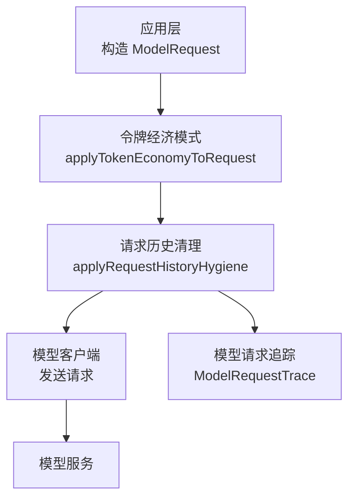
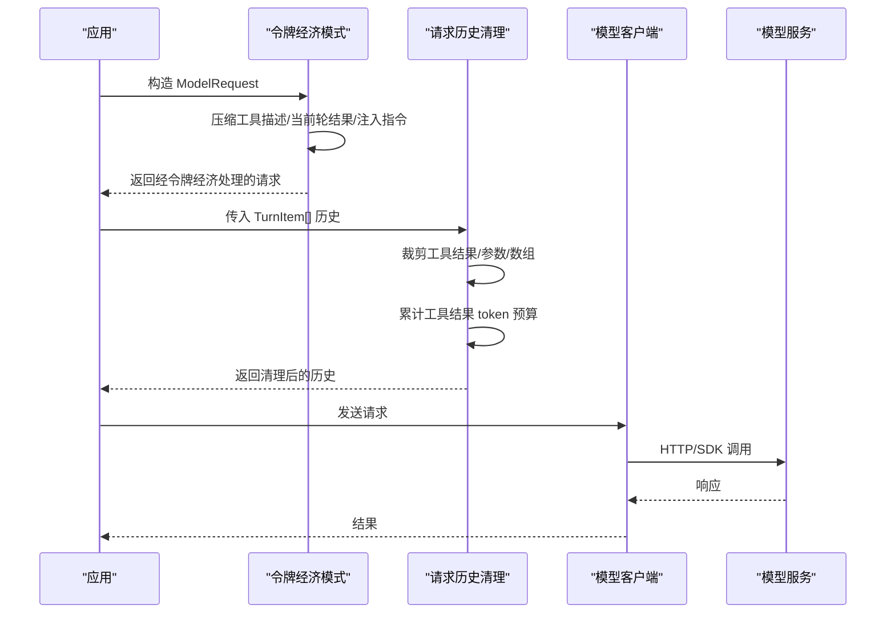
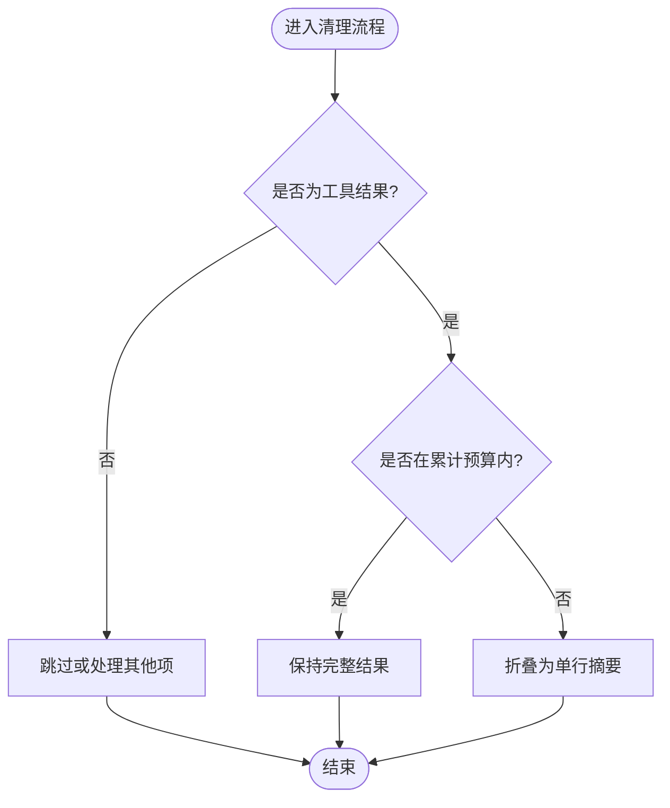
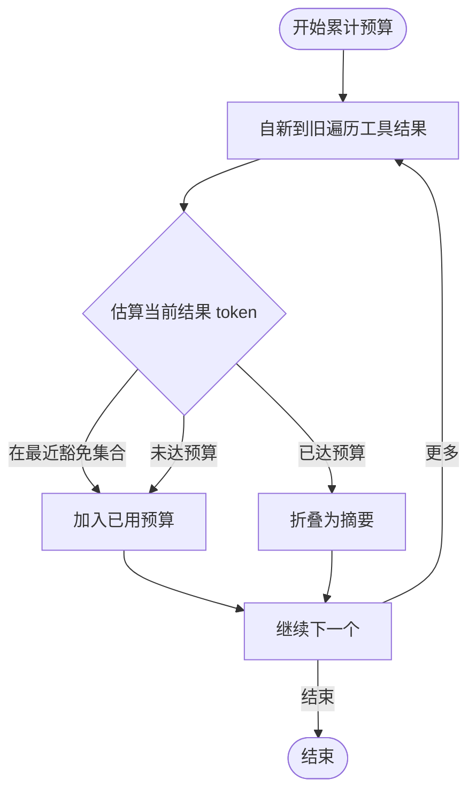
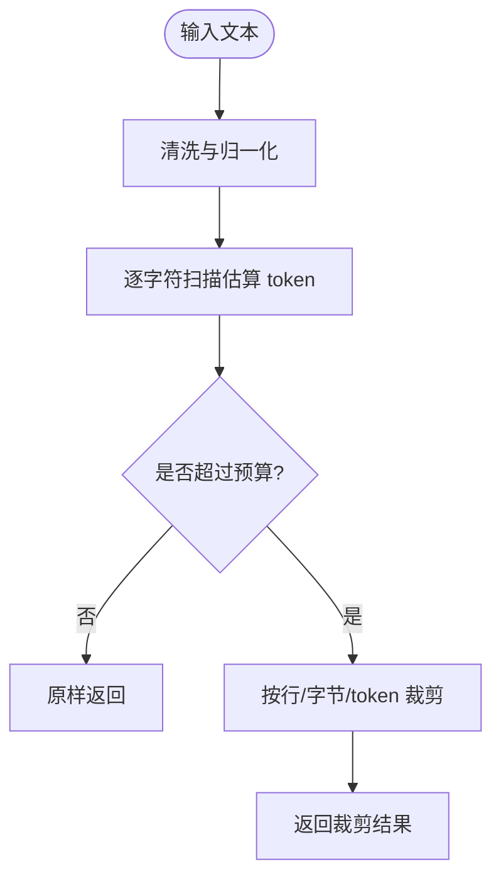
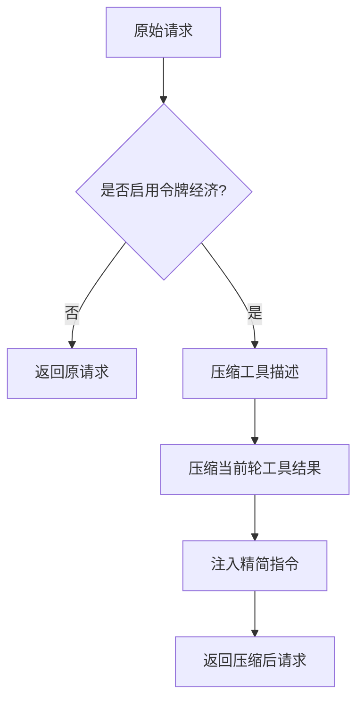
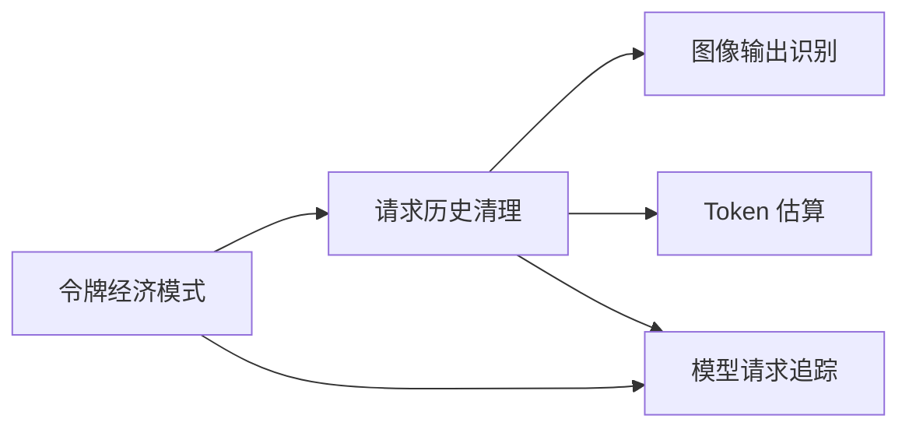

# 令牌经济管理

<cite>
**本文引用的文件**
- [token-economy.ts](file://kun/src/loop/token-economy.ts)
- [request-history-hygiene.ts](file://kun/src/loop/request-history-hygiene.ts)
- [model-request-trace.ts](file://kun/src/contracts/model-request-trace.ts)
- [token-economy.test.ts](file://kun/tests/token-economy.test.ts)
</cite>

## 目录
1. [简介](#简介)
2. [项目结构](#项目结构)
3. [核心组件](#核心组件)
4. [架构总览](#架构总览)
5. [详细组件分析](#详细组件分析)
6. [依赖关系分析](#依赖关系分析)
7. [性能考虑](#性能考虑)
8. [故障排查指南](#故障排查指南)
9. [结论](#结论)
10. [附录](#附录)

## 简介
本文件面向 DeepSeek-GUI 的“令牌经济管理系统”，聚焦以下目标：
- 上下文长度控制机制：消息长度估算、上下文窗口管理与动态调整策略。
- Token 预算管理系统：预算分配、使用跟踪与超限保护。
- 成本优化策略：请求合并、结果缓存与智能路由（在现有实现中的体现与扩展建议）。
- 上下文估计器：文本分析、标记计数与空间预测的实现细节。
- 配置选项、监控指标与告警机制：如何配置、观测与预警。
- 使用示例、最佳实践与性能调优建议。

该系统通过“发送时历史清理”和“令牌经济模式”两条主线，在不持久化修改会话日志的前提下，将模型请求的上下文控制在可预期的范围内，从而稳定成本并提升长会话的可维护性。

## 项目结构
令牌经济相关代码主要位于 kun 子模块中，围绕“请求历史清理”和“令牌经济模式”两个层次组织：
- 请求历史清理：对工具调用结果、参数与数组进行有界裁剪，并对全量工具结果施加累计 token 预算，防止长会话无限增长。
- 令牌经济模式：在启用时压缩工具描述、当前轮次的工具结果与响应风格，进一步降低单次请求的 token 消耗。
- 模型请求追踪：提供标准化的请求/响应记录结构与限制，便于审计与诊断。

图表来源
- [token-economy.ts:86-108](file://kun/src/loop/token-economy.ts#L86-L108)
- [request-history-hygiene.ts:79-136](file://kun/src/loop/request-history-hygiene.ts#L79-L136)
- [model-request-trace.ts:122-208](file://kun/src/contracts/model-request-trace.ts#L122-L208)

章节来源
- [token-economy.ts:1-108](file://kun/src/loop/token-economy.ts#L1-L108)
- [request-history-hygiene.ts:1-136](file://kun/src/loop/request-history-hygiene.ts#L1-L136)
- [model-request-trace.ts:1-208](file://kun/src/contracts/model-request-trace.ts#L1-L208)

## 核心组件
- 令牌经济模式（Token Economy）
  - 作用：在启用时注入精简指令、压缩工具描述与当前轮工具结果，减少上下文体积。
  - 关键能力：文本压缩、技术片段保护、工具输出按类型裁剪、通用文本头部保留等。
- 请求历史清理（Request History Hygiene）
  - 作用：在发送前对历史项做有界裁剪，包括工具结果、参数、数组项；对全部工具结果施加累计 token 预算，超出部分折叠为摘要。
  - 关键能力：信号行保留、重复行压缩、base64 数据省略、原子源页面保护、累计预算与最近 N 条豁免。
- 模型请求追踪（Model Request Trace）
  - 作用：标准化记录请求/响应、阶段、失败来源、工具目录等，支持审计与问题定位。
  - 关键能力：字段约束、大小限制、分页与警告信息。

章节来源
- [token-economy.ts:7-108](file://kun/src/loop/token-economy.ts#L7-L108)
- [request-history-hygiene.ts:7-136](file://kun/src/loop/request-history-hygiene.ts#L7-L136)
- [model-request-trace.ts:122-208](file://kun/src/contracts/model-request-trace.ts#L122-L208)

## 架构总览
下图展示了从应用构造请求到最终发送的完整链路，以及令牌经济与历史清理的协作方式。

图表来源
- [token-economy.ts:86-108](file://kun/src/loop/token-economy.ts#L86-L108)
- [request-history-hygiene.ts:79-136](file://kun/src/loop/request-history-hygiene.ts#L79-L136)

## 详细组件分析

### 上下文长度控制机制
- 消息长度估算
  - 基于字符级扫描的近似 token 估算：ASCII 字符每 4 个计为 1 token，非 ASCII 字符通常计为 1 token，组合标记不计入。
  - 用于工具结果文本、命令输出、通用文本等的预算判断与裁剪。
- 上下文窗口管理
  - 单条工具结果限制：行数、字节数、token 数三重上限。
  - 累计工具结果预算：对所有工具结果设定累计 token 上限，超过后对较旧结果折叠为单行摘要，仅保留最近的若干条完整结果。
  - 原子源页面保护：read/grep/find/glob 等“原子源”页面不被二次折叠，确保模型看到一致的页视图。
- 动态调整策略
  - 根据是否处于当前轮次、是否为错误结果、是否为图片输出等条件，选择性裁剪或豁免。
  - 对超长行进行头尾拼接，保留关键信号行（如 error/fatal/timeout 等），并提示更窄范围的重试建议。

图表来源
- [request-history-hygiene.ts:155-211](file://kun/src/loop/request-history-hygiene.ts#L155-L211)
- [request-history-hygiene.ts:335-370](file://kun/src/loop/request-history-hygiene.ts#L335-L370)

章节来源
- [request-history-hygiene.ts:7-136](file://kun/src/loop/request-history-hygiene.ts#L7-L136)
- [request-history-hygiene.ts:155-211](file://kun/src/loop/request-history-hygiene.ts#L155-L211)
- [request-history-hygiene.ts:335-370](file://kun/src/loop/request-history-hygiene.ts#L335-L370)

### Token 预算管理系统
- 预算分配
  - 单结果预算：最大行数、最大字节数、最大 token 数。
  - 累计预算：所有工具结果的合计 token 上限，避免长会话累积过多历史。
  - 最近豁免：最近 N 条工具结果始终保留完整，即使累计预算耗尽。
- 使用跟踪
  - 自新至旧遍历工具结果，累加估算 token，达到预算后对更早结果折叠。
  - 图片输出按固定视觉 token 估算计入预算，不直接计算 base64 长度。
- 超限保护
  - 对超长的命令输出、grep/find/ls 结果进行头部保留、尾部保留与信号行选择。
  - 对 base64 数据键名或 data URL 进行省略，替换为带大小的占位说明。
  - 对完成态工具参数进行预览式截断，避免过大参数占用上下文。

图表来源
- [request-history-hygiene.ts:155-211](file://kun/src/loop/request-history-hygiene.ts#L155-L211)
- [request-history-hygiene.ts:255-274](file://kun/src/loop/request-history-hygiene.ts#L255-L274)

章节来源
- [request-history-hygiene.ts:155-211](file://kun/src/loop/request-history-hygiene.ts#L155-L211)
- [request-history-hygiene.ts:255-274](file://kun/src/loop/request-history-hygiene.ts#L255-L274)

### 成本优化策略
- 请求合并
  - 通过累计预算与最近豁免，将多个工具结果合并为一个紧凑的历史片段，减少多次大请求的风险。
- 结果缓存
  - 对原子源页面（read/grep/find/glob）不进行二次折叠，保证一致性；对已完成工具参数进行预览式截断，避免重复传输大参数。
- 智能路由
  - 当前实现未内置多模型路由逻辑；可在上层根据追踪记录与预算状态选择更合适的模型或端点，以平衡成本与质量。

章节来源
- [request-history-hygiene.ts:142-153](file://kun/src/loop/request-history-hygiene.ts#L142-L153)
- [request-history-hygiene.ts:396-455](file://kun/src/loop/request-history-hygiene.ts#L396-L455)
- [model-request-trace.ts:122-208](file://kun/src/contracts/model-request-trace.ts#L122-L208)

### 上下文估计器的实现
- 文本分析
  - 去除 ANSI 转义、统一换行、压缩连续空白与重复行，提升估算稳定性。
- 标记计数
  - ASCII 流按 4 字符=1 token 估算，非 ASCII 字符按 1 token 估算，组合标记不计入。
- 空间预测
  - 结合行数、字节数与 token 估算，决定是否需要裁剪、折叠或保留；对超长行进行头尾拼接，保留信号行。

图表来源
- [request-history-hygiene.ts:461-492](file://kun/src/loop/request-history-hygiene.ts#L461-L492)
- [request-history-hygiene.ts:561-581](file://kun/src/loop/request-history-hygiene.ts#L561-L581)
- [request-history-hygiene.ts:494-510](file://kun/src/loop/request-history-hygiene.ts#L494-L510)

章节来源
- [request-history-hygiene.ts:461-492](file://kun/src/loop/request-history-hygiene.ts#L461-L492)
- [request-history-hygiene.ts:561-581](file://kun/src/loop/request-history-hygiene.ts#L561-L581)
- [request-history-hygiene.ts:494-510](file://kun/src/loop/request-history-hygiene.ts#L494-L510)

### 令牌经济模式的实现
- 文本压缩与保护
  - 压缩冗余词、礼貌用语、模糊表达与多余空格，同时保护代码块、行内代码、URL、函数调用与技术标识符。
- 工具描述与结果压缩
  - 压缩工具描述与当前轮工具结果，不同类型工具输出采用专用裁剪策略（bash/read/grep/find/ls）。
- 指令注入
  - 启用时向上下文注入精简指令，要求模型回答简洁、保留精确代码与路径等。

图表来源
- [token-economy.ts:86-108](file://kun/src/loop/token-economy.ts#L86-L108)
- [token-economy.ts:146-166](file://kun/src/loop/token-economy.ts#L146-L166)
- [token-economy.ts:387-411](file://kun/src/loop/token-economy.ts#L387-L411)

章节来源
- [token-economy.ts:7-108](file://kun/src/loop/token-economy.ts#L7-L108)
- [token-economy.ts:146-166](file://kun/src/loop/token-economy.ts#L146-L166)
- [token-economy.ts:387-411](file://kun/src/loop/token-economy.ts#L387-L411)

## 依赖关系分析
- 令牌经济模式依赖请求历史清理提供的默认安全网（累计工具结果 token 上限），两者协同工作。
- 请求历史清理依赖图像输出识别与 token 估算，确保图片不被误删且预算合理。
- 模型请求追踪独立于上述两个模块，但可用于观测请求体大小、截断情况与失败来源。

图表来源
- [token-economy.ts:86-108](file://kun/src/loop/token-economy.ts#L86-L108)
- [request-history-hygiene.ts:79-136](file://kun/src/loop/request-history-hygiene.ts#L79-L136)
- [model-request-trace.ts:122-208](file://kun/src/contracts/model-request-trace.ts#L122-L208)

章节来源
- [token-economy.ts:86-108](file://kun/src/loop/token-economy.ts#L86-L108)
- [request-history-hygiene.ts:79-136](file://kun/src/loop/request-history-hygiene.ts#L79-L136)
- [model-request-trace.ts:122-208](file://kun/src/contracts/model-request-trace.ts#L122-L208)

## 性能考虑
- 估算复杂度
  - Token 估算与文本清洗均为线性时间复杂度 O(n)，适合高频调用。
- 内存占用
  - 通过累计预算与最近豁免，显著降低历史膨胀带来的内存压力。
- I/O 与网络
  - 对 base64 数据进行省略与预览式截断，减少网络负载与解析开销。
- 可扩展性
  - 可通过调整累计预算与最近豁免数量，在不同场景下平衡上下文完整性与成本。

[本节为通用性能讨论，无需具体文件引用]

## 故障排查指南
- 常见问题
  - 上下文过长导致请求失败：检查累计预算与最近豁免设置，必要时提高预算或增加最近豁免数量。
  - 工具结果被过度裁剪：确认是否为原子源页面或图片输出，避免不必要的折叠。
  - 参数过大影响性能：启用参数预览式截断，关注工具参数中的字符串长度。
- 观测手段
  - 使用模型请求追踪查看请求体大小、截断标志与失败来源，辅助定位问题。
  - 关注清理过程中输出的提示信息（如省略行数、字节数、token 数），评估裁剪效果。

章节来源
- [model-request-trace.ts:122-208](file://kun/src/contracts/model-request-trace.ts#L122-L208)
- [request-history-hygiene.ts:335-370](file://kun/src/loop/request-history-hygiene.ts#L335-L370)

## 结论
DeepSeek-GUI 的令牌经济管理系统通过“令牌经济模式”与“请求历史清理”的组合，实现了上下文长度的精细化控制与 token 预算的动态管理。系统在保障关键信息（如代码、路径、错误信息）完整性的前提下，有效抑制了长会话的上下文膨胀，降低了成本并提升了稳定性。配合模型请求追踪，可实现端到端的观测与诊断。

[本节为总结性内容，无需具体文件引用]

## 附录

### 配置选项
- 令牌经济模式配置
  - enabled：是否启用令牌经济模式。
  - compressToolDescriptions：是否压缩工具描述。
  - compressToolResults：是否压缩当前轮工具结果。
  - conciseResponses：是否注入精简指令。
  - historyHygiene：请求历史清理选项（见下文）。
- 请求历史清理选项
  - maxToolResultLines：单结果最大行数。
  - maxToolResultBytes：单结果最大字节数。
  - maxToolResultTokens：单结果最大 token 数。
  - maxToolArgumentStringBytes：工具参数字符串最大字节数。
  - maxToolArgumentStringTokens：工具参数字符串最大 token 数。
  - maxArrayItems：数组最大项数。
  - maxCumulativeToolResultTokens：所有工具结果累计 token 上限。
  - keepRecentToolResults：最近保留完整结果的数量。

章节来源
- [token-economy.ts:7-34](file://kun/src/loop/token-economy.ts#L7-L34)
- [request-history-hygiene.ts:7-45](file://kun/src/loop/request-history-hygiene.ts#L7-L45)
- [request-history-hygiene.ts:255-274](file://kun/src/loop/request-history-hygiene.ts#L255-L274)

### 监控指标与告警机制
- 指标
  - 请求体捕获字节数与原字节数、是否截断。
  - 工具调用与结果数量、错误标志。
  - 累计预算使用情况（通过清理过程中的提示信息推断）。
- 告警
  - 当请求体接近限制或频繁截断时，应触发告警，提示调整预算或优化工具输出。
  - 当失败来源为凭证或配置问题时，应在相应阶段记录并告警。

章节来源
- [model-request-trace.ts:122-208](file://kun/src/contracts/model-request-trace.ts#L122-L208)
- [request-history-hygiene.ts:335-370](file://kun/src/loop/request-history-hygiene.ts#L335-L370)

### 使用示例与最佳实践
- 示例
  - 启用令牌经济模式并配置历史清理选项，观察请求体大小变化与工具结果裁剪效果。
  - 使用模型请求追踪查看请求/响应记录，定位失败原因与截断位置。
- 最佳实践
  - 合理设置累计预算与最近豁免数量，平衡上下文完整性与成本。
  - 对大输出工具（如 bash/read/grep/find/ls）使用更窄范围查询，减少不必要的数据传输。
  - 避免在工具结果中包含过大的 base64 数据，必要时拆分或外置存储。

章节来源
- [token-economy.test.ts:24-144](file://kun/tests/token-economy.test.ts#L24-L144)
- [request-history-hygiene.ts:335-370](file://kun/src/loop/request-history-hygiene.ts#L335-L370)
- [model-request-trace.ts:122-208](file://kun/src/contracts/model-request-trace.ts#L122-L208)

### 性能调优建议
- 调整累计预算与最近豁免数量，适应不同会话长度与工具输出规模。
- 对高频工具调用结果进行去重或聚合，减少重复内容。
- 结合模型请求追踪，识别高成本请求并进行针对性优化。

[本节为通用调优建议，无需具体文件引用]