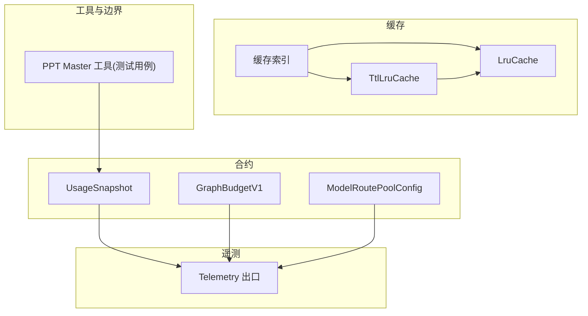
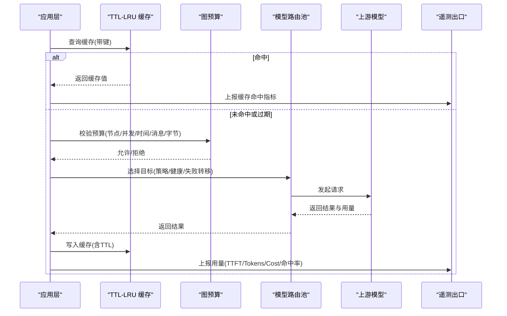
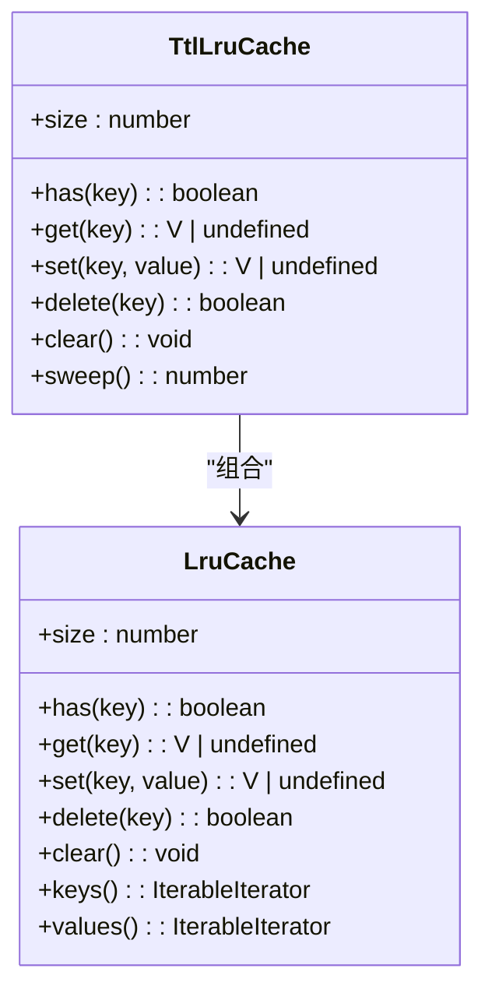
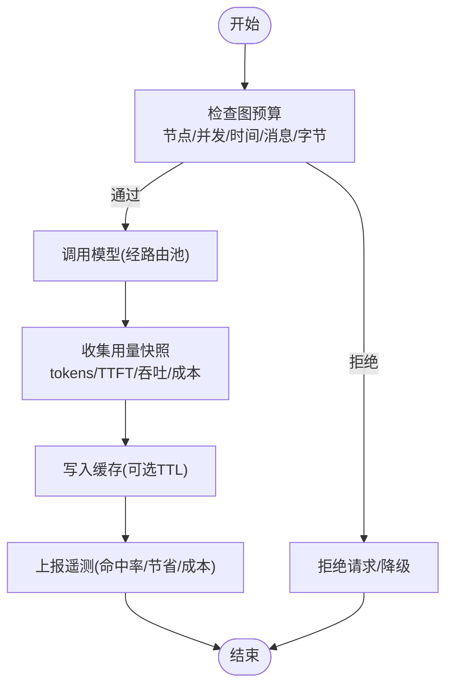
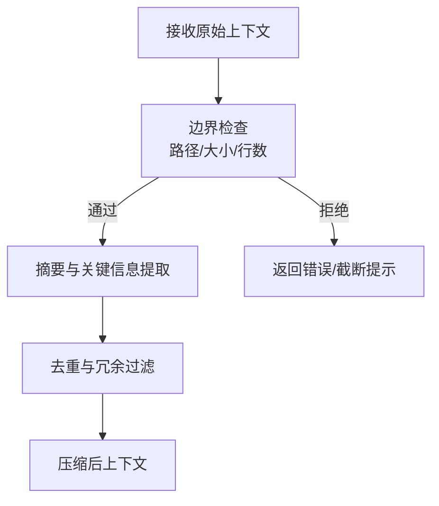
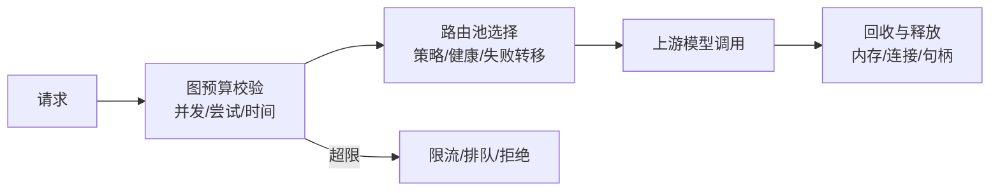
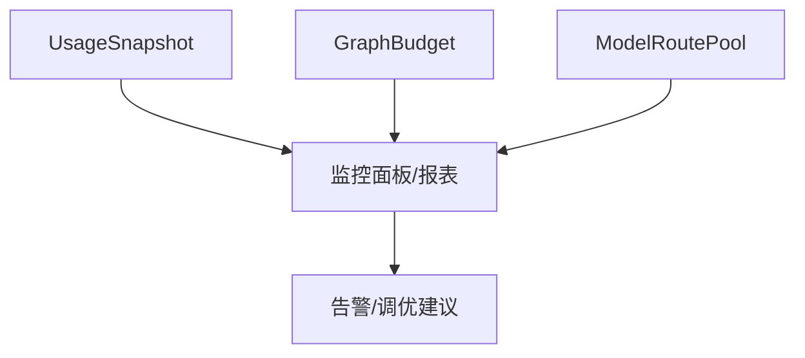
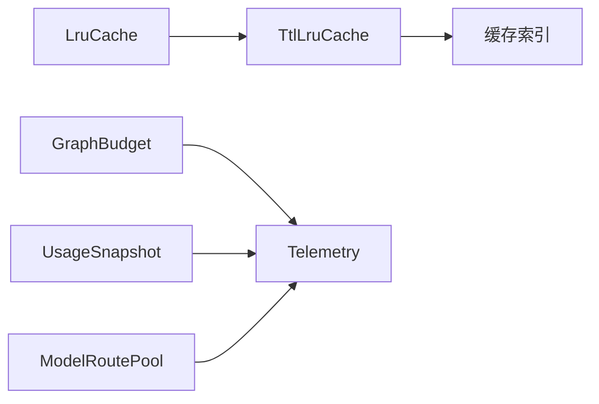

# 性能优化

<cite>
**本文引用的文件**
- [kun/src/cache/lru-cache.ts](file://kun/src/cache/lru-cache.ts)
- [kun/src/cache/ttl-lru-cache.ts](file://kun/src/cache/ttl-lru-cache.ts)
- [kun/src/cache/index.ts](file://kun/src/cache/index.ts)
- [kun/src/contracts/graph-budget.ts](file://kun/src/contracts/graph-budget.ts)
- [kun/src/contracts/usage.ts](file://kun/src/contracts/usage.ts)
- [kun/src/contracts/model-route-pool.ts](file://kun/src/contracts/model-route-pool.ts)
- [kun/src/telemetry/index.ts](file://kun/src/telemetry/index.ts)
- [kun/src/adapters/tool/ppt-master-tool.test.ts](file://kun/src/adapters/tool/ppt-master-tool.test.ts)
</cite>

## 目录
1. [简介](#简介)
2. [项目结构](#项目结构)
3. [核心组件](#核心组件)
4. [架构总览](#架构总览)
5. [详细组件分析](#详细组件分析)
6. [依赖关系分析](#依赖关系分析)
7. [性能考量](#性能考量)
8. [故障排查指南](#故障排查指南)
9. [结论](#结论)
10. [附录](#附录)

## 简介
本文件面向 DeepSeek-GUI 的性能优化系统，聚焦以下主题：
- 缓存策略：LRU 缓存、TTL 过期与缓存键生成机制
- 令牌经济系统：上下文长度控制、Token 预算管理与成本优化
- 上下文压缩：历史消息摘要、关键信息提取与冗余内容过滤
- 并发控制与资源管理：请求限流、连接池管理与内存使用优化
- 性能监控与分析：响应时间统计、资源使用监控与瓶颈识别
- 最佳实践与常见问题：配置示例与监控指标说明

## 项目结构
与性能优化直接相关的代码主要分布在以下模块：
- 缓存子系统：提供 LRU 与 TTL-LRU 两种缓存实现，并统一导出
- 合约与配额：定义图执行预算、用量快照与路由池配置
- 遥测与可观测性：暴露用量计数、缓存遥测与 OTLP 输出等能力
- 工具与边界约束：通过工具测试用例体现上下文读取的边界控制（如行数限制、路径隔离）

图表来源
- [kun/src/cache/lru-cache.ts:1-67](file://kun/src/cache/lru-cache.ts#L1-L67)
- [kun/src/cache/ttl-lru-cache.ts:1-73](file://kun/src/cache/ttl-lru-cache.ts#L1-L73)
- [kun/src/cache/index.ts:1-6](file://kun/src/cache/index.ts#L1-L6)
- [kun/src/contracts/graph-budget.ts:1-43](file://kun/src/contracts/graph-budget.ts#L1-L43)
- [kun/src/contracts/usage.ts:1-185](file://kun/src/contracts/usage.ts#L1-L185)
- [kun/src/contracts/model-route-pool.ts:1-77](file://kun/src/contracts/model-route-pool.ts#L1-L77)
- [kun/src/telemetry/index.ts:1-5](file://kun/src/telemetry/index.ts#L1-L5)
- [kun/src/adapters/tool/ppt-master-tool.test.ts:304-329](file://kun/src/adapters/tool/ppt-master-tool.test.ts#L304-L329)

章节来源
- [kun/src/cache/index.ts:1-6](file://kun/src/cache/index.ts#L1-L6)
- [kun/src/contracts/graph-budget.ts:1-43](file://kun/src/contracts/graph-budget.ts#L1-L43)
- [kun/src/contracts/usage.ts:1-185](file://kun/src/contracts/usage.ts#L1-L185)
- [kun/src/contracts/model-route-pool.ts:1-77](file://kun/src/contracts/model-route-pool.ts#L1-L77)
- [kun/src/telemetry/index.ts:1-5](file://kun/src/telemetry/index.ts#L1-L5)
- [kun/src/adapters/tool/ppt-master-tool.test.ts:304-329](file://kun/src/adapters/tool/ppt-master-tool.test.ts#L304-L329)

## 核心组件
- LRU 缓存：固定容量、最近最少使用淘汰；get/set 操作均维护访问顺序；无异常返回，miss 时返回未定义
- TTL-LRU 缓存：在 LRU 基础上增加过期时间；支持批量清理过期条目；过期视为 miss
- 图预算：限制节点数、边数、并发度、尝试次数、轮次、墙钟时间、消息数、产物字节等；保留警告类型集合
- 用量快照：记录提示/补全/推理 token、缓存命中/写入、TTFT、吞吐、成本等；支持按线程/模型/日粒度聚合
- 模型路由池：多目标、失败转移与健康检查策略；支持优先级、轮询、加权轮询、最小延迟、自适应策略
- 遥测出口：统一导出用量计数、缓存遥测、OTLP HTTP JSON 输出等

章节来源
- [kun/src/cache/lru-cache.ts:1-67](file://kun/src/cache/lru-cache.ts#L1-L67)
- [kun/src/cache/ttl-lru-cache.ts:1-73](file://kun/src/cache/ttl-lru-cache.ts#L1-L73)
- [kun/src/contracts/graph-budget.ts:1-43](file://kun/src/contracts/graph-budget.ts#L1-L43)
- [kun/src/contracts/usage.ts:1-185](file://kun/src/contracts/usage.ts#L1-L185)
- [kun/src/contracts/model-route-pool.ts:1-77](file://kun/src/contracts/model-route-pool.ts#L1-L77)
- [kun/src/telemetry/index.ts:1-5](file://kun/src/telemetry/index.ts#L1-L5)

## 架构总览
下图展示从请求进入、缓存命中/回源、模型调用、预算与用量采集到遥测输出的整体流程。

图表来源
- [kun/src/cache/ttl-lru-cache.ts:1-73](file://kun/src/cache/ttl-lru-cache.ts#L1-L73)
- [kun/src/contracts/graph-budget.ts:1-43](file://kun/src/contracts/graph-budget.ts#L1-L43)
- [kun/src/contracts/model-route-pool.ts:1-77](file://kun/src/contracts/model-route-pool.ts#L1-L77)
- [kun/src/contracts/usage.ts:1-185](file://kun/src/contracts/usage.ts#L1-L185)
- [kun/src/telemetry/index.ts:1-5](file://kun/src/telemetry/index.ts#L1-L5)

## 详细组件分析

### 缓存子系统：LRU 与 TTL-LRU
- LRU 缓存
  - 容量限制：构造时指定上限，满额时驱逐最久未使用的项
  - 访问语义：get 会提升命中项为最新；set 更新或插入；delete/clear/keys/values 完整支持
  - 复杂度：平均 O(1) 读写；淘汰基于 Map 迭代器取首项
- TTL-LRU 缓存
  - 过期语义：每条记录附带 expiresAt；get 时若已过期则删除并返回未定义；sweep 可批量清理
  - 组合优势：既保证热点优先，又避免陈旧数据长期驻留
  - 时间源：可通过 now 注入以利于测试与可控行为

图表来源
- [kun/src/cache/lru-cache.ts:1-67](file://kun/src/cache/lru-cache.ts#L1-L67)
- [kun/src/cache/ttl-lru-cache.ts:1-73](file://kun/src/cache/ttl-lru-cache.ts#L1-L73)

章节来源
- [kun/src/cache/lru-cache.ts:1-67](file://kun/src/cache/lru-cache.ts#L1-L67)
- [kun/src/cache/ttl-lru-cache.ts:1-73](file://kun/src/cache/ttl-lru-cache.ts#L1-L73)

### 令牌经济系统：上下文长度控制、Token 预算与成本优化
- 上下文长度控制
  - 通过图预算限制消息数量与产物大小，防止上下文膨胀
  - 结合路由池的健康与失败转移策略，降低长尾请求对上下文的占用
- Token 预算管理
  - UsageSnapshot 提供 prompt/completion/reasoning 等 token 维度统计
  - 支持缓存命中/写入 token、命中率、节省 token 等指标，用于评估压缩与缓存收益
  - GraphBudget 中的 totalTokens 字段虽被转换移除，但 usage 仍保留 token 相关统计，便于上层决策
- 成本优化策略
  - 利用缓存命中减少重复计算与网络开销
  - 通过路由策略（如 least-latency/adaptive）选择更优目标，降低 TTFT 与吞吐波动
  - 结合 daily/thread/model 维度的用量聚合，定位高成本场景并调优

图表来源
- [kun/src/contracts/graph-budget.ts:1-43](file://kun/src/contracts/graph-budget.ts#L1-L43)
- [kun/src/contracts/usage.ts:1-185](file://kun/src/contracts/usage.ts#L1-L185)
- [kun/src/contracts/model-route-pool.ts:1-77](file://kun/src/contracts/model-route-pool.ts#L1-L77)

章节来源
- [kun/src/contracts/graph-budget.ts:1-43](file://kun/src/contracts/graph-budget.ts#L1-L43)
- [kun/src/contracts/usage.ts:1-185](file://kun/src/contracts/usage.ts#L1-L185)
- [kun/src/contracts/model-route-pool.ts:1-77](file://kun/src/contracts/model-route-pool.ts#L1-L77)

### 上下文压缩：历史消息摘要、关键信息提取与冗余过滤
- 边界与裁剪
  - 工具侧对文档读取实施行级限制与路径隔离，避免超大上下文进入处理链路
  - 测试用例验证了“只读受限范围”“超长内容报错”“路径逃逸拒绝”等行为
- 压缩建议（结合可用能力）
  - 将高频、稳定的系统提示与工具描述放入缓存（TTL-LRU），减少重复输入
  - 对历史消息进行摘要与去重，仅保留关键事实与状态变更
  - 对大段文本采用分页/增量读取，配合 max_lines 等参数控制单次上下文体积

图表来源
- [kun/src/adapters/tool/ppt-master-tool.test.ts:304-329](file://kun/src/adapters/tool/ppt-master-tool.test.ts#L304-L329)

章节来源
- [kun/src/adapters/tool/ppt-master-tool.test.ts:304-329](file://kun/src/adapters/tool/ppt-master-tool.test.ts#L304-L329)

### 并发控制与资源管理：请求限流、连接池与内存优化
- 请求限流与并发
  - 图预算限制最大并发节点数、每节点尝试次数与轮次，避免雪崩
  - 路由池支持多种调度策略，结合健康检查与失败转移，保障稳定性
- 连接池与超时
  - 路由池健康策略包含失败阈值、冷却时间与半开探测，有助于快速恢复与隔离故障目标
  - 预算中提供总墙钟时间与单节点墙钟时间上限，防止长任务阻塞
- 内存使用优化
  - 使用 LRU/TTL-LRU 控制热点数据规模，避免无限增长
  - 对产物字节数设置上限，限制中间态与最终产物占用的内存与磁盘

图表来源
- [kun/src/contracts/graph-budget.ts:1-43](file://kun/src/contracts/graph-budget.ts#L1-L43)
- [kun/src/contracts/model-route-pool.ts:1-77](file://kun/src/contracts/model-route-pool.ts#L1-L77)

章节来源
- [kun/src/contracts/graph-budget.ts:1-43](file://kun/src/contracts/graph-budget.ts#L1-L43)
- [kun/src/contracts/model-route-pool.ts:1-77](file://kun/src/contracts/model-route-pool.ts#L1-L77)

### 性能监控与分析：响应时间、资源使用与瓶颈识别
- 响应时间统计
  - UsageSnapshot 提供 requestTtftMs、requestGenerationMs、turnAvgTtftMs、avgTtftMs 等指标
  - 结合 turnAvgTokensPerSecond 与 avgTokensPerSecond 评估吞吐
- 资源使用监控
  - 通过 graph budget 的 elapsedMs、messages、artifactBytes 等维度观察资源消耗
  - 路由池健康策略与失败类别可用于识别不稳定目标
- 瓶颈识别
  - 低缓存命中率与高 cacheMissReasons 指向上下文设计问题
  - 高 TTFT 或低吞吐可能来自路由目标质量或网络抖动
  - 频繁触发预算警告（time/tokens/messages/artifacts）需调整上下文与预算

图表来源
- [kun/src/contracts/usage.ts:1-185](file://kun/src/contracts/usage.ts#L1-L185)
- [kun/src/contracts/graph-budget.ts:1-43](file://kun/src/contracts/graph-budget.ts#L1-L43)
- [kun/src/contracts/model-route-pool.ts:1-77](file://kun/src/contracts/model-route-pool.ts#L1-L77)

章节来源
- [kun/src/contracts/usage.ts:1-185](file://kun/src/contracts/usage.ts#L1-L185)
- [kun/src/contracts/graph-budget.ts:1-43](file://kun/src/contracts/graph-budget.ts#L1-L43)
- [kun/src/contracts/model-route-pool.ts:1-77](file://kun/src/contracts/model-route-pool.ts#L1-L77)

## 依赖关系分析
- 缓存模块内部：TtlLruCache 组合 LruCache，统一由 index 导出
- 合约与遥测：UsageSnapshot 与 GraphBudget 作为运行时度量与约束，被遥测模块汇总输出
- 路由池：提供多目标调度与健康策略，影响实际调用链路与可用性
- 工具边界：通过工具测试用例体现上下文读取的安全与体积控制，间接影响上下文压缩效果

图表来源
- [kun/src/cache/lru-cache.ts:1-67](file://kun/src/cache/lru-cache.ts#L1-L67)
- [kun/src/cache/ttl-lru-cache.ts:1-73](file://kun/src/cache/ttl-lru-cache.ts#L1-L73)
- [kun/src/cache/index.ts:1-6](file://kun/src/cache/index.ts#L1-L6)
- [kun/src/contracts/graph-budget.ts:1-43](file://kun/src/contracts/graph-budget.ts#L1-L43)
- [kun/src/contracts/usage.ts:1-185](file://kun/src/contracts/usage.ts#L1-L185)
- [kun/src/contracts/model-route-pool.ts:1-77](file://kun/src/contracts/model-route-pool.ts#L1-L77)
- [kun/src/telemetry/index.ts:1-5](file://kun/src/telemetry/index.ts#L1-L5)

章节来源
- [kun/src/cache/index.ts:1-6](file://kun/src/cache/index.ts#L1-L6)
- [kun/src/contracts/graph-budget.ts:1-43](file://kun/src/contracts/graph-budget.ts#L1-L43)
- [kun/src/contracts/usage.ts:1-185](file://kun/src/contracts/usage.ts#L1-L185)
- [kun/src/contracts/model-route-pool.ts:1-77](file://kun/src/contracts/model-route-pool.ts#L1-L77)
- [kun/src/telemetry/index.ts:1-5](file://kun/src/telemetry/index.ts#L1-L5)

## 性能考量
- 缓存命中率优先：合理设计缓存键，使稳定片段（如系统提示、工具描述）高命中
- TTL 与容量平衡：根据数据变化频率设置 TTL，结合 LRU 容量控制内存占用
- 上下文裁剪：对长文档采用分页/行数限制，避免一次性加载导致内存与 token 压力
- 路由策略选择：在高延迟或不稳定环境下启用 least-latency 或 adaptive，并结合健康策略快速隔离故障
- 预算与告警：设置合理的 wall time、maxMessages、artifactBytes 与 warningRatio，及时预警潜在瓶颈
- 监控闭环：持续跟踪 TTFT、吞吐、命中率、成本与预算告警，形成调优闭环

[本节为通用指导，不直接分析具体文件]

## 故障排查指南
- 缓存相关问题
  - 现象：命中率低、频繁回源
  - 排查：检查缓存键是否过于细碎；确认 TTL 是否过短；关注 cacheMissReasons 与 cacheSuggestions
- 预算告警
  - 现象：频繁触发 time/tokens/messages/artifacts 警告
  - 排查：缩短上下文、提高预算阈值或拆分任务；检查是否存在循环或重试风暴
- 路由与健康
  - 现象：高失败率或慢请求
  - 排查：查看路由策略与健康阈值；必要时切换目标或调整 failover 条件
- 上下文过大
  - 现象：内存飙升、token 超支
  - 排查：启用行级限制与路径隔离；对长文档分页读取；加强摘要与去重

章节来源
- [kun/src/contracts/usage.ts:1-185](file://kun/src/contracts/usage.ts#L1-L185)
- [kun/src/contracts/graph-budget.ts:1-43](file://kun/src/contracts/graph-budget.ts#L1-L43)
- [kun/src/contracts/model-route-pool.ts:1-77](file://kun/src/contracts/model-route-pool.ts#L1-L77)
- [kun/src/adapters/tool/ppt-master-tool.test.ts:304-329](file://kun/src/adapters/tool/ppt-master-tool.test.ts#L304-L329)

## 结论
DeepSeek-GUI 的性能优化体系围绕“缓存—预算—路由—监控”四大支柱构建：
- 缓存提供热点加速与成本节约
- 预算确保资源可控与稳定性
- 路由池提升可用性与延迟表现
- 监控与用量数据驱动持续调优
结合上下文压缩与工具边界控制，可在保证质量的前提下显著降低成本与提升响应速度。

[本节为总结性内容，不直接分析具体文件]

## 附录
- 配置要点（基于现有合约）
  - 图预算：设置 maxConcurrentNodes、maxAttemptsPerNode、maxLoopIterations、maxWallTimeMs、maxNodeWallTimeMs、maxMessages、maxArtifactBytes、warningRatio
  - 路由池：选择 strategy（priority/round-robin/weighted-round-robin/least-latency/adaptive），配置 targets、failurePolicy、healthPolicy
  - 缓存：为不同键空间设定合适的 limit 与 ttlMs，定期 sweep 清理过期条目
- 关键监控指标
  - 响应时间：requestTtftMs、requestGenerationMs、turnAvgTtftMs、avgTtftMs
  - 吞吐：turnAvgTokensPerSecond、avgTokensPerSecond
  - 缓存：cacheHitRate、cacheableHitRate、totalInputHitRate、cacheHitTokens、cacheWriteTokens
  - 成本：costUsd、costCny、costByCurrency、tokenEconomySavingsTokens
  - 预算：elapsedMs、attempts、revisions、loopIterations、messages、artifactBytes

[本节为补充说明，不直接分析具体文件]