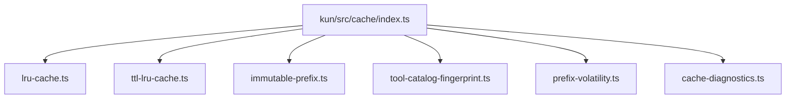
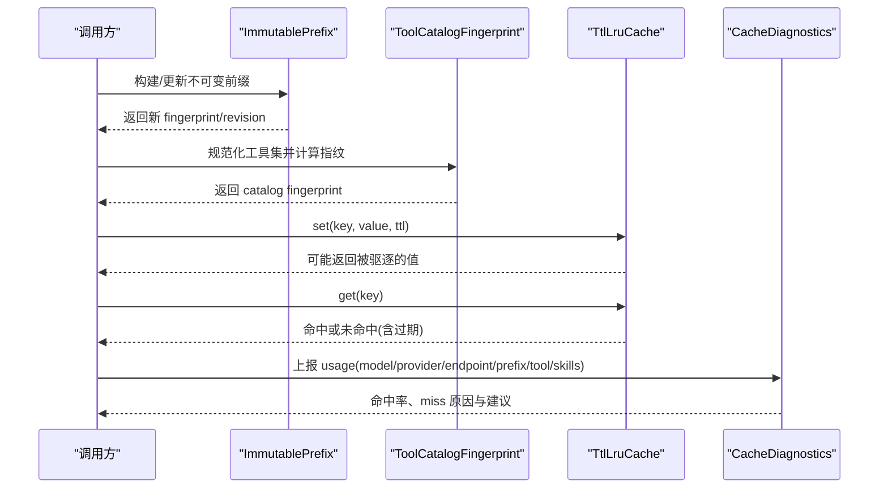
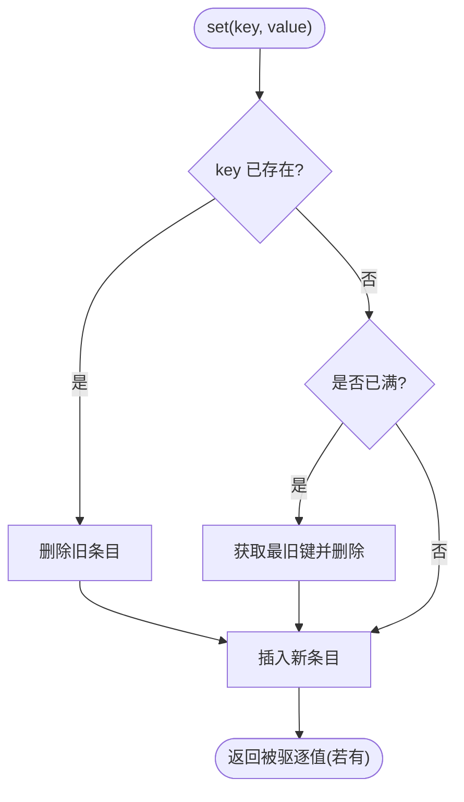
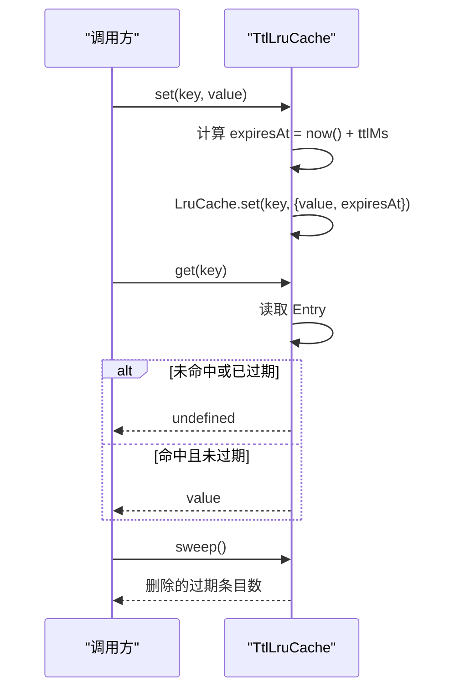
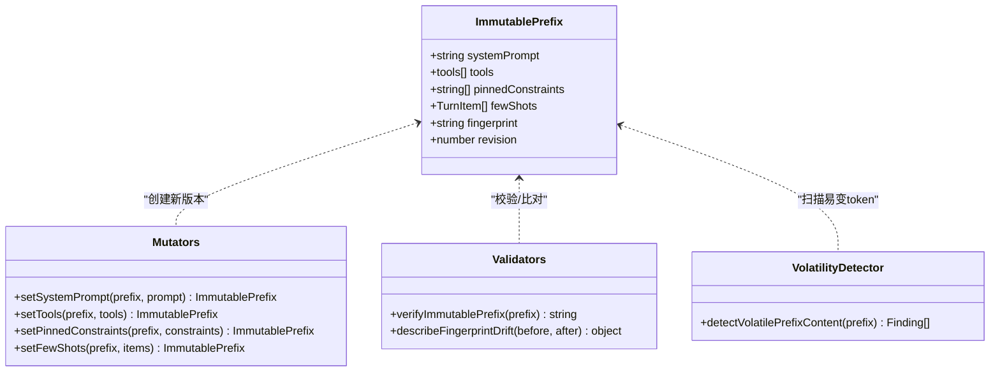
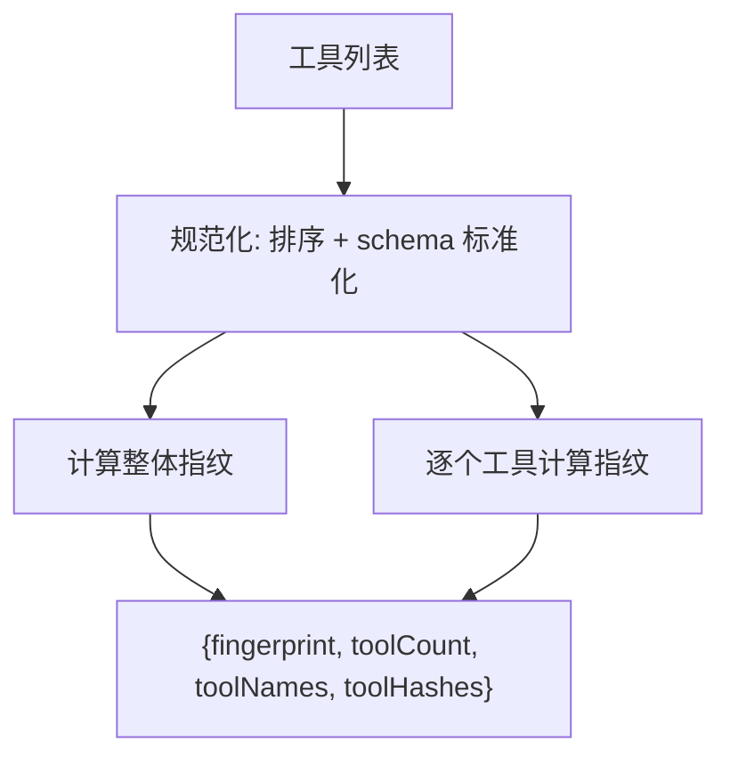
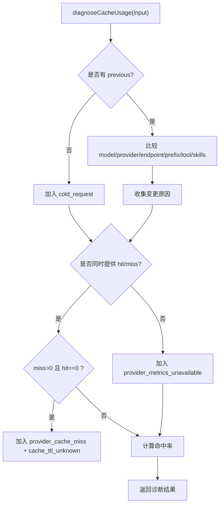
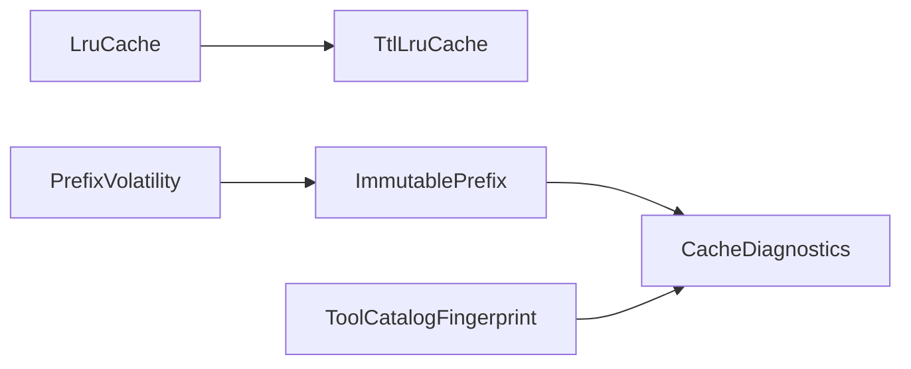

# 缓存策略

<cite>
**本文引用的文件**
- [kun/src/cache/index.ts](file://kun/src/cache/index.ts)
- [kun/src/cache/lru-cache.ts](file://kun/src/cache/lru-cache.ts)
- [kun/src/cache/ttl-lru-cache.ts](file://kun/src/cache/ttl-lru-cache.ts)
- [kun/src/cache/immutable-prefix.ts](file://kun/src/cache/immutable-prefix.ts)
- [kun/src/cache/tool-catalog-fingerprint.ts](file://kun/src/cache/tool-catalog-fingerprint.ts)
- [kun/src/cache/prefix-volatility.ts](file://kun/src/cache/prefix-volatility.ts)
- [kun/src/cache/cache-diagnostics.ts](file://kun/src/cache/cache-diagnostics.ts)
- [docs/kun-cache-optimization.md](file://docs/kun-cache-optimization.md)
- [kun/tests/cache.test.ts](file://kun/tests/cache.test.ts)
</cite>

## 目录
1. [简介](#简介)
2. [项目结构](#项目结构)
3. [核心组件](#核心组件)
4. [架构总览](#架构总览)
5. [详细组件分析](#详细组件分析)
6. [依赖关系分析](#依赖关系分析)
7. [性能与调优](#性能与调优)
8. [故障排查指南](#故障排查指南)
9. [结论](#结论)
10. [附录：配置、示例与使用场景](#附录配置示例与使用场景)

## 简介
本文件系统性说明 DeepSeek-GUI（Kun 运行时）中的缓存策略，覆盖以下方面：
- LRU 缓存的实现原理、内存管理与淘汰策略
- TTL（生存时间）缓存机制：过期设置、自动清理与失效处理
- 不可变前缀缓存设计模式：键生成策略与版本控制
- 工具目录指纹生成：内容哈希计算与变更检测
- 缓存配置选项、性能调优参数与监控指标
- 具体代码示例路径与常见使用场景
- 常见问题定位与解决方案

## 项目结构
缓存子系统位于 kun/src/cache，提供基础缓存容器、TTL 扩展、不可变前缀与指纹工具，以及诊断能力。对外通过 index.ts 统一导出。

**图表来源**
- [kun/src/cache/index.ts:1-6](file://kun/src/cache/index.ts#L1-L6)

**章节来源**
- [kun/src/cache/index.ts:1-6](file://kun/src/cache/index.ts#L1-L6)

## 核心组件
- LruCache：有界 LRU 缓存，支持 get/set/delete/clear/keys/values，满时按最近最少使用淘汰。
- TtlLruCache：在 LRU 基础上增加 TTL 过期；get 会检查过期并删除；提供 sweep 批量清理过期项。
- ImmutablePrefix：不可变前缀对象，维护 systemPrompt/tools/pinnedConstraints/fewShots，并提供稳定 fingerprint 与 revision 版本号，所有变更通过显式 mutator 完成。
- ToolCatalogFingerprint：对工具集合进行规范化与哈希，得到稳定的 catalog fingerprint，用于检测工具集变化。
- PrefixVolatility：扫描不可变前缀中易变的 token（UUID、ISO 时间、十六进制哈希、JWT），辅助发现导致缓存失效的噪声。
- CacheDiagnostics：基于 provider 原生 usage 字段计算命中率、识别 miss 原因并给出建议。

**章节来源**
- [kun/src/cache/lru-cache.ts:1-67](file://kun/src/cache/lru-cache.ts#L1-L67)
- [kun/src/cache/ttl-lru-cache.ts:1-73](file://kun/src/cache/ttl-lru-cache.ts#L1-L73)
- [kun/src/cache/immutable-prefix.ts:1-192](file://kun/src/cache/immutable-prefix.ts#L1-L192)
- [kun/src/cache/tool-catalog-fingerprint.ts:1-57](file://kun/src/cache/tool-catalog-fingerprint.ts#L1-L57)
- [kun/src/cache/prefix-volatility.ts:1-223](file://kun/src/cache/prefix-volatility.ts#L1-L223)
- [kun/src/cache/cache-diagnostics.ts:1-102](file://kun/src/cache/cache-diagnostics.ts#L1-L102)

## 架构总览
缓存子系统围绕“稳定前缀 + 可过期缓存”展开：
- 请求前缀由 ImmutablePrefix 管理，并通过 fingerprint 保证稳定；任何漂移都会触发校验或提示。
- 工具目录通过 ToolCatalogFingerprint 规范化，避免注册顺序或 schema key 顺序导致的缓存失效。
- 实际缓存数据由 LruCache/TtlLruCache 承载，前者用于无时效的短期缓存，后者用于带 TTL 的缓存。
- 运行期通过 CacheDiagnostics 结合 provider 原生命中/未命中统计，评估缓存效果并给出优化建议。
- PrefixVolatility 作为开发期诊断工具，帮助定位前缀中的易变片段。

**图表来源**
- [kun/src/cache/immutable-prefix.ts:83-118](file://kun/src/cache/immutable-prefix.ts#L83-L118)
- [kun/src/cache/tool-catalog-fingerprint.ts:11-21](file://kun/src/cache/tool-catalog-fingerprint.ts#L11-L21)
- [kun/src/cache/ttl-lru-cache.ts:17-48](file://kun/src/cache/ttl-lru-cache.ts#L17-L48)
- [kun/src/cache/cache-diagnostics.ts:31-92](file://kun/src/cache/cache-diagnostics.ts#L31-L92)

## 详细组件分析

### LRU 缓存（LruCache）
- 数据结构：内部使用 Map 维护有序键值对，Map 插入顺序即访问顺序。
- 访问语义：get 会将命中项提升为最新；set 若键已存在则先删除再插入；容量满时删除最旧键。
- 复杂度：get/set/delete 平均 O(1)；keys/values 迭代 O(n)。
- 内存管理：严格受限于 limit；set 返回被驱逐的值，便于上层统计或回写。
- 错误处理：limit 必须为正整数，否则构造抛错。

**图表来源**
- [kun/src/cache/lru-cache.ts:36-49](file://kun/src/cache/lru-cache.ts#L36-L49)

**章节来源**
- [kun/src/cache/lru-cache.ts:1-67](file://kun/src/cache/lru-cache.ts#L1-L67)
- [kun/tests/cache.test.ts:187-218](file://kun/tests/cache.test.ts#L187-L218)

### TTL+LRU 缓存（TtlLruCache）
- 组合策略：以 LruCache 存储 {value, expiresAt} 的 Entry；get 时检查当前时间与 expiresAt，过期则删除并视为未命中。
- 过期设置：构造时指定 ttlMs；set 时记录 expiresAt = now() + ttlMs。
- 自动清理：sweep 遍历全部键，删除过期项并返回删除数量。
- 时间源：可通过 now 注入，便于测试与可控时间推进。

**图表来源**
- [kun/src/cache/ttl-lru-cache.ts:17-71](file://kun/src/cache/ttl-lru-cache.ts#L17-L71)

**章节来源**
- [kun/src/cache/ttl-lru-cache.ts:1-73](file://kun/src/cache/ttl-lru-cache.ts#L1-L73)
- [kun/tests/cache.test.ts:220-238](file://kun/tests/cache.test.ts#L220-L238)

### 不可变前缀缓存（ImmutablePrefix）
- 设计目标：将系统提示词、工具定义、固定约束与 few-shot 等“稳定上下文”封装为不可变对象，确保同一逻辑状态产生相同 fingerprint。
- 键生成策略：fingerprint 由 systemPrompt、tools（规范化排序）、pinnedConstraints、fewShots（仅包含发送给模型的部分）共同决定；JSON schema 的 key 会被递归规范化，避免键序扰动。
- 版本控制：每次显式变更（systemPrompt/tools/pinnedConstraints/fewShots）都会递增 revision 并重新计算 fingerprint。
- 变更检测：verifyImmutablePrefix 可在关键路径校验前缀未被绕过 mutator 直接修改；describeFingerprintDrift 可对比前后差异字段。
- 易变内容检测：detectVolatilePrefixContent 扫描 UUID、ISO 时间、十六进制哈希、JWT 等易变 token，辅助定位前缀漂移根因。

**图表来源**
- [kun/src/cache/immutable-prefix.ts:9-19](file://kun/src/cache/immutable-prefix.ts#L9-L19)
- [kun/src/cache/immutable-prefix.ts:101-161](file://kun/src/cache/immutable-prefix.ts#L101-L161)
- [kun/src/cache/immutable-prefix.ts:163-191](file://kun/src/cache/immutable-prefix.ts#L163-L191)
- [kun/src/cache/prefix-volatility.ts:24-29](file://kun/src/cache/prefix-volatility.ts#L24-L29)

**章节来源**
- [kun/src/cache/immutable-prefix.ts:1-192](file://kun/src/cache/immutable-prefix.ts#L1-L192)
- [kun/src/cache/prefix-volatility.ts:1-223](file://kun/src/cache/prefix-volatility.ts#L1-L223)
- [kun/tests/cache.test.ts:18-139](file://kun/tests/cache.test.ts#L18-L139)

### 工具目录指纹（ToolCatalogFingerprint）
- 规范化：工具数组按 name 排序，inputSchema 递归规范化，消除注册顺序与 schema key 顺序带来的噪声。
- 指纹输出：返回整体 fingerprint、工具数量、工具名列表、每个工具的独立 hash，便于细粒度变更追踪。
- 用途：作为请求签名的一部分参与缓存键生成；当工具描述/schema 变化时，指纹改变，触发缓存失效，保证一致性。

**图表来源**
- [kun/src/cache/tool-catalog-fingerprint.ts:11-21](file://kun/src/cache/tool-catalog-fingerprint.ts#L11-L21)
- [kun/src/cache/tool-catalog-fingerprint.ts:23-56](file://kun/src/cache/tool-catalog-fingerprint.ts#L23-L56)

**章节来源**
- [kun/src/cache/tool-catalog-fingerprint.ts:1-57](file://kun/src/cache/tool-catalog-fingerprint.ts#L1-L57)
- [kun/tests/cache.test.ts:141-185](file://kun/tests/cache.test.ts#L141-L185)

### 缓存诊断（CacheDiagnostics）
- 输入：usage（promptTokens、cacheHitTokens、cacheMissTokens）与前一次/当前请求签名（model、providerId、endpointFormat、prefixFingerprint、toolCatalogFingerprint、activeSkillIds）。
- 输出：可缓存命中率、总输入命中率、miss 原因列表、优化建议。
- 规则：
  - 只有同时提供 hit 与 miss 时才信任 provider 原生指标；否则标记 provider_metrics_unavailable。
  - 若 miss > 0 且 hit == 0，标记 provider_cache_miss 与 cache_ttl_unknown。
  - 根据 model/provider/endpoint/prefix/tool/skills 的变化推断 miss 原因，并给出保持稳定的建议。

**图表来源**
- [kun/src/cache/cache-diagnostics.ts:31-92](file://kun/src/cache/cache-diagnostics.ts#L31-L92)

**章节来源**
- [kun/src/cache/cache-diagnostics.ts:1-102](file://kun/src/cache/cache-diagnostics.ts#L1-L102)

## 依赖关系分析
- LruCache 是基础容器，TtlLruCache 依赖它实现 TTL 行为。
- ImmutablePrefix 与 ToolCatalogFingerprint 共同保障请求前缀与工具集的稳定性，减少缓存失效。
- PrefixVolatility 作为诊断工具，不改变业务逻辑，但帮助开发者定位前缀漂移。
- CacheDiagnostics 依赖 usage 事件与请求签名，向上层提供可观测性。

**图表来源**
- [kun/src/cache/ttl-lru-cache.ts:1-2](file://kun/src/cache/ttl-lru-cache.ts#L1-L2)
- [kun/src/cache/cache-diagnostics.ts:1-29](file://kun/src/cache/cache-diagnostics.ts#L1-L29)

**章节来源**
- [kun/src/cache/ttl-lru-cache.ts:1-73](file://kun/src/cache/ttl-lru-cache.ts#L1-L73)
- [kun/src/cache/cache-diagnostics.ts:1-102](file://kun/src/cache/cache-diagnostics.ts#L1-L102)

## 性能与调优
- LRU 容量选择：根据热点键分布与内存预算设定 limit，避免频繁驱逐导致命中率下降。
- TTL 窗口：根据数据有效性与刷新频率设置 ttlMs；过短导致频繁重建，过长可能导致陈旧数据。
- 前缀稳定化：
  - 将系统提示词、工具 schema、固定约束放入 ImmutablePrefix，避免动态噪声进入稳定前缀。
  - 使用 ToolCatalogFingerprint 规范化工具集，避免注册顺序与 schema key 顺序影响。
- 历史消息清洗：在模型请求边界压缩超长 tool_result、长参数与 base64 payload，减少动态历史对缓存的影响。
- 统计口径：优先使用 provider 原生 cache hit/miss 字段；仅在两者都可用时计算命中率，避免失真。
- 预热策略：保持 model/provider/endpoint/prefix/tool/skills 稳定，有助于快速建立热缓存。

参考文档提供了更全面的优化原则与实践要点。

**章节来源**
- [docs/kun-cache-optimization.md:35-112](file://docs/kun-cache-optimization.md#L35-L112)
- [docs/kun-cache-optimization.md:113-183](file://docs/kun-cache-optimization.md#L113-L183)
- [docs/kun-cache-optimization.md:184-249](file://docs/kun-cache-optimization.md#L184-L249)

## 故障排查指南
- 前缀漂移：
  - 现象：缓存命中率骤降，或出现 stable_prefix_changed 原因。
  - 排查：使用 describeFingerprintDrift 对比前后前缀，定位 systemPrompt/tools/pinnedConstraints/fewShots 的变更；使用 detectVolatilePrefixContent 扫描 UUID、ISO 时间、哈希、JWT 等易变 token。
  - 修复：将易变内容移出稳定前缀，或使用占位符替代动态部分。
- 工具目录变化：
  - 现象：tool_catalog_changed 原因出现。
  - 排查：检查工具描述/schema 是否发生变化；确认工具注册顺序不影响指纹。
- 提供者指标缺失：
  - 现象：provider_metrics_unavailable。
  - 处理：确认 provider 是否返回 hit/miss 字段；如缺失，无法准确评估命中率，需依赖其他指标或升级 provider。
- TTL 相关未命中：
  - 现象：cache_ttl_unknown 与 provider_cache_miss。
  - 处理：检查 TTL 设置是否合理；必要时延长 ttlMs 或调整清理策略。

**章节来源**
- [kun/src/cache/immutable-prefix.ts:163-191](file://kun/src/cache/immutable-prefix.ts#L163-L191)
- [kun/src/cache/prefix-volatility.ts:24-83](file://kun/src/cache/prefix-volatility.ts#L24-L83)
- [kun/src/cache/cache-diagnostics.ts:31-92](file://kun/src/cache/cache-diagnostics.ts#L31-L92)

## 结论
DeepSeek-GUI 的缓存策略以“稳定前缀 + 可过期缓存”为核心，通过 ImmutablePrefix 与 ToolCatalogFingerprint 保证请求前缀的可复用性，借助 LruCache/TtlLruCache 提供高效内存管理与过期控制，并以 CacheDiagnostics 和 PrefixVolatility 提供可观测性与诊断能力。配合历史消息清洗与统计口径规范，能够在多入口场景下维持高命中率与低抖动，提升 token 使用效率与用户体验。

## 附录：配置、示例与使用场景

### 配置选项
- LruCache
  - limit：正整数，表示最大条目数。
- TtlLruCache
  - limit：正整数，最大条目数。
  - ttlMs：正整数，单位毫秒，表示条目存活时间。
  - now：可选函数，用于注入当前时间，便于测试与可控时间推进。
- ImmutablePrefix
  - systemPrompt：字符串，系统提示词。
  - tools：工具定义数组，将被规范化排序。
  - pinnedConstraints：固定约束数组。
  - fewShots：示例消息数组，仅发送部分参与指纹计算。
- ToolCatalogFingerprint
  - 输入：工具列表；输出：整体指纹、工具数量、名称列表、各工具指纹。
- CacheDiagnostics
  - 输入：usage 快照与前后请求签名；输出：命中率、miss 原因与建议。

**章节来源**
- [kun/src/cache/lru-cache.ts:13-18](file://kun/src/cache/lru-cache.ts#L13-L18)
- [kun/src/cache/ttl-lru-cache.ts:17-24](file://kun/src/cache/ttl-lru-cache.ts#L17-L24)
- [kun/src/cache/immutable-prefix.ts:9-19](file://kun/src/cache/immutable-prefix.ts#L9-L19)
- [kun/src/cache/tool-catalog-fingerprint.ts:11-21](file://kun/src/cache/tool-catalog-fingerprint.ts#L11-L21)
- [kun/src/cache/cache-diagnostics.ts:3-29](file://kun/src/cache/cache-diagnostics.ts#L3-L29)

### 代码示例路径
- LRU 基本用法与淘汰行为验证：[kun/tests/cache.test.ts:187-218](file://kun/tests/cache.test.ts#L187-L218)
- TTL 过期与 sweep 清理验证：[kun/tests/cache.test.ts:220-238](file://kun/tests/cache.test.ts#L220-L238)
- ImmutablePrefix 指纹稳定性与漂移检测：[kun/tests/cache.test.ts:18-139](file://kun/tests/cache.test.ts#L18-L139)
- 工具目录指纹稳定性与变更检测：[kun/tests/cache.test.ts:141-185](file://kun/tests/cache.test.ts#L141-L185)

### 典型使用场景
- 会话级短期缓存：使用 LruCache 缓存高频查询结果，限制容量避免内存增长。
- 带时效的中间结果：使用 TtlLruCache 缓存工具执行结果或模型响应片段，设置合适 ttlMs 并在空闲时 sweep 清理。
- 稳定前缀构建：使用 ImmutablePrefix 管理 systemPrompt/tools/pinnedConstraints/fewShots，确保同一逻辑状态产生相同 fingerprint；在关键路径调用 verifyImmutablePrefix 防止静默漂移。
- 工具集变更感知：使用 buildToolCatalogFingerprint 规范化工具集，监控 toolCatalogDrift 并据此决定是否刷新缓存。
- 缓存效果评估：通过 diagnoseCacheUsage 上报 usage 与请求签名，观察命中率与 miss 原因，持续优化前缀与 TTL。

**章节来源**
- [kun/tests/cache.test.ts:18-238](file://kun/tests/cache.test.ts#L18-L238)
- [docs/kun-cache-optimization.md:35-112](file://docs/kun-cache-optimization.md#L35-L112)
- [docs/kun-cache-optimization.md:184-249](file://docs/kun-cache-optimization.md#L184-L249)