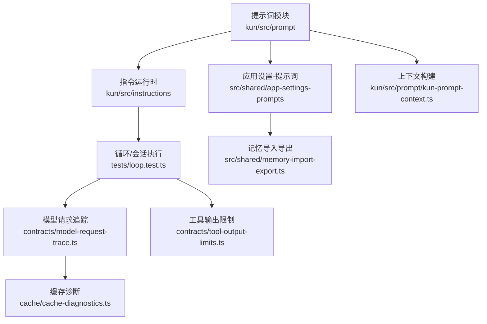
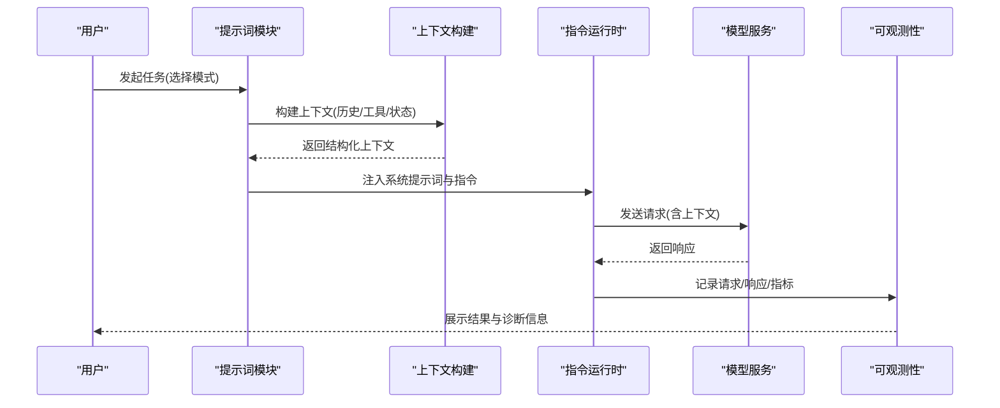
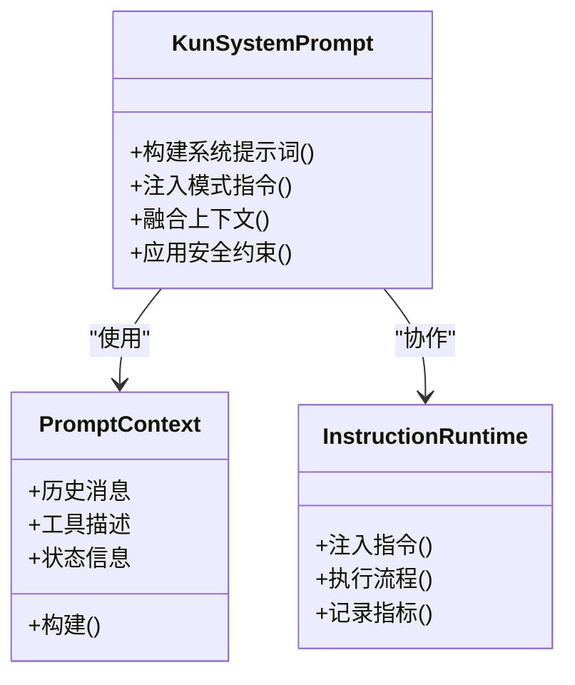
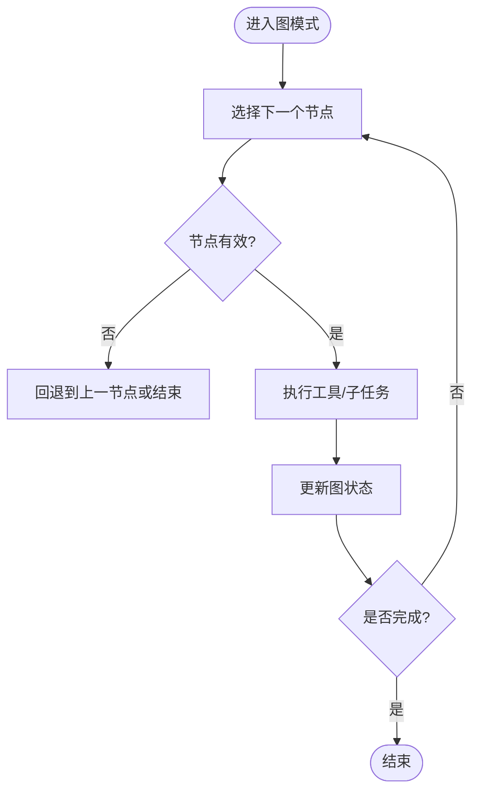
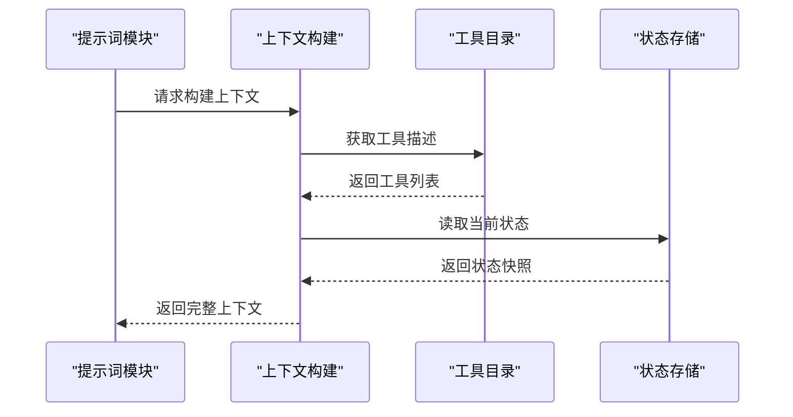
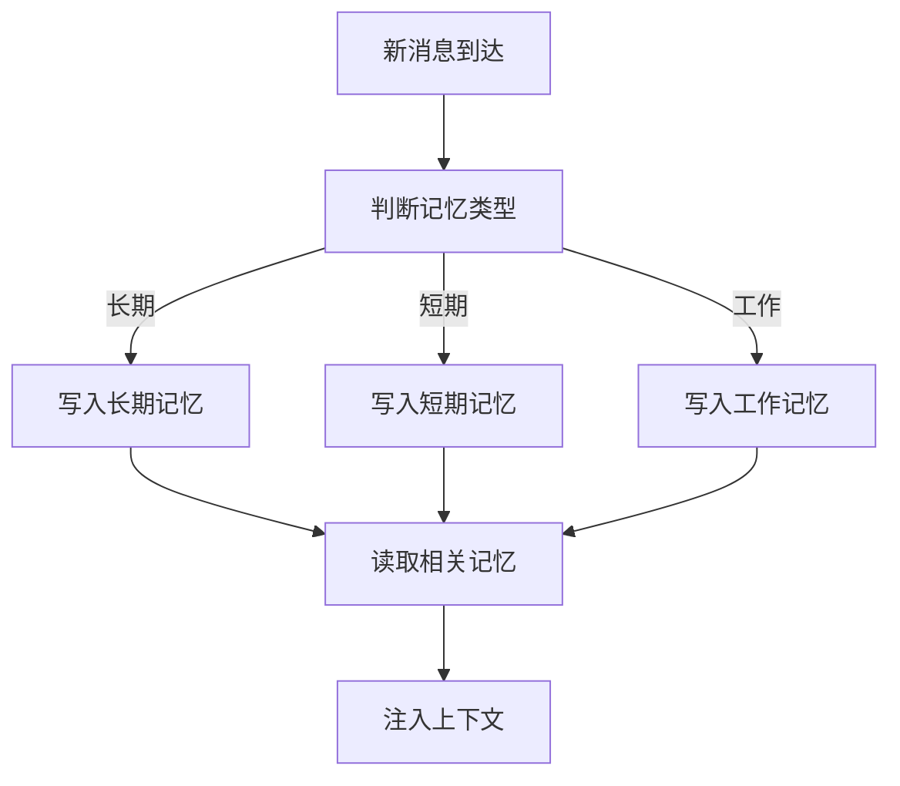
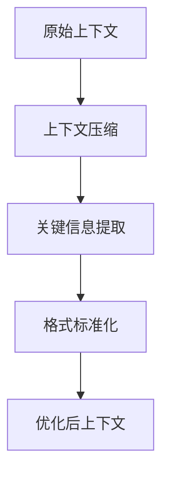
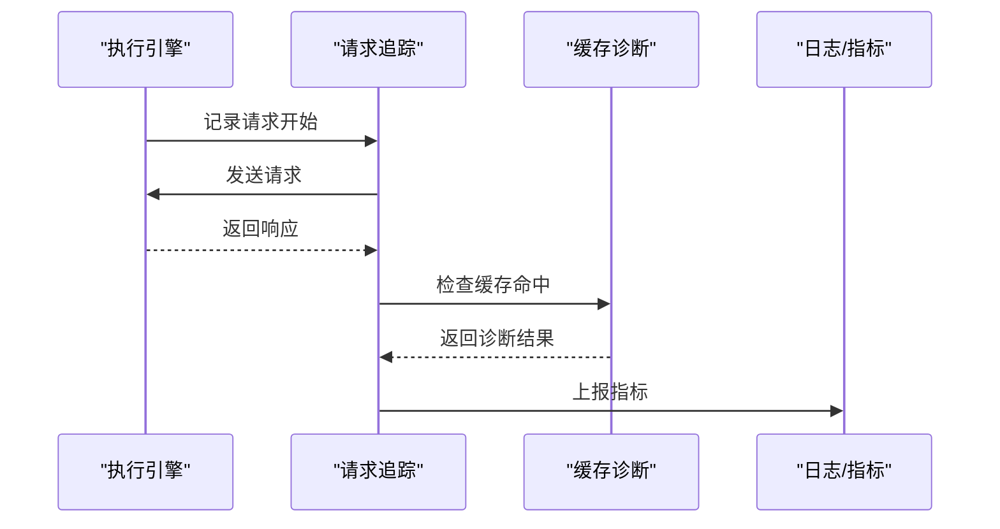
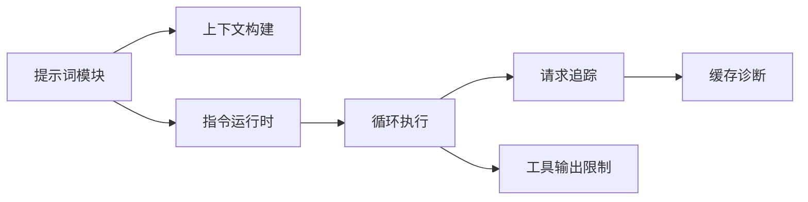

# 提示词工程

<cite>
**本文引用的文件**
- [kun-system-prompt.ts](file://kun/src/prompt/kun-system-prompt.ts)
- [graph-lead-mode.ts](file://kun/src/prompt/graph-lead-mode.ts)
- [kun-prompt-context.ts](file://kun/src/prompt/kun-prompt-context.ts)
- [instruction-runtime.ts](file://kun/src/instructions/instruction-runtime.ts)
- [app-settings-prompts.ts](file://src/shared/app-settings-prompts.ts)
- [memory-import-export.ts](file://src/shared/memory-import-export.ts)
- [loop.test.ts](file://kun/tests/loop.test.ts)
- [agent-loop-transcript.test.ts](file://kun/tests/agent-loop-transcript.test.ts)
- [cache-diagnostics.ts](file://kun/src/cache/cache-diagnostics.ts)
- [model-request-trace.ts](file://kun/src/contracts/model-request-trace.ts)
- [tool-output-limits.ts](file://kun/src/contracts/tool-output-limits.ts)
</cite>

## 目录
1. [简介](#简介)
2. [项目结构](#项目结构)
3. [核心组件](#核心组件)
4. [架构总览](#架构总览)
5. [详细组件分析](#详细组件分析)
6. [依赖关系分析](#依赖关系分析)
7. [性能考量](#性能考量)
8. [故障排查指南](#故障排查指南)
9. [结论](#结论)
10. [附录](#附录)

## 简介
本文件面向DeepSeek-GUI的提示词工程系统，聚焦于系统提示词的架构设计、模块化组织、多模式指令模板、上下文构建机制、记忆指令策略、提示词优化技术以及调试与性能监控方法。文档旨在帮助开发者与使用者理解并高效使用KunSystemPrompt及相关能力，在不同模式下（直接模式、图模式、循环模式等）获得稳定、可观测、可优化的提示词体验。

## 项目结构
提示词工程相关代码主要分布在以下位置：
- kun/src/prompt：系统提示词与图模式引导的核心实现
- kun/src/instructions：指令运行时，负责将指令注入到执行流程中
- src/shared/app-settings-prompts：应用设置中的提示词配置项
- src/shared/memory-import-export：记忆导入导出能力，支撑记忆指令策略
- kun/tests：围绕循环、转录、工具输出限制等的测试，体现提示词在运行时的行为约束
- kun/src/cache 与 kun/src/contracts：缓存诊断与模型请求追踪，用于提示词工程的可观测性与优化

图表来源
- [kun-system-prompt.ts:1-200](file://kun/src/prompt/kun-system-prompt.ts#L1-L200)
- [graph-lead-mode.ts:1-200](file://kun/src/prompt/graph-lead-mode.ts#L1-L200)
- [kun-prompt-context.ts:1-200](file://kun/src/prompt/kun-prompt-context.ts#L1-L200)
- [instruction-runtime.ts:1-200](file://kun/src/instructions/instruction-runtime.ts#L1-L200)
- [app-settings-prompts.ts:1-200](file://src/shared/app-settings-prompts.ts#L1-L200)
- [memory-import-export.ts:1-200](file://src/shared/memory-import-export.ts#L1-L200)
- [loop.test.ts:1-200](file://kun/tests/loop.test.ts#L1-L200)
- [model-request-trace.ts:1-200](file://kun/src/contracts/model-request-trace.ts#L1-L200)
- [tool-output-limits.ts:1-200](file://kun/src/contracts/tool-output-limits.ts#L1-L200)
- [cache-diagnostics.ts:1-200](file://kun/src/cache/cache-diagnostics.ts#L1-L200)

章节来源
- [kun-system-prompt.ts:1-200](file://kun/src/prompt/kun-system-prompt.ts#L1-L200)
- [graph-lead-mode.ts:1-200](file://kun/src/prompt/graph-lead-mode.ts#L1-L200)
- [kun-prompt-context.ts:1-200](file://kun/src/prompt/kun-prompt-context.ts#L1-L200)
- [instruction-runtime.ts:1-200](file://kun/src/instructions/instruction-runtime.ts#L1-L200)
- [app-settings-prompts.ts:1-200](file://src/shared/app-settings-prompts.ts#L1-L200)
- [memory-import-export.ts:1-200](file://src/shared/memory-import-export.ts#L1-L200)
- [loop.test.ts:1-200](file://kun/tests/loop.test.ts#L1-L200)
- [model-request-trace.ts:1-200](file://kun/src/contracts/model-request-trace.ts#L1-L200)
- [tool-output-limits.ts:1-200](file://kun/src/contracts/tool-output-limits.ts#L1-L200)
- [cache-diagnostics.ts:1-200](file://kun/src/cache/cache-diagnostics.ts#L1-L200)

## 核心组件
- KunSystemPrompt：系统提示词的核心构造器，负责按模式与上下文组装系统级指令，确保一致性、安全性与可扩展性。
- GraphLeadMode：图模式下的引导提示词，控制图节点编排、状态流转与工具调用顺序。
- PromptContext：上下文构建器，聚合历史消息、工具描述、状态信息与用户设定，形成稳定的输入结构。
- InstructionRuntime：指令运行时，将系统提示词与业务指令注入到执行流，保证指令生效范围与作用域。
- AppSettingsPrompts：提示词相关的应用设置，支持用户自定义与默认值管理。
- MemoryImportExport：记忆导入导出能力，为长期/短期/工作记忆提供持久化与迁移支持。

章节来源
- [kun-system-prompt.ts:1-200](file://kun/src/prompt/kun-system-prompt.ts#L1-L200)
- [graph-lead-mode.ts:1-200](file://kun/src/prompt/graph-lead-mode.ts#L1-L200)
- [kun-prompt-context.ts:1-200](file://kun/src/prompt/kun-prompt-context.ts#L1-L200)
- [instruction-runtime.ts:1-200](file://kun/src/instructions/instruction-runtime.ts#L1-L200)
- [app-settings-prompts.ts:1-200](file://src/shared/app-settings-prompts.ts#L1-L200)
- [memory-import-export.ts:1-200](file://src/shared/memory-import-export.ts#L1-L200)

## 架构总览
提示词工程以“系统提示词 + 上下文构建 + 指令运行时”为核心，结合“记忆系统”和“可观测性”能力，形成闭环。不同模式通过统一的上下文接口接入，保证提示词的一致性与可维护性。

图表来源
- [kun-system-prompt.ts:1-200](file://kun/src/prompt/kun-system-prompt.ts#L1-L200)
- [kun-prompt-context.ts:1-200](file://kun/src/prompt/kun-prompt-context.ts#L1-L200)
- [instruction-runtime.ts:1-200](file://kun/src/instructions/instruction-runtime.ts#L1-L200)
- [model-request-trace.ts:1-200](file://kun/src/contracts/model-request-trace.ts#L1-L200)

## 详细组件分析

### KunSystemPrompt：系统提示词设计与模块化组织
- 设计理念
  - 统一入口：所有模式的系统提示词通过统一接口生成，避免重复与不一致。
  - 模块化：按职责拆分系统提示词片段（角色定义、安全约束、工具说明、格式规范），便于组合与测试。
  - 可扩展：新增模式或指令时，仅需扩展对应模块，不影响既有逻辑。
- 关键能力
  - 模式切换：根据当前模式（直接/图/循环）动态注入相应指令。
  - 上下文融合：将历史消息、工具描述、状态信息整合进系统提示词。
  - 安全边界：内置安全与合规约束，防止越权与不当输出。
- 复杂度与优化
  - 时间复杂度：按上下文长度线性增长；可通过上下文压缩降低开销。
  - 空间复杂度：受限于上下文窗口；建议采用关键信息提取与格式标准化。

章节来源
- [kun-system-prompt.ts:1-200](file://kun/src/prompt/kun-system-prompt.ts#L1-L200)

#### 类图（概念映射）

图表来源
- [kun-system-prompt.ts:1-200](file://kun/src/prompt/kun-system-prompt.ts#L1-L200)
- [kun-prompt-context.ts:1-200](file://kun/src/prompt/kun-prompt-context.ts#L1-L200)
- [instruction-runtime.ts:1-200](file://kun/src/instructions/instruction-runtime.ts#L1-L200)

### 图模式（Graph Lead Mode）：图节点编排与状态流转
- 特定指令
  - 节点选择：依据目标与上下文选择下一步节点。
  - 状态同步：维护图状态，确保节点间数据一致。
  - 工具调度：按图路径调用工具，处理失败重试与回退。
- 流程图（实际算法映射）

图表来源
- [graph-lead-mode.ts:1-200](file://kun/src/prompt/graph-lead-mode.ts#L1-L200)

章节来源
- [graph-lead-mode.ts:1-200](file://kun/src/prompt/graph-lead-mode.ts#L1-L200)

### 上下文构建机制：历史消息、工具描述与状态信息
- 历史消息管理
  - 保留最近N轮对话，剔除冗余信息，保持上下文窗口稳定。
  - 对长对话进行摘要与压缩，减少token消耗。
- 工具描述注入
  - 动态加载可用工具的描述与参数约束，确保模型正确调用。
  - 工具失败时记录错误原因，辅助后续决策。
- 状态信息整合
  - 将当前模式、图状态、用户偏好等状态信息注入上下文，提升指令遵循度。
- 序列图（实际函数调用流）

图表来源
- [kun-prompt-context.ts:1-200](file://kun/src/prompt/kun-prompt-context.ts#L1-L200)

章节来源
- [kun-prompt-context.ts:1-200](file://kun/src/prompt/kun-prompt-context.ts#L1-L200)

### 记忆指令系统：长期、短期与工作记忆策略
- 长期记忆
  - 持久化重要事实与偏好，跨会话复用。
  - 支持导入导出，便于迁移与备份。
- 短期记忆
  - 保留当前任务的中间结果与临时变量，任务结束后清理。
- 工作记忆
  - 在当前turn内维持关键上下文，避免重复检索。
- 流程图（记忆写入与读取）

图表来源
- [memory-import-export.ts:1-200](file://src/shared/memory-import-export.ts#L1-L200)

章节来源
- [memory-import-export.ts:1-200](file://src/shared/memory-import-export.ts#L1-L200)

### 提示词优化技术：上下文压缩、关键信息提取与格式标准化
- 上下文压缩
  - 对长对话进行摘要，保留关键信息，减少token消耗。
  - 基于重要性评分筛选内容，优先保留高价值片段。
- 关键信息提取
  - 从工具输出与历史消息中提取实体、关系与状态，增强上下文质量。
- 格式标准化
  - 统一输出格式，便于解析与后续处理。
  - 强制约束字段与类型，提高稳定性。
- 流程图（优化过程）

图表来源
- [kun-system-prompt.ts:1-200](file://kun/src/prompt/kun-system-prompt.ts#L1-L200)
- [kun-prompt-context.ts:1-200](file://kun/src/prompt/kun-prompt-context.ts#L1-L200)

章节来源
- [kun-system-prompt.ts:1-200](file://kun/src/prompt/kun-system-prompt.ts#L1-L200)
- [kun-prompt-context.ts:1-200](file://kun/src/prompt/kun-prompt-context.ts#L1-L200)

### 调试工具与性能监控
- 调试工具
  - 模型请求追踪：记录每次请求的输入、输出与耗时，便于定位问题。
  - 工具输出限制：防止工具输出过大导致上下文溢出。
- 性能监控
  - 缓存诊断：分析缓存命中率与失效原因，优化提示词构建效率。
  - 循环与转录测试：验证提示词在循环模式下的稳定性与一致性。
- 序列图（监控流程）

图表来源
- [model-request-trace.ts:1-200](file://kun/src/contracts/model-request-trace.ts#L1-L200)
- [cache-diagnostics.ts:1-200](file://kun/src/cache/cache-diagnostics.ts#L1-L200)
- [tool-output-limits.ts:1-200](file://kun/src/contracts/tool-output-limits.ts#L1-L200)
- [loop.test.ts:1-200](file://kun/tests/loop.test.ts#L1-L200)
- [agent-loop-transcript.test.ts:1-200](file://kun/tests/agent-loop-transcript.test.ts#L1-L200)

章节来源
- [model-request-trace.ts:1-200](file://kun/src/contracts/model-request-trace.ts#L1-L200)
- [cache-diagnostics.ts:1-200](file://kun/src/cache/cache-diagnostics.ts#L1-L200)
- [tool-output-limits.ts:1-200](file://kun/src/contracts/tool-output-limits.ts#L1-L200)
- [loop.test.ts:1-200](file://kun/tests/loop.test.ts#L1-L200)
- [agent-loop-transcript.test.ts:1-200](file://kun/tests/agent-loop-transcript.test.ts#L1-L200)

## 依赖关系分析
提示词工程模块之间的依赖关系清晰，耦合度低，便于扩展与维护。

图表来源
- [kun-system-prompt.ts:1-200](file://kun/src/prompt/kun-system-prompt.ts#L1-L200)
- [kun-prompt-context.ts:1-200](file://kun/src/prompt/kun-prompt-context.ts#L1-L200)
- [instruction-runtime.ts:1-200](file://kun/src/instructions/instruction-runtime.ts#L1-L200)
- [loop.test.ts:1-200](file://kun/tests/loop.test.ts#L1-L200)
- [model-request-trace.ts:1-200](file://kun/src/contracts/model-request-trace.ts#L1-L200)
- [tool-output-limits.ts:1-200](file://kun/src/contracts/tool-output-limits.ts#L1-L200)
- [cache-diagnostics.ts:1-200](file://kun/src/cache/cache-diagnostics.ts#L1-L200)

章节来源
- [kun-system-prompt.ts:1-200](file://kun/src/prompt/kun-system-prompt.ts#L1-L200)
- [kun-prompt-context.ts:1-200](file://kun/src/prompt/kun-prompt-context.ts#L1-L200)
- [instruction-runtime.ts:1-200](file://kun/src/instructions/instruction-runtime.ts#L1-L200)
- [loop.test.ts:1-200](file://kun/tests/loop.test.ts#L1-L200)
- [model-request-trace.ts:1-200](file://kun/src/contracts/model-request-trace.ts#L1-L200)
- [tool-output-limits.ts:1-200](file://kun/src/contracts/tool-output-limits.ts#L1-L200)
- [cache-diagnostics.ts:1-200](file://kun/src/cache/cache-diagnostics.ts#L1-L200)

## 性能考量
- 上下文窗口管理：通过压缩与提取减少token消耗，避免溢出。
- 缓存利用：合理设置缓存键与TTL，提升重复请求的响应速度。
- 工具输出限制：防止大输出阻塞上下文，影响整体性能。
- 监控与调优：基于请求追踪与缓存诊断持续优化提示词构建流程。

[本节为通用指导，不直接分析具体文件]

## 故障排查指南
- 常见问题
  - 上下文溢出：检查历史消息长度与压缩策略。
  - 工具调用失败：查看工具输出限制与错误日志。
  - 图模式卡死：确认节点选择逻辑与状态同步。
- 排查步骤
  - 启用请求追踪，定位慢请求与异常响应。
  - 检查缓存诊断，分析命中率与失效原因。
  - 使用循环与转录测试，验证提示词稳定性。

章节来源
- [model-request-trace.ts:1-200](file://kun/src/contracts/model-request-trace.ts#L1-L200)
- [cache-diagnostics.ts:1-200](file://kun/src/cache/cache-diagnostics.ts#L1-L200)
- [tool-output-limits.ts:1-200](file://kun/src/contracts/tool-output-limits.ts#L1-L200)
- [loop.test.ts:1-200](file://kun/tests/loop.test.ts#L1-L200)
- [agent-loop-transcript.test.ts:1-200](file://kun/tests/agent-loop-transcript.test.ts#L1-L200)

## 结论
DeepSeek-GUI的提示词工程系统通过KunSystemPrompt的统一抽象、上下文构建的灵活组合、指令运行的可靠执行，以及记忆系统与可观测性的支撑，实现了多模式、高性能、易维护的提示词能力。建议在实际使用中关注上下文压缩、工具输出限制与监控指标，持续优化提示词效果与性能。

[本节为总结性内容，不直接分析具体文件]

## 附录
- 最佳实践
  - 明确模式选择：根据任务复杂度选择合适的模式（直接/图/循环）。
  - 精简上下文：定期压缩历史消息，保留关键信息。
  - 规范工具描述：确保工具描述准确、完整，便于模型正确调用。
  - 持续监控：利用请求追踪与缓存诊断优化提示词构建流程。
- 示例参考
  - 图模式引导：参考图模式引导提示词的实现与测试。
  - 循环模式稳定性：参考循环与转录测试用例，确保提示词一致性。

[本节为补充内容，不直接分析具体文件]