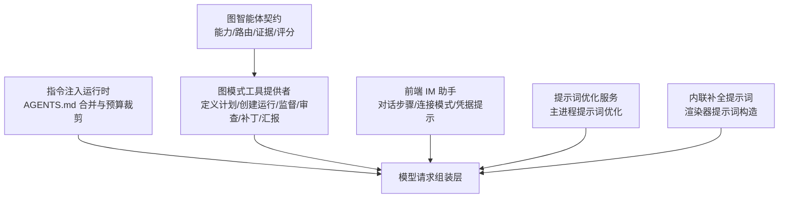
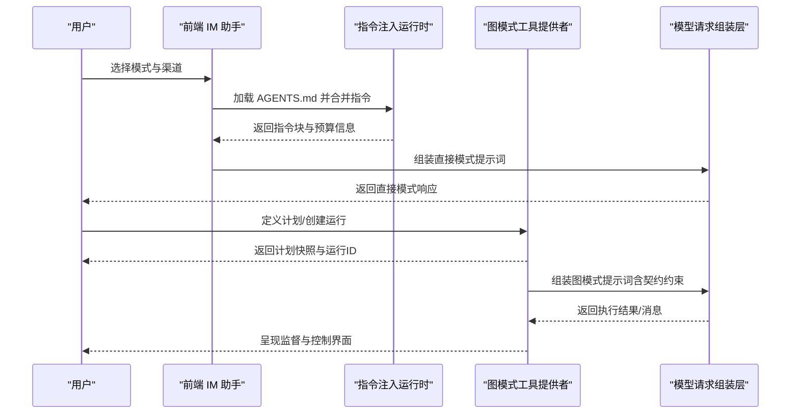
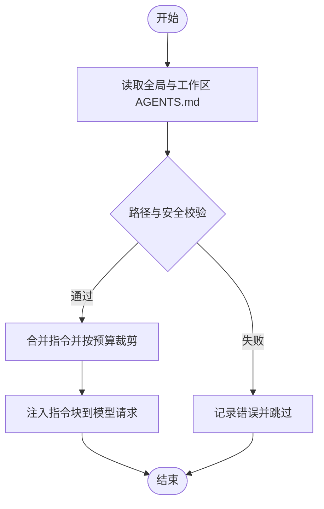
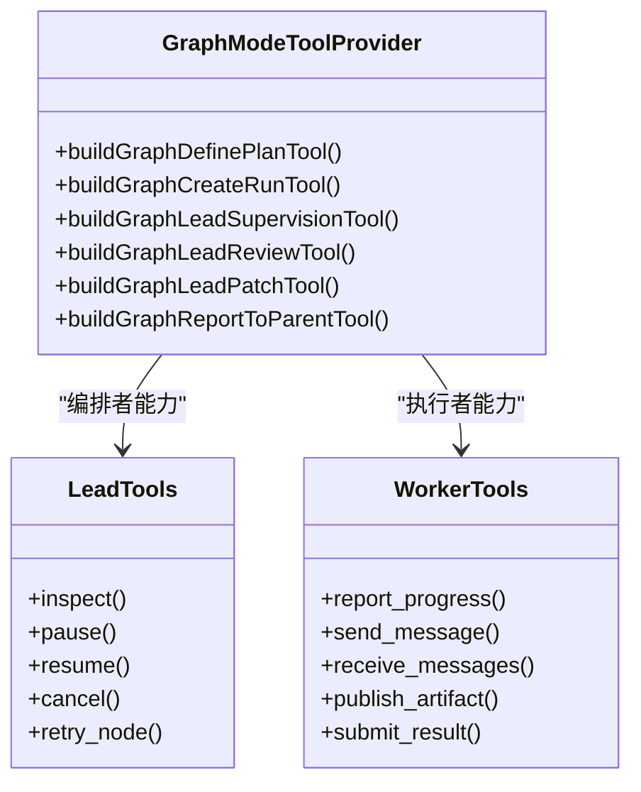
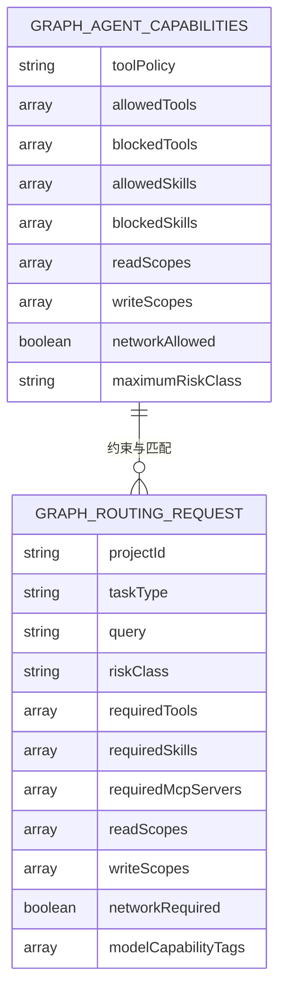
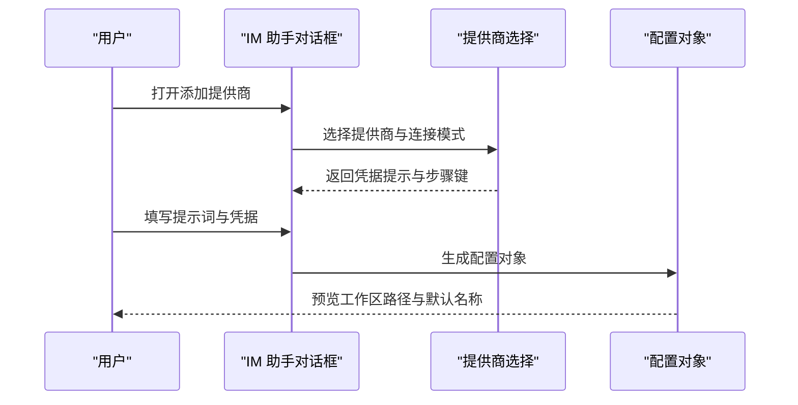
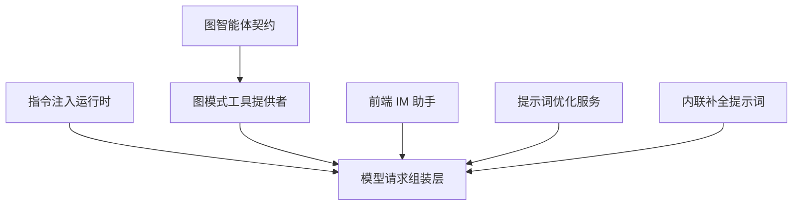

# 模式特定提示词

<cite>
**本文引用的文件**
- [instruction-runtime.ts](file://kun/src/instructions/instruction-runtime.ts)
- [graph-mode-tool-provider.ts](file://kun/src/adapters/tool/graph-mode-tool-provider.ts)
- [graph-agents.ts](file://kun/src/contracts/graph-agents.ts)
- [SidebarClawDialogHelpers.ts](file://src/renderer/src/components/chat/SidebarClawDialogHelpers.ts)
- [prompt-optimization-service.ts](file://src/main/services/prompt-optimization-service.ts)
- [prompt.test.ts](file://src/renderer/src/write/inline-completion/prompt.test.ts)
- [prompt.ts](file://src/renderer/src/write/inline-completion/prompt.ts)
</cite>

## 目录
1. [简介](#简介)
2. [项目结构](#项目结构)
3. [核心组件](#核心组件)
4. [架构总览](#架构总览)
5. [详细组件分析](#详细组件分析)
6. [依赖关系分析](#依赖关系分析)
7. [性能考虑](#性能考虑)
8. [故障排查指南](#故障排查指南)
9. [结论](#结论)
10. [附录](#附录)

## 简介
本文件面向 DeepSeek-GUI 的“模式特定提示词系统”，系统化说明直接模式、图模式、循环模式和计划模式的提示词模板设计、模式切换与上下文转换机制、各模式下的工具使用策略、工作流程与验证要求，以及模式间的数据传递与状态保持。文档同时给出配置选项与自定义指南，并通过实际使用示例展示如何在不同模式下构建有效的提示词。

## 项目结构
与模式特定提示词相关的代码主要分布在以下位置：
- 指令注入运行时：负责从全局与工作区读取 AGENTS.md，按预算裁剪并注入到模型请求中，作为高优先级用户/开发者上下文。
- 图模式工具提供者：提供图编排所需的定义计划、创建运行、监督、审查、补丁、汇报等工具，控制执行边界与权限。
- 图智能体契约：定义智能体能力、路由、证据、评分等数据结构，约束提示词与工具交互的语义。
- 前端 IM 助手：提供对话步骤、连接模式、凭据提示等 UI 侧的模式化引导，辅助用户在不同渠道下完成提示词与配置。
- 提示词优化服务（主进程）：对提示词进行优化与压缩，适配不同模型与上下文长度限制。
- 内联补全提示词（渲染器）：针对内联编辑场景的提示词构造与测试。

**图表来源**
- [instruction-runtime.ts:80-113](file://kun/src/instructions/instruction-runtime.ts#L80-L113)
- [graph-mode-tool-provider.ts:52-146](file://kun/src/adapters/tool/graph-mode-tool-provider.ts#L52-L146)
- [graph-agents.ts:46-85](file://kun/src/contracts/graph-agents.ts#L46-L85)
- [SidebarClawDialogHelpers.ts:154-178](file://src/renderer/src/components/chat/SidebarClawDialogHelpers.ts#L154-L178)
- [prompt-optimization-service.ts:1-200](file://src/main/services/prompt-optimization-service.ts#L1-L200)
- [prompt.ts:1-200](file://src/renderer/src/write/inline-completion/prompt.ts#L1-L200)

**章节来源**
- [instruction-runtime.ts:80-113](file://kun/src/instructions/instruction-runtime.ts#L80-L113)
- [graph-mode-tool-provider.ts:52-146](file://kun/src/adapters/tool/graph-mode-tool-provider.ts#L52-L146)
- [graph-agents.ts:46-85](file://kun/src/contracts/graph-agents.ts#L46-L85)
- [SidebarClawDialogHelpers.ts:154-178](file://src/renderer/src/components/chat/SidebarClawDialogHelpers.ts#L154-L178)
- [prompt-optimization-service.ts:1-200](file://src/main/services/prompt-optimization-service.ts#L1-L200)
- [prompt.ts:1-200](file://src/renderer/src/write/inline-completion/prompt.ts#L1-L200)

## 核心组件
- 指令注入运行时：将全局与工作区的 AGENTS.md 合并为一段高优先级指令块，支持单文件与总量字节预算、截断标记、安全路径校验与缓存。
- 图模式工具提供者：以工具集形式暴露图编排能力，区分 Lead（编排者）与 Worker（执行者）角色，提供计划定义、运行创建、监督控制、消息通信、工件发布与结果提交。
- 图智能体契约：通过结构化类型约束智能体的能力、路由请求、证据与评分，确保提示词与工具调用的一致性。
- 前端 IM 助手：提供多步骤对话框、连接模式选择、凭据提示与默认工作区预览，帮助用户在不同渠道（飞书/Lark、微信、Telegram）下完成提示词与配置。
- 提示词优化服务：在主进程中实现提示词的压缩、去重与格式调整，适配不同模型的上下文窗口与成本。
- 内联补全提示词：在渲染器侧构造内联编辑场景的提示词，包含上下文抽取、任务描述与输出约束。

**章节来源**
- [instruction-runtime.ts:80-113](file://kun/src/instructions/instruction-runtime.ts#L80-L113)
- [graph-mode-tool-provider.ts:52-146](file://kun/src/adapters/tool/graph-mode-tool-provider.ts#L52-L146)
- [graph-agents.ts:46-85](file://kun/src/contracts/graph-agents.ts#L46-L85)
- [SidebarClawDialogHelpers.ts:154-178](file://src/renderer/src/components/chat/SidebarClawDialogHelpers.ts#L154-L178)
- [prompt-optimization-service.ts:1-200](file://src/main/services/prompt-optimization-service.ts#L1-L200)
- [prompt.ts:1-200](file://src/renderer/src/write/inline-completion/prompt.ts#L1-L200)

## 架构总览
下图展示了四种执行模式在提示词系统中的角色与数据流：
- 直接模式：由指令注入运行时提供高优先级上下文，结合前端 IM 助手的对话步骤，快速生成与发送提示词。
- 图模式：通过图模式工具提供者定义计划、创建运行，并在 Lead/Worker 之间传递消息与工件，提示词需遵循图智能体契约。
- 循环模式：在图模式中通过节点重试、监督与消息回传形成闭环；提示词需明确迭代目标与验收标准。
- 计划模式：在图模式中先定义计划再执行，提示词需包含阶段划分、依赖关系与产出物约定。

**图表来源**
- [instruction-runtime.ts:80-113](file://kun/src/instructions/instruction-runtime.ts#L80-L113)
- [graph-mode-tool-provider.ts:52-146](file://kun/src/adapters/tool/graph-mode-tool-provider.ts#L52-L146)
- [SidebarClawDialogHelpers.ts:154-178](file://src/renderer/src/components/chat/SidebarClawDialogHelpers.ts#L154-L178)

## 详细组件分析

### 指令注入运行时（直接模式基础）
- 功能要点：
  - 从全局与工作区读取 AGENTS.md，按顺序合并，优先更具体的工作区指令。
  - 支持单文件大小与总量字节预算，超限时插入截断标记。
  - 安全校验：禁止符号链接、限制工作区外路径解析。
  - 缓存与诊断：记录读取错误、最近注入源与预算使用情况。
- 提示词影响：
  - 指令块作为高优先级上下文注入，不能覆盖系统级安全、审批、沙箱、工具权限或运行时规则。
  - 冲突时以后来且更具体为准，工作区指令优先于全局指令。

**图表来源**
- [instruction-runtime.ts:80-113](file://kun/src/instructions/instruction-runtime.ts#L80-L113)
- [instruction-runtime.ts:237-247](file://kun/src/instructions/instruction-runtime.ts#L237-L247)
- [instruction-runtime.ts:278-326](file://kun/src/instructions/instruction-runtime.ts#L278-L326)

**章节来源**
- [instruction-runtime.ts:80-113](file://kun/src/instructions/instruction-runtime.ts#L80-L113)
- [instruction-runtime.ts:237-247](file://kun/src/instructions/instruction-runtime.ts#L237-L247)
- [instruction-runtime.ts:278-326](file://kun/src/instructions/instruction-runtime.ts#L278-L326)

### 图模式工具提供者（图/循环/计划模式核心）
- 角色划分：
  - Lead（编排者）：定义计划、创建运行、监督控制、审查与补丁。
  - Worker（执行者）：报告进度、收发消息、发布工件、提交结果。
- 工具能力：
  - 定义计划：输入 JSON Schema 约束，支持草稿存储与事件记录。
  - 创建运行：绑定注册表与配置，生成运行 ID。
  - 监督控制：检查、暂停、恢复、取消、重试节点，返回有界决策快照。
  - 消息通信：限定类型与优先级，支持回执与过期。
  - 工件发布：内容寻址存储，受预算与可见性约束。
  - 结果提交：结构化结果，经调度器验证与接受。
- 提示词影响：
  - 提示词需遵循图智能体契约，明确节点职责、数据边与产出物命名。
  - 循环模式需在提示词中声明迭代目标、停止条件与验收标准。
  - 计划模式需在提示词中分阶段描述任务、依赖与交付物。

**图表来源**
- [graph-mode-tool-provider.ts:52-146](file://kun/src/adapters/tool/graph-mode-tool-provider.ts#L52-L146)
- [graph-mode-tool-provider.ts:147-212](file://kun/src/adapters/tool/graph-mode-tool-provider.ts#L147-L212)
- [graph-mode-tool-provider.ts:238-582](file://kun/src/adapters/tool/graph-mode-tool-provider.ts#L238-L582)

**章节来源**
- [graph-mode-tool-provider.ts:52-146](file://kun/src/adapters/tool/graph-mode-tool-provider.ts#L52-L146)
- [graph-mode-tool-provider.ts:147-212](file://kun/src/adapters/tool/graph-mode-tool-provider.ts#L147-L212)
- [graph-mode-tool-provider.ts:238-582](file://kun/src/adapters/tool/graph-mode-tool-provider.ts#L238-L582)

### 图智能体契约（提示词语义约束）
- 关键结构：
  - 智能体能力：工具策略、允许/阻止的工具与技能、读写范围、网络权限、风险等级。
  - 路由请求：任务类型、所需工具/技能/MCP、读写范围、网络需求、模型能力标签。
  - 证据与评分：记录正负中性结果、质量、成本、延迟、可召回性与任务契合度。
- 提示词影响：
  - 提示词必须声明所需工具与技能，避免越权访问。
  - 提示词应明确读写范围，防止非法路径操作。
  - 提示词需考虑风险等级与网络需求，确保安全与合规。

**图表来源**
- [graph-agents.ts:46-85](file://kun/src/contracts/graph-agents.ts#L46-L85)
- [graph-agents.ts:136-170](file://kun/src/contracts/graph-agents.ts#L136-L170)

**章节来源**
- [graph-agents.ts:46-85](file://kun/src/contracts/graph-agents.ts#L46-L85)
- [graph-agents.ts:136-170](file://kun/src/contracts/graph-agents.ts#L136-L170)

### 前端 IM 助手（模式切换与上下文转换）
- 功能要点：
  - 对话步骤：默认设置、提示词编辑、连接配置三阶段。
  - 连接模式：官方安装二维码与 Telegram Token 两种。
  - 凭据提示：针对不同平台（飞书/Lark、微信、Telegram）的字段提示。
  - 工作区预览：根据提供商与凭据生成默认工作区路径。
- 模式切换逻辑：
  - 通过选择提供商与连接模式，动态调整提示词模板与配置项。
  - 在“提示词”步骤中，用户可编辑角色、个性、用户上下文与回复规则。
- 上下文转换：
  - 将用户输入的提示词与凭据转换为后端可识别的配置对象。
  - 在不同渠道间保持一致的提示词结构与变量替换。

**图表来源**
- [SidebarClawDialogHelpers.ts:154-178](file://src/renderer/src/components/chat/SidebarClawDialogHelpers.ts#L154-L178)
- [SidebarClawDialogHelpers.ts:81-118](file://src/renderer/src/components/chat/SidebarClawDialogHelpers.ts#L81-L118)
- [SidebarClawDialogHelpers.ts:262-287](file://src/renderer/src/components/chat/SidebarClawDialogHelpers.ts#L262-L287)

**章节来源**
- [SidebarClawDialogHelpers.ts:154-178](file://src/renderer/src/components/chat/SidebarClawDialogHelpers.ts#L154-L178)
- [SidebarClawDialogHelpers.ts:81-118](file://src/renderer/src/components/chat/SidebarClawDialogHelpers.ts#L81-L118)
- [SidebarClawDialogHelpers.ts:262-287](file://src/renderer/src/components/chat/SidebarClawDialogHelpers.ts#L262-L287)

### 提示词优化服务（跨模式通用）
- 功能要点：
  - 在主进程中实现提示词压缩、去重与格式调整。
  - 适配不同模型的上下文窗口与成本限制。
  - 与渲染器提示词构造协作，确保一致性。
- 模式影响：
  - 直接模式：快速压缩用户输入，保留关键指令。
  - 图模式：压缩计划与节点描述，保留契约约束。
  - 循环模式：压缩迭代日志与状态，保留收敛条件。
  - 计划模式：压缩阶段描述与依赖，保留交付物约定。

**章节来源**
- [prompt-optimization-service.ts:1-200](file://src/main/services/prompt-optimization-service.ts#L1-L200)

### 内联补全提示词（直接模式补充）
- 功能要点：
  - 在渲染器侧构造内联编辑场景的提示词。
  - 包含上下文抽取、任务描述与输出约束。
  - 通过测试用例验证提示词的正确性与鲁棒性。
- 模式影响：
  - 直接模式：用于代码补全与文本编辑的快速反馈。
  - 与其他模式协作：在图模式中作为子任务的提示词片段。

**章节来源**
- [prompt.ts:1-200](file://src/renderer/src/write/inline-completion/prompt.ts#L1-L200)
- [prompt.test.ts:1-200](file://src/renderer/src/write/inline-completion/prompt.test.ts#L1-L200)

## 依赖关系分析
- 指令注入运行时依赖文件系统与安全路径校验，输出指令块供模型请求使用。
- 图模式工具提供者依赖图控制服务、存储、邮箱、注册表与工件存储，提供编排与执行能力。
- 图智能体契约被图模式工具提供者与提示词系统共同引用，确保语义一致。
- 前端 IM 助手依赖配置对象与提供商选择，生成提示词与连接配置。
- 提示词优化服务与内联补全提示词分别位于主进程与渲染器，协同完成提示词构造与优化。

**图表来源**
- [instruction-runtime.ts:80-113](file://kun/src/instructions/instruction-runtime.ts#L80-L113)
- [graph-mode-tool-provider.ts:52-146](file://kun/src/adapters/tool/graph-mode-tool-provider.ts#L52-L146)
- [graph-agents.ts:46-85](file://kun/src/contracts/graph-agents.ts#L46-L85)
- [SidebarClawDialogHelpers.ts:154-178](file://src/renderer/src/components/chat/SidebarClawDialogHelpers.ts#L154-L178)
- [prompt-optimization-service.ts:1-200](file://src/main/services/prompt-optimization-service.ts#L1-L200)
- [prompt.ts:1-200](file://src/renderer/src/write/inline-completion/prompt.ts#L1-L200)

**章节来源**
- [instruction-runtime.ts:80-113](file://kun/src/instructions/instruction-runtime.ts#L80-L113)
- [graph-mode-tool-provider.ts:52-146](file://kun/src/adapters/tool/graph-mode-tool-provider.ts#L52-L146)
- [graph-agents.ts:46-85](file://kun/src/contracts/graph-agents.ts#L46-L85)
- [SidebarClawDialogHelpers.ts:154-178](file://src/renderer/src/components/chat/SidebarClawDialogHelpers.ts#L154-L178)
- [prompt-optimization-service.ts:1-200](file://src/main/services/prompt-optimization-service.ts#L1-L200)
- [prompt.ts:1-200](file://src/renderer/src/write/inline-completion/prompt.ts#L1-L200)

## 性能考虑
- 指令注入运行时：
  - 使用缓存减少重复读取，限制最大缓存条目数。
  - 单文件与总量预算控制，避免过大指令影响模型性能。
- 图模式工具提供者：
  - 消息与工件大小限制，防止阻塞与内存溢出。
  - 监督与控制操作的幂等性，避免重复执行。
- 提示词优化服务：
  - 压缩与去重降低令牌消耗，提升响应速度。
- 内联补全提示词：
  - 局部上下文抽取，减少无关信息干扰。

[本节提供一般性指导，无需特定文件分析]

## 故障排查指南
- 指令注入运行时：
  - 检查 AGENTS.md 是否为文件、是否超出预算、是否存在符号链接或路径逃逸。
  - 查看诊断信息中的读取错误与最近注入源。
- 图模式工具提供者：
  - 确认 Lead/Worker 身份授权，检查运行 ID 与节点归属。
  - 验证消息类型、优先级与收件人，确保工件名称已声明。
- 前端 IM 助手：
  - 检查提供商凭据是否正确，连接模式是否匹配。
  - 确认工作区路径预览是否符合预期。
- 提示词优化服务与内联补全提示词：
  - 验证提示词压缩后的可读性与完整性。
  - 通过测试用例定位问题。

**章节来源**
- [instruction-runtime.ts:115-126](file://kun/src/instructions/instruction-runtime.ts#L115-L126)
- [graph-mode-tool-provider.ts:593-637](file://kun/src/adapters/tool/graph-mode-tool-provider.ts#L593-L637)
- [SidebarClawDialogHelpers.ts:59-79](file://src/renderer/src/components/chat/SidebarClawDialogHelpers.ts#L59-L79)
- [prompt.test.ts:1-200](file://src/renderer/src/write/inline-completion/prompt.test.ts#L1-L200)

## 结论
DeepSeek-GUI 的模式特定提示词系统通过指令注入、图模式工具、智能体契约与前端助手协同工作，实现了直接、图、循环与计划四种模式的灵活切换与上下文转换。系统在安全性、性能与可扩展性方面均有充分考虑，建议在实际使用中遵循契约约束与预算限制，合理配置提示词与工具策略，以获得最佳效果。

[本节总结性内容，无需特定文件分析]

## 附录
- 配置选项：
  - 指令注入运行时：启用开关、单文件与总量字节预算、缓存上限。
  - 图模式工具提供者：计划草稿存储、事件记录、工件预算与可见性。
  - 前端 IM 助手：提供商选择、连接模式、凭据提示与步骤键。
- 自定义指南：
  - 在工作区 AGENTS.md 中编写特定指令，注意预算与安全。
  - 在图模式中定义清晰的节点职责与数据边，遵循契约约束。
  - 在前端 IM 助手中定制提示词模板，适配不同渠道与用户群体。

[本节提供一般性指导，无需特定文件分析]