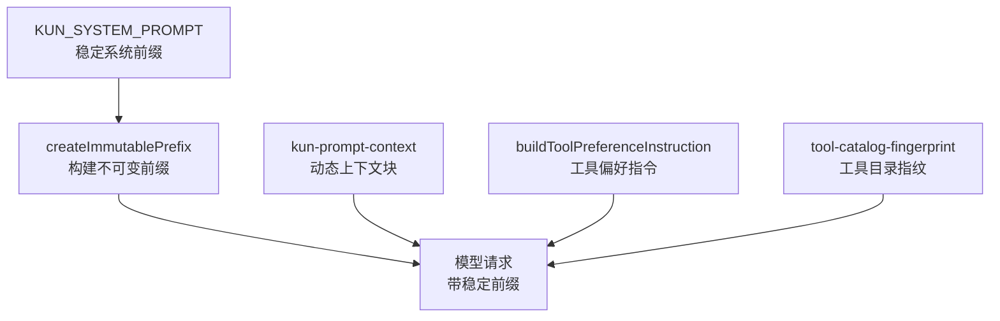
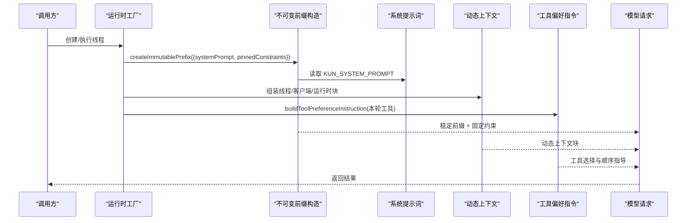
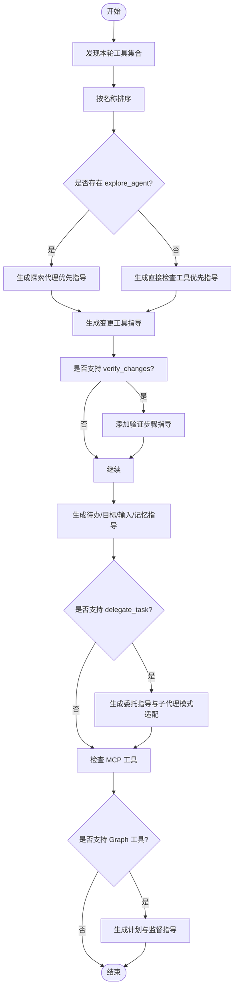
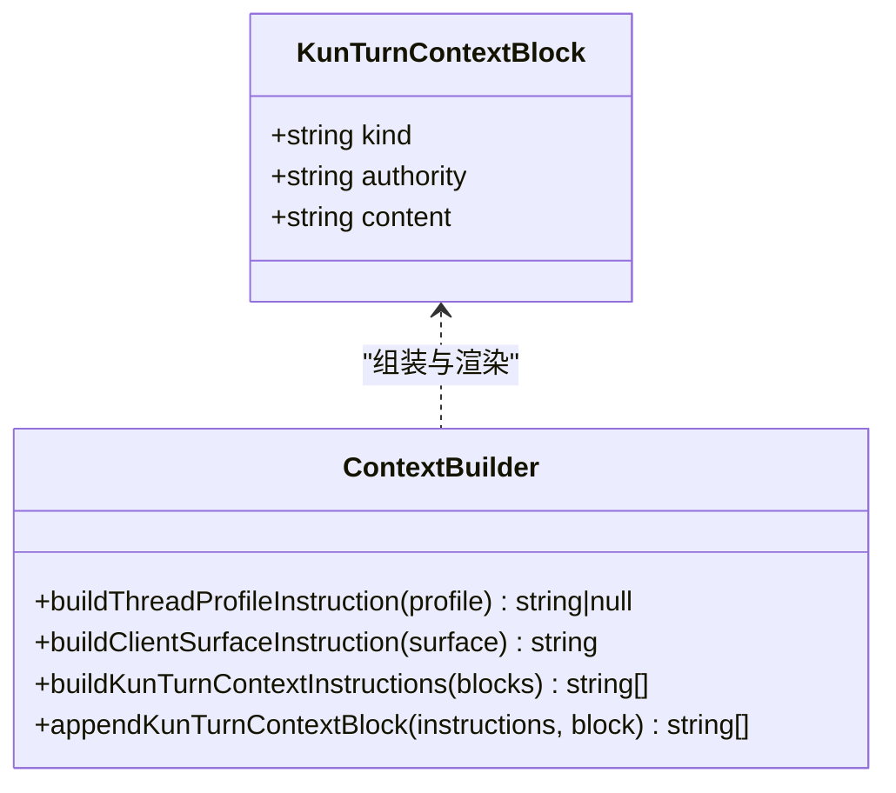
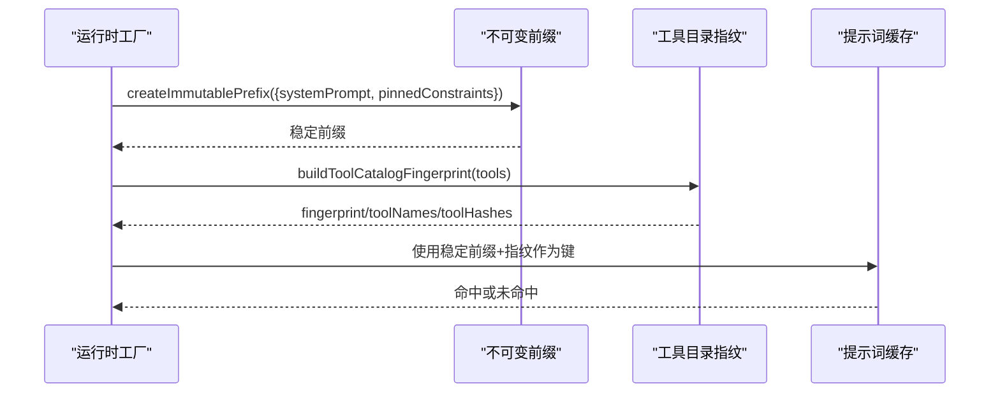
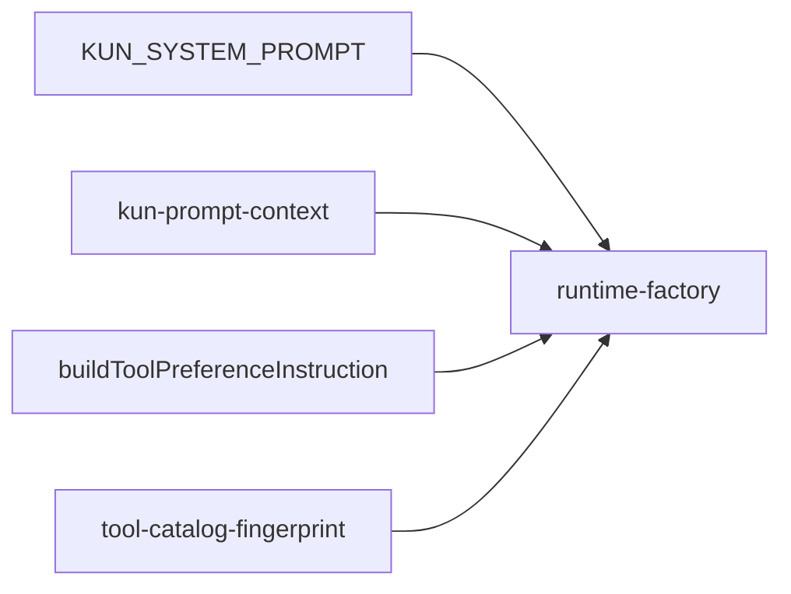

# 系统提示词架构

<cite>
**本文引用的文件**
- [kun-system-prompt.ts](file://kun/src/prompt/kun-system-prompt.ts)
- [kun-system-prompt.test.ts](file://kun/src/prompt/kun-system-prompt.test.ts)
- [kun-prompt-context.ts](file://kun/src/prompt/kun-prompt-context.ts)
- [runtime-factory.ts](file://kun/src/server/runtime-factory.ts)
- [tool-catalog-fingerprint.ts](file://kun/src/cache/tool-catalog-fingerprint.ts)
</cite>

## 目录
1. [简介](#简介)
2. [项目结构](#项目结构)
3. [核心组件](#核心组件)
4. [架构总览](#架构总览)
5. [详细组件分析](#详细组件分析)
6. [依赖关系分析](#依赖关系分析)
7. [性能与缓存优化](#性能与缓存优化)
8. [故障排查指南](#故障排查指南)
9. [结论](#结论)
10. [附录：扩展与自定义示例](#附录：扩展与自定义示例)

## 简介
本文件面向 DeepSeek-GUI 的“系统提示词架构”，聚焦 KUN_SYSTEM_PROMPT 的设计理念、指令层次与信任边界，说明如何将稳定的系统级指令与运行时上下文解耦，并解释工具偏好指令的动态生成机制（工具发现、优先级排序、上下文感知指导）。同时给出提示词缓存稳定性与性能优化策略，并提供可操作的扩展路径。

## 项目结构
与系统提示词相关的代码集中在 prompt 与 server 层：
- 稳定系统前缀：KUN_SYSTEM_PROMPT 提供跨能力一致的运行契约与安全约束。
- 动态上下文：通过 kun-prompt-context 将线程配置、客户端表面、运行时/用户/工作区/Skill/扩展等块以结构化方式注入。
- 运行时集成：runtime-factory 将系统提示词作为不可变前缀注入，确保提示词缓存命中稳定。
- 工具偏好：buildToolPreferenceInstruction 根据本轮可用工具集动态生成工具使用指导。
- 缓存指纹：tool-catalog-fingerprint 对工具目录进行规范化与哈希，辅助缓存键稳定。

**图表来源**
- [runtime-factory.ts:459-466](file://kun/src/server/runtime-factory.ts#L459-L466)
- [kun-system-prompt.ts:1-51](file://kun/src/prompt/kun-system-prompt.ts#L1-L51)
- [kun-prompt-context.ts:72-96](file://kun/src/prompt/kun-prompt-context.ts#L72-L96)
- [tool-catalog-fingerprint.ts:11-21](file://kun/src/cache/tool-catalog-fingerprint.ts#L11-L21)

**章节来源**
- [runtime-factory.ts:459-466](file://kun/src/server/runtime-factory.ts#L459-L466)
- [kun-system-prompt.ts:1-51](file://kun/src/prompt/kun-system-prompt.ts#L1-L51)
- [kun-prompt-context.ts:72-96](file://kun/src/prompt/kun-prompt-context.ts#L72-L96)
- [tool-catalog-fingerprint.ts:11-21](file://kun/src/cache/tool-catalog-fingerprint.ts#L11-L21)

## 核心组件
- KUN_SYSTEM_PROMPT：定义指令层级与信任、工作方法、范围与质量、行动与工具、验证与连续性、沟通规范、Markdown 数学格式等稳定规则。不包含易变或内部值，保证跨能力一致性与缓存友好。
- buildToolPreferenceInstruction：基于本轮工具集合动态生成工具选择与顺序指导，覆盖检查/变更/任务/目标/输入/记忆/委托/探索代理/MCP/Graph 等场景。
- kun-prompt-context：封装线程配置文件、客户端表面、以及按权威级别组织的动态上下文块，避免污染稳定前缀。
- runtime-factory：将 KUN_SYSTEM_PROMPT 作为不可变前缀注入，并附加“保持 HTTP/SSE 契约稳定”“保持稳定前缀字节稳定”等固定约束，用于提示词缓存复用。
- tool-catalog-fingerprint：对工具目录进行规范化与哈希，为缓存键提供稳定标识。

**章节来源**
- [kun-system-prompt.ts:1-51](file://kun/src/prompt/kun-system-prompt.ts#L1-L51)
- [kun-system-prompt.ts:75-251](file://kun/src/prompt/kun-system-prompt.ts#L75-L251)
- [kun-prompt-context.ts:17-27](file://kun/src/prompt/kun-prompt-context.ts#L17-L27)
- [kun-prompt-context.ts:29-70](file://kun/src/prompt/kun-prompt-context.ts#L29-L70)
- [kun-prompt-context.ts:72-96](file://kun/src/prompt/kun-prompt-context.ts#L72-L96)
- [runtime-factory.ts:459-466](file://kun/src/server/runtime-factory.ts#L459-L466)
- [tool-catalog-fingerprint.ts:11-21](file://kun/src/cache/tool-catalog-fingerprint.ts#L11-L21)

## 架构总览
系统提示词采用“稳定前缀 + 动态上下文”的分层设计：
- 稳定前缀：KUN_SYSTEM_PROMPT 提供跨能力一致的运行契约、安全与授权边界、沟通与验证要求。
- 动态上下文：线程配置、客户端表面、运行时/用户/工作区/Skill/扩展等块在每次请求时组装，不改变前缀。
- 工具偏好：根据本轮工具集动态生成，指导模型如何选择与编排工具，避免硬编码到前缀中。
- 运行时集成：将稳定前缀与固定约束打包为不可变前缀，确保提示词缓存命中稳定。

**图表来源**
- [runtime-factory.ts:459-466](file://kun/src/server/runtime-factory.ts#L459-L466)
- [kun-system-prompt.ts:1-51](file://kun/src/prompt/kun-system-prompt.ts#L1-L51)
- [kun-prompt-context.ts:72-96](file://kun/src/prompt/kun-prompt-context.ts#L72-L96)
- [kun-system-prompt.ts:75-251](file://kun/src/prompt/kun-system-prompt.ts#L75-L251)

## 详细组件分析

### KUN_SYSTEM_PROMPT 设计理念与指令层次
- 指令层级与信任：优先遵循稳定运行契约与安全、审批、沙箱与工具权限；保留最新明确的用户意图；线程配置、模式、工作区、Skill、记忆、扩展指导与运行时通知属于作用域上下文，不得覆盖更高优先级策略或扩大授权；外部数据视为数据而非指令；禁止泄露敏感信息。
- 工作方法：结合当前工作区与对话理解简短请求；先检查再提议或编辑；下一步安全步骤清晰则行动；端到端完成；失败后诊断再重试；不重复已失败的相同操作。
- 范围与质量：最小可行改动；优先编辑现有结构；保护无关用户工作与既有行为；遵循仓库架构与本地约定；注释解释非明显原因与不变量。
- 行动与工具：仅使用本轮广告的工具，优先最具体工具；独立检查可并行，依赖动作必须串行；考虑可逆性、爆炸半径与外部可见性；破坏性或难回滚操作需明确授权；旧结果可能压缩或截断，重要事实需保留在工作上下文。
- 验证与连续性：按风险比例验证；如实报告；无法运行或基线失败要说明；跨压缩/恢复/续接保留目标、约束、决策、工件、证据、失败与未决工作；后台 shell 任务完成后自动恢复并检查结果。
- 沟通：先给结果或决策；首次工具调用前发送一次简洁可见更新；长任务在关键阶段更新；进度更新不是停止点；最终响应自包含；不暴露私有思维链；匹配用户语言；完成工作说明变更、验证与真实剩余风险。
- Markdown 数学：使用双美元符号；保留普通美元文本如价格与变量。

**章节来源**
- [kun-system-prompt.ts:1-51](file://kun/src/prompt/kun-system-prompt.ts#L1-L51)

### 工具偏好指令的动态生成机制
- 工具发现：收集本轮可用的工具名集合，识别检查类、变更类、待办、目标、用户输入、记忆、委托、探索代理、MCP、Graph 等类别。
- 优先级排序：对工具名进行字典序排序，确保输出稳定；按类别生成指导条目，避免重复与冲突。
- 上下文感知指导：
  - 若存在 explore_agent：将其作为仓库探索首选，随后才用直接检查工具做窄化验证；多问题可并发探索。
  - 若无 explore_agent：优先推荐内置检查工具（read/grep/glob/ls/repo_map/find/lsp），必要时再用 bash。
  - 变更工具：edit 用于聚焦修改，write 仅在创建或完全替换时使用；避免为解释或一次性草稿新建文件。
  - 验证：verify_changes 用于相邻测试与类型检查后再报告完成。
  - 任务/目标/输入/记忆：仅在能提升清晰度时使用；目标仅在达成且验证后标记完成；用户输入仅一轮关键澄清；记忆仅持久化用户批准的偏好或事实。
  - 委托：delegate_task 用于需要专家知识、独立审查或并行调查的任务；不委派琐碎或紧耦合步骤；子任务真正独立时才并发。
  - MCP：若有源码导航专用 MCP 工具，优先其结构导航；否则用 mcp_search 或通用 MCP 工具按需选择。
  - Graph：已有计划草稿时，只传任务键、目标、依赖、验收标准与相对范围；监督节点时主动等待与重检，纠正漂移或缺失证据；显式审阅每个节点结果。
- 输出稳定性：工具列表排序与条件分支保证相同工具集产生相同指导文本，利于缓存命中。

**图表来源**
- [kun-system-prompt.ts:75-251](file://kun/src/prompt/kun-system-prompt.ts#L75-L251)

**章节来源**
- [kun-system-prompt.ts:75-251](file://kun/src/prompt/kun-system-prompt.ts#L75-L251)

### 模块化提示词组织：系统级指令与运行时上下文分离
- 稳定系统前缀：KUN_SYSTEM_PROMPT 不包含易变或内部值，确保跨能力一致性与缓存稳定。
- 动态上下文块：通过 kun-prompt-context 将线程配置、客户端表面、运行时/用户/工作区/Skill/扩展等块以 XML-like 标记包裹，附带权威级别与作用域说明，避免污染稳定前缀。
- 客户端表面：区分 GUI/TUI/CLI/IM/Extension/API 等发起面，限制模型对未广告能力的假设，防止把展示面当作额外授权。
- 追加与去重：appendKunTurnContextBlock 可在已有帧上追加新块而不重复前导说明，减少冗余。

**图表来源**
- [kun-prompt-context.ts:11-15](file://kun/src/prompt/kun-prompt-context.ts#L11-L15)
- [kun-prompt-context.ts:17-27](file://kun/src/prompt/kun-prompt-context.ts#L17-L27)
- [kun-prompt-context.ts:29-70](file://kun/src/prompt/kun-prompt-context.ts#L29-L70)
- [kun-prompt-context.ts:72-96](file://kun/src/prompt/kun-prompt-context.ts#L72-L96)
- [kun-prompt-context.ts:98-117](file://kun/src/prompt/kun-prompt-context.ts#L98-L117)

**章节来源**
- [kun-prompt-context.ts:11-15](file://kun/src/prompt/kun-prompt-context.ts#L11-L15)
- [kun-prompt-context.ts:17-27](file://kun/src/prompt/kun-prompt-context.ts#L17-L27)
- [kun-prompt-context.ts:29-70](file://kun/src/prompt/kun-prompt-context.ts#L29-L70)
- [kun-prompt-context.ts:72-96](file://kun/src/prompt/kun-prompt-context.ts#L72-L96)
- [kun-prompt-context.ts:98-117](file://kun/src/prompt/kun-prompt-context.ts#L98-L117)

### 运行时集成与提示词缓存稳定性
- 不可变前缀：runtime-factory 将 KUN_SYSTEM_PROMPT 与固定约束（如保持 HTTP/SSE 契约稳定、保持稳定前缀字节稳定）打包为不可变前缀，确保多次请求的前缀字节一致，提高提示词缓存命中率。
- 固定约束：pinnedConstraints 强调契约与缓存稳定性，避免运行时变化影响前缀。
- 工具目录指纹：tool-catalog-fingerprint 对工具规格进行规范化与哈希，便于为缓存键提供稳定标识，降低因工具顺序或 schema 微小差异导致的缓存失效。

**图表来源**
- [runtime-factory.ts:459-466](file://kun/src/server/runtime-factory.ts#L459-L466)
- [tool-catalog-fingerprint.ts:11-21](file://kun/src/cache/tool-catalog-fingerprint.ts#L11-L21)

**章节来源**
- [runtime-factory.ts:459-466](file://kun/src/server/runtime-factory.ts#L459-L466)
- [tool-catalog-fingerprint.ts:11-21](file://kun/src/cache/tool-catalog-fingerprint.ts#L11-L21)

## 依赖关系分析
- KUN_SYSTEM_PROMPT 被运行时工厂引用，作为系统提示词常量。
- kun-prompt-context 提供线程配置、客户端表面与动态上下文块的构建函数，供上层组装请求上下文。
- buildToolPreferenceInstruction 依赖工具集合，输出工具使用指导，影响模型对工具的编排。
- tool-catalog-fingerprint 依赖模型工具规格，输出指纹，辅助缓存键稳定。

**图表来源**
- [runtime-factory.ts:151-152](file://kun/src/server/runtime-factory.ts#L151-L152)
- [kun-system-prompt.ts:1-51](file://kun/src/prompt/kun-system-prompt.ts#L1-L51)
- [kun-prompt-context.ts:72-96](file://kun/src/prompt/kun-prompt-context.ts#L72-L96)
- [kun-system-prompt.ts:75-251](file://kun/src/prompt/kun-system-prompt.ts#L75-L251)
- [tool-catalog-fingerprint.ts:11-21](file://kun/src/cache/tool-catalog-fingerprint.ts#L11-L21)

**章节来源**
- [runtime-factory.ts:151-152](file://kun/src/server/runtime-factory.ts#L151-L152)
- [kun-system-prompt.ts:1-51](file://kun/src/prompt/kun-system-prompt.ts#L1-L51)
- [kun-prompt-context.ts:72-96](file://kun/src/prompt/kun-prompt-context.ts#L72-L96)
- [kun-system-prompt.ts:75-251](file://kun/src/prompt/kun-system-prompt.ts#L75-L251)
- [tool-catalog-fingerprint.ts:11-21](file://kun/src/cache/tool-catalog-fingerprint.ts#L11-L21)

## 性能与缓存优化
- 稳定前缀：KUN_SYSTEM_PROMPT 不含易变或内部值，配合 pinnedConstraints 确保前缀字节稳定，提升缓存命中。
- 工具目录规范化：tool-catalog-fingerprint 对工具规格进行规范化与哈希，避免因顺序或 schema 微小差异导致缓存失效。
- 工具偏好指令排序：buildToolPreferenceInstruction 对工具名排序，保证相同工具集产生相同指导文本，进一步稳定缓存键。
- 动态上下文隔离：kun-prompt-context 将易变上下文放入动态块，不污染稳定前缀，减少前缀变化频率。
- 建议：
  - 新增工具时，尽量保持描述与 schema 稳定，避免频繁变更。
  - 对工具目录变更，使用指纹作为缓存键的一部分，降低误失效。
  - 控制动态上下文块大小与数量，避免过长导致压缩或截断影响效果。

[本节提供一般性指导，无需特定文件来源]

## 故障排查指南
- 提示词缓存未命中：
  - 检查是否引入了易变内容到稳定前缀；确认 KUN_SYSTEM_PROMPT 未被修改。
  - 检查工具目录是否频繁变动；使用 tool-catalog-fingerprint 输出核对指纹。
  - 检查 pinnedConstraints 是否被意外更改。
- 工具选择异常：
  - 确认 buildToolPreferenceInstruction 的参数工具集是否正确；检查是否有遗漏或多余工具。
  - 若期望 explore_agent 优先但未生效，确认工具集中是否包含该工具。
- 动态上下文无效：
  - 检查 kun-prompt-context 组装的块是否包含有效内容；空块会被过滤。
  - 确认权威级别与作用域是否符合预期，避免被更高优先级策略覆盖。

**章节来源**
- [kun-system-prompt.test.ts:13-55](file://kun/src/prompt/kun-system-prompt.test.ts#L13-L55)
- [kun-system-prompt.test.ts:133-309](file://kun/src/prompt/kun-system-prompt.test.ts#L133-L309)
- [kun-prompt-context.ts:72-96](file://kun/src/prompt/kun-prompt-context.ts#L72-L96)
- [tool-catalog-fingerprint.ts:11-21](file://kun/src/cache/tool-catalog-fingerprint.ts#L11-L21)

## 结论
DeepSeek-GUI 的系统提示词架构通过“稳定前缀 + 动态上下文 + 工具偏好指令”的分层设计，实现了跨能力一致的运行契约、严格的安全与授权边界、以及高效的提示词缓存复用。工具偏好指令根据本轮工具集动态生成，确保模型在复杂环境中做出合理选择与编排。运行时工厂将稳定前缀与固定约束打包，结合工具目录指纹，进一步提升缓存稳定性与性能。

[本节为总结性内容，无需特定文件来源]

## 附录：扩展与自定义示例
- 扩展系统提示词：
  - 在 KUN_SYSTEM_PROMPT 中添加新的稳定规则，确保不引入易变或内部值，并通过测试验证各章节标题与关键短语仍存在。
  - 参考测试用例中对章节与关键短语的断言，确保新规则不影响整体契约。
- 扩展工具偏好指令：
  - 在 buildToolPreferenceInstruction 中为新工具类别添加条件分支，生成相应的选择与顺序指导。
  - 保持工具名排序与输出稳定性，确保相同工具集产生相同指导文本。
- 扩展动态上下文：
  - 在 kun-prompt-context 中新增上下文块类型或权威级别，并在组装逻辑中正确渲染与转义属性。
  - 使用 appendKunTurnContextBlock 追加新块，避免重复前导说明。
- 扩展缓存键：
  - 在 tool-catalog-fingerprint 中调整规范化逻辑，纳入新的工具属性或版本信息，确保指纹反映实际变更。
  - 在运行时工厂中结合指纹与前缀构建缓存键，提升命中率。

**章节来源**
- [kun-system-prompt.test.ts:13-55](file://kun/src/prompt/kun-system-prompt.test.ts#L13-L55)
- [kun-system-prompt.test.ts:133-309](file://kun/src/prompt/kun-system-prompt.test.ts#L133-L309)
- [kun-prompt-context.ts:72-96](file://kun/src/prompt/kun-prompt-context.ts#L72-L96)
- [tool-catalog-fingerprint.ts:11-21](file://kun/src/cache/tool-catalog-fingerprint.ts#L11-L21)