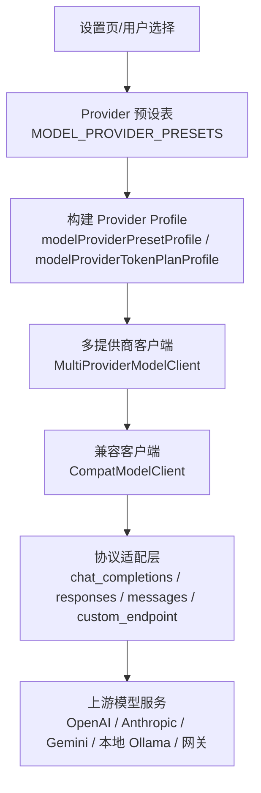
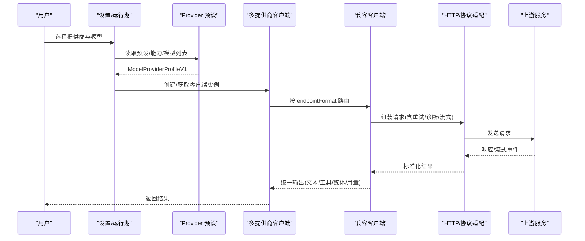
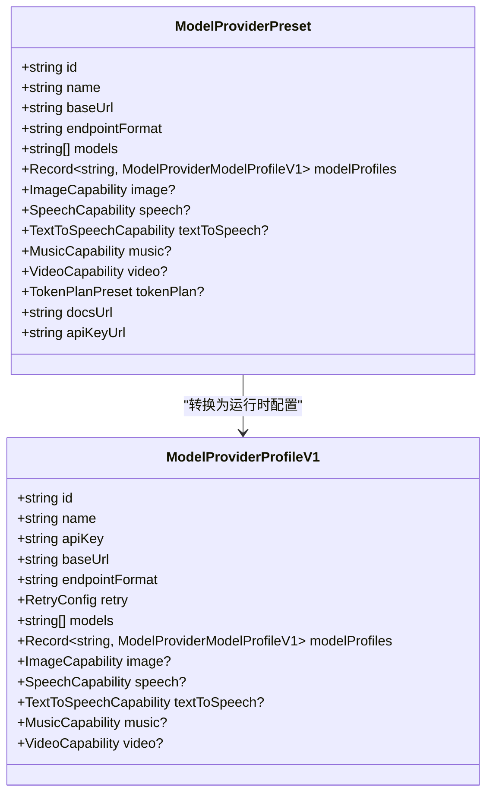
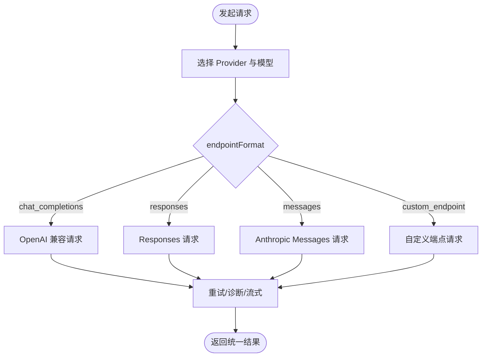
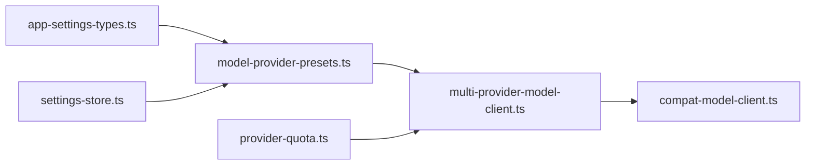

# 多提供商支持

<cite>
**本文引用的文件**
- [model-provider-presets.ts](file://src/shared/model-provider-presets.ts)
- [model-provider-presets.md](file://docs/model-provider-presets.md)
- [compat-model-client.ts](file://kun/src/adapters/model/compat-model-client.ts)
- [extension-model-provider.ts](file://kun/src/adapters/model/extension-model-provider.ts)
- [multi-provider-model-client.ts](file://kun/src/adapters/model/multi-provider-model-client.ts)
- [app-settings-types.ts](file://src/shared/app-settings-types.ts)
- [provider-quota.ts](file://src/shared/provider-quota.ts)
- [settings-store.ts](file://src/main/settings-store.ts)
- [proxy-fetch.ts](file://src/main/proxy-fetch.ts)
</cite>

## 目录
1. [简介](#简介)
2. [项目结构](#项目结构)
3. [核心组件](#核心组件)
4. [架构总览](#架构总览)
5. [详细组件分析](#详细组件分析)
6. [依赖关系分析](#依赖关系分析)
7. [性能与可靠性](#性能与可靠性)
8. [故障排除指南](#故障排除指南)
9. [结论](#结论)
10. [附录：配置示例与能力映射](#附录配置示例与能力映射)

## 简介
本文件面向 DeepSeek-GUI 的多模型提供商支持，系统性说明如何接入 OpenAI GPT 系列、Anthropic Claude、Google Gemini、本地部署模型等主流提供商。文档涵盖：
- 支持的模型服务类型与协议（OpenAI Chat Completions、Responses、Anthropic Messages、自定义端点）
- 提供商发现机制（内置预设注册、Token Plan 子账户、扩展型提供商）
- 每种提供商的特殊配置项（API 密钥、代理、速率限制、重试策略）
- 能力映射（文本、视觉、语音、图像、音乐、视频、推理能力）
- 完整配置流程与常见问题排查

## 项目结构
DeepSeek-GUI 将“提供商预设”与“运行时客户端”解耦：
- 预设层：集中声明各提供商的 base URL、endpointFormat、可用模型、能力与文档链接
- 运行时层：根据所选 provider 解析为具体请求协议，统一处理流式、工具调用、图片生成、用量统计等

图表来源
- [model-provider-presets.ts:389-1053](file://src/shared/model-provider-presets.ts#L389-L1053)
- [compat-model-client.ts](file://kun/src/adapters/model/compat-model-client.ts)
- [multi-provider-model-client.ts](file://kun/src/adapters/model/multi-provider-model-client.ts)

章节来源
- [model-provider-presets.ts:389-1053](file://src/shared/model-provider-presets.ts#L389-L1053)
- [model-provider-presets.md:1-136](file://docs/model-provider-presets.md#L1-L136)

## 核心组件
- 提供商预设与能力定义：集中管理各提供商的基础信息、模型列表、能力（文本/视觉/语音/图像/音乐/视频）、推理能力、Token Plan 区域与独立 Key 前缀提示
- 多提供商路由：根据当前激活 provider 与模型 profile 选择正确的 endpointFormat 与能力端点
- 兼容客户端：封装重试、诊断、流式解码、工具调用、图片生成等通用逻辑
- 扩展提供商：允许通过扩展注入新的模型传输或能力

章节来源
- [model-provider-presets.ts:176-229](file://src/shared/model-provider-presets.ts#L176-L229)
- [model-provider-presets.ts:1067-1092](file://src/shared/model-provider-presets.ts#L1067-L1092)
- [compat-model-client.ts](file://kun/src/adapters/model/compat-model-client.ts)
- [extension-model-provider.ts](file://kun/src/adapters/model/extension-model-provider.ts)

## 架构总览
下图展示从用户选择到实际网络请求的关键路径，以及能力分支（图像、语音、视频）。

图表来源
- [model-provider-presets.ts:1067-1092](file://src/shared/model-provider-presets.ts#L1067-L1092)
- [compat-model-client.ts](file://kun/src/adapters/model/compat-model-client.ts)
- [multi-provider-model-client.ts](file://kun/src/adapters/model/multi-provider-model-client.ts)

## 详细组件分析

### 提供商预设与能力映射
- 预设字段：id、name、baseUrl、endpointFormat、models、modelProfiles、image/speech/textToSpeech/music/video、tokenPlan、docsUrl、apiKeyUrl
- 能力映射：
  - 文本聊天：textChatProfile
  - 视觉聊天：visionChatProfile
  - 推理能力：不同提供商使用不同 requestProtocol（如 anthropic-thinking、openai-responses、deepseek-chat-completions、qwen-chat-completions、thinking-toggle-chat-completions 等）
  - 图像/语音/TTS/音乐/视频：各自 protocol + baseUrl + models
- Token Plan：独立 base URL、可选 region 列表、独立 key 前缀提示；通过 tokenPlanProviderId 派生 id

图表来源
- [model-provider-presets.ts:176-229](file://src/shared/model-provider-presets.ts#L176-L229)
- [model-provider-presets.ts:1067-1092](file://src/shared/model-provider-presets.ts#L1067-L1092)

章节来源
- [model-provider-presets.ts:231-334](file://src/shared/model-provider-presets.ts#L231-L334)
- [model-provider-presets.ts:1301-1338](file://src/shared/model-provider-presets.ts#L1301-L1338)
- [model-provider-presets.ts:1098-1162](file://src/shared/model-provider-presets.ts#L1098-L1162)

### 多提供商路由与兼容客户端
- MultiProviderModelClient：根据 providerId 与模型 profile 决定 endpointFormat、能力端点、重试策略
- CompatModelClient：统一封装重试、诊断、流式解码、工具调用、图片生成、用量上报

图表来源
- [multi-provider-model-client.ts](file://kun/src/adapters/model/multi-provider-model-client.ts)
- [compat-model-client.ts](file://kun/src/adapters/model/compat-model-client.ts)

章节来源
- [multi-provider-model-client.ts](file://kun/src/adapters/model/multi-provider-model-client.ts)
- [compat-model-client.ts](file://kun/src/adapters/model/compat-model-client.ts)

### 扩展型提供商
- 通过 extension-model-provider 可注入新的模型传输或能力，保持与内置预设一致的接口
- 适用于企业私有网关、第三方聚合平台或内部模型服务

章节来源
- [extension-model-provider.ts](file://kun/src/adapters/model/extension-model-provider.ts)

### 配额与用量
- 提供统一的用量记录与配额展示能力，便于在多提供商场景下追踪消耗

章节来源
- [provider-quota.ts](file://src/shared/provider-quota.ts)

## 依赖关系分析
- 预设模块依赖类型定义（app-settings-types），用于约束 profile、能力、重试等结构
- 运行时客户端依赖预设生成的 profile，并据此选择协议与能力端点
- 设置存储负责持久化 provider 配置与激活状态

图表来源
- [app-settings-types.ts](file://src/shared/app-settings-types.ts)
- [model-provider-presets.ts:389-1053](file://src/shared/model-provider-presets.ts#L389-L1053)
- [multi-provider-model-client.ts](file://kun/src/adapters/model/multi-provider-model-client.ts)
- [compat-model-client.ts](file://kun/src/adapters/model/compat-model-client.ts)
- [settings-store.ts](file://src/main/settings-store.ts)
- [provider-quota.ts](file://src/shared/provider-quota.ts)

章节来源
- [app-settings-types.ts](file://src/shared/app-settings-types.ts)
- [model-provider-presets.ts:389-1053](file://src/shared/model-provider-presets.ts#L389-L1053)
- [settings-store.ts](file://src/main/settings-store.ts)

## 性能与可靠性
- 重试策略：预设默认包含最大尝试次数、初始延迟、HTTP 状态码白名单；可在 provider 设置中覆盖或关闭
- 流式处理：统一基于协议适配层进行增量输出，降低首字节延迟
- 诊断与日志：兼容客户端提供 HTTP 诊断信息，便于定位超时、鉴权失败、限流等问题
- 代理支持：主进程网络请求可通过代理转发，适合企业内网环境

章节来源
- [model-provider-presets.ts:1059-1065](file://src/shared/model-provider-presets.ts#L1059-L1065)
- [compat-model-client.ts](file://kun/src/adapters/model/compat-model-client.ts)
- [proxy-fetch.ts](file://src/main/proxy-fetch.ts)

## 故障排除指南
- 鉴权失败（401/403）：检查 API Key 是否正确、是否属于对应计费模式（按量 vs Token Plan）、Key 前缀是否符合预设提示
- 连接失败/超时：确认 baseUrl 与 endpointFormat 匹配；企业环境检查代理设置；查看诊断日志中的错误码
- 模型不可用：核对 models 列表与 modelProfiles 中的 contextWindowTokens、inputModalities、reasoning.requestProtocol
- 速率限制：适当增加重试间隔或降低并发；必要时切换 provider 或升级套餐
- 订阅通道异常：Claude/Gemini/Cursor 等订阅模式需遵循专用传输（agent-sdk/antigravity-cli/gemini-cli-api/cursor-sdk），不要误用公共 API Key 端点

章节来源
- [model-provider-presets.ts:1059-1065](file://src/shared/model-provider-presets.ts#L1059-L1065)
- [compat-model-client.ts](file://kun/src/adapters/model/compat-model-client.ts)
- [proxy-fetch.ts](file://src/main/proxy-fetch.ts)

## 结论
DeepSeek-GUI 通过“预设 + 运行时客户端”的分层设计，实现了对多种模型提供商的统一接入与能力抽象。用户可以在设置中选择内置预设或添加自定义提供商，系统自动完成协议选择、能力映射与请求编排。配合重试、诊断与代理能力，可在复杂网络与企业环境中稳定运行。

## 附录：配置示例与能力映射

### 常见提供商配置要点
- OpenAI GPT 系列
  - endpointFormat：chat_completions 或 responses
  - 能力：文本、视觉、工具调用；部分模型支持推理参数
  - 建议：优先使用 responses 以获得更一致的工具与推理行为
- Anthropic Claude
  - endpointFormat：messages
  - 能力：文本、视觉、推理（anthropic-thinking）
  - 注意：订阅模式通过 agent-sdk 委托整轮对话
- Google Gemini
  - 两种订阅路径：Antigravity CLI（整轮委托）与 Gemini CLI Code Assist API（原生传输）
  - 能力：文本、视觉、语音（特定传输）
- 本地部署（Ollama）
  - endpointFormat：chat_completions
  - 优势：复用单一 HTTP 循环，支持流式、工具、图片、用量

章节来源
- [model-provider-presets.ts:412-516](file://src/shared/model-provider-presets.ts#L412-L516)
- [model-provider-presets.ts:504-516](file://src/shared/model-provider-presets.ts#L504-L516)
- [model-provider-presets.md:36-136](file://docs/model-provider-presets.md#L36-L136)

### 能力映射速查
- 文本聊天：textChatProfile(contextWindowTokens?, reasoning?, endpointFormat?)
- 视觉聊天：visionChatProfile(contextWindowTokens?, reasoning?, endpointFormat?)
- 推理能力：不同提供商使用不同 requestProtocol
- 图像/语音/TTS/音乐/视频：各自 protocol + baseUrl + models

章节来源
- [model-provider-presets.ts:1301-1338](file://src/shared/model-provider-presets.ts#L1301-L1338)
- [model-provider-presets.ts:1377-1425](file://src/shared/model-provider-presets.ts#L1377-L1425)

### Token Plan 与多账户
- Token Plan 会生成独立 provider id（后缀 -token-plan），拥有独立的 baseUrl、region、key 前缀提示
- 同一预设可创建多个账户实例，系统自动分配唯一 id 与名称

章节来源
- [model-provider-presets.ts:1094-1162](file://src/shared/model-provider-presets.ts#L1094-L1162)
- [model-provider-presets.ts:1196-1242](file://src/shared/model-provider-presets.ts#L1196-L1242)