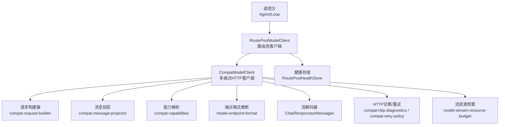
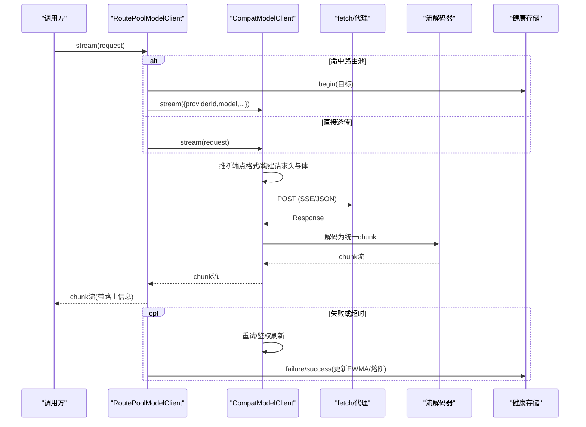
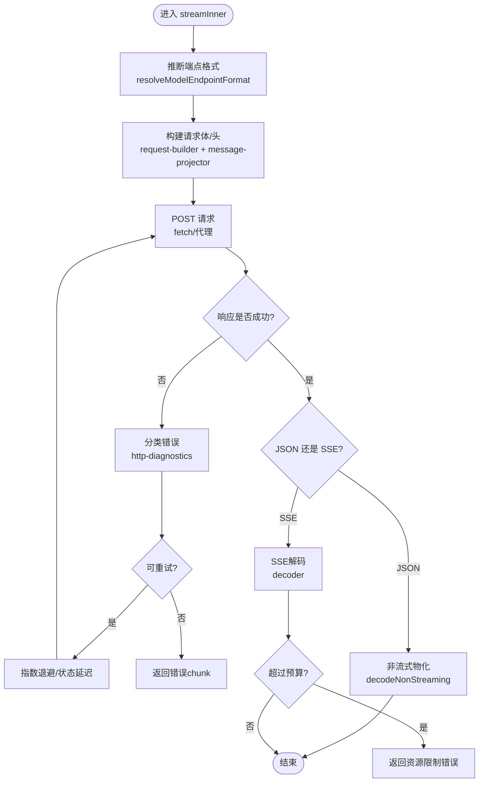
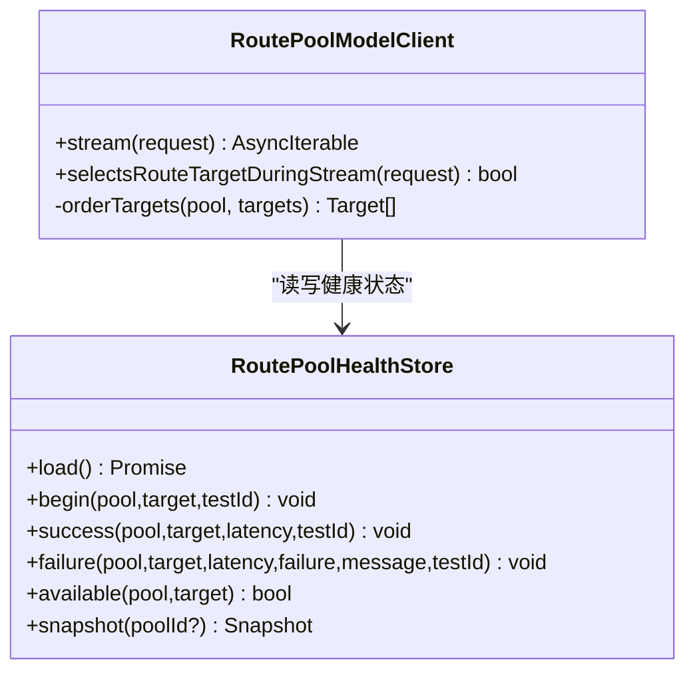
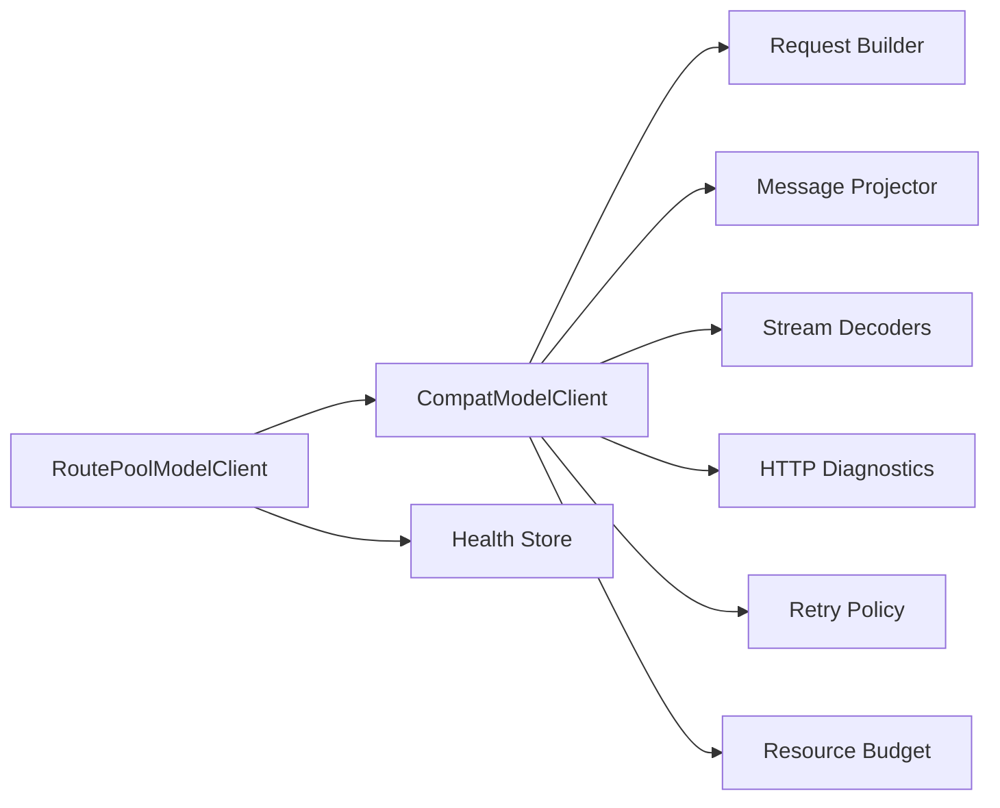

# 模型提供商适配

<cite>
**本文引用的文件**
- [compat-model-client.ts](file://kun/src/adapters/model/compat-model-client.ts)
- [model-endpoint-format.ts](file://kun/src/contracts/model-endpoint-format.ts)
- [route-pool-model-client.ts](file://kun/src/adapters/model/route-pool-model-client.ts)
- [model-route-pool.ts](file://kun/src/contracts/model-route-pool.ts)
- [compat-capabilities.ts](file://kun/src/adapters/model/compat-capabilities.ts)
- [chat-completions-stream-decoder.ts](file://kun/src/adapters/model/chat-completions-stream-decoder.ts)
- [responses-stream-decoder.ts](file://kun/src/adapters/model/responses-stream-decoder.ts)
- [anthropic-messages-stream-decoder.ts](file://kun/src/adapters/model/anthropic-messages-stream-decoder.ts)
- [compat-request-builder.ts](file://kun/src/adapters/model/compat-request-builder.ts)
- [compat-message-projector.ts](file://kun/src/adapters/model/compat-message-projector.ts)
- [compat-http-diagnostics.ts](file://kun/src/adapters/model/compat-http-diagnostics.ts)
- [compat-retry-policy.ts](file://kun/src/adapters/model/compat-retry-policy.ts)
- [model-stream-resource-budget.ts](file://kun/src/adapters/model/model-stream-resource-budget.ts)
</cite>

## 目录
1. [简介](#简介)
2. [项目结构](#项目结构)
3. [核心组件](#核心组件)
4. [架构总览](#架构总览)
5. [详细组件分析](#详细组件分析)
6. [依赖关系分析](#依赖关系分析)
7. [性能与可靠性](#性能与可靠性)
8. [故障排查指南](#故障排查指南)
9. [结论](#结论)
10. [附录：配置示例与最佳实践](#附录：配置示例与最佳实践)

## 简介
本文件面向 DeepSeek-GUI 的“模型提供商适配层”，系统性说明多模型提供商的统一抽象设计、请求处理流程、端点格式自动识别与转换、能力检测、以及路由池管理（负载均衡、故障转移、成本优化）。重点围绕 CompatModelClient 的核心架构，以及 RoutePoolModelClient 的路由策略与健康治理展开。

## 项目结构
适配层位于 kun/src/adapters/model 与 kun/src/contracts 中，核心职责包括：
- 统一 ModelClient 接口抽象
- 多协议/多端点兼容（Chat Completions、Responses、Messages）
- 流式与非流式响应解码
- 能力探测与请求体构建
- 重试、限流、资源预算与调试追踪
- 多目标路由池与熔断/半开探测

图表来源
- [compat-model-client.ts:203-553](file://kun/src/adapters/model/compat-model-client.ts#L203-L553)
- [route-pool-model-client.ts:207-355](file://kun/src/adapters/model/route-pool-model-client.ts#L207-L355)
- [model-endpoint-format.ts:1-79](file://kun/src/contracts/model-endpoint-format.ts#L1-L79)

章节来源
- [compat-model-client.ts:203-553](file://kun/src/adapters/model/compat-model-client.ts#L203-L553)
- [route-pool-model-client.ts:207-355](file://kun/src/adapters/model/route-pool-model-client.ts#L207-L355)
- [model-endpoint-format.ts:1-79](file://kun/src/contracts/model-endpoint-format.ts#L1-L79)

## 核心组件
- CompatModelClient：实现 ModelClient 接口的通用 HTTP 客户端，支持 Chat Completions、OpenAI Responses、Anthropic Messages 三种形状；内置重试、鉴权刷新、SSE 恢复、资源限制与调试记录。
- RoutePoolModelClient：在 CompatModelClient 之上提供多目标路由池，按策略选择目标，并在内容提交前进行故障转移，同时维护健康状态与事件日志。
- 端点格式模块：统一归一化与推断 chat_completions、responses、messages、custom_endpoint。
- 能力解析：根据模型与提供者元数据决定 endpointFormat、reasoning、supportsVision、maxOutputTokens、serviceTiers 等。
- 流解码器：分别处理不同协议的 SSE/JSON 流，产出统一的 ModelStreamChunk。
- 资源预算：限制单次响应的字节数、工具调用数量、思考轮次等，防止资源耗尽。

章节来源
- [compat-model-client.ts:72-111](file://kun/src/adapters/model/compat-model-client.ts#L72-L111)
- [model-endpoint-format.ts:1-79](file://kun/src/contracts/model-endpoint-format.ts#L1-L79)
- [compat-capabilities.ts](file://kun/src/adapters/model/compat-capabilities.ts)
- [chat-completions-stream-decoder.ts](file://kun/src/adapters/model/chat-completions-stream-decoder.ts)
- [responses-stream-decoder.ts](file://kun/src/adapters/model/responses-stream-decoder.ts)
- [anthropic-messages-stream-decoder.ts](file://kun/src/adapters/model/anthropic-messages-stream-decoder.ts)
- [model-stream-resource-budget.ts](file://kun/src/adapters/model/model-stream-resource-budget.ts)

## 架构总览
下图展示一次典型请求从上层到下游模型的完整路径，包含端点格式推断、请求构建、流式传输、错误分类与重试、以及路由池的健康治理。

图表来源
- [compat-model-client.ts:230-553](file://kun/src/adapters/model/compat-model-client.ts#L230-L553)
- [route-pool-model-client.ts:240-338](file://kun/src/adapters/model/route-pool-model-client.ts#L240-L338)
- [model-endpoint-format.ts:62-79](file://kun/src/contracts/model-endpoint-format.ts#L62-L79)

## 详细组件分析

### CompatModelClient：统一抽象与请求处理
- 入口与流式处理
  - stream() 作为对外入口，可选开启调试记录，内部委托 streamInner() 完成端到端流程。
  - streamInner() 负责：
    - 基于模型与 baseUrl 推断端点格式（chat_completions/responses/messages/custom_endpoint）
    - 构建请求体（消息投影、工具规范、推理模式、最大输出令牌等）
    - 构建请求头（API Key、自定义头、Codex session_id、流式标记）
    - 发起 HTTP 请求并处理非 2xx、401 鉴权刷新、可重试状态码
    - 对 JSON 响应进行非流式物化，或对 SSE 流进行解码
    - 使用资源预算限制响应大小、工具调用次数等
    - 将统一 chunk 流返回给调用方

- 端点格式自动识别
  - 通过 model-endpoint-format 的 inferModelEndpointFormatFromUrl 与 resolveModelEndpointFormat，结合 provider 配置的 endpointFormat，确定最终 wire format。
  - 支持别名归一化（如 v1/chat/completions、/v1/responses 等）。

- 请求构建与消息投影
  - 使用 compat-request-builder 生成不同协议的请求体。
  - 使用 compat-message-projector 将历史消息转换为各协议所需的消息结构，支持图片输入、thinking mode 等。

- 流解码与恢复
  - 针对 Chat Completions、Responses、Anthropic Messages 分别解码。
  - 遇到临时失败或限流时，可在不破坏事务安全的前提下进行有限恢复（例如在不发送内容前的阶段回退重试）。

- 重试与鉴权刷新
  - 使用 compat-retry-policy 计算指数退避与基于状态的延迟。
  - 401 且 credentials.refreshable 时，自动刷新凭证并重试。

- 资源预算与调试
  - 使用 model-stream-resource-budget 限制总字节、工具调用、思考轮次等。
  - 可选 LlmDebugSink 捕获每次尝试的请求体与原始响应片段，便于问题定位。

图表来源
- [compat-model-client.ts:266-553](file://kun/src/adapters/model/compat-model-client.ts#L266-L553)
- [model-endpoint-format.ts:62-79](file://kun/src/contracts/model-endpoint-format.ts#L62-L79)
- [compat-http-diagnostics.ts](file://kun/src/adapters/model/compat-http-diagnostics.ts)
- [compat-retry-policy.ts](file://kun/src/adapters/model/compat-retry-policy.ts)
- [model-stream-resource-budget.ts](file://kun/src/adapters/model/model-stream-resource-budget.ts)

章节来源
- [compat-model-client.ts:203-553](file://kun/src/adapters/model/compat-model-client.ts#L203-L553)
- [model-endpoint-format.ts:1-79](file://kun/src/contracts/model-endpoint-format.ts#L1-L79)
- [compat-request-builder.ts](file://kun/src/adapters/model/compat-request-builder.ts)
- [compat-message-projector.ts](file://kun/src/adapters/model/compat-message-projector.ts)
- [compat-http-diagnostics.ts](file://kun/src/adapters/model/compat-http-diagnostics.ts)
- [compat-retry-policy.ts](file://kun/src/adapters/model/compat-retry-policy.ts)
- [model-stream-resource-budget.ts](file://kun/src/adapters/model/model-stream-resource-budget.ts)

### 路由池管理：负载均衡、故障转移与成本优化
- 路由策略
  - priority：按优先级顺序尝试
  - round-robin：轮询
  - weighted-round-robin：加权轮询
  - least-latency：基于 EWMA 延迟排序
  - adaptive：综合成功率、延迟、连续失败次数的自适应评分

- 健康治理
  - 记录每个目标的 success/failure、consecutiveFailures、lastError、ewmaLatencyMs
  - 熔断：连续失败达到阈值后打开熔断窗口，冷却期内仅允许有限次半开探测
  - 持久化：健康状态与最近事件落盘，重启后可恢复

- 故障转移时机
  - 在“内容提交前”阶段发生失败时，路由池会丢弃已缓冲的非内容块，切换到下一个目标，避免向调用方暴露被拒绝的目标
  - 一旦开始输出内容（assistant_text_delta/tool_call_delta 等），则视为已提交，不再切换

图表来源
- [route-pool-model-client.ts:207-355](file://kun/src/adapters/model/route-pool-model-client.ts#L207-L355)
- [route-pool-model-client.ts:51-166](file://kun/src/adapters/model/route-pool-model-client.ts#L51-L166)

章节来源
- [route-pool-model-client.ts:207-355](file://kun/src/adapters/model/route-pool-model-client.ts#L207-L355)
- [route-pool-model-client.ts:51-166](file://kun/src/adapters/model/route-pool-model-client.ts#L51-L166)
- [model-route-pool.ts:1-77](file://kun/src/contracts/model-route-pool.ts#L1-L77)

### 端点格式适配机制
- 支持的格式
  - chat_completions：默认，兼容 OpenAI 风格
  - responses：OpenAI Responses 协议
  - messages：Anthropic Messages 协议
  - custom_endpoint：根据 baseUrl 后缀自动推断

- 推断规则
  - 若配置为 custom_endpoint，则根据 URL 路径结尾判断具体格式
  - 其他情况直接使用配置值（归一化后）

- 影响范围
  - 决定请求体结构与头部字段
  - 决定流解码器选择
  - 影响某些提供商的特殊处理（如 Codex 会话 ID、lite 模式）

章节来源
- [model-endpoint-format.ts:1-79](file://kun/src/contracts/model-endpoint-format.ts#L1-L79)
- [compat-model-client.ts:274-298](file://kun/src/adapters/model/compat-model-client.ts#L274-L298)

### 模型能力检测
- 能力维度
  - supportsVision：是否接受图像输入
  - reasoning：是否原生支持推理轮次
  - maxOutputTokens：最大输出令牌上限
  - serviceTiers：服务层级（如 fast/optimized）
  - endpointFormat：按模型覆盖的 wire format

- 动态发现
  - 通过 compat-capabilities 解析模型与提供者元数据
  - 在请求构建时应用能力约束（如图片转发、推理模式、最大输出令牌）

章节来源
- [compat-model-client.ts:578-584](file://kun/src/adapters/model/compat-model-client.ts#L578-L584)
- [compat-capabilities.ts](file://kun/src/adapters/model/compat-capabilities.ts)
- [compat-request-builder.ts](file://kun/src/adapters/model/compat-request-builder.ts)

### 流式响应与工具调用
- 流解码器
  - Chat Completions：标准 SSE 片段解码
  - Responses：专用流解码与内容跟踪
  - Anthropic Messages：Thinking 状态管理与消息流解码

- 工具调用
  - 工具规范归一化与参数修复
  - 流式工具调用增量推送，完成后合并结果

章节来源
- [chat-completions-stream-decoder.ts](file://kun/src/adapters/model/chat-completions-stream-decoder.ts)
- [responses-stream-decoder.ts](file://kun/src/adapters/model/responses-stream-decoder.ts)
- [anthropic-messages-stream-decoder.ts](file://kun/src/adapters/model/anthropic-messages-stream-decoder.ts)
- [compat-request-builder.ts](file://kun/src/adapters/model/compat-request-builder.ts)

## 依赖关系分析
- 低耦合高内聚
  - CompatModelClient 仅依赖协议无关的构建器、解码器与诊断模块
  - RoutePoolModelClient 封装策略与健康治理，不关心具体协议细节
- 外部依赖
  - fetch/代理：统一网络出口，支持代理与超时控制
  - 健康存储：可选持久化，提升跨进程稳定性
- 潜在循环依赖
  - 当前分层清晰，未见循环引用风险

图表来源
- [compat-model-client.ts:203-553](file://kun/src/adapters/model/compat-model-client.ts#L203-L553)
- [route-pool-model-client.ts:207-355](file://kun/src/adapters/model/route-pool-model-client.ts#L207-L355)

章节来源
- [compat-model-client.ts:203-553](file://kun/src/adapters/model/compat-model-client.ts#L203-L553)
- [route-pool-model-client.ts:207-355](file://kun/src/adapters/model/route-pool-model-client.ts#L207-L355)

## 性能与可靠性
- 性能
  - 流式传输减少首字延迟
  - EWMA 延迟用于 least-latency 与 adaptive 策略
  - 资源预算防止大响应拖垮内存/CPU
- 可靠性
  - 指数退避与状态码驱动的重试
  - 401 自动鉴权刷新
  - 熔断与半开探测降低雪崩风险
  - 内容提交前故障转移保证一致性

[本节为通用指导，不直接分析具体文件]

## 故障排查指南
- 常见问题定位
  - 端点格式不匹配：检查 baseUrl 后缀与 endpointFormat 配置
  - 鉴权失败：确认 API Key 与 headers，必要时启用 credentials.refreshable
  - 流中断：关注资源预算与 SSE 恢复逻辑
  - 路由失败：查看健康存储中的 lastError 与 consecutiveFailures

- 建议步骤
  - 开启调试 sink，捕获请求体与原始响应
  - 检查重试策略与可重试状态码集合
  - 调整路由池 healthPolicy 的 failureThreshold、cooldownMs、halfOpenMaxAttempts
  - 根据模型能力设置 maxOutputTokens、reasoning 与 supportsVision

章节来源
- [compat-model-client.ts:689-718](file://kun/src/adapters/model/compat-model-client.ts#L689-L718)
- [route-pool-model-client.ts:118-166](file://kun/src/adapters/model/route-pool-model-client.ts#L118-L166)
- [model-route-pool.ts:23-42](file://kun/src/contracts/model-route-pool.ts#L23-L42)

## 结论
CompatModelClient 提供了跨提供商的统一抽象，配合端点格式推断、能力检测、流式解码与资源预算，能够稳定对接主流模型服务。RoutePoolModelClient 在此基础上实现了灵活的路由策略与健康治理，满足高可用与成本优化的需求。通过合理配置与监控，可在多提供商环境中获得一致、可靠、高效的模型调用体验。

[本节为总结性内容，不直接分析具体文件]

## 附录：配置示例与最佳实践
- 基础配置要点
  - baseUrl：指向提供商端点或自定义网关
  - apiKey：静态密钥或通过 resolveCredentials 动态获取
  - endpointFormat：优先使用 chat_completions；如需 Responses 或 Messages，显式指定或使用 custom_endpoint 以自动推断
  - headers：可附加 project/session 等标识
  - modelProxyUrl：为模型请求单独配置代理
  - historyLimit：限制历史消息长度，控制上下文大小
  - nonStreaming：强制非流式响应（调试或兼容性场景）
  - streamIdleTimeoutMs/streamLimits：控制流空闲与资源上限
  - retry：配置 httpStatusCodes、initialDelayMs、maxAttempts
  - modelCapabilities：注入 per-model 能力元数据，覆盖 endpointFormat、reasoning、supportsVision、maxOutputTokens、serviceTiers

- 路由池策略选择
  - priority：适合主备或多版本灰度
  - round-robin/weighted-round-robin：均匀分摊负载
  - least-latency：追求低延迟
  - adaptive：综合成功率与延迟，自动择优

- 健康与熔断
  - failureThreshold：连续失败触发熔断的阈值
  - cooldownMs：熔断冷却时间
  - halfOpenMaxAttempts：半开探测次数
  - 观察 lastError 与 ewmaLatencyMs 调优

- 最佳实践
  - 为视觉模型开启 supportsVision，确保图片正确转发
  - 为需要推理的模型启用 reasoning，并按能力设置 maxOutputTokens
  - 使用调试 sink 收集关键请求与响应，辅助排障
  - 在路由池中为低成本模型设置更高权重，平衡质量与成本

[本节为通用指导，不直接分析具体文件]