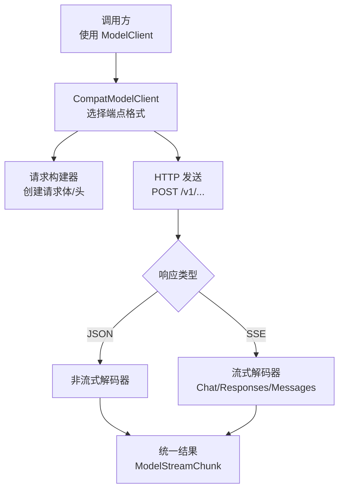
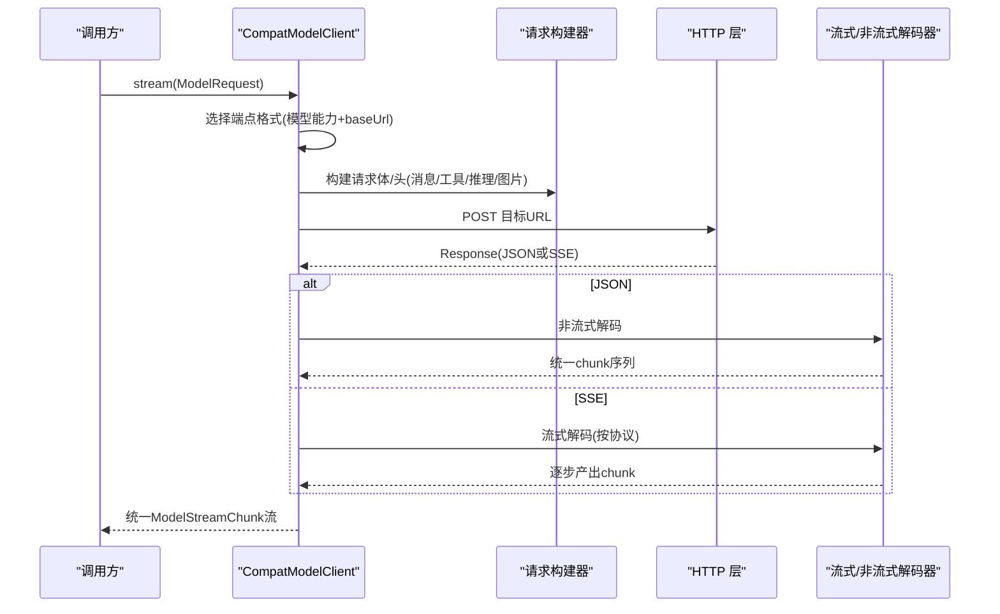
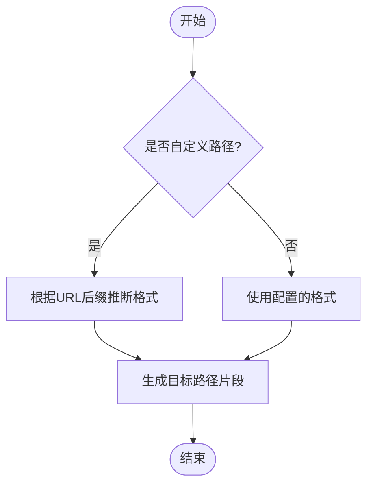
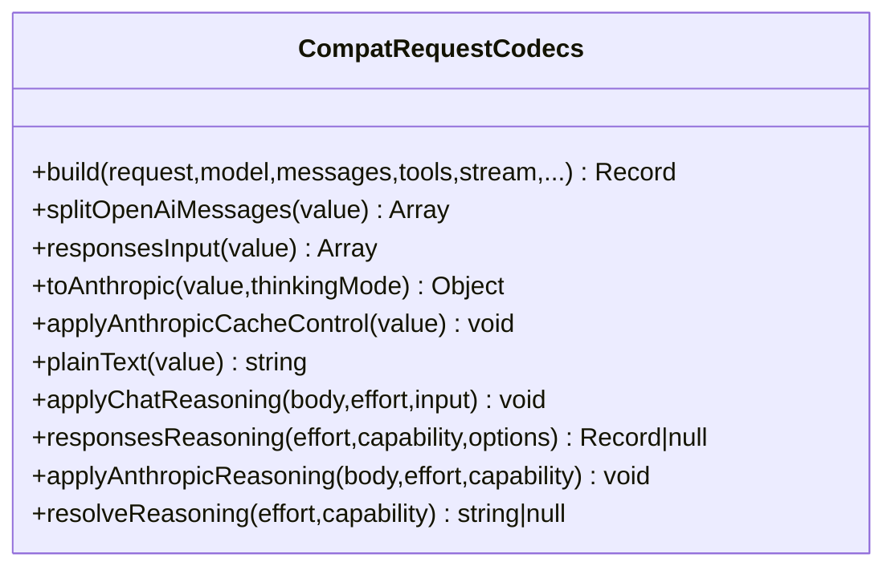
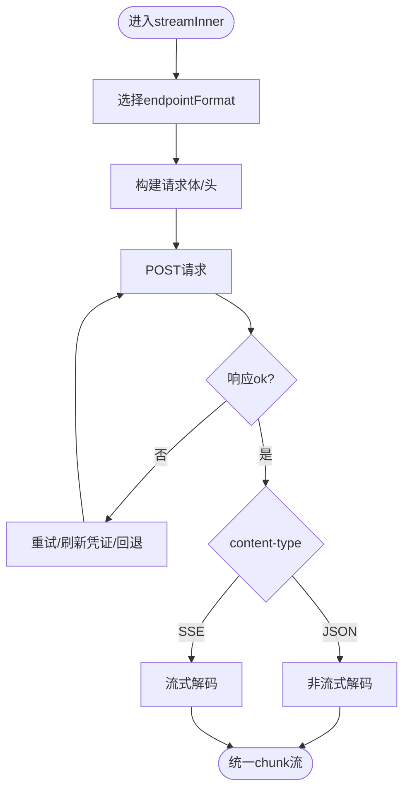
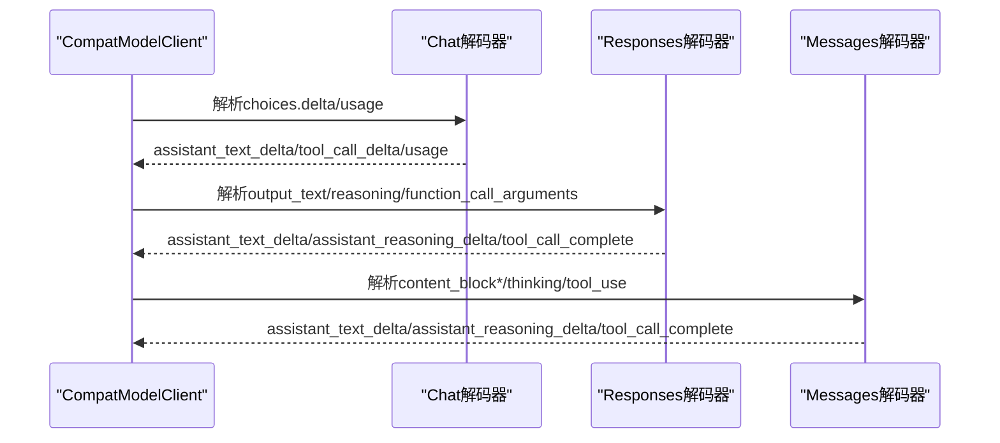
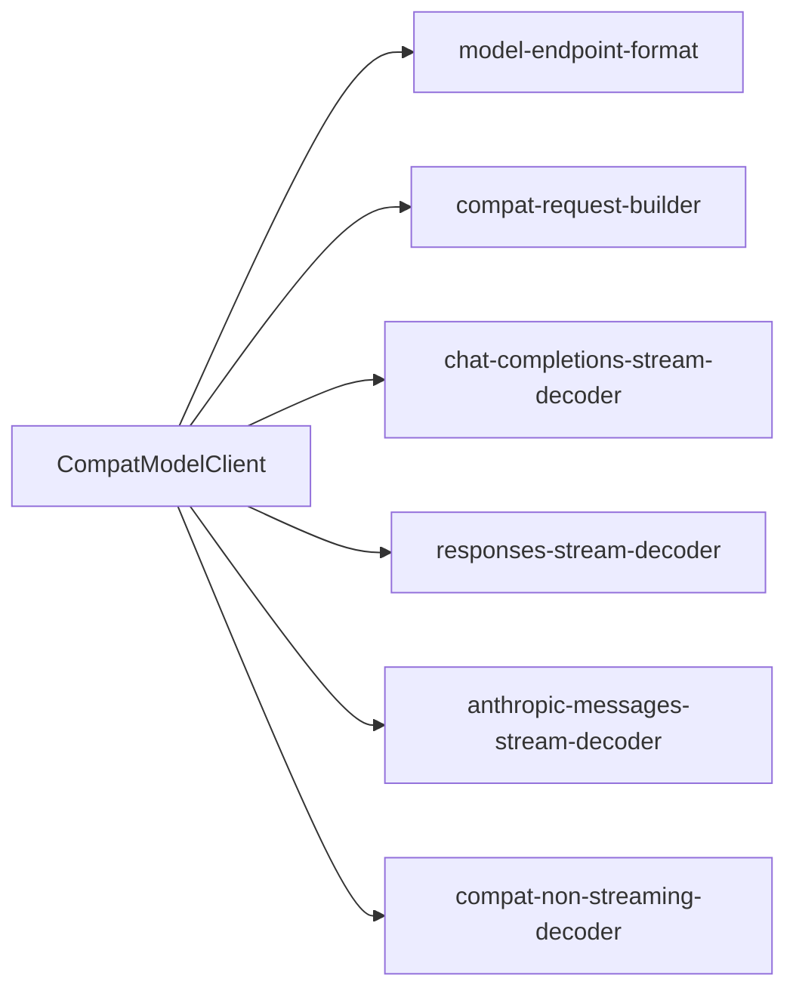

# 端点格式适配

<cite>
**本文引用的文件**
- [model-endpoint-format.ts](file://kun/src/contracts/model-endpoint-format.ts)
- [compat-model-client.ts](file://kun/src/adapters/model/compat-model-client.ts)
- [compat-request-builder.ts](file://kun/src/adapters/model/compat-request-builder.ts)
- [chat-completions-stream-decoder.ts](file://kun/src/adapters/model/chat-completions-stream-decoder.ts)
- [responses-stream-decoder.ts](file://kun/src/adapters/model/responses-stream-decoder.ts)
- [anthropic-messages-stream-decoder.ts](file://kun/src/adapters/model/anthropic-messages-stream-decoder.ts)
- [compat-non-streaming-decoder.ts](file://kun/src/adapters/model/compat-non-streaming-decoder.ts)
- [model-client.ts](file://kun/src/ports/model-client.ts)
</cite>

## 目录
1. [简介](#简介)
2. [项目结构](#项目结构)
3. [核心组件](#核心组件)
4. [架构总览](#架构总览)
5. [详细组件分析](#详细组件分析)
6. [依赖关系分析](#依赖关系分析)
7. [性能考量](#性能考量)
8. [故障排查指南](#故障排查指南)
9. [结论](#结论)
10. [附录](#附录)

## 简介
本文件面向 DeepSeek-GUI 的“端点格式适配机制”，系统性说明如何以统一接口对接多种上游模型协议，包括 Chat Completions、Responses 与 Messages（Anthropic）。文档覆盖：
- 三种端点格式的特点与适用场景
- 基于 URL 路径、请求头、响应内容的智能格式识别算法
- 请求构建器如何将统一的 ModelRequest 转换为不同协议的 HTTP 请求体与头部
- 响应解码器对非流式与流式响应的解析过程
- 数据映射与字段对齐机制
- 配置示例与调试技巧

## 项目结构
围绕端点格式适配的关键代码集中在 kun 子项目的 adapters/model 与 contracts 目录中。整体职责划分如下：
- contracts/model-endpoint-format.ts：定义支持的端点格式枚举、默认值、URL 推断与路径生成等基础能力
- adapters/model/compat-model-client.ts：多协议兼容客户端，负责选择格式、构建请求、发送网络请求、处理重试与错误、分发到对应解码器
- adapters/model/compat-request-builder.ts：将统一消息、工具、推理强度等参数编码为各协议所需的请求体
- adapters/model/*-stream-decoder.ts：按协议解析 SSE/流式事件，产出统一的 ModelStreamChunk
- ports/model-client.ts：定义统一的 ModelClient 接口与 ModelRequest/ModelStreamChunk 类型契约

**图示来源**
- [compat-model-client.ts:230-553](file://kun/src/adapters/model/compat-model-client.ts#L230-L553)
- [compat-request-builder.ts:32-51](file://kun/src/adapters/model/compat-request-builder.ts#L32-L51)
- [chat-completions-stream-decoder.ts:15-82](file://kun/src/adapters/model/chat-completions-stream-decoder.ts#L15-L82)
- [responses-stream-decoder.ts:33-145](file://kun/src/adapters/model/responses-stream-decoder.ts#L33-L145)
- [anthropic-messages-stream-decoder.ts:27-127](file://kun/src/adapters/model/anthropic-messages-stream-decoder.ts#L27-L127)

**章节来源**
- [model-endpoint-format.ts:1-79](file://kun/src/contracts/model-endpoint-format.ts#L1-L79)
- [compat-model-client.ts:72-111](file://kun/src/adapters/model/compat-model-client.ts#L72-L111)
- [model-client.ts:31-54](file://kun/src/ports/model-client.ts#L31-L54)

## 核心组件
- 端点格式定义与推断
  - 支持 chat_completions、responses、messages、custom_endpoint
  - 提供 URL 路径推断、规范化、默认值与路径生成
- 兼容客户端
  - 根据模型能力与 baseUrl 决定实际使用的端点格式
  - 构建请求体与请求头，处理重试、凭证刷新、资源限制与错误分类
  - 路由到对应解码器，输出统一流式块
- 请求构建器
  - 将统一消息、工具、推理强度、图片、系统提示等编码为 Chat Completions、Responses、Anthropic Messages 的请求体
  - 处理思考模式、缓存控制、工具调用拆分与合并等协议差异
- 流式解码器
  - Chat Completions：解析 delta、tool_calls、usage、finish_reason
  - Responses：解析 output_item、reasoning、function_call_arguments、completed/failure
  - Anthropic Messages：解析 content_block_start/delta/stop、thinking、tool_use、message_delta/stop
- 非流式解码器
  - 将一次性 JSON 响应映射为统一 chunk 序列

**章节来源**
- [model-endpoint-format.ts:1-79](file://kun/src/contracts/model-endpoint-format.ts#L1-L79)
- [compat-model-client.ts:230-553](file://kun/src/adapters/model/compat-model-client.ts#L230-L553)
- [compat-request-builder.ts:32-51](file://kun/src/adapters/model/compat-request-builder.ts#L32-L51)
- [chat-completions-stream-decoder.ts:15-82](file://kun/src/adapters/model/chat-completions-stream-decoder.ts#L15-L82)
- [responses-stream-decoder.ts:33-145](file://kun/src/adapters/model/responses-stream-decoder.ts#L33-L145)
- [anthropic-messages-stream-decoder.ts:27-127](file://kun/src/adapters/model/anthropic-messages-stream-decoder.ts#L27-L127)

## 架构总览
下图展示一次完整请求从入口到输出的流程，包括格式识别、请求构建、网络传输、响应解码与统一输出。

**图示来源**
- [compat-model-client.ts:230-553](file://kun/src/adapters/model/compat-model-client.ts#L230-L553)
- [compat-request-builder.ts:32-51](file://kun/src/adapters/model/compat-request-builder.ts#L32-L51)
- [chat-completions-stream-decoder.ts:15-82](file://kun/src/adapters/model/chat-completions-stream-decoder.ts#L15-L82)
- [responses-stream-decoder.ts:33-145](file://kun/src/adapters/model/responses-stream-decoder.ts#L33-L145)
- [anthropic-messages-stream-decoder.ts:27-127](file://kun/src/adapters/model/anthropic-messages-stream-decoder.ts#L27-L127)

## 详细组件分析

### 端点格式与自动识别
- 支持的格式
  - chat_completions：OpenAI 风格对话补全，广泛兼容
  - responses：OpenAI Responses 协议，结构化输出更强
  - messages：Anthropic Messages 协议，原生 thinking/tool_use 支持良好
  - custom_endpoint：自定义完整路径，通过 URL 后缀推断具体格式
- 自动识别逻辑
  - 基于 URL 路径结尾匹配：/chat/completions、/completions、/responses、/messages
  - 当配置为 custom_endpoint 时，依据 baseUrl 推断；否则直接使用配置
  - 提供规范化函数，兼容多种写法（如 v1/chat/completions、/v1/messages）
- 路径生成
  - 根据格式返回默认路径片段，便于拼接最终 URL

**图示来源**
- [model-endpoint-format.ts:5-79](file://kun/src/contracts/model-endpoint-format.ts#L5-L79)

**章节来源**
- [model-endpoint-format.ts:1-79](file://kun/src/contracts/model-endpoint-format.ts#L1-L79)

### 请求构建器：统一 ModelRequest 到多协议请求体
- 输入
  - 统一消息列表、工具规范、推理强度、图片附件、系统提示、最大输出 token 等
- 输出
  - 针对不同协议的请求体与头部
- 关键能力
  - 将统一消息转为 Chat Completions 的 messages、Responses 的 input、Anthropic 的 messages/system
  - 工具调用：在 OpenAI 系列中拆分 tool_result 中的图片为独立 user 消息；在 Anthropic 中内联 image block
  - 推理强度：根据不同协议写入 reasoning_effort/thinking/output_config 等字段
  - 缓存控制：为 Anthropic 设置 cache_control 断点，提升前缀缓存命中率
  - 特殊适配：Codex 端点、Gemini OpenAI 主机、DeepSeek 原生 host 的特殊处理

**图示来源**
- [compat-request-builder.ts:32-51](file://kun/src/adapters/model/compat-request-builder.ts#L32-L51)

**章节来源**
- [compat-request-builder.ts:32-51](file://kun/src/adapters/model/compat-request-builder.ts#L32-L51)
- [compat-request-builder.ts:68-99](file://kun/src/adapters/model/compat-request-builder.ts#L68-L99)
- [compat-request-builder.ts:101-193](file://kun/src/adapters/model/compat-request-builder.ts#L101-L193)
- [compat-request-builder.ts:235-301](file://kun/src/adapters/model/compat-request-builder.ts#L235-L301)
- [compat-request-builder.ts:366-442](file://kun/src/adapters/model/compat-request-builder.ts#L366-L442)
- [compat-request-builder.ts:467-594](file://kun/src/adapters/model/compat-request-builder.ts#L467-L594)

### 兼容客户端：格式选择、请求发送与重试
- 格式选择
  - 优先按模型能力元数据决定 endpointFormat；若为 Codex 则归一化 URL 并可能强制 custom_endpoint
  - 当配置为 custom_endpoint 时，依据 baseUrl 推断具体协议
- 请求构建与发送
  - 构建请求体与头部（含 API Key、会话标识、流式标记等）
  - 发送 POST 请求，捕获网络异常与超时
- 重试与恢复
  - 支持传输层重试、401 凭证刷新、流选项回退（去掉 stream_usage 后重试）
  - 资源限制保护：限制响应体大小、SSE 帧缓冲
- 响应分流
  - JSON 响应走非流式解码器
  - SSE 响应按协议进入对应流式解码器

**图示来源**
- [compat-model-client.ts:266-553](file://kun/src/adapters/model/compat-model-client.ts#L266-L553)

**章节来源**
- [compat-model-client.ts:266-553](file://kun/src/adapters/model/compat-model-client.ts#L266-L553)

### 流式解码器：Chat Completions、Responses、Messages
- Chat Completions
  - 解析 choices.delta 文本、reasoning_content/reasoning、tool_calls 增量
  - 聚合工具调用参数，结束时产出 tool_call_complete
  - 提取 usage 与 finish_reason
- Responses
  - 处理 response.output_text.delta、response.reasoning*.delta、response.function_call_arguments.*
  - 维护内容身份去重，避免重复输出
  - 在 response.completed 中物化输出与工具调用
- Anthropic Messages
  - 处理 content_block_start/delta/stop、thinking 块、tool_use
  - 维护 thinking 状态与签名，必要时附加 providerMetadata
  - 解析 message_delta/message_stop 获取停止原因与用量

**图示来源**
- [chat-completions-stream-decoder.ts:15-82](file://kun/src/adapters/model/chat-completions-stream-decoder.ts#L15-L82)
- [responses-stream-decoder.ts:33-145](file://kun/src/adapters/model/responses-stream-decoder.ts#L33-L145)
- [anthropic-messages-stream-decoder.ts:27-127](file://kun/src/adapters/model/anthropic-messages-stream-decoder.ts#L27-L127)

**章节来源**
- [chat-completions-stream-decoder.ts:15-82](file://kun/src/adapters/model/chat-completions-stream-decoder.ts#L15-L82)
- [responses-stream-decoder.ts:33-145](file://kun/src/adapters/model/responses-stream-decoder.ts#L33-L145)
- [anthropic-messages-stream-decoder.ts:27-127](file://kun/src/adapters/model/anthropic-messages-stream-decoder.ts#L27-L127)

### 非流式解码与统一输出
- 将一次性 JSON 响应转换为统一 chunk 序列（文本、工具调用完成、用量、完成标志）
- 与流式解码器保持一致的输出语义，便于上层消费

**章节来源**
- [compat-non-streaming-decoder.ts](file://kun/src/adapters/model/compat-non-streaming-decoder.ts)

### 数据映射与字段对齐
- 消息内容
  - 文本、图片在不同协议间的转换（data URI、URL、base64）
  - tool_result 中的图片在 OpenAI 系列中拆分为独立 user 消息
- 工具调用
  - 名称、参数增量/完整体的聚合与解析
  - 跨协议 call_id/index 的绑定与回退策略
- 推理强度
  - 不同协议的 reasoning_effort/thinking/output_config 字段映射
  - 针对特定主机（DeepSeek/Gemini/OpenAI）的差异处理
- 用量与停止原因
  - 统一 UsageSnapshot 与 stopReason 的提取与归一化

**章节来源**
- [compat-request-builder.ts:235-301](file://kun/src/adapters/model/compat-request-builder.ts#L235-L301)
- [compat-request-builder.ts:366-594](file://kun/src/adapters/model/compat-request-builder.ts#L366-L594)
- [chat-completions-stream-decoder.ts:15-82](file://kun/src/adapters/model/chat-completions-stream-decoder.ts#L15-L82)
- [responses-stream-decoder.ts:33-145](file://kun/src/adapters/model/responses-stream-decoder.ts#L33-L145)
- [anthropic-messages-stream-decoder.ts:27-127](file://kun/src/adapters/model/anthropic-messages-stream-decoder.ts#L27-L127)

## 依赖关系分析
- compat-model-client 依赖
  - model-endpoint-format：格式枚举、URL 推断、路径生成
  - compat-request-builder：请求体/头构建
  - 各解码器：按协议解析响应
  - 资源预算与重试策略：防止内存溢出与快速失败
- 耦合与内聚
  - 通过 ModelClient 接口解耦上层调用与底层实现
  - 解码器仅关注协议细节，不感知上层业务
- 外部依赖
  - fetch 实现可替换（支持代理），便于测试与网络环境适配

**图示来源**
- [compat-model-client.ts:1-64](file://kun/src/adapters/model/compat-model-client.ts#L1-L64)
- [compat-model-client.ts:230-553](file://kun/src/adapters/model/compat-model-client.ts#L230-L553)

**章节来源**
- [compat-model-client.ts:1-64](file://kun/src/adapters/model/compat-model-client.ts#L1-L64)
- [compat-model-client.ts:230-553](file://kun/src/adapters/model/compat-model-client.ts#L230-L553)

## 性能考量
- 流式处理
  - 增量解析与资源预算控制，避免大响应导致内存暴涨
  - SSE 帧缓冲与空闲超时，保障长时间任务稳定性
- 重试策略
  - 指数退避与可配置的状态码重试，提高弱网下的成功率
  - 401 凭证刷新只尝试一次，避免并发竞争
- 缓存优化
  - Anthropic 的 cache_control 断点减少重复计算
  - 消息顺序与系统提示位置保持稳定，利于提供商侧缓存命中

[本节为通用指导，无需引用具体文件]

## 故障排查指南
- 常见错误定位
  - 自定义路径未以受支持后缀结尾：检查 baseUrl 是否以 /chat/completions、/completions、/responses、/messages 结尾
  - 401 认证失败：确认 resolveCredentials 正确刷新，且 headers 包含必要凭据
  - 响应体过大：检查 maxTotalBytes 与 streamLimits 配置
  - 工具调用参数不完整：查看 pendingArguments 与 budget 状态，确认增量拼接正常
- 日志与调试
  - 启用 debugSink 记录每次 HTTP 尝试的请求体与响应
  - 观察 retrying 事件，了解重试次数与延迟
  - 检查 classifyHttpError 的分类结果，区分网络、超时、限流等

**章节来源**
- [compat-model-client.ts:230-553](file://kun/src/adapters/model/compat-model-client.ts#L230-L553)
- [compat-model-client.ts:689-718](file://kun/src/adapters/model/compat-model-client.ts#L689-L718)

## 结论
DeepSeek-GUI 通过统一的 ModelClient 接口与多协议适配层，实现了 Chat Completions、Responses、Messages 三类端点的无缝接入。其核心优势在于：
- 灵活的格式识别与路径生成
- 强大的请求构建器，屏蔽协议差异
- 健壮的流式与非流式解码，输出统一语义
- 完善的重试、资源限制与错误分类机制

这使得上层应用无需关心下游协议细节，即可稳定高效地调用多种模型服务。

[本节为总结性内容，无需引用具体文件]

## 附录

### 配置示例与最佳实践
- 基本配置
  - baseUrl：指向模型服务的根地址
  - apiKey：鉴权令牌
  - endpointFormat：显式指定格式或使用 custom_endpoint 让系统自动推断
  - headers：附加项目/会话标识等
  - nonStreaming：关闭流式以获得一次性响应
  - streamIdleTimeoutMs：流式空闲超时
  - streamLimits：限制总字节数与单帧大小
  - retry：配置 HTTP 重试策略（初始延迟、最大尝试次数、状态码集合）
  - modelCapabilities：按模型声明 endpointFormat、reasoning、maxOutputTokens 等
- 调试技巧
  - 开启 debugSink 捕获请求与响应
  - 打印 retrying 事件，观察重试行为
  - 使用 classifyHttpError 的结果定位错误类别
  - 对于 custom_endpoint，确保 URL 后缀符合受支持格式

**章节来源**
- [compat-model-client.ts:72-111](file://kun/src/adapters/model/compat-model-client.ts#L72-L111)
- [compat-model-client.ts:230-553](file://kun/src/adapters/model/compat-model-client.ts#L230-L553)
- [model-endpoint-format.ts:1-79](file://kun/src/contracts/model-endpoint-format.ts#L1-L79)