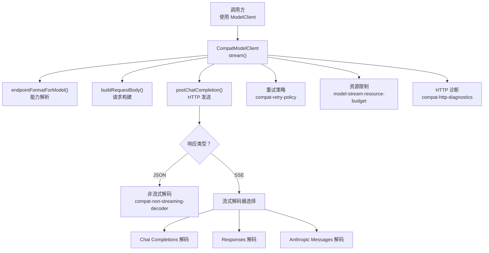
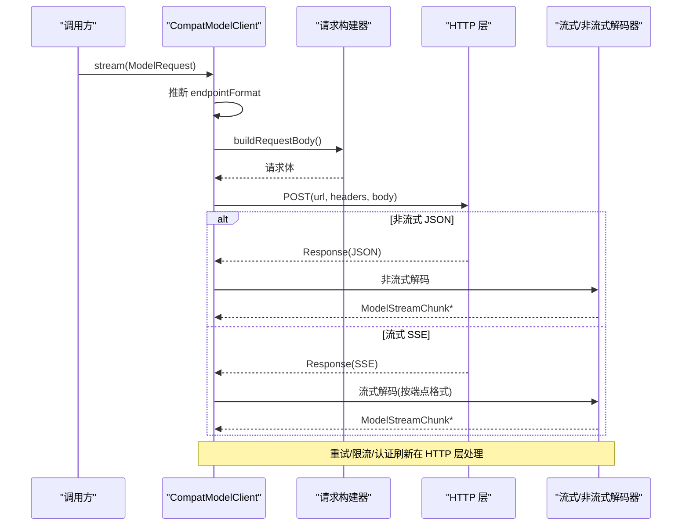
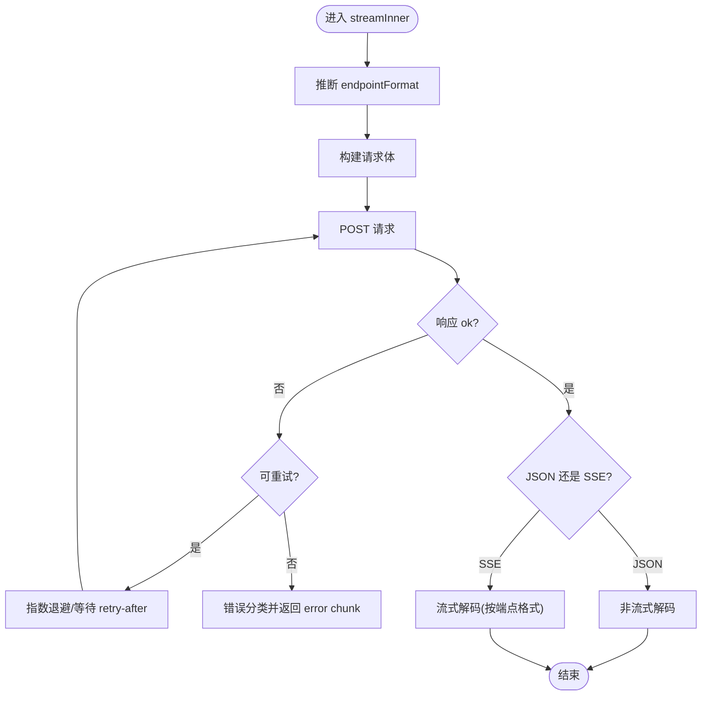
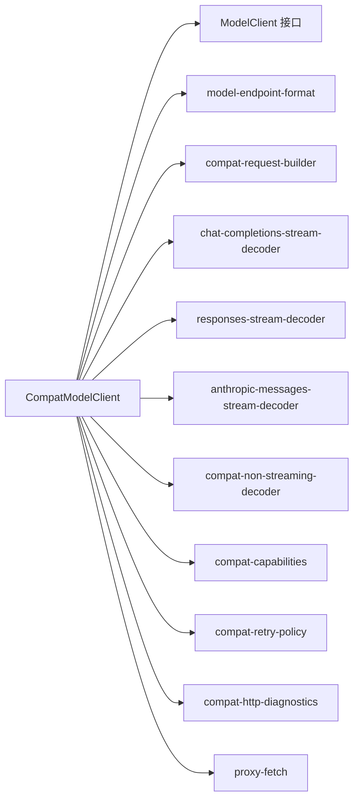

# 统一抽象层设计

<cite>
**本文引用的文件**
- [compat-model-client.ts](file://kun/src/adapters/model/compat-model-client.ts)
- [model-client.ts](file://kun/src/ports/model-client.ts)
- [model-endpoint-format.ts](file://kun/src/contracts/model-endpoint-format.ts)
- [compat-capabilities.ts](file://kun/src/adapters/model/compat-capabilities.ts)
- [compat-request-builder.ts](file://kun/src/adapters/model/compat-request-builder.ts)
- [chat-completions-stream-decoder.ts](file://kun/src/adapters/model/chat-completions-stream-decoder.ts)
- [responses-stream-decoder.ts](file://kun/src/adapters/model/responses-stream-decoder.ts)
- [anthropic-messages-stream-decoder.ts](file://kun/src/adapters/model/anthropic-messages-stream-decoder.ts)
- [compat-non-streaming-decoder.ts](file://kun/src/adapters/model/compat-non-streaming-decoder.ts)
- [compat-retry-policy.ts](file://kun/src/adapters/model/compat-retry-policy.ts)
- [compat-http-diagnostics.ts](file://kun/src/adapters/model/compat-http-diagnostics.ts)
- [model-stream-resource-budget.ts](file://kun/src/adapters/model/model-stream-resource-budget.ts)
- [proxy-fetch.ts](file://kun/src/adapters/model/proxy-fetch.ts)
</cite>

## 目录
1. [简介](#简介)
2. [项目结构](#项目结构)
3. [核心组件](#核心组件)
4. [架构总览](#架构总览)
5. [详细组件分析](#详细组件分析)
6. [依赖关系分析](#依赖关系分析)
7. [性能考量](#性能考量)
8. [故障排查指南](#故障排查指南)
9. [结论](#结论)
10. [附录：配置与最佳实践](#附录配置与最佳实践)

## 简介
本文件面向 DeepSeek-GUI 的统一模型抽象层，聚焦于 CompatModelClient 的架构设计与实现原理。文档从接口契约、请求构建、端点格式自动识别、能力检测、流式输出到重试与错误处理进行系统化说明，并提供可操作的配置建议与最佳实践，帮助读者在不了解具体上游 API 差异的前提下，稳定地调用多种模型服务。

## 项目结构
围绕统一抽象层的代码主要分布在以下位置：
- 端口定义：定义 ModelClient 接口与数据契约（ModelRequest、ModelStreamChunk 等）
- 适配器实现：CompatModelClient 作为通用 HTTP 客户端，支持 Chat Completions、Responses、Messages 等多种协议形状
- 协议与编解码：按端点格式选择对应的请求构建器与流式/非流式解码器
- 能力与配置：基于能力元数据动态决定 endpointFormat、reasoning、vision 等特性
- 重试与诊断：指数退避重试、HTTP 错误分类、调试记录与资源限制保护

图表来源
- [compat-model-client.ts:203-553](file://kun/src/adapters/model/compat-model-client.ts#L203-L553)
- [model-endpoint-format.ts:1-200](file://kun/src/contracts/model-endpoint-format.ts#L1-L200)
- [compat-capabilities.ts:1-200](file://kun/src/adapters/model/compat-capabilities.ts#L1-L200)

章节来源
- [compat-model-client.ts:203-553](file://kun/src/adapters/model/compat-model-client.ts#L203-L553)
- [model-client.ts:1-203](file://kun/src/ports/model-client.ts#L1-L203)

## 核心组件
- ModelClient 接口：统一 stream(request) 入口，产出 ModelStreamChunk 流；可选 selectsRouteTargetDuringStream 用于延迟选择目标路由
- ModelRequest：描述一次对话轮次的输入，包括历史消息、工具、附件、采样参数、思考控制、超时信号等
- ModelStreamChunk：统一的增量输出类型，包含助手文本、推理片段、工具调用增量/完成、图片生成完成、用量统计、完成标志、重试事件与错误
- CompatModelClient：通用 HTTP 客户端，负责：
  - 根据模型能力与 baseUrl 推断端点格式（Chat Completions / Responses / Messages）
  - 构建请求体并发送
  - 解析 JSON 或 SSE 流，转换为 ModelStreamChunk
  - 管理重试、认证刷新、资源限制与调试记录

章节来源
- [model-client.ts:31-203](file://kun/src/ports/model-client.ts#L31-L203)
- [compat-model-client.ts:72-111](file://kun/src/adapters/model/compat-model-client.ts#L72-L111)
- [compat-model-client.ts:203-553](file://kun/src/adapters/model/compat-model-client.ts#L203-L553)

## 架构总览
CompatModelClient 的核心流程如下：
- 入口 stream(request)：可选开启调试记录，内部委托 streamInner
- 端点格式推断：结合 provider 配置的 endpointFormat、baseUrl 以及模型能力元数据，确定最终使用的协议形状
- 请求构建：将 ModelRequest 投影为适配协议的请求体，考虑工具、附件、思考模式、最大输出 token 等
- 发送与重试：POST 请求，遇到网络错误或限流状态码时按指数退避重试；401 且可刷新凭证时自动刷新并重试
- 响应处理：
  - 非流式 JSON：直接解码为结果并转换为 ModelStreamChunk
  - 流式 SSE：根据端点格式选择对应解码器，持续产出增量块，并在异常时尝试恢复
- 资源限制：对单次 SSE 响应的字节数、空闲超时等进行限制，防止内存膨胀
- 错误分类：将 HTTP 错误归类为网络、超时、限流、认证失败等，并附带是否允许故障转移

图表来源
- [compat-model-client.ts:230-553](file://kun/src/adapters/model/compat-model-client.ts#L230-L553)
- [compat-request-builder.ts:1-200](file://kun/src/adapters/model/compat-request-builder.ts#L1-L200)
- [chat-completions-stream-decoder.ts:1-200](file://kun/src/adapters/model/chat-completions-stream-decoder.ts#L1-L200)
- [responses-stream-decoder.ts:1-200](file://kun/src/adapters/model/responses-stream-decoder.ts#L1-L200)
- [anthropic-messages-stream-decoder.ts:1-200](file://kun/src/adapters/model/anthropic-messages-stream-decoder.ts#L1-L200)

## 详细组件分析

### ModelClient 接口与数据契约
- ModelClient.stream：以异步迭代方式返回 ModelStreamChunk，支持取消信号 abortSignal
- ModelRequest：承载上下文、工具、附件、采样参数、思考控制、服务等级等
- ModelStreamChunk：统一增量输出，涵盖文本、推理、工具调用、图片生成、用量、完成、重试与错误

章节来源
- [model-client.ts:31-203](file://kun/src/ports/model-client.ts#L31-L203)

### CompatModelClient 核心流程
- 入口 stream：可选择启用调试记录，捕获请求体与原始输出
- 端点格式推断：优先使用模型能力中的 endpointFormat，其次回退到 provider/runtime 默认值；对 Codex 特殊路径做规范化
- 请求构建：通过 createCompatRequestCodecs 将 ModelRequest 转为协议相关请求体，注入工具、附件、思考模式、最大输出 token 等
- 发送与重试：
  - 网络错误：指数退避重试，最多 maxAttempts 次
  - 限流/临时错误：依据 HTTP 状态码与 retry-after 头计算退避
  - 401 且可刷新：刷新凭证后重试
- 响应处理：
  - 非流式 JSON：读取并解码为 ChatCompletionResponse 或等价结构，再映射为 ModelStreamChunk
  - 流式 SSE：按端点格式选择解码器，产出增量块；支持在异常时恢复
- 资源限制：限制单次响应总字节数与空闲超时，避免内存溢出
- 错误分类：将错误归因到网络、超时、限流、认证失败等，并决定是否允许故障转移

图表来源
- [compat-model-client.ts:266-553](file://kun/src/adapters/model/compat-model-client.ts#L266-L553)
- [compat-retry-policy.ts:1-200](file://kun/src/adapters/model/compat-retry-policy.ts#L1-L200)
- [compat-http-diagnostics.ts:1-200](file://kun/src/adapters/model/compat-http-diagnostics.ts#L1-L200)

章节来源
- [compat-model-client.ts:230-553](file://kun/src/adapters/model/compat-model-client.ts#L230-L553)

### 端点格式自动识别机制
- 优先级：
  1) 模型能力元数据中的 endpointFormat（同一 provider 可混合不同协议）
  2) provider/runtime 配置的 endpointFormat
  3) 基于 baseUrl 的自定义端点后缀判断（/chat/completions、/completions、/responses、/messages）
- Codex 兼容：对 chatgpt.com/backend-api/codex 路径进行规范化，确保正确路由到 responses
- 影响范围：决定请求体结构与流式解码器的选择

章节来源
- [compat-model-client.ts:274-298](file://kun/src/adapters/model/compat-model-client.ts#L274-L298)
- [model-endpoint-format.ts:1-200](file://kun/src/contracts/model-endpoint-format.ts#L1-L200)

### 能力检测系统
- 视觉支持：通过 resolveCompatModelCapabilities 获取 supportsVision，决定是否转发真实图片附件；否则以文本摘要替代
- 工具调用：通过 normalizeToolSpecs 与请求构建器将工具规范序列化到协议相关字段
- 流式响应：根据 endpointFormat 与响应头 content-type 决定走 JSON 还是 SSE 路径
- 其他能力：如 serviceTiers、maxOutputTokens、reasoning 等由能力元数据驱动

章节来源
- [compat-model-client.ts:720-764](file://kun/src/adapters/model/compat-model-client.ts#L720-L764)
- [compat-capabilities.ts:1-200](file://kun/src/adapters/model/compat-capabilities.ts#L1-L200)

### 流式输出与解码器
- Chat Completions：使用 chat-completions-stream-decoder 解析 choices.delta 等增量
- Responses：使用 responses-stream-decoder 解析 OpenAI Responses 流
- Anthropic Messages：使用 anthropic-messages-stream-decoder 解析 Messages 流
- 非流式：compat-non-streaming-decoder 将完整响应转换为 ModelStreamChunk 序列

章节来源
- [compat-model-client.ts:51-62](file://kun/src/adapters/model/compat-model-client.ts#L51-L62)
- [chat-completions-stream-decoder.ts:1-200](file://kun/src/adapters/model/chat-completions-stream-decoder.ts#L1-L200)
- [responses-stream-decoder.ts:1-200](file://kun/src/adapters/model/responses-stream-decoder.ts#L1-L200)
- [anthropic-messages-stream-decoder.ts:1-200](file://kun/src/adapters/model/anthropic-messages-stream-decoder.ts#L1-L200)
- [compat-non-streaming-decoder.ts:1-200](file://kun/src/adapters/model/compat-non-streaming-decoder.ts#L1-L200)

### 重试策略与错误处理
- 网络错误：指数退避重试，支持中止信号
- 限流/临时错误：依据 HTTP 状态码与 retry-after 头计算退避
- 认证失败：401 且可刷新凭证时刷新并重试
- 错误分类：区分网络、超时、限流、认证失败等，并标记是否允许故障转移
- 调试记录：可选 sink 捕获每次尝试的请求体与响应

章节来源
- [compat-model-client.ts:316-403](file://kun/src/adapters/model/compat-model-client.ts#L316-L403)
- [compat-retry-policy.ts:1-200](file://kun/src/adapters/model/compat-retry-policy.ts#L1-L200)
- [compat-http-diagnostics.ts:1-200](file://kun/src/adapters/model/compat-http-diagnostics.ts#L1-L200)

### 资源限制与稳定性
- 单次 SSE 响应总字节上限：防止大响应导致内存膨胀
- 流空闲超时：长时间无增量则终止，避免挂起
- 错误响应体大小限制：避免读取过大错误信息

章节来源
- [compat-model-client.ts:317-319](file://kun/src/adapters/model/compat-model-client.ts#L317-L319)
- [model-stream-resource-budget.ts:1-200](file://kun/src/adapters/model/model-stream-resource-budget.ts#L1-L200)

## 依赖关系分析
- CompatModelClient 依赖：
  - 端口契约：ModelClient、ModelRequest、ModelStreamChunk
  - 协议与编解码：model-endpoint-format、compat-request-builder、各流式/非流式解码器
  - 能力与配置：compat-capabilities、model-stream-resource-budget
  - 重试与诊断：compat-retry-policy、compat-http-diagnostics、proxy-fetch

图表来源
- [compat-model-client.ts:1-64](file://kun/src/adapters/model/compat-model-client.ts#L1-L64)
- [model-client.ts:1-203](file://kun/src/ports/model-client.ts#L1-L203)

章节来源
- [compat-model-client.ts:1-64](file://kun/src/adapters/model/compat-model-client.ts#L1-L64)
- [model-client.ts:1-203](file://kun/src/ports/model-client.ts#L1-L203)

## 性能考量
- 流式传输：优先使用 SSE 增量输出，降低首字延迟
- 资源限制：设置合理的 maxTotalBytes 与 streamIdleTimeoutMs，避免内存与连接占用
- 重试策略：合理配置 initialDelayMs、maxAttempts，平衡可靠性与延迟
- 调试开销：仅在需要时启用 debugSink，避免额外 I/O 成本
- 代理与缓存：可通过 modelProxyUrl 配置代理；利用 provider 的缓存命中指标优化成本

[本节提供通用指导，不直接分析具体文件]

## 故障排查指南
- 常见错误与定位：
  - 网络错误：检查 proxy-fetch 配置与网络连通性
  - 超时：确认服务端响应时间与超时配置
  - 限流：关注 retry-after 头与重试间隔
  - 认证失败：确认 resolveCredentials 是否正确刷新令牌
  - 响应过大：调整 streamLimits.maxTotalBytes
- 日志与调试：
  - 启用 debugSink 捕获请求体与原始输出
  - 查看 compatHttpFailureLog 输出的诊断信息
- 恢复策略：
  - 对于可恢复错误，依靠重试与凭证刷新自动恢复
  - 对于不可恢复错误，向上层返回 error chunk 并携带 failure 元数据

章节来源
- [compat-model-client.ts:689-718](file://kun/src/adapters/model/compat-model-client.ts#L689-L718)
- [compat-http-diagnostics.ts:1-200](file://kun/src/adapters/model/compat-http-diagnostics.ts#L1-L200)

## 结论
CompatModelClient 通过统一的 ModelClient 接口屏蔽了多协议差异，实现了端点格式自动识别、能力驱动的请求构建、稳定的流式输出与健壮的重试与错误处理。借助能力元数据与资源限制，可在复杂环境下保持高可用与高性能。推荐在生产环境中结合调试与监控，持续优化重试策略与资源阈值。

[本节总结性内容，不直接分析具体文件]

## 附录：配置与最佳实践
- 基础配置项（示例字段名，具体取值依环境而定）：
  - baseUrl：模型服务基地址
  - apiKey：鉴权密钥
  - model：默认模型名称
  - endpointFormat：强制指定协议形状（如 chat_completions、responses、messages）
  - headers：附加请求头（如 project、session_id）
  - resolveCredentials：动态获取/刷新凭证
  - fetchImpl：自定义 fetch 实现（可用于代理或拦截）
  - modelProxyUrl：仅对模型请求生效的代理地址
  - historyLimit：限制发送的历史消息数量
  - nonStreaming：强制非流式响应
  - streamIdleTimeoutMs：流空闲超时
  - streamLimits：资源限制（如 maxTotalBytes）
  - retry：重试策略（httpStatusCodes、initialDelayMs、maxAttempts）
  - modelCapabilities：模型能力解析函数
  - debugSink：调试记录接收器
- 最佳实践：
  - 使用能力元数据驱动 endpointFormat，避免硬编码
  - 合理设置 streamLimits 与 streamIdleTimeoutMs，保障稳定性
  - 启用 resolveCredentials 以支持 OAuth 刷新
  - 在生产中谨慎启用 debugSink，避免敏感信息泄露
  - 针对限流场景调优 retry 参数，平衡成功率与延迟

[本节提供通用指导，不直接分析具体文件]