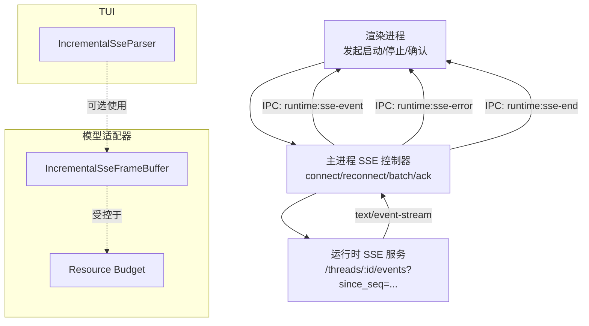
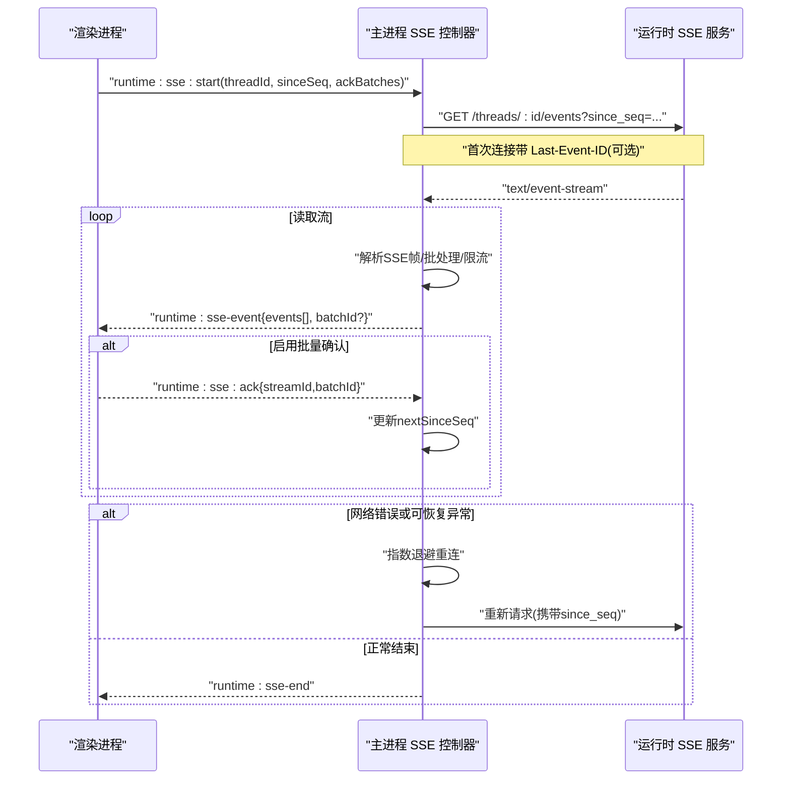
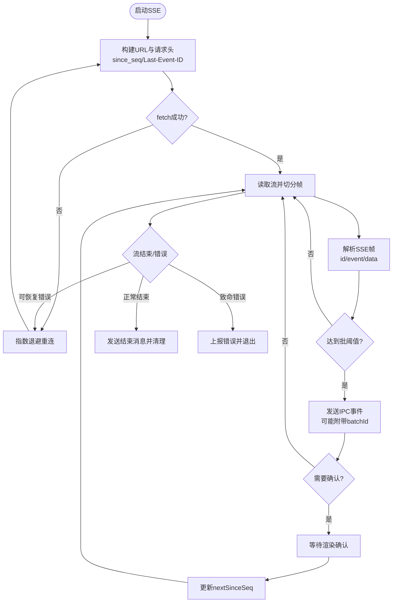
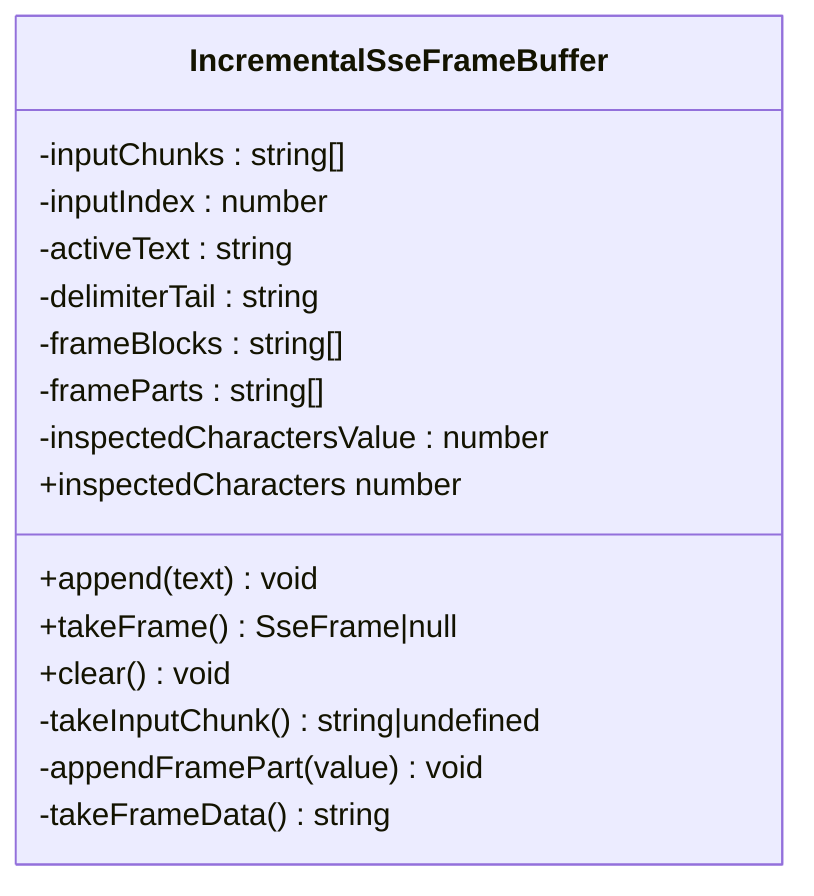
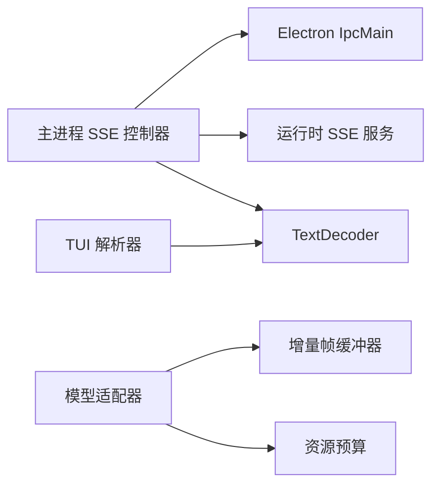

# SSE连接管理

<cite>
**本文引用的文件**
- [runtime-sse-ipc.ts](file://src/main/runtime-sse-ipc.ts)
- [sse.ts（TUI 解析器）](file://kun/src/tui/sse.ts)
- [incremental-sse-frame-buffer.ts](file://kun/src/adapters/model/incremental-sse-frame-buffer.ts)
- [sse.ts（事件编码）](file://kun/src/server/sse.ts)
- [compat-model-client.ts](file://kun/src/adapters/model/compat-model-client.ts)
- [gemini-cli-api-model-client.ts](file://kun/src/adapters/model/gemini-cli-api-model-client.ts)
- [model-stream-resource-budget.ts](file://kun/src/adapters/model/model-stream-resource-budget.ts)
- [runtime-sse-ipc.test.ts](file://src/main/runtime-sse-ipc.test.ts)
- [incremental-sse-frame-buffer.test.ts](file://kun/src/adapters/model/incremental-sse-frame-buffer.test.ts)
</cite>

## 目录
1. [简介](#简介)
2. [项目结构](#项目结构)
3. [核心组件](#核心组件)
4. [架构总览](#架构总览)
5. [详细组件分析](#详细组件分析)
6. [依赖关系分析](#依赖关系分析)
7. [性能考量](#性能考量)
8. [故障排除指南](#故障排除指南)
9. [结论](#结论)
10. [附录：监控与调试](#附录：监控与调试)

## 简介
本文件面向 DeepSeek-GUI 的 Server-Sent Events（SSE）连接管理系统，系统性说明连接的建立、维护与关闭机制；详解增量帧缓冲器的实现，包括数据分片处理、内存管理与缓冲区策略；阐述连接状态管理，包括重连逻辑、超时处理和错误恢复；解释 SSE 协议的具体实现，包括事件类型解析、数据格式处理与流式数据传输；并提供连接监控与调试工具的使用指南及常见问题的排查方法。

## 项目结构
SSE 相关能力分布在主进程、TUI 与模型适配器层：
- 主进程负责与运行时建立 SSE 连接、批处理事件、重连与确认机制，并通过 IPC 将事件转发给渲染进程。
- TUI 提供轻量级增量 SSE 解析器，用于在终端环境中消费事件流。
- 模型适配器层包含高性能增量帧缓冲器与资源预算控制，用于高效、安全地解析 SSE 帧并防止异常占用。
- 服务端侧提供事件编码函数，统一生成标准 SSE 帧。

**图表来源**
- [runtime-sse-ipc.ts:178-408](file://src/main/runtime-sse-ipc.ts#L178-L408)
- [sse.ts（TUI 解析器）:9-40](file://kun/src/tui/sse.ts#L9-L40)
- [incremental-sse-frame-buffer.ts:22-111](file://kun/src/adapters/model/incremental-sse-frame-buffer.ts#L22-L111)
- [model-stream-resource-budget.ts:83-83](file://kun/src/adapters/model/model-stream-resource-budget.ts#L83-L83)

**章节来源**
- [runtime-sse-ipc.ts:178-408](file://src/main/runtime-sse-ipc.ts#L178-L408)
- [sse.ts（TUI 解析器）:9-40](file://kun/src/tui/sse.ts#L9-L40)
- [incremental-sse-frame-buffer.ts:22-111](file://kun/src/adapters/model/incremental-sse-frame-buffer.ts#L22-L111)
- [model-stream-resource-budget.ts:83-83](file://kun/src/adapters/model/model-stream-resource-budget.ts#L83-L83)

## 核心组件
- 主进程 SSE 控制器
  - 职责：建立连接、读取流、按批次打包事件、发送 IPC、处理重连与确认、清理资源。
  - 关键常量：最大帧缓冲字节、每批事件数、每批字节上限、重连退避基线与上限、开始与确认超时。
- 增量帧缓冲器（模型适配器）
  - 职责：以增量方式定位 SSE 帧边界，避免重复扫描与复制未终止帧，仅在完成时拼接数据。
- TUI 增量解析器
  - 职责：将二进制块解码为文本，规范化换行，按“\n\n”或“\r\n\r\n”切分帧，解析 id/event/data。
- 服务端事件编码器
  - 职责：将运行时事件序列化为标准 SSE 帧（id、event、data）。

**章节来源**
- [runtime-sse-ipc.ts:19-25](file://src/main/runtime-sse-ipc.ts#L19-L25)
- [incremental-sse-frame-buffer.ts:16-21](file://kun/src/adapters/model/incremental-sse-frame-buffer.ts#L16-L21)
- [sse.ts（TUI 解析器）:9-40](file://kun/src/tui/sse.ts#L9-L40)
- [sse.ts（事件编码）:3-5](file://kun/src/server/sse.ts#L3-L5)

## 架构总览
下图展示了从渲染进程到运行时的完整 SSE 流程，包括批处理、确认、重连与结束通知。

**图表来源**
- [runtime-sse-ipc.ts:178-408](file://src/main/runtime-sse-ipc.ts#L178-L408)

**章节来源**
- [runtime-sse-ipc.ts:178-408](file://src/main/runtime-sse-ipc.ts#L178-L408)

## 详细组件分析

### 主进程 SSE 控制器
- 连接建立
  - 通过 IPC 接收启动请求，生成或复用 streamId，创建 AbortController 并记录状态。
  - 每次重连前重新加载设置并解析运行时基础 URL，确保跟随新地址与令牌。
  - 构造请求头 Accept: text/event-stream，必要时附加 Last-Event-ID。
  - 对 fetch 调用施加启动超时，失败则进入重连循环。
- 流式读取与批处理
  - 使用 ReadableStream 读取二进制块，TextDecoder 流式解码。
  - 按“\n\n”或“\r\n\r\n”切分帧，解析 id/event/data，合并多行 data。
  - 将事件聚合成批次，限制每批事件数量与字节大小，避免背压过大。
  - 若启用批量确认，发送 batchId 并等待渲染进程确认后才推进 nextSinceSeq。
- 重连与错误恢复
  - 区分致命状态码与瞬态错误；对瞬态错误进行指数退避重连。
  - 对“terminated”等可恢复中断视为断线重连，不直接上报错误。
  - 遇到无 id 的 server replay error 时直接抛出，避免陷入相同游标死循环。
- 关闭与清理
  - 支持客户端主动停止；finally 中取消 reader、发送结束消息、清理控制器映射。

**图表来源**
- [runtime-sse-ipc.ts:149-176](file://src/main/runtime-sse-ipc.ts#L149-L176)
- [runtime-sse-ipc.ts:204-370](file://src/main/runtime-sse-ipc.ts#L204-L370)
- [runtime-sse-ipc.ts:372-385](file://src/main/runtime-sse-ipc.ts#L372-L385)

**章节来源**
- [runtime-sse-ipc.ts:19-25](file://src/main/runtime-sse-ipc.ts#L19-L25)
- [runtime-sse-ipc.ts:149-176](file://src/main/runtime-sse-ipc.ts#L149-L176)
- [runtime-sse-ipc.ts:204-370](file://src/main/runtime-sse-ipc.ts#L204-L370)
- [runtime-sse-ipc.ts:372-385](file://src/main/runtime-sse-ipc.ts#L372-L385)

### 增量帧缓冲器（IncrementalSseFrameBuffer）
- 设计目标
  - 增量定位 SSE 帧边界，避免对未终止帧的重复扫描与复制。
  - 仅保留必要的三字符分隔符重叠，降低内存与 CPU 开销。
- 数据结构与复杂度
  - 输入队列与索引管理，配合压缩窗口减少数组膨胀。
  - 帧片段累积与最终拼接，时间复杂度近似 O(n)，空间复杂度与帧大小线性相关。
- 边界检测
  - 支持 LF、CRLF、混合分隔符，精确识别帧尾双空行。
- 使用场景
  - 在高吞吐模型 SSE 场景中，结合资源预算控制，防止超大帧或风暴式帧导致崩溃。

**图表来源**
- [incremental-sse-frame-buffer.ts:22-111](file://kun/src/adapters/model/incremental-sse-frame-buffer.ts#L22-L111)

**章节来源**
- [incremental-sse-frame-buffer.ts:16-21](file://kun/src/adapters/model/incremental-sse-frame-buffer.ts#L16-L21)
- [incremental-sse-frame-buffer.ts:31-111](file://kun/src/adapters/model/incremental-sse-frame-buffer.ts#L31-L111)
- [incremental-sse-frame-buffer.test.ts:4-38](file://kun/src/adapters/model/incremental-sse-frame-buffer.test.ts#L4-L38)

### TUI 增量解析器（IncrementalSseParser）
- 功能要点
  - 将 Uint8Array 块解码为字符串，统一替换 CRLF/LF。
  - 按“\n\n”切分帧，解析 id、event、data，返回结构化帧列表。
  - finish 时处理尾部残留帧，便于一次性消费。
- 适用性
  - 适合 TUI 环境下的轻量级 SSE 消费，不依赖浏览器 API。

**章节来源**
- [sse.ts（TUI 解析器）:9-40](file://kun/src/tui/sse.ts#L9-L40)
- [sse.ts（TUI 解析器）:42-81](file://kun/src/tui/sse.ts#L42-L81)

### SSE 协议实现
- 事件编码
  - 服务端将事件序列化为标准 SSE 帧：id、event、data，并以双空行结尾。
- 事件解析
  - 主进程与 TUI 均实现行级解析，支持多行 data、忽略注释行、提取 id 与 event。
- 数据格式
  - data 字段为 JSON 字符串，需二次解析；event 字段指示事件类型；id 字段用于游标与去重。

**章节来源**
- [sse.ts（事件编码）:3-5](file://kun/src/server/sse.ts#L3-L5)
- [runtime-sse-ipc.ts:79-139](file://src/main/runtime-sse-ipc.ts#L79-L139)
- [sse.ts（TUI 解析器）:65-81](file://kun/src/tui/sse.ts#L65-L81)

### 资源预算与模型适配器集成
- 预算控制
  - 限制单条 SSE 响应中的缓冲字节、帧数量与单帧大小，防止资源耗尽。
  - 当超过预算时抛出错误，由上层捕获并中止流。
- 典型实现
  - 模型客户端在读取增量帧后统计已消费字节，超限即触发预算错误。
  - 特定 API 客户端定义最大帧字节阈值，超出即报错。

**章节来源**
- [model-stream-resource-budget.ts:83-83](file://kun/src/adapters/model/model-stream-resource-budget.ts#L83-L83)
- [compat-model-client.ts:1068-1077](file://kun/src/adapters/model/compat-model-client.ts#L1068-L1077)
- [gemini-cli-api-model-client.ts:31-31](file://kun/src/adapters/model/gemini-cli-api-model-client.ts#L31-L31)
- [gemini-cli-api-model-client.ts:786-787](file://kun/src/adapters/model/gemini-cli-api-model-client.ts#L786-L787)

## 依赖关系分析
- 主进程依赖
  - Electron IpcMain：注册 handle 处理器，收发 IPC 消息。
  - 运行时发现与鉴权：根据设置动态解析运行时 URL 与认证头。
  - 流式读取：ReadableStream + TextDecoder。
- 模型适配器依赖
  - 增量缓冲器：提高解析效率与稳定性。
  - 资源预算：保护系统资源，避免异常流量冲击。
- TUI 依赖
  - 标准库 TextDecoder，无需外部依赖。

**图表来源**
- [runtime-sse-ipc.ts:178-408](file://src/main/runtime-sse-ipc.ts#L178-L408)
- [incremental-sse-frame-buffer.ts:22-111](file://kun/src/adapters/model/incremental-sse-frame-buffer.ts#L22-L111)
- [model-stream-resource-budget.ts:83-83](file://kun/src/adapters/model/model-stream-resource-budget.ts#L83-L83)
- [sse.ts（TUI 解析器）:9-40](file://kun/src/tui/sse.ts#L9-L40)

**章节来源**
- [runtime-sse-ipc.ts:178-408](file://src/main/runtime-sse-ipc.ts#L178-L408)
- [incremental-sse-frame-buffer.ts:22-111](file://kun/src/adapters/model/incremental-sse-frame-buffer.ts#L22-L111)
- [model-stream-resource-budget.ts:83-83](file://kun/src/adapters/model/model-stream-resource-budget.ts#L83-L83)
- [sse.ts（TUI 解析器）:9-40](file://kun/src/tui/sse.ts#L9-L40)

## 性能考量
- 批处理与背压
  - 限制每批事件数量与字节大小，避免渲染进程阻塞。
  - 启用批量确认时，仅在渲染端确认后推进游标，保证可靠性。
- 增量解析
  - 增量帧缓冲器避免重复扫描与复制，显著降低 CPU 与内存占用。
- 资源预算
  - 对缓冲字节、帧数量与单帧大小设置上限，防止异常流量导致崩溃。
- 重连退避
  - 指数退避限制最大间隔，平衡快速恢复与服务器压力。

[本节为通用指导，不直接分析具体文件]

## 故障排除指南
- 常见问题与定位
  - 启动超时：检查运行时可达性与鉴权头是否正确。
  - 帧过大或风暴：检查资源预算配置与上游是否产生异常大帧。
  - 无法推进游标：确认渲染端是否正确发送批量确认。
  - 反复重连：查看是否为瞬态错误（网络、socket、超时），或致命错误（4xx非408/429）。
- 诊断步骤
  - 观察 IPC 事件：runtime:sse-event、runtime:sse-error、runtime:sse-end。
  - 检查 since_seq 与 Last-Event-ID 是否随重连正确更新。
  - 核对服务端事件编码是否符合 SSE 规范。
- 参考测试用例
  - 重连与游标推进、终止流处理、重连前重新解析 URL/Token、无 id 的重放错误处理。

**章节来源**
- [runtime-sse-ipc.test.ts:77-172](file://src/main/runtime-sse-ipc.test.ts#L77-L172)
- [runtime-sse-ipc.test.ts:174-231](file://src/main/runtime-sse-ipc.test.ts#L174-L231)
- [runtime-sse-ipc.test.ts:233-285](file://src/main/runtime-sse-ipc.test.ts#L233-L285)
- [runtime-sse-ipc.test.ts:287-330](file://src/main/runtime-sse-ipc.test.ts#L287-L330)
- [runtime-sse-ipc.test.ts:332-355](file://src/main/runtime-sse-ipc.test.ts#L332-L355)

## 结论
DeepSeek-GUI 的 SSE 连接管理在主进程实现了高可靠的事件流传输，具备批处理、确认、重连与资源保护能力；模型适配器的增量帧缓冲器提升了解析效率与稳定性；TUI 提供了轻量解析方案以满足终端场景。整体架构清晰、可扩展，适用于大规模事件流与高吞吐场景。

[本节为总结，不直接分析具体文件]

## 附录：监控与调试
- 监控指标
  - 批大小与字节量：观察 IPC 事件中的 events 长度与预估字节。
  - 重连次数与延迟：关注错误日志与重连间隔。
  - 资源预算命中：统计预算超限次数与原因。
- 调试技巧
  - 启用批量确认模式，验证渲染端确认路径。
  - 打印 Last-Event-ID 与 since_seq，确认游标一致性。
  - 使用测试用例模拟断流、终止、超大帧等场景，验证鲁棒性。

[本节为通用指导，不直接分析具体文件]