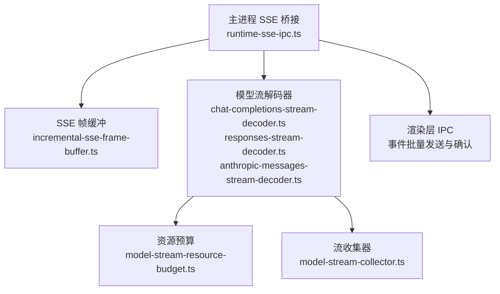
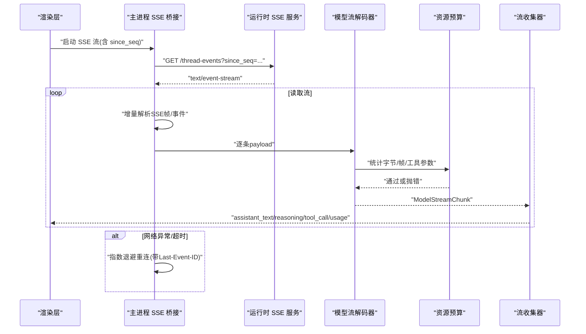
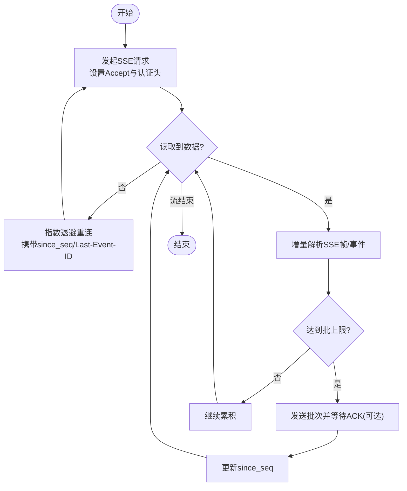
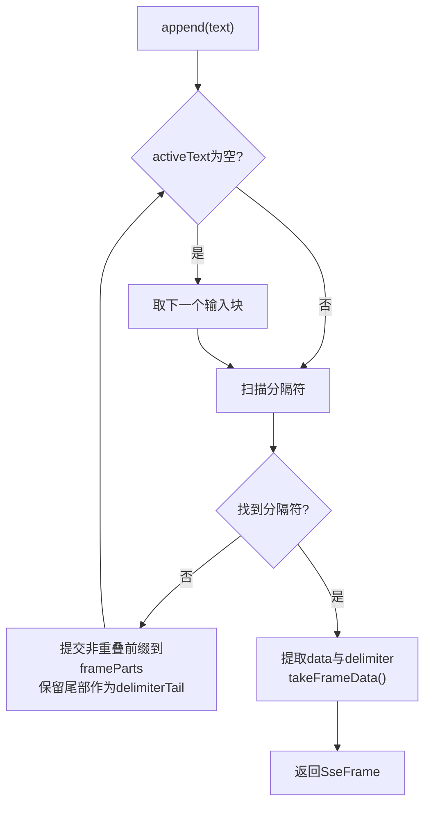
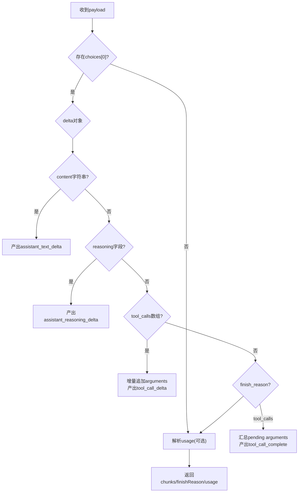
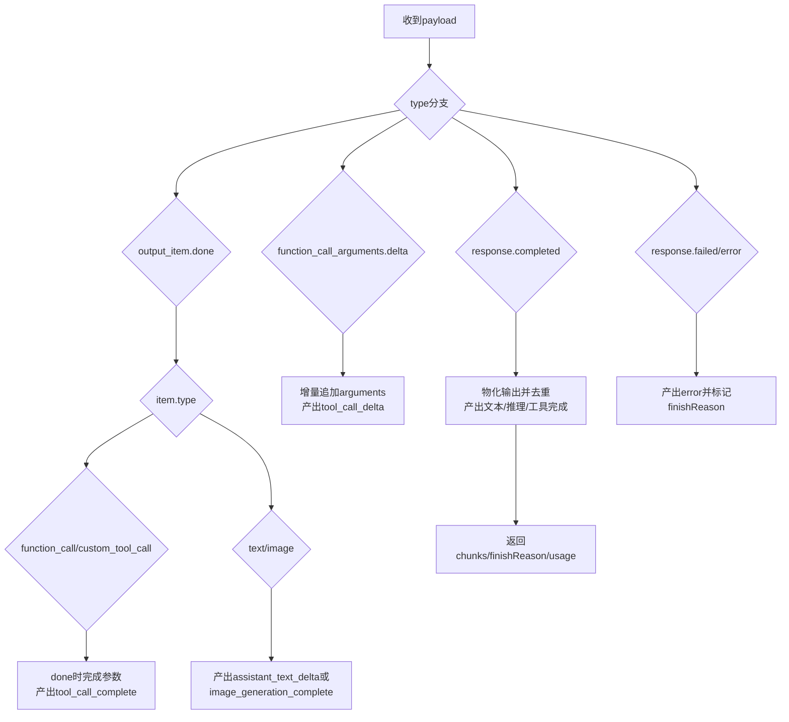
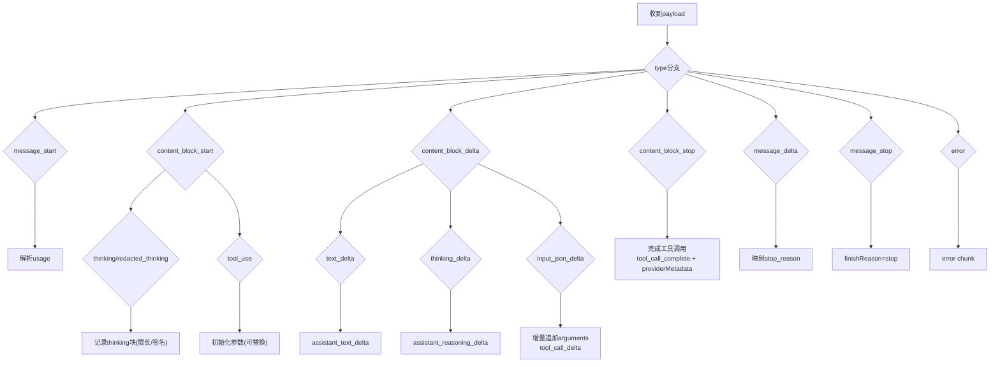
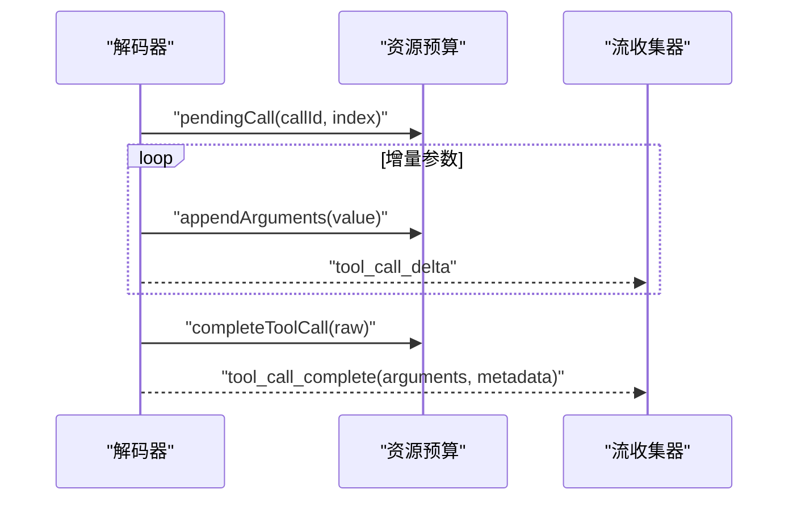
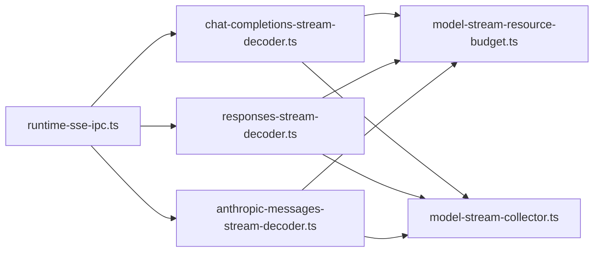

# 流式响应处理

<cite>
**本文引用的文件**
- [runtime-sse-ipc.ts](file://src/main/runtime-sse-ipc.ts)
- [incremental-sse-frame-buffer.ts](file://kun/src/adapters/model/incremental-sse-frame-buffer.ts)
- [chat-completions-stream-decoder.ts](file://kun/src/adapters/model/chat-completions-stream-decoder.ts)
- [responses-stream-decoder.ts](file://kun/src/adapters/model/responses-stream-decoder.ts)
- [anthropic-messages-stream-decoder.ts](file://kun/src/adapters/model/anthropic-messages-stream-decoder.ts)
- [model-stream-resource-budget.ts](file://kun/src/adapters/model/model-stream-resource-budget.ts)
- [model-stream-collector.ts](file://kun/src/loop/model-stream-collector.ts)
</cite>

## 目录
1. [简介](#简介)
2. [项目结构](#项目结构)
3. [核心组件](#核心组件)
4. [架构总览](#架构总览)
5. [详细组件分析](#详细组件分析)
6. [依赖关系分析](#依赖关系分析)
7. [性能考量](#性能考量)
8. [故障排除指南](#故障排除指南)
9. [结论](#结论)
10. [附录](#附录)

## 简介
本文件面向 DeepSeek-GUI 的流式响应处理系统，系统性说明 SSE（Server-Sent Events）连接管理、增量数据处理机制、不同提供商的流式解码器（OpenAI Chat Completions、Responses API、Anthropic Messages）、流式缓冲与内存管理、断线重连与数据完整性保证、工具调用的流式处理、错误处理与重试机制，以及性能优化与调试方法。文档以代码级实现为依据，提供流程图与序列图帮助理解端到端的数据流转。

## 项目结构
流式响应涉及主进程 SSE 桥接、SSE 帧解析、模型流解码器、资源预算控制与流聚合等模块：
- 主进程 SSE 桥接：负责建立/维护 SSE 连接、事件分片与确认、断线重连、批大小限制与内存保护。
- SSE 帧缓冲：增量定位 SSE 帧边界，避免重复扫描与复制，降低内存占用。
- 模型流解码器：将各提供商的原始流片段统一为内部 ModelStreamChunk。
- 资源预算：对总字节、帧数、输出文本、工具调用参数等进行上限控制与越界保护。
- 流收集器：将解码后的 chunk 聚合成文本、推理内容、工具调用完成事件与使用量快照。

**图表来源**
- [runtime-sse-ipc.ts:178-409](file://src/main/runtime-sse-ipc.ts#L178-L409)
- [incremental-sse-frame-buffer.ts:22-111](file://kun/src/adapters/model/incremental-sse-frame-buffer.ts#L22-L111)
- [chat-completions-stream-decoder.ts:15-82](file://kun/src/adapters/model/chat-completions-stream-decoder.ts#L15-L82)
- [responses-stream-decoder.ts:33-145](file://kun/src/adapters/model/responses-stream-decoder.ts#L33-L145)
- [anthropic-messages-stream-decoder.ts:27-127](file://kun/src/adapters/model/anthropic-messages-stream-decoder.ts#L27-L127)
- [model-stream-resource-budget.ts:58-218](file://kun/src/adapters/model/model-stream-resource-budget.ts#L58-L218)
- [model-stream-collector.ts:64-187](file://kun/src/loop/model-stream-collector.ts#L64-L187)

**章节来源**
- [runtime-sse-ipc.ts:178-409](file://src/main/runtime-sse-ipc.ts#L178-L409)
- [incremental-sse-frame-buffer.ts:22-111](file://kun/src/adapters/model/incremental-sse-frame-buffer.ts#L22-L111)
- [chat-completions-stream-decoder.ts:15-82](file://kun/src/adapters/model/chat-completions-stream-decoder.ts#L15-L82)
- [responses-stream-decoder.ts:33-145](file://kun/src/adapters/model/responses-stream-decoder.ts#L33-L145)
- [anthropic-messages-stream-decoder.ts:27-127](file://kun/src/adapters/model/anthropic-messages-stream-decoder.ts#L27-L127)
- [model-stream-resource-budget.ts:58-218](file://kun/src/adapters/model/model-stream-resource-budget.ts#L58-L218)
- [model-stream-collector.ts:64-187](file://kun/src/loop/model-stream-collector.ts#L64-L187)

## 核心组件
- SSE 连接与事件管道：维护连接生命周期、事件批处理、ACK 确认、断线指数退避重连、最大帧/批大小限制、内存上限保护。
- 增量 SSE 帧缓冲：按字符扫描定位分隔符，仅保留必要尾部重叠，延迟拼接完整帧数据。
- 提供商解码器：
  - OpenAI Chat Completions：解析 choices.delta 文本与 reasoning、tool_calls 增量参数、finish_reason 与 usage。
  - Responses API：处理 output_item.done、function_call_arguments.delta/done、response.completed/fail、image_generation 等。
  - Anthropic Messages：处理 message_start/content_block_*、thinking/redacted_thinking、input_json_delta、message_delta/message_stop/error。
- 资源预算：跟踪总字节、帧数、输出文本、待完成/已完成工具调用及其参数大小，超限抛出受控异常。
- 流收集器：将 chunk 归并为 assistant_text_delta、assistant_reasoning_delta、tool_call_ready、usage、model_error 等意图，并维护最终快照。

**章节来源**
- [runtime-sse-ipc.ts:178-409](file://src/main/runtime-sse-ipc.ts#L178-L409)
- [incremental-sse-frame-buffer.ts:22-111](file://kun/src/adapters/model/incremental-sse-frame-buffer.ts#L22-L111)
- [chat-completions-stream-decoder.ts:15-82](file://kun/src/adapters/model/chat-completions-stream-decoder.ts#L15-L82)
- [responses-stream-decoder.ts:33-145](file://kun/src/adapters/model/responses-stream-decoder.ts#L33-L145)
- [anthropic-messages-stream-decoder.ts:27-127](file://kun/src/adapters/model/anthropic-messages-stream-decoder.ts#L27-L127)
- [model-stream-resource-budget.ts:58-218](file://kun/src/adapters/model/model-stream-resource-budget.ts#L58-L218)
- [model-stream-collector.ts:64-187](file://kun/src/loop/model-stream-collector.ts#L64-L187)

## 架构总览
下图展示从 SSE 连接到上层意图的端到端流程，包括连接建立、事件分片、解码、预算校验与聚合。

**图表来源**
- [runtime-sse-ipc.ts:178-409](file://src/main/runtime-sse-ipc.ts#L178-L409)
- [chat-completions-stream-decoder.ts:15-82](file://kun/src/adapters/model/chat-completions-stream-decoder.ts#L15-L82)
- [responses-stream-decoder.ts:33-145](file://kun/src/adapters/model/responses-stream-decoder.ts#L33-L145)
- [anthropic-messages-stream-decoder.ts:27-127](file://kun/src/adapters/model/anthropic-messages-stream-decoder.ts#L27-L127)
- [model-stream-resource-budget.ts:58-218](file://kun/src/adapters/model/model-stream-resource-budget.ts#L58-L218)
- [model-stream-collector.ts:64-187](file://kun/src/loop/model-stream-collector.ts#L64-L187)

## 详细组件分析

### SSE 连接管理与事件批处理
- 连接建立：根据线程 ID 构造事件 URL，附加认证头与 Last-Event-ID（用于恢复）。
- 事件分片与确认：将多个事件打包成批次发送给渲染层；可选启用 batchId 进行 ACK 确认，防止堆积与丢帧。
- 内存与速率保护：限制单帧缓冲区大小、每批事件数量与字节数，超出即触发 flush。
- 断线重连：对可恢复错误采用指数退避（最小/最大间隔），重新获取连接并携带 since_seq 继续。
- 致命错误：客户端错误状态码直接上报并终止；服务端错误则尝试恢复。

**图表来源**
- [runtime-sse-ipc.ts:178-409](file://src/main/runtime-sse-ipc.ts#L178-L409)

**章节来源**
- [runtime-sse-ipc.ts:178-409](file://src/main/runtime-sse-ipc.ts#L178-L409)

### 增量 SSE 帧缓冲
- 设计目标：不重复扫描未完成的帧，仅在必要时保留最多三字符的分隔符尾部，减少拷贝与内存峰值。
- 工作方式：输入块追加后，扫描当前活动文本寻找分隔符；找到后将已提交部分加入帧片段队列，并在帧结束时一次性拼接。
- 压缩策略：当片段数量达到阈值时合并为块，释放中间数组空间。

**图表来源**
- [incremental-sse-frame-buffer.ts:22-111](file://kun/src/adapters/model/incremental-sse-frame-buffer.ts#L22-L111)

**章节来源**
- [incremental-sse-frame-buffer.ts:22-111](file://kun/src/adapters/model/incremental-sse-frame-buffer.ts#L22-L111)

### 提供商流式解码器

#### OpenAI Chat Completions
- 文本与推理：解析 choices[0].delta.content 与 delta.reasoning_content/delta.reasoning。
- 工具调用：解析 delta.tool_calls，增量追加 function.arguments，并在 finish_reason=tool_calls 时汇总为 tool_call_complete。
- 用量：解析 payload.usage 并标准化。

**图表来源**
- [chat-completions-stream-decoder.ts:15-82](file://kun/src/adapters/model/chat-completions-stream-decoder.ts#L15-L82)

**章节来源**
- [chat-completions-stream-decoder.ts:15-82](file://kun/src/adapters/model/chat-completions-stream-decoder.ts#L15-L82)

#### Responses API
- 输出项：output_item.done 中可能包含 text/image/function_call；函数调用在 done 时完成并产出 tool_call_complete。
- 增量参数：function_call_arguments.delta/done 支持增量与整段两种形式。
- 文本与推理：response.output_text.delta 与多种 reasoning delta 类型。
- 完成态：response.completed 会物化输出并去重已流式输出的文本，避免重复。
- 图片：image_generation_call.done 产出 image_generation_complete。

**图表来源**
- [responses-stream-decoder.ts:33-145](file://kun/src/adapters/model/responses-stream-decoder.ts#L33-L145)

**章节来源**
- [responses-stream-decoder.ts:33-145](file://kun/src/adapters/model/responses-stream-decoder.ts#L33-L145)

#### Anthropic Messages
- 消息起始：message_start 携带 usage。
- 内容块：content_block_start 记录 thinking/redacted_thinking 与 tool_use；content_block_delta 处理 text_delta/thinking_delta/input_json_delta/signature_delta。
- 完成：content_block_stop 完成工具调用并附带 providerMetadata（thinking blocks）。
- 停止与错误：message_delta 携带 stop_reason；message_stop 标记结束；error 事件产生 error chunk。

**图表来源**
- [anthropic-messages-stream-decoder.ts:27-127](file://kun/src/adapters/model/anthropic-messages-stream-decoder.ts#L27-L127)

**章节来源**
- [anthropic-messages-stream-decoder.ts:27-127](file://kun/src/adapters/model/anthropic-messages-stream-decoder.ts#L27-L127)

### 工具调用的流式处理
- 增量参数接收：各解码器在收到 function.arguments 增量时，先写入资源预算的 pending 结构，再产出 tool_call_delta。
- 参数完成：当 provider 指示完成（如 finish_reason=tool_calls、content_block_stop、output_item.done、function_call_arguments.done）时，汇总并产出 tool_call_complete。
- 参数修复与限制：收集器会对参数进行修复与长度限制，确保下游执行安全。
- 元数据透传：Anthropic 的 thinkingBlocks 通过 providerMetadata 透传到上层。

**图表来源**
- [chat-completions-stream-decoder.ts:41-80](file://kun/src/adapters/model/chat-completions-stream-decoder.ts#L41-L80)
- [responses-stream-decoder.ts:61-82](file://kun/src/adapters/model/responses-stream-decoder.ts#L61-L82)
- [anthropic-messages-stream-decoder.ts:58-111](file://kun/src/adapters/model/anthropic-messages-stream-decoder.ts#L58-L111)
- [model-stream-resource-budget.ts:87-177](file://kun/src/adapters/model/model-stream-resource-budget.ts#L87-L177)
- [model-stream-collector.ts:151-187](file://kun/src/loop/model-stream-collector.ts#L151-L187)

**章节来源**
- [chat-completions-stream-decoder.ts:41-80](file://kun/src/adapters/model/chat-completions-stream-decoder.ts#L41-L80)
- [responses-stream-decoder.ts:61-82](file://kun/src/adapters/model/responses-stream-decoder.ts#L61-L82)
- [anthropic-messages-stream-decoder.ts:58-111](file://kun/src/adapters/model/anthropic-messages-stream-decoder.ts#L58-L111)
- [model-stream-resource-budget.ts:87-177](file://kun/src/adapters/model/model-stream-resource-budget.ts#L87-L177)
- [model-stream-collector.ts:151-187](file://kun/src/loop/model-stream-collector.ts#L151-L187)

### 流式缓冲策略与内存管理
- 帧缓冲：增量定位分隔符，避免重复扫描与复制；仅在帧完成时拼接。
- 批处理：限制每批事件数量与字节数，及时 flush，防止渲染侧积压。
- 资源预算：对总响应字节、帧数、输出文本、工具调用参数总量与单个参数大小进行限制，超限抛出受控异常。
- 去重与防抖：Responses API 通过 identity 追踪已流式输出的文本，避免 done-item 重复。

**章节来源**
- [incremental-sse-frame-buffer.ts:22-111](file://kun/src/adapters/model/incremental-sse-frame-buffer.ts#L22-L111)
- [runtime-sse-ipc.ts:254-340](file://src/main/runtime-sse-ipc.ts#L254-L340)
- [model-stream-resource-budget.ts:58-218](file://kun/src/adapters/model/model-stream-resource-budget.ts#L58-L218)
- [responses-stream-decoder.ts:216-276](file://kun/src/adapters/model/responses-stream-decoder.ts#L216-L276)

### 断线重连与数据完整性
- 重连策略：指数退避（最小/最大间隔），每次重连携带 since_seq 与 Last-Event-ID 以恢复上下文。
- 致命错误：客户端错误状态码直接上报并终止；服务端错误尝试恢复。
- 数据完整性：通过序列号与批 ACK 保障事件顺序与消费确认；超大帧检测与拒绝。

**章节来源**
- [runtime-sse-ipc.ts:178-409](file://src/main/runtime-sse-ipc.ts#L178-L409)

### 错误处理与重试机制
- 网络异常：捕获 fetch/reader 异常，识别瞬态错误并重试。
- 超时处理：SSE 启动超时、ACK 超时均有独立计时器与中止信号。
- 部分响应恢复：通过 since_seq/Last-Event-ID 与批 ACK 恢复至最近一致点。

**章节来源**
- [runtime-sse-ipc.ts:141-176](file://src/main/runtime-sse-ipc.ts#L141-L176)
- [runtime-sse-ipc.ts:254-340](file://src/main/runtime-sse-ipc.ts#L254-L340)
- [runtime-sse-ipc.ts:355-370](file://src/main/runtime-sse-ipc.ts#L355-L370)

## 依赖关系分析
- runtime-sse-ipc.ts 依赖：
  - 认证与运行时地址解析（来自运行时适配器）。
  - 事件路径与 schema 校验。
  - 渲染层 IPC 通道。
- 解码器依赖：
  - ModelStreamResourceBudget：统一资源限制与会计。
  - 各自提供商协议字段解析与映射。
- 流收集器依赖：
  - 工具参数修复与长度限制。
  - 调用 ID 分配策略（由上层注入）。

**图表来源**
- [runtime-sse-ipc.ts:178-409](file://src/main/runtime-sse-ipc.ts#L178-L409)
- [chat-completions-stream-decoder.ts:15-82](file://kun/src/adapters/model/chat-completions-stream-decoder.ts#L15-L82)
- [responses-stream-decoder.ts:33-145](file://kun/src/adapters/model/responses-stream-decoder.ts#L33-L145)
- [anthropic-messages-stream-decoder.ts:27-127](file://kun/src/adapters/model/anthropic-messages-stream-decoder.ts#L27-L127)
- [model-stream-resource-budget.ts:58-218](file://kun/src/adapters/model/model-stream-resource-budget.ts#L58-L218)
- [model-stream-collector.ts:64-187](file://kun/src/loop/model-stream-collector.ts#L64-L187)

**章节来源**
- [runtime-sse-ipc.ts:178-409](file://src/main/runtime-sse-ipc.ts#L178-L409)
- [model-stream-resource-budget.ts:58-218](file://kun/src/adapters/model/model-stream-resource-budget.ts#L58-L218)
- [model-stream-collector.ts:64-187](file://kun/src/loop/model-stream-collector.ts#L64-L187)

## 性能考量
- 增量解析：SSE 帧缓冲避免重复扫描与复制，降低 CPU 与内存峰值。
- 批处理与确认：合理设置 MAX_SSE_BATCH_EVENTS/MAX_SSE_BATCH_BYTES，平衡吞吐与延迟；开启 ACK 保障可靠性。
- 资源预算：严格限制 totalBytes、maxFrames、maxOutputBytes、工具参数累计，防止 OOM 与卡顿。
- 去重与合并：Responses API 的去重逻辑避免重复文本；工具参数分块合并减少频繁拼接。
- 重连策略：指数退避避免雪崩；携带 since_seq/Last-Event-ID 快速恢复。

[本节为通用指导，不直接分析具体文件]

## 故障排除指南
- 无法建立 SSE 连接：
  - 检查认证头与运行时地址是否正确。
  - 查看是否命中致命状态码（4xx 且非 408/429）。
- 流中断或卡顿：
  - 检查批大小与帧大小限制是否过小导致频繁 flush。
  - 观察资源预算是否触发超限异常（totalBytes/maxFrames/outputBytes/pendingArgumentBytes）。
- 工具调用参数不完整：
  - 确认 provider 是否发出完成信号（finish_reason/tool_use stop/done）。
  - 检查参数累计是否超过单参数或总计限制。
- 重复文本：
  - 确认 Responses API 的去重逻辑是否生效（identity 追踪）。
- 日志与诊断：
  - 关注 SSE 错误事件与 worker 崩溃日志。
  - 使用 inspectedCharacters 等指标评估帧解析效率。

**章节来源**
- [runtime-sse-ipc.ts:141-176](file://src/main/runtime-sse-ipc.ts#L141-L176)
- [runtime-sse-ipc.ts:254-340](file://src/main/runtime-sse-ipc.ts#L254-L340)
- [runtime-sse-ipc.ts:355-370](file://src/main/runtime-sse-ipc.ts#L355-L370)
- [model-stream-resource-budget.ts:258-274](file://kun/src/adapters/model/model-stream-resource-budget.ts#L258-L274)
- [incremental-sse-frame-buffer.ts:74-77](file://kun/src/adapters/model/incremental-sse-frame-buffer.ts#L74-L77)

## 结论
DeepSeek-GUI 的流式响应处理通过“主进程 SSE 桥接 + 增量帧缓冲 + 多提供商解码器 + 资源预算 + 流收集器”的分层架构，实现了高可靠、低内存占用的流式传输与处理。其关键优势在于：
- 稳健的连接管理与断线恢复（since_seq/Last-Event-ID、指数退避）。
- 精细的资源预算与内存保护（总字节、帧数、输出文本、工具参数）。
- 统一的内部 chunk 模型，屏蔽提供商差异。
- 可扩展的工具调用流式处理与参数修复。
建议在生产环境中结合批大小与 ACK 策略调优，并持续监控资源预算告警与 SSE 错误日志。

[本节为总结性内容，不直接分析具体文件]

## 附录
- 关键常量参考：
  - SSE 重连基础/最大间隔、启动/ACK 超时、最大帧缓冲与批大小。
  - 模型流默认限制（总字节、帧数、输出文本、工具调用参数等）。
- 扩展点：
  - 自定义提供商解码器需遵循 ModelStreamChunk 契约。
  - 可通过配置调整资源预算与批大小以适应不同场景。

[本节为补充信息，不直接分析具体文件]