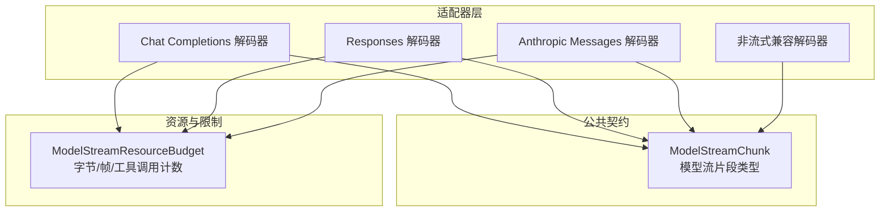
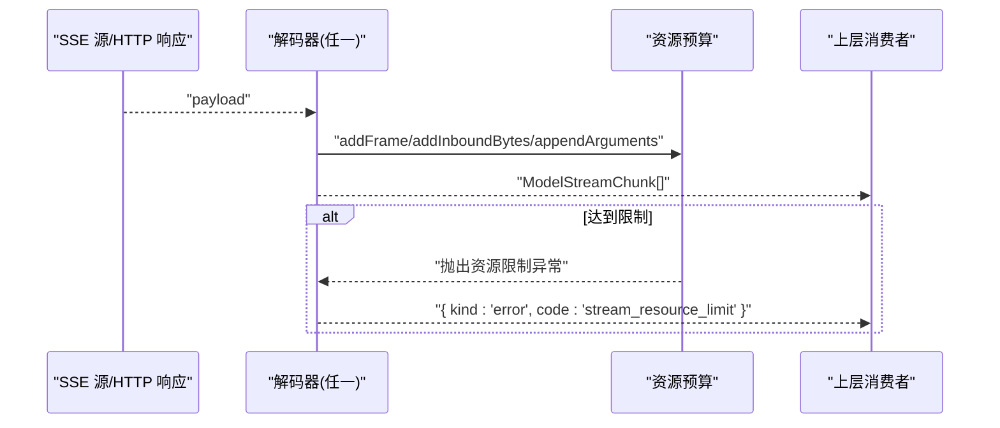
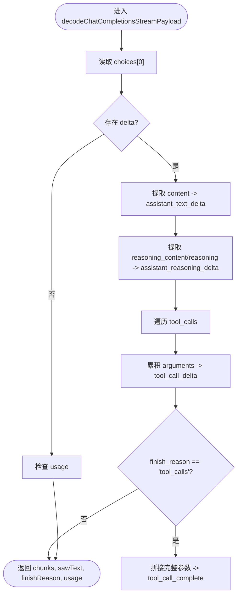
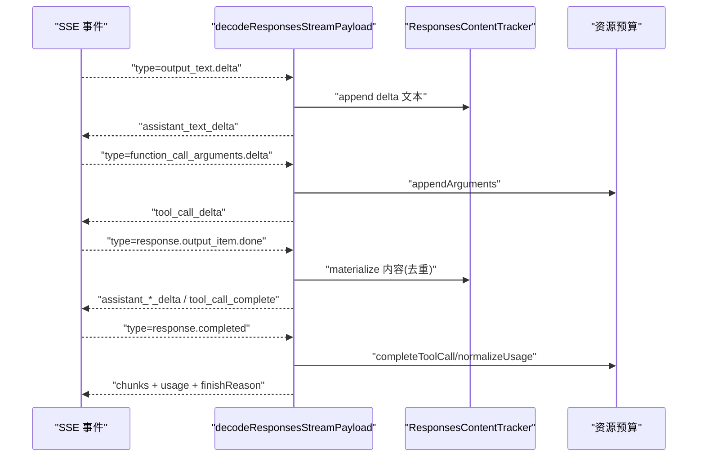
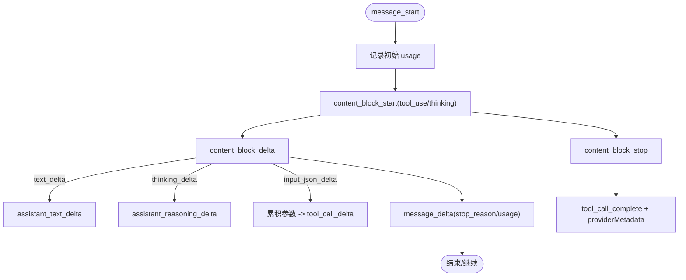
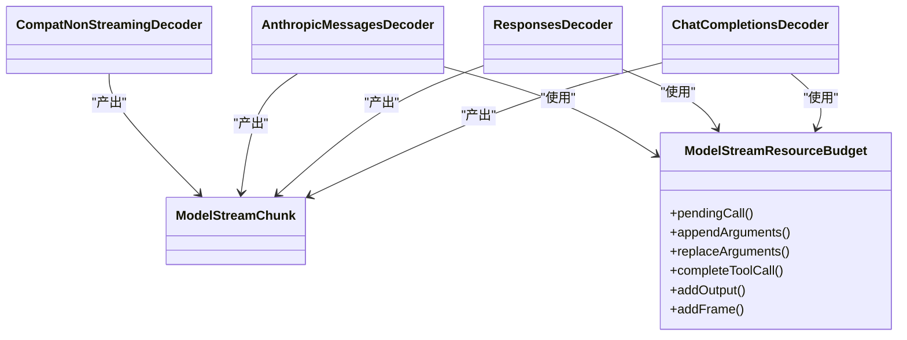

# 流式解码器

<cite>
**本文引用的文件**
- [chat-completions-stream-decoder.ts](file://kun/src/adapters/model/chat-completions-stream-decoder.ts)
- [responses-stream-decoder.ts](file://kun/src/adapters/model/responses-stream-decoder.ts)
- [anthropic-messages-stream-decoder.ts](file://kun/src/adapters/model/anthropic-messages-stream-decoder.ts)
- [compat-non-streaming-decoder.ts](file://kun/src/adapters/model/compat-non-streaming-decoder.ts)
- [model-client.ts](file://kun/src/ports/model-client.ts)
- [model-stream-resource-budget.ts](file://kun/src/adapters/model/model-stream-resource-budget.ts)
- [compat-model-client.streaming-tool-calls.test.ts](file://kun/src/adapters/model/compat-model-client.streaming-tool-calls.test.ts)
</cite>

## 目录
1. [简介](#简介)
2. [项目结构](#项目结构)
3. [核心组件](#核心组件)
4. [架构总览](#架构总览)
5. [详细组件分析](#详细组件分析)
6. [依赖关系分析](#依赖关系分析)
7. [性能考量](#性能考量)
8. [故障排查指南](#故障排查指南)
9. [结论](#结论)
10. [附录：配置与示例](#附录：配置与示例)

## 简介
本文件面向 DeepSeek-GUI 的多种流式解码器，系统性说明以下能力：
- OpenAI Chat Completions API 的流式响应解析：文本增量、工具调用、用法统计。
- Responses API 的流式数据处理：不同响应格式的兼容性与去重转换。
- Anthropic Messages API 的流式解码：消息结构解析与内容提取（含 thinking）。
- 各解码器的共同接口设计与扩展机制。
- 解码器的配置选项与性能优化建议。
- 具体 API 调用示例与错误处理模式。

## 项目结构
流式解码相关代码集中在 kun/src/adapters/model 目录下，统一输出到 ports/model-client.ts 定义的 ModelStreamChunk 契约，供上层循环消费。非流式兼容解码位于 compat-non-streaming-decoder.ts，用于将一次性响应转换为统一的流式片段序列。资源预算与限流由 model-stream-resource-budget.ts 提供。

图表来源
- [chat-completions-stream-decoder.ts:15-82](file://kun/src/adapters/model/chat-completions-stream-decoder.ts#L15-L82)
- [responses-stream-decoder.ts:33-145](file://kun/src/adapters/model/responses-stream-decoder.ts#L33-L145)
- [anthropic-messages-stream-decoder.ts:27-127](file://kun/src/adapters/model/anthropic-messages-stream-decoder.ts#L27-L127)
- [compat-non-streaming-decoder.ts:15-31](file://kun/src/adapters/model/compat-non-streaming-decoder.ts#L15-L31)
- [model-client.ts:31-54](file://kun/src/ports/model-client.ts#L31-L54)
- [model-stream-resource-budget.ts:58-218](file://kun/src/adapters/model/model-stream-resource-budget.ts#L58-L218)

章节来源
- [model-client.ts:31-54](file://kun/src/ports/model-client.ts#L31-L54)
- [model-stream-resource-budget.ts:30-42](file://kun/src/adapters/model/model-stream-resource-budget.ts#L30-L42)

## 核心组件
- 统一流片段类型 ModelStreamChunk：定义 assistant_text_delta、assistant_reasoning_delta、tool_call_delta、tool_call_complete、usage、completed、error 等片段，作为所有解码器的统一输出。
- 资源预算 ModelStreamResourceBudget：对入站字节、SSE 帧数、输出文本长度、待完成工具调用及其参数大小进行限额控制，超限抛出异常并转为 error 片段。
- 三大流式解码器：分别适配 Chat Completions、Responses、Anthropic Messages 的 SSE 事件，产出相同的 ModelStreamChunk。
- 非流式兼容解码器：将一次性响应按端点格式拆分为等价流片段序列，便于上层统一处理。

章节来源
- [model-client.ts:31-54](file://kun/src/ports/model-client.ts#L31-L54)
- [model-stream-resource-budget.ts:58-218](file://kun/src/adapters/model/model-stream-resource-budget.ts#L58-L218)
- [chat-completions-stream-decoder.ts:15-82](file://kun/src/adapters/model/chat-completions-stream-decoder.ts#L15-L82)
- [responses-stream-decoder.ts:33-145](file://kun/src/adapters/model/responses-stream-decoder.ts#L33-L145)
- [anthropic-messages-stream-decoder.ts:27-127](file://kun/src/adapters/model/anthropic-messages-stream-decoder.ts#L27-L127)
- [compat-non-streaming-decoder.ts:15-31](file://kun/src/adapters/model/compat-non-streaming-decoder.ts#L15-L31)

## 架构总览
所有解码器遵循“输入原始载荷 + 状态/预算 + 回调”的统一模式：
- 输入：每条 SSE 事件或一次性响应载荷。
- 状态：如 Responses 的内容追踪器、Anthropic 的 thinking 状态、各解码器的 pendingArguments/pendingByIndex。
- 预算：通过 ModelStreamResourceBudget 累计字节、帧数、工具调用数量与参数大小。
- 输出：ModelStreamChunk 序列，包含文本/推理增量、工具调用增量与完成、usage、completed/error。

图表来源
- [model-stream-resource-budget.ts:74-85](file://kun/src/adapters/model/model-stream-resource-budget.ts#L74-L85)
- [model-stream-resource-budget.ts:121-177](file://kun/src/adapters/model/model-stream-resource-budget.ts#L121-L177)
- [model-stream-resource-budget.ts:207-218](file://kun/src/adapters/model/model-stream-resource-budget.ts#L207-L218)

## 详细组件分析

### OpenAI Chat Completions 流式解码
- 文本增量：从 choices[0].delta.content 提取 assistant_text_delta。
- 推理内容：优先 reasoning_content，其次 reasoning，产出 assistant_reasoning_delta。
- 工具调用：
  - 增量：从 delta.tool_calls 累积 function.arguments，产出 tool_call_delta。
  - 完成：当 finish_reason === 'tool_calls' 且存在待完成调用时，拼接完整参数并产出 tool_call_complete。
- 用法统计：若 payload.usage 存在，归一化后产出 usage 片段。
- 索引与 ID 对齐：支持 index 与 id 混用场景，维护 pendingByIndex 以稳定关联。

图表来源
- [chat-completions-stream-decoder.ts:15-82](file://kun/src/adapters/model/chat-completions-stream-decoder.ts#L15-L82)

章节来源
- [chat-completions-stream-decoder.ts:15-82](file://kun/src/adapters/model/chat-completions-stream-decoder.ts#L15-L82)

### Responses API 流式解码
- 多事件类型：response.output_item.done、response.output_text.delta、response.reasoning*.delta、response.function_call_arguments.*、response.completed、response.failed/error。
- 内容去重：使用 ResponsesContentTracker 记录已完成内容的 identity，避免 done-only 与 completed 重复输出；同时保留后续 delta 片段。
- 工具调用：
  - 增量：function_call_arguments.delta 累积参数，产出 tool_call_delta。
  - 完成：output_item.done 或 function_call_arguments.done 触发 tool_call_complete。
- 完成与失败：response.completed 汇总 output 与 usage，推断 finishReason；response.failed/error 直接产出 error 片段。
- 图片生成：image_generation_call 在 done 时产出 image_generation_complete。

图表来源
- [responses-stream-decoder.ts:33-145](file://kun/src/adapters/model/responses-stream-decoder.ts#L33-L145)
- [responses-stream-decoder.ts:147-214](file://kun/src/adapters/model/responses-stream-decoder.ts#L147-L214)
- [responses-stream-decoder.ts:216-276](file://kun/src/adapters/model/responses-stream-decoder.ts#L216-L276)

章节来源
- [responses-stream-decoder.ts:33-145](file://kun/src/adapters/model/responses-stream-decoder.ts#L33-L145)
- [responses-stream-decoder.ts:147-214](file://kun/src/adapters/model/responses-stream-decoder.ts#L147-L214)
- [responses-stream-decoder.ts:216-276](file://kun/src/adapters/model/responses-stream-decoder.ts#L216-L276)

### Anthropic Messages API 流式解码
- 消息结构：message_start/content_block_start/delta/stop/message_delta/message_stop/error。
- 文本与推理：content_block_delta.text_delta 产出 assistant_text_delta；thinking_delta 产出 assistant_reasoning_delta。
- 工具调用：
  - 开始：content_block_start.type=tool_use 记录 name/input。
  - 增量：input_json_delta.partial_json 累积参数，产出 tool_call_delta。
  - 完成：content_block_stop 拼接参数并产出 tool_call_complete。
- Thinking 元数据：收集 thinking/redacted_thinking 块并在完成时附加 providerMetadata。
- 停止原因映射：message_delta.stop_reason 映射为 stop/tool_calls/length/error。

图表来源
- [anthropic-messages-stream-decoder.ts:27-127](file://kun/src/adapters/model/anthropic-messages-stream-decoder.ts#L27-L127)
- [anthropic-messages-stream-decoder.ts:129-220](file://kun/src/adapters/model/anthropic-messages-stream-decoder.ts#L129-L220)

章节来源
- [anthropic-messages-stream-decoder.ts:27-127](file://kun/src/adapters/model/anthropic-messages-stream-decoder.ts#L27-L127)
- [anthropic-messages-stream-decoder.ts:129-220](file://kun/src/adapters/model/anthropic-messages-stream-decoder.ts#L129-L220)

### 非流式兼容解码
- 根据 endpointFormat 路由到 chat_completions/messages/responses 三种解析路径。
- 将一次性响应拆解为 assistant_text_delta、assistant_reasoning_delta、tool_call_complete、usage、completed/error 等片段。
- 对 Anthropic 的非流式响应，提取 thinkingBlocks 并附加 providerMetadata。

章节来源
- [compat-non-streaming-decoder.ts:15-31](file://kun/src/adapters/model/compat-non-streaming-decoder.ts#L15-L31)
- [compat-non-streaming-decoder.ts:33-64](file://kun/src/adapters/model/compat-non-streaming-decoder.ts#L33-L64)
- [compat-non-streaming-decoder.ts:66-99](file://kun/src/adapters/model/compat-non-streaming-decoder.ts#L66-L99)
- [compat-non-streaming-decoder.ts:101-148](file://kun/src/adapters/model/compat-non-streaming-decoder.ts#L101-L148)

## 依赖关系分析
- 解码器均依赖 ModelStreamChunk 类型与 ModelStreamResourceBudget。
- Chat Completions 与 Responses 共享 PendingToolCall 与 byIndex 绑定策略；Anthropic 使用 index 与 item_id 双重定位。
- 非流式解码器复用相同片段类型，确保上层统一消费。

图表来源
- [model-client.ts:31-54](file://kun/src/ports/model-client.ts#L31-L54)
- [model-stream-resource-budget.ts:58-218](file://kun/src/adapters/model/model-stream-resource-budget.ts#L58-L218)
- [chat-completions-stream-decoder.ts:15-82](file://kun/src/adapters/model/chat-completions-stream-decoder.ts#L15-L82)
- [responses-stream-decoder.ts:33-145](file://kun/src/adapters/model/responses-stream-decoder.ts#L33-L145)
- [anthropic-messages-stream-decoder.ts:27-127](file://kun/src/adapters/model/anthropic-messages-stream-decoder.ts#L27-L127)
- [compat-non-streaming-decoder.ts:15-31](file://kun/src/adapters/model/compat-non-streaming-decoder.ts#L15-L31)

章节来源
- [model-client.ts:31-54](file://kun/src/ports/model-client.ts#L31-L54)
- [model-stream-resource-budget.ts:58-218](file://kun/src/adapters/model/model-stream-resource-budget.ts#L58-L218)

## 性能考量
- 字节与帧限制：通过 addFrame/addInboundBytes 限制单帧与总响应大小，防止内存膨胀。
- 输出文本上限：addOutput 累计 assistant_text_delta/assistant_reasoning_delta 的字节数，超过阈值即报错。
- 工具调用参数合并：argumentParts 达到窗口后合并为 argumentBlocks，减少碎片开销。
- 资源超限异常：抛出 ModelStreamResourceLimitError，上层可捕获并转化为 stream_resource_limit 错误片段。
- 去重与增量：Responses 解码器通过 identity 追踪避免重复输出，同时保留后续 delta 片段，降低冗余传输。

章节来源
- [model-stream-resource-budget.ts:74-85](file://kun/src/adapters/model/model-stream-resource-budget.ts#L74-L85)
- [model-stream-resource-budget.ts:121-177](file://kun/src/adapters/model/model-stream-resource-budget.ts#L121-L177)
- [model-stream-resource-budget.ts:207-218](file://kun/src/adapters/model/model-stream-resource-budget.ts#L207-L218)
- [responses-stream-decoder.ts:216-276](file://kun/src/adapters/model/responses-stream-decoder.ts#L216-L276)

## 故障排查指南
- 常见错误片段：
  - error：来自各解码器的事件错误（messages_stream_error、response_stream_error）或网络/传输异常。
  - retrying：重试过程中的状态片段，携带 attempt/maxAttempts/delayMs 等信息。
  - stream_resource_limit：资源预算超限，包含 responseBytes、frames、pendingToolCalls、pendingArgumentBytes 等诊断信息。
- 排查步骤：
  - 检查 SSE 事件类型与字段是否符合预期（例如 type、item、delta、usage）。
  - 确认工具调用是否被正确完成（tool_call_complete），避免 pending 泄漏。
  - 关注资源限制错误中的上下文字段，定位是帧过大、总字节过多还是工具参数过大。
  - 对于 Responses，检查 contentTracker 的去重逻辑是否导致内容缺失或重复。

章节来源
- [model-client.ts:31-54](file://kun/src/ports/model-client.ts#L31-L54)
- [model-stream-resource-budget.ts:258-274](file://kun/src/adapters/model/model-stream-resource-budget.ts#L258-L274)
- [responses-stream-decoder.ts:140-145](file://kun/src/adapters/model/responses-stream-decoder.ts#L140-L145)
- [anthropic-messages-stream-decoder.ts:112-125](file://kun/src/adapters/model/anthropic-messages-stream-decoder.ts#L112-L125)

## 结论
DeepSeek-GUI 的流式解码器通过统一契约与资源预算机制，将不同提供商的流式协议标准化为一致的 ModelStreamChunk 序列。该设计既保证了文本、推理与工具调用的实时性，又通过严格的资源限制与去重策略提升了稳定性与可扩展性。上层只需消费统一片段即可实现跨提供商的一致体验。

## 附录：配置与示例

### 解码器配置选项
- 资源限制（默认值见 DEFAULT_MODEL_STREAM_LIMITS）：
  - maxBufferBytes：缓冲上限
  - maxFrameBytes：单帧上限
  - maxTotalBytes：总响应上限
  - maxFrames：最大帧数
  - maxOutputBytes：输出文本与推理上限
  - maxPendingToolCalls：待完成工具调用上限
  - maxPendingToolArgumentBytes：单个工具参数上限
  - maxTotalPendingToolArgumentBytes：待完成工具参数总量上限
  - maxCompletedToolCalls：已完成工具调用上限
  - maxCompletedToolArgumentBytes：已完成工具参数总量上限
- 回调函数：
  - normalizeUsage：将各提供商 usage 归一化为 UsageSnapshot。
  - parseToolArguments：将原始参数字符串解析为对象。
  - payloadError（仅非流式）：检测一次性响应中的错误并返回结构化错误。

章节来源
- [model-stream-resource-budget.ts:30-42](file://kun/src/adapters/model/model-stream-resource-budget.ts#L30-L42)
- [compat-non-streaming-decoder.ts:8-12](file://kun/src/adapters/model/compat-non-streaming-decoder.ts#L8-L12)

### API 调用示例（基于测试用例）
- Chat Completions 工具调用增量与完成：
  - 构造两条 tool_calls 增量帧，随后 finish_reason='tool_calls' 触发 tool_call_complete。
  - 参考：[compat-model-client.streaming-tool-calls.test.ts:125-132](file://kun/src/adapters/model/compat-model-client.streaming-tool-calls.test.ts#L125-L132)
- Responses 文本与推理去重：
  - 先发送 output_item.done 的消息与推理项，再发送 response.completed，确保不重复输出。
  - 参考：[compat-model-client.streaming-tool-calls.test.ts:160-185](file://kun/src/adapters/model/compat-model-client.streaming-tool-calls.test.ts#L160-L185)
- Responses 文本与工具调用共存：
  - 同一 response 中既有 output_text 又有 function_call，确保两者均被正确输出一次。
  - 参考：[compat-model-client.streaming-tool-calls.test.ts:187-200](file://kun/src/adapters/model/compat-model-client.streaming-tool-calls.test.ts#L187-L200)

章节来源
- [compat-model-client.streaming-tool-calls.test.ts:125-132](file://kun/src/adapters/model/compat-model-client.streaming-tool-calls.test.ts#L125-L132)
- [compat-model-client.streaming-tool-calls.test.ts:160-185](file://kun/src/adapters/model/compat-model-client.streaming-tool-calls.test.ts#L160-L185)
- [compat-model-client.streaming-tool-calls.test.ts:187-200](file://kun/src/adapters/model/compat-model-client.streaming-tool-calls.test.ts#L187-L200)