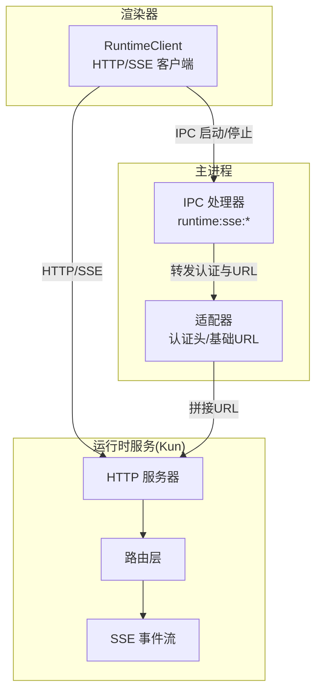
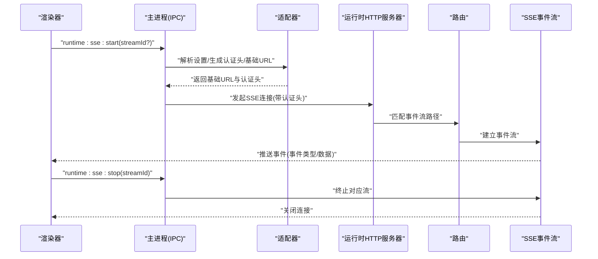
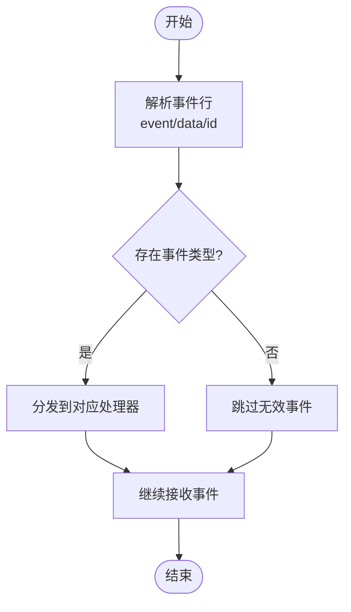
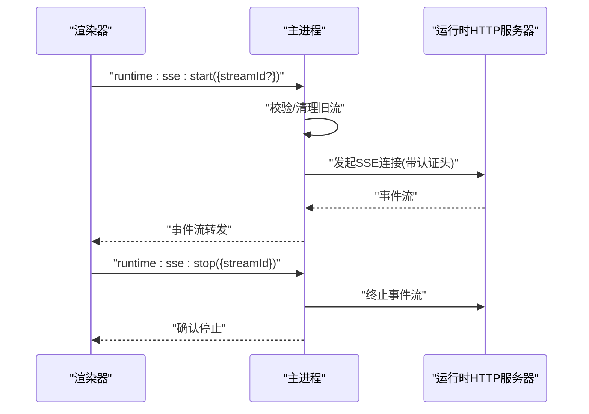
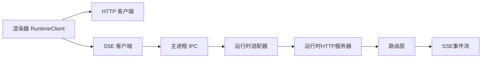

# API 参考

<cite>
**本文引用的文件**
- [runtime-sse-ipc.ts](file://src/main/runtime-sse-ipc.ts)
- [app-ipc-schemas.ts](file://src/main/ipc/app-ipc-schemas.ts)
- [kun-endpoints.ts](file://src/shared/kun-endpoints.ts)
- [kun-adapter.ts](file://src/main/runtime/kun-adapter.ts)
- [http-server.ts](file://kun/src/server/http-server.ts)
- [router.ts](file://kun/src/server/router.ts)
- [auth.ts](file://kun/src/server/auth.ts)
- [sse.ts](file://kun/src/server/sse.ts)
- [sessions.ts](file://kun/src/server/routes/sessions.ts)
- [threads.ts](file://kun/src/server/routes/threads.ts)
- [turns.ts](file://kun/src/server/routes/turns.ts)
- [attachments.ts](file://kun/src/server/routes/attachments.ts)
- [memory.ts](file://kun/src/server/routes/memory.ts)
- [events.ts](file://kun/src/server/routes/events.ts)
- [health.ts](file://kun/src/server/routes/health.ts)
- [runtime-error.ts](file://kun/src/server/routes/runtime-error.ts)
- [runtime-info.ts](file://kun/src/server/routes/runtime-info.ts)
- [server-runtime.ts](file://kun/src/server/routes/server-runtime.ts)
- [user-inputs.ts](file://kun/src/server/routes/user-inputs.ts)
- [workspace.ts](file://kun/src/server/routes/workspace.ts)
- [review.ts](file://kun/src/server/routes/review.ts)
- [usage.ts](file://kun/src/server/routes/usage.ts)
- [read-json-body.ts](file://kun/src/server/read-json-body.ts)
- [response.ts](file://kun/src/server/response.ts)
- [runtime-factory.ts](file://kun/src/server/runtime-factory.ts)
- [runtime-client.ts](file://src/renderer/src/agent/runtime-client.ts)
- [kun-contract.ts](file://src/renderer/src/agent/kun-contract.ts)
- [kun-mapper.ts](file://src/renderer/src/agent/kun-mapper.ts)
- [ds-gui-api.ts](file://src/shared/ds-gui-api.ts)
</cite>

## 目录
1. [简介](#简介)
2. [项目结构](#项目结构)
3. [核心组件](#核心组件)
4. [架构总览](#架构总览)
5. [详细组件分析](#详细组件分析)
6. [依赖关系分析](#依赖关系分析)
7. [性能考虑](#性能考虑)
8. [故障排除指南](#故障排除指南)
9. [结论](#结论)
10. [附录](#附录)

## 简介
本文件为 DeepSeek GUI 的完整 API 参考文档，覆盖以下方面：
- HTTP API：会话管理、线程与轮次（Turn）操作、附件上传、内存检索、事件流、健康检查、运行时信息、工作区、评审、用量统计等端点的请求/响应格式、认证机制与错误处理。
- SSE 推送：事件类型、数据格式、连接管理、重连与错误恢复策略。
- IPC 通信：主进程与渲染器进程之间的数据传输格式、错误处理与生命周期管理。
- 客户端实现指南：如何在 Electron 渲染器中通过 HTTP 与 SSE 访问运行时服务；如何使用 IPC 启动/停止 SSE 流。
- 性能优化建议：缓存、批量请求、流式处理与资源释放。
- 版本管理与兼容性：API 版本策略、向后兼容性与迁移指南。

## 项目结构
DeepSeek GUI 的 API 分为三层：
- 运行时服务（Kun）：提供 HTTP API 与 SSE 事件流，位于 kun 子工程。
- 主进程（Electron）：通过 IPC 暴露运行时 SSE 启动/停止能力，并转发认证头与基础地址。
- 渲染器（Electron Renderer）：通过 HTTP 客户端与 SSE 客户端访问运行时服务，或通过 IPC 控制 SSE。

图表来源
- [runtime-sse-ipc.ts:133-162](file://src/main/runtime-sse-ipc.ts#L133-L162)
- [kun-adapter.ts:1-200](file://src/main/runtime/kun-adapter.ts#L1-L200)
- [http-server.ts:1-200](file://kun/src/server/http-server.ts#L1-L200)
- [router.ts:1-200](file://kun/src/server/router.ts#L1-L200)
- [sse.ts:1-200](file://kun/src/server/sse.ts#L1-L200)

章节来源
- [runtime-sse-ipc.ts:1-162](file://src/main/runtime-sse-ipc.ts#L1-L162)
- [kun-adapter.ts:1-200](file://src/main/runtime/kun-adapter.ts#L1-L200)
- [http-server.ts:1-200](file://kun/src/server/http-server.ts#L1-L200)
- [router.ts:1-200](file://kun/src/server/router.ts#L1-L200)
- [sse.ts:1-200](file://kun/src/server/sse.ts#L1-L200)

## 核心组件
- 运行时 HTTP 路由与端点：会话、线程、轮次、附件、内存、事件、健康、运行时信息、工作区、评审、用量等。
- SSE 事件流：基于 Server-Sent Events 的实时推送，支持事件类型、数据与重连。
- IPC 层：主进程暴露 runtime:sse:start、runtime:sse:stop 等 IPC 方法，负责启动/停止 SSE 并管理连接状态。
- 渲染器客户端：封装 HTTP 请求与 SSE 连接，提供统一的 API 访问入口。

章节来源
- [sessions.ts:1-200](file://kun/src/server/routes/sessions.ts#L1-L200)
- [threads.ts:1-200](file://kun/src/server/routes/threads.ts#L1-L200)
- [turns.ts:1-200](file://kun/src/server/routes/turns.ts#L1-L200)
- [attachments.ts:1-200](file://kun/src/server/routes/attachments.ts#L1-L200)
- [memory.ts:1-200](file://kun/src/server/routes/memory.ts#L1-L200)
- [events.ts:1-200](file://kun/src/server/routes/events.ts#L1-L200)
- [health.ts:1-200](file://kun/src/server/routes/health.ts#L1-L200)
- [runtime-info.ts:1-200](file://kun/src/server/routes/runtime-info.ts#L1-L200)
- [workspace.ts:1-200](file://kun/src/server/routes/workspace.ts#L1-L200)
- [review.ts:1-200](file://kun/src/server/routes/review.ts#L1-L200)
- [usage.ts:1-200](file://kun/src/server/routes/usage.ts#L1-L200)
- [sse.ts:1-200](file://kun/src/server/sse.ts#L1-L200)
- [runtime-sse-ipc.ts:133-162](file://src/main/runtime-sse-ipc.ts#L133-L162)

## 架构总览
下图展示从渲染器到运行时服务的完整调用链路，包括 HTTP 与 SSE：

图表来源
- [runtime-sse-ipc.ts:133-162](file://src/main/runtime-sse-ipc.ts#L133-L162)
- [kun-adapter.ts:1-200](file://src/main/runtime/kun-adapter.ts#L1-L200)
- [http-server.ts:1-200](file://kun/src/server/http-server.ts#L1-L200)
- [router.ts:1-200](file://kun/src/server/router.ts#L1-L200)
- [sse.ts:1-200](file://kun/src/server/sse.ts#L1-L200)

## 详细组件分析

### HTTP API 端点总览
- 会话管理
  - GET /sessions：列出会话
  - GET /sessions/{id}：获取会话详情
  - POST /sessions：创建会话
  - PUT /sessions/{id}：更新会话
  - DELETE /sessions/{id}：删除会话
- 线程与轮次
  - GET /threads：列出线程
  - GET /threads/{id}：获取线程详情
  - POST /threads：创建线程
  - PUT /threads/{id}：更新线程
  - DELETE /threads/{id}：删除线程
  - GET /threads/{threadId}/turns：获取轮次列表
  - GET /threads/{threadId}/turns/{id}：获取轮次详情
  - POST /threads/{threadId}/turns：新增轮次
  - PUT /threads/{threadId}/turns/{id}：更新轮次
  - DELETE /threads/{threadId}/turns/{id}：删除轮次
- 附件
  - POST /attachments：上传附件
  - GET /attachments/{id}：下载附件
  - DELETE /attachments/{id}：删除附件
- 内存
  - GET /memory/search：检索内存
- 事件
  - GET /events：获取事件流（SSE）
- 健康检查
  - GET /health：健康检查
- 运行时信息
  - GET /runtime-info：运行时信息
- 工作区
  - GET /workspace/list：列出工作区文件
  - GET /workspace/read/{path}：读取文件
  - PUT /workspace/write/{path}：写入文件
- 评审
  - POST /review：提交评审任务
- 用量
  - GET /usage：用量统计

章节来源
- [sessions.ts:1-200](file://kun/src/server/routes/sessions.ts#L1-L200)
- [threads.ts:1-200](file://kun/src/server/routes/threads.ts#L1-L200)
- [turns.ts:1-200](file://kun/src/server/routes/turns.ts#L1-L200)
- [attachments.ts:1-200](file://kun/src/server/routes/attachments.ts#L1-L200)
- [memory.ts:1-200](file://kun/src/server/routes/memory.ts#L1-L200)
- [events.ts:1-200](file://kun/src/server/routes/events.ts#L1-L200)
- [health.ts:1-200](file://kun/src/server/routes/health.ts#L1-L200)
- [runtime-info.ts:1-200](file://kun/src/server/routes/runtime-info.ts#L1-L200)
- [workspace.ts:1-200](file://kun/src/server/routes/workspace.ts#L1-L200)
- [review.ts:1-200](file://kun/src/server/routes/review.ts#L1-L200)
- [usage.ts:1-200](file://kun/src/server/routes/usage.ts#L1-L200)

### 认证机制
- 渲染器直接访问运行时 HTTP API 时，需携带认证头（如令牌），由适配器根据当前设置生成。
- SSE 连接同样需要认证头，主进程在启动 SSE 时将认证头注入到请求头中。
- 主进程还负责确保运行时服务可用（如启动/就绪检查），再发起 SSE 连接。

章节来源
- [kun-adapter.ts:1-200](file://src/main/runtime/kun-adapter.ts#L1-L200)
- [runtime-sse-ipc.ts:133-162](file://src/main/runtime-sse-ipc.ts#L133-L162)

### 错误处理
- HTTP 端点遵循统一响应包装，错误以标准格式返回。
- SSE 启动超时、连接中断、异常等情况由主进程捕获并上报。
- 建议客户端在 SSE 断开后按指数回退进行重连，并支持手动取消。

章节来源
- [response.ts:1-200](file://kun/src/server/response.ts#L1-L200)
- [runtime-sse-ipc.ts:115-131](file://src/main/runtime-sse-ipc.ts#L115-L131)

### SSE 推送事件
- 事件类型：由运行时服务在事件流中定义，客户端按事件类型解析数据。
- 数据格式：事件数据为 JSON 结构，包含事件标识、时间戳、负载等字段。
- 连接管理：主进程维护每个流的控制器，支持客户端主动停止与服务端中断。
- 重连与恢复：主进程内置指数回退与最大等待时间，避免频繁重试；客户端应监听连接状态并在断开后自动重连。

图表来源
- [runtime-sse-ipc.ts:38-70](file://src/main/runtime-sse-ipc.ts#L38-L70)
- [sse.ts:1-200](file://kun/src/server/sse.ts#L1-L200)

章节来源
- [runtime-sse-ipc.ts:1-162](file://src/main/runtime-sse-ipc.ts#L1-L162)
- [sse.ts:1-200](file://kun/src/server/sse.ts#L1-L200)

### IPC 通信接口
- 主进程暴露方法：
  - runtime:sse:start：启动 SSE 流，支持指定 streamId 或自动生成；若已存在同一流则先停止旧流。
  - runtime:sse:stop：停止指定 streamId 的 SSE 流。
- 参数与返回：
  - 启动参数：streamId（可选）、其他控制参数（由 IPC Schema 定义）。
  - 返回：成功/失败状态与错误信息。
- 生命周期：
  - 启动前确保运行时可用；连接建立后维护 AbortController；客户端可主动停止。
- 错误处理：
  - 启动超时、网络异常、服务端错误均会被捕获并返回给渲染器。

图表来源
- [runtime-sse-ipc.ts:133-162](file://src/main/runtime-sse-ipc.ts#L133-L162)
- [app-ipc-schemas.ts:1-200](file://src/main/ipc/app-ipc-schemas.ts#L1-L200)

章节来源
- [runtime-sse-ipc.ts:133-162](file://src/main/runtime-sse-ipc.ts#L133-L162)
- [app-ipc-schemas.ts:1-200](file://src/main/ipc/app-ipc-schemas.ts#L1-L200)

### 渲染器客户端与映射
- RuntimeClient：封装 HTTP 请求与 SSE 连接，提供统一的 API 访问入口。
- KunContract/KunMapper：将运行时返回的数据结构映射为渲染器可用的类型，保证前后端契约一致。
- DS-GUI-API：共享的 API 常量与端点定义，便于前后端对齐。

章节来源
- [runtime-client.ts:1-200](file://src/renderer/src/agent/runtime-client.ts#L1-L200)
- [kun-contract.ts:1-200](file://src/renderer/src/agent/kun-contract.ts#L1-L200)
- [kun-mapper.ts:1-200](file://src/renderer/src/agent/kun-mapper.ts#L1-L200)
- [ds-gui-api.ts:1-200](file://src/shared/ds-gui-api.ts#L1-L200)

## 依赖关系分析
- 渲染器依赖：
  - RuntimeClient 依赖 HTTP 服务器与 SSE 事件流。
  - KunContract/KunMapper 提供类型安全的数据映射。
- 主进程依赖：
  - IPC 处理器依赖设置存储、运行时适配器与 SSE 控制器。
  - 运行时适配器依赖应用设置，生成认证头与基础 URL。
- 运行时服务依赖：
  - HTTP 服务器与路由层组织端点。
  - SSE 模块负责事件流的建立与推送。

图表来源
- [runtime-client.ts:1-200](file://src/renderer/src/agent/runtime-client.ts#L1-L200)
- [runtime-sse-ipc.ts:133-162](file://src/main/runtime-sse-ipc.ts#L133-L162)
- [kun-adapter.ts:1-200](file://src/main/runtime/kun-adapter.ts#L1-L200)
- [http-server.ts:1-200](file://kun/src/server/http-server.ts#L1-L200)
- [router.ts:1-200](file://kun/src/server/router.ts#L1-L200)
- [sse.ts:1-200](file://kun/src/server/sse.ts#L1-L200)

章节来源
- [runtime-client.ts:1-200](file://src/renderer/src/agent/runtime-client.ts#L1-L200)
- [runtime-sse-ipc.ts:133-162](file://src/main/runtime-sse-ipc.ts#L133-L162)
- [kun-adapter.ts:1-200](file://src/main/runtime/kun-adapter.ts#L1-L200)
- [http-server.ts:1-200](file://kun/src/server/http-server.ts#L1-L200)
- [router.ts:1-200](file://kun/src/server/router.ts#L1-L200)
- [sse.ts:1-200](file://kun/src/server/sse.ts#L1-L200)

## 性能考虑
- SSE 连接复用：同一会话尽量复用 streamId，减少重复握手。
- 事件批处理：服务端聚合事件后再推送，降低渲染器处理压力。
- 缓存策略：对只读数据（如线程列表、附件元数据）采用本地缓存，结合版本号或 ETag。
- 背压与限流：客户端在高并发事件场景下应限制渲染频率，避免 UI 卡顿。
- 资源释放：停止 SSE 时及时清理 AbortController 与事件监听器，防止内存泄漏。

## 故障排除指南
- SSE 启动超时：检查运行时服务是否就绪、网络连通性与认证头是否正确。
- 连接中断：启用指数回退重连，记录断开原因（网络/服务端错误）。
- 事件解析失败：验证事件数据格式与事件类型映射表，确保渲染器与运行时一致。
- IPC 通信异常：确认主进程已注册 IPC 处理器，且参数符合 IPC Schema。

章节来源
- [runtime-sse-ipc.ts:115-131](file://src/main/runtime-sse-ipc.ts#L115-L131)
- [app-ipc-schemas.ts:1-200](file://src/main/ipc/app-ipc-schemas.ts#L1-L200)

## 结论
DeepSeek GUI 的 API 体系以运行时服务为核心，通过 HTTP 与 SSE 提供会话、线程、轮次、附件、内存检索、工作区、评审与用量等能力；主进程通过 IPC 管理 SSE 生命周期并与渲染器协作；渲染器侧以 RuntimeClient 与映射层保证类型安全与易用性。建议在生产环境中重视 SSE 的重连与错误恢复、HTTP 的认证与缓存策略，并保持前后端契约稳定以确保长期兼容。

## 附录

### API 使用示例（步骤级）
- 启动 SSE 流
  - 渲染器调用主进程 IPC：runtime:sse:start，传入可选 streamId。
  - 主进程解析设置、生成认证头与基础 URL，向运行时发起 SSE 连接。
  - 渲染器接收事件流并按事件类型处理。
- 停止 SSE 流
  - 渲染器调用主进程 IPC：runtime:sse:stop，传入 streamId。
  - 主进程终止对应事件流并清理资源。
- 访问 HTTP 端点
  - 渲染器通过 RuntimeClient 发起 HTTP 请求，携带认证头。
  - 解析统一响应格式，处理错误与业务逻辑。

章节来源
- [runtime-sse-ipc.ts:133-162](file://src/main/runtime-sse-ipc.ts#L133-L162)
- [runtime-client.ts:1-200](file://src/renderer/src/agent/runtime-client.ts#L1-L200)

### 客户端实现要点
- 使用 IPC 启动/停止 SSE，避免直接在渲染器中管理底层连接细节。
- 对 SSE 事件进行类型化处理，确保与 KunContract/KunMapper 一致。
- 在网络波动场景下实现指数回退与最大重试次数，提升鲁棒性。
- 对只读数据进行本地缓存，结合版本号或 ETag 实现增量更新。

### 版本管理与兼容性
- API 版本策略：建议在端点路径中加入版本号（如 /v1/...），或通过 Accept 头协商版本。
- 向后兼容：新增字段采用可选方式，避免破坏现有客户端；废弃字段保留一段时间并标注弃用。
- 迁移指南：提供端点迁移清单与数据结构变更说明，逐步引导客户端升级。