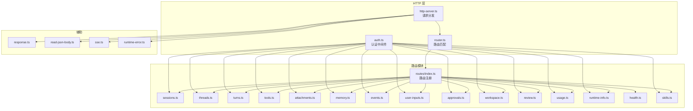
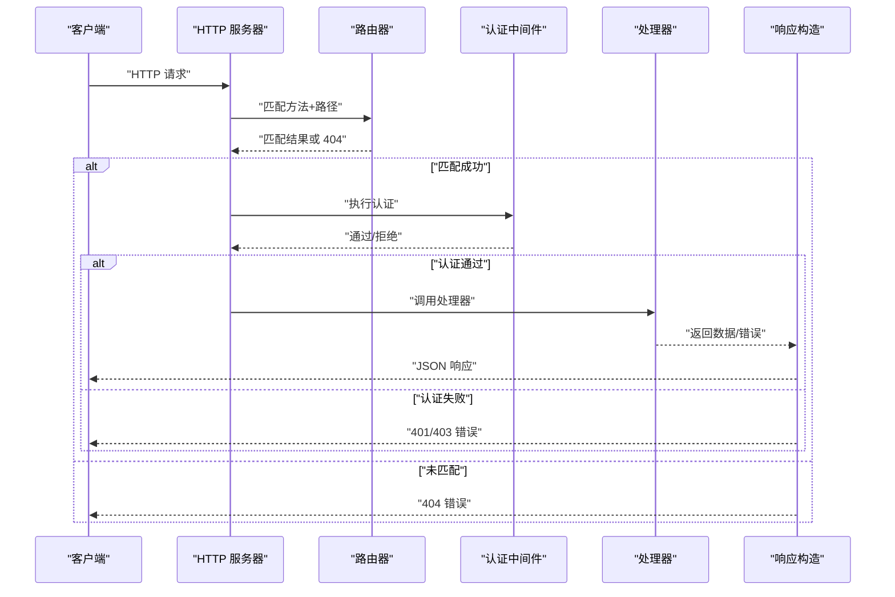
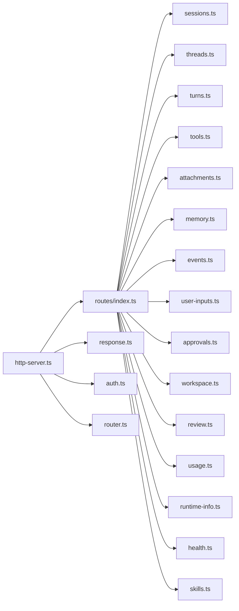

# HTTP API

<cite>
**本文引用的文件**
- [kun/src/server/routes/index.ts](file://kun/src/server/routes/index.ts)
- [kun/src/server/http-server.ts](file://kun/src/server/http-server.ts)
- [kun/src/server/router.ts](file://kun/src/server/router.ts)
- [kun/src/server/auth.ts](file://kun/src/server/auth.ts)
- [kun/src/server/routes/sessions.ts](file://kun/src/server/routes/sessions.ts)
- [kun/src/server/routes/threads.ts](file://kun/src/server/routes/threads.ts)
- [kun/src/server/routes/turns.ts](file://kun/src/server/routes/turns.ts)
- [kun/src/server/routes/tools.ts](file://kun/src/server/routes/tools.ts)
- [kun/src/server/routes/attachments.ts](file://kun/src/server/routes/attachments.ts)
- [kun/src/server/routes/memory.ts](file://kun/src/server/routes/memory.ts)
- [kun/src/server/routes/events.ts](file://kun/src/server/routes/events.ts)
- [kun/src/server/routes/user-inputs.ts](file://kun/src/server/routes/user-inputs.ts)
- [kun/src/server/routes/approvals.ts](file://kun/src/server/routes/approvals.ts)
- [kun/src/server/routes/workspace.ts](file://kun/src/server/routes/workspace.ts)
- [kun/src/server/routes/review.ts](file://kun/src/server/routes/review.ts)
- [kun/src/server/routes/usage.ts](file://kun/src/server/routes/usage.ts)
- [kun/src/server/routes/runtime-info.ts](file://kun/src/server/routes/runtime-info.ts)
- [kun/src/server/routes/health.ts](file://kun/src/server/routes/health.ts)
- [kun/src/server/routes/server-runtime.ts](file://kun/src/server/routes/server-runtime.ts)
- [kun/src/server/routes/skills.ts](file://kun/src/server/routes/skills.ts)
- [kun/src/server/response.ts](file://kun/src/server/response.ts)
- [kun/src/server/read-json-body.ts](file://kun/src/server/read-json-body.ts)
- [kun/src/server/sse.ts](file://kun/src/server/sse.ts)
- [kun/src/server/routes/runtime-error.ts](file://kun/src/server/routes/runtime-error.ts)
- [kun/src/shared/kun-endpoints.ts](file://kun/src/shared/kun-endpoints.ts)
</cite>

## 目录
1. [简介](#简介)
2. [项目结构](#项目结构)
3. [核心组件](#核心组件)
4. [架构总览](#架构总览)
5. [详细组件分析](#详细组件分析)
6. [依赖关系分析](#依赖关系分析)
7. [性能考量](#性能考量)
8. [故障排查指南](#故障排查指南)
9. [结论](#结论)
10. [附录](#附录)

## 简介
本文件系统性梳理 DeepSeek GUI 的 HTTP API，覆盖会话管理、线程与回合、工具、附件、内存、事件、用户输入、审批、工作空间、代码审查、使用统计、运行时信息、健康检查等端点。文档提供每个端点的 HTTP 方法、URL 模式、请求/响应要点、认证方式、状态码说明，并给出请求/响应示例、错误处理策略、安全考虑、速率限制与版本管理建议。

## 项目结构
后端采用基于路由器的模块化设计，路由在统一入口集中注册，HTTP 分发器负责匹配路径与方法并调用对应处理器。认证中间件贯穿多数端点，部分公开端点（如健康检查）无需认证。

图表来源
- [kun/src/server/http-server.ts:1-27](file://kun/src/server/http-server.ts#L1-L27)
- [kun/src/server/router.ts](file://kun/src/server/router.ts)
- [kun/src/server/auth.ts](file://kun/src/server/auth.ts)
- [kun/src/server/routes/index.ts:47-78](file://kun/src/server/routes/index.ts#L47-L78)

章节来源
- [kun/src/server/routes/index.ts:47-78](file://kun/src/server/routes/index.ts#L47-L78)
- [kun/src/server/http-server.ts:1-27](file://kun/src/server/http-server.ts#L1-L27)

## 核心组件
- 路由注册与版本：统一在路由索引中声明所有端点，采用 v1 前缀进行版本化管理。
- 认证策略：除健康检查外，其余端点均需通过认证中间件；认证实现位于认证模块。
- 请求分发：HTTP 服务器根据方法与路径匹配路由，调用处理器并返回标准 JSON 响应。
- 错误处理：统一的错误响应格式与状态码映射，便于客户端一致处理。
- SSE 与流式输出：支持事件推送与流式响应，用于实时通知与长连接场景。

章节来源
- [kun/src/server/routes/index.ts:47-78](file://kun/src/server/routes/index.ts#L47-L78)
- [kun/src/server/auth.ts](file://kun/src/server/auth.ts)
- [kun/src/server/http-server.ts:1-27](file://kun/src/server/http-server.ts#L1-L27)
- [kun/src/server/response.ts](file://kun/src/server/response.ts)

## 架构总览
下图展示从客户端到各路由模块的典型调用链，以及认证与错误处理的横切关注点。

图表来源
- [kun/src/server/http-server.ts:17-26](file://kun/src/server/http-server.ts#L17-L26)
- [kun/src/server/auth.ts](file://kun/src/server/auth.ts)
- [kun/src/server/response.ts](file://kun/src/server/response.ts)

## 详细组件分析

### 健康检查 /health
- 方法与路径
  - GET /health
- 认证
  - 无需认证
- 成功响应
  - 200 OK，返回服务健康状态
- 错误响应
  - 5xx：内部错误
- 示例
  - 请求：GET /health
  - 响应：200，内容包含健康状态字段
- 安全与速率限制
  - 可作为监控端点，建议限制频率以防止探测攻击

章节来源
- [kun/src/server/routes/health.ts](file://kun/src/server/routes/health.ts)

### 运行时信息 /v1/runtime-info
- 方法与路径
  - GET /v1/runtime-info
- 认证
  - 需要认证
- 成功响应
  - 200 OK，返回运行时配置与能力信息
- 错误响应
  - 401/403：未授权或权限不足
  - 5xx：内部错误
- 示例
  - 请求：GET /v1/runtime-info
  - 响应：200，包含运行时元数据
- 安全与速率限制
  - 仅内部使用，建议白名单访问

章节来源
- [kun/src/server/routes/runtime-info.ts](file://kun/src/server/routes/runtime-info.ts)

### 技能列表 /v1/skills
- 方法与路径
  - GET /v1/skills
- 认证
  - 需要认证
- 成功响应
  - 200 OK，返回可用技能清单
- 错误响应
  - 401/403：未授权
  - 5xx：内部错误
- 示例
  - 请求：GET /v1/skills
  - 响应：200，技能数组
- 安全与速率限制
  - 建议限制查询频率

章节来源
- [kun/src/server/routes/skills.ts](file://kun/src/server/routes/skills.ts)

### 附件管理 /v1/attachments
- 方法与路径
  - POST /v1/attachments
  - GET /v1/attachments/diagnostics
  - GET /v1/attachments/{id}
  - GET /v1/attachments/{id}/content
- 认证
  - 需要认证
- 成功响应
  - 上传：201 Created，返回附件元数据
  - 诊断：200 OK，返回存储与索引状态
  - 获取详情：200 OK，返回附件信息
  - 获取内容：200 OK 或 302/304（重定向/未修改）
- 错误响应
  - 400：参数无效或文件不合法
  - 401/403：未授权
  - 404：附件不存在
  - 5xx：内部错误
- 示例
  - 上传：POST /v1/attachments，表单数据含文件与元数据
  - 获取：GET /v1/attachments/{id}
  - 下载：GET /v1/attachments/{id}/content
- 安全与速率限制
  - 文件大小限制、类型白名单、防暴力上传
- 版本管理
  - v1

章节来源
- [kun/src/server/routes/attachments.ts](file://kun/src/server/routes/attachments.ts)

### 内存操作 /v1/memory
- 方法与路径
  - GET /v1/memory
  - POST /v1/memory
  - PATCH /v1/memory/{id}
  - DELETE /v1/memory/{id}
  - GET /v1/memory/diagnostics
- 认证
  - 需要认证
- 成功响应
  - 列表：200 OK，返回内存条目数组
  - 创建：201 Created，返回新条目
  - 更新：200 OK，返回更新后的条目
  - 删除：204 No Content
  - 诊断：200 OK，返回内存状态
- 错误响应
  - 400：参数无效
  - 401/403：未授权
  - 404：条目不存在
  - 5xx：内部错误
- 示例
  - 新增：POST /v1/memory，JSON 负载
  - 查询：GET /v1/memory
  - 更新：PATCH /v1/memory/{id}，JSON 负载
  - 删除：DELETE /v1/memory/{id}
- 安全与速率限制
  - 敏感内容脱敏、访问控制、写入频率限制

章节来源
- [kun/src/server/routes/memory.ts](file://kun/src/server/routes/memory.ts)

### 工作空间 /v1/workspace
- 方法与路径
  - GET /v1/workspace/status
- 认证
  - 需要认证
- 成功响应
  - 200 OK，返回工作空间状态与配置
- 错误响应
  - 401/403：未授权
  - 5xx：内部错误
- 示例
  - 请求：GET /v1/workspace/status
  - 响应：200，状态对象
- 安全与速率限制
  - 仅内部使用，建议白名单

章节来源
- [kun/src/server/routes/workspace.ts](file://kun/src/server/routes/workspace.ts)

### 会话管理 /v1/sessions
- 方法与路径
  - GET /v1/sessions
  - GET /v1/sessions/{id}
  - POST /v1/sessions
  - PATCH /v1/sessions/{id}
  - DELETE /v1/sessions/{id}
  - POST /v1/sessions/{id}/resume-thread
- 认证
  - 需要认证
- 成功响应
  - 列表：200 OK，返回会话数组
  - 创建：201 Created，返回新会话
  - 更新：200 OK，返回更新后的会话
  - 删除：204 No Content
  - 恢复线程：200 OK，返回线程标识
- 错误响应
  - 400：参数无效
  - 401/403：未授权
  - 404：会话不存在
  - 5xx：内部错误
- 示例
  - 创建：POST /v1/sessions，JSON 负载
  - 恢复：POST /v1/sessions/{id}/resume-thread
- 安全与速率限制
  - 会话隔离、访问控制

章节来源
- [kun/src/server/routes/sessions.ts](file://kun/src/server/routes/sessions.ts)

### 线程操作 /v1/threads
- 方法与路径
  - GET /v1/threads
  - POST /v1/threads
  - GET /v1/threads/{id}
  - PATCH /v1/threads/{id}
  - DELETE /v1/threads/{id}
  - POST /v1/threads/{id}/fork
  - GET /v1/threads/{id}/goal
  - POST /v1/threads/{id}/goal
  - DELETE /v1/threads/{id}/goal
  - GET /v1/threads/{id}/todos
  - POST /v1/threads/{id}/todos
  - DELETE /v1/threads/{id}/todos
  - POST /v1/threads/{id}/compact
- 认证
  - 需要认证
- 成功响应
  - 列表：200 OK，返回线程数组
  - 创建：201 Created，返回新线程
  - 更新/删除：200/204
  - 分叉：200 OK，返回新线程标识
  - 目标/待办：200 OK，返回目标/待办集合
  - 合并压缩：200 OK
- 错误响应
  - 400：参数无效
  - 401/403：未授权
  - 404：线程不存在
  - 5xx：内部错误
- 示例
  - 创建：POST /v1/threads，JSON 负载
  - 分叉：POST /v1/threads/{id}/fork
  - 压缩：POST /v1/threads/{id}/compact
- 安全与速率限制
  - 线程所有权校验、批量操作限速

章节来源
- [kun/src/server/routes/threads.ts](file://kun/src/server/routes/threads.ts)

### 回合处理 /v1/threads/{id}/turns
- 方法与路径
  - POST /v1/threads/{id}/turns
  - GET /v1/threads/{id}/turns/{turnId}
  - POST /v1/threads/{id}/turns/{turnId}/steer
  - POST /v1/threads/{id}/turns/{turnId}/interrupt
- 认证
  - 需要认证
- 成功响应
  - 创建回合：201 Created，返回新回合
  - 查询回合：200 OK，返回回合详情
  - 调整：200 OK，返回调整结果
  - 中断：200 OK，返回中断结果
- 错误响应
  - 400：参数无效
  - 401/403：未授权
  - 404：回合不存在
  - 5xx：内部错误
- 示例
  - 创建：POST /v1/threads/{id}/turns
  - 调整：POST /v1/threads/{id}/turns/{turnId}/steer
  - 中断：POST /v1/threads/{id}/turns/{turnId}/interrupt
- 安全与速率限制
  - 回合状态机保护、并发控制

章节来源
- [kun/src/server/routes/turns.ts](file://kun/src/server/routes/turns.ts)

### 事件处理 /v1/threads/{id}/events
- 方法与路径
  - GET /v1/threads/{id}/events
- 认证
  - 需要认证
- 成功响应
  - 200 OK，返回事件流（SSE）
- 错误响应
  - 401/403：未授权
  - 404：线程不存在
  - 5xx：内部错误
- 示例
  - 请求：GET /v1/threads/{id}/events
  - 响应：SSE 流，事件类型与数据
- 安全与速率限制
  - SSE 长连接超时与心跳

章节来源
- [kun/src/server/routes/events.ts](file://kun/src/server/routes/events.ts)
- [kun/src/server/sse.ts](file://kun/src/server/sse.ts)

### 用户输入 /v1/user-inputs
- 方法与路径
  - POST /v1/user-inputs/{id}
  - POST /v1/user-inputs/{id}/ack
- 认证
  - 需要认证
- 成功响应
  - 提交：200 OK，返回确认
  - 确认：200 OK，返回确认结果
- 错误响应
  - 400：参数无效
  - 401/403：未授权
  - 404：输入不存在
  - 5xx：内部错误
- 示例
  - 提交：POST /v1/user-inputs/{id}
  - 确认：POST /v1/user-inputs/{id}/ack
- 安全与速率限制
  - 输入验证、去重与限流

章节来源
- [kun/src/server/routes/user-inputs.ts](file://kun/src/server/routes/user-inputs.ts)

### 审批流程 /v1/approvals
- 方法与路径
  - POST /v1/approvals/{id}
- 认证
  - 需要认证
- 成功响应
  - 200 OK，返回审批结果
- 错误响应
  - 400：参数无效
  - 401/403：未授权
  - 404：审批不存在
  - 5xx：内部错误
- 示例
  - 请求：POST /v1/approvals/{id}
  - 响应：200，审批状态
- 安全与速率限制
  - 审批权限控制、审计日志

章节来源
- [kun/src/server/routes/approvals.ts](file://kun/src/server/routes/approvals.ts)

### 工具调用 /v1/runtime/tools
- 方法与路径
  - GET /v1/runtime/tools
- 认证
  - 需要认证
- 成功响应
  - 200 OK，返回可用工具清单
- 错误响应
  - 401/403：未授权
  - 5xx：内部错误
- 示例
  - 请求：GET /v1/runtime/tools
  - 响应：200，工具数组
- 安全与速率限制
  - 工具调用鉴权与配额

章节来源
- [kun/src/server/routes/tools.ts](file://kun/src/server/routes/tools.ts)

### 代码审查 /v1/threads/{id}/review
- 方法与路径
  - POST /v1/threads/{id}/review
- 认证
  - 需要认证
- 成功响应
  - 200 OK，返回审查结果
- 错误响应
  - 400：参数无效
  - 401/403：未授权
  - 404：线程不存在
  - 5xx：内部错误
- 示例
  - 请求：POST /v1/threads/{id}/review
  - 响应：200，审查报告
- 安全与速率限制
  - 审查范围与敏感信息脱敏

章节来源
- [kun/src/server/routes/review.ts](file://kun/src/server/routes/review.ts)

### 使用统计 /v1/usage
- 方法与路径
  - GET /v1/usage
- 认证
  - 需要认证
- 成功响应
  - 200 OK，返回用量统计
- 错误响应
  - 401/403：未授权
  - 5xx：内部错误
- 示例
  - 请求：GET /v1/usage
  - 响应：200，用量对象
- 安全与速率限制
  - 统计查询限频

章节来源
- [kun/src/server/routes/usage.ts](file://kun/src/server/routes/usage.ts)

### 服务器运行时 /v1/runtime
- 方法与路径
  - GET /v1/runtime/info
  - GET /v1/runtime/tools
- 认证
  - 需要认证
- 成功响应
  - info：200 OK，返回运行时信息
  - tools：200 OK，返回工具清单
- 错误响应
  - 401/403：未授权
  - 5xx：内部错误
- 示例
  - 请求：GET /v1/runtime/info
  - 响应：200，运行时信息
- 安全与速率限制
  - 仅内部使用

章节来源
- [kun/src/server/routes/server-runtime.ts](file://kun/src/server/routes/server-runtime.ts)

## 依赖关系分析
- 路由注册集中于路由索引，统一声明 v1 版本端点，便于版本演进与维护。
- 认证中间件在路由层统一接入，确保安全性与一致性。
- HTTP 分发器与响应构造器解耦，便于扩展与测试。
- SSE 与事件模块独立，支持长连接与实时推送。

图表来源
- [kun/src/server/routes/index.ts:47-78](file://kun/src/server/routes/index.ts#L47-L78)
- [kun/src/server/http-server.ts:1-27](file://kun/src/server/http-server.ts#L1-L27)

章节来源
- [kun/src/server/routes/index.ts:47-78](file://kun/src/server/routes/index.ts#L47-L78)
- [kun/src/server/http-server.ts:1-27](file://kun/src/server/http-server.ts#L1-L27)

## 性能考量
- 路由匹配与请求分发采用轻量实现，避免额外开销。
- 大文件上传建议使用流式处理与分块传输，结合存储后端优化。
- SSE 长连接需设置合理的超时与心跳策略，防止资源泄漏。
- 对高频查询端点（如 /v1/usage、/v1/threads）实施缓存与限频。
- 工具调用与代码审查可能产生高计算负载，建议异步化与队列化。

## 故障排查指南
- 通用错误
  - 404：路径或资源不存在，检查 URL 与版本前缀。
  - 400：请求体或参数无效，核对契约与必填项。
  - 401/403：认证失败或权限不足，检查令牌与权限范围。
  - 5xx：服务器内部错误，查看服务日志与堆栈。
- 典型问题定位
  - SSE 连接异常：确认客户端支持与网络环境，检查服务端心跳与超时配置。
  - 附件上传失败：检查文件大小、类型白名单与磁盘配额。
  - 线程/回合状态异常：核对状态机转换逻辑与幂等性。
- 错误响应格式
  - 统一采用 JSON，包含错误码与消息字段，便于自动化处理。

章节来源
- [kun/src/server/routes/runtime-error.ts](file://kun/src/server/routes/runtime-error.ts)
- [kun/src/server/http-server.ts:17-26](file://kun/src/server/http-server.ts#L17-L26)

## 结论
本 API 以 v1 版本为核心，围绕会话、线程、回合、工具、附件、内存、事件、用户输入、审批、工作空间、代码审查、使用统计与运行时信息构建了完整的对话式智能体交互体系。通过统一的认证与错误处理机制，保证了安全性与可维护性。建议在生产环境中配合限流、缓存与审计策略，持续优化性能与稳定性。

## 附录
- 版本管理
  - 当前版本：v1
  - 升级策略：向后兼容优先，新增端点以新路径暴露，旧版端点保留过渡期
- 速率限制
  - 建议：基于 IP/用户维度设置 QPS 与突发限额，对上传与高成本操作单独限流
- 安全建议
  - 强制 HTTPS、最小权限原则、输入验证与输出编码、敏感字段脱敏
- 常用端点一览
  - 健康检查：GET /health
  - 运行时信息：GET /v1/runtime-info
  - 技能列表：GET /v1/skills
  - 附件：POST/GET/DELETE /v1/attachments*
  - 内存：GET/POST/PATCH/DELETE /v1/memory*
  - 工作空间：GET /v1/workspace/status
  - 会话：GET/POST/PATCH/DELETE /v1/sessions*
  - 线程：GET/POST/PATCH/DELETE /v1/threads*，含 fork、goal、todos、compact
  - 回合：POST/GET/PATCH /v1/threads/{id}/turns*
  - 事件：GET /v1/threads/{id}/events
  - 用户输入：POST/POST .../ack /v1/user-inputs*
  - 审批：POST /v1/approvals/{id}
  - 工具：GET /v1/runtime/tools
  - 审查：POST /v1/threads/{id}/review
  - 使用统计：GET /v1/usage