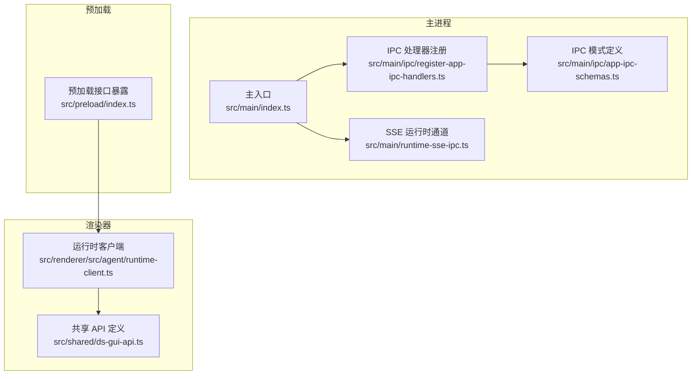
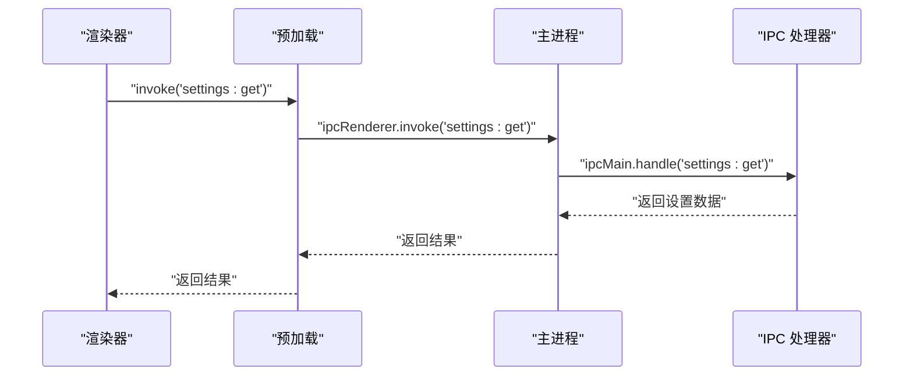
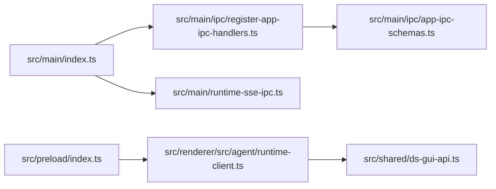

# IPC 通信

<cite>
**本文引用的文件**
- [src/main/ipc/app-ipc-schemas.ts](file://src/main/ipc/app-ipc-schemas.ts)
- [src/main/ipc/register-app-ipc-handlers.ts](file://src/main/ipc/register-app-ipc-handlers.ts)
- [src/main/index.ts](file://src/main/index.ts)
- [src/preload/index.ts](file://src/preload/index.ts)
- [src/renderer/src/agent/runtime-client.ts](file://src/renderer/src/agent/runtime-client.ts)
- [src/main/runtime-sse-ipc.ts](file://src/main/runtime-sse-ipc.ts)
- [src/shared/ds-gui-api.ts](file://src/shared/ds-gui-api.ts)
- [src/main/ipc/app-ipc-schemas.test.ts](file://src/main/ipc/app-ipc-schemas.test.ts)
- [src/main/ipc/register-app-ipc-handlers.test.ts](file://src/main/ipc/register-app-ipc-handlers.test.ts)
</cite>

## 目录
1. [简介](#简介)
2. [项目结构](#项目结构)
3. [核心组件](#核心组件)
4. [架构总览](#架构总览)
5. [详细组件分析](#详细组件分析)
6. [依赖关系分析](#依赖关系分析)
7. [性能考量](#性能考量)
8. [故障排除指南](#故障排除指南)
9. [结论](#结论)
10. [附录](#附录)

## 简介
本文件系统性梳理 DeepSeek GUI 的 IPC（进程间通信）体系，覆盖主进程与渲染器进程之间的消息通道、数据传输格式、协议约定、错误处理与状态管理，并提供主/渲染两端的使用示例路径与最佳实践。IPC 覆盖应用生命周期管理、运行时控制、设置存储、上游模型查询、工作区与文件操作、工具调用等关键功能。

## 项目结构
DeepSeek GUI 的 IPC 相关代码主要分布在以下位置：
- 主进程 IPC 注册与模式定义：src/main/ipc/
- 主进程入口中注册 IPC 处理器与 SSE 运行时通道：src/main/index.ts、src/main/runtime-sse-ipc.ts
- 预加载脚本暴露安全的 IPC 接口给渲染器：src/preload/index.ts
- 渲染器侧运行时客户端封装 IPC 调用：src/renderer/src/agent/runtime-client.ts
- 共享 API 定义：src/shared/ds-gui-api.ts

图表来源
- [src/main/index.ts](file://src/main/index.ts)
- [src/main/ipc/register-app-ipc-handlers.ts](file://src/main/ipc/register-app-ipc-handlers.ts)
- [src/main/ipc/app-ipc-schemas.ts](file://src/main/ipc/app-ipc-schemas.ts)
- [src/main/runtime-sse-ipc.ts](file://src/main/runtime-sse-ipc.ts)
- [src/preload/index.ts](file://src/preload/index.ts)
- [src/renderer/src/agent/runtime-client.ts](file://src/renderer/src/agent/runtime-client.ts)
- [src/shared/ds-gui-api.ts](file://src/shared/ds-gui-api.ts)

章节来源
- [src/main/index.ts](file://src/main/index.ts)
- [src/main/ipc/register-app-ipc-handlers.ts](file://src/main/ipc/register-app-ipc-handlers.ts)
- [src/main/ipc/app-ipc-schemas.ts](file://src/main/ipc/app-ipc-schemas.ts)
- [src/main/runtime-sse-ipc.ts](file://src/main/runtime-sse-ipc.ts)
- [src/preload/index.ts](file://src/preload/index.ts)
- [src/renderer/src/agent/runtime-client.ts](file://src/renderer/src/agent/runtime-client.ts)
- [src/shared/ds-gui-api.ts](file://src/shared/ds-gui-api.ts)

## 核心组件
- IPC 模式与类型定义：集中于 app-ipc-schemas.ts，定义了请求/响应结构、错误码与参数约束，确保主/渲染两端对消息格式达成一致。
- IPC 处理器注册：register-app-ipc-handlers.ts 将 ipcMain.handle 与 ipcRenderer.invoke 绑定，实现具体业务逻辑路由。
- 主入口集成：index.ts 在应用启动阶段完成 IPC 注册与 SSE 运行时通道绑定。
- 预加载桥接：preload/index.ts 仅暴露受控的 IPC 方法到渲染器上下文，避免直接暴露 Electron 原生对象。
- 渲染器运行时客户端：renderer/src/agent/runtime-client.ts 封装 IPC 调用，统一错误处理与返回值格式。
- 共享 API：shared/ds-gui-api.ts 提供跨模块一致的 IPC 接口契约，便于扩展与维护。

章节来源
- [src/main/ipc/app-ipc-schemas.ts](file://src/main/ipc/app-ipc-schemas.ts)
- [src/main/ipc/register-app-ipc-handlers.ts](file://src/main/ipc/register-app-ipc-handlers.ts)
- [src/main/index.ts](file://src/main/index.ts)
- [src/preload/index.ts](file://src/preload/index.ts)
- [src/renderer/src/agent/runtime-client.ts](file://src/renderer/src/agent/runtime-client.ts)
- [src/shared/ds-gui-api.ts](file://src/shared/ds-gui-api.ts)

## 架构总览
主进程通过 ipcMain.handle 暴露同步/异步处理函数；渲染器通过 ipcRenderer.invoke 或预加载暴露的安全接口发起调用；部分运行时事件通过 SSE 通道推送至渲染器。

图表来源
- [src/preload/index.ts](file://src/preload/index.ts)
- [src/main/ipc/register-app-ipc-handlers.ts](file://src/main/ipc/register-app-ipc-handlers.ts)

章节来源
- [src/main/index.ts](file://src/main/index.ts)
- [src/main/ipc/register-app-ipc-handlers.ts](file://src/main/ipc/register-app-ipc-handlers.ts)
- [src/preload/index.ts](file://src/preload/index.ts)

## 详细组件分析

### IPC 模式与类型定义（app-ipc-schemas）
- 职责：定义所有 IPC 请求/响应的结构化模式，包括参数校验、错误码与默认值策略，保证主/渲染两端一致性。
- 关键点：通过集中式模式定义，降低耦合度，便于测试与演进。

章节来源
- [src/main/ipc/app-ipc-schemas.ts](file://src/main/ipc/app-ipc-schemas.ts)

### IPC 处理器注册（register-app-ipc-handlers）
- 应用生命周期与设置
  - 设置读取/写入：通过 ipcMain.handle('settings:get')、('settings:set') 实现配置持久化与更新。
  - 上游模型查询：通过 ipcMain.handle('upstream:models') 返回可用模型列表。
- 运行时控制
  - 运行时请求转发：ipcMain.handle('runtime:request') 将渲染器请求路由到后端运行时。
- 工作区与文件操作
  - 工作区服务：如文件读写、路径解析、编辑器集成等能力通过处理器暴露。
- 工具调用
  - 工具执行与结果聚合：内置工具与外部工具调用通过处理器统一接入。
- 错误处理
  - 所有处理器均返回结构化错误，配合模式定义进行统一校验与上报。

章节来源
- [src/main/ipc/register-app-ipc-handlers.ts](file://src/main/ipc/register-app-ipc-handlers.ts)

### 主入口集成（index.ts）
- 启动阶段注册 IPC 处理器与 SSE 运行时通道，确保应用就绪后即可接收渲染器请求并推送运行时事件。
- 通过 traceStartup 标记关键阶段，便于诊断启动问题。

章节来源
- [src/main/index.ts](file://src/main/index.ts)

### 预加载桥接（preload/index.ts）
- 仅暴露受控的 ipcRenderer.invoke 与 ipcRenderer.on 通道，避免渲染器直接访问 Electron 原生对象。
- 为渲染器提供安全、稳定的 IPC 访问面。

章节来源
- [src/preload/index.ts](file://src/preload/index.ts)

### 渲染器运行时客户端（runtime-client.ts）
- 封装 ipcRenderer.invoke 调用，统一错误处理与重试策略。
- 对外暴露简洁的 API，隐藏底层 IPC 细节，便于上层组件使用。

章节来源
- [src/renderer/src/agent/runtime-client.ts](file://src/renderer/src/agent/runtime-client.ts)

### SSE 运行时通道（runtime-sse-ipc.ts）
- 用于从主进程向渲染器推送实时事件（如运行时状态变更、工具输出流等），补充传统请求-响应模式的不足。
- 与主入口集成，在应用启动时建立连接。

章节来源
- [src/main/runtime-sse-ipc.ts](file://src/main/runtime-sse-ipc.ts)

### 共享 API（ds-gui-api.ts）
- 定义跨模块一致的 IPC 接口契约，确保新增功能时遵循统一规范。
- 与 app-ipc-schemas 协同，保障类型安全与可维护性。

章节来源
- [src/shared/ds-gui-api.ts](file://src/shared/ds-gui-api.ts)

## 依赖关系分析
- 主入口依赖 IPC 注册模块与 SSE 通道模块，负责在应用生命周期早期完成绑定。
- 预加载模块依赖 IPC 处理器注册模块，提供安全的渲染器访问面。
- 渲染器运行时客户端依赖预加载模块与共享 API，形成清晰的调用链。
- 测试文件覆盖 IPC 模式与处理器注册，验证行为正确性与边界条件。

图表来源
- [src/main/index.ts](file://src/main/index.ts)
- [src/main/ipc/register-app-ipc-handlers.ts](file://src/main/ipc/register-app-ipc-handlers.ts)
- [src/main/ipc/app-ipc-schemas.ts](file://src/main/ipc/app-ipc-schemas.ts)
- [src/main/runtime-sse-ipc.ts](file://src/main/runtime-sse-ipc.ts)
- [src/preload/index.ts](file://src/preload/index.ts)
- [src/renderer/src/agent/runtime-client.ts](file://src/renderer/src/agent/runtime-client.ts)
- [src/shared/ds-gui-api.ts](file://src/shared/ds-gui-api.ts)

章节来源
- [src/main/index.ts](file://src/main/index.ts)
- [src/main/ipc/register-app-ipc-handlers.ts](file://src/main/ipc/register-app-ipc-handlers.ts)
- [src/main/ipc/app-ipc-schemas.ts](file://src/main/ipc/app-ipc-schemas.ts)
- [src/main/runtime-sse-ipc.ts](file://src/main/runtime-sse-ipc.ts)
- [src/preload/index.ts](file://src/preload/index.ts)
- [src/renderer/src/agent/runtime-client.ts](file://src/renderer/src/agent/runtime-client.ts)
- [src/shared/ds-gui-api.ts](file://src/shared/ds-gui-api.ts)

## 性能考量
- 减少不必要的 IPC 往返：合并请求或使用 SSE 推送批量事件，降低主线程阻塞风险。
- 控制消息大小：避免在 IPC 中传输大体积数据，必要时采用临时文件或流式传输。
- 异步处理优先：将耗时任务放入 ipcMain.handle 的异步实现，避免阻塞主循环。
- 缓存与去抖：对频繁查询（如设置读取、模型列表）进行缓存与去抖，减少重复计算。
- 错误快速失败：在预加载层尽早校验输入，避免无效请求进入主进程处理链。

## 故障排除指南
- 无法收到响应
  - 检查预加载是否正确暴露对应通道，以及渲染器是否使用正确的通道名。
  - 确认主进程已注册对应 ipcMain.handle。
- 类型不匹配
  - 对照 app-ipc-schemas 的模式定义，核对请求/响应字段与类型。
- SSE 未推送
  - 确认主入口已调用 runtime-sse-ipc 的初始化逻辑，且运行时事件已正确触发。
- 权限与安全
  - 避免在渲染器直接访问 Electron 原生对象，确保仅通过预加载暴露的接口访问。
- 单元测试辅助
  - 参考 register-app-ipc-handlers.test.ts 与 app-ipc-schemas.test.ts 的断言方式，定位问题范围。

章节来源
- [src/main/ipc/register-app-ipc-handlers.test.ts](file://src/main/ipc/register-app-ipc-handlers.test.ts)
- [src/main/ipc/app-ipc-schemas.test.ts](file://src/main/ipc/app-ipc-schemas.test.ts)

## 结论
DeepSeek GUI 的 IPC 体系以集中式模式定义与处理器注册为核心，结合预加载桥接与 SSE 通道，实现了安全、可维护、高性能的主/渲染通信。通过共享 API 与严格的测试覆盖，系统具备良好的扩展性与稳定性。

## 附录

### IPC 通道清单与用途概览
- settings:get / settings:set：读取/写入应用设置
- upstream:models：获取上游模型列表
- runtime:request：转发渲染器运行时请求
- 其他通道：工作区与文件操作、工具调用等（详见处理器注册文件）

章节来源
- [src/main/ipc/register-app-ipc-handlers.ts](file://src/main/ipc/register-app-ipc-handlers.ts)

### 主进程使用示例（注册处理器）
- 在主入口中完成注册与 SSE 初始化，确保应用启动即可用。
- 示例路径参考：
  - [src/main/index.ts](file://src/main/index.ts)

章节来源
- [src/main/index.ts](file://src/main/index.ts)

### 渲染器使用示例（发送消息、接收响应）
- 通过预加载暴露的安全接口发起调用，等待响应并处理错误。
- 示例路径参考：
  - [src/preload/index.ts](file://src/preload/index.ts)
  - [src/renderer/src/agent/runtime-client.ts](file://src/renderer/src/agent/runtime-client.ts)

章节来源
- [src/preload/index.ts](file://src/preload/index.ts)
- [src/renderer/src/agent/runtime-client.ts](file://src/renderer/src/agent/runtime-client.ts)

### 数据传输格式与协议要点
- 请求/响应结构：严格遵循 app-ipc-schemas 定义的模式，包含必填字段、可选字段与默认值。
- 错误格式：统一返回结构化错误，包含错误码与描述，便于前端展示与日志追踪。
- 协议约定：使用 ipcRenderer.invoke 与 ipcMain.handle 进行请求-响应；SSE 用于事件推送。

章节来源
- [src/main/ipc/app-ipc-schemas.ts](file://src/main/ipc/app-ipc-schemas.ts)
- [src/main/ipc/register-app-ipc-handlers.ts](file://src/main/ipc/register-app-ipc-handlers.ts)
- [src/main/runtime-sse-ipc.ts](file://src/main/runtime-sse-ipc.ts)