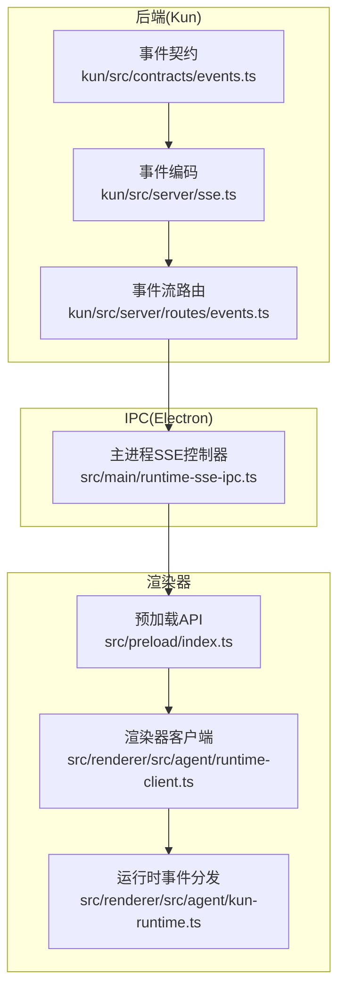
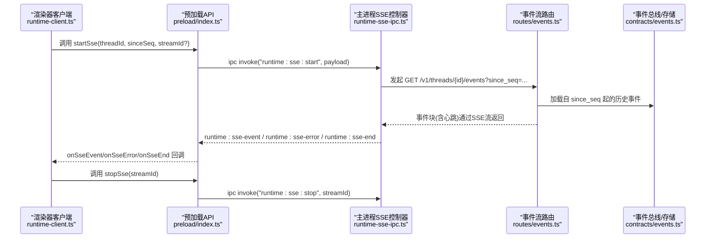
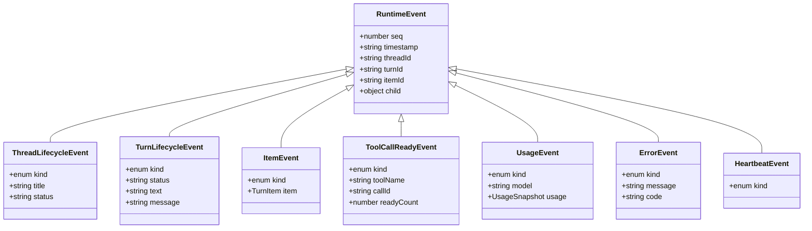
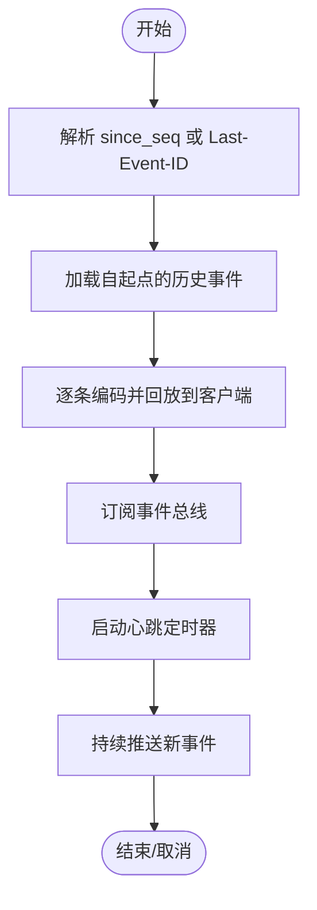
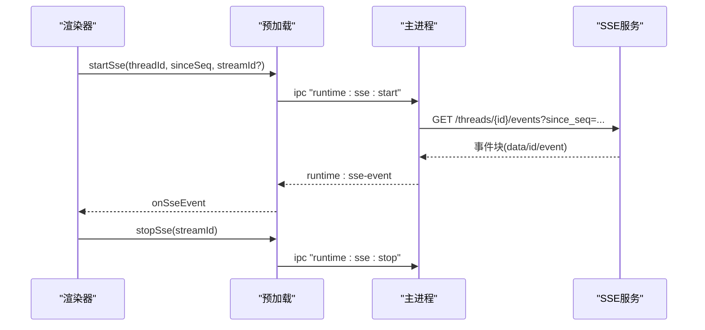
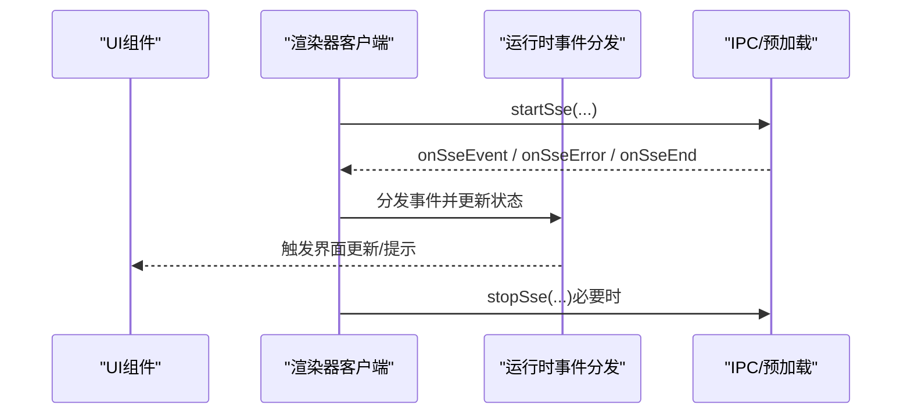
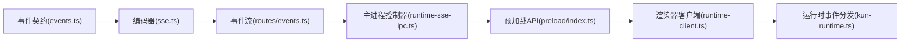

# SSE 推送

<cite>
**本文引用的文件**
- [kun/src/server/sse.ts](file://kun/src/server/sse.ts)
- [kun/src/server/routes/events.ts](file://kun/src/server/routes/events.ts)
- [kun/src/contracts/events.ts](file://kun/src/contracts/events.ts)
- [src/main/runtime-sse-ipc.ts](file://src/main/runtime-sse-ipc.ts)
- [src/preload/index.ts](file://src/preload/index.ts)
- [src/renderer/src/agent/runtime-client.ts](file://src/renderer/src/agent/runtime-client.ts)
- [src/renderer/src/agent/kun-runtime.ts](file://src/renderer/src/agent/kun-runtime.ts)
</cite>

## 目录
1. [简介](#简介)
2. [项目结构](#项目结构)
3. [核心组件](#核心组件)
4. [架构总览](#架构总览)
5. [详细组件分析](#详细组件分析)
6. [依赖关系分析](#依赖关系分析)
7. [性能考量](#性能考量)
8. [故障排查指南](#故障排查指南)
9. [结论](#结论)
10. [附录](#附录)

## 简介
本文件系统性阐述 DeepSeek GUI 的服务器推送事件（Server-Sent Events, SSE）推送体系，覆盖服务端事件编码与流式输出、客户端连接与事件监听、事件类型与数据模型、连接管理与重连策略、错误恢复与监控方法，并提供面向浏览器或 Electron 渲染进程的客户端实现要点与最佳实践。

## 项目结构
SSE 相关能力横跨后端（Kun 运行时服务）、IPC 层（Electron 主进程到渲染进程桥接）、预加载脚本（安全暴露 API）与渲染器客户端（事件消费与 UI 响应）。核心路径如下：
- 后端事件编码与路由：kun/src/server/sse.ts、kun/src/server/routes/events.ts
- 事件契约与类型：kun/src/contracts/events.ts
- IPC 层 SSE 控制与解析：src/main/runtime-sse-ipc.ts
- 预加载 API 暴露：src/preload/index.ts
- 渲染器客户端封装与事件分发：src/renderer/src/agent/runtime-client.ts、src/renderer/src/agent/kun-runtime.ts

图表来源
- [kun/src/server/sse.ts:1-6](file://kun/src/server/sse.ts#L1-L6)
- [kun/src/server/routes/events.ts:16-104](file://kun/src/server/routes/events.ts#L16-L104)
- [kun/src/contracts/events.ts:10-249](file://kun/src/contracts/events.ts#L10-L249)
- [src/main/runtime-sse-ipc.ts:133-257](file://src/main/runtime-sse-ipc.ts#L133-L257)
- [src/preload/index.ts:89-115](file://src/preload/index.ts#L89-L115)
- [src/renderer/src/agent/runtime-client.ts:49-67](file://src/renderer/src/agent/runtime-client.ts#L49-L67)
- [src/renderer/src/agent/kun-runtime.ts:730-768](file://src/renderer/src/agent/kun-runtime.ts#L730-L768)

章节来源
- [kun/src/server/sse.ts:1-6](file://kun/src/server/sse.ts#L1-L6)
- [kun/src/server/routes/events.ts:16-104](file://kun/src/server/routes/events.ts#L16-L104)
- [kun/src/contracts/events.ts:10-249](file://kun/src/contracts/events.ts#L10-L249)
- [src/main/runtime-sse-ipc.ts:133-257](file://src/main/runtime-sse-ipc.ts#L133-L257)
- [src/preload/index.ts:89-115](file://src/preload/index.ts#L89-L115)
- [src/renderer/src/agent/runtime-client.ts:49-67](file://src/renderer/src/agent/runtime-client.ts#L49-L67)
- [src/renderer/src/agent/kun-runtime.ts:730-768](file://src/renderer/src/agent/kun-runtime.ts#L730-L768)

## 核心组件
- 事件编码器：将运行时事件对象序列化为标准 SSE 文本块（包含 id、event、data 字段），用于后端流式输出。
- 事件流路由：根据 since_seq 或 Last-Event-ID 回放历史事件，订阅事件总线并持续推送新事件，同时周期性发送心跳。
- 事件契约：定义所有可被推送的事件类型及其字段，确保前后端一致的数据结构。
- IPC 控制器：在主进程中发起 SSE 请求、解析 SSE 块、维护断线重连与停止控制。
- 预加载 API：在渲染进程中安全暴露 start/stop 事件监听与事件回调。
- 渲染器客户端：封装 startSse/stopSse/onSse* 回调，驱动 UI 更新与错误处理。
- 运行时事件分发：在渲染器侧将事件转换为 UI 可感知的状态变化与交互。

章节来源
- [kun/src/server/sse.ts:3-5](file://kun/src/server/sse.ts#L3-L5)
- [kun/src/server/routes/events.ts:16-104](file://kun/src/server/routes/events.ts#L16-L104)
- [kun/src/contracts/events.ts:10-249](file://kun/src/contracts/events.ts#L10-L249)
- [src/main/runtime-sse-ipc.ts:133-257](file://src/main/runtime-sse-ipc.ts#L133-L257)
- [src/preload/index.ts:89-115](file://src/preload/index.ts#L89-L115)
- [src/renderer/src/agent/runtime-client.ts:49-67](file://src/renderer/src/agent/runtime-client.ts#L49-L67)
- [src/renderer/src/agent/kun-runtime.ts:730-768](file://src/renderer/src/agent/kun-runtime.ts#L730-L768)

## 架构总览
下图展示从后端事件生成到渲染器消费的完整链路，包括回放、实时推送、心跳与错误传播。

图表来源
- [src/renderer/src/agent/runtime-client.ts:49-67](file://src/renderer/src/agent/runtime-client.ts#L49-L67)
- [src/preload/index.ts:89-115](file://src/preload/index.ts#L89-L115)
- [src/main/runtime-sse-ipc.ts:133-257](file://src/main/runtime-sse-ipc.ts#L133-L257)
- [kun/src/server/routes/events.ts:16-104](file://kun/src/server/routes/events.ts#L16-L104)
- [kun/src/contracts/events.ts:10-249](file://kun/src/contracts/events.ts#L10-L249)

## 详细组件分析

### 事件类型与数据模型
- 事件类型枚举：包含会话生命周期、回合生命周期、项级内容增量、工具调用、审批与用户输入、压缩与归并、目标与待办、流水线阶段、用量统计、错误与心跳等。
- 公共字段：每个事件包含全局序号 seq、时间戳 timestamp、threadId、可选 turnId/itemId，以及子运行信息（child）。
- 代表性事件族：
  - 会话：thread_created、thread_updated
  - 回合：turn_started、turn_completed、turn_failed、turn_aborted、turn_steered
  - 项/消息：item_created、item_updated、item_completed、assistant_text_delta、assistant_reasoning_delta、tool_call_started、tool_call_finished
  - 工具：tool_call_ready、tool_result_upload_wait、tool_storm_suppressed、tool_catalog_changed
  - 审批与用户输入：approval_requested、approval_resolved、user_input_requested、user_input_resolved
  - 内存与归并：compaction_started、compaction_completed
  - 目标与待办：goal_updated、goal_cleared、todos_updated、todos_cleared
  - 流水线：pipeline_stage
  - 使用统计：usage
  - 错误与心跳：error、heartbeat

图表来源
- [kun/src/contracts/events.ts:61-75](file://kun/src/contracts/events.ts#L61-L75)
- [kun/src/contracts/events.ts:91-96](file://kun/src/contracts/events.ts#L91-L96)
- [kun/src/contracts/events.ts:98-110](file://kun/src/contracts/events.ts#L98-L110)
- [kun/src/contracts/events.ts:77-89](file://kun/src/contracts/events.ts#L77-L89)
- [kun/src/contracts/events.ts:142-148](file://kun/src/contracts/events.ts#L142-L148)
- [kun/src/contracts/events.ts:200-205](file://kun/src/contracts/events.ts#L200-L205)
- [kun/src/contracts/events.ts:215-225](file://kun/src/contracts/events.ts#L215-L225)

章节来源
- [kun/src/contracts/events.ts:10-44](file://kun/src/contracts/events.ts#L10-L44)
- [kun/src/contracts/events.ts:61-75](file://kun/src/contracts/events.ts#L61-L75)
- [kun/src/contracts/events.ts:91-110](file://kun/src/contracts/events.ts#L91-L110)
- [kun/src/contracts/events.ts:142-148](file://kun/src/contracts/events.ts#L142-L148)
- [kun/src/contracts/events.ts:200-205](file://kun/src/contracts/events.ts#L200-L205)
- [kun/src/contracts/events.ts:215-225](file://kun/src/contracts/events.ts#L215-L225)

### 服务端事件编码与流式输出
- 编码规则：每条事件以 id、event、data 三行组成，末尾双换行作为事件块边界；心跳事件由服务端周期性注入。
- 回放策略：根据查询参数 since_seq 或请求头 Last-Event-ID 计算起点，先回放历史事件，再订阅实时事件。
- 心跳机制：固定间隔发送空事件，用于保活与检测连接健康。

图表来源
- [kun/src/server/routes/events.ts:23-26](file://kun/src/server/routes/events.ts#L23-L26)
- [kun/src/server/routes/events.ts:49-52](file://kun/src/server/routes/events.ts#L49-L52)
- [kun/src/server/routes/events.ts:53-60](file://kun/src/server/routes/events.ts#L53-L60)
- [kun/src/server/routes/events.ts:61-77](file://kun/src/server/routes/events.ts#L61-L77)
- [kun/src/server/sse.ts:3-5](file://kun/src/server/sse.ts#L3-L5)

章节来源
- [kun/src/server/routes/events.ts:16-104](file://kun/src/server/routes/events.ts#L16-L104)
- [kun/src/server/sse.ts:3-5](file://kun/src/server/sse.ts#L3-L5)

### 客户端连接与事件监听（Electron）
- 连接建立：渲染器通过预加载 API 调用 startSse，主进程发起 fetch 并读取 SSE 流。
- 断线重连：主进程基于指数退避策略自动重试，遇到致命状态码（4xx 非 408/429）直接终止。
- 事件解析：按块解析 SSE 数据，补齐缺失的 kind/seq 字段，向渲染器发送 runtime:sse-event。
- 停止控制：支持主动 stopSse，或在异常/结束时自动清理。

图表来源
- [src/preload/index.ts:89-115](file://src/preload/index.ts#L89-L115)
- [src/main/runtime-sse-ipc.ts:133-257](file://src/main/runtime-sse-ipc.ts#L133-L257)

章节来源
- [src/preload/index.ts:89-115](file://src/preload/index.ts#L89-L115)
- [src/main/runtime-sse-ipc.ts:133-257](file://src/main/runtime-sse-ipc.ts#L133-L257)

### 渲染器事件消费与 UI 响应
- 渲染器客户端封装：提供 startSse/stopSse/onSse* 回调，统一错误与结束处理。
- 事件分发：在运行时中根据事件类型更新 UI、触发审批流程或工具调用。
- 中止与清理：当信号中止或收到结束事件时，停止 SSE 并清理资源。

图表来源
- [src/renderer/src/agent/runtime-client.ts:49-67](file://src/renderer/src/agent/runtime-client.ts#L49-L67)
- [src/renderer/src/agent/kun-runtime.ts:730-768](file://src/renderer/src/agent/kun-runtime.ts#L730-L768)
- [src/preload/index.ts:89-115](file://src/preload/index.ts#L89-L115)

章节来源
- [src/renderer/src/agent/runtime-client.ts:49-67](file://src/renderer/src/agent/runtime-client.ts#L49-L67)
- [src/renderer/src/agent/kun-runtime.ts:730-768](file://src/renderer/src/agent/kun-runtime.ts#L730-L768)
- [src/preload/index.ts:89-115](file://src/preload/index.ts#L89-L115)

## 依赖关系分析
- 事件契约决定事件编码与路由行为，编码器仅依赖事件类型定义。
- 事件流路由依赖事件总线与会话存储，负责回放与订阅。
- IPC 控制器依赖运行时基础 URL 与鉴权头，负责网络层重连与解析。
- 预加载 API 与渲染器客户端分别位于渲染进程与主进程边界，职责清晰、耦合度低。
- 运行时事件分发在渲染器侧完成业务态转换，避免与 IPC 细节耦合。

图表来源
- [kun/src/contracts/events.ts:10-249](file://kun/src/contracts/events.ts#L10-L249)
- [kun/src/server/sse.ts:3-5](file://kun/src/server/sse.ts#L3-L5)
- [kun/src/server/routes/events.ts:16-104](file://kun/src/server/routes/events.ts#L16-L104)
- [src/main/runtime-sse-ipc.ts:133-257](file://src/main/runtime-sse-ipc.ts#L133-L257)
- [src/preload/index.ts:89-115](file://src/preload/index.ts#L89-L115)
- [src/renderer/src/agent/runtime-client.ts:49-67](file://src/renderer/src/agent/runtime-client.ts#L49-L67)
- [src/renderer/src/agent/kun-runtime.ts:730-768](file://src/renderer/src/agent/kun-runtime.ts#L730-L768)

章节来源
- [kun/src/contracts/events.ts:10-249](file://kun/src/contracts/events.ts#L10-L249)
- [kun/src/server/sse.ts:3-5](file://kun/src/server/sse.ts#L3-L5)
- [kun/src/server/routes/events.ts:16-104](file://kun/src/server/routes/events.ts#L16-L104)
- [src/main/runtime-sse-ipc.ts:133-257](file://src/main/runtime-sse-ipc.ts#L133-L257)
- [src/preload/index.ts:89-115](file://src/preload/index.ts#L89-L115)
- [src/renderer/src/agent/runtime-client.ts:49-67](file://src/renderer/src/agent/runtime-client.ts#L49-L67)
- [src/renderer/src/agent/kun-runtime.ts:730-768](file://src/renderer/src/agent/kun-runtime.ts#L730-L768)

## 性能考量
- 流式解码与缓冲：主进程采用增量解码与块切分，减少内存峰值与解析开销。
- 指数退避重连：避免频繁重试对服务端造成压力，上限保护防止雪崩。
- 心跳保活：定期发送心跳，降低长连接空闲时的资源占用与网络中断检测成本。
- 回放起点优化：优先使用 since_seq，其次 Last-Event-ID，确保最小回放量。
- 序号推进：严格依据事件 seq 推进 nextSinceSeq，避免重复投递与丢失。

章节来源
- [src/main/runtime-sse-ipc.ts:70-84](file://src/main/runtime-sse-ipc.ts#L70-L84)
- [src/main/runtime-sse-ipc.ts:163-190](file://src/main/runtime-sse-ipc.ts#L163-L190)
- [kun/src/server/routes/events.ts:61-77](file://kun/src/server/routes/events.ts#L61-L77)

## 故障排查指南
- 常见错误分类
  - 致命错误：HTTP 4xx（除 408/429）直接终止，需检查认证、权限与线程 ID。
  - 网络/超时：SSE 启动超时或网络异常，触发指数退避重连。
  - 解析失败：SSE 块格式不正确或 JSON 不合法，丢弃该块并继续。
- 日志与监控
  - 主进程记录 SSE 错误与状态，便于定位问题。
  - 心跳事件可用于判断连接健康与延迟。
  - 事件 seq 有助于确认是否出现重复或丢失。
- 重连与恢复
  - 自动重连：指数退避至最大阈值，成功后重置。
  - 手动停止：调用 stopSse 清理控制器，释放资源。
  - 异常处理：onSseError 回调中统一上报与降级。

章节来源
- [src/main/runtime-sse-ipc.ts:100-102](file://src/main/runtime-sse-ipc.ts#L100-L102)
- [src/main/runtime-sse-ipc.ts:176-189](file://src/main/runtime-sse-ipc.ts#L176-L189)
- [src/main/runtime-sse-ipc.ts:224-235](file://src/main/runtime-sse-ipc.ts#L224-L235)
- [kun/src/server/routes/events.ts:61-77](file://kun/src/server/routes/events.ts#L61-L77)

## 结论
本 SSE 推送系统以清晰的事件契约与稳定的流式传输为基础，结合主进程的健壮解析与重连策略、渲染器的事件分发与 UI 响应，实现了从后端到前端的可靠实时交互。通过心跳保活、最小回放与序号推进等机制，兼顾了性能与可靠性；通过 IPC 边界与预加载 API 的隔离，保证了安全性与可维护性。

## 附录

### 事件类型一览与典型用途
- 会话更新：thread_created、thread_updated（会话创建/标题/状态变更）
- 回合状态：turn_started、turn_completed、turn_failed、turn_aborted、turn_steered（对话回合生命周期）
- 文本/推理增量：assistant_text_delta、assistant_reasoning_delta（流式输出）
- 工具调用：tool_call_ready、tool_call_started、tool_call_finished、tool_result_upload_wait、tool_storm_suppressed（工具执行与上传等待）
- 工具目录：tool_catalog_changed（工具清单变更）
- 审批与用户输入：approval_requested、approval_resolved、user_input_requested、user_input_resolved（交互式授权与输入）
- 内存与归并：compaction_started、compaction_completed（上下文压缩）
- 目标与待办：goal_updated、goal_cleared、todos_updated、todos_cleared（目标与任务）
- 流水线阶段：pipeline_stage（内部处理阶段）
- 使用统计：usage（用量快照）
- 错误与心跳：error、heartbeat（错误上报与保活）

章节来源
- [kun/src/contracts/events.ts:10-44](file://kun/src/contracts/events.ts#L10-L44)
- [kun/src/contracts/events.ts:227-244](file://kun/src/contracts/events.ts#L227-L244)

### 客户端实现要点（JavaScript/TypeScript）
- 连接建立
  - 调用 startSse(threadId, sinceSeq, streamId?)，传入线程标识与回放起点。
  - 若未指定 streamId，服务端将分配唯一标识，后续 stopSse 需要该标识。
- 事件监听
  - 注册 onSseEvent 接收事件数据；onSseError 处理网络/服务端错误；onSseEnd 处理连接结束。
  - 在事件回调中根据 kind/seq 更新 UI 与状态机。
- 错误处理与重连
  - onSseError 中区分致命错误与可恢复错误，必要时手动触发重连或提示用户。
  - 对于网络/超时类错误，遵循指数退避策略，避免频繁重试。
- 最佳实践
  - 使用 sinceSeq 与 Last-Event-ID 确保断点续拉。
  - 在 UI 层对增量文本进行累积渲染，避免闪烁。
  - 对工具调用与审批事件及时响应，保障用户体验。
  - 在页面卸载或任务结束时调用 stopSse，释放资源。

章节来源
- [src/renderer/src/agent/runtime-client.ts:49-67](file://src/renderer/src/agent/runtime-client.ts#L49-L67)
- [src/preload/index.ts:89-115](file://src/preload/index.ts#L89-L115)
- [src/renderer/src/agent/kun-runtime.ts:730-768](file://src/renderer/src/agent/kun-runtime.ts#L730-L768)