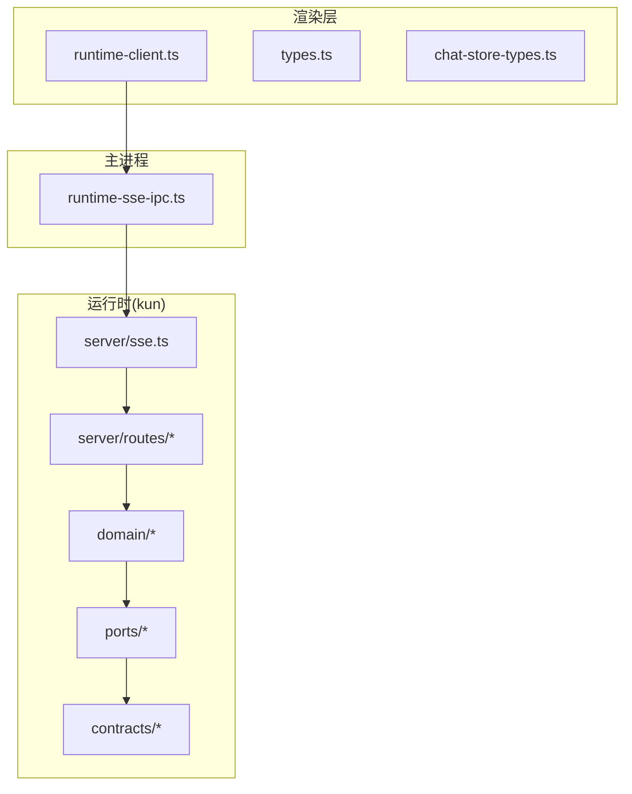
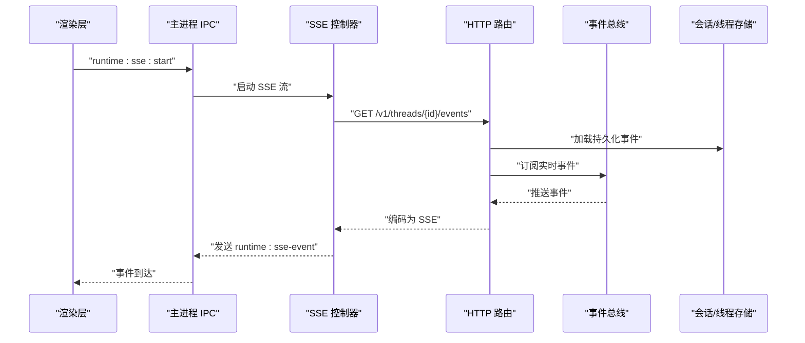
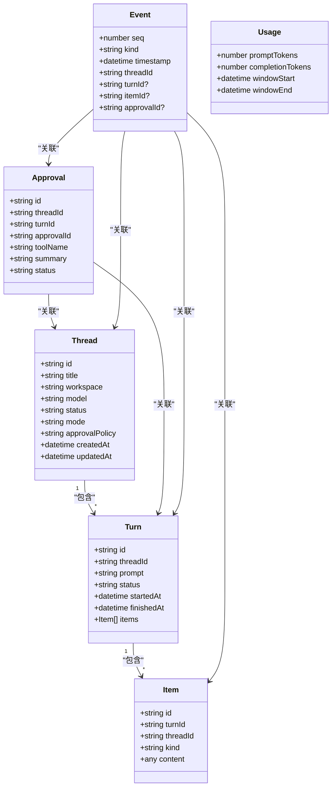
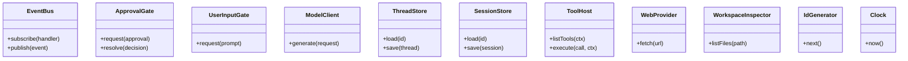
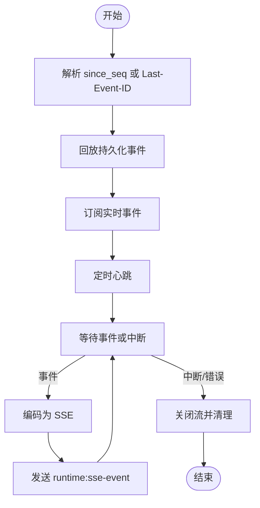
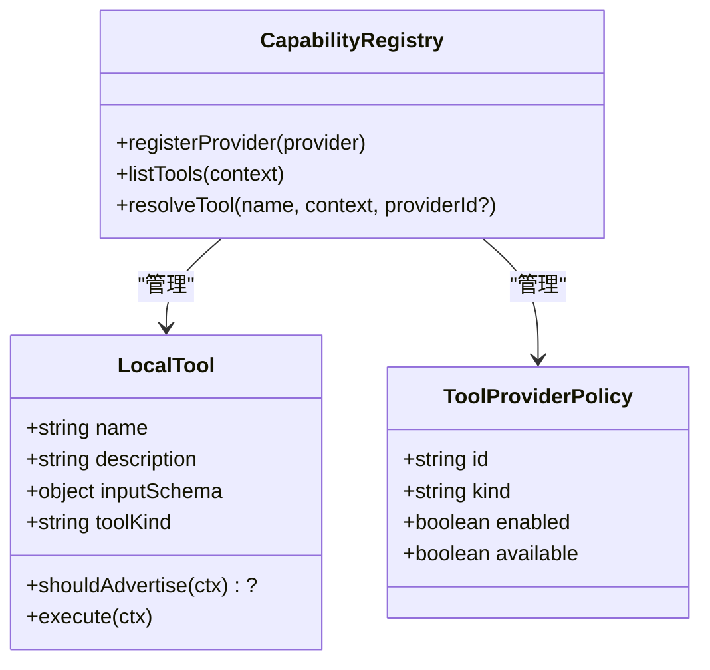
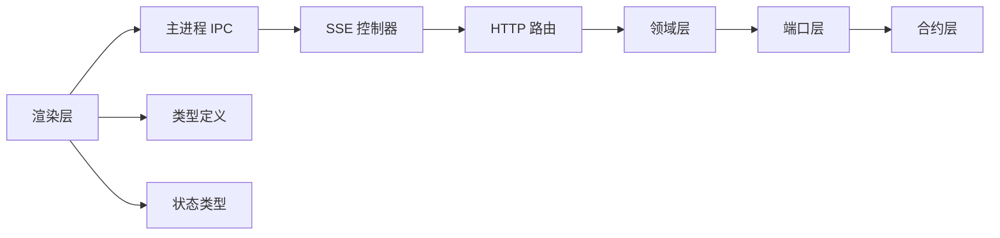

# API 文档

<cite>
**本文引用的文件**
- [kun/src/contracts/index.ts](file://kun/src/contracts/index.ts)
- [kun/src/contracts/threads.ts](file://kun/src/contracts/threads.ts)
- [kun/src/contracts/turns.ts](file://kun/src/contracts/turns.ts)
- [kun/src/contracts/items.ts](file://kun/src/contracts/items.ts)
- [kun/src/contracts/approvals.ts](file://kun/src/contracts/approvals.ts)
- [kun/src/contracts/events.ts](file://kun/src/contracts/events.ts)
- [kun/src/contracts/usage.ts](file://kun/src/contracts/usage.ts)
- [kun/src/contracts/errors.ts](file://kun/src/contracts/errors.ts)
- [kun/src/contracts/capabilities.ts](file://kun/src/contracts/capabilities.ts)
- [kun/src/contracts/runtime-info.ts](file://kun/src/contracts/runtime-info.ts)
- [kun/src/contracts/memory.ts](file://kun/src/contracts/memory.ts)
- [kun/src/contracts/workspace.ts](file://kun/src/contracts/workspace.ts)
- [kun/src/contracts/review.ts](file://kun/src/contracts/review.ts)
- [kun/src/contracts/policy.ts](file://kun/src/contracts/policy.ts)
- [kun/src/contracts/attachments.ts](file://kun/src/contracts/attachments.ts)
- [kun/src/domain/index.ts](file://kun/src/domain/index.ts)
- [kun/src/domain/thread.ts](file://kun/src/domain/thread.ts)
- [kun/src/domain/turn.ts](file://kun/src/domain/turn.ts)
- [kun/src/domain/item.ts](file://kun/src/domain/item.ts)
- [kun/src/domain/approval.ts](file://kun/src/domain/approval.ts)
- [kun/src/domain/event.ts](file://kun/src/domain/event.ts)
- [kun/src/domain/usage.ts](file://kun/src/domain/usage.ts)
- [kun/src/domain/session.ts](file://kun/src/domain/session.ts)
- [kun/src/ports/index.ts](file://kun/src/ports/index.ts)
- [kun/src/ports/event-bus.ts](file://kun/src/ports/event-bus.ts)
- [kun/src/ports/approval-gate.ts](file://kun/src/ports/approval-gate.ts)
- [kun/src/ports/user-input-gate.ts](file://kun/src/ports/user-input-gate.ts)
- [kun/src/ports/model-client.ts](file://kun/src/ports/model-client.ts)
- [kun/src/ports/thread-store.ts](file://kun/src/ports/thread-store.ts)
- [kun/src/ports/session-store.ts](file://kun/src/ports/session-store.ts)
- [kun/src/ports/tool-host.ts](file://kun/src/ports/tool-host.ts)
- [kun/src/ports/web-provider.ts](file://kun/src/ports/web-provider.ts)
- [kun/src/ports/workspace-inspector.ts](file://kun/src/ports/workspace-inspector.ts)
- [kun/src/ports/id-generator.ts](file://kun/src/ports/id-generator.ts)
- [kun/src/ports/clock.ts](file://kun/src/ports/clock.ts)
- [kun/src/server/routes/index.ts](file://kun/src/server/routes/index.ts)
- [kun/src/server/routes/threads.ts](file://kun/src/server/routes/threads.ts)
- [kun/src/server/routes/sessions.ts](file://kun/src/server/routes/sessions.ts)
- [kun/src/server/routes/turns.ts](file://kun/src/server/routes/turns.ts)
- [kun/src/server/routes/approvals.ts](file://kun/src/server/routes/approvals.ts)
- [kun/src/server/routes/events.ts](file://kun/src/server/routes/events.ts)
- [kun/src/server/routes/usage.ts](file://kun/src/server/routes/usage.ts)
- [kun/src/server/routes/runtime-info.ts](file://kun/src/server/routes/runtime-info.ts)
- [kun/src/server/routes/memory.ts](file://kun/src/server/routes/memory.ts)
- [kun/src/server/routes/workspace.ts](file://kun/src/server/routes/workspace.ts)
- [kun/src/server/routes/review.ts](file://kun/src/server/routes/review.ts)
- [kun/src/server/routes/health.ts](file://kun/src/server/routes/health.ts)
- [kun/src/server/routes/server-runtime.ts](file://kun/src/server/routes/server-runtime.ts)
- [kun/src/server/sse.ts](file://kun/src/server/sse.ts)
- [kun/src/adapters/tool/capability-registry.ts](file://kun/src/adapters/tool/capability-registry.ts)
- [kun/src/adapters/tool/builtin-tool-types.ts](file://kun/src/adapters/tool/builtin-tool-types.ts)
- [kun/src/adapters/tool/builtin-tools.ts](file://kun/src/adapters/tool/builtin-tools.ts)
- [kun/src/shared/ds-gui-api.ts](file://kun/src/shared/ds-gui-api.ts)
- [kun/src/shared/kun-endpoints.ts](file://kun/src/shared/kun-endpoints.ts)
- [src/main/runtime-sse-ipc.ts](file://src/main/runtime-sse-ipc.ts)
- [src/renderer/src/agent/runtime-client.ts](file://src/renderer/src/agent/runtime-client.ts)
- [src/renderer/src/agent/types.ts](file://src/renderer/src/agent/types.ts)
- [src/renderer/src/agent/kun-runtime.ts](file://src/renderer/src/agent/kun-runtime.ts)
- [src/renderer/src/store/chat-store-types.ts](file://src/renderer/src/store/chat-store-types.ts)
- [src/renderer/src/lib/load-kun-diagnostics.ts](file://src/renderer/src/lib/load-kun-diagnostics.ts)
- [docs/kun-contributing.en.md](file://docs/kun-contributing.en.md)
</cite>

## 目录
1. [简介](#简介)
2. [项目结构](#项目结构)
3. [核心组件](#核心组件)
4. [架构总览](#架构总览)
5. [详细组件分析](#详细组件分析)
6. [依赖关系分析](#依赖关系分析)
7. [性能考量](#性能考量)
8. [故障排查指南](#故障排查指南)
9. [结论](#结论)
10. [附录](#附录)

## 简介
本文件为 DeepSeek GUI 的 API 参考文档，覆盖类型定义、接口规范、错误码说明、版本与兼容性信息，并对核心数据模型（Thread、Session、Turn、Item、Approval）进行深入解析。同时说明端口接口、事件系统、工具接口标准，提供类型声明、枚举值与常量定义，以及 API 版本演进与迁移建议。

## 项目结构
DeepSeek GUI 的后端运行时（kun）采用分层设计：合约层（Contracts）定义稳定的数据契约；领域层（Domain）实现业务逻辑；端口层（Ports）抽象外部依赖；服务层（Server）暴露 HTTP/SSE 接口；渲染层（Renderer）通过 IPC 与主进程交互，连接到运行时事件流。

**图表来源**
- [src/renderer/src/agent/runtime-client.ts](file://src/renderer/src/agent/runtime-client.ts)
- [src/main/runtime-sse-ipc.ts](file://src/main/runtime-sse-ipc.ts)
- [kun/src/server/sse.ts](file://kun/src/server/sse.ts)
- [kun/src/server/routes/index.ts](file://kun/src/server/routes/index.ts)
- [kun/src/ports/index.ts](file://kun/src/ports/index.ts)
- [kun/src/contracts/index.ts](file://kun/src/contracts/index.ts)

**章节来源**
- [docs/kun-contributing.en.md](file://docs/kun-contributing.en.md)

## 核心组件
- 合约层（Contracts）：定义 Thread、Turn、Item、Approval、Event、Usage、Policy、Capabilities、RuntimeInfo、Memory、Workspace、Review、Errors 等稳定类型与事件格式。
- 领域层（Domain）：实现线程、回合、条目、审批、事件、用量等业务逻辑与工厂方法。
- 端口层（Ports）：抽象事件总线、会话/线程存储、模型客户端、工具宿主、工作区检查器等可替换依赖。
- 服务层（Server）：HTTP 路由与 SSE 事件流，提供线程、会话、回合、审批、事件、用量、运行时信息、内存、工作区、评审、健康检查等接口。
- 工具适配层：能力注册表（CapabilityRegistry）统一管理工具提供方与工具清单，支持内置工具族与 Web 工具族。

**章节来源**
- [kun/src/contracts/index.ts](file://kun/src/contracts/index.ts)
- [kun/src/domain/index.ts](file://kun/src/domain/index.ts)
- [kun/src/ports/index.ts](file://kun/src/ports/index.ts)
- [kun/src/server/routes/index.ts](file://kun/src/server/routes/index.ts)

## 架构总览
下图展示从渲染层发起请求到运行时处理并返回 SSE 事件的整体流程。

**图表来源**
- [src/main/runtime-sse-ipc.ts](file://src/main/runtime-sse-ipc.ts)
- [kun/src/server/routes/events.ts](file://kun/src/server/routes/events.ts)
- [kun/src/server/sse.ts](file://kun/src/server/sse.ts)

## 详细组件分析

### 数据模型与类型定义
- Thread（线程）
  - 字段要点：标识符、标题、工作区、模型、状态、模式、审批策略、时间戳等。
  - 关系：属于一个会话；包含多个 Turn；派生摘要时不包含完整回合列表。
- Turn（回合）
  - 字段要点：所属线程、提示文本、状态、开始/结束时间、条目集合等。
  - 关系：属于一个 Thread；包含多个 Item；支持开始/完成生命周期。
- Item（条目）
  - 类型：用户输入、助手文本、推理内容、工具调用、工具结果、审批请求、错误、压缩标记等。
  - 去重：同一回合内按 ID 去重插入。
- Approval（审批）
  - 字段要点：关联的线程/回合、工具名、摘要、状态（待定/允许/拒绝）、决策等。
  - 生命周期：创建、过期、决议。
- Event（事件）
  - 结构：序列号、种类、时间戳、上下文（线程/回合/条目/审批）等。
  - 排序：按序列号比较；支持按种类分组。
- Usage（用量）
  - 字段要点：令牌计数、时间窗口、模型标识等；支持累加与清零。
- Policy（策略）
  - 审批策略默认值与配置项，用于控制自动/请求式审批行为。
- Capabilities（能力）
  - 工具提供方与工具清单的描述性结构，含名称、描述、输入模式、工具类别、提供方标识与类型。
- RuntimeInfo/Memory/Workspace/Review/Attachments/Errors
  - 运行时信息、内存指标、工作区元数据、评审相关结构、附件契约、错误码与诊断信息等。

**图表来源**
- [kun/src/contracts/threads.ts](file://kun/src/contracts/threads.ts)
- [kun/src/contracts/turns.ts](file://kun/src/contracts/turns.ts)
- [kun/src/contracts/items.ts](file://kun/src/contracts/items.ts)
- [kun/src/contracts/approvals.ts](file://kun/src/contracts/approvals.ts)
- [kun/src/contracts/events.ts](file://kun/src/contracts/events.ts)
- [kun/src/contracts/usage.ts](file://kun/src/contracts/usage.ts)

**章节来源**
- [kun/src/domain/thread.ts](file://kun/src/domain/thread.ts)
- [kun/src/domain/turn.ts](file://kun/src/domain/turn.ts)
- [kun/src/domain/item.ts](file://kun/src/domain/item.ts)
- [kun/src/domain/approval.ts](file://kun/src/domain/approval.ts)
- [kun/src/domain/event.ts](file://kun/src/domain/event.ts)
- [kun/src/domain/usage.ts](file://kun/src/domain/usage.ts)
- [kun/src/contracts/index.ts](file://kun/src/contracts/index.ts)

### 端口接口规范
- 事件总线（EventBus）
  - 订阅/发布运行时事件；用于 SSE 实时推送。
- 审批门（ApprovalGate）
  - 处理审批请求与决策；路由层在审批决议后记录事件。
- 用户输入门（UserInputGate）
  - 处理用户输入请求（如继续对话）。
- 模型客户端（ModelClient）
  - 发起模型请求与流式响应。
- 存储端口（ThreadStore/SessionStore）
  - 提供线程与会话的持久化读写。
- 工具宿主（ToolHost）
  - 执行工具调用；能力注册表统一管理工具清单。
- Web 提供方（WebProvider）
  - 支持 Web 工具族。
- 工作区检查器（WorkspaceInspector）
  - 提供工作区元数据与文件浏览能力。
- ID 生成器（IdGenerator）、时钟（Clock）
  - 分配唯一标识与时间戳。

**图表来源**
- [kun/src/ports/event-bus.ts](file://kun/src/ports/event-bus.ts)
- [kun/src/ports/approval-gate.ts](file://kun/src/ports/approval-gate.ts)
- [kun/src/ports/user-input-gate.ts](file://kun/src/ports/user-input-gate.ts)
- [kun/src/ports/model-client.ts](file://kun/src/ports/model-client.ts)
- [kun/src/ports/thread-store.ts](file://kun/src/ports/thread-store.ts)
- [kun/src/ports/session-store.ts](file://kun/src/ports/session-store.ts)
- [kun/src/ports/tool-host.ts](file://kun/src/ports/tool-host.ts)
- [kun/src/ports/web-provider.ts](file://kun/src/ports/web-provider.ts)
- [kun/src/ports/workspace-inspector.ts](file://kun/src/ports/workspace-inspector.ts)
- [kun/src/ports/id-generator.ts](file://kun/src/ports/id-generator.ts)
- [kun/src/ports/clock.ts](file://kun/src/ports/clock.ts)

**章节来源**
- [kun/src/ports/index.ts](file://kun/src/ports/index.ts)

### 事件系统规范
- SSE 编码
  - 使用序列号、事件种类、数据体进行编码。
- 事件流构建
  - 首先回放自 since_seq 或 Last-Event-ID 以来的持久化事件，再订阅实时事件。
  - 心跳机制保持连接活跃。
- 客户端断开与错误处理
  - AbortSignal 触发时关闭流；网络异常自动指数退避重连；错误事件通过 SSE 通道上报。

**图表来源**
- [kun/src/server/routes/events.ts](file://kun/src/server/routes/events.ts)
- [kun/src/server/sse.ts](file://kun/src/server/sse.ts)
- [src/main/runtime-sse-ipc.ts](file://src/main/runtime-sse-ipc.ts)

**章节来源**
- [kun/src/server/routes/events.ts](file://kun/src/server/routes/events.ts)
- [kun/src/server/sse.ts](file://kun/src/server/sse.ts)
- [src/main/runtime-sse-ipc.ts](file://src/main/runtime-sse-ipc.ts)

### 工具接口标准
- 能力注册表（CapabilityRegistry）
  - 统一注册工具提供方与工具清单；支持去重校验、可用性过滤、上下文感知广告。
  - 列出工具时根据提供方与工具策略过滤；执行前解析目标工具与提供方。
- 内置工具族
  - 默认暴露“pi 风格”的工具族，包含只读与文件变更类工具；可通过策略控制是否展示。
- Web 工具族
  - 通过 WebProvider 支持远程工具调用。

**图表来源**
- [kun/src/adapters/tool/capability-registry.ts](file://kun/src/adapters/tool/capability-registry.ts)
- [kun/src/adapters/tool/builtin-tool-types.ts](file://kun/src/adapters/tool/builtin-tool-types.ts)
- [kun/src/adapters/tool/builtin-tools.ts](file://kun/src/adapters/tool/builtin-tools.ts)

**章节来源**
- [kun/src/adapters/tool/capability-registry.ts](file://kun/src/adapters/tool/capability-registry.ts)
- [kun/src/adapters/tool/builtin-tools.ts](file://kun/src/adapters/tool/builtin-tools.ts)

### API 路由与端点
- 线程
  - GET /v1/threads/{id}
  - POST /v1/threads
  - PUT /v1/threads/{id}
  - DELETE /v1/threads/{id}
- 会话
  - GET /v1/sessions/{id}
  - POST /v1/sessions
  - PUT /v1/sessions/{id}
  - DELETE /v1/sessions/{id}
- 回合
  - GET /v1/threads/{threadId}/turns
  - POST /v1/threads/{threadId}/turns
  - GET /v1/turns/{id}
  - PUT /v1/turns/{id}
- 审批
  - POST /v1/threads/{threadId}/approvals
  - POST /v1/threads/{threadId}/approvals/{approvalId}/decisions
- 事件
  - GET /v1/threads/{id}/events?since_seq=...
- 用量
  - GET /v1/usage
- 运行时信息
  - GET /v1/runtime-info
- 内存
  - GET /v1/memory
- 工作区
  - GET /v1/workspace
- 评审
  - GET /v1/review
- 健康检查
  - GET /v1/health
- 服务器运行时
  - GET /v1/server-runtime

说明：
- SSE 事件流通过 /v1/threads/{id}/events 提供，使用 Last-Event-ID 与 since_seq 参数控制回放起点。
- 审批决策接口在路由中记录审批已解决事件，更新状态并返回响应。

**章节来源**
- [kun/src/server/routes/threads.ts](file://kun/src/server/routes/threads.ts)
- [kun/src/server/routes/sessions.ts](file://kun/src/server/routes/sessions.ts)
- [kun/src/server/routes/turns.ts](file://kun/src/server/routes/turns.ts)
- [kun/src/server/routes/approvals.ts](file://kun/src/server/routes/approvals.ts)
- [kun/src/server/routes/events.ts](file://kun/src/server/routes/events.ts)
- [kun/src/server/routes/usage.ts](file://kun/src/server/routes/usage.ts)
- [kun/src/server/routes/runtime-info.ts](file://kun/src/server/routes/runtime-info.ts)
- [kun/src/server/routes/memory.ts](file://kun/src/server/routes/memory.ts)
- [kun/src/server/routes/workspace.ts](file://kun/src/server/routes/workspace.ts)
- [kun/src/server/routes/review.ts](file://kun/src/server/routes/review.ts)
- [kun/src/server/routes/health.ts](file://kun/src/server/routes/health.ts)
- [kun/src/server/routes/server-runtime.ts](file://kun/src/server/routes/server-runtime.ts)

### 错误码与诊断
- 错误码
  - 40404：工具未找到（例如 read_file）。
  - 其他常见 HTTP 状态码：400（参数错误）、401/403（鉴权失败）、500（内部错误）。
- 诊断信息
  - 运行时错误格式化、SSE 连接错误分类（超时/网络/失败），并记录日志以便前端展示。

**章节来源**
- [kun/src/contracts/errors.ts](file://kun/src/contracts/errors.ts)
- [src/renderer/src/lib/load-kun-diagnostics.ts](file://src/renderer/src/lib/load-kun-diagnostics.ts)

### 版本演进与兼容性
- 合约稳定性
  - Contracts 层提供稳定的类型契约，作为前后端/渲染层与运行时之间的接口边界。
- 开发流程
  - “定义契约 → 描述端口 → 编写功能核心 → 编写强制外壳 → 编写适配器 → 编写服务器路由 → 编写测试 → 同步文档”，确保演进可控。
- 兼容性建议
  - 新增字段建议保留默认值；删除字段需提供迁移路径；变更事件种类需向后兼容处理。

**章节来源**
- [docs/kun-contributing.en.md](file://docs/kun-contributing.en.md)

## 依赖关系分析
- 渲染层依赖主进程 IPC 将 SSE 事件转发给前端。
- 主进程通过 SSE 控制器与运行时建立长连接，编码事件并通过 IPC 发送。
- 服务层路由依赖事件总线与存储端口；领域层依赖端口以实现业务逻辑。
- 工具链路通过能力注册表与工具宿主解耦不同提供方。

**图表来源**
- [src/renderer/src/agent/runtime-client.ts](file://src/renderer/src/agent/runtime-client.ts)
- [src/main/runtime-sse-ipc.ts](file://src/main/runtime-sse-ipc.ts)
- [kun/src/server/routes/index.ts](file://kun/src/server/routes/index.ts)
- [kun/src/domain/index.ts](file://kun/src/domain/index.ts)
- [kun/src/ports/index.ts](file://kun/src/ports/index.ts)
- [kun/src/contracts/index.ts](file://kun/src/contracts/index.ts)

**章节来源**
- [kun/src/server/routes/index.ts](file://kun/src/server/routes/index.ts)
- [kun/src/domain/index.ts](file://kun/src/domain/index.ts)
- [kun/src/ports/index.ts](file://kun/src/ports/index.ts)

## 性能考量
- SSE 心跳与断线重连：维持长连接稳定性，避免频繁重建。
- 事件回放：优先使用 since_seq 或 Last-Event-ID，减少重复传输。
- 工具调用：通过能力注册表统一管理，避免重复扫描；工具执行应限制并发与资源占用。
- 存储与缓存：线程/会话存储应尽量延迟写入，批量合并更新。

## 故障排查指南
- SSE 连接失败
  - 检查运行时基础 URL 与鉴权头；关注超时/网络错误并启用指数退避重试。
  - 查看日志中的 SSE 错误事件与消息。
- 工具未找到
  - 确认工具名称与提供方 ID；检查能力注册表是否正确注册。
- 审批未生效
  - 确认审批请求已创建且决策已记录；检查事件流是否包含审批已解决事件。
- 事件丢失
  - 使用 since_seq 或 Last-Event-ID 重新连接；确认事件总线订阅与存储回放逻辑。

**章节来源**
- [src/main/runtime-sse-ipc.ts](file://src/main/runtime-sse-ipc.ts)
- [kun/src/server/routes/approvals.ts](file://kun/src/server/routes/approvals.ts)
- [kun/src/server/routes/events.ts](file://kun/src/server/routes/events.ts)

## 结论
本 API 文档系统性梳理了 DeepSeek GUI 的数据模型、端口接口、事件系统与工具标准，提供了路由规范、错误码与兼容性建议。建议在集成时严格遵循合约层契约与开发流程，确保扩展与演进的稳定性与可维护性。

## 附录

### 常量与枚举
- 审批策略（Policy）
  - 默认策略：请求式审批（on-request）等。
- 工具类别（ToolKind）
  - tool_call、command_execution、file_change。
- 事件种类（Event.Kind）
  - 包括但不限于审批请求、审批已解决、回合开始/完成、条目新增/更新等。
- SSE 心跳间隔
  - 默认 15 秒。

**章节来源**
- [kun/src/contracts/policy.ts](file://kun/src/contracts/policy.ts)
- [kun/src/contracts/capabilities.ts](file://kun/src/contracts/capabilities.ts)
- [kun/src/contracts/events.ts](file://kun/src/contracts/events.ts)
- [kun/src/server/routes/events.ts](file://kun/src/server/routes/events.ts)

### API 版本与迁移
- 版本策略
  - 通过路由前缀 /v1 管理版本；新增字段向后兼容；删除字段提供迁移脚本。
- 迁移指南
  - 升级前备份线程/会话数据；对照 Contracts 中字段变更进行映射；在路由层增加兼容转换逻辑；逐步替换旧客户端。

**章节来源**
- [docs/kun-contributing.en.md](file://docs/kun-contributing.en.md)