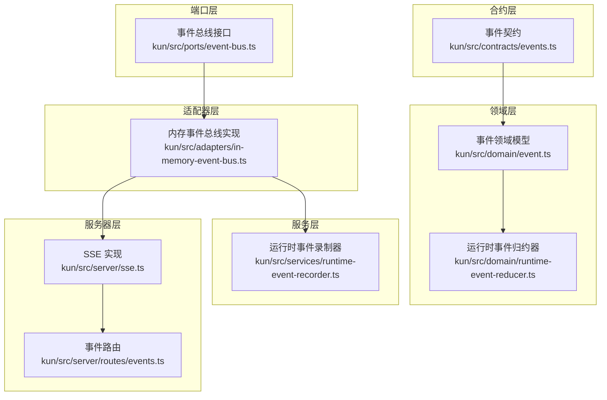
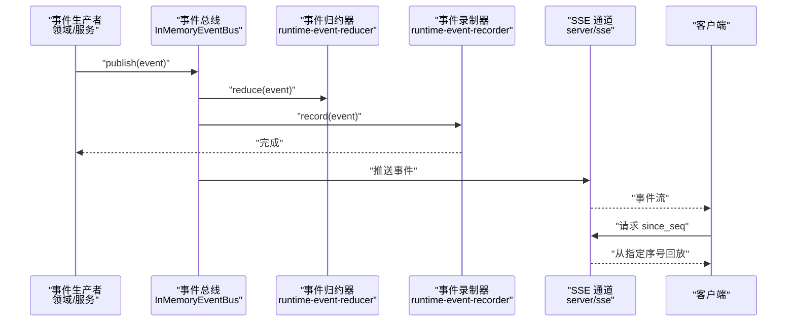
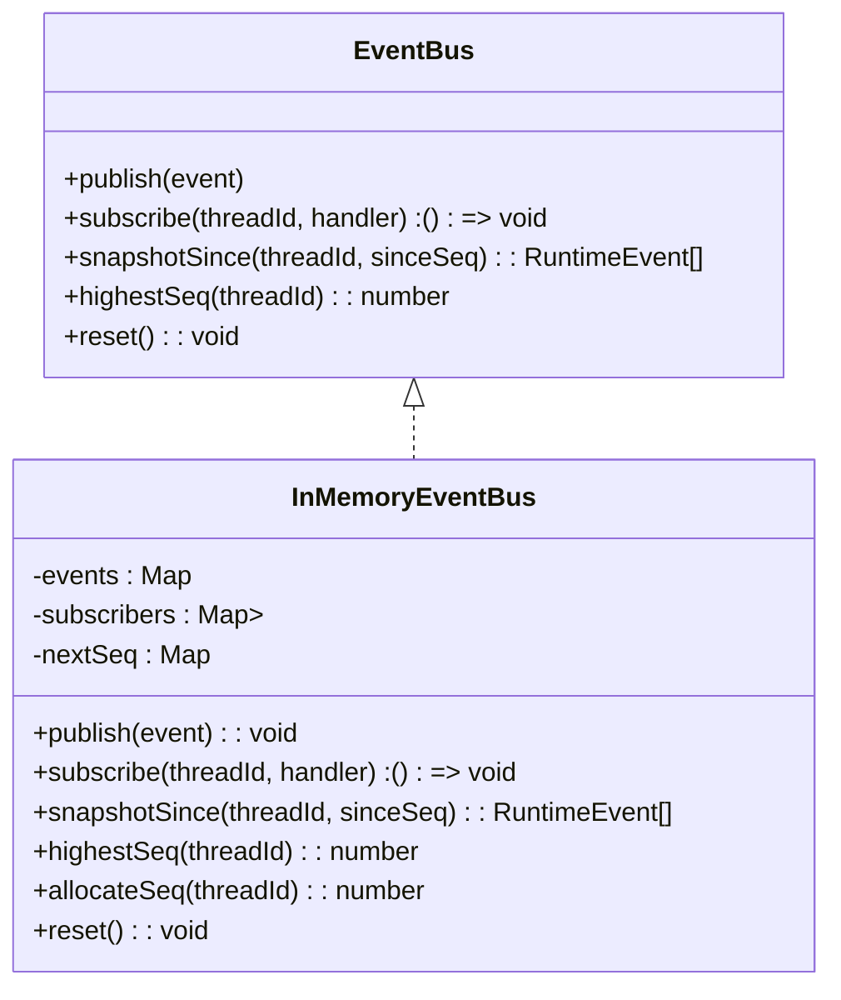
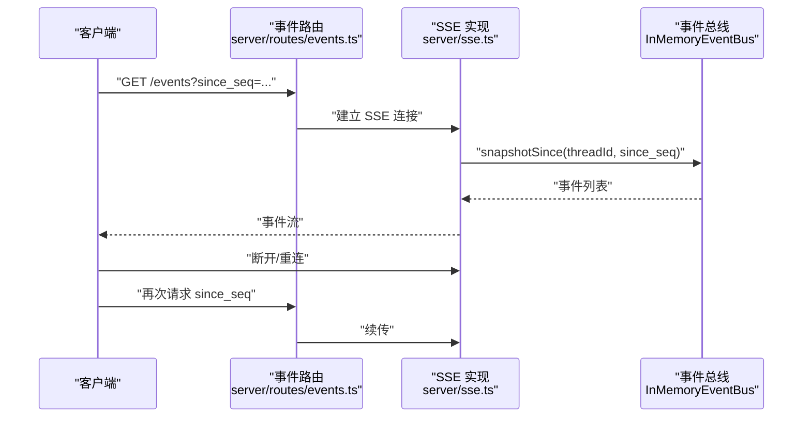
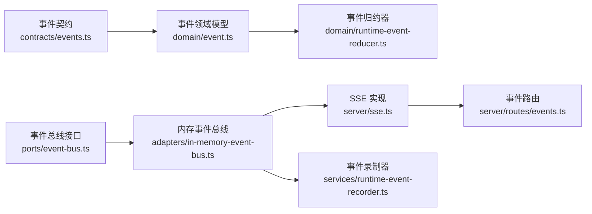

# 事件系统

<cite>
**本文引用的文件**
- [kun/src/adapters/in-memory-event-bus.ts](file://kun/src/adapters/in-memory-event-bus.ts)
- [kun/src/ports/event-bus.ts](file://kun/src/ports/event-bus.ts)
- [kun/src/contracts/events.ts](file://kun/src/contracts/events.ts)
- [kun/src/domain/event.ts](file://kun/src/domain/event.ts)
- [kun/src/domain/runtime-event-reducer.ts](file://kun/src/domain/runtime-event-reducer.ts)
- [kun/src/services/runtime-event-recorder.ts](file://kun/src/services/runtime-event-recorder.ts)
- [kun/src/server/routes/events.ts](file://kun/src/server/routes/events.ts)
- [kun/src/server/sse.ts](file://kun/src/server/sse.ts)
- [kun/tests/ports.test.ts](file://kun/tests/ports.test.ts)
</cite>

## 目录
1. [引言](#引言)
2. [项目结构](#项目结构)
3. [核心组件](#核心组件)
4. [架构总览](#架构总览)
5. [详细组件分析](#详细组件分析)
6. [依赖关系分析](#依赖关系分析)
7. [性能考虑](#性能考虑)
8. [故障排查指南](#故障排查指南)
9. [结论](#结论)
10. [附录](#附录)

## 引言
本文件系统性梳理 DeepSeek GUI 中的事件驱动架构，聚焦于事件类型定义、事件总线接口、事件处理器注册与订阅、事件传播机制、事件序列化与回放、以及性能优化与错误恢复策略。文档面向不同技术背景的读者，既提供高层概览，也给出代码级细节与可视化图示，帮助开发者快速理解并高效使用事件系统。

## 项目结构
事件系统主要分布在以下模块：
- 合约层：定义事件数据模型与字段约束
- 领域层：事件领域逻辑与事件归约器
- 端口层：事件总线抽象接口
- 适配器层：事件总线的内存实现与服务端推送（SSE）
- 服务层：事件录制器（可选持久化）
- 服务器路由：事件相关 HTTP 接口与 SSE 流

图表来源
- [kun/src/contracts/events.ts](file://kun/src/contracts/events.ts)
- [kun/src/domain/event.ts](file://kun/src/domain/event.ts)
- [kun/src/domain/runtime-event-reducer.ts](file://kun/src/domain/runtime-event-reducer.ts)
- [kun/src/ports/event-bus.ts](file://kun/src/ports/event-bus.ts)
- [kun/src/adapters/in-memory-event-bus.ts](file://kun/src/adapters/in-memory-event-bus.ts)
- [kun/src/services/runtime-event-recorder.ts](file://kun/src/services/runtime-event-recorder.ts)
- [kun/src/server/routes/events.ts](file://kun/src/server/routes/events.ts)
- [kun/src/server/sse.ts](file://kun/src/server/sse.ts)

章节来源
- [kun/src/contracts/events.ts](file://kun/src/contracts/events.ts)
- [kun/src/domain/event.ts](file://kun/src/domain/event.ts)
- [kun/src/domain/runtime-event-reducer.ts](file://kun/src/domain/runtime-event-reducer.ts)
- [kun/src/ports/event-bus.ts](file://kun/src/ports/event-bus.ts)
- [kun/src/adapters/in-memory-event-bus.ts](file://kun/src/adapters/in-memory-event-bus.ts)
- [kun/src/services/runtime-event-recorder.ts](file://kun/src/services/runtime-event-recorder.ts)
- [kun/src/server/routes/events.ts](file://kun/src/server/routes/events.ts)
- [kun/src/server/sse.ts](file://kun/src/server/sse.ts)

## 核心组件
- 事件总线接口：定义发布、订阅、快照查询、最高序号、重置等能力
- 内存事件总线实现：按线程隔离存储与分发，支持订阅者清理与异常隔离
- 事件契约：统一事件负载结构（含线程序号、时间戳、线程标识、事件种类等）
- 事件归约器：对事件进行领域级处理与状态更新
- 事件录制器：可选持久化与回放能力
- 服务器路由与 SSE：对外暴露事件流，支持断线重连与基于序号的回放

章节来源
- [kun/src/ports/event-bus.ts:1-15](file://kun/src/ports/event-bus.ts#L1-L15)
- [kun/src/adapters/in-memory-event-bus.ts:1-60](file://kun/src/adapters/in-memory-event-bus.ts#L1-L60)
- [kun/src/contracts/events.ts](file://kun/src/contracts/events.ts)
- [kun/src/domain/runtime-event-reducer.ts](file://kun/src/domain/runtime-event-reducer.ts)
- [kun/src/services/runtime-event-recorder.ts](file://kun/src/services/runtime-event-recorder.ts)
- [kun/src/server/routes/events.ts](file://kun/src/server/routes/events.ts)
- [kun/src/server/sse.ts](file://kun/src/server/sse.ts)

## 架构总览
事件系统采用“端口-适配器”模式，通过接口抽象事件总线能力，便于替换实现；在运行时以线程为单位进行事件隔离与分发，并通过 SSE 将事件推送到客户端，支持断线重连与基于序号的回放。

图表来源
- [kun/src/adapters/in-memory-event-bus.ts:14-27](file://kun/src/adapters/in-memory-event-bus.ts#L14-L27)
- [kun/src/domain/runtime-event-reducer.ts](file://kun/src/domain/runtime-event-reducer.ts)
- [kun/src/services/runtime-event-recorder.ts](file://kun/src/services/runtime-event-recorder.ts)
- [kun/src/server/sse.ts](file://kun/src/server/sse.ts)
- [kun/src/server/routes/events.ts](file://kun/src/server/routes/events.ts)

## 详细组件分析

### 事件类型与负载结构
- 事件类型由领域层与合约层共同定义，包含事件种类、线程序号、时间戳、线程标识等字段
- 事件负载结构统一，确保跨模块一致性与序列化兼容性
- 建议在新增事件类型时同步更新契约与归约器逻辑

章节来源
- [kun/src/contracts/events.ts](file://kun/src/contracts/events.ts)
- [kun/src/domain/event.ts](file://kun/src/domain/event.ts)

### 事件总线接口（端口）
- 能力范围：发布、订阅、按线程快照查询、获取最高序号、重置
- 设计要点：接口面向“线程隔离”的事件分发，便于后续扩展分布式实现

章节来源
- [kun/src/ports/event-bus.ts:1-15](file://kun/src/ports/event-bus.ts#L1-L15)

### 内存事件总线实现（适配器）
- 存储模型：按线程维护事件列表、订阅者集合、每线程下一个序号
- 发布流程：写入事件列表后广播给该线程的所有订阅者；订阅者抛出异常被隔离，不影响继续分发
- 订阅管理：返回取消函数，支持清理订阅者
- 快照与序号：提供基于序号的增量快照与最高序号查询
- 重置：清空所有状态，用于测试或重启场景

图表来源
- [kun/src/ports/event-bus.ts:8-15](file://kun/src/ports/event-bus.ts#L8-L15)
- [kun/src/adapters/in-memory-event-bus.ts:9-60](file://kun/src/adapters/in-memory-event-bus.ts#L9-L60)

章节来源
- [kun/src/adapters/in-memory-event-bus.ts:1-60](file://kun/src/adapters/in-memory-event-bus.ts#L1-L60)

### 事件归约器（领域）
- 责任：接收事件并更新运行时状态，保证事件处理的幂等与一致性
- 位置：位于领域层，避免与基础设施耦合
- 扩展：新增事件类型时需同步完善归约逻辑

章节来源
- [kun/src/domain/runtime-event-reducer.ts](file://kun/src/domain/runtime-event-reducer.ts)

### 事件录制器（服务）
- 责任：可选地持久化事件，支持回放与审计
- 适用场景：需要长期保留事件历史、调试与合规要求
- 与总线解耦：通过订阅事件总线实现非侵入式录制

章节来源
- [kun/src/services/runtime-event-recorder.ts](file://kun/src/services/runtime-event-recorder.ts)

### 服务器路由与 SSE（服务端）
- 路由：提供事件相关 HTTP 接口，支持查询与订阅
- SSE：基于事件总线的实时推送，支持断线重连与基于序号的回放
- 回放机制：客户端通过 since_seq 参数请求增量事件，服务端据此快照返回

图表来源
- [kun/src/server/routes/events.ts](file://kun/src/server/routes/events.ts)
- [kun/src/server/sse.ts](file://kun/src/server/sse.ts)
- [kun/src/adapters/in-memory-event-bus.ts:38-46](file://kun/src/adapters/in-memory-event-bus.ts#L38-L46)

章节来源
- [kun/src/server/routes/events.ts](file://kun/src/server/routes/events.ts)
- [kun/src/server/sse.ts](file://kun/src/server/sse.ts)

### 订阅模式与事件传播
- 订阅粒度：按线程订阅，确保事件隔离与可扩展性
- 传播机制：发布时仅向目标线程的订阅者广播；订阅者异常被隔离，不影响其他订阅者
- 取消订阅：返回的取消函数用于清理订阅者，避免内存泄漏

章节来源
- [kun/src/adapters/in-memory-event-bus.ts:14-36](file://kun/src/adapters/in-memory-event-bus.ts#L14-L36)
- [kun/tests/ports.test.ts:19-28](file://kun/tests/ports.test.ts#L19-L28)

### 事件序列化与回放
- 序列化：事件负载遵循统一契约，便于 JSON 序列化与传输
- 回放：服务端根据 since_seq 返回增量事件，客户端可实现断线自动重连与历史补全
- 持久化：事件录制器可选启用，满足审计与重放需求

章节来源
- [kun/src/contracts/events.ts](file://kun/src/contracts/events.ts)
- [kun/src/server/sse.ts](file://kun/src/server/sse.ts)
- [kun/src/services/runtime-event-recorder.ts](file://kun/src/services/runtime-event-recorder.ts)

## 依赖关系分析
- 合约层与领域层：事件契约约束事件结构，领域模型与归约器依赖契约
- 端口层与适配器层：端口定义能力，适配器提供具体实现
- 服务层：事件录制器依赖事件总线接口，实现非侵入式持久化
- 服务器层：路由与 SSE 依赖事件总线实现，负责对外提供事件流

图表来源
- [kun/src/contracts/events.ts](file://kun/src/contracts/events.ts)
- [kun/src/domain/event.ts](file://kun/src/domain/event.ts)
- [kun/src/domain/runtime-event-reducer.ts](file://kun/src/domain/runtime-event-reducer.ts)
- [kun/src/ports/event-bus.ts](file://kun/src/ports/event-bus.ts)
- [kun/src/adapters/in-memory-event-bus.ts](file://kun/src/adapters/in-memory-event-bus.ts)
- [kun/src/server/sse.ts](file://kun/src/server/sse.ts)
- [kun/src/server/routes/events.ts](file://kun/src/server/routes/events.ts)
- [kun/src/services/runtime-event-recorder.ts](file://kun/src/services/runtime-event-recorder.ts)

章节来源
- [kun/src/contracts/events.ts](file://kun/src/contracts/events.ts)
- [kun/src/domain/event.ts](file://kun/src/domain/event.ts)
- [kun/src/domain/runtime-event-reducer.ts](file://kun/src/domain/runtime-event-reducer.ts)
- [kun/src/ports/event-bus.ts](file://kun/src/ports/event-bus.ts)
- [kun/src/adapters/in-memory-event-bus.ts](file://kun/src/adapters/in-memory-event-bus.ts)
- [kun/src/server/sse.ts](file://kun/src/server/sse.ts)
- [kun/src/server/routes/events.ts](file://kun/src/server/routes/events.ts)
- [kun/src/services/runtime-event-recorder.ts](file://kun/src/services/runtime-event-recorder.ts)

## 性能考虑
- 内存占用：事件列表按线程存储，建议在高并发场景下控制事件速率与批量大小
- 分发成本：订阅者异常隔离避免阻塞，但过多订阅者仍会增加循环成本，建议合理拆分订阅粒度
- 回放效率：快照查询基于序号过滤，复杂度与增量事件数量线性相关
- 序号分配：按线程分配连续序号，减少冲突与回溯成本
- 可选持久化：事件录制器可选启用，避免对热路径造成额外负担

## 故障排查指南
- 订阅者抛错导致分发中断：当前实现已隔离订阅者异常，不影响其他订阅者；如出现事件丢失，检查订阅者是否被意外移除
- 断线重连：客户端应携带上次收到的最大序号作为 since_seq 请求回放；若回放不完整，检查服务端快照查询逻辑
- 内存泄漏：确认取消订阅函数被调用；测试用例验证了订阅与取消后的事件不再到达
- 事件重复：核对序号分配与快照查询条件，避免重复消费同一事件

章节来源
- [kun/src/adapters/in-memory-event-bus.ts:20-26](file://kun/src/adapters/in-memory-event-bus.ts#L20-L26)
- [kun/tests/ports.test.ts:19-28](file://kun/tests/ports.test.ts#L19-L28)

## 结论
DeepSeek GUI 的事件系统以清晰的分层设计与线程隔离为核心，结合内存事件总线与 SSE 推送，提供了可靠的事件驱动能力。通过契约约束、归约器与可选录制器，系统在可扩展性、可维护性与可观测性方面具备良好基础。建议在生产环境中配合限流、背压与持久化策略，进一步提升稳定性与性能。

## 附录
- 最佳实践
  - 新增事件类型时，同步完善契约、归约器与路由处理
  - 客户端实现断线自动重连与 since_seq 回放
  - 控制订阅粒度，避免过度订阅导致分发成本上升
  - 在高吞吐场景下评估内存占用与回放性能，必要时启用持久化与异步处理