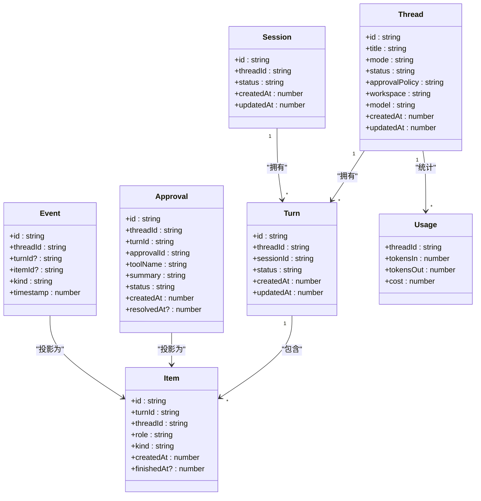
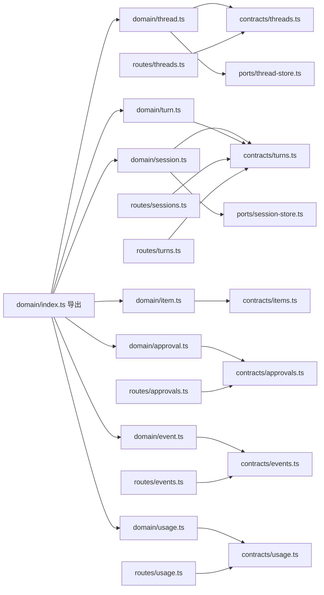

# 数据模型

<cite>
**本文引用的文件**
- [kun/src/domain/index.ts](file://kun/src/domain/index.ts)
- [kun/src/domain/thread.ts](file://kun/src/domain/thread.ts)
- [kun/src/domain/session.ts](file://kun/src/domain/session.ts)
- [kun/src/domain/turn.ts](file://kun/src/domain/turn.ts)
- [kun/src/domain/item.ts](file://kun/src/domain/item.ts)
- [kun/src/domain/approval.ts](file://kun/src/domain/approval.ts)
- [kun/src/domain/event.ts](file://kun/src/domain/event.ts)
- [kun/src/domain/usage.ts](file://kun/src/domain/usage.ts)
- [kun/src/contracts/threads.ts](file://kun/src/contracts/threads.ts)
- [kun/src/contracts/turns.ts](file://kun/src/contracts/turns.ts)
- [kun/src/contracts/items.ts](file://kun/src/contracts/items.ts)
- [kun/src/contracts/approvals.ts](file://kun/src/contracts/approvals.ts)
- [kun/src/contracts/events.ts](file://kun/src/contracts/events.ts)
- [kun/src/contracts/usage.ts](file://kun/src/contracts/usage.ts)
- [kun/src/server/routes/threads.ts](file://kun/src/server/routes/threads.ts)
- [kun/src/server/routes/sessions.ts](file://kun/src/server/routes/sessions.ts)
- [kun/src/server/routes/turns.ts](file://kun/src/server/routes/turns.ts)
- [kun/src/server/routes/approvals.ts](file://kun/src/server/routes/approvals.ts)
- [kun/src/server/routes/events.ts](file://kun/src/server/routes/events.ts)
- [kun/src/server/routes/usage.ts](file://kun/src/server/routes/usage.ts)
- [kun/src/ports/thread-store.ts](file://kun/src/ports/thread-store.ts)
- [kun/src/ports/session-store.ts](file://kun/src/ports/session-store.ts)
- [kun/tests/domain.test.ts](file://kun/tests/domain.test.ts)
</cite>

## 目录
1. [简介](#简介)
2. [项目结构](#项目结构)
3. [核心组件](#核心组件)
4. [架构总览](#架构总览)
5. [详细组件分析](#详细组件分析)
6. [依赖分析](#依赖分析)
7. [性能考虑](#性能考虑)
8. [故障排除指南](#故障排除指南)
9. [结论](#结论)
10. [附录](#附录)

## 简介
本文件系统性梳理 DeepSeek GUI 的数据模型，聚焦核心实体：Thread（会话）、Session（会话）、Turn（回合）、Item（消息项）、Approval（审批）、Event（事件）与 Usage（用量）。文档覆盖字段定义、数据类型、约束与业务规则；解释实体间关系映射、外键约束与索引设计；给出序列化格式、JSON Schema 参考与数据库映射建议；并提供数据验证规则、默认值与长度限制，帮助开发者准确理解与使用数据结构。

## 项目结构
数据模型主要分布在以下模块：
- 领域层（Domain）：定义核心实体与业务规则，位于 kun/src/domain
- 合约层（Contracts）：定义对外暴露的数据契约与类型，位于 kun/src/contracts
- 服务端路由（Server Routes）：定义 HTTP 接口与请求/响应结构，位于 kun/src/server/routes
- 存储接口（Ports）：定义持久化抽象，位于 kun/src/ports
- 测试用例：验证数据模型行为，位于 kun/tests

```mermaid
graph TB
subgraph "领域层 Domain"
DThread["thread.ts"]
DSession["session.ts"]
DTurn["turn.ts"]
DItem["item.ts"]
DApproval["approval.ts"]
DEvent["event.ts"]
DUsage["usage.ts"]
end
subgraph "合约层 Contracts"
CThreads["threads.ts"]
CTurns["turns.ts"]
CItems["items.ts"]
CApprovals["approvals.ts"]
CEvents["events.ts"]
CUsage["usage.ts"]
end
subgraph "服务端路由 Server Routes"
RThreads["routes/threads.ts"]
RSessions["routes/sessions.ts"]
RTurns["routes/turns.ts"]
RApprovals["routes/approvals.ts"]
REEvents["routes/events.ts"]
RUsage["routes/usage.ts"]
end
subgraph "存储接口 Ports"
PThreadStore["ports/thread-store.ts"]
PSessionStore["ports/session-store.ts"]
end
DThread --> CThreads
DSession --> CTurns
DTurn --> CTurns
DItem --> CItems
DApproval --> CApprovals
DEvent --> CEvents
DUsage --> CUsage
RThreads --> CThreads
RSessions --> CTurns
RTurns --> CTurns
RApprovals --> CApprovals
REEvents --> CEvents
RUsage --> CUsage
DThread --> PThreadStore
DSession --> PSessionStore
```

图表来源
- [kun/src/domain/index.ts:1-9](file://kun/src/domain/index.ts#L1-L9)
- [kun/src/contracts/threads.ts](file://kun/src/contracts/threads.ts)
- [kun/src/contracts/turns.ts](file://kun/src/contracts/turns.ts)
- [kun/src/contracts/items.ts](file://kun/src/contracts/items.ts)
- [kun/src/contracts/approvals.ts](file://kun/src/contracts/approvals.ts)
- [kun/src/contracts/events.ts](file://kun/src/contracts/events.ts)
- [kun/src/contracts/usage.ts](file://kun/src/contracts/usage.ts)
- [kun/src/server/routes/threads.ts](file://kun/src/server/routes/threads.ts)
- [kun/src/server/routes/sessions.ts](file://kun/src/server/routes/sessions.ts)
- [kun/src/server/routes/turns.ts](file://kun/src/server/routes/turns.ts)
- [kun/src/server/routes/approvals.ts](file://kun/src/server/routes/approvals.ts)
- [kun/src/server/routes/events.ts](file://kun/src/server/routes/events.ts)
- [kun/src/server/routes/usage.ts](file://kun/src/server/routes/usage.ts)
- [kun/src/ports/thread-store.ts](file://kun/src/ports/thread-store.ts)
- [kun/src/ports/session-store.ts](file://kun/src/ports/session-store.ts)

章节来源
- [kun/src/domain/index.ts:1-9](file://kun/src/domain/index.ts#L1-L9)

## 核心组件
本节概述六大核心实体及其职责：
- Thread（会话）：对话上下文容器，承载标题、模式、状态与审批策略等元信息
- Session（会话）：运行时会话，负责事件与项目的追加、关闭等生命周期管理
- Turn（回合）：一次完整的请求-响应交互，包含开始、追加项、替换项、完成等阶段
- Item（消息项）：回合内的具体消息单元，如用户输入、助手文本、工具调用、工具结果、错误、推理、归并、审批、用户输入等
- Approval（审批）：对工具调用或用户输入的审批请求与决策
- Event（事件）：运行时事件流，用于投影 Items 与维护一致性
- Usage（用量）：计费用量统计，支持增量累加与清零

章节来源
- [kun/src/domain/thread.ts](file://kun/src/domain/thread.ts)
- [kun/src/domain/session.ts](file://kun/src/domain/session.ts)
- [kun/src/domain/turn.ts](file://kun/src/domain/turn.ts)
- [kun/src/domain/item.ts](file://kun/src/domain/item.ts)
- [kun/src/domain/approval.ts](file://kun/src/domain/approval.ts)
- [kun/src/domain/event.ts](file://kun/src/domain/event.ts)
- [kun/src/domain/usage.ts](file://kun/src/domain/usage.ts)

## 架构总览
下图展示数据模型在领域层、合约层与服务端路由之间的映射关系，以及与存储接口的衔接。

图表来源
- [kun/src/domain/thread.ts](file://kun/src/domain/thread.ts)
- [kun/src/domain/session.ts](file://kun/src/domain/session.ts)
- [kun/src/domain/turn.ts](file://kun/src/domain/turn.ts)
- [kun/src/domain/item.ts](file://kun/src/domain/item.ts)
- [kun/src/domain/approval.ts](file://kun/src/domain/approval.ts)
- [kun/src/domain/event.ts](file://kun/src/domain/event.ts)
- [kun/src/domain/usage.ts](file://kun/src/domain/usage.ts)

## 详细组件分析

### Thread（会话）
- 字段定义与类型
  - id: string（主键）
  - title: string（标题）
  - mode: string（模式，如 agent）
  - status: string（状态，如 idle）
  - approvalPolicy: string（审批策略）
  - workspace: string（工作区路径）
  - model: string（模型名称）
  - createdAt: number（时间戳）
  - updatedAt: number（时间戳）
- 约束与默认值
  - 默认模式为 agent
  - 默认状态为 idle
  - 默认审批策略来自全局策略常量
- 业务规则
  - 创建时填充默认值
  - 更新时同步更新时间戳
- JSON Schema 片段（字段级）
  - id: { type: "string", pattern: "^thr_" }
  - title: { type: "string", maxLength: 255 }
  - mode: { type: "string", enum: ["agent"] }
  - status: { type: "string", enum: ["idle"] }
  - approvalPolicy: { type: "string" }
  - workspace: { type: "string" }
  - model: { type: "string" }
  - createdAt/updatedAt: { type: "number", minimum: 0 }
- 数据库映射建议
  - 主键: id
  - 索引: workspace, model, createdAt
- 序列化格式
  - 前端/后端均以 JSON 表示，遵循上述字段与类型

章节来源
- [kun/src/domain/thread.ts](file://kun/src/domain/thread.ts)
- [kun/src/contracts/threads.ts](file://kun/src/contracts/threads.ts)
- [kun/tests/domain.test.ts:36-48](file://kun/tests/domain.test.ts#L36-L48)

### Session（会话）
- 字段定义与类型
  - id: string（主键）
  - threadId: string（外键，关联 Thread.id）
  - status: string（状态）
  - createdAt: number（时间戳）
  - updatedAt: number（时间戳）
- 约束与默认值
  - 外键约束: threadId 引用 Thread.id
  - 默认状态为空（由业务逻辑决定）
- 业务规则
  - 通过事件与项目追加构建会话生命周期
  - 支持关闭操作
- JSON Schema 片段（字段级）
  - id: { type: "string", pattern: "^ses_" }
  - threadId: { type: "string", pattern: "^thr_" }
  - status: { type: "string" }
  - createdAt/updatedAt: { type: "number", minimum: 0 }
- 数据库映射建议
  - 主键: id
  - 外键: threadId -> Thread(id)
  - 索引: threadId, createdAt
- 序列化格式
  - JSON，遵循字段与类型

章节来源
- [kun/src/domain/session.ts](file://kun/src/domain/session.ts)
- [kun/src/contracts/turns.ts](file://kun/src/contracts/turns.ts)

### Turn（回合）
- 字段定义与类型
  - id: string（主键）
  - threadId: string（外键，关联 Thread.id）
  - sessionId: string（外键，关联 Session.id）
  - status: string（状态）
  - createdAt: number（时间戳）
  - updatedAt: number（时间戳）
- 约束与默认值
  - 外键约束: threadId 引用 Thread.id；sessionId 引用 Session.id
  - 默认状态为空（由业务逻辑决定）
- 业务规则
  - 支持开始、追加项、替换项、完成等阶段
  - 与 Item 一对多关系
- JSON Schema 片段（字段级）
  - id: { type: "string", pattern: "^turn_" }
  - threadId/sessionId: { type: "string", pattern: "^thr_|^ses_" }
  - status: { type: "string" }
  - createdAt/updatedAt: { type: "number", minimum: 0 }
- 数据库映射建议
  - 主键: id
  - 外键: threadId -> Thread(id), sessionId -> Session(id)
  - 索引: threadId, sessionId, createdAt
- 序列化格式
  - JSON，遵循字段与类型

章节来源
- [kun/src/domain/turn.ts](file://kun/src/domain/turn.ts)
- [kun/src/contracts/turns.ts](file://kun/src/contracts/turns.ts)

### Item（消息项）
- 字段定义与类型
  - id: string（主键）
  - turnId: string（外键，关联 Turn.id）
  - threadId: string（外键，关联 Thread.id）
  - role: string（角色，如 user、assistant、tool）
  - kind: string（类型，如 user、assistant_text、tool_call、tool_result、error、reasoning、compaction、approval、user_input）
  - createdAt: number（时间戳）
  - finishedAt?: number（完成时间戳）
- 约束与默认值
  - 外键约束: turnId 引用 Turn.id；threadId 引用 Thread.id
  - 某些类型可选完成时间
- 业务规则
  - 不同 kind 对应不同负载结构
  - approval 与 user_input 类型与审批流程强相关
- JSON Schema 片段（字段级）
  - id: { type: "string", pattern: "^item_" }
  - turnId/threadId: { type: "string", pattern: "^turn_|^thr_" }
  - role: { type: "string", enum: ["user","assistant","tool"] }
  - kind: { type: "string", enum: ["user","assistant_text","tool_call","tool_result","error","reasoning","compaction","approval","user_input"] }
  - createdAt/finishedAt: { type: "number", minimum: 0 }
- 数据库映射建议
  - 主键: id
  - 外键: turnId -> Turn(id), threadId -> Thread(id)
  - 索引: turnId, threadId, kind, createdAt
- 序列化格式
  - JSON，遵循字段与类型

章节来源
- [kun/src/domain/item.ts](file://kun/src/domain/item.ts)
- [kun/src/contracts/items.ts](file://kun/src/contracts/items.ts)

### Approval（审批）
- 字段定义与类型
  - id: string（主键）
  - threadId: string（外键，关联 Thread.id）
  - turnId: string（外键，关联 Turn.id）
  - approvalId: string（审批唯一标识）
  - toolName: string（工具名）
  - summary: string（摘要）
  - status: string（状态，如 pending、allowed、denied）
  - createdAt: number（时间戳）
  - resolvedAt?: number（解决时间戳）
- 约束与默认值
  - 外键约束: threadId -> Thread.id；turnId -> Turn.id
  - 默认状态为 pending
- 业务规则
  - 决策后写入事件，触发状态变更与完成时间
  - 与 Item 投影对应
- JSON Schema 片段（字段级）
  - id: { type: "string", pattern: "^apr_" }
  - threadId/turnId: { type: "string", pattern: "^thr_|^turn_" }
  - approvalId: { type: "string" }
  - toolName/summary: { type: "string" }
  - status: { type: "string", enum: ["pending","allowed","denied"] }
  - createdAt/resolvedAt: { type: "number", minimum: 0 }
- 数据库映射建议
  - 主键: id
  - 外键: threadId -> Thread(id), turnId -> Turn(id)
  - 索引: threadId, turnId, approvalId, status
- 序列化格式
  - JSON，遵循字段与类型

章节来源
- [kun/src/domain/approval.ts](file://kun/src/domain/approval.ts)
- [kun/src/contracts/approvals.ts](file://kun/src/contracts/approvals.ts)

### Event（事件）
- 字段定义与类型
  - id: string（主键）
  - threadId: string（外键，关联 Thread.id）
  - turnId?: string（可选，外键，关联 Turn.id）
  - itemId?: string（可选，外键，关联 Item.id）
  - kind: string（事件类型，如 approval_requested、approval_resolved、user_input_requested、user_input_resolved 等）
  - timestamp: number（时间戳）
- 约束与默认值
  - 外键约束: threadId -> Thread.id；可选 turnId -> Turn.id；可选 itemId -> Item.id
- 业务规则
  - 作为事件驱动的投影源，生成/更新 Item
  - 提供事件排序与分组能力
- JSON Schema 片段（字段级）
  - id: { type: "string", pattern: "^evt_" }
  - threadId/turnId: { type: "string", pattern: "^thr_|^turn_" }
  - itemId: { type: "string", pattern: "^item_" }
  - kind: { type: "string" }
  - timestamp: { type: "number", minimum: 0 }
- 数据库映射建议
  - 主键: id
  - 外键: threadId -> Thread(id), turnId -> Turn(id), itemId -> Item(id)
  - 索引: threadId, turnId, kind, timestamp
- 序列化格式
  - JSON，遵循字段与类型

章节来源
- [kun/src/domain/event.ts](file://kun/src/domain/event.ts)
- [kun/src/contracts/events.ts](file://kun/src/contracts/events.ts)

### Usage（用量）
- 字段定义与类型
  - threadId: string（外键，关联 Thread.id）
  - tokensIn: number（输入令牌数）
  - tokensOut: number（输出令牌数）
  - cost: number（成本）
- 约束与默认值
  - 外键约束: threadId -> Thread.id
  - 默认值均为 0
- 业务规则
  - 支持增量累加与清零
  - 与线程绑定，便于按会话统计
- JSON Schema 片段（字段级）
  - threadId: { type: "string", pattern: "^thr_" }
  - tokensIn/tokensOut/cost: { type: "number", minimum: 0 }
- 数据库映射建议
  - 主键: threadId
  - 外键: threadId -> Thread(id)
  - 索引: threadId
- 序列化格式
  - JSON，遵循字段与类型

章节来源
- [kun/src/domain/usage.ts](file://kun/src/domain/usage.ts)
- [kun/src/contracts/usage.ts](file://kun/src/contracts/usage.ts)

## 依赖分析
- 领域层到合约层：各实体的领域实现与对外契约保持一致
- 领域层到服务端路由：路由层接收请求，转换为领域命令，再调用领域函数
- 领域层到存储接口：通过 Ports 抽象进行持久化
- 测试用例验证：通过单元测试确保数据模型行为正确

图表来源
- [kun/src/domain/index.ts:1-9](file://kun/src/domain/index.ts#L1-L9)
- [kun/src/contracts/threads.ts](file://kun/src/contracts/threads.ts)
- [kun/src/contracts/turns.ts](file://kun/src/contracts/turns.ts)
- [kun/src/contracts/items.ts](file://kun/src/contracts/items.ts)
- [kun/src/contracts/approvals.ts](file://kun/src/contracts/approvals.ts)
- [kun/src/contracts/events.ts](file://kun/src/contracts/events.ts)
- [kun/src/contracts/usage.ts](file://kun/src/contracts/usage.ts)
- [kun/src/server/routes/threads.ts](file://kun/src/server/routes/threads.ts)
- [kun/src/server/routes/sessions.ts](file://kun/src/server/routes/sessions.ts)
- [kun/src/server/routes/turns.ts](file://kun/src/server/routes/turns.ts)
- [kun/src/server/routes/approvals.ts](file://kun/src/server/routes/approvals.ts)
- [kun/src/server/routes/events.ts](file://kun/src/server/routes/events.ts)
- [kun/src/server/routes/usage.ts](file://kun/src/server/routes/usage.ts)
- [kun/src/ports/thread-store.ts](file://kun/src/ports/thread-store.ts)
- [kun/src/ports/session-store.ts](file://kun/src/ports/session-store.ts)

章节来源
- [kun/src/domain/index.ts:1-9](file://kun/src/domain/index.ts#L1-L9)
- [kun/tests/domain.test.ts:1-48](file://kun/tests/domain.test.ts#L1-L48)

## 性能考虑
- 索引设计
  - 在 Thread 上建立 workspace、model、createdAt 等索引，加速查询
  - 在 Session 上建立 threadId、createdAt 索引
  - 在 Turn 上建立 threadId、sessionId、createdAt 索引
  - 在 Item 上建立 turnId、threadId、kind、createdAt 索引
  - 在 Approval 与 Event 上建立外键与状态相关索引
  - 在 Usage 上以 threadId 为主键并建立索引
- 时间复杂度
  - 事件投影与 Item 合成通常为 O(n)，其中 n 为事件数量
  - 查询与更新遵循索引访问，平均 O(log n) 到 O(1)
- 缓存与批量处理
  - 对热点线程采用内存缓存，减少磁盘 IO
  - 批量写入事件与项目，降低事务开销

## 故障排除指南
- 审批决策流程
  - 输入校验失败时返回错误响应
  - 决策后记录 approval_resolved 事件，更新 Item 状态与完成时间
- 事件排序与分组
  - 使用事件序号与分组函数保证一致性
- 默认值与约束
  - 若字段缺失或类型不符，按契约进行校验并拒绝无效请求
- 单元测试参考
  - 通过领域测试验证默认值、状态流转与投影行为

章节来源
- [kun/src/server/routes/approvals.ts:34-51](file://kun/src/server/routes/approvals.ts#L34-L51)
- [kun/src/domain/event.ts](file://kun/src/domain/event.ts)
- [kun/tests/domain.test.ts:1-48](file://kun/tests/domain.test.ts#L1-L48)

## 结论
本文档系统化梳理了 DeepSeek GUI 的数据模型，明确了六大核心实体的字段、类型、约束与业务规则，并给出了 JSON Schema 与数据库映射建议。通过事件驱动的投影机制与严格的外键约束，确保数据一致性与可扩展性。建议在生产环境中结合索引设计与缓存策略，进一步提升性能与稳定性。

## 附录
- JSON Schema（字段级）示例（仅列出关键字段与类型）
  - Thread: id、title、mode、status、approvalPolicy、workspace、model、createdAt、updatedAt
  - Session: id、threadId、status、createdAt、updatedAt
  - Turn: id、threadId、sessionId、status、createdAt、updatedAt
  - Item: id、turnId、threadId、role、kind、createdAt、finishedAt
  - Approval: id、threadId、turnId、approvalId、toolName、summary、status、createdAt、resolvedAt
  - Event: id、threadId、turnId、itemId、kind、timestamp
  - Usage: threadId、tokensIn、tokensOut、cost
- 外键关系
  - Thread.id → Session.threadId
  - Thread.id → Turn.threadId
  - Session.id → Turn.sessionId
  - Turn.id → Item.turnId
  - Thread.id → Item.threadId
  - Thread.id → Approval.threadId
  - Turn.id → Approval.turnId
  - Thread.id → Event.threadId
  - Turn.id → Event.turnId
  - Item.id → Event.itemId
  - Thread.id → Usage.threadId
- 索引建议
  - Thread: workspace、model、createdAt
  - Session: threadId、createdAt
  - Turn: threadId、sessionId、createdAt
  - Item: turnId、threadId、kind、createdAt
  - Approval: threadId、turnId、approvalId、status
  - Event: threadId、turnId、kind、timestamp
  - Usage: threadId