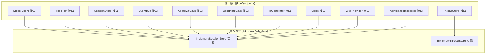

# 端口接口

<cite>
**本文引用的文件**
- [model-client.ts](file://kun/src/ports/model-client.ts)
- [tool-host.ts](file://kun/src/ports/tool-host.ts)
- [session-store.ts](file://kun/src/ports/session-store.ts)
- [thread-store.ts](file://kun/src/ports/thread-store.ts)
- [event-bus.ts](file://kun/src/ports/event-bus.ts)
- [approval-gate.ts](file://kun/src/ports/approval-gate.ts)
- [user-input-gate.ts](file://kun/src/ports/user-input-gate.ts)
- [id-generator.ts](file://kun/src/ports/id-generator.ts)
- [clock.ts](file://kun/src/ports/clock.ts)
- [web-provider.ts](file://kun/src/ports/web-provider.ts)
- [workspace-inspector.ts](file://kun/src/ports/workspace-inspector.ts)
- [index.ts](file://kun/src/ports/index.ts)
- [in-memory-session-store.ts](file://kun/src/adapters/in-memory-session-store.ts)
- [in-memory-thread-store.ts](file://kun/src/adapters/in-memory-thread-store.ts)
</cite>

## 目录
1. [简介](#简介)
2. [项目结构](#项目结构)
3. [核心组件](#核心组件)
4. [架构总览](#架构总览)
5. [详细组件分析](#详细组件分析)
6. [依赖分析](#依赖分析)
7. [性能考量](#性能考量)
8. [故障排查指南](#故障排查指南)
9. [结论](#结论)
10. [附录](#附录)

## 简介
本文件面向 DeepSeek GUI 的后端运行时与前端渲染层之间的“端口接口”体系，系统化梳理并规范以下抽象端口：ModelClient（模型客户端）、ToolHost（工具宿主）、SessionStore（会话存储）、ThreadStore（线程存储）、EventBus（事件总线）、ApprovalGate（审批门禁）、UserInputGate（用户输入门禁）、IdGenerator（ID 生成器）、Clock（时钟）、WebProvider（网络提供者）、WorkspaceInspector（工作区检查器）。文档覆盖接口方法签名、参数与返回类型、异常处理策略、设计原则、依赖注入模式、适配器实现、最佳实践、性能与扩展性建议，并给出与实际适配器实现的映射关系。

## 项目结构
端口接口集中于 ports 目录，采用“按职责分组”的扁平导出方式；适配器实现位于 adapters 目录，提供内存与混合持久化方案用于测试与默认运行时。

**图表来源**
- [index.ts:1-12](file://kun/src/ports/index.ts#L1-L12)
- [in-memory-session-store.ts:1-123](file://kun/src/adapters/in-memory-session-store.ts#L1-L123)
- [in-memory-thread-store.ts:1-31](file://kun/src/adapters/in-memory-thread-store.ts#L1-L31)

**章节来源**
- [index.ts:1-12](file://kun/src/ports/index.ts#L1-L12)

## 核心组件
本节对各端口进行概览式说明，后续章节将深入到具体接口与实现细节。

- ModelClient：统一模型调用入口，支持流式响应与多种输出格式控制，屏蔽底层提供商差异。
- ToolHost：统一工具执行入口，负责工具发现、执行、上下文传递、审批与用户输入协调。
- SessionStore：线程级持久化，维护事件日志、项历史与会话投影，支持重放与修复。
- ThreadStore：线程元数据持久化，支持列表、查询、增删改。
- EventBus：运行时事件总线，支持订阅、快照与序列号管理。
- ApprovalGate：审批请求与决策的门禁，支持挂起查询与状态管理。
- UserInputGate：结构化用户输入请求与解析，支持挂起查询与状态管理。
- IdGenerator：统一 ID 生成策略，支持随机与顺序两种实现。
- Clock：统一时间源，支持 ISO 字符串与毫秒时间戳。
- WebProvider：网页抓取与搜索能力抽象，提供不可用与确定性实现。
- WorkspaceInspector：工作区状态检查，面向 Git 工作区。

**章节来源**
- [model-client.ts:94-104](file://kun/src/ports/model-client.ts#L94-L104)
- [tool-host.ts:111-140](file://kun/src/ports/tool-host.ts#L111-L140)
- [session-store.ts:5-32](file://kun/src/ports/session-store.ts#L5-L32)
- [thread-store.ts:11-22](file://kun/src/ports/thread-store.ts#L11-L22)
- [event-bus.ts:3-16](file://kun/src/ports/event-bus.ts#L3-L16)
- [approval-gate.ts:3-15](file://kun/src/ports/approval-gate.ts#L3-L15)
- [user-input-gate.ts:19-39](file://kun/src/ports/user-input-gate.ts#L19-L39)
- [id-generator.ts:1-26](file://kun/src/ports/id-generator.ts#L1-L26)
- [clock.ts:1-16](file://kun/src/ports/clock.ts#L1-L16)
- [web-provider.ts:36-106](file://kun/src/ports/web-provider.ts#L36-L106)
- [workspace-inspector.ts:3-11](file://kun/src/ports/workspace-inspector.ts#L3-L11)

## 架构总览
下图展示端口接口与适配器实现之间的依赖关系与交互路径，体现“接口隔离、依赖倒置、适配器替换”的设计原则。

```mermaid
classDiagram
class ModelClient {
+provider : string
+model : string
+stream(request) : AsyncIterable~ModelStreamChunk~
}
class ToolHost {
+id : string
+listTools(context?) : Promise~ToolInfo[]~
+execute(call, context, onUpdate?) : Promise~ToolHostResult~
+clearReadTracker?(threadId?)
}
class SessionStore {
+appendEvent(threadId, event) : Promise~void~
+appendItem(threadId, item) : Promise~void~
+rewriteItems(threadId, items) : Promise~void~
+updateItem(threadId, itemId, patch) : Promise~TurnItem|null~
+loadEventsSince(threadId, sinceSeq) : Promise~RuntimeEvent[]~
+loadItems(threadId) : Promise~TurnItem[]~
+loadSession(threadId) : Promise~AgentSession|null~
+upsertSession(session) : Promise~void~
+highestSeq(threadId) : Promise~number~
+resetMemory() : Promise~void~
}
class ThreadStore {
+list(options?) : Promise~ThreadSummary[]~
+get(threadId) : Promise~ThreadRecord|null~
+upsert(thread) : Promise~ThreadRecord~
+delete(threadId) : Promise~boolean~
}
class EventBus {
+publish(event) : void
+subscribe(threadId, handler) : () => void
+snapshotSince(threadId, sinceSeq) : RuntimeEvent[]
+highestSeq(threadId) : number
+reset() : void
}
class ApprovalGate {
+request(approval) : Promise~'allow'|'deny'~
+decide(approvalId, decision, reason?) : boolean
+pending(threadId?) : ApprovalRequest[]
+get(approvalId) : ApprovalRequest|undefined
}
class UserInputGate {
+request(input) : Promise~UserInputResolution~
+get(inputId) : UserInputRequest|undefined
+resolve(inputId, resolution) : boolean
+pending(threadId?) : UserInputRequest[]
+reset() : void
}
class IdGenerator {
+next(prefix) : string
}
class Clock {
+now() : Date
+nowIso() : string
+nowMs() : number
}
class WebProvider {
+id : string
+fetch?(request) : Promise~WebFetchResult~
+search?(request) : Promise~WebSearchResult[]~
}
class WorkspaceInspector {
+status(workspace) : Promise~WorkspaceStatus~
}
class InMemorySessionStore
class InMemoryThreadStore
ModelClient <|.. InMemorySessionStore : "依赖"
ToolHost <|.. InMemorySessionStore : "依赖"
SessionStore <|.. InMemorySessionStore : "实现"
ThreadStore <|.. InMemoryThreadStore : "实现"
EventBus <|.. InMemorySessionStore : "依赖"
ApprovalGate <|.. InMemorySessionStore : "依赖"
UserInputGate <|.. InMemorySessionStore : "依赖"
IdGenerator <|.. InMemorySessionStore : "依赖"
Clock <|.. InMemorySessionStore : "依赖"
WebProvider <|.. InMemorySessionStore : "依赖"
WorkspaceInspector <|.. InMemorySessionStore : "依赖"
```

**图表来源**
- [model-client.ts:94-104](file://kun/src/ports/model-client.ts#L94-L104)
- [tool-host.ts:111-140](file://kun/src/ports/tool-host.ts#L111-L140)
- [session-store.ts:13-32](file://kun/src/ports/session-store.ts#L13-L32)
- [thread-store.ts:16-22](file://kun/src/ports/thread-store.ts#L16-L22)
- [event-bus.ts:8-15](file://kun/src/ports/event-bus.ts#L8-L15)
- [approval-gate.ts:9-14](file://kun/src/ports/approval-gate.ts#L9-L14)
- [user-input-gate.ts:32-38](file://kun/src/ports/user-input-gate.ts#L32-L38)
- [id-generator.ts:6-8](file://kun/src/ports/id-generator.ts#L6-L8)
- [clock.ts:5-9](file://kun/src/ports/clock.ts#L5-L9)
- [web-provider.ts:36-40](file://kun/src/ports/web-provider.ts#L36-L40)
- [workspace-inspector.ts:8-10](file://kun/src/ports/workspace-inspector.ts#L8-L10)
- [in-memory-session-store.ts:14-122](file://kun/src/adapters/in-memory-session-store.ts#L14-L122)
- [in-memory-thread-store.ts:9-31](file://kun/src/adapters/in-memory-thread-store.ts#L9-L31)

## 详细组件分析

### ModelClient（模型客户端）
- 设计目标：统一模型调用，屏蔽提供商差异，支持流式增量与多模态附件。
- 关键类型
  - ModelStreamChunk：流式响应块，包含助手文本增量、推理文本增量、工具调用增量/完成、用量统计、完成原因或错误。
  - ModelRequest：单次请求上下文，包含线程/回合标识、模型名、系统提示、动态指令、历史与前缀、附件、工具规格、采样与输出限制、结构化输出模式、思考强度、中止信号等。
  - 附件与工具规格：分别描述输入附件与工具声明。
- 方法签名
  - provider: 只读字符串，标识提供商。
  - model: 只读字符串，标识模型。
  - stream(request): 返回异步可迭代的流式块集合。
- 异常处理
  - 错误通过流式块中的 kind='error' 传达；调用方应监听并处理。
- 依赖注入与适配器
  - 运行时通过构造函数注入具体实现；测试可用模拟实现。
  - 适配器示例：深色兼容客户端、定价探测、参数修复等。
- 最佳实践
  - 使用 AbortSignal 中止长轮询或流式请求。
  - 合理设置 maxTokens 与温度参数，避免过长输出。
  - 对工具调用进行严格校验与补全。
- 性能考虑
  - 流式消费减少首字延迟；批量写入与原子重写用于修复场景。
- 版本兼容与扩展
  - 新增流式块类型需向后兼容；工具规格扩展通过 inputSchema 扩展字段。

**章节来源**
- [model-client.ts:9-16](file://kun/src/ports/model-client.ts#L9-L16)
- [model-client.ts:22-65](file://kun/src/ports/model-client.ts#L22-L65)
- [model-client.ts:67-92](file://kun/src/ports/model-client.ts#L67-L92)
- [model-client.ts:94-104](file://kun/src/ports/model-client.ts#L94-L104)

### ToolHost（工具宿主）
- 设计目标：统一工具发现与执行，协调审批与用户输入，支持多种工具提供者与策略。
- 关键类型
  - ToolProviderKind：内置、MCP、Web、技能、记忆、GUI、委派等。
  - GuiPlanContext：GUI 计划上下文，限定计划工具的可写路径与稳定标识。
  - ToolHostContext：执行上下文，包含线程/回合/工作区、线程模式、模型能力元数据、技能激活、内存/委派策略、允许列表、审批策略、中止信号、等待审批与用户输入回调。
  - ToolCallLike：一次工具调用的最小信息单元。
  - ToolExecutionUpdate/ToolHostResult：执行更新与结果封装。
- 方法签名
  - id: 只读字符串，宿主标识。
  - listTools(context?): 返回可用工具清单（名称、描述、输入模式、提供者信息）。
  - execute(call, context, onUpdate?): 执行工具调用并返回回合项与是否经审批。
  - clearReadTracker?(threadId?): 可选清理只读追踪。
- 异常处理
  - 调用方需捕获执行异常并通过结果标记或错误块上报。
- 依赖注入与适配器
  - 通过构造函数注入；测试可用本地宿主实现。
- 最佳实践
  - 在非计划模式下隐藏计划类工具，避免误导模型。
  - 严格控制允许列表与策略，降低安全风险。
- 性能考虑
  - 并发执行需受控；提供者侧可引入速率限制与队列。
- 版本兼容与扩展
  - 新提供者类型通过枚举扩展；工具规格扩展通过 inputSchema。

**章节来源**
- [tool-host.ts:10-25](file://kun/src/ports/tool-host.ts#L10-L25)
- [tool-host.ts:27-49](file://kun/src/ports/tool-host.ts#L27-L49)
- [tool-host.ts:51-90](file://kun/src/ports/tool-host.ts#L51-L90)
- [tool-host.ts:92-109](file://kun/src/ports/tool-host.ts#L92-L109)
- [tool-host.ts:111-140](file://kun/src/ports/tool-host.ts#L111-L140)

### SessionStore（会话存储）
- 设计目标：线程级持久化，维护事件日志、项历史与会话投影，支持重放与修复。
- 方法签名
  - appendEvent(threadId, event): 追加运行时事件。
  - appendItem(threadId, item): 追加或更新回合项。
  - rewriteItems(threadId, items): 原子重写项流（修复/丢弃流程）。
  - updateItem(threadId, itemId, patch): 部分更新项。
  - loadEventsSince(threadId, sinceSeq): 加载指定序列号之后的事件。
  - loadItems(threadId): 加载项历史。
  - loadSession(threadId): 加载会话投影。
  - upsertSession(session): 插入或更新会话。
  - highestSeq(threadId): 获取最高序列号。
  - resetMemory(): 清空内存视图。
- 异常处理
  - 文件写入失败需回滚或重试；原子写入保证一致性。
- 依赖注入与适配器
  - 默认内存实现用于测试与快速启动；生产环境可结合文件实现。
- 最佳实践
  - 事件与项分离存储，便于增量重放与重建。
  - 定期清理旧事件，控制内存占用。
- 性能考虑
  - 内存窗口缓存热点线程；磁盘实现采用追加日志与索引。
- 版本兼容与扩展
  - 新事件类型需兼容旧序列号；项结构变更需迁移脚本。

**章节来源**
- [session-store.ts:5-32](file://kun/src/ports/session-store.ts#L5-L32)
- [in-memory-session-store.ts:14-122](file://kun/src/adapters/in-memory-session-store.ts#L14-L122)

### ThreadStore（线程存储）
- 设计目标：线程元数据持久化，支持列表、查询、增删改。
- 方法签名
  - list(options?): 列出线程摘要，支持分页与筛选。
  - get(threadId): 查询线程记录。
  - upsert(thread): 插入或更新线程。
  - delete(threadId): 删除线程。
- 异常处理
  - 删除不存在线程返回布尔结果；查询为空返回 null。
- 依赖注入与适配器
  - 默认内存实现；文件实现作为上层封装。
- 最佳实践
  - 按更新时间排序；支持归档与侧线程标记。
- 性能考虑
  - 索引化查询；批量操作减少 IO。
- 版本兼容与扩展
  - 线程记录字段扩展通过可选字段与迁移。

**章节来源**
- [thread-store.ts:3-22](file://kun/src/ports/thread-store.ts#L3-L22)
- [in-memory-thread-store.ts:9-31](file://kun/src/adapters/in-memory-thread-store.ts#L9-L31)

### EventBus（事件总线）
- 设计目标：在内存中广播运行时事件，供 SSE 等下游订阅与重放。
- 方法签名
  - publish(event): 发布事件。
  - subscribe(threadId, handler): 订阅事件，返回取消函数。
  - snapshotSince(threadId, sinceSeq): 快照指定序列号之后的事件。
  - highestSeq(threadId): 获取最高序列号。
  - reset(): 清空内存状态。
- 异常处理
  - 订阅处理器异常不应影响总线；调用方自行处理。
- 依赖注入与适配器
  - 内存同步实现；HTTP 层基于序列号恢复。
- 最佳实践
  - 事件幂等；序列号单调递增。
- 性能考虑
  - 订阅者去抖与批处理；快照按需生成。
- 版本兼容与扩展
  - 新事件类型需保持序列号连续。

**章节来源**
- [event-bus.ts:3-16](file://kun/src/ports/event-bus.ts#L3-L16)

### ApprovalGate（审批门禁）
- 设计目标：统一工具执行审批流程，支持请求、决策与挂起查询。
- 方法签名
  - request(approval): 请求审批并等待决策。
  - decide(approvalId, decision, reason?): 决策审批。
  - pending(threadId?): 查询挂起审批。
  - get(approvalId): 获取审批详情。
- 异常处理
  - 决策重复或不存在需返回布尔状态。
- 依赖注入与适配器
  - 内存实现；远程集成可通过适配器桥接。
- 最佳实践
  - 明确审批策略与超时；记录拒绝原因。
- 性能考虑
  - 挂起列表按线程聚合；及时清理过期请求。
- 版本兼容与扩展
  - 审批类型扩展通过策略配置。

**章节来源**
- [approval-gate.ts:3-15](file://kun/src/ports/approval-gate.ts#L3-L15)

### UserInputGate（用户输入门禁）
- 设计目标：统一结构化用户输入请求与解析，支持挂起查询与解析。
- 方法签名
  - request(input): 发起输入请求并等待解析。
  - get(inputId): 获取请求详情。
  - resolve(inputId, resolution): 解析输入。
  - pending(threadId?): 查询挂起请求。
  - reset(): 清空状态。
- 异常处理
  - 未找到请求或重复解析需返回布尔状态。
- 依赖注入与适配器
  - 内存实现；远程集成通过适配器。
- 最佳实践
  - 输入问题清晰、选项明确；支持取消。
- 性能考虑
  - 挂起列表按线程聚合；及时清理。
- 版本兼容与扩展
  - 问题与选项结构扩展通过可选字段。

**章节来源**
- [user-input-gate.ts:19-39](file://kun/src/ports/user-input-gate.ts#L19-L39)

### IdGenerator（ID 生成器）
- 设计目标：统一 ID 分配，便于测试确定性与避免全局随机副作用。
- 类型与实现
  - IdGenerator 接口：next(prefix) -> string。
  - RandomIdGenerator：基于随机数生成唯一后缀。
  - SequentialIdGenerator：基于自增序号生成。
- 异常处理
  - 无显式异常；确保前缀与后缀组合唯一。
- 依赖注入与适配器
  - 注入到需要唯一 ID 的服务；测试可切换实现。
- 最佳实践
  - 前缀语义化；后缀长度适中。
- 性能考虑
  - 顺序生成器无锁开销更小。
- 版本兼容与扩展
  - 新实现遵循接口契约即可。

**章节来源**
- [id-generator.ts:1-26](file://kun/src/ports/id-generator.ts#L1-L26)

### Clock（时钟）
- 设计目标：统一时间源，支持测试可控时间。
- 方法签名
  - now(): Date
  - nowIso(): string
  - nowMs(): number
- 异常处理
  - 无显式异常。
- 依赖注入与适配器
  - systemClock 为默认实现；测试可注入固定时钟。
- 最佳实践
  - 严格区分本地时间与 ISO 字符串；避免跨时区混淆。
- 性能考虑
  - 高频调用可缓存最近时间戳。
- 版本兼容与扩展
  - 新实现遵循接口契约。

**章节来源**
- [clock.ts:1-16](file://kun/src/ports/clock.ts#L1-L16)

### WebProvider（网络提供者）
- 设计目标：抽象网页抓取与搜索能力，支持不可用与确定性实现。
- 关键类型
  - WebSource/WebFetchRequest/WebFetchResult：抓取请求与结果。
  - WebSearchRequest/WebSearchResult：搜索请求与结果。
- 方法签名
  - id: 只读字符串，提供者标识。
  - fetch?(request): 抓取网页内容。
  - search?(request): 搜索结果列表。
- 实现
  - UnavailableWebProvider：不可用提供者。
  - DeterministicWebProvider：确定性提供者，便于测试。
- 异常处理
  - 超限或未找到抛出错误；调用方需捕获。
- 依赖注入与适配器
  - 通过构造函数注入；测试可用确定性实现。
- 最佳实践
  - 控制超时与字节数限制；合理截断。
- 性能考虑
  - 结果缓存与去重；并发限制。
- 版本兼容与扩展
  - 新提供者需实现可选方法；sourceId 计算稳定。

**章节来源**
- [web-provider.ts:1-106](file://kun/src/ports/web-provider.ts#L1-L106)

### WorkspaceInspector（工作区检查器）
- 设计目标：检查线程对应工作区状态，优先 Git 状态。
- 方法签名
  - status(workspace): Promise~WorkspaceStatus~。
- 异常处理
  - 非 Git 工作区返回空字段；调用方可降级处理。
- 依赖注入与适配器
  - 默认实现；可替换为其他 VCS 或文件系统检查器。
- 最佳实践
  - 仅在需要时检查；避免频繁扫描。
- 性能考虑
  - 缓存最近状态；增量检查。
- 版本兼容与扩展
  - 状态结构扩展通过可选字段。

**章节来源**
- [workspace-inspector.ts:3-11](file://kun/src/ports/workspace-inspector.ts#L3-L11)

## 依赖分析
端口接口之间存在清晰的依赖边界：运行时循环与服务层仅依赖端口，不直接依赖具体实现；适配器实现端口接口，满足不同环境需求（内存、文件、网络、Git 等）。

**图表来源**
- [index.ts:1-12](file://kun/src/ports/index.ts#L1-L12)
- [in-memory-session-store.ts:14-122](file://kun/src/adapters/in-memory-session-store.ts#L14-L122)
- [in-memory-thread-store.ts:9-31](file://kun/src/adapters/in-memory-thread-store.ts#L9-L31)

**章节来源**
- [index.ts:1-12](file://kun/src/ports/index.ts#L1-L12)

## 性能考量
- 流式处理：ModelClient 的流式块可显著降低首字延迟，建议在 GUI 侧尽早消费。
- 序列化与索引：ThreadStore 与 SessionStore 采用 JSONL+索引，注意批量写入与定期压缩。
- 内存窗口：SessionStore 维护内存窗口，避免热路径磁盘 IO。
- 并发控制：ToolHost 执行与 WebProvider 操作需引入速率限制与队列，防止资源争用。
- 时间与 ID：Clock 与 IdGenerator 提供确定性测试支持，避免随机因素导致的性能波动。
- 事件总线：EventBus 为内存同步实现，订阅者需及时消费，避免积压。

## 故障排查指南
- 模型调用异常
  - 现象：流式块中出现错误类型。
  - 处理：捕获错误块并记录；必要时回退到非流式或重试。
  - 参考：ModelClient 的流式块类型定义。
- 工具执行失败
  - 现象：execute 返回错误或阻塞。
  - 处理：检查工具规格、上下文策略与审批状态；确认提供者可用。
  - 参考：ToolHost 的上下文与执行流程。
- 存储写入失败
  - 现象：rewriteItems/upsertSession 失败。
  - 处理：检查磁盘权限与空间；采用原子写入与重试。
  - 参考：SessionStore 的原子重写与会话更新。
- 事件丢失或乱序
  - 现象：snapshotSince 不完整或序列号不连续。
  - 处理：核对序列号生成与发布顺序；必要时重建索引。
  - 参考：EventBus 的序列号管理。
- 审批与用户输入卡住
  - 现象：pending 列表增长。
  - 处理：检查审批/输入处理器是否被阻塞；清理过期请求。
  - 参考：ApprovalGate 与 UserInputGate 的挂起查询。

**章节来源**
- [model-client.ts:9-16](file://kun/src/ports/model-client.ts#L9-L16)
- [tool-host.ts:111-140](file://kun/src/ports/tool-host.ts#L111-L140)
- [session-store.ts:13-32](file://kun/src/ports/session-store.ts#L13-L32)
- [event-bus.ts:8-15](file://kun/src/ports/event-bus.ts#L8-L15)
- [approval-gate.ts:9-14](file://kun/src/ports/approval-gate.ts#L9-L14)
- [user-input-gate.ts:32-38](file://kun/src/ports/user-input-gate.ts#L32-L38)

## 结论
端口接口体系通过严格的抽象与依赖注入，实现了运行时与 GUI 的解耦，支持在不同环境与场景下灵活替换适配器。遵循本文的接口规范、实现指导与最佳实践，可在保证功能正确性的前提下，获得良好的性能与可维护性。

## 附录
- 版本兼容性建议
  - 新增流式块类型与工具规格字段时，保持现有字段不变，新增字段设为可选。
  - 事件与项结构变更需提供迁移脚本与双写过渡期。
- 扩展点设计
  - 新提供者类型：在 ToolHost 的提供者枚举中扩展；实现相应适配器。
  - 新网络能力：在 WebProvider 中扩展 fetch/search 行为；提供不可用与确定性实现。
- 插件系统集成
  - 通过 ToolHost 的允许列表与策略，控制插件工具的暴露与执行范围。
  - 通过 WorkspaceInspector 与 WebProvider，为插件提供工作区与网络能力。