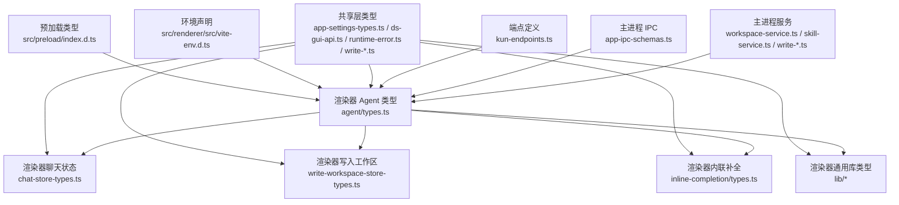
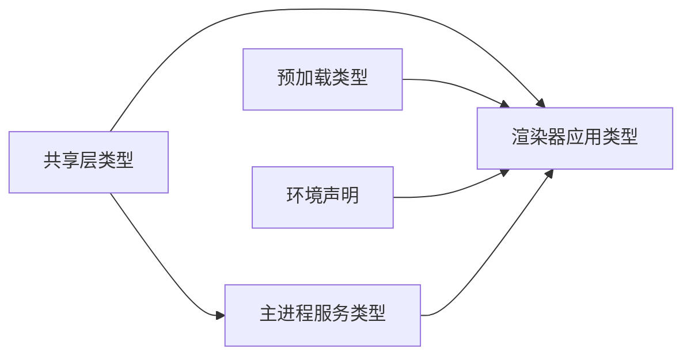

# 类型定义

<cite>
**本文引用的文件**
- [src/preload/index.d.ts](file://src/preload/index.d.ts)
- [src/renderer/src/vite-env.d.ts](file://src/renderer/src/vite-env.d.ts)
- [src/shared/app-settings-types.ts](file://src/shared/app-settings-types.ts)
- [src/shared/ds-gui-api.ts](file://src/shared/ds-gui-api.ts)
- [src/shared/kun-endpoints.ts](file://src/shared/kun-endpoints.ts)
- [src/shared/runtime-error.ts](file://src/shared/runtime-error.ts)
- [src/shared/write-inline-completion.ts](file://src/shared/write-inline-completion.ts)
- [src/shared/write-inline-edit.ts](file://src/shared/write-inline-edit.ts)
- [src/shared/write-markdown-resource.ts](file://src/shared/write-markdown-resource.ts)
- [src/shared/write-text-file.ts](file://src/shared/write-text-file.ts)
- [src/main/ipc/app-ipc-schemas.ts](file://src/main/ipc/app-ipc-schemas.ts)
- [src/main/services/workspace-service.ts](file://src/main/services/workspace-service.ts)
- [src/main/services/skill-service.ts](file://src/main/services/skill-service.ts)
- [src/main/services/write-export-service.ts](file://src/main/services/write-export-service.ts)
- [src/main/services/write-inline-completion-service.ts](file://src/main/services/write-inline-completion-service.ts)
- [src/main/services/write-retrieval-service.ts](file://src/main/services/write-retrieval-service.ts)
- [src/renderer/src/agent/types.ts](file://src/renderer/src/agent/types.ts)
- [src/renderer/src/store/chat-store-types.ts](file://src/renderer/src/store/chat-store-types.ts)
- [src/renderer/src/write/write-workspace-store-types.ts](file://src/renderer/src/write/write-workspace-store-types.ts)
- [src/renderer/src/write/inline-completion/types.ts](file://src/renderer/src/write/inline-completion/types.ts)
- [src/renderer/src/lib/editor-preferences.ts](file://src/renderer/src/lib/editor-preferences.ts)
- [src/renderer/src/lib/workspace-path.ts](file://src/renderer/src/lib/workspace-path.ts)
- [src/renderer/src/lib/thread-title.ts](file://src/renderer/src/lib/thread-title.ts)
- [src/renderer/src/lib/format-runtime-error.ts](file://src/renderer/src/lib/format-runtime-error.ts)
- [src/renderer/src/lib/open-workspace-path.ts](file://src/renderer/src/lib/open-workspace-path.ts)
- [src/renderer/src/lib/browser-storage.ts](file://src/renderer/src/lib/browser-storage.ts)
- [src/renderer/src/lib/code-highlighting.ts](file://src/renderer/src/lib/code-highlighting.ts)
- [src/renderer/src/lib/diff-stats.ts](file://src/renderer/src/lib/diff-stats.ts)
- [src/renderer/src/lib/format-relative-time.ts](file://src/renderer/src/lib/format-relative-time.ts)
- [src/renderer/src/lib/load-kun-diagnostics.ts](file://src/renderer/src/lib/load-kun-diagnostics.ts)
- [src/renderer/src/lib/skill-root-preference.ts](file://src/renderer/src/lib/skill-root-preference.ts)
- [src/renderer/src/lib/thread-fork-registry.ts](file://src/renderer/src/lib/thread-fork-registry.ts)
- [src/renderer/src/lib/thread-sidebar-visibility.ts](file://src/renderer/src/lib/thread-sidebar-visibility.ts)
- [src/renderer/src/lib/workspace-file-preview.ts](file://src/renderer/src/lib/workspace-file-preview.ts)
- [src/renderer/src/lib/workspace-label.ts](file://src/renderer/src/lib/workspace-label.ts)
- [src/renderer/src/lib/workspace-path.ts](file://src/renderer/src/lib/workspace-path.ts)
- [src/renderer/src/lib/file-reference-validation.ts](file://src/renderer/src/lib/file-reference-validation.ts)
- [src/renderer/src/lib/composer-file-references.ts](file://src/renderer/src/lib/composer-file-references.ts)
- [src/renderer/src/lib/image-attachment-upload.ts](file://src/renderer/src/lib/image-attachment-upload.ts)
- [src/renderer/src/lib/attachment-upload-availability.ts](file://src/renderer/src/lib/attachment-upload-availability.ts)
- [src/renderer/src/lib/dev-preview-detection.ts](file://src/renderer/src/lib/dev-preview-detection.ts)
- [src/renderer/src/lib/open-workspace-path.ts](file://src/renderer/src/lib/open-workspace-path.ts)
- [src/renderer/src/lib/skill-root-preference.ts](file://src/renderer/src/lib/skill-root-preference.ts)
- [src/renderer/src/lib/thread-fork-registry.ts](file://src/renderer/src/lib/thread-fork-registry.ts)
- [src/renderer/src/lib/thread-sidebar-visibility.ts](file://src/renderer/src/lib/thread-sidebar-visibility.ts)
- [src/renderer/src/lib/workspace-file-preview.ts](file://src/renderer/src/lib/workspace-file-preview.ts)
- [src/renderer/src/lib/workspace-label.ts](file://src/renderer/src/lib/workspace-label.ts)
- [src/renderer/src/lib/workspace-path.ts](file://src/renderer/src/lib/workspace-path.ts)
- [src/renderer/src/lib/file-reference-validation.ts](file://src/renderer/src/lib/file-reference-validation.ts)
- [src/renderer/src/lib/composer-file-references.ts](file://src/renderer/src/lib/composer-file-references.ts)
- [src/renderer/src/lib/image-attachment-upload.ts](file://src/renderer/src/lib/image-attachment-upload.ts)
- [src/renderer/src/lib/attachment-upload-availability.ts](file://src/renderer/src/lib/attachment-upload-availability.ts)
- [src/renderer/src/lib/dev-preview-detection.ts](file://src/renderer/src/lib/dev-preview-detection.ts)
- [src/renderer/src/lib/open-workspace-path.ts](file://src/renderer/src/lib/open-workspace-path.ts)
- [src/renderer/src/lib/skill-root-preference.ts](file://src/renderer/src/lib/skill-root-preference.ts)
- [src/renderer/src/lib/thread-fork-registry.ts](file://src/renderer/src/lib/thread-fork-registry.ts)
- [src/renderer/src/lib/thread-sidebar-visibility.ts](file://src/renderer/src/lib/thread-sidebar-visibility.ts)
- [src/renderer/src/lib/workspace-file-preview.ts](file://src/renderer/src/lib/workspace-file-preview.ts)
- [src/renderer/src/lib/workspace-label.ts](file://src/renderer/src/lib/workspace-label.ts)
- [src/renderer/src/lib/workspace-path.ts](file://src/renderer/src/lib/workspace-path.ts)
- [src/renderer/src/lib/file-reference-validation.ts](file://src/renderer/src/lib/file-reference-validation.ts)
- [src/renderer/src/lib/composer-file-references.ts](file://src/renderer/src/lib/composer-file-references.ts)
- [src/renderer/src/lib/image-attachment-upload.ts](file://src/renderer/src/lib/image-attachment-upload.ts)
- [src/renderer/src/lib/attachment-upload-availability.ts](file://src/renderer/src/lib/attachment-upload-availability.ts)
- [src/renderer/src/lib/dev-preview-detection.ts](file://src/renderer/src/lib/dev-preview-detection.ts)
- [src/renderer/src/lib/open-workspace-path.ts](file://src/renderer/src/lib/open-workspace-path.ts)
- [src/renderer/src/lib/skill-root-preference.ts](file://src/renderer/src/lib/skill-root-preference.ts)
- [src/renderer/src/lib/thread-fork-registry.ts](file://src/renderer/src/lib/thread-fork-registry.ts)
- [src/renderer/src/lib/thread-sidebar-visibility.ts](file://src/renderer/src/lib/thread-sidebar-visibility.ts)
- [src/renderer/src/lib/workspace-file-preview.ts](file://src/renderer/src/lib/workspace-file-preview.ts)
- [src/renderer/src/lib/workspace-label.ts](file://src/renderer/src/lib/workspace-label.ts)
- [src/renderer/src/lib/workspace-path.ts](file://src/renderer/src/lib/workspace-path.ts)
- [src/renderer/src/lib/file-reference-validation.ts](file://src/renderer/src/lib/file-reference-validation.ts)
- [src/renderer/src/lib/composer-file-references.ts](file://src/renderer/src/lib/composer-file-references.ts)
- [src/renderer/src/lib/image-attachment-upload.ts](file://src/renderer/src/lib/image-attachment-upload.ts)
- [src/renderer/src/lib/attachment-upload-availability.ts](file://src/renderer/src/lib/attachment-upload-availability.ts)
- [src/renderer/src/lib/dev-preview-detection.ts](file://src/renderer/src/lib/dev-preview-detection.ts)
- [src/renderer/src/lib/open-workspace-path.ts](file://src/renderer/src/lib/open-workspace-path.ts)
- [src/renderer/src/lib/skill-root-preference.ts](file://src/renderer/src/lib/skill-root-preference.ts)
- [src/renderer/src/lib/thread-fork-registry.ts](file://src/renderer/src/lib/thread-fork-registry.ts)
- [src/renderer/src/lib/thread-sidebar-visibility.ts](file://src/renderer/src/lib/thread-sidebar-visibility.ts)
- [src/renderer/src/lib/workspace-file-preview.ts](file://src/renderer/src/lib/workspace-file-preview.ts)
- [src/renderer/src/lib/workspace-label.ts](file://src/renderer/src/lib/workspace-label.ts)
- [src/renderer/src/lib/workspace-path.ts](file://src/renderer/src/lib/workspace-path.ts)
- [src/renderer/src/lib/file-reference-validation.ts](file://src/renderer/src/lib/file-reference-validation.ts)
- [src/renderer/src/lib/composer-file-references.ts](file://src/renderer/src/lib/composer-file-references.ts)
- [src/renderer/src/lib/image-attachment-upload.ts](file://src/renderer/src/lib/image-attachment-upload.ts)
- [src/renderer/src/lib/attachment-upload-availability.ts](file://src/renderer/src/lib/attachment-upload-availability.ts)
- [src/renderer/src/lib/dev-preview-detection.ts](file://src/renderer/src/lib/dev-preview-detection.ts)
- [src/renderer/src/lib/open-workspace-path.ts](file://src/renderer/src/lib/open-workspace-path.ts)
- [src/renderer/src/lib/skill-root-preference.ts](file://src/renderer/src/lib/skill-root-preference.ts)
- [src/renderer/src/lib/thread-fork-registry.ts](file://src/renderer/src/lib/thread-fork-registry.ts)
- [src/renderer/src/lib/thread-sidebar-visibility.ts](file://src/renderer/src/lib/thread-sidebar-visibility.ts)
- [src/renderer/src/lib/workspace-file-preview.ts](file://src/renderer/src/lib/workspace-file-preview.ts)
- [src/renderer/src/lib/workspace-label.ts](file://src/renderer/src/lib/workspace-label.ts)
- [src/renderer/src/lib/workspace-path.ts](file://src/renderer/src/lib/workspace-path.ts)
- [src/renderer/src/lib/file-reference-validation.ts](file://src/renderer/src/lib/file-reference-validation.ts)
- [src/renderer/src/lib/composer-file-references.ts](file://src/renderer/src/lib/composer-file-references.ts)
- [src/renderer/src/lib/image-attachment-upload.ts](file://src/renderer/src/lib/image-attachment-upload.ts)
- [src/renderer/src/lib/attachment-upload-availability.ts](file://src/renderer/src/lib/attachment-upload-availability.ts)
- [src/renderer/src/lib/dev-preview-detection.ts](file://src/renderer/src/lib/dev-preview-detection.ts)
- [src/renderer/src/lib/open-workspace-path.ts](file://src/renderer/src/lib/open-workspace-path.ts)
- [src/renderer/src/lib/skill-root-preference.ts](file://src/renderer/src/lib/skill-root-preference.ts)
- [src/renderer/src/lib/thread-fork-registry.ts](file://src/renderer/src/lib/thread-fork-registry.ts)
- [src/renderer/src/lib/thread-sidebar-visibility.ts](file://src/renderer/src/lib/thread-sidebar-visibility.ts)
- [src/renderer/src/lib/workspace-file-preview.ts](file://src/renderer/src/lib/workspace-file-preview.ts)
- [src/renderer/src/lib/workspace-label.ts](file://src/renderer/src/lib/workspace-label.ts......
</cite>

## 目录
1. [引言](#引言)
2. [项目结构](#项目结构)
3. [核心组件](#核心组件)
4. [架构总览](#架构总览)
5. [详细组件分析](#详细组件分析)
6. [依赖分析](#依赖分析)
7. [性能考虑](#性能考虑)
8. [故障排查指南](#故障排查指南)
9. [结论](#结论)
10. [附录](#附录)

## 引言
本文件系统性梳理 DeepSeek GUI 的 TypeScript 类型定义，覆盖通用类型别名、接口、枚举、联合类型与泛型约束；阐明各类型的用途、取值范围、约束条件与继承关系；解释类型在编译期的安全检查与运行时转换策略；总结类型推导规则、兼容性与断言的使用场景；并给出类型模块化组织、导入导出与文档生成建议。目标是为开发者提供准确的类型参考与类型安全编程指导。

## 项目结构
本项目采用多包/多模块并存的结构：主进程（Electron 主进程）、渲染进程（React 应用）、共享层（跨进程/模块复用的类型与工具）、Kun 核心库（后端适配与领域模型）。类型分布主要集中在以下区域：
- 预加载脚本与环境声明：预加载层的全局类型与模块声明
- 渲染器应用：Agent 合同与映射、聊天状态类型、写入工作区类型、内联补全类型、通用库函数类型
- 共享层：应用设置、DS GUI API、运行时错误、写入相关资源与文本文件等
- 主进程服务：IPC Schema、工作区服务、技能服务、写入导出/补全/检索服务

图表来源
- [src/preload/index.d.ts](file://src/preload/index.d.ts)
- [src/renderer/src/vite-env.d.ts](file://src/renderer/src/vite-env.d.ts)
- [src/shared/app-settings-types.ts](file://src/shared/app-settings-types.ts)
- [src/shared/ds-gui-api.ts](file://src/shared/ds-gui-api.ts)
- [src/shared/kun-endpoints.ts](file://src/shared/kun-endpoints.ts)
- [src/shared/runtime-error.ts](file://src/shared/runtime-error.ts)
- [src/shared/write-inline-completion.ts](file://src/shared/write-inline-completion.ts)
- [src/shared/write-inline-edit.ts](file://src/shared/write-inline-edit.ts)
- [src/shared/write-markdown-resource.ts](file://src/shared/write-markdown-resource.ts)
- [src/shared/write-text-file.ts](file://src/shared/write-text-file.ts)
- [src/main/ipc/app-ipc-schemas.ts](file://src/main/ipc/app-ipc-schemas.ts)
- [src/main/services/workspace-service.ts](file://src/main/services/workspace-service.ts)
- [src/main/services/skill-service.ts](file://src/main/services/skill-service.ts)
- [src/main/services/write-export-service.ts](file://src/main/services/write-export-service.ts)
- [src/main/services/write-inline-completion-service.ts](file://src/main/services/write-inline-completion-service.ts)
- [src/main/services/write-retrieval-service.ts](file://src/main/services/write-retrieval-service.ts)
- [src/renderer/src/agent/types.ts](file://src/renderer/src/agent/types.ts)
- [src/renderer/src/store/chat-store-types.ts](file://src/renderer/src/store/chat-store-types.ts)
- [src/renderer/src/write/write-workspace-store-types.ts](file://src/renderer/src/write/write-workspace-store-types.ts)
- [src/renderer/src/write/inline-completion/types.ts](file://src/renderer/src/write/inline-completion/types.ts)
- [src/renderer/src/lib/editor-preferences.ts](file://src/renderer/src/lib/editor-preferences.ts)
- [src/renderer/src/lib/workspace-path.ts](file://src/renderer/src/lib/workspace-path.ts)
- [src/renderer/src/lib/thread-title.ts](file://src/renderer/src/lib/thread-title.ts)
- [src/renderer/src/lib/format-runtime-error.ts](file://src/renderer/src/lib/format-runtime-error.ts)
- [src/renderer/src/lib/open-workspace-path.ts](file://src/renderer/src/lib/open-workspace-path.ts)
- [src/renderer/src/lib/browser-storage.ts](file://src/renderer/src/lib/browser-storage.ts)
- [src/renderer/src/lib/code-highlighting.ts](file://src/renderer/src/lib/code-highlighting.ts)
- [src/renderer/src/lib/diff-stats.ts](file://src/renderer/src/lib/diff-stats.ts)
- [src/renderer/src/lib/format-relative-time.ts](file://src/renderer/src/lib/format-relative-time.ts)
- [src/renderer/src/lib/load-kun-diagnostics.ts](file://src/renderer/src/lib/load-kun-diagnostics.ts)
- [src/renderer/src/lib/skill-root-preference.ts](file://src/renderer/src/lib/skill-root-preference.ts)
- [src/renderer/src/lib/thread-fork-registry.ts](file://src/renderer/src/lib/thread-fork-registry.ts)
- [src/renderer/src/lib/thread-sidebar-visibility.ts](file://src/renderer/src/lib/thread-sidebar-visibility.ts)
- [src/renderer/src/lib/workspace-file-preview.ts](file://src/renderer/src/lib/workspace-file-preview.ts)
- [src/renderer/src/lib/workspace-label.ts](file://src/renderer/src/lib/workspace-label.ts)

章节来源
- [src/preload/index.d.ts](file://src/preload/index.d.ts)
- [src/renderer/src/vite-env.d.ts](file://src/renderer/src/vite-env.d.ts)

## 核心组件
本节聚焦于关键类型模块，按“用途—取值范围—约束—继承/实现关系”维度进行说明，并标注“章节来源”。

- 预加载与环境声明
  - 预加载类型：用于声明主进程与渲染进程间通信的全局类型与模块声明，确保 TS 在编译期对 IPC 调用进行类型校验。
  - 环境声明：为 React 模块与构建工具声明类型，保证开发体验与类型推断稳定。
  - 章节来源
    - [src/preload/index.d.ts](file://src/preload/index.d.ts)
    - [src/renderer/src/vite-env.d.ts](file://src/renderer/src/vite-env.d.ts)

- 应用设置类型
  - 用途：统一描述 GUI 应用的配置项、默认值、规范化流程与提示文案。
  - 取值范围：布尔、字符串、数值、枚举集合、对象结构等。
  - 约束：通过类型守卫与运行时校验确保配置合法；支持分组与条件显示。
  - 继承/实现：以接口/类型别名组合表达配置树，避免重复定义。
  - 章节来源
    - [src/shared/app-settings-types.ts](file://src/shared/app-settings-types.ts)

- DS GUI API 类型
  - 用途：定义与后端或外部服务交互的 API 请求/响应结构，确保调用方与被调用方契约一致。
  - 取值范围：请求体、查询参数、响应体、错误码等。
  - 约束：通过严格字段与可选字段划分，结合编译期检查减少运行时异常。
  - 章节来源
    - [src/shared/ds-gui-api.ts](file://src/shared/ds-gui-api.ts)

- 运行时错误类型
  - 用途：统一错误结构，便于前端展示与日志追踪。
  - 取值范围：错误码、消息、时间戳、上下文信息等。
  - 约束：错误分类与序列化规则明确，避免歧义。
  - 章节来源
    - [src/shared/runtime-error.ts](file://src/shared/runtime-error.ts)

- 写入相关类型
  - 写入内联补全：定义补全上下文、策略、反馈与结果结构。
  - 写入内联编辑：定义编辑指令、变更范围与冲突处理。
  - Markdown 资源：定义资源引用、解析与渲染所需的数据结构。
  - 文本文件：定义文件读写、差异与预览结构。
  - 章节来源
    - [src/shared/write-inline-completion.ts](file://src/shared/write-inline-completion.ts)
    - [src/shared/write-inline-edit.ts](file://src/shared/write-inline-edit.ts)
    - [src/shared/write-markdown-resource.ts](file://src/shared/write-markdown-resource.ts)
    - [src/shared/write-text-file.ts](file://src/shared/write-text-file.ts)

- 主进程 IPC 与服务类型
  - IPC Schema：定义主进程与渲染进程之间的消息协议，含请求/响应、事件流等。
  - 工作区服务：定义工作区路径、标签、文件预览等类型。
  - 技能服务：定义技能注册、执行与结果类型。
  - 写入导出/补全/检索服务：定义任务、参数、进度与结果类型。
  - 章节来源
    - [src/main/ipc/app-ipc-schemas.ts](file://src/main/ipc/app-ipc-schemas.ts)
    - [src/main/services/workspace-service.ts](file://src/main/services/workspace-service.ts)
    - [src/main/services/skill-service.ts](file://src/main/services/skill-service.ts)
    - [src/main/services/write-export-service.ts](file://src/main/services/write-export-service.ts)
    - [src/main/services/write-inline-completion-service.ts](file://src/main/services/write-inline-completion-service.ts)
    - [src/main/services/write-retrieval-service.ts](file://src/main/services/write-retrieval-service.ts)

- 渲染器应用类型
  - Agent 合同与映射：定义线程、回合、附件、内存等实体类型与映射规则。
  - 聊天状态类型：定义会话、线程、时间线、侧边栏等状态结构。
  - 写入工作区类型：定义文件树、编辑器、拆分视图、滚动同步等类型。
  - 内联补全类型：定义上下文、策略、提示词与结果类型。
  - 通用库函数类型：定义偏好设置、路径、标题、错误格式化、存储、高亮、差异统计、相对时间、诊断、技能根目录、线程派生注册表、侧边栏可见性、文件预览、标签等类型。
  - 章节来源
    - [src/renderer/src/agent/types.ts](file://src/renderer/src/agent/types.ts)
    - [src/renderer/src/store/chat-store-types.ts](file://src/renderer/src/store/chat-store-types.ts)
    - [src/renderer/src/write/write-workspace-store-types.ts](file://src/renderer/src/write/write-workspace-store-types.ts)
    - [src/renderer/src/write/inline-completion/types.ts](file://src/renderer/src/write/inline-completion/types.ts)
    - [src/renderer/src/lib/editor-preferences.ts](file://src/renderer/src/lib/editor-preferences.ts)
    - [src/renderer/src/lib/workspace-path.ts](file://src/renderer/src/lib/workspace-path.ts)
    - [src/renderer/src/lib/thread-title.ts](file://src/renderer/src/lib/thread-title.ts)
    - [src/renderer/src/lib/format-runtime-error.ts](file://src/renderer/src/lib/format-runtime-error.ts)
    - [src/renderer/src/lib/open-workspace-path.ts](file://src/renderer/src/lib/open-workspace-path.ts)
    - [src/renderer/src/lib/browser-storage.ts](file://src/renderer/src/lib/browser-storage.ts)
    - [src/renderer/src/lib/code-highlighting.ts](file://src/renderer/src/lib/code-highlighting.ts)
    - [src/renderer/src/lib/diff-stats.ts](file://src/renderer/src/lib/diff-stats.ts)
    - [src/renderer/src/lib/format-relative-time.ts](file://src/renderer/src/lib/format-relative-time.ts)
    - [src/renderer/src/lib/load-kun-diagnostics.ts](file://src/renderer/src/lib/load-kun-diagnostics.ts)
    - [src/renderer/src/lib/skill-root-preference.ts](file://src/renderer/src/lib/skill-root-preference.ts)
    - [src/renderer/src/lib/thread-fork-registry.ts](file://src/renderer/src/lib/thread-fork-registry.ts)
    - [src/renderer/src/lib/thread-sidebar-visibility.ts](file://src/renderer/src/lib/thread-sidebar-visibility.ts)
    - [src/renderer/src/lib/workspace-file-preview.ts](file://src/renderer/src/lib/workspace-file-preview.ts)
    - [src/renderer/src/lib/workspace-label.ts](file://src/renderer/src/lib/workspace-label.ts)

## 架构总览
下图展示类型在系统中的分布与依赖关系，强调“共享层”作为桥梁连接“主进程服务”与“渲染器应用”，以及“预加载/环境声明”对类型安全的基础支撑。

图表来源
- [src/preload/index.d.ts](file://src/preload/index.d.ts)
- [src/renderer/src/vite-env.d.ts](file://src/renderer/src/vite-env.d.ts)
- [src/shared/app-settings-types.ts](file://src/shared/app-settings-types.ts)
- [src/shared/ds-gui-api.ts](file://src/shared/ds-gui-api.ts)
- [src/shared/kun-endpoints.ts](file://src/shared/kun-endpoints.ts)
- [src/shared/runtime-error.ts](file://src/shared/runtime-error.ts)
- [src/shared/write-inline-completion.ts](file://src/shared/write-inline-completion.ts)
- [src/shared/write-inline-edit.ts](file://src/shared/write-inline-edit.ts)
- [src/shared/write-markdown-resource.ts](file://src/shared/write-markdown-resource.ts)
- [src/shared/write-text-file.ts](file://src/shared/write-text-file.ts)
- [src/main/ipc/app-ipc-schemas.ts](file://src/main/ipc/app-ipc-schemas.ts)
- [src/main/services/workspace-service.ts](file://src/main/services/workspace-service.ts)
- [src/main/services/skill-service.ts](file://src/main/services/skill-service.ts)
- [src/main/services/write-export-service.ts](file://src/main/services/write-export-service.ts)
- [src/main/services/write-inline-completion-service.ts](file://src/main/services/write-inline-completion-service.ts)
- [src/main/services/write-retrieval-service.ts](file://src/main/services/write-retrieval-service.ts)
- [src/renderer/src/agent/types.ts](file://src/renderer/src/agent/types.ts)
- [src/renderer/src/store/chat-store-types.ts](file://src/renderer/src/store/chat-store-types.ts)
- [src/renderer/src/write/write-workspace-store-types.ts](file://src/renderer/src/write/write-workspace-store-types.ts)
- [src/renderer/src/write/inline-completion/types.ts](file://src/renderer/src/write/inline-completion/types.ts)
- [src/renderer/src/lib/editor-preferences.ts](file://src/renderer/src/lib/editor-preferences.ts)
- [src/renderer/src/lib/workspace-path.ts](file://src/renderer/src/lib/workspace-path.ts)
- [src/renderer/src/lib/thread-title.ts](file://src/renderer/src/lib/thread-title.ts)
- [src/renderer/src/lib/format-runtime-error.ts](file://src/renderer/src/lib/format-runtime-error.ts)
- [src/renderer/src/lib/open-workspace-path.ts](file://src/renderer/src/lib/open-workspace-path.ts)
- [src/renderer/src/lib/browser-storage.ts](file://src/renderer/src/lib/browser-storage.ts)
- [src/renderer/src/lib/code-highlighting.ts](file://src/renderer/src/lib/code-highlighting.ts)
- [src/renderer/src/lib/diff-stats.ts](file://src/renderer/src/lib/diff-stats.ts)
- [src/renderer/src/lib/format-relative-time.ts](file://src/renderer/src/lib/format-relative-time.ts)
- [src/renderer/src/lib/load-kun-diagnostics.ts](file://src/renderer/src/lib/load-kun-diagnostics.ts)
- [src/renderer/src/lib/skill-root-preference.ts](file://src/renderer/src/lib/skill-root-preference.ts)
- [src/renderer/src/lib/thread-fork-registry.ts](file://src/renderer/src/lib/thread-fork-registry.ts)
- [src/renderer/src/lib/thread-sidebar-visibility.ts](file://src/renderer/src/lib/thread-sidebar-visibility.ts)
- [src/renderer/src/lib/workspace-file-preview.ts](file://src/renderer/src/lib/workspace-file-preview.ts)
- [src/renderer/src/lib/workspace-label.ts](file://src/renderer/src/lib/workspace-label.ts)

## 详细组件分析

### 预加载与环境声明
- 设计要点
  - 预加载类型：声明主进程暴露给渲染进程的全局方法签名与返回类型，确保 IPC 调用在编译期即可被类型系统验证。
  - 环境声明：为 React 模块与构建工具声明类型，避免“未声明模块”的编译警告，提升 DX。
- 安全性与编译期验证
  - 通过严格的方法签名与返回类型，减少运行时反射调用带来的不确定性。
- 运行时转换
  - 预加载层不直接参与数据转换逻辑，但其类型声明为上层服务提供了“契约”基础。
- 章节来源
  - [src/preload/index.d.ts](file://src/preload/index.d.ts)
  - [src/renderer/src/vite-env.d.ts](file://src/renderer/src/vite-env.d.ts)

### 应用设置类型
- 设计要点
  - 使用接口/类型别名组合表达配置树，避免重复定义；通过枚举限定取值范围；通过可选字段区分默认与覆盖。
  - 提供默认值与规范化流程，确保配置在进入业务逻辑前即满足约束。
- 安全性与编译期验证
  - 编译期检查配置键是否存在、类型是否匹配、是否遗漏必填项。
- 运行时转换
  - 结合运行时校验与默认值合并，保证配置合法且完备。
- 章节来源
  - [src/shared/app-settings-types.ts](file://src/shared/app-settings-types.ts)

### DS GUI API 类型
- 设计要点
  - 明确请求/响应结构，区分成功与错误分支；为分页、过滤、排序等场景提供统一类型。
  - 对外暴露的 API 类型应尽量与后端契约保持一致，减少映射成本。
- 安全性与编译期验证
  - 通过严格字段与可选字段划分，降低运行时访问空值的风险。
- 运行时转换
  - 建议在服务层进行 DTO 到领域模型的转换，类型声明为转换提供“蓝图”。
- 章节来源
  - [src/shared/ds-gui-api.ts](file://src/shared/ds-gui-api.ts)

### 运行时错误类型
- 设计要点
  - 统一错误结构，包含错误码、消息、时间戳与上下文；支持序列化与反序列化。
  - 错误分类清晰，便于前端展示与日志追踪。
- 安全性与编译期验证
  - 编译期强制错误结构一致性，避免遗漏关键字段。
- 运行时转换
  - 错误对象在服务层生成，在 UI 层消费；类型声明确保传递过程无歧义。
- 章节来源
  - [src/shared/runtime-error.ts](file://src/shared/runtime-error.ts)

### 写入相关类型
- 写入内联补全
  - 上下文：包含光标位置、选区、文件内容、语言模式等。
  - 策略：定义补全模式（如基于最近编辑、RAG 等）。
  - 反馈：定义用户反馈与质量度量。
  - 结果：定义补全片段、插入位置与冲突处理。
- 写入内联编辑
  - 指令：定义编辑意图（插入、替换、删除、格式化等）。
  - 变更范围：定义受影响的行区间与字符范围。
  - 冲突处理：定义与现有内容的合并策略。
- Markdown 资源
  - 资源引用：定义图片、链接、代码块等资源的元数据。
  - 解析与渲染：定义解析后的节点结构与渲染所需属性。
- 文本文件
  - 读写：定义文件读取、写入、追加与原子写入的结构。
  - 差异：定义差异计算与可视化所需的数据结构。
  - 预览：定义文件预览窗口的参数与状态。
- 章节来源
  - [src/shared/write-inline-completion.ts](file://src/shared/write-inline-completion.ts)
  - [src/shared/write-inline-edit.ts](file://src/shared/write-inline-edit.ts)
  - [src/shared/write-markdown-resource.ts](file://src/shared/write-markdown-resource.ts)
  - [src/shared/write-text-file.ts](file://src/shared/write-text-file.ts)

### 主进程 IPC 与服务类型
- IPC Schema
  - 定义主进程与渲染进程之间的消息协议，含请求/响应、事件流、错误传播等。
  - 通过严格的消息结构，确保跨进程通信的类型安全。
- 工作区服务
  - 路径与标签：定义工作区路径、标签与选择状态。
  - 文件预览：定义文件预览窗口的参数与状态。
- 技能服务
  - 技能注册：定义技能元数据、参数与返回类型。
  - 执行结果：定义执行状态、输出与错误。
- 写入导出/补全/检索服务
  - 任务：定义任务参数、进度与结果。
  - 参数：定义策略、阈值与开关。
  - 结果：定义导出文件、补全片段、检索命中等。
- 章节来源
  - [src/main/ipc/app-ipc-schemas.ts](file://src/main/ipc/app-ipc-schemas.ts)
  - [src/main/services/workspace-service.ts](file://src/main/services/workspace-service.ts)
  - [src/main/services/skill-service.ts](file://src/main/services/skill-service.ts)
  - [src/main/services/write-export-service.ts](file://src/main/services/write-export-service.ts)
  - [src/main/services/write-inline-completion-service.ts](file://src/main/services/write-inline-completion-service.ts)
  - [src/main/services/write-retrieval-service.ts](file://src/main/services/write-retrieval-service.ts)

### 渲染器应用类型
- Agent 合同与映射
  - 实体：线程、回合、附件、内存等。
  - 映射：定义从后端到前端的映射规则与转换函数类型。
- 聊天状态类型
  - 会话：定义会话元数据、使用量与状态。
  - 线程：定义线程列表、当前线程与切换逻辑。
  - 时间线：定义消息、工具调用、卡片等元素的结构。
  - 侧边栏：定义侧边栏可见性与内容分区。
- 写入工作区类型
  - 文件树：定义文件与目录的层级结构与状态。
  - 编辑器：定义编辑器实例、光标与选区。
  - 拆分视图：定义左右或上下布局的参数与同步策略。
  - 滚动同步：定义滚动位置与视口同步逻辑。
- 内联补全类型
  - 上下文：定义补全上下文与策略参数。
  - 提示词：定义提示模板与变量替换。
  - 结果：定义补全片段与冲突处理。
- 通用库函数类型
  - 偏好设置：定义编辑器偏好、主题、字体等。
  - 路径：定义工作区路径、相对路径与绝对路径转换。
  - 标题：定义线程标题生成规则。
  - 错误格式化：定义错误消息的本地化与展示格式。
  - 存储：定义浏览器存储的键值结构。
  - 高亮：定义语法高亮的规则与主题。
  - 差异统计：定义差异统计与可视化参数。
  - 相对时间：定义时间格式化与本地化。
  - 诊断：定义诊断信息的加载与展示。
  - 技能根目录：定义技能根目录的偏好与解析。
  - 线程派生注册表：定义线程派生与回滚的注册表结构。
  - 侧边栏可见性：定义侧边栏的显示/隐藏策略。
  - 文件预览：定义文件预览窗口的参数与状态。
  - 标签：定义工作区标签与颜色。
- 章节来源
  - [src/renderer/src/agent/types.ts](file://src/renderer/src/agent/types.ts)
  - [src/renderer/src/store/chat-store-types.ts](file://src/renderer/src/store/chat-store-types.ts)
  - [src/renderer/src/write/write-workspace-store-types.ts](file://src/renderer/src/write/write-workspace-store-types.ts)
  - [src/renderer/src/write/inline-completion/types.ts](file://src/renderer/src/write/inline-completion/types.ts)
  - [src/renderer/src/lib/editor-preferences.ts](file://src/renderer/src/lib/editor-preferences.ts)
  - [src/renderer/src/lib/workspace-path.ts](file://src/renderer/src/lib/workspace-path.ts)
  - [src/renderer/src/lib/thread-title.ts](file://src/renderer/src/lib/thread-title.ts)
  - [src/renderer/src/lib/format-runtime-error.ts](file://src/renderer/src/lib/format-runtime-error.ts)
  - [src/renderer/src/lib/open-workspace-path.ts](file://src/renderer/src/lib/open-workspace-path.ts)
  - [src/renderer/src/lib/browser-storage.ts](file://src/renderer/src/lib/browser-storage.ts)
  - [src/renderer/src/lib/code-highlighting.ts](file://src/renderer/src/lib/code-highlighting.ts)
  - [src/renderer/src/lib/diff-stats.ts](file://src/renderer/src/lib/diff-stats.ts)
  - [src/renderer/src/lib/format-relative-time.ts](file://src/renderer/src/lib/format-relative-time.ts)
  - [src/renderer/src/lib/load-kun-diagnostics.ts](file://src/renderer/src/lib/load-kun-diagnostics.ts)
  - [src/renderer/src/lib/skill-root-preference.ts](file://src/renderer/src/lib/skill-root-preference.ts)
  - [src/renderer/src/lib/thread-fork-registry.ts](file://src/renderer/src/lib/thread-fork-registry.ts)
  - [src/renderer/src/lib/thread-sidebar-visibility.ts](file://src/renderer/src/lib/thread-sidebar-visibility.ts)
  - [src/renderer/src/lib/workspace-file-preview.ts](file://src/renderer/src/lib/workspace-file-preview.ts)
  - [src/renderer/src/lib/workspace-label.ts](file://src/renderer/src/lib/workspace-label.ts)

## 依赖分析
- 模块耦合
  - 共享层作为“契约层”，向上游渲染器与主进程服务提供稳定的类型接口，降低耦合度。
  - 渲染器应用通过“类型桥接”与共享层交互，避免直接依赖主进程细节。
- 外部依赖
  - React、Electron、第三方库的类型声明由环境声明与预加载类型提供。
- 循环依赖
  - 类型层面通过“仅导出类型”的方式避免循环引用；若出现循环，建议拆分到独立模块或引入中间层。
- 接口契约
  - IPC Schema 与 API 类型定义了严格的契约，任何一方变更需同步更新类型定义。

图表来源
- [src/shared/app-settings-types.ts](file://src/shared/app-settings-types.ts)
- [src/shared/ds-gui-api.ts](file://src/shared/ds-gui-api.ts)
- [src/shared/runtime-error.ts](file://src/shared/runtime-error.ts)
- [src/renderer/src/agent/types.ts](file://src/renderer/src/agent/types.ts)
- [src/main/ipc/app-ipc-schemas.ts](file://src/main/ipc/app-ipc-schemas.ts)
- [src/preload/index.d.ts](file://src/preload/index.d.ts)
- [src/renderer/src/vite-env.d.ts](file://src/renderer/src/vite-env.d.ts)

章节来源
- [src/shared/app-settings-types.ts](file://src/shared/app-settings-types.ts)
- [src/shared/ds-gui-api.ts](file://src/shared/ds-gui-api.ts)
- [src/shared/runtime-error.ts](file://src/shared/runtime-error.ts)
- [src/renderer/src/agent/types.ts](file://src/renderer/src/agent/types.ts)
- [src/main/ipc/app-ipc-schemas.ts](file://src/main/ipc/app-ipc-schemas.ts)
- [src/preload/index.d.ts](file://src/preload/index.d.ts)
- [src/renderer/src/vite-env.d.ts](file://src/renderer/src/vite-env.d.ts)

## 性能考虑
- 类型推导与编译期优化
  - 将复杂类型拆分为小而专一的类型别名与接口，有助于 TS 更快地进行推导与缓存。
  - 避免在类型中嵌套过深的交叉/联合，减少编译时间。
- 运行时开销
  - 类型声明本身不产生运行时开销；但在服务层进行 DTO 到领域模型的转换时，应避免不必要的拷贝与重复计算。
- 可维护性
  - 通过模块化组织类型，便于增量维护与重构；为常用类型提供集中导出，减少导入路径长度。

## 故障排查指南
- 常见问题
  - “类型不匹配”：检查共享层与渲染器/主进程的类型是否一致；确认 IPC Schema 是否同步更新。
  - “缺失字段”：检查可选字段与必填字段的划分；确保运行时校验覆盖所有分支。
  - “循环引用”：拆分类型到独立模块或引入中间层；仅导出类型而非实现。
- 定位手段
  - 使用 IDE 的“转到定义/转到实现”功能快速定位类型来源。
  - 在 CI 中启用严格模式，提前发现类型问题。
- 章节来源
  - [src/shared/runtime-error.ts](file://src/shared/runtime-error.ts)
  - [src/main/ipc/app-ipc-schemas.ts](file://src/main/ipc/app-ipc-schemas.ts)
  - [src/renderer/src/agent/types.ts](file://src/renderer/src/agent/types.ts)

## 结论
本文件系统性梳理了 DeepSeek GUI 的 TypeScript 类型定义，明确了各模块的职责边界与类型契约。通过共享层的“契约化”设计与渲染器/主进程的“类型桥接”，项目实现了良好的类型安全性与可维护性。建议在后续迭代中持续完善类型文档、强化运行时校验，并保持类型与契约的同步演进。

## 附录
- 类型模块化组织建议
  - 将类型按功能域拆分（如 settings、agent、chat、write、ipc 等），并在各域内提供 index 导出，便于集中导入。
  - 对于跨域共享的类型，放入 shared 目录并明确版本与变更记录。
- 类型导入导出
  - 优先使用命名空间或集中导出，减少深层相对路径；对第三方类型声明，统一放置在环境声明文件中。
- 类型文档生成
  - 使用工具（如 typedoc）自动生成 API 文档；在 PR 中要求补充类型注释与示例。
- 类型安全编程指导
  - 优先使用严格字段与可选字段划分；在服务层进行 DTO 转换；对用户输入进行运行时校验；对错误进行统一建模与格式化。