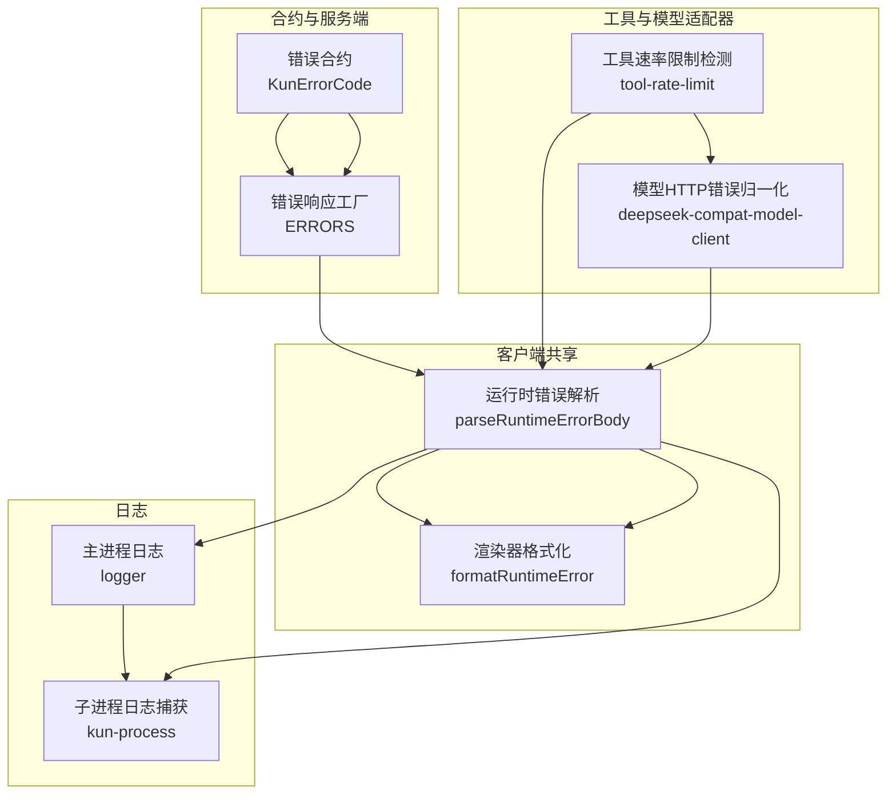
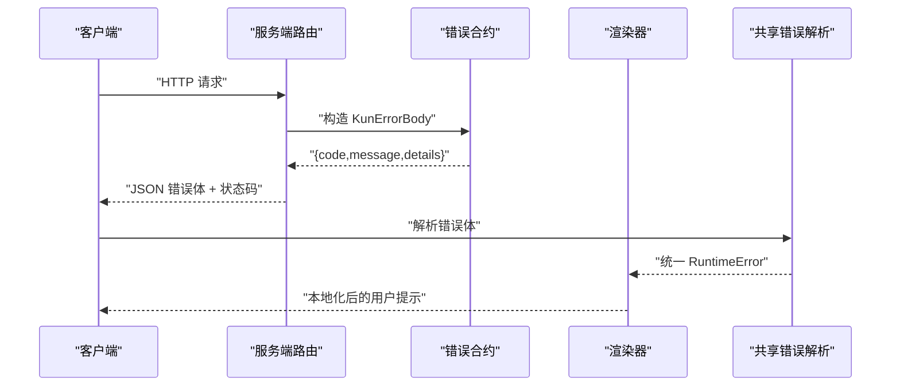
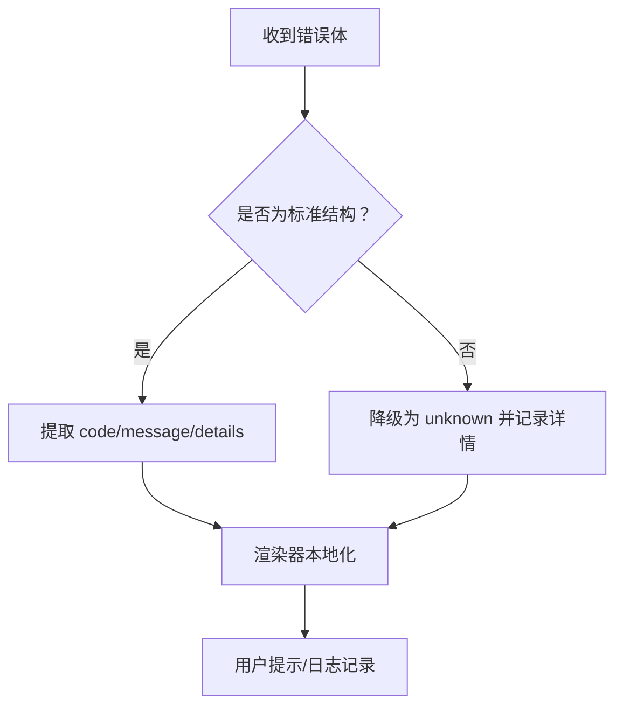

# 错误码

<cite>
**本文引用的文件**
- [runtime-error.ts](file://src/shared/runtime-error.ts)
- [errors.ts](file://kun/src/contracts/errors.ts)
- [runtime-error.ts（服务端）](file://kun/src/server/routes/runtime-error.ts)
- [format-runtime-error.ts](file://src/renderer/src/lib/format-runtime-error.ts)
- [tool-rate-limit.ts](file://kun/src/adapters/tool/tool-rate-limit.ts)
- [deepseek-compat-model-client.ts](file://kun/src/adapters/model/deepseek-compat-model-client.ts)
- [i18n.ts](file://src/renderer/src/i18n.ts)
- [logger.ts](file://src/main/logger.ts)
- [kun-process.ts](file://src/main/kun-process.ts)
- [read-json-body.test.ts](file://kun/tests/read-json-body.test.ts)
- [contracts.test.ts](file://kun/tests/contracts.test.ts)
</cite>

## 目录
1. [简介](#简介)
2. [项目结构与错误码分布](#项目结构与错误码分布)
3. [核心组件与错误码类型](#核心组件与错误码类型)
4. [架构总览](#架构总览)
5. [详细错误码分类与说明](#详细错误码分类与说明)
6. [依赖关系与数据流分析](#依赖关系与数据流分析)
7. [性能与可维护性考量](#性能与可维护性考量)
8. [故障排查与恢复策略](#故障排查与恢复策略)
9. [结论](#结论)
10. [附录：错误码清单与映射](#附录错误码清单与映射)

## 简介
本文件系统化梳理 DeepSeek GUI 项目中的错误码体系，覆盖 HTTP 状态码、业务错误码、工具调用错误、模型调用错误、存储访问错误等类别。文档从设计原则、命名规范、编号规则、分类体系出发，结合代码实现与测试用例，给出每个错误码的含义、触发条件、错误消息格式、处理建议，并补充国际化支持、错误日志记录、错误恢复策略、版本演进与向后兼容、废弃错误码迁移指南等内容，帮助开发者快速定位问题并进行调试。

## 项目结构与错误码分布
错误码在项目中主要分布在以下位置：
- 合约层：统一的结构化错误体定义，确保前后端一致的错误契约。
- 服务端路由：标准化返回结构与 HTTP 状态码映射。
- 客户端共享模块：统一解析运行时错误体，兼容旧版错误码。
- 渲染器：对错误进行本地化与用户提示。
- 工具适配器：对工具执行结果进行速率限制检测与归一化。
- 模型适配器：对模型请求失败进行探测与错误码归一化。
- 日志系统：统一记录错误日志，便于追踪与审计。

**图表来源**
- [errors.ts:11-37](file://kun/src/contracts/errors.ts#L11-L37)
- [runtime-error.ts（服务端）:13-32](file://kun/src/server/routes/runtime-error.ts#L13-L32)
- [runtime-error.ts:102-124](file://src/shared/runtime-error.ts#L102-L124)
- [format-runtime-error.ts:32-97](file://src/renderer/src/lib/format-runtime-error.ts#L32-L97)
- [tool-rate-limit.ts:12-41](file://kun/src/adapters/tool/tool-rate-limit.ts#L12-L41)
- [deepseek-compat-model-client.ts:183-200](file://kun/src/adapters/model/deepseek-compat-model-client.ts#L183-L200)
- [logger.ts:82-98](file://src/main/logger.ts#L82-L98)
- [kun-process.ts:110-169](file://src/main/kun-process.ts#L110-L169)

**章节来源**
- [errors.ts:11-37](file://kun/src/contracts/errors.ts#L11-L37)
- [runtime-error.ts（服务端）:13-32](file://kun/src/server/routes/runtime-error.ts#L13-L32)
- [runtime-error.ts:102-124](file://src/shared/runtime-error.ts#L102-L124)
- [format-runtime-error.ts:32-97](file://src/renderer/src/lib/format-runtime-error.ts#L32-L97)
- [tool-rate-limit.ts:12-41](file://kun/src/adapters/tool/tool-rate-limit.ts#L12-L41)
- [deepseek-compat-model-client.ts:183-200](file://kun/src/adapters/model/deepseek-compat-model-client.ts#L183-L200)
- [logger.ts:82-98](file://src/main/logger.ts#L82-L98)
- [kun-process.ts:110-169](file://src/main/kun-process.ts#L110-L169)

## 核心组件与错误码类型
- 结构化错误体（KunErrorBody）
  - 字段：code（枚举）、message（字符串）、details（可选）
  - 作用：统一 HTTP/SSE 接口的错误返回格式，便于前端 UI 与诊断展示
- 运行时错误体（RuntimeError）
  - 字段：code（KunErrorCode 或旧版主进程守卫码）、message、details
  - 作用：跨主/渲染进程的统一错误视图，兼容旧版错误码
- 服务端错误响应工厂（ERRORS）
  - 提供常用错误的标准化响应，绑定 HTTP 状态码
- 工具速率限制错误
  - 对工具输出进行正则匹配，识别限流并归一化为统一错误体
- 模型 HTTP 错误归一化
  - 针对模型请求失败，生成带状态码或可达性探测的错误码

**章节来源**
- [errors.ts:32-37](file://kun/src/contracts/errors.ts#L32-L37)
- [runtime-error.ts:42-46](file://src/shared/runtime-error.ts#L42-L46)
- [runtime-error.ts（服务端）:6-11](file://kun/src/server/routes/runtime-error.ts#L6-L11)
- [tool-rate-limit.ts:12-41](file://kun/src/adapters/tool/tool-rate-limit.ts#L12-L41)
- [deepseek-compat-model-client.ts:183-200](file://kun/src/adapters/model/deepseek-compat-model-client.ts#L183-L200)

## 架构总览
错误码在系统中的流转路径如下：

**图表来源**
- [runtime-error.ts（服务端）:13-32](file://kun/src/server/routes/runtime-error.ts#L13-L32)
- [errors.ts:32-37](file://kun/src/contracts/errors.ts#L32-L37)
- [runtime-error.ts:102-124](file://src/shared/runtime-error.ts#L102-L124)
- [format-runtime-error.ts:32-97](file://src/renderer/src/lib/format-runtime-error.ts#L32-L97)

## 详细错误码分类与说明
本节按错误来源与用途分门别类，逐一说明错误码、触发条件、消息格式与处理建议。

### 1) HTTP 状态码与业务错误码
- 统一错误体字段
  - code：枚举值，如 validation_error、unauthorized、forbidden、not_found、conflict、rate_limited、turn_in_progress、turn_not_running、approval_not_pending、capability_unavailable、provider_unavailable、policy_blocked、model_modality_unsupported、attachment_validation_failed、internal_error、not_implemented、aborted
  - message：人类可读的错误描述
  - details：可选的结构化上下文（例如校验问题列表）
- 常见业务错误
  - validation_error：请求体 JSON 不合法或字段校验失败
  - not_found：资源不存在
  - conflict：资源冲突（如重复创建）
  - rate_limited：请求被限流
  - turn_in_progress / turn_not_running：对话轮次状态异常
  - approval_not_pending：审批状态不匹配
  - capability_unavailable / provider_unavailable：能力或提供者不可用
  - policy_blocked：策略阻止
  - model_modality_unsupported：模型不支持的模态输入
  - attachment_validation_failed：附件校验失败
  - internal_error：内部错误
  - not_implemented：功能未实现
  - aborted：操作被中止
- 服务端错误响应工厂
  - unauthorized → 401
  - forbidden → 403
  - notFound → 404
  - validation → 400
  - attachmentValidation → 400
  - conflict → 409
  - notImplemented → 501
  - unavailable → 503
  - internal → 500

触发条件与处理建议
- validation_error
  - 触发：请求体非 JSON、Zod 校验失败
  - 处理：根据 details 中的字段问题修复请求；避免重复提交相同错误
- not_found
  - 触发：资源 ID 不存在或权限不足
  - 处理：引导用户检查资源是否存在或权限配置
- conflict
  - 触发：并发写入导致冲突
  - 处理：重试或合并策略，必要时提示用户
- rate_limited
  - 触发：服务端/上游限流
  - 处理：等待 retry-after 秒后重试，或降低请求频率
- turn_in_progress / turn_not_running
  - 触发：轮次状态与期望不符
  - 处理：等待轮次结束或重新启动轮次
- approval_not_pending
  - 触发：审批状态不匹配
  - 处理：检查审批流程与策略
- capability_unavailable / provider_unavailable
  - 触发：能力或提供者不可用
  - 处理：切换提供者或稍后重试
- policy_blocked
  - 触发：策略阻止
  - 处理：调整策略或内容
- model_modality_unsupported
  - 触发：模型不支持图像等输入
  - 处理：转换为文本或其他受支持模态
- attachment_validation_failed
  - 触发：附件类型/大小/格式不合法
  - 处理：根据 details 修正附件
- internal_error / not_implemented / aborted
  - 触发：服务端异常、功能未实现、操作被中止
  - 处理：记录日志并提示用户稍后重试

错误消息格式
- 服务端返回：{ code, message, details? }
- 客户端解析：统一为 RuntimeError，保留原始 details

国际化与本地化
- 渲染器通过 i18n 将错误码映射到本地化文案，提升用户体验

**章节来源**
- [errors.ts:11-37](file://kun/src/contracts/errors.ts#L11-L37)
- [runtime-error.ts（服务端）:13-32](file://kun/src/server/routes/runtime-error.ts#L13-L32)
- [read-json-body.test.ts:24-37](file://kun/tests/read-json-body.test.ts#L24-L37)
- [contracts.test.ts:269-273](file://kun/tests/contracts.test.ts#L269-L273)
- [i18n.ts:1-20](file://src/renderer/src/i18n.ts#L1-L20)
- [format-runtime-error.ts:32-97](file://src/renderer/src/lib/format-runtime-error.ts#L32-L97)

### 2) 工具调用错误
- 识别与归一化
  - 通过正则匹配工具输出中的“限流/配额超限/429”等关键词
  - 解析 retry-after 时间，压缩消息长度
  - 归一化为统一错误体：{ code: 'rate_limited', rate_limited: true, error, retry_after_seconds?, original }
- 典型场景
  - 外部 API 限流
  - 文件/网络工具输出包含限流提示
- 处理建议
  - 等待 retry-after 秒后重试
  - 降低并发或合并请求
  - 记录 original 输出以便调试

**章节来源**
- [tool-rate-limit.ts:12-41](file://kun/src/adapters/tool/tool-rate-limit.ts#L12-L41)
- [tool-rate-limit.ts:60-75](file://kun/src/adapters/tool/tool-rate-limit.ts#L60-L75)

### 3) 模型调用错误
- 归一化策略
  - 非 5xx 且目标主机为 DeepSeek：返回通用 rate_limited
  - 5xx 且可达：返回 deepseek_http_{status}
  - 5xx 且不可达：返回 deepseek_unreachable
  - 其他：返回 http_{status}
- 典型场景
  - 模型服务不可达
  - 模型服务内部错误
  - 超时或连接中断
- 处理建议
  - 检查网络连通性与代理设置
  - 重试或切换模型/提供者
  - 记录具体状态码与响应体

**章节来源**
- [deepseek-compat-model-client.ts:183-200](file://kun/src/adapters/model/deepseek-compat-model-client.ts#L183-L200)

### 4) 存储访问错误
- 本仓库未发现直接的“存储访问错误”专用错误码定义
- 若涉及文件系统/会话/线程存储错误，通常由上层工具或适配器抛出通用错误，最终被统一为业务错误码（如 not_found、conflict、internal_error）

[本小节为概念性说明，不直接分析具体文件，故无章节来源]

### 5) 运行时错误（主进程守卫码）
- 兼容旧版错误码
  - runtime_auth_required、runtime_request_failed、fetch_failed、runtime_offline、runtime_port_conflict、runtime_unhealthy、missing_api_key
- 解析与归一化
  - parseRuntimeErrorBody 支持 { code } 与 { error } 两种形态
  - unknown：当无法识别 code 或 error 时兜底
- 渲染器本地化
  - formatRuntimeError 将特定错误码映射到 i18n 文案

**章节来源**
- [runtime-error.ts:16-40](file://src/shared/runtime-error.ts#L16-L40)
- [runtime-error.ts:102-124](file://src/shared/runtime-error.ts#L102-L124)
- [format-runtime-error.ts:32-97](file://src/renderer/src/lib/format-runtime-error.ts#L32-L97)
- [i18n.ts:1-20](file://src/renderer/src/i18n.ts#L1-L20)

## 依赖关系与数据流分析
- 错误码定义与验证
  - KunErrorCode 在合约层定义并通过 Zod 校验，保证服务端与客户端一致性
- 错误响应工厂
  - ERRORS 将错误体与 HTTP 状态码绑定，确保语义化响应
- 运行时错误解析
  - parseRuntimeErrorBody 统一解析 JSON 错误体，兼容旧版错误码
- 渲染器格式化
  - formatRuntimeError 将错误码映射为本地化文案，增强可读性
- 日志记录
  - 主进程与子进程分别记录错误日志，便于问题定位

**图表来源**
- [runtime-error.ts:102-124](file://src/shared/runtime-error.ts#L102-L124)
- [format-runtime-error.ts:32-97](file://src/renderer/src/lib/format-runtime-error.ts#L32-L97)
- [logger.ts:82-98](file://src/main/logger.ts#L82-L98)

**章节来源**
- [errors.ts:11-37](file://kun/src/contracts/errors.ts#L11-L37)
- [runtime-error.ts（服务端）:13-32](file://kun/src/server/routes/runtime-error.ts#L13-L32)
- [runtime-error.ts:102-124](file://src/shared/runtime-error.ts#L102-L124)
- [format-runtime-error.ts:32-97](file://src/renderer/src/lib/format-runtime-error.ts#L32-L97)
- [logger.ts:82-98](file://src/main/logger.ts#L82-L98)

## 性能与可维护性考量
- 错误码枚举化与 Zod 校验
  - 通过枚举与模式校验减少运行时歧义，提高稳定性
- 速率限制检测与消息压缩
  - 正则匹配与 retry-after 解析避免误报，消息压缩控制日志体积
- 错误日志截断与保留策略
  - 日志行截断与按时间清理，平衡可观测性与磁盘占用

[本节为通用建议，不直接分析具体文件，故无章节来源]

## 故障排查与恢复策略
- 快速定位
  - 查看服务端返回的 code 与 details
  - 使用 parseRuntimeErrorBody 获取统一错误对象
  - 在渲染器侧查看本地化后的提示
- 常见问题与建议
  - 401/403：检查鉴权头与令牌有效期
  - 404：确认资源 ID 与权限
  - 400：根据 details 修正请求体
  - 409：处理并发冲突或重试
  - 503：等待能力可用或切换提供者
  - rate_limited：等待 retry-after 或降低频率
  - 模型错误：检查网络连通性与模型可用性
- 日志与审计
  - 主进程日志：logError/logWarn/logInfo
  - 子进程日志：捕获 stdout/stderr 并写入 kun 日志文件

**章节来源**
- [runtime-error.ts（服务端）:13-32](file://kun/src/server/routes/runtime-error.ts#L13-L32)
- [runtime-error.ts:102-124](file://src/shared/runtime-error.ts#L102-L124)
- [format-runtime-error.ts:32-97](file://src/renderer/src/lib/format-runtime-error.ts#L32-L97)
- [logger.ts:82-98](file://src/main/logger.ts#L82-L98)
- [kun-process.ts:110-169](file://src/main/kun-process.ts#L110-L169)

## 结论
DeepSeek GUI 的错误码体系以统一的结构化错误体为核心，配合服务端错误响应工厂、客户端错误解析与本地化、工具与模型适配器的错误归一化，以及完善的日志记录机制，形成了从定义、传播到呈现与恢复的完整闭环。遵循本文档的分类、命名与处理建议，可显著提升开发效率与用户体验。

## 附录：错误码清单与映射
- 业务错误码（KunErrorCode）
  - validation_error、unauthorized、forbidden、not_found、conflict、rate_limited、turn_in_progress、turn_not_running、approval_not_pending、capability_unavailable、provider_unavailable、policy_blocked、model_modality_unsupported、attachment_validation_failed、internal_error、not_implemented、aborted
- 服务端状态码映射
  - unauthorized → 401；forbidden → 403；notFound → 404；validation → 400；attachmentValidation → 400；conflict → 409；notImplemented → 501；unavailable → 503；internal → 500
- 工具限流错误
  - code: 'rate_limited'，可选 retry_after_seconds
- 模型 HTTP 错误
  - deepseek_http_{status}、deepseek_unreachable、http_{status}
- 运行时主进程守卫码（兼容）
  - runtime_auth_required、runtime_request_failed、fetch_failed、runtime_offline、runtime_port_conflict、runtime_unhealthy、missing_api_key

**章节来源**
- [errors.ts:11-37](file://kun/src/contracts/errors.ts#L11-L37)
- [runtime-error.ts（服务端）:13-32](file://kun/src/server/routes/runtime-error.ts#L13-L32)
- [tool-rate-limit.ts:12-41](file://kun/src/adapters/tool/tool-rate-limit.ts#L12-L41)
- [deepseek-compat-model-client.ts:183-200](file://kun/src/adapters/model/deepseek-compat-model-client.ts#L183-L200)
- [runtime-error.ts:16-40](file://src/shared/runtime-error.ts#L16-L40)