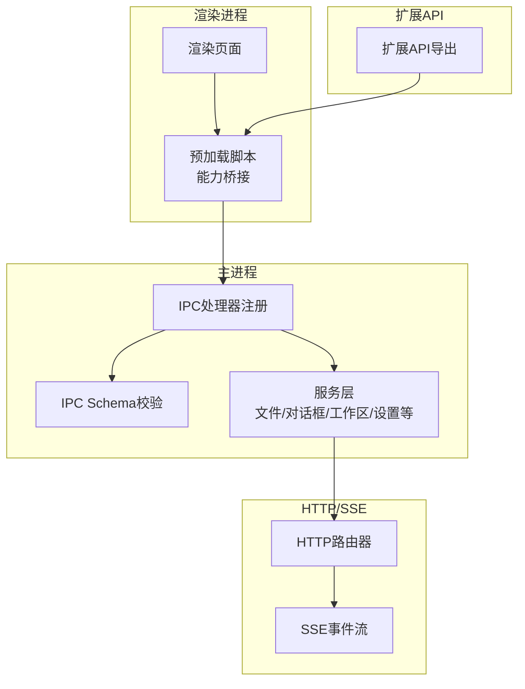
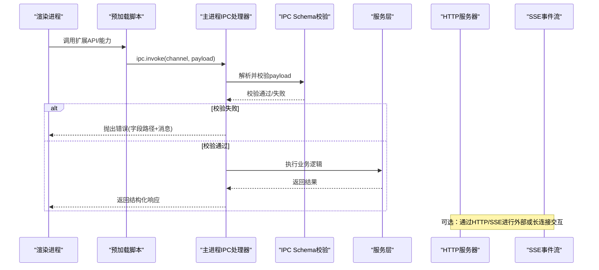
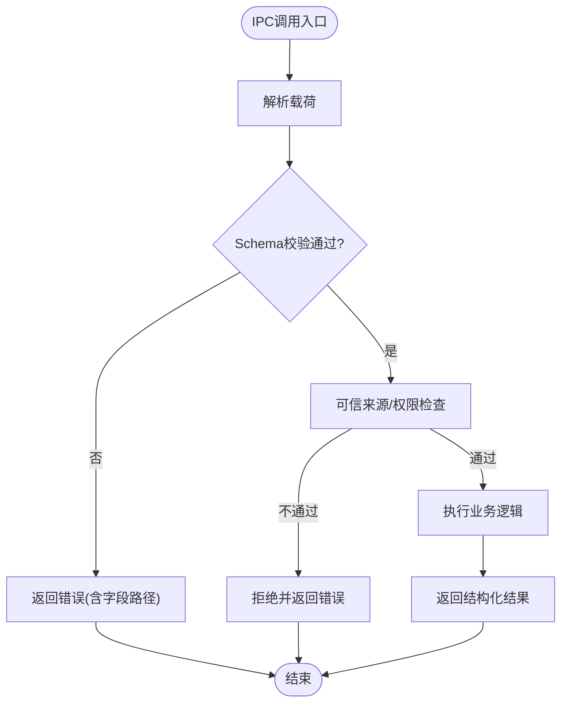
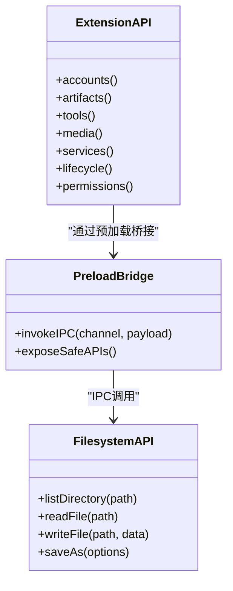
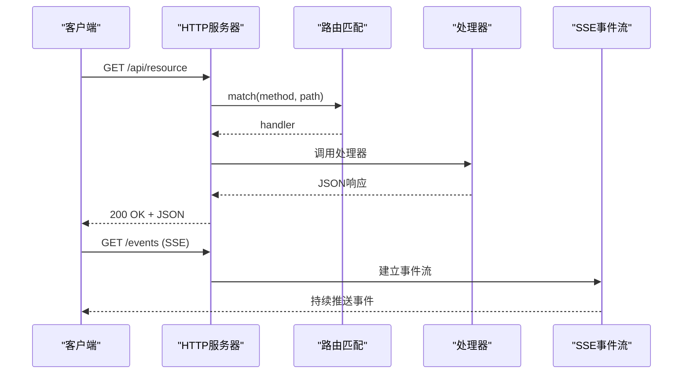
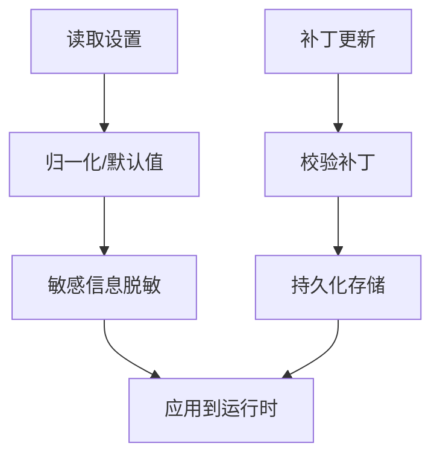
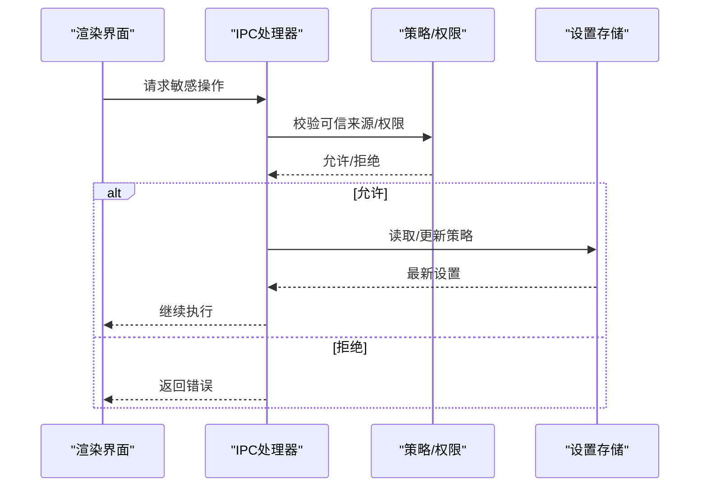
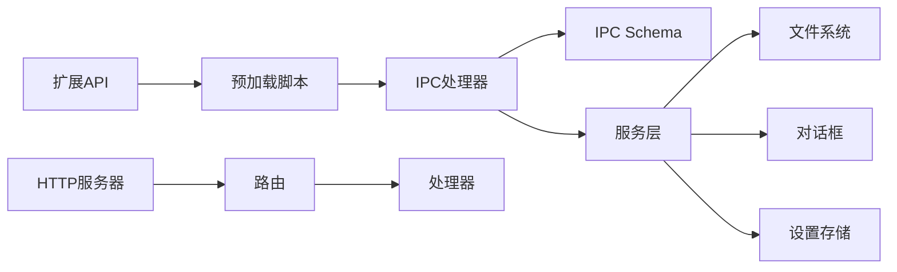

# API参考

<cite>
**本文引用的文件**
- [src/main/ipc/register-app-ipc-handlers.ts](file://src/main/ipc/register-app-ipc-handlers.ts)
- [src/main/ipc/app-ipc-schemas.ts](file://src/main/ipc/app-ipc-schemas.ts)
- [packages/extension-api/src/index.ts](file://packages/extension-api/src/index.ts)
- [kun/src/server/http-server.ts](file://kun/src/server/http-server.ts)
- [kun/src/server/sse.ts](file://kun/src/server/sse.ts)
- [src/shared/kun-gui-api.ts](file://src/shared/kun-gui-api.ts)
- [src/shared/app-settings.ts](file://src/shared/app-settings.ts)
- [src/preload/index.ts](file://src/preload/index.ts)
- [src/renderer/src/components/chat/SidebarClawDialogHelpers.ts](file://src/renderer/src/components/chat/SidebarClawDialogHelpers.ts)
</cite>

## 目录
1. [简介](#简介)
2. [项目结构](#项目结构)
3. [核心组件](#核心组件)
4. [架构总览](#架构总览)
5. [详细组件分析](#详细组件分析)
6. [依赖关系分析](#依赖关系分析)
7. [性能考虑](#性能考虑)
8. [故障排查指南](#故障排查指南)
9. [结论](#结论)
10. [附录](#附录)

## 简介
本API参考面向DeepSeek-GUI的集成与扩展开发者，覆盖以下方面：
- IPC接口规范：主进程与渲染进程之间的通信协议、消息格式与错误处理。
- 扩展API：宿主API、Webview API与文件系统接口的完整定义与使用方式。
- HTTP/SSE服务接口：RESTful端点、WebSocket连接（如适用）与实时数据推送。
- 配置API：应用设置、运行时参数与环境变量。
- 数据类型定义：接口规范、枚举值与约束规则。
- 认证与授权：令牌管理、权限验证与会话控制。
- 使用示例：请求构造、响应处理与错误恢复。
- 版本兼容性与迁移指南。

## 项目结构
本项目采用多模块组织：
- 主进程IPC注册与处理器：负责接收渲染进程调用，执行系统级能力（文件、对话框、工作区等），并返回结构化结果。
- IPC Schema：集中定义所有IPC通道的入参/出参校验模式，确保跨进程数据契约稳定。
- 扩展API：对外暴露给扩展的宿主API、工具、生命周期、权限等能力。
- HTTP服务器与SSE：提供本地HTTP路由分发与事件流推送能力。
- 共享类型与设置：跨进程共享的数据模型与应用设置读写。
- 预加载脚本：将安全的能力桥接到渲染进程上下文。
- 渲染侧辅助：用于IM渠道安装、二维码绑定等交互流程的类型与工具函数。

图表来源
- [src/main/ipc/register-app-ipc-handlers.ts:686-800](file://src/main/ipc/register-app-ipc-handlers.ts#L686-L800)
- [src/main/ipc/app-ipc-schemas.ts:1-8](file://src/main/ipc/app-ipc-schemas.ts#L1-L8)
- [packages/extension-api/src/index.ts:1-20](file://packages/extension-api/src/index.ts#L1-L20)
- [kun/src/server/http-server.ts:1-28](file://kun/src/server/http-server.ts#L1-L28)

章节来源
- [src/main/ipc/register-app-ipc-handlers.ts:686-800](file://src/main/ipc/register-app-ipc-handlers.ts#L686-L800)
- [src/main/ipc/app-ipc-schemas.ts:1-8](file://src/main/ipc/app-ipc-schemas.ts#L1-L8)
- [packages/extension-api/src/index.ts:1-20](file://packages/extension-api/src/index.ts#L1-L20)
- [kun/src/server/http-server.ts:1-28](file://kun/src/server/http-server.ts#L1-L28)

## 核心组件
- IPC处理器注册器：集中注册所有IPC通道，统一进行参数校验、权限检查、安全边界控制与服务调用。
- IPC Schema：以强类型模式描述每个IPC通道的输入输出，避免运行时类型错误。
- 扩展API：为扩展提供宿主能力（账户、工具、工件、媒体、服务等）的统一入口。
- HTTP服务器：基于路由匹配的分发器，统一返回JSON响应结构。
- SDE事件流：提供服务端到客户端的实时推送通道。
- 共享设置：应用配置的读取、写入与归一化，支持敏感信息脱敏。
- 预加载脚本：在渲染进程中注入受限但安全的API，隔离直接访问Node/Electron。

章节来源
- [src/main/ipc/register-app-ipc-handlers.ts:686-800](file://src/main/ipc/register-app-ipc-handlers.ts#L686-L800)
- [src/main/ipc/app-ipc-schemas.ts:1-8](file://src/main/ipc/app-ipc-schemas.ts#L1-L8)
- [packages/extension-api/src/index.ts:1-20](file://packages/extension-api/src/index.ts#L1-L20)
- [kun/src/server/http-server.ts:1-28](file://kun/src/server/http-server.ts#L1-L28)
- [src/shared/app-settings.ts](file://src/shared/app-settings.ts)
- [src/preload/index.ts](file://src/preload/index.ts)

## 架构总览
下图展示了从渲染进程发起IPC调用，经Schema校验后进入主进程服务层，最终返回结果的完整链路；同时展示扩展API如何被预加载脚本桥接至渲染进程，以及HTTP/SSE作为外部或内部服务的补充通道。

图表来源
- [src/main/ipc/register-app-ipc-handlers.ts:443-454](file://src/main/ipc/register-app-ipc-handlers.ts#L443-L454)
- [src/main/ipc/register-app-ipc-handlers.ts:686-800](file://src/main/ipc/register-app-ipc-handlers.ts#L686-L800)
- [kun/src/server/http-server.ts:17-27](file://kun/src/server/http-server.ts#L17-L27)

## 详细组件分析

### IPC接口规范
- 通道注册与调用：渲染进程通过预加载脚本暴露的安全方法调用主进程IPC通道。
- 参数校验：所有IPC载荷均通过Zod Schema进行严格校验，错误包含字段路径与人类可读消息。
- 安全边界：对敏感操作（如执行策略变更）进行可信来源校验与用户确认。
- 错误处理：统一抛出带上下文的错误，便于前端定位问题。

图表来源
- [src/main/ipc/register-app-ipc-handlers.ts:443-454](file://src/main/ipc/register-app-ipc-handlers.ts#L443-L454)
- [src/main/ipc/register-app-ipc-handlers.ts:470-496](file://src/main/ipc/register-app-ipc-handlers.ts#L470-L496)
- [src/main/ipc/register-app-ipc-handlers.ts:686-800](file://src/main/ipc/register-app-ipc-handlers.ts#L686-L800)

章节来源
- [src/main/ipc/register-app-ipc-handlers.ts:443-454](file://src/main/ipc/register-app-ipc-handlers.ts#L443-L454)
- [src/main/ipc/register-app-ipc-handlers.ts:470-496](file://src/main/ipc/register-app-ipc-handlers.ts#L470-L496)
- [src/main/ipc/register-app-ipc-handlers.ts:686-800](file://src/main/ipc/register-app-ipc-handlers.ts#L686-L800)
- [src/main/ipc/app-ipc-schemas.ts:1-8](file://src/main/ipc/app-ipc-schemas.ts#L1-L8)

### 扩展API参考
- 宿主API：通过扩展API包导出，涵盖账户、工件、工具、媒体、服务、生命周期、权限等能力。
- Webview API：由预加载脚本桥接，限制渲染环境中的能力范围，保证安全沙箱。
- 文件系统接口：通过IPC通道访问工作区文件、目录、预览与保存，遵循白名单与路径规范化。

图表来源
- [packages/extension-api/src/index.ts:1-20](file://packages/extension-api/src/index.ts#L1-L20)
- [src/preload/index.ts](file://src/preload/index.ts)
- [src/main/ipc/register-app-ipc-handlers.ts:686-800](file://src/main/ipc/register-app-ipc-handlers.ts#L686-L800)

章节来源
- [packages/extension-api/src/index.ts:1-20](file://packages/extension-api/src/index.ts#L1-L20)
- [src/preload/index.ts](file://src/preload/index.ts)
- [src/main/ipc/register-app-ipc-handlers.ts:686-800](file://src/main/ipc/register-app-ipc-handlers.ts#L686-L800)

### HTTP/SSE服务接口
- RESTful端点：HTTP服务器根据方法与路径匹配路由，返回统一的JSON响应结构。
- 实时推送：SSE用于向客户端持续推送事件（如运行状态、日志、进度）。
- WebSocket：若需双向实时通信，可在路由中实现WebSocket握手与消息转发（按实际路由实现）。

图表来源
- [kun/src/server/http-server.ts:17-27](file://kun/src/server/http-server.ts#L17-L27)
- [kun/src/server/sse.ts](file://kun/src/server/sse.ts)

章节来源
- [kun/src/server/http-server.ts:17-27](file://kun/src/server/http-server.ts#L17-L27)
- [kun/src/server/sse.ts](file://kun/src/server/sse.ts)

### 配置API
- 应用设置：通过共享设置模块进行读取与写入，支持补丁式更新与敏感信息脱敏。
- 运行时参数：包括代理、密钥、工作区路径等，可通过IPC或HTTP接口获取/更新。
- 环境变量：部分行为受环境变量影响（如网关URL、调试开关），在设置合并时生效。

图表来源
- [src/shared/app-settings.ts](file://src/shared/app-settings.ts)
- [src/main/ipc/register-app-ipc-handlers.ts:757-800](file://src/main/ipc/register-app-ipc-handlers.ts#L757-L800)

章节来源
- [src/shared/app-settings.ts](file://src/shared/app-settings.ts)
- [src/main/ipc/register-app-ipc-handlers.ts:757-800](file://src/main/ipc/register-app-ipc-handlers.ts#L757-L800)

### 数据类型定义
- IPC载荷：每个通道都有严格的Schema定义，包含必填字段、类型约束与自定义校验。
- 枚举值：如桌面命令、工作区操作、IM渠道等，确保前后端一致。
- 约束规则：路径必须绝对、长度限制、字符集限制、白名单校验等。

章节来源
- [src/main/ipc/app-ipc-schemas.ts:1-8](file://src/main/ipc/app-ipc-schemas.ts#L1-L8)
- [src/main/ipc/register-app-ipc-handlers.ts:443-454](file://src/main/ipc/register-app-ipc-handlers.ts#L443-L454)

### 认证与授权机制
- 令牌管理：某些操作需要令牌（如设计审批令牌、设备码登录），在主进程内生成与校验。
- 权限验证：对敏感操作进行可信来源校验（如当前窗口帧ID、路由ID），防止越权。
- 会话控制：通过IPC通道维护会话状态，结合设置中的策略控制执行权限。

图表来源
- [src/main/ipc/register-app-ipc-handlers.ts:470-496](file://src/main/ipc/register-app-ipc-handlers.ts#L470-L496)
- [src/main/ipc/register-app-ipc-handlers.ts:757-800](file://src/main/ipc/register-app-ipc-handlers.ts#L757-L800)

章节来源
- [src/main/ipc/register-app-ipc-handlers.ts:470-496](file://src/main/ipc/register-app-ipc-handlers.ts#L470-L496)
- [src/main/ipc/register-app-ipc-handlers.ts:757-800](file://src/main/ipc/register-app-ipc-handlers.ts#L757-L800)

### API使用示例
- 请求构造：通过预加载脚本调用IPC通道，传入符合Schema的载荷。
- 响应处理：根据返回结构判断成功/失败，提取必要字段。
- 错误恢复：捕获错误并提示用户重试或修正输入。

章节来源
- [src/main/ipc/register-app-ipc-handlers.ts:443-454](file://src/main/ipc/register-app-ipc-handlers.ts#L443-L454)
- [src/main/ipc/register-app-ipc-handlers.ts:686-800](file://src/main/ipc/register-app-ipc-handlers.ts#L686-L800)

### 版本兼容性与迁移指南
- 向后兼容：IPC Schema与扩展API保持向前兼容，新增字段应为可选。
- 迁移步骤：当引入破坏性变更时，提供迁移脚本与降级策略。
- 测试覆盖：关键路径应有单元测试与集成测试保障兼容性。

章节来源
- [packages/extension-api/src/index.ts:1-20](file://packages/extension-api/src/index.ts#L1-L20)
- [src/main/ipc/app-ipc-schemas.ts:1-8](file://src/main/ipc/app-ipc-schemas.ts#L1-L8)

## 依赖关系分析
- 低耦合：IPC处理器仅依赖Schema与服务层，避免直接耦合业务细节。
- 高内聚：每个服务模块职责单一，便于测试与维护。
- 外部依赖：Electron、Node fs、zod等库用于系统能力与数据校验。

图表来源
- [src/main/ipc/register-app-ipc-handlers.ts:686-800](file://src/main/ipc/register-app-ipc-handlers.ts#L686-L800)
- [packages/extension-api/src/index.ts:1-20](file://packages/extension-api/src/index.ts#L1-L20)
- [kun/src/server/http-server.ts:17-27](file://kun/src/server/http-server.ts#L17-L27)

章节来源
- [src/main/ipc/register-app-ipc-handlers.ts:686-800](file://src/main/ipc/register-app-ipc-handlers.ts#L686-L800)
- [packages/extension-api/src/index.ts:1-20](file://packages/extension-api/src/index.ts#L1-L20)
- [kun/src/server/http-server.ts:17-27](file://kun/src/server/http-server.ts#L17-L27)

## 性能考虑
- 批量操作：尽量合并IPC调用，减少往返次数。
- 异步处理：长耗时任务应异步执行并通过SSE或轮询反馈进度。
- 缓存策略：对频繁读取的配置与资源进行内存缓存，注意失效策略。
- 错误快速失败：尽早校验输入，避免无效计算。

## 故障排查指南
- 常见错误：
  - 载荷校验失败：检查字段类型与必填项。
  - 权限拒绝：确认可信来源与用户授权。
  - 路径非法：确保工作区路径在白名单内且已存在。
- 调试建议：
  - 启用详细日志，记录IPC通道与载荷。
  - 使用开发工具查看网络与事件流。
  - 逐步缩小问题范围，定位具体服务模块。

章节来源
- [src/main/ipc/register-app-ipc-handlers.ts:443-454](file://src/main/ipc/register-app-ipc-handlers.ts#L443-L454)
- [src/main/ipc/register-app-ipc-handlers.ts:470-496](file://src/main/ipc/register-app-ipc-handlers.ts#L470-L496)

## 结论
DeepSeek-GUI通过严格的IPC Schema、安全的预加载桥接、清晰的扩展API与可扩展的HTTP/SSE服务，提供了稳定、安全且易用的集成能力。开发者可基于本参考文档快速上手，构建高质量的扩展与服务。

## 附录
- IM渠道安装与绑定：渲染侧提供类型与工具函数，简化二维码绑定与凭证输入流程。

章节来源
- [src/renderer/src/components/chat/SidebarClawDialogHelpers.ts:1-297](file://src/renderer/src/components/chat/SidebarClawDialogHelpers.ts#L1-L297)
- [src/shared/kun-gui-api.ts](file://src/shared/kun-gui-api.ts)