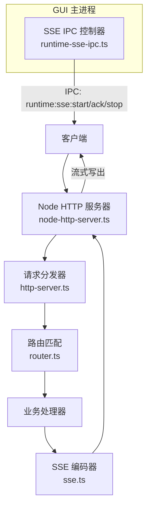
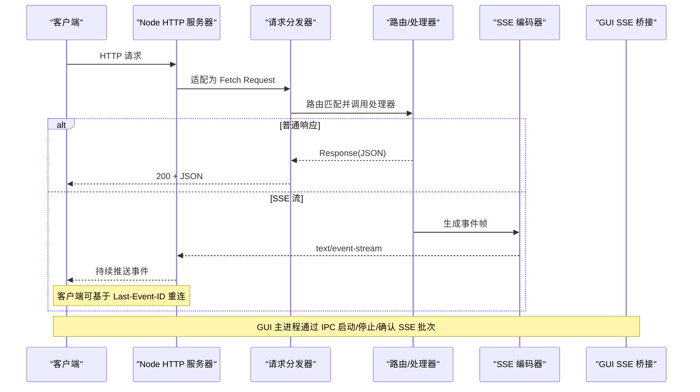
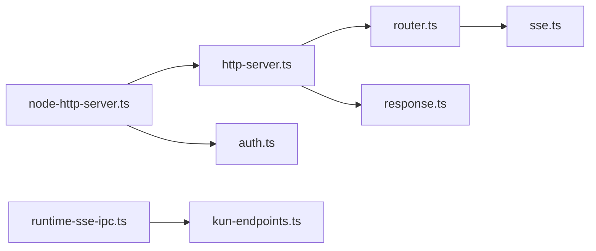

# HTTP/SSE服务接口

<cite>
**本文引用的文件**
- [kun/src/server/http-server.ts](file://kun/src/server/http-server.ts)
- [kun/src/server/node-http-server.ts](file://kun/src/server/node-http-server.ts)
- [kun/src/server/router.ts](file://kun/src/server/router.ts)
- [kun/src/server/response.ts](file://kun/src/server/response.ts)
- [kun/src/server/auth.ts](file://kun/src/server/auth.ts)
- [kun/src/server/sse.ts](file://kun/src/server/sse.ts)
- [src/main/runtime-sse-ipc.ts](file://src/main/runtime-sse-ipc.ts)
- [src/shared/kun-endpoints.ts](file://src/shared/kun-endpoints.ts)
</cite>

## 目录
1. [简介](#简介)
2. [项目结构](#项目结构)
3. [核心组件](#核心组件)
4. [架构总览](#架构总览)
5. [详细组件分析](#详细组件分析)
6. [依赖关系分析](#依赖关系分析)
7. [性能考量](#性能考量)
8. [故障排查指南](#故障排查指南)
9. [结论](#结论)
10. [附录](#附录)

## 简介
本文件为 DeepSeek-GUI 的 HTTP 与 SSE（Server-Sent Events）服务提供面向集成者的 API 文档。内容涵盖：
- RESTful 端点设计、URL 模式、HTTP 方法与状态码约定
- SSE 连接处理、事件流格式、重连机制与错误恢复
- 认证与授权机制（令牌验证与权限检查）
- 请求/响应示例与错误格式说明
- 实时通信协议（事件类型、消息格式、连接管理）
- API 版本控制与向后兼容性说明
- 客户端集成指南与 SDK 使用要点

## 项目结构
本项目采用分层与职责分离的设计：
- 路由与分发：基于 Router 匹配方法+路径，统一分发到处理器
- HTTP 服务器：Node.js 原生 HTTP 服务器适配 Fetch Request/Response，支持流式响应与 SSE
- 认证：Bearer Token 校验，区分通用鉴权与敏感控制面鉴权
- SSE 编码：将运行时事件编码为标准 SSE 帧
- GUI 侧 SSE 桥接：Electron 主进程通过 IPC 建立并维护与后端运行时的 SSE 长连接，负责批处理、确认、断线重连与错误上报

图示来源
- [kun/src/server/node-http-server.ts:14-46](file://kun/src/server/node-http-server.ts#L14-L46)
- [kun/src/server/http-server.ts:17-27](file://kun/src/server/http-server.ts#L17-L27)
- [kun/src/server/router.ts:15-58](file://kun/src/server/router.ts#L15-L58)
- [kun/src/server/sse.ts:3-5](file://kun/src/server/sse.ts#L3-L5)
- [src/main/runtime-sse-ipc.ts:178-408](file://src/main/runtime-sse-ipc.ts#L178-L408)

章节来源
- [kun/src/server/http-server.ts:1-28](file://kun/src/server/http-server.ts#L1-L28)
- [kun/src/server/node-http-server.ts:1-232](file://kun/src/server/node-http-server.ts#L1-L232)
- [kun/src/server/router.ts:1-75](file://kun/src/server/router.ts#L1-L75)
- [kun/src/server/response.ts:1-14](file://kun/src/server/response.ts#L1-L14)
- [kun/src/server/auth.ts:1-17](file://kun/src/server/auth.ts#L1-L17)
- [kun/src/server/sse.ts:1-6](file://kun/src/server/sse.ts#L1-L6)
- [src/main/runtime-sse-ipc.ts:1-409](file://src/main/runtime-sse-ipc.ts#L1-L409)

## 核心组件
- 请求分发器：将 HTTP 请求按方法与路径分派至对应处理器；未匹配返回 404 JSON 错误
- Node HTTP 服务器：将 Node IncomingMessage/ServerResponse 适配为 Fetch Request/Response，支持流式响应与 SSE 写出；内置故障注入与限流模拟
- 路由：支持 :param 占位符，按注册顺序匹配，首个命中生效；对路径参数进行安全解码
- 响应工具：统一的 JSON 响应构造器
- 认证：解析 Authorization Bearer 头，支持可选“不安全”模式与敏感控制面强制鉴权
- SSE 编码器：将运行时事件序列化为标准 SSE 帧（id/event/data）
- GUI SSE 桥接：维护 SSE 连接生命周期、批量转发、ACK 机制、指数退避重连、错误分类与上报

章节来源
- [kun/src/server/http-server.ts:17-27](file://kun/src/server/http-server.ts#L17-L27)
- [kun/src/server/node-http-server.ts:48-101](file://kun/src/server/node-http-server.ts#L48-L101)
- [kun/src/server/router.ts:9-75](file://kun/src/server/router.ts#L9-L75)
- [kun/src/server/response.ts:1-14](file://kun/src/server/response.ts#L1-L14)
- [kun/src/server/auth.ts:1-17](file://kun/src/server/auth.ts#L1-L17)
- [kun/src/server/sse.ts:1-6](file://kun/src/server/sse.ts#L1-L6)
- [src/main/runtime-sse-ipc.ts:178-408](file://src/main/runtime-sse-ipc.ts#L178-L408)

## 架构总览
下图展示了从客户端到后端运行时的完整调用链，包括 SSE 流式传输与 GUI 主进程的桥接逻辑。

图示来源
- [kun/src/server/node-http-server.ts:174-206](file://kun/src/server/node-http-server.ts#L174-L206)
- [kun/src/server/http-server.ts:17-27](file://kun/src/server/http-server.ts#L17-L27)
- [kun/src/server/sse.ts:3-5](file://kun/src/server/sse.ts#L3-L5)
- [src/main/runtime-sse-ipc.ts:178-408](file://src/main/runtime-sse-ipc.ts#L178-L408)

## 详细组件分析

### RESTful 端点与路由
- URL 模式：支持静态段与 :param 动态段，例如 /v1/threads/:id/turns/:turnId
- 方法匹配：严格区分 GET/POST/PUT/DELETE 等
- 未匹配路由：返回 404 与 JSON 错误体
- 路径参数：自动解码并拒绝包含路径分隔符或 NUL 的非法值，防止下游文件系统误读

章节来源
- [kun/src/server/router.ts:9-75](file://kun/src/server/router.ts#L9-L75)
- [kun/src/server/http-server.ts:17-27](file://kun/src/server/http-server.ts#L17-L27)

### HTTP 服务器与流式响应
- 请求适配：将 Node 请求转换为 Fetch Request，保留原始头部并注入 x-kun-remote-address
- 响应写出：直接透传 Response.body 流；当 content-type 包含 text/event-stream 时作为 SSE 流处理
- 背压控制：写入阻塞时等待 drain，避免内存暴涨
- 故障注入：支持超时、429、无效 JSON、SSE 断开等注入场景，便于测试
- 关闭策略：shutdown 时强制关闭所有连接，避免 SSE 长连接阻止退出

章节来源
- [kun/src/server/node-http-server.ts:14-46](file://kun/src/server/node-http-server.ts#L14-L46)
- [kun/src/server/node-http-server.ts:48-101](file://kun/src/server/node-http-server.ts#L48-L101)
- [kun/src/server/node-http-server.ts:128-172](file://kun/src/server/node-http-server.ts#L128-L172)
- [kun/src/server/node-http-server.ts:174-206](file://kun/src/server/node-http-server.ts#L174-L206)

### 认证与授权
- Bearer Token：从 Authorization 头提取 token
- 通用鉴权：isAuthorized 支持可选“不安全”模式（开发调试用）
- 敏感控制面：isRuntimeTokenAuthorized 始终要求有效 token，即使通用鉴权关闭
- 建议：生产环境务必启用 token 校验，并将 token 安全存储于环境变量或密钥管理服务

章节来源
- [kun/src/server/auth.ts:1-17](file://kun/src/server/auth.ts#L1-L17)

### SSE 事件流与格式
- 事件帧字段：
  - id：事件序号（seq），用于断点续传
  - event：事件类型（kind）
  - data：JSON 序列化后的事件体
- 客户端重连：
  - 服务端在重连时可读取 Last-Event-ID 以回放缺失事件
  - GUI 侧实现指数退避重连，最大间隔受上限保护
- 错误恢复：
  - 致命错误（4xx 非 408/429）立即上报并终止
  - 瞬态错误（网络/超时/断开）触发重试
  - 超大帧与缓冲区限制保护内存

章节来源
- [kun/src/server/sse.ts:3-5](file://kun/src/server/sse.ts#L3-L5)
- [src/main/runtime-sse-ipc.ts:141-176](file://src/main/runtime-sse-ipc.ts#L141-L176)
- [src/main/runtime-sse-ipc.ts:199-371](file://src/main/runtime-sse-ipc.ts#L199-L371)

### GUI 主进程 SSE 桥接（IPC）
- 启动：IPC 通道 runtime:sse:start，接收线程 ID、起始 seq、是否启用 ACK 等参数
- 连接管理：
  - 每次重连重新解析运行时地址与鉴权头，确保跟随最新配置
  - 维护 since_seq 游标，结合 Last-Event-ID 实现增量回放
- 批处理与确认：
  - 事件分批发送，支持可选 batchId 与 ACK 机制，保证渲染端消费能力
  - 超过阈值（事件数/字节数）自动 flush
- 停止与清理：
  - runtime:sse:stop 主动中止连接并清理资源
  - 异常路径下发送 runtime:sse-end 通知

章节来源
- [src/main/runtime-sse-ipc.ts:178-408](file://src/main/runtime-sse-ipc.ts#L178-L408)

### 错误与状态码约定
- 404：路由未匹配
- 429：限流（可配合 retry-after 头）
- 500：内部错误（含流式响应中途失败的保护性关闭）
- SSE 错误：
  - 致命错误：4xx（除 408/429）直接上报并终止
  - 瞬态错误：网络/超时/断开等，触发指数退避重连

章节来源
- [kun/src/server/http-server.ts:17-27](file://kun/src/server/http-server.ts#L17-L27)
- [kun/src/server/node-http-server.ts:54-101](file://kun/src/server/node-http-server.ts#L54-L101)
- [src/main/runtime-sse-ipc.ts:141-176](file://src/main/runtime-sse-ipc.ts#L141-L176)

## 依赖关系分析

图示来源
- [kun/src/server/node-http-server.ts:1-6](file://kun/src/server/node-http-server.ts#L1-L6)
- [kun/src/server/http-server.ts:1-4](file://kun/src/server/http-server.ts#L1-L4)
- [kun/src/server/router.ts:1-2](file://kun/src/server/router.ts#L1-L2)
- [kun/src/server/response.ts:1-2](file://kun/src/server/response.ts#L1-L2)
- [kun/src/server/auth.ts:1-1](file://kun/src/server/auth.ts#L1-L1)
- [kun/src/server/sse.ts:1-1](file://kun/src/server/sse.ts#L1-L1)
- [src/main/runtime-sse-ipc.ts:1-9](file://src/main/runtime-sse-ipc.ts#L1-L9)

章节来源
- [kun/src/server/node-http-server.ts:1-6](file://kun/src/server/node-http-server.ts#L1-L6)
- [kun/src/server/http-server.ts:1-4](file://kun/src/server/http-server.ts#L1-L4)
- [kun/src/server/router.ts:1-2](file://kun/src/server/router.ts#L1-L2)
- [kun/src/server/response.ts:1-2](file://kun/src/server/response.ts#L1-L2)
- [kun/src/server/auth.ts:1-1](file://kun/src/server/auth.ts#L1-L1)
- [kun/src/server/sse.ts:1-1](file://kun/src/server/sse.ts#L1-L1)
- [src/main/runtime-sse-ipc.ts:1-9](file://src/main/runtime-sse-ipc.ts#L1-L9)

## 性能考量
- 流式写出与背压：Node 层在 write 阻塞时等待 drain，避免内存占用飙升
- SSE 批处理：GUI 侧限制每批事件数量与字节大小，降低渲染压力
- 指数退避重连：基础间隔与最大间隔限制，避免风暴式重连
- 大帧保护：单帧缓冲上限，防止恶意或异常数据导致 OOM
- 优雅关闭：shutdown 时强制关闭长连接，缩短退出时间

章节来源
- [kun/src/server/node-http-server.ts:174-206](file://kun/src/server/node-http-server.ts#L174-L206)
- [src/main/runtime-sse-ipc.ts:19-25](file://src/main/runtime-sse-ipc.ts#L19-L25)
- [src/main/runtime-sse-ipc.ts:207-249](file://src/main/runtime-sse-ipc.ts#L207-L249)
- [src/main/runtime-sse-ipc.ts:336-345](file://src/main/runtime-sse-ipc.ts#L336-L345)

## 故障排查指南
- 无法路由：检查请求方法与路径是否与已注册路由一致；注意 :param 段长度与合法性
- 404：路由未匹配，返回 JSON 错误体
- 429：触发限流注入或真实限流；关注 retry-after 头
- 500：内部错误；查看日志中的 method/path/error 摘要
- SSE 连接失败：
  - 致命错误（4xx 非 408/429）：立即上报并终止
  - 瞬态错误：自动重试；检查网络、代理、证书与防火墙
  - 启动超时：检查运行时可达性与鉴权头是否正确
- 事件丢失：确认 since_seq 与 Last-Event-ID 设置正确；必要时重置游标

章节来源
- [kun/src/server/http-server.ts:17-27](file://kun/src/server/http-server.ts#L17-L27)
- [kun/src/server/node-http-server.ts:54-101](file://kun/src/server/node-http-server.ts#L54-L101)
- [src/main/runtime-sse-ipc.ts:141-176](file://src/main/runtime-sse-ipc.ts#L141-L176)
- [src/main/runtime-sse-ipc.ts:207-371](file://src/main/runtime-sse-ipc.ts#L207-L371)

## 结论
该 HTTP/SSE 服务通过清晰的分层与严格的错误/性能边界，提供了稳定可靠的 REST 与实时事件通道。结合 GUI 主进程的桥接与重连机制，可在复杂环境下保持高可用与低延迟的事件推送。生产部署应启用强鉴权、合理配置限流与超时，并完善监控告警。

## 附录

### 认证与授权
- 请求头：Authorization: Bearer <token>
- 敏感控制面：必须携带有效 token，不可降级为“不安全”模式
- 建议：将 token 置于环境变量并通过运行时配置注入；避免在日志中泄露

章节来源
- [kun/src/server/auth.ts:1-17](file://kun/src/server/auth.ts#L1-L17)

### SSE 事件格式与重连
- 事件帧：
  - id: <seq>
  - event: <kind>
  - data: <JSON 事件体>
- 重连：
  - 客户端在重连时附带 Last-Event-ID: <lastSeq>
  - GUI 侧维护 since_seq，并在重连时附加查询参数 with Last-Event-ID 头
- 错误：
  - 致命错误：立即上报并终止
  - 瞬态错误：指数退避重试

章节来源
- [kun/src/server/sse.ts:3-5](file://kun/src/server/sse.ts#L3-L5)
- [src/main/runtime-sse-ipc.ts:219-231](file://src/main/runtime-sse-ipc.ts#L219-L231)
- [src/main/runtime-sse-ipc.ts:245-249](file://src/main/runtime-sse-ipc.ts#L245-L249)
- [src/main/runtime-sse-ipc.ts:355-371](file://src/main/runtime-sse-ipc.ts#L355-L371)

### 请求/响应示例（文本描述）
- 成功响应（JSON）：
  - 状态码：200
  - Content-Type：application/json; charset=utf-8
  - 体：{ code, message, ... }
- 未找到（404）：
  - 体：{ code: "not_found", message: "route not found" }
- 内部错误（500）：
  - 体：{ code: "internal_error", message: "Internal server error." }
- SSE 流：
  - Content-Type：text/event-stream
  - 帧：id/event/data 三行后跟空行

章节来源
- [kun/src/server/response.ts:7-13](file://kun/src/server/response.ts#L7-L13)
- [kun/src/server/http-server.ts:17-27](file://kun/src/server/http-server.ts#L17-L27)
- [kun/src/server/node-http-server.ts:94-100](file://kun/src/server/node-http-server.ts#L94-L100)
- [kun/src/server/sse.ts:3-5](file://kun/src/server/sse.ts#L3-L5)

### 实时通信协议（GUI 主进程 IPC）
- 启动流：runtime:sse:start
  - 入参：threadId、sinceSeq、streamId（可选）、acknowledgedBatches（可选）
  - 出参：{ streamId }
- 事件推送：runtime:sse-event
  - 入参：{ streamId, events[], batchId? }
- 确认：runtime:sse:ack
  - 入参：{ streamId, batchId }
  - 出参：true/false
- 停止：runtime:sse:stop
  - 入参：streamId
  - 出参：true
- 结束：runtime:sse-end
  - 入参：{ streamId }
- 错误：runtime:sse-error
  - 入参：{ streamId, status? | message? }

章节来源
- [src/main/runtime-sse-ipc.ts:178-408](file://src/main/runtime-sse-ipc.ts#L178-L408)

### API 版本控制与向后兼容
- 路由设计：路径中包含版本号段（如 /v1/...），便于后续演进
- 参数扩展：新增可选字段优先于破坏性变更；旧客户端忽略未知字段
- SSE 兼容性：
  - 新增事件类型需保持向后兼容，旧客户端忽略未知 kind
  - 事件字段新增为可选，避免破坏旧解析逻辑
- 建议：在响应头或文档中标注当前 API 版本，并提供弃用提示

章节来源
- [kun/src/server/router.ts:9-14](file://kun/src/server/router.ts#L9-L14)

### 客户端集成指南与 SDK 要点
- 建立连接：
  - 使用 fetch 发起 GET 请求，Accept: text/event-stream
  - 携带 Authorization: Bearer <token>
  - 首次连接无需 Last-Event-ID；重连时附带 Last-Event-ID: <lastSeq>
- 事件处理：
  - 解析 id/event/data 三行，合并多行 data
  - 记录最后收到的 id（seq）用于重连
- 重连策略：
  - 指数退避：初始间隔约 750ms，最大间隔约 5000ms
  - 区分致命与瞬态错误，仅对瞬态错误重试
- GUI 集成：
  - 通过 IPC 启动/停止 SSE 流
  - 启用 batchId 与 ACK 以提升稳定性
  - 监控 runtime:sse-error 与 runtime:sse-end 事件

章节来源
- [src/main/runtime-sse-ipc.ts:19-25](file://src/main/runtime-sse-ipc.ts#L19-L25)
- [src/main/runtime-sse-ipc.ts:141-176](file://src/main/runtime-sse-ipc.ts#L141-L176)
- [src/main/runtime-sse-ipc.ts:207-371](file://src/main/runtime-sse-ipc.ts#L207-L371)