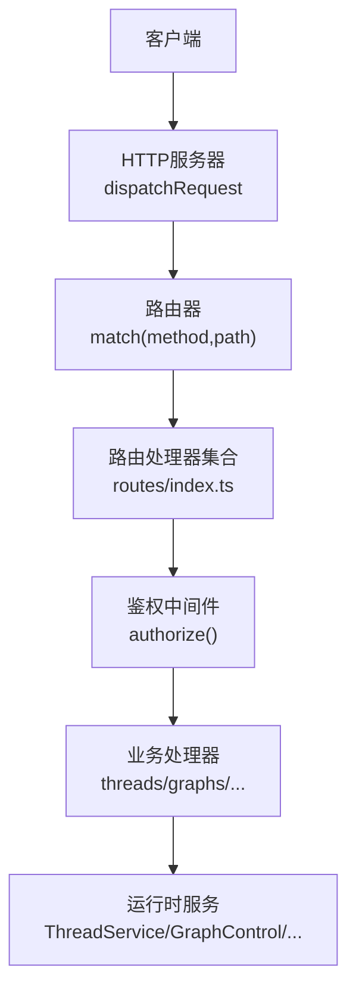
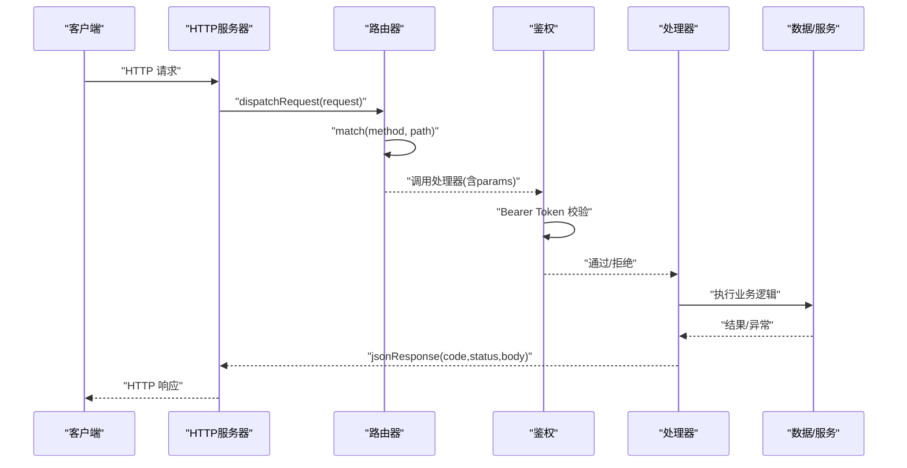
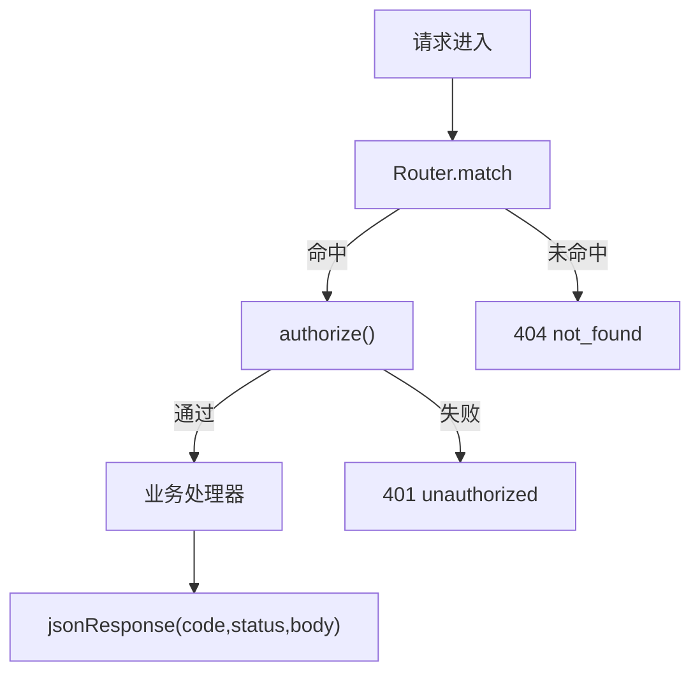

# RESTful API端点

<cite>
**本文引用的文件**
- [http-server.ts](file://kun/src/server/http-server.ts)
- [router.ts](file://kun/src/server/router.ts)
- [routes/index.ts](file://kun/src/server/routes/index.ts)
- [auth.ts](file://kun/src/server/auth.ts)
- [health.ts](file://kun/src/server/routes/health.ts)
- [graphs.ts](file://kun/src/server/routes/graphs.ts)
- [threads.ts](file://kun/src/server/routes/threads.ts)
</cite>

## 目录
1. [简介](#简介)
2. [项目结构](#项目结构)
3. [核心组件](#核心组件)
4. [架构总览](#架构总览)
5. [详细组件分析](#详细组件分析)
6. [依赖关系分析](#依赖关系分析)
7. [性能与缓存建议](#性能与缓存建议)
8. [故障排查指南](#故障排查指南)
9. [结论](#结论)
10. [附录：API端点清单与示例](#附录api端点清单与示例)

## 简介
本文件为 DeepSeek-GUI（Kun）内置 HTTP 服务的 RESTful API 文档。该服务基于轻量级 Router 与统一响应封装，提供线程、图执行、附件、记忆、模型连接、MCP、迁移、工作区等能力。所有 v1 接口均通过 Bearer Token 鉴权；仅健康检查端点无需认证。

## 项目结构
- HTTP 请求由 http-server 分发到 Router，Router 按注册顺序匹配方法与路径段，支持 :param 占位符。
- routes/index.ts 集中注册全部 /v1/* 路由，并在每个写操作前调用 authorize() 进行鉴权。
- auth.ts 提供 Bearer Token 解析与授权判断。
- health.ts 提供无认证的 /health 健康检查。
- graphs.ts、threads.ts 等模块实现具体业务逻辑，并通过统一的错误码与响应格式返回结果。

图表来源
- [http-server.ts:17-27](file://kun/src/server/http-server.ts#L17-L27)
- [router.ts:15-58](file://kun/src/server/router.ts#L15-L58)
- [routes/index.ts:196-800](file://kun/src/server/routes/index.ts#L196-L800)
- [auth.ts:1-16](file://kun/src/server/auth.ts#L1-L16)

章节来源
- [http-server.ts:1-27](file://kun/src/server/http-server.ts#L1-L27)
- [router.ts:1-75](file://kun/src/server/router.ts#L1-L75)
- [routes/index.ts:196-800](file://kun/src/server/routes/index.ts#L196-L800)
- [auth.ts:1-16](file://kun/src/server/auth.ts#L1-L16)

## 核心组件
- 路由器 Router：支持方法+路径段匹配，参数以 :param 形式注入 params。
- 鉴权 auth：从 Authorization: Bearer <token> 提取令牌并校验。
- 响应封装 jsonResponse：统一 JSON 响应体与状态码。
- 错误处理 ERRORS：在多个处理器中统一返回 code/message/details 的错误结构。

章节来源
- [router.ts:1-75](file://kun/src/server/router.ts#L1-L75)
- [auth.ts:1-16](file://kun/src/server/auth.ts#L1-L16)
- [routes/index.ts:196-800](file://kun/src/server/routes/index.ts#L196-L800)

## 架构总览
下图展示了典型请求的生命周期：客户端发起请求，HTTP 服务器分发给 Router，Router 匹配到对应处理器后执行鉴权与业务逻辑，最终返回统一格式的 JSON 响应。

图表来源
- [http-server.ts:17-27](file://kun/src/server/http-server.ts#L17-L27)
- [router.ts:15-58](file://kun/src/server/router.ts#L15-L58)
- [auth.ts:1-16](file://kun/src/server/auth.ts#L1-L16)
- [routes/index.ts:196-800](file://kun/src/server/routes/index.ts#L196-L800)

## 详细组件分析

### 通用鉴权与安全
- 认证方式：Authorization: Bearer <token>
- 鉴权函数：isAuthorized(headers, expectedToken, insecure?)
- 敏感控制面：isRuntimeTokenAuthorized(headers, expectedToken) 始终要求 token
- 未认证或无效 token：返回统一未授权错误

章节来源
- [auth.ts:1-16](file://kun/src/server/auth.ts#L1-L16)
- [routes/index.ts:196-800](file://kun/src/server/routes/index.ts#L196-L800)

### 健康检查
- GET /health
- 无需认证
- 返回服务状态与健康信息

章节来源
- [routes/index.ts:199-199](file://kun/src/server/routes/index.ts#L199-L199)
- [health.ts:1-7](file://kun/src/server/routes/health.ts#L1-L7)

### 线程管理（Threads）
- 列表：GET /v1/threads
- 创建：POST /v1/threads
- 详情：GET /v1/threads/:id
- 状态：GET /v1/threads/:id/state
- 更新：PATCH /v1/threads/:id
- 删除：DELETE /v1/threads/:id
- 分支：POST /v1/threads/:id/fork
- 摘要：POST /v1/threads/:id/summarize
- 目标：GET/POST/DELETE /v1/threads/:id/goal
- 待办：GET/POST/DELETE /v1/threads/:id/todos
- 轮次：POST /v1/threads/:id/turns
- 轮次详情：GET /v1/threads/:id/turns/:turnId
- 转向：POST /v1/threads/:id/turns/:turnId/steer
- 事件流：GET /v1/threads/:id/events
- 审批：POST /v1/approvals/:id
- 用户输入：POST /v1/user-inputs/:id
- 会话恢复：POST /v1/sessions/:id/resume-thread

说明
- 所有线程相关端点均需鉴权。
- 列表支持查询参数 limit、search、include_archived、archived_only、include。
- 详情与状态用于前端渲染与心跳检测。
- 事件流用于实时增量同步。

章节来源
- [routes/index.ts:672-800](file://kun/src/server/routes/index.ts#L672-L800)
- [threads.ts:67-198](file://kun/src/server/routes/threads.ts#L67-L198)

### 图执行（Graphs）
- 验证计划：POST /v1/graphs/validate
- 草稿：GET/GET/POST/POST /v1/graph-drafts[/:id][/resume|/cancel]
- 运行：GET/POST /v1/graphs[/:id]
- 监督：GET /v1/graphs/:id/supervision，唤醒 POST /v1/graphs/:id/supervision/wake
- 事件：GET /v1/graphs/:id/events
- 制品：GET /v1/graphs/:id/artifacts/:artifactId
- 控制：POST /v1/graphs/:id/{start|pause|resume|cleanup}
- 取消：POST /v1/graphs/:id/cancel
- 重试节点：POST /v1/graphs/:id/retry
- 转向：POST /v1/graphs/:id/steer
- 补丁：POST /v1/graphs/:id/patch
- 评审：POST /v1/graphs/:id/reviews

说明
- 所有图相关端点均需鉴权。
- 列表支持 status、limit、cursor 分页。
- 制品读取支持字节范围 offset/length 或行范围 start_line/end_line。
- 错误类型映射为统一的 code/message/details。

章节来源
- [routes/index.ts:389-500](file://kun/src/server/routes/index.ts#L389-L500)
- [graphs.ts:127-696](file://kun/src/server/routes/graphs.ts#L127-L696)

### 模型连接与网关
- 模型列表：GET /v1/models
- 对话补全：POST /v1/chat/completions
- 响应：POST /v1/responses
- 路由池状态：GET /v1/model-routes
- 路由测试：POST /v1/model-routes/:id/test
- 连接管理：GET/PATCH/POST/DELETE /v1/model-connections[/:providerId]
- OAuth：POST /v1/model-connections/oauth/start，状态 GET /v1/model-connections/oauth/:sessionId，提交 POST /v1/model-connections/oauth/:sessionId/submit，取消 DELETE /v1/model-connections/oauth/:sessionId
- Claude SDK：GET /v1/model-connections/claude/sdk，安装 POST /v1/model-connections/claude/sdk/install
- 选择连接：POST /v1/model-connections/select
- 事件：GET /v1/model-connections/events

说明
- 除 /models、/chat/completions、/responses 外，其余均需鉴权。
- 连接变更需鉴权，OAuth 流程通过 session 串联。

章节来源
- [routes/index.ts:200-348](file://kun/src/server/routes/index.ts#L200-L348)

### MCP 配置与 OAuth
- 诊断：GET /v1/mcp/oauth
- 配置：GET/PUT/PATCH/DELETE /v1/mcp/config[/:id]
- OAuth：DELETE /v1/mcp/oauth，DELETE /v1/mcp/oauth/:id，POST /v1/mcp/oauth/:id

说明
- 所有 MCP 相关端点均需鉴权。

章节来源
- [routes/index.ts:353-384](file://kun/src/server/routes/index.ts#L353-L384)

### 技能与运行时能力
- 技能：GET /v1/skills，刷新 POST /v1/skills/refresh，启用 PATCH /v1/skills/config
- 运行时能力：PATCH /v1/runtime/capabilities/:id
- 运行时信息：GET /v1/runtime/info
- 工具诊断：GET /v1/runtime/tools
- 关闭：POST /v1/runtime/shutdown
- 配置应用：POST /v1/runtime/config/apply

说明
- 除 /health 外，上述端点均需鉴权。

章节来源
- [routes/index.ts:261-352](file://kun/src/server/routes/index.ts#L261-L352)
- [routes/index.ts:578-589](file://kun/src/server/routes/index.ts#L578-L589)

### 附件与记忆
- 附件：POST /v1/attachments，GET/DELETE /v1/attachments/:id，内容 GET /v1/attachments/:id/content，诊断 GET /v1/attachments/diagnostics
- 记忆：GET/POST /v1/memory，PATCH/DELETE /v1/memory/:id，诊断 GET /v1/memory/diagnostics

说明
- 所有附件与记忆端点均需鉴权。

章节来源
- [routes/index.ts:598-637](file://kun/src/server/routes/index.ts#L598-L637)

### 后台 Shell
- 列表：GET /v1/background-shells
- 详情：GET /v1/background-shells/:sessionId
- 停止：POST /v1/background-shells/:sessionId/stop

说明
- 所有后台 Shell 端点均需鉴权。

章节来源
- [routes/index.ts:654-665](file://kun/src/server/routes/index.ts#L654-L665)

### 工作区
- 状态：GET /v1/workspace/status?path=...

说明
- 需要鉴权。

章节来源
- [routes/index.ts:666-671](file://kun/src/server/routes/index.ts#L666-L671)

### 迁移
- 导出：POST /v1/migrations/exports，获取 GET /v1/migrations/exports/:id，释放 DELETE /v1/migrations/exports/:id
- 导入预检：POST /v1/migrations/imports/preflight
- 导入提交/验证/回滚：POST /v1/migrations/imports/:id/{commit|verify|rollback}，释放 DELETE /v1/migrations/imports/:id

说明
- 所有迁移端点均需鉴权。

章节来源
- [routes/index.ts:229-260](file://kun/src/server/routes/index.ts#L229-L260)

### 供应链审计
- 审计：POST /v1/supply-chain/audit
- 更新检查：POST /v1/supply-chain/update-check

说明
- 需要鉴权。

章节来源
- [routes/index.ts:590-597](file://kun/src/server/routes/index.ts#L590-L597)

## 依赖关系分析
- 路由注册集中在 routes/index.ts，按“先注册先匹配”的顺序生效，因此静态后缀必须注册在参数化路径之前。
- 鉴权通过 authorize(request, runtime) 在每个写端点前调用，确保只有持有有效 Bearer Token 的请求可修改资源。
- 错误处理在各处理器内部将领域异常映射为统一的 ERRORS 结构，便于客户端一致处理。

图表来源
- [router.ts:15-58](file://kun/src/server/router.ts#L15-L58)
- [routes/index.ts:196-800](file://kun/src/server/routes/index.ts#L196-L800)

章节来源
- [router.ts:1-75](file://kun/src/server/router.ts#L1-L75)
- [routes/index.ts:196-800](file://kun/src/server/routes/index.ts#L196-L800)

## 性能与缓存建议
- 列表分页：使用 limit 与 cursor 分页，避免一次性拉取大量数据。
- 增量同步：优先使用事件流端点（如 threads/events、graphs/:id/events），结合 latestSeq/since_seq 增量消费。
- 制品读取：对大文件使用字节或行范围参数，减少带宽占用。
- 并发限制：部分处理器会返回速率限制错误（如 TurnCapacityError），客户端应遵循重试退避策略。
- 缓存策略：对只读且变化不频繁的数据（如 models、runtime info）可在客户端做短期缓存；写入后失效相关缓存。

## 故障排查指南
- 404 未找到：检查路径与方法是否匹配，确认资源是否存在。
- 401 未授权：确认 Authorization: Bearer <token> 是否正确传递。
- 400 校验失败：检查请求体是否符合 Zod Schema，关注 details 中的字段问题。
- 409 冲突：并发更新或状态不一致导致，建议携带 expectedRevision/expectedSeq 重试。
- 429 速率限制：降低请求频率或等待重试。
- 5xx 服务端错误：查看错误码与消息，必要时联系运维。

章节来源
- [graphs.ts:647-674](file://kun/src/server/routes/graphs.ts#L647-L674)
- [threads.ts:547-554](file://kun/src/server/routes/threads.ts#L547-L554)

## 结论
DeepSeek-GUI 的 HTTP API 采用简洁的 Router + 统一响应与错误模型，覆盖线程、图执行、附件、记忆、模型连接、MCP、迁移与工作区等核心能力。所有 v1 接口默认要求 Bearer Token 鉴权，仅健康检查开放。建议客户端严格遵循分页、增量事件与范围读取等最佳实践，以获得稳定与高性能的集成体验。

## 附录：API端点清单与示例

### 通用约定
- 版本：/v1/*
- 鉴权：Authorization: Bearer <token>
- 响应：JSON，包含 code、message、details（可选）
- 常见状态码：200 成功、201 已创建、202 已接受、400 校验失败、401 未授权、404 未找到、409 冲突、429 速率限制、5xx 服务端错误

### 健康检查
- GET /health
- 无需鉴权
- 响应示例
  - 200 {"status":"ok","service":"kun","mode":"serve"}

章节来源
- [routes/index.ts:199-199](file://kun/src/server/routes/index.ts#L199-L199)
- [health.ts:1-7](file://kun/src/server/routes/health.ts#L1-L7)

### 线程管理
- GET /v1/threads
  - 查询参数：limit、search、include_archived、archived_only、include
  - 响应：{ threads }
- POST /v1/threads
  - 请求体：CreateThreadRequest
  - 响应：201 Thread
- GET /v1/threads/:id
  - 响应：Thread + latestSeq + pendingUserInputIds + pendingApprovalIds
- GET /v1/threads/:id/state
  - 响应：{ id, status, updatedAt, latestSeq, latestTurn }
- PATCH /v1/threads/:id
  - 请求体：UpdateThreadRequest
  - 响应：Thread
- DELETE /v1/threads/:id
  - 响应：{ id, deleted }
- POST /v1/threads/:id/fork
  - 请求体：ForkThreadRequest
  - 响应：201 Thread
- POST /v1/threads/:id/summarize
  - 请求体：SummarizeRequest
  - 响应：202 或摘要结果
- GET/POST/DELETE /v1/threads/:id/goal
  - 请求体：SetThreadGoalRequest
  - 响应：{ goal }
- GET/POST/DELETE /v1/threads/:id/todos
  - 请求体：SetThreadTodosRequest
  - 响应：{ todos }
- POST /v1/threads/:id/turns
  - 请求体：StartTurnRequest
  - 响应：202 或启动结果
- GET /v1/threads/:id/turns/:turnId
  - 响应：Turn
- POST /v1/threads/:id/turns/:turnId/steer
  - 请求体：SteerTurnRequest
  - 响应：202 或转向结果
- GET /v1/threads/:id/events
  - 响应：事件流（增量）

章节来源
- [routes/index.ts:672-800](file://kun/src/server/routes/index.ts#L672-L800)
- [threads.ts:67-198](file://kun/src/server/routes/threads.ts#L67-L198)

### 图执行
- POST /v1/graphs/validate
  - 请求体：{ plan }
  - 响应：验证结果
- GET/POST /v1/graph-drafts[/:id][/resume|/cancel]
  - 请求体：GraphDraftCommandSchema
  - 响应：202 或草稿视图
- GET/POST /v1/graphs[/:id]
  - 请求体：CreateGraphRunRequest
  - 响应：202 或运行视图
- GET /v1/graphs/:id/supervision
  - 响应：监督投影
- POST /v1/graphs/:id/supervision/wake
  - 请求体：WakeGraphSupervisionRequest
  - 响应：监督投影
- GET /v1/graphs/:id/events
  - 查询参数：since_seq
  - 响应：事件回放
- GET /v1/graphs/:id/artifacts/:artifactId
  - 查询参数：offset/length 或 start_line/end_line
  - 响应：{ reference, meta, ...page }
- POST /v1/graphs/:id/{start|pause|resume|cleanup}
  - 请求体：GraphCommandContextSchema
  - 响应：运行视图
- POST /v1/graphs/:id/cancel
  - 请求体：CancelGraphRunRequest
  - 响应：运行视图
- POST /v1/graphs/:id/retry
  - 请求体：RetryGraphNodeRequest
  - 响应：运行视图
- POST /v1/graphs/:id/steer
  - 请求体：SteerGraphRunRequest
  - 响应：运行视图
- POST /v1/graphs/:id/patch
  - 请求体：ApplyGraphPatchRequest
  - 响应：运行视图
- POST /v1/graphs/:id/reviews
  - 请求体：RecordGraphReviewRequest
  - 响应：运行视图

章节来源
- [routes/index.ts:389-500](file://kun/src/server/routes/index.ts#L389-L500)
- [graphs.ts:127-696](file://kun/src/server/routes/graphs.ts#L127-L696)

### 模型连接与网关
- GET /v1/models
  - 响应：模型列表
- POST /v1/chat/completions
  - 请求体：OpenAI 兼容请求
  - 响应：流式或非流式补全
- POST /v1/responses
  - 请求体：Responses 协议请求
  - 响应：Responses 协议响应
- GET /v1/model-routes
  - 响应：路由池状态
- POST /v1/model-routes/:id/test
  - 响应：测试结果
- GET/PATCH/POST/DELETE /v1/model-connections[/:providerId]
  - 请求体：连接配置
  - 响应：连接列表或单个连接
- OAuth 流程：
  - POST /v1/model-connections/oauth/start -> { sessionId }
  - GET /v1/model-connections/oauth/:sessionId -> { status }
  - POST /v1/model-connections/oauth/:sessionId/submit -> 完成
  - DELETE /v1/model-connections/oauth/:sessionId -> 取消
- GET /v1/model-connections/claude/sdk
  - 响应：SDK 状态
- POST /v1/model-connections/claude/sdk/install
  - 响应：安装结果
- POST /v1/model-connections/select
  - 请求体：{ providerId }
  - 响应：选择结果
- GET /v1/model-connections/events
  - 响应：事件流

章节来源
- [routes/index.ts:200-348](file://kun/src/server/routes/index.ts#L200-L348)

### MCP 配置与 OAuth
- GET /v1/mcp/oauth
  - 响应：诊断
- GET/PUT/PATCH/DELETE /v1/mcp/config[/:id]
  - 请求体：MCP 配置
  - 响应：配置列表或单个配置
- DELETE /v1/mcp/oauth[/[:id]]
  - 响应：清除结果
- POST /v1/mcp/oauth/:id
  - 响应：授权结果

章节来源
- [routes/index.ts:353-384](file://kun/src/server/routes/index.ts#L353-L384)

### 技能与运行时能力
- GET /v1/skills
  - 响应：技能列表
- POST /v1/skills/refresh
  - 响应：刷新结果
- PATCH /v1/skills/config
  - 请求体：启用配置
  - 响应：更新结果
- PATCH /v1/runtime/capabilities/:id
  - 请求体：能力开关
  - 响应：更新结果
- GET /v1/runtime/info
  - 响应：运行时信息
- GET /v1/runtime/tools
  - 响应：工具诊断
- POST /v1/runtime/shutdown
  - 响应：关闭结果
- POST /v1/runtime/config/apply
  - 请求体：运行时配置
  - 响应：应用结果

章节来源
- [routes/index.ts:261-352](file://kun/src/server/routes/index.ts#L261-L352)
- [routes/index.ts:578-589](file://kun/src/server/routes/index.ts#L578-L589)

### 附件与记忆
- POST /v1/attachments
  - 请求体：multipart/form-data
  - 响应：附件元数据
- GET /v1/attachments/:id
  - 响应：附件元数据
- DELETE /v1/attachments/:id
  - 响应：释放结果
- GET /v1/attachments/:id/content
  - 响应：二进制内容
- GET /v1/attachments/diagnostics
  - 响应：诊断
- GET/POST /v1/memory
  - 请求体：Memory 对象
  - 响应：记忆列表或单个记忆
- PATCH/DELETE /v1/memory/:id
  - 请求体：Memory 更新
  - 响应：更新/删除结果
- GET /v1/memory/diagnostics
  - 响应：诊断

章节来源
- [routes/index.ts:598-637](file://kun/src/server/routes/index.ts#L598-L637)

### 后台 Shell
- GET /v1/background-shells
  - 响应：会话列表
- GET /v1/background-shells/:sessionId
  - 响应：会话详情
- POST /v1/background-shells/:sessionId/stop
  - 响应：停止结果

章节来源
- [routes/index.ts:654-665](file://kun/src/server/routes/index.ts#L654-L665)

### 工作区
- GET /v1/workspace/status?path=...
  - 响应：工作区状态

章节来源
- [routes/index.ts:666-671](file://kun/src/server/routes/index.ts#L666-L671)

### 迁移
- POST /v1/migrations/exports
  - 响应：导出任务 ID
- GET /v1/migrations/exports/:id
  - 响应：导出流
- DELETE /v1/migrations/exports/:id
  - 响应：释放结果
- POST /v1/migrations/imports/preflight
  - 请求体：导入预检
  - 响应：预检结果
- POST /v1/migrations/imports/:id/{commit|verify|rollback}
  - 响应：操作结果
- DELETE /v1/migrations/imports/:id
  - 响应：释放结果

章节来源
- [routes/index.ts:229-260](file://kun/src/server/routes/index.ts#L229-L260)

### 供应链审计
- POST /v1/supply-chain/audit
  - 请求体：包信息
  - 响应：审计结果
- POST /v1/supply-chain/update-check
  - 请求体：更新检查
  - 响应：检查结果

章节来源
- [routes/index.ts:590-597](file://kun/src/server/routes/index.ts#L590-L597)

### 客户端集成要点
- 鉴权：在所有请求头中添加 Authorization: Bearer <token>
- 分页：使用 limit 与 cursor 分页，避免大数据量一次加载
- 增量：使用事件流端点配合 since_seq/latestSeq 增量消费
- 范围读取：对大制品使用 offset/length 或 start_line/end_line
- 重试：遇到 429/409 时采用指数退避重试
- 错误处理：统一解析 code/message/details 并提示用户