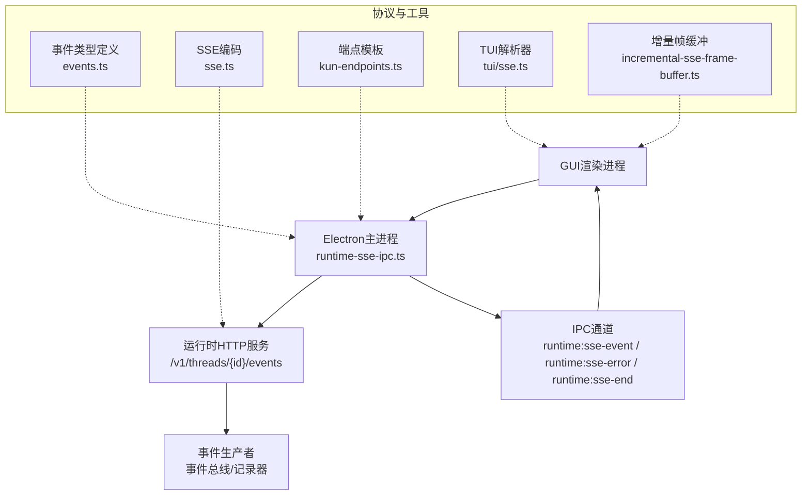
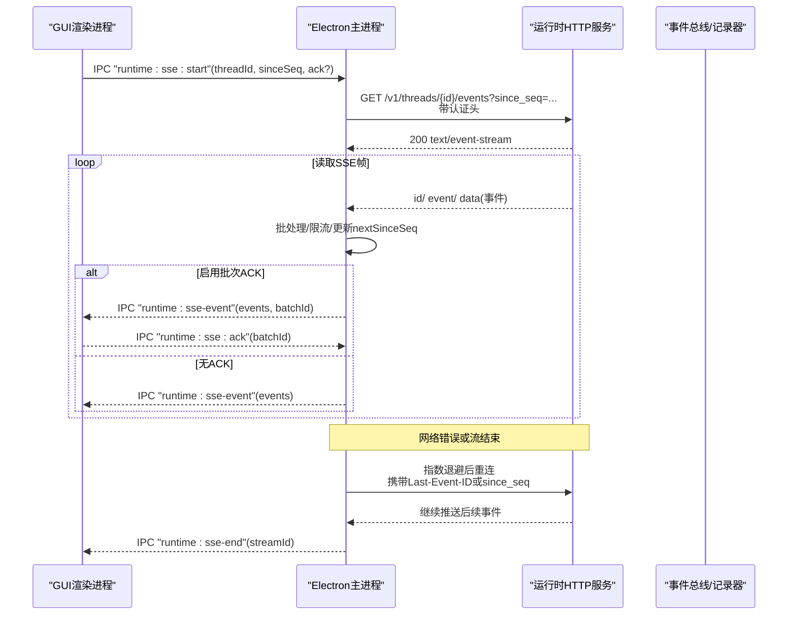
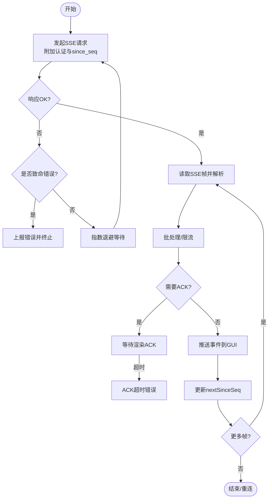
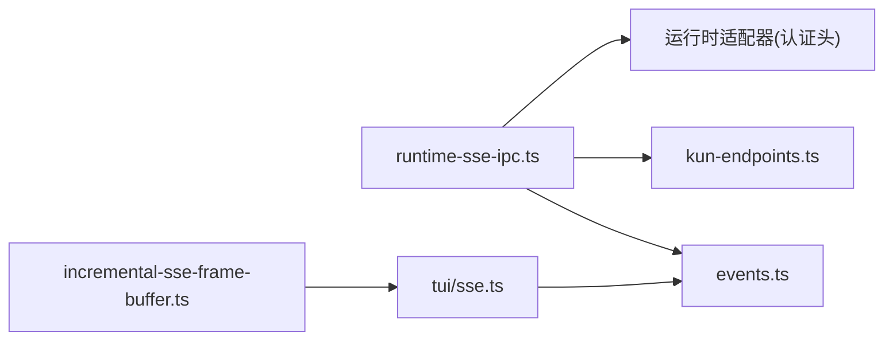

# SSE实时事件流

<cite>
**本文引用的文件**
- [kun/src/server/sse.ts](file://kun/src/server/sse.ts)
- [src/main/runtime-sse-ipc.ts](file://src/main/runtime-sse-ipc.ts)
- [src/shared/kun-endpoints.ts](file://src/shared/kun-endpoints.ts)
- [kun/src/contracts/events.ts](file://kun/src/contracts/events.ts)
- [kun/src/tui/sse.ts](file://kun/src/tui/sse.ts)
- [kun/src/adapters/model/incremental-sse-frame-buffer.ts](file://kun/src/adapters/model/incremental-sse-frame-buffer.ts)
- [src/main/runtime-sse-ipc.test.ts](file://src/main/runtime-sse-ipc.test.ts)
</cite>

## 目录
1. [简介](#简介)
2. [项目结构](#项目结构)
3. [核心组件](#核心组件)
4. [架构总览](#架构总览)
5. [详细组件分析](#详细组件分析)
6. [依赖关系分析](#依赖关系分析)
7. [性能与优化](#性能与优化)
8. [故障排查指南](#故障排查指南)
9. [结论](#结论)
10. [附录：客户端实现示例与最佳实践](#附录客户端实现示例与最佳实践)

## 简介
本文件面向DeepSeek-GUI的SSE（Server-Sent Events）实时通信系统，聚焦于服务端事件编码、主进程SSE桥接、事件协议与类型、连接管理（心跳、断线重连、错误恢复）、以及客户端接入与监控调试要点。文档以代码为依据，提供可追溯的文件来源与图示，帮助读者快速理解并正确实现SSE订阅、事件处理与异常恢复。

## 项目结构
SSE相关能力由以下模块协作完成：
- 事件协议定义：集中定义所有RuntimeEvent类型及字段约束，作为SSE数据载荷的权威契约。
- 事件编码：将运行时事件序列化为标准SSE帧。
- 主进程SSE桥接：负责建立到运行时的SSE连接、解析事件、批处理、ACK确认、断线重连与错误上报。
- 端点定义：统一声明线程事件SSE路径等URL模板。
- TUI/SSE解析器：用于TUI或其他消费端增量解析SSE帧并校验事件。
- 高性能缓冲：为模型流等场景提供增量SSE帧边界定位与内存友好的缓冲策略。

图表来源
- [src/main/runtime-sse-ipc.ts:178-409](file://src/main/runtime-sse-ipc.ts#L178-L409)
- [src/shared/kun-endpoints.ts:275-278](file://src/shared/kun-endpoints.ts#L275-L278)
- [kun/src/server/sse.ts:1-6](file://kun/src/server/sse.ts#L1-L6)
- [kun/src/contracts/events.ts:33-83](file://kun/src/contracts/events.ts#L33-L83)
- [kun/src/tui/sse.ts:9-82](file://kun/src/tui/sse.ts#L9-L82)
- [kun/src/adapters/model/incremental-sse-frame-buffer.ts:22-111](file://kun/src/adapters/model/incremental-sse-frame-buffer.ts#L22-L111)

章节来源
- [src/main/runtime-sse-ipc.ts:178-409](file://src/main/runtime-sse-ipc.ts#L178-L409)
- [src/shared/kun-endpoints.ts:275-278](file://src/shared/kun-endpoints.ts#L275-L278)
- [kun/src/server/sse.ts:1-6](file://kun/src/server/sse.ts#L1-L6)
- [kun/src/contracts/events.ts:33-83](file://kun/src/contracts/events.ts#L33-L83)
- [kun/src/tui/sse.ts:9-82](file://kun/src/tui/sse.ts#L9-L82)
- [kun/src/adapters/model/incremental-sse-frame-buffer.ts:22-111](file://kun/src/adapters/model/incremental-sse-frame-buffer.ts#L22-L111)

## 核心组件
- 事件协议与类型
  - 使用Zod严格定义所有RuntimeEvent变体，包含会话、回合、工具调用、审批、用户输入、压缩、目标/待办、Bash会话、图执行、上下文快照、用量、错误、心跳等事件类型。
  - 每个事件携带seq、timestamp、threadId、turnId、itemId等通用字段，支持按序回放与幂等处理。
- SSE帧编码
  - 将事件序列化为标准SSE帧：id=seq、event=kind、data=JSON(event)。
- 主进程SSE桥接
  - 通过IPC暴露start/ack/stop接口，维护每个stream的生命周期。
  - 自动重试、指数退避、Last-Event-ID续传、since_seq游标推进。
  - 批量转发事件，支持可选的批次ACK机制，防止渲染进程阻塞导致背压。
  - 对致命错误立即上报，对瞬态错误进行重连。
- 端点与认证
  - 统一使用线程事件端点模板，附加认证头与since_seq参数。
- TUI/SSE解析器
  - 增量读取网络块，识别SSE帧边界，解析并校验事件；兼容未知事件保持连接存活。
- 增量帧缓冲
  - 高效定位SSE帧分隔符，避免重复扫描与复制，降低内存占用与CPU开销。

章节来源
- [kun/src/contracts/events.ts:33-83](file://kun/src/contracts/events.ts#L33-L83)
- [kun/src/server/sse.ts:1-6](file://kun/src/server/sse.ts#L1-L6)
- [src/main/runtime-sse-ipc.ts:178-409](file://src/main/runtime-sse-ipc.ts#L178-L409)
- [src/shared/kun-endpoints.ts:275-278](file://src/shared/kun-endpoints.ts#L275-L278)
- [kun/src/tui/sse.ts:9-82](file://kun/src/tui/sse.ts#L9-L82)
- [kun/src/adapters/model/incremental-sse-frame-buffer.ts:22-111](file://kun/src/adapters/model/incremental-sse-frame-buffer.ts#L22-L111)

## 架构总览
下图展示了从GUI到运行时的完整SSE事件流，包括连接建立、事件批处理、ACK、断线重连与错误处理。

图表来源
- [src/main/runtime-sse-ipc.ts:178-409](file://src/main/runtime-sse-ipc.ts#L178-L409)
- [src/shared/kun-endpoints.ts:275-278](file://src/shared/kun-endpoints.ts#L275-L278)

章节来源
- [src/main/runtime-sse-ipc.ts:178-409](file://src/main/runtime-sse-ipc.ts#L178-L409)
- [src/shared/kun-endpoints.ts:275-278](file://src/shared/kun-endpoints.ts#L275-L278)

## 详细组件分析

### SSE帧格式与事件协议
- 帧格式
  - id：事件序号（seq），用于回放与去重。
  - event：事件种类（kind）。
  - data：事件JSON对象。
- 事件类型概览
  - 会话事件：thread_created、thread_updated。
  - 回合事件：turn_started、turn_completed、turn_failed、turn_aborted、turn_steered、turn_steering_updated。
  - 内容项事件：item_created、item_updated、item_completed、assistant_text_delta、assistant_reasoning_delta。
  - 工具执行事件：tool_call_ready、required_tool_gate、tool_result_upload_wait、tool_storm_suppressed、source_tool_page、tool_catalog_changed、tool_call_started、tool_call_finished。
  - 审批与用户输入：approval_requested、approval_resolved、approval_review_started、approval_review_completed、user_input_requested、user_input_resolved。
  - 上下文与压缩：compaction_started、compaction_completed、context_snapshot。
  - 目标与待办：goal_updated、goal_cleared、todos_updated、todos_cleared。
  - Bash会话：bash_session_started、bash_session_updated、bash_session_completed。
  - 图执行：graph_planning、graph_event。
  - 用量：usage。
  - 错误：error。
  - 心跳：heartbeat。
- 字段说明
  - 通用字段：seq、timestamp、threadId、turnId、itemId、child（子代理信息）。
  - 各事件类型附带特定字段，如工具名、状态、尝试次数、延迟、预算、摘要等。

章节来源
- [kun/src/server/sse.ts:1-6](file://kun/src/server/sse.ts#L1-L6)
- [kun/src/contracts/events.ts:33-83](file://kun/src/contracts/events.ts#L33-L83)
- [kun/src/contracts/events.ts:118-178](file://kun/src/contracts/events.ts#L118-L178)
- [kun/src/contracts/events.ts:181-223](file://kun/src/contracts/events.ts#L181-L223)
- [kun/src/contracts/events.ts:225-279](file://kun/src/contracts/events.ts#L225-L279)
- [kun/src/contracts/events.ts:282-344](file://kun/src/contracts/events.ts#L282-L344)
- [kun/src/contracts/events.ts:346-391](file://kun/src/contracts/events.ts#L346-L391)
- [kun/src/contracts/events.ts:402-487](file://kun/src/contracts/events.ts#L402-L487)
- [kun/src/contracts/events.ts:489-517](file://kun/src/contracts/events.ts#L489-L517)

### 连接管理与重连策略
- 启动流程
  - GUI通过IPC发起“开始”请求，主进程根据设置获取运行时基地址与认证头，构造线程事件URL，附加since_seq与Last-Event-ID。
  - 设置SSE起始超时，确保快速失败。
- 事件批处理与ACK
  - 将多个事件打包成批次发送，限制每批最大事件数与字节数，避免渲染进程卡顿。
  - 可选批次ACK：若启用，主进程等待渲染进程确认后再推进游标；超时则抛出错误并终止。
- 断线检测与重连
  - 区分致命错误（4xx非408/429）与瞬态错误（网络、超时、终止等）。
  - 指数退避重连，上限控制；每次重连携带上次成功事件的seq或Last-Event-ID，保证不丢事件。
- 资源保护
  - 单帧缓冲区大小限制、批次大小限制，防止恶意或异常数据导致内存暴涨。
- 生命周期
  - 正常结束或停止时发送end消息，清理控制器与回调。

图表来源
- [src/main/runtime-sse-ipc.ts:178-409](file://src/main/runtime-sse-ipc.ts#L178-L409)

章节来源
- [src/main/runtime-sse-ipc.ts:178-409](file://src/main/runtime-sse-ipc.ts#L178-L409)

### 事件过滤、订阅管理与性能优化
- 事件过滤
  - 客户端可按事件kind进行过滤，仅订阅所需事件，减少UI更新压力。
  - 对于delta类事件（如assistant_text_delta），需基于itemId与seq进行幂等追加。
- 订阅管理
  - 每个thread独立streamId，避免跨线程干扰。
  - 支持多实例切换：新连接会中止旧连接，保留游标。
- 性能优化
  - 批处理：限制事件数量与字节数，降低IPC与渲染开销。
  - ACK机制：在渲染进程繁忙时暂停上游推进，避免堆积。
  - 增量解析：使用增量SSE解析器与帧缓冲，减少内存拷贝与CPU扫描。
  - 心跳：利用heartbeat事件判断连接活性，必要时触发主动重连。

章节来源
- [src/main/runtime-sse-ipc.ts:254-340](file://src/main/runtime-sse-ipc.ts#L254-L340)
- [kun/src/tui/sse.ts:9-82](file://kun/src/tui/sse.ts#L9-L82)
- [kun/src/adapters/model/incremental-sse-frame-buffer.ts:22-111](file://kun/src/adapters/model/incremental-sse-frame-buffer.ts#L22-L111)
- [kun/src/contracts/events.ts:153-178](file://kun/src/contracts/events.ts#L153-L178)

### 调试工具与监控指标
- 调试建议
  - 启用批次ACK并观察ACK超时，定位渲染侧瓶颈。
  - 记录since_seq变化与重连次数，评估稳定性。
  - 捕获error事件与SSE错误消息，结合Last-Event-ID排查丢失事件。
- 监控指标
  - 事件吞吐：每秒事件数、批次大小分布。
  - 延迟：从事件产生到渲染更新的端到端延迟。
  - 重连率：指数退避次数与失败原因分类。
  - 资源使用：SSE帧缓冲区大小、批次字节数峰值。

章节来源
- [src/main/runtime-sse-ipc.ts:254-340](file://src/main/runtime-sse-ipc.ts#L254-L340)
- [src/main/runtime-sse-ipc.ts:355-370](file://src/main/runtime-sse-ipc.ts#L355-L370)
- [src/main/runtime-sse-ipc.test.ts:77-172](file://src/main/runtime-sse-ipc.test.ts#L77-L172)

## 依赖关系分析
- 主进程SSE桥接依赖：
  - 事件协议定义（events.ts）用于校验与类型推断。
  - 端点模板（kun-endpoints.ts）生成线程事件URL。
  - 运行时认证头（来自运行时适配器）注入请求。
- 解析与缓冲：
  - TUI解析器与增量帧缓冲用于高效解析SSE帧，适用于TUI与可能的其他消费端。
- 测试验证：
  - 单元测试覆盖断线重连、since_seq推进、终止流处理等关键路径。

图表来源
- [src/main/runtime-sse-ipc.ts:178-409](file://src/main/runtime-sse-ipc.ts#L178-L409)
- [kun/src/contracts/events.ts:33-83](file://kun/src/contracts/events.ts#L33-L83)
- [src/shared/kun-endpoints.ts:275-278](file://src/shared/kun-endpoints.ts#L275-L278)
- [kun/src/tui/sse.ts:9-82](file://kun/src/tui/sse.ts#L9-L82)
- [kun/src/adapters/model/incremental-sse-frame-buffer.ts:22-111](file://kun/src/adapters/model/incremental-sse-frame-buffer.ts#L22-L111)

章节来源
- [src/main/runtime-sse-ipc.ts:178-409](file://src/main/runtime-sse-ipc.ts#L178-L409)
- [kun/src/contracts/events.ts:33-83](file://kun/src/contracts/events.ts#L33-L83)
- [src/shared/kun-endpoints.ts:275-278](file://src/shared/kun-endpoints.ts#L275-L278)
- [kun/src/tui/sse.ts:9-82](file://kun/src/tui/sse.ts#L9-L82)
- [kun/src/adapters/model/incremental-sse-frame-buffer.ts:22-111](file://kun/src/adapters/model/incremental-sse-frame-buffer.ts#L22-L111)

## 性能与优化
- 批处理与ACK
  - 合理设置MAX_SSE_BATCH_EVENTS与MAX_SSE_BATCH_BYTES，平衡吞吐与延迟。
  - 启用ACK时，确保渲染进程及时响应，避免上游阻塞。
- 增量解析与缓冲
  - 使用IncrementalSseParser与IncrementalSseFrameBuffer，减少字符串拼接与扫描成本。
- 重连策略
  - 指数退避上限与起始延迟可调，适应不同网络环境。
- 资源保护
  - 单帧缓冲区大小限制，防止异常大帧导致OOM。
- 事件过滤
  - 前端仅订阅必要事件，降低UI更新频率与计算量。

[本节为通用指导，无需具体文件引用]

## 故障排查指南
- 常见问题
  - 连接启动超时：检查运行时基地址与认证头是否正确。
  - 频繁重连：关注网络波动与服务端负载，调整退避策略。
  - 事件丢失：确认since_seq与Last-Event-ID是否正确传递，检查致命错误分支。
  - 渲染卡顿：检查批次大小与ACK超时，优化UI更新逻辑。
- 诊断步骤
  - 记录streamId、since_seq、重连次数与错误码。
  - 捕获error事件与SSE错误消息，定位服务端问题。
  - 使用测试用例中的模拟流验证重连与游标推进逻辑。

章节来源
- [src/main/runtime-sse-ipc.ts:141-176](file://src/main/runtime-sse-ipc.ts#L141-L176)
- [src/main/runtime-sse-ipc.ts:355-370](file://src/main/runtime-sse-ipc.ts#L355-L370)
- [src/main/runtime-sse-ipc.test.ts:77-172](file://src/main/runtime-sse-ipc.test.ts#L77-L172)

## 结论
DeepSeek-GUI的SSE实时通信系统通过严格的协议定义、健壮的连接管理与高效的解析缓冲，实现了高可靠的事件推送与回放能力。主进程桥接层提供了批处理、ACK、指数退避重连与资源保护，确保在复杂网络环境下仍能稳定传输事件。客户端应遵循事件过滤、订阅管理与性能优化建议，并结合调试工具与监控指标持续改进体验。

[本节为总结性内容，无需具体文件引用]

## 附录：客户端实现示例与最佳实践
- 建立SSE连接
  - 通过IPC调用“runtime:sse:start”，传入threadId、sinceSeq与是否启用ACK。
  - 监听“runtime:sse-event”接收事件批次，必要时回复“runtime:sse:ack”。
  - 处理“runtime:sse-error”与“runtime:sse-end”进行错误与结束处理。
- 监听事件与处理
  - 按事件kind分类处理，delta事件基于itemId与seq幂等追加。
  - 对审批、用户输入等交互事件，及时响应用户操作。
- 异常处理
  - 捕获网络错误与超时，触发重连逻辑。
  - 对致命错误直接上报并终止连接。
- 性能优化
  - 合理设置批次大小与ACK策略。
  - 使用增量解析器与帧缓冲提升解析效率。
  - 仅订阅必要事件，减少UI更新负担。

章节来源
- [src/main/runtime-sse-ipc.ts:178-409](file://src/main/runtime-sse-ipc.ts#L178-L409)
- [kun/src/tui/sse.ts:9-82](file://kun/src/tui/sse.ts#L9-L82)
- [kun/src/adapters/model/incremental-sse-frame-buffer.ts:22-111](file://kun/src/adapters/model/incremental-sse-frame-buffer.ts#L22-L111)
- [src/main/runtime-sse-ipc.test.ts:77-172](file://src/main/runtime-sse-ipc.test.ts#L77-L172)