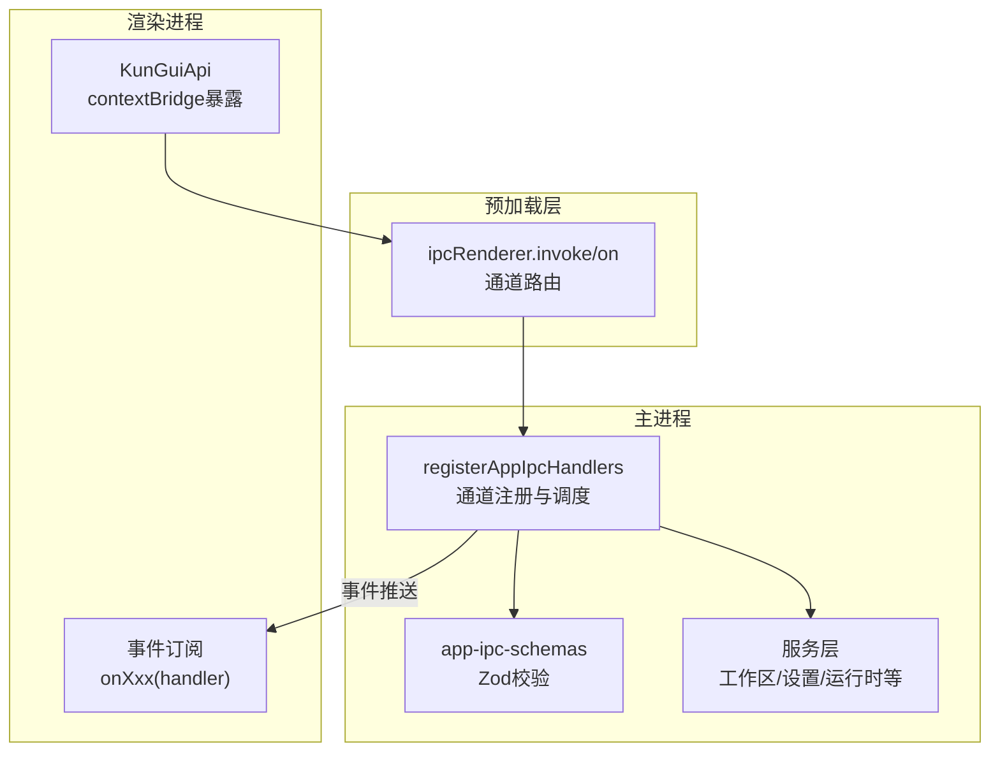
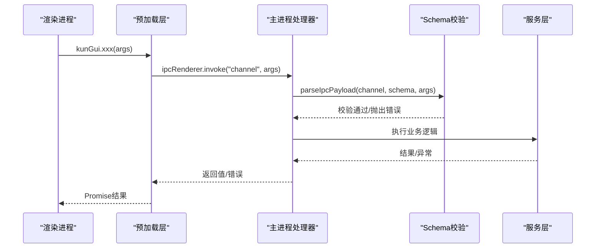
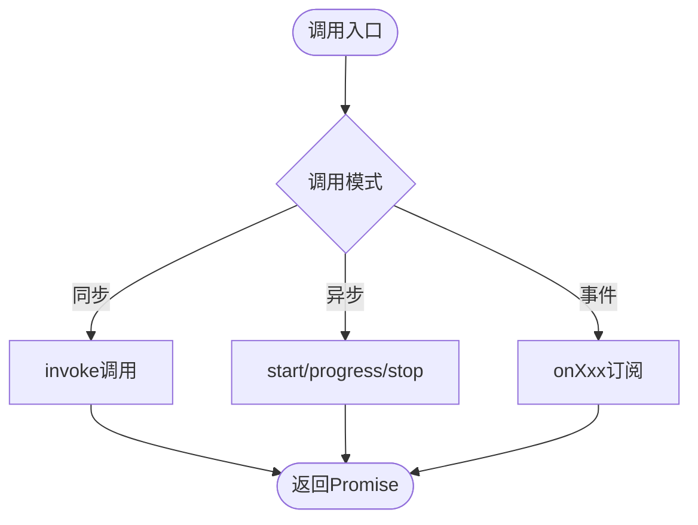
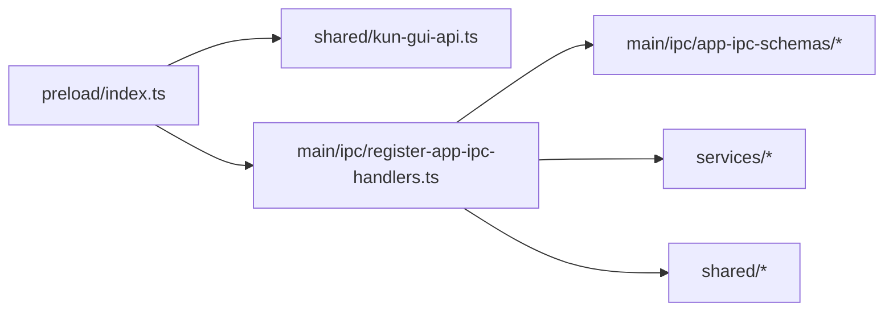

# IPC接口规范

<cite>
**本文引用的文件**
- [src/preload/index.ts](file://src/preload/index.ts)
- [src/shared/kun-gui-api.ts](file://src/shared/kun-gui-api.ts)
- [src/main/ipc/register-app-ipc-handlers.ts](file://src/main/ipc/register-app-ipc-handlers.ts)
- [src/main/ipc/app-ipc-schemas.ts](file://src/main/ipc/app-ipc-schemas.ts)
- [src/main/ipc/app-ipc-schemas/common.ts](file://src/main/ipc/app-ipc-schemas/common.ts)
- [src/main/ipc/app-ipc-schemas/runtime.ts](file://src/main/ipc/app-ipc-schemas/runtime.ts)
- [src/shared/extension-ipc.ts](file://src/shared/extension-ipc.ts)
</cite>

## 目录
1. [简介](#简介)
2. [项目结构](#项目结构)
3. [核心组件](#核心组件)
4. [架构总览](#架构总览)
5. [详细组件分析](#详细组件分析)
6. [依赖关系分析](#依赖关系分析)
7. [性能考虑](#性能考虑)
8. [故障排除指南](#故障排除指南)
9. [结论](#结论)
10. [附录：IPC方法清单与类型](#附录ipc方法清单与类型)

## 简介
本规范文档面向DeepSeek-GUI的主进程与渲染进程之间的IPC通信，覆盖消息格式、事件类型、错误处理机制、通道设计模式（同步调用、异步请求、事件订阅）、安全模型（权限验证与沙箱隔离）、性能优化策略（批量操作与连接池管理）以及调试与故障排除。文档同时提供完整的TypeScript类型定义引用与使用示例路径，帮助开发者快速理解并正确使用IPC能力。

## 项目结构
DeepSeek-GUI的IPC由三部分构成：
- 渲染侧暴露API：通过preload脚本将受控API注入到渲染进程上下文，统一封装所有IPC调用与事件订阅。
- 主侧处理器注册：集中注册所有IPC通道处理器，负责参数校验、权限校验、业务编排与结果返回。
- 共享类型与Schema：在shared与main/ipc中维护统一的类型定义与输入校验Schema，确保两端契约一致。

图表来源
- [src/preload/index.ts:49-684](file://src/preload/index.ts#L49-L684)
- [src/main/ipc/register-app-ipc-handlers.ts:686-800](file://src/main/ipc/register-app-ipc-handlers.ts#L686-L800)
- [src/main/ipc/app-ipc-schemas.ts:1-8](file://src/main/ipc/app-ipc-schemas.ts#L1-L8)

章节来源
- [src/preload/index.ts:1-685](file://src/preload/index.ts#L1-L685)
- [src/main/ipc/register-app-ipc-handlers.ts:1-800](file://src/main/ipc/register-app-ipc-handlers.ts#L1-L800)
- [src/main/ipc/app-ipc-schemas.ts:1-8](file://src/main/ipc/app-ipc-schemas.ts#L1-L8)

## 核心组件
- 渲染侧API（KunGuiApi）：在preload中通过contextBridge暴露给渲染进程，包含大量同步调用方法与事件订阅方法，覆盖设置、文件、工作区、运行时、SSE、终端、扩展、更新、对话框等能力。
- 主侧IPC处理器注册：集中实现所有通道的入参校验、权限校验、业务逻辑调用与结果返回；对敏感或高风险操作进行白名单与可信来源校验。
- 共享类型与Schema：使用Zod进行强类型校验，限制长度、格式、枚举值，防止非法输入进入系统；对运行时HTTP请求进行端点白名单匹配与方法限制。

章节来源
- [src/preload/index.ts:49-684](file://src/preload/index.ts#L49-L684)
- [src/shared/kun-gui-api.ts:581-997](file://src/shared/kun-gui-api.ts#L581-L997)
- [src/main/ipc/register-app-ipc-handlers.ts:443-454](file://src/main/ipc/register-app-ipc-handlers.ts#L443-L454)
- [src/main/ipc/app-ipc-schemas/common.ts:1-66](file://src/main/ipc/app-ipc-schemas/common.ts#L1-L66)
- [src/main/ipc/app-ipc-schemas/runtime.ts:127-275](file://src/main/ipc/app-ipc-schemas/runtime.ts#L127-L275)

## 架构总览
IPC采用“渲染侧统一API + 预加载桥接 + 主侧集中处理器”的分层架构：
- 渲染进程仅能访问预加载暴露的方法，无法直接调用底层Electron API。
- 预加载层负责将方法映射为具体的IPC通道名，并处理事件监听与取消。
- 主侧处理器负责参数校验、权限校验、业务编排、资源管理与错误返回。

图表来源
- [src/preload/index.ts:49-684](file://src/preload/index.ts#L49-L684)
- [src/main/ipc/register-app-ipc-handlers.ts:443-454](file://src/main/ipc/register-app-ipc-handlers.ts#L443-L454)

## 详细组件分析

### 通道设计与调用模式
- 同步调用：大多数功能通过invoke调用，返回Promise，适合读操作或短耗时写操作。
- 异步请求：对于长耗时任务（如数据迁移、下载、SSE流），提供start/stop/ack等方法配合事件回调。
- 事件订阅：通过onXxx方法注册事件处理器，返回取消函数，用于进度、状态变更、通知等。

章节来源
- [src/preload/index.ts:53-684](file://src/preload/index.ts#L53-L684)

### 消息格式与类型约束
- 所有入参均通过Zod Schema进行严格校验，包括字符串长度、URL格式、枚举值、必填字段等。
- 公共常量与工具函数集中在common.ts中，例如最大长度限制、安全协议检查等。
- 运行时请求通过端点模板编译为正则匹配，限制可访问的路径与方法，避免任意HTTP调用。

章节来源
- [src/main/ipc/app-ipc-schemas/common.ts:1-66](file://src/main/ipc/app-ipc-schemas/common.ts#L1-L66)
- [src/main/ipc/app-ipc-schemas/runtime.ts:127-275](file://src/main/ipc/app-ipc-schemas/runtime.ts#L127-L275)

### 事件类型与生命周期
- 进度事件：如数据迁移、本地Whisper模型下载、SSE事件等，通过onProgress或专用事件通道推送。
- 状态事件：如运行时状态、GUI更新状态、终端数据/退出等。
- 通知事件：如扩展通知、工作区文件变更、托盘动作等。
- 每个事件订阅方法都返回取消函数，便于组件卸载时清理监听器。

章节来源
- [src/preload/index.ts:70-130](file://src/preload/index.ts#L70-L130)
- [src/preload/index.ts:420-459](file://src/preload/index.ts#L420-L459)
- [src/preload/index.ts:460-684](file://src/preload/index.ts#L460-L684)

### 错误处理机制
- 参数校验失败：parseIpcPayload会捕获Zod校验错误并抛出带通道名与路径的错误信息。
- 业务异常：服务层抛出的异常会被转换为结构化结果或错误对象返回。
- 网络/IO异常：统一包装为ok:false与message的形式，便于前端展示。
- 安全异常：如非可信来源、未授权操作，直接抛出错误阻止执行。

章节来源
- [src/main/ipc/register-app-ipc-handlers.ts:443-454](file://src/main/ipc/register-app-ipc-handlers.ts#L443-L454)
- [src/main/ipc/register-app-ipc-handlers.ts:558-599](file://src/main/ipc/register-app-ipc-handlers.ts#L558-L599)

### 安全模型与权限控制
- 可信来源校验：对敏感操作（如执行设置变更）要求来自当前主窗口的可信frame，防止跨帧注入。
- 白名单机制：运行时HTTP请求仅允许访问预定义的端点模板，且限制HTTP方法。
- 沙箱隔离：preload运行在sandbox模式下，无法直接访问Node内置模块，所有能力必须通过暴露的API。
- 保护性操作：安装、启用、权限授予、账户会话等需要用户同意流程，并通过受保护的对话框确认。

章节来源
- [src/main/ipc/register-app-ipc-handlers.ts:470-496](file://src/main/ipc/register-app-ipc-handlers.ts#L470-L496)
- [src/main/ipc/register-app-ipc-handlers.ts:757-800](file://src/main/ipc/register-app-ipc-handlers.ts#L757-L800)
- [src/main/ipc/app-ipc-schemas/runtime.ts:239-266](file://src/main/ipc/app-ipc-schemas/runtime.ts#L239-L266)
- [src/shared/extension-ipc.ts:328-367](file://src/shared/extension-ipc.ts#L328-L367)

### TypeScript类型定义与使用示例
- 渲染侧API类型：KunGuiApi定义了所有可用方法及其参数与返回值类型，供IDE提示与类型检查。
- 扩展IPC类型：ExtensionIpcApi定义了扩展相关的IPC接口，包括安装、权限、视图会话、外部浏览器控制等。
- 使用示例：
  - 读取设置：调用getSettings()获取应用配置。
  - 文件操作：writeWorkspaceFile()写入工作区文件，watchWorkspaceFile()监听变更。
  - 运行时请求：runtimeRequest()通过白名单端点访问内部服务。
  - SSE流：startSse()启动流，onSseEvent()接收事件，stopSse()停止流。
  - 终端：createTerminal()创建终端，onTerminalData()接收输出，dispose()释放资源。

章节来源
- [src/shared/kun-gui-api.ts:581-997](file://src/shared/kun-gui-api.ts#L581-L997)
- [src/shared/extension-ipc.ts:424-527](file://src/shared/extension-ipc.ts#L424-L527)
- [src/preload/index.ts:131-684](file://src/preload/index.ts#L131-L684)

## 依赖关系分析
IPC层依赖以下模块：
- Electron API：ipcMain/ipcRenderer、dialog、shell、webContents等。
- 服务层：工作区、设置、运行时、终端、扩展、更新等服务。
- 校验层：Zod Schema用于参数校验与安全限制。
- 共享类型：kun-gui-api.ts与extension-ipc.ts定义两端契约。

图表来源
- [src/preload/index.ts:1-685](file://src/preload/index.ts#L1-L685)
- [src/main/ipc/register-app-ipc-handlers.ts:1-800](file://src/main/ipc/register-app-ipc-handlers.ts#L1-L800)

章节来源
- [src/preload/index.ts:1-685](file://src/preload/index.ts#L1-L685)
- [src/main/ipc/register-app-ipc-handlers.ts:1-800](file://src/main/ipc/register-app-ipc-handlers.ts#L1-L800)

## 性能考虑
- 批量操作：对于频繁的文件变更，使用watch机制合并事件，减少IPC调用次数。
- 连接池管理：工作区文件监听、终端会话等资源通过ID管理，支持复用与释放。
- 事件节流：部分进度事件使用定时器节流，避免高频事件导致渲染阻塞。
- 白名单端点：运行时请求通过端点模板匹配，避免动态路由带来的性能开销。

章节来源
- [src/preload/index.ts:102-130](file://src/preload/index.ts#L102-L130)
- [src/preload/index.ts:376-387](file://src/preload/index.ts#L376-L387)
- [src/main/ipc/register-app-ipc-handlers.ts:733-755](file://src/main/ipc/register-app-ipc-handlers.ts#L733-L755)
- [src/main/ipc/app-ipc-schemas/runtime.ts:127-237](file://src/main/ipc/app-ipc-schemas/runtime.ts#L127-L237)

## 故障排除指南
- 参数校验错误：检查传入参数是否符合Schema定义，关注错误信息中的通道名与字段路径。
- 权限拒绝：确认调用来源是否为主窗口可信frame，敏感操作需通过用户确认。
- 运行时请求失败：检查请求路径是否在白名单内，HTTP方法是否被允许。
- 事件未触发：确认是否正确注册事件监听器，并在组件卸载时取消监听。
- 资源泄漏：确保终端、文件监听器等资源在使用后正确释放。

章节来源
- [src/main/ipc/register-app-ipc-handlers.ts:443-454](file://src/main/ipc/register-app-ipc-handlers.ts#L443-L454)
- [src/main/ipc/register-app-ipc-handlers.ts:470-496](file://src/main/ipc/register-app-ipc-handlers.ts#L470-L496)
- [src/main/ipc/app-ipc-schemas/runtime.ts:239-266](file://src/main/ipc/app-ipc-schemas/runtime.ts#L239-L266)

## 结论
DeepSeek-GUI的IPC设计通过严格的类型校验、安全控制与分层架构，实现了主进程与渲染进程之间的高效、安全通信。开发者应遵循规范使用IPC接口，注意权限验证与资源管理，以获得最佳的性能与稳定性。

## 附录：IPC方法清单与类型
以下为常用IPC方法分类与类型引用路径：

- 设置管理：getSettings、setSettings、saveSettingsSilent
  - 类型定义：[src/shared/kun-gui-api.ts:628-684](file://src/shared/kun-gui-api.ts#L628-L684)
- 文件与工作区：readWorkspaceFile、writeWorkspaceFile、listWorkspaceDirectory、watchWorkspaceFile
  - 类型定义：[src/shared/kun-gui-api.ts:733-800](file://src/shared/kun-gui-api.ts#L733-L800)
- 运行时与SSE：runtimeRequest、startSse、onSseEvent、stopSse
  - 类型定义：[src/shared/kun-gui-api.ts:685-713](file://src/shared/kun-gui-api.ts#L685-L713)
- 终端：createTerminal、onTerminalData、dispose
  - 类型定义：[src/shared/kun-gui-api.ts:158-164](file://src/shared/kun-gui-api.ts#L158-L164)
- 扩展：extensionInstall、extensionEnable、extensionList
  - 类型定义：[src/shared/extension-ipc.ts:424-527](file://src/shared/extension-ipc.ts#L424-L527)
- 更新：checkGuiUpdate、downloadGuiUpdate、installGuiUpdate
  - 类型定义：[src/shared/kun-gui-api.ts:747-774](file://src/shared/kun-gui-api.ts#L747-L774)

章节来源
- [src/shared/kun-gui-api.ts:581-997](file://src/shared/kun-gui-api.ts#L581-L997)
- [src/shared/extension-ipc.ts:424-527](file://src/shared/extension-ipc.ts#L424-L527)
- [src/preload/index.ts:131-684](file://src/preload/index.ts#L131-L684)