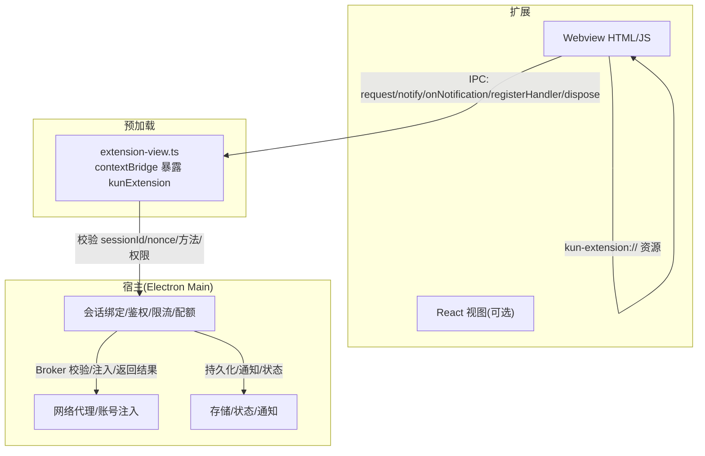
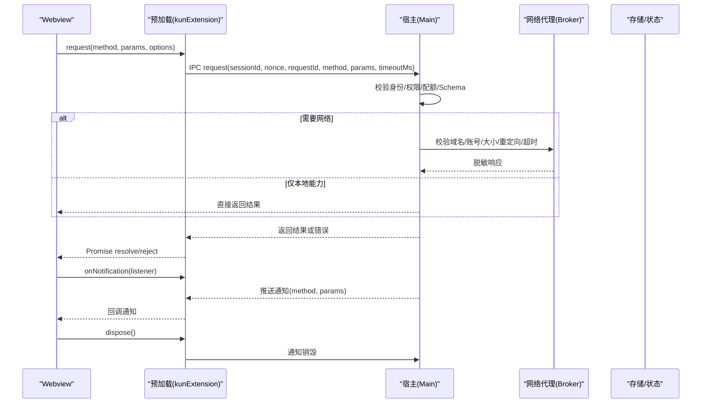
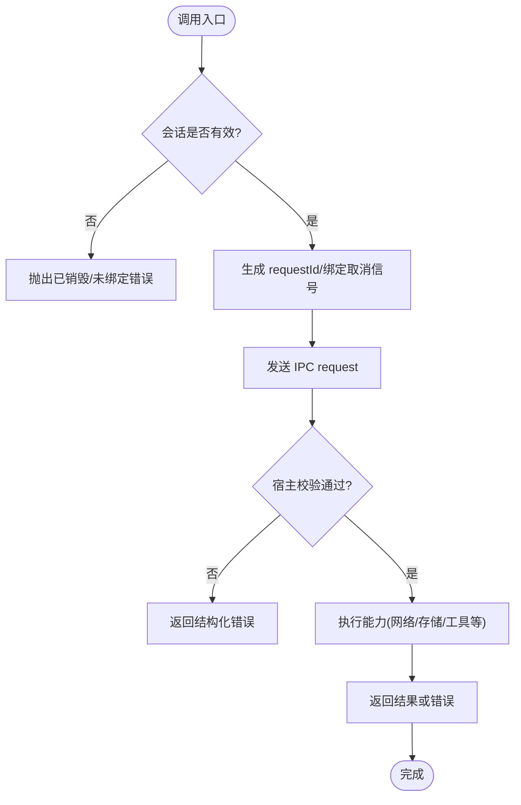
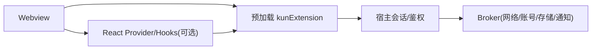

# Webview API接口

<cite>
**本文引用的文件**
- [webview-and-dom.md](file://docs/extensions/webview-and-dom.md)
- [api-reference.md](file://docs/extensions/api-reference.md)
- [lifecycle.md](file://docs/extensions/lifecycle.md)
- [security-and-resources.md](file://docs/extensions/security-and-resources.md)
- [extension-view.ts](file://src/preload/extension-view.ts)
- [index.d.ts](file://src/preload/index.d.ts)
</cite>

## 目录
1. [简介](#简介)
2. [项目结构](#项目结构)
3. [核心组件](#核心组件)
4. [架构总览](#架构总览)
5. [详细组件分析](#详细组件分析)
6. [依赖关系分析](#依赖关系分析)
7. [性能与资源限制](#性能与资源限制)
8. [故障排查指南](#故障排查指南)
9. [结论](#结论)
10. [附录：常用API速查](#附录常用api速查)

## 简介
本参考文档面向在 DeepSeek-GUI 扩展中开发 Webview 的开发者，聚焦以下目标：
- 说明 Webview 与宿主进程之间的通信机制（消息、事件、数据同步）。
- 文档化在 Webview 中安全操作 DOM 的方式与边界。
- 说明样式控制能力（主题、语言、缩放、可访问性）及响应式适配建议。
- 覆盖 Webview 生命周期（创建、销毁、清理）与失败恢复。
- 提供调试技巧与发布前检查清单。

## 项目结构
围绕 Webview 的关键位置包括：
- 文档层：Webview 安全、API 参考、生命周期、权限与安全策略。
- 预加载层：通过 Electron contextBridge 暴露窄桥到 Webview。
- 运行时约束：CSP、本地资源协议、网络代理、隔离世界等。

图表来源
- [extension-view.ts:1-150](file://src/preload/extension-view.ts#L1-L150)
- [webview-and-dom.md:45-92](file://docs/extensions/webview-and-dom.md#L45-L92)
- [security-and-resources.md:96-126](file://docs/extensions/security-and-resources.md#L96-L126)

章节来源
- [webview-and-dom.md:19-92](file://docs/extensions/webview-and-dom.md#L19-L92)
- [api-reference.md:25-80](file://docs/extensions/api-reference.md#L25-L80)
- [security-and-resources.md:96-126](file://docs/extensions/security-and-resources.md#L96-L126)

## 核心组件
- 窄桥传输层：在预加载脚本中以 `window.kunExtension` 暴露最小方法集，用于请求、通知、监听与处理器注册，并支持取消与释放。
- 宿主侧校验：基于会话 ID、随机数、发送者身份、贡献点与工作区范围进行严格校验。
- 网络代理：所有网络请求必须走 Broker，受域名白名单、账号作用域、大小/超时/并发限制。
- 状态与配置：主题、语言、缩放、可访问性偏好通过桥同步；View State 使用受控存储。
- 生命周期：每个复杂 View 拥有独立 Session，关闭/切换工作区/卸载会清理订阅与资源。

章节来源
- [extension-view.ts:1-150](file://src/preload/extension-view.ts#L1-L150)
- [webview-and-dom.md:81-125](file://docs/extensions/webview-and-dom.md#L81-L125)
- [lifecycle.md:118-131](file://docs/extensions/lifecycle.md#L118-L131)

## 架构总览
Webview 与宿主的交互遵循“最小暴露 + 强校验 + 有界资源”的原则。

图表来源
- [extension-view.ts:88-149](file://src/preload/extension-view.ts#L88-L149)
- [security-and-resources.md:96-126](file://docs/extensions/security-and-resources.md#L96-L126)

## 详细组件分析

### 通信与消息传递
- 请求/响应：通过 `request(method, params, options)` 发起调用，支持 AbortSignal 与超时。
- 通知：通过 `onNotification(listener)` 接收宿主推送的事件。
- 处理器：通过 `registerHandler(method, handler)` 向宿主暴露可被调用的方法，便于双向协作。
- 销毁：调用 `dispose()` 清理监听器、处理器与 IPC 通道。

图表来源
- [extension-view.ts:21-149](file://src/preload/extension-view.ts#L21-L149)

章节来源
- [extension-view.ts:1-150](file://src/preload/extension-view.ts#L1-L150)
- [api-reference.md:25-80](file://docs/extensions/api-reference.md#L25-L80)

### 事件监听与数据同步
- 事件模型：Host 通过 `notification` 事件推送变更（如主题、语言、缩放、可访问性、View 状态更新）。
- 订阅管理：每次订阅返回可释放对象，确保 unmount 时清理。
- 数据一致性：View State 由宿主按扩展+贡献+工作区维度维护，避免浏览器 storage 作为持久化手段。

章节来源
- [webview-and-dom.md:81-145](file://docs/extensions/webview-and-dom.md#L81-L145)
- [lifecycle.md:118-131](file://docs/extensions/lifecycle.md#L118-L131)

### DOM 操作 API 与安全边界
- 推荐做法：优先使用声明式贡献或 Webview；仅在确有必要且接受不稳定选择器的风险时使用 Direct DOM。
- 隔离世界：content script 运行于 isolated world，可读取/修改可见 DOM，但不具备 Node/Electron/敏感全局。
- 安全约束：hostDom 为高风险能力，需显式声明与授权；不可绕过 CSP；不得注入不受信任代码。
- 兼容性与生命周期：宿主元素/选择器不属于稳定 API；deactivation 时会尝试清理标记节点与样式。

章节来源
- [webview-and-dom.md:192-287](file://docs/extensions/webview-and-dom.md#L192-L287)
- [security-and-resources.md:19-32](file://docs/extensions/security-and-resources.md#L19-L32)

### 样式控制与主题
- 主题令牌：通过 UI 能力获取已解析的主题 token（背景、前景、强调色、边框、成功/危险等），不引用私有 CSS 变量或类名。
- 语言与方向：通过 locale 能力获取当前语言与文字方向。
- 缩放与可访问性：跟随工作台设置变化自动同步；遵守 reduced motion/high contrast。
- 动态样式注入：如需注入样式，应通过宿主管理的 style 根与 marker，避免污染全局。

章节来源
- [webview-and-dom.md:139-155](file://docs/extensions/webview-and-dom.md#L139-L155)

### 网络与外部导航
- 网络代理：所有网络请求必须经 Broker，受精确域名白名单、账号作用域、大小/超时/并发限制。
- 外部打开：禁止直接下载或创建未批准窗口；需通过宿主命令打开外部 HTTPS 页面。
- 受限远程浏览：仅在明确声明 externalBrowser 且满足严格条件时，宿主可为固定目标创建受限浏览容器。

章节来源
- [webview-and-dom.md:156-186](file://docs/extensions/webview-and-dom.md#L156-L186)
- [security-and-resources.md:96-126](file://docs/extensions/security-and-resources.md#L96-L126)

### 生命周期管理
- 创建：每个复杂 View 拥有独立 Session，绑定扩展 ID、版本、贡献点、工作区、WebContents 身份与不可猜 nonce。
- 运行：请求/事件/状态均受权限与配额约束；崩溃仅影响该 Session。
- 销毁：关闭/禁用/卸载/切换工作区/来宾崩溃会取消待处理调用、释放订阅与宿主资源，拒绝过期消息。

章节来源
- [webview-and-dom.md:19-43](file://docs/extensions/webview-and-dom.md#L19-L43)
- [webview-and-dom.md:188-191](file://docs/extensions/webview-and-dom.md#L188-L191)
- [lifecycle.md:118-131](file://docs/extensions/lifecycle.md#L118-L131)

## 依赖关系分析
- 预加载与宿主：通过 IPC 建立会话绑定与消息路由，依赖 sessionId/nonce 与 sender-bound 身份。
- 宿主与 Broker：网络/账号/存储/通知等能力由宿主统一编排与校验。
- Webview 与 SDK：推荐使用框架无关的 client/Hooks，避免直接依赖内部实现细节。

图表来源
- [extension-view.ts:88-149](file://src/preload/extension-view.ts#L88-L149)
- [api-reference.md:25-80](file://docs/extensions/api-reference.md#L25-L80)

章节来源
- [extension-view.ts:1-150](file://src/preload/extension-view.ts#L1-L150)
- [api-reference.md:25-80](file://docs/extensions/api-reference.md#L25-L80)

## 性能与资源限制
- 默认限额：单 IPC 消息、激活时限、操作时限、取消宽限期、关闭时限、并发上限、流窗口、事件速率、内存上限、日志轮转、状态文档大小、网络请求体等均有默认值，可被平台/用户策略收紧。
- 背压与释放：生产者需等待确认，队列需设项/字节上限；取消/终态后释放缓冲、计时器、监听器与关联状态。
- 最佳实践：避免无界缓存/重试；对长任务提供取消与进度；对超限返回结构化错误。

章节来源
- [security-and-resources.md:134-166](file://docs/extensions/security-and-resources.md#L134-L166)

## 故障排查指南
- 常见问题定位：
  - 会话未绑定或已销毁：检查是否在 dispose 后继续调用。
  - 方法未注册：确保 registerHandler 正确命名且未被重复覆盖。
  - 权限不足：确认 Manifest 声明与用户授权包含所需能力。
  - 网络被拒：核对域名白名单、账号作用域与 Broker 限制。
- 诊断与日志：
  - 使用宿主提供的诊断与日志命令查看扩展健康、重启次数、熔断状态与最近错误。
  - 日志需脱敏，不包含密钥、完整请求体或敏感上下文。
- 恢复步骤：
  - 重新打开 View 或切换工作区以重建会话。
  - 重新授权或调整权限后重试。
  - 必要时重载扩展或回滚版本。

章节来源
- [lifecycle.md:143-155](file://docs/extensions/lifecycle.md#L143-L155)
- [security-and-resources.md:168-195](file://docs/extensions/security-and-resources.md#L168-L195)

## 结论
DeepSeek-GUI 的 Webview 环境通过“窄桥 + 强校验 + Broker 化能力”实现了高安全、可审计、可治理的扩展体验。开发者应优先使用稳定 API 与声明式贡献，谨慎使用 Direct DOM；在网络、存储、主题与生命周期方面遵循宿主约束与配额策略，以获得更稳定的跨版本兼容性。

## 附录：常用API速查
- 预加载暴露
  - window.kunExtension.request(method, params, options)
  - window.kunExtension.notify(method, params)
  - window.kunExtension.onNotification(listener)
  - window.kunExtension.registerHandler(method, handler)
  - window.kunExtension.dispose()
- 主题与环境
  - 获取主题 token、语言、缩放、可访问性偏好（通过 UI 能力）
- 网络
  - 通过宿主网络能力发起请求（受 Broker 校验）
- 状态
  - 使用 View State 保存 UI 相关非敏感数据（受 Schema/配额约束）

章节来源
- [extension-view.ts:88-149](file://src/preload/extension-view.ts#L88-L149)
- [webview-and-dom.md:81-145](file://docs/extensions/webview-and-dom.md#L81-L145)
- [api-reference.md:25-80](file://docs/extensions/api-reference.md#L25-L80)