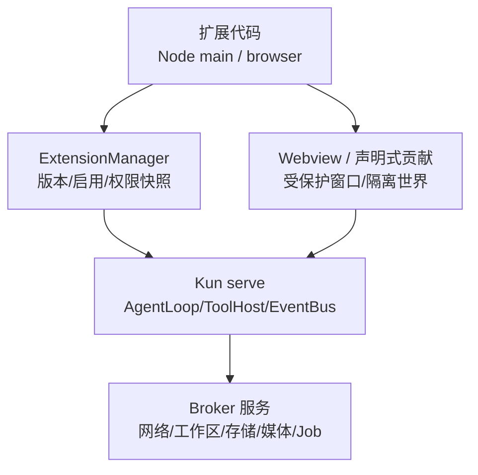
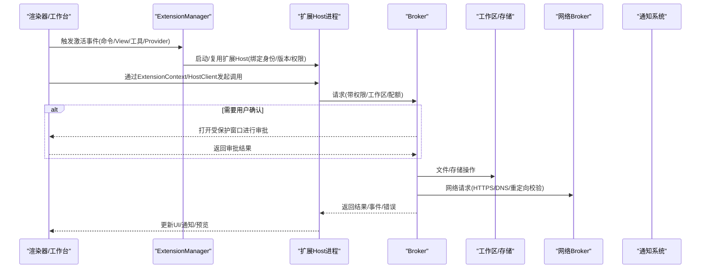
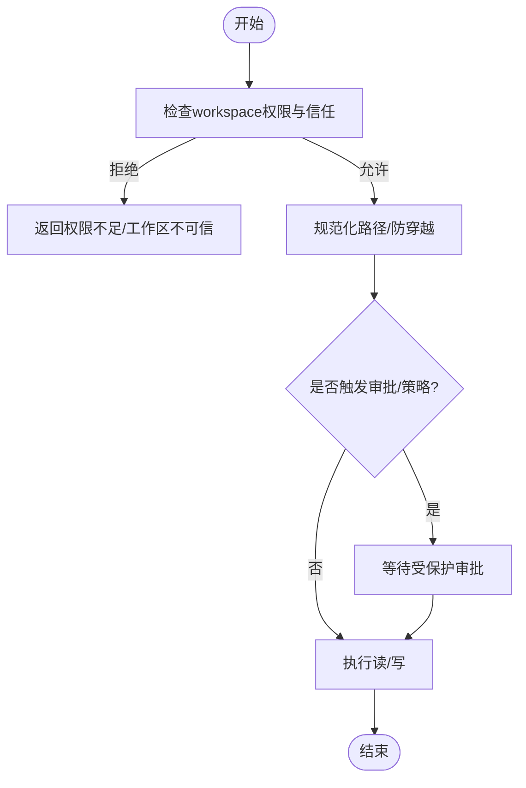
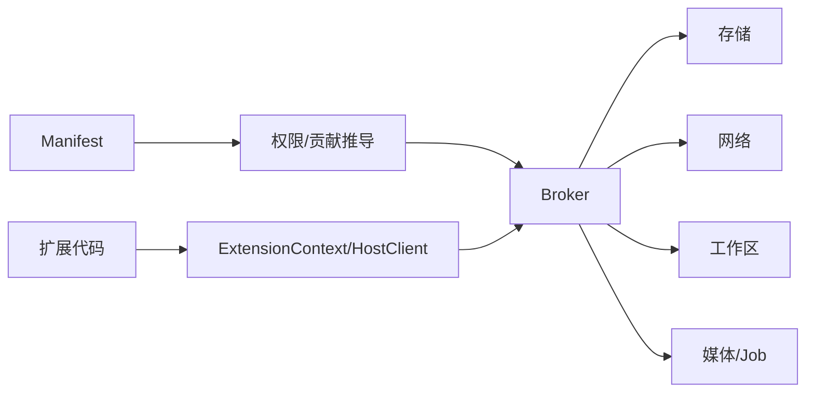

# 宿主API接口

<cite>
**本文引用的文件**
- [docs/extensions/api-reference.md](file://docs/extensions/api-reference.md)
- [docs/extensions/architecture.md](file://docs/extensions/architecture.md)
- [docs/extensions/lifecycle.md](file://docs/extensions/lifecycle.md)
- [docs/extensions/manifest.md](file://docs/extensions/manifest.md)
- [docs/extensions/security-and-resources.md](file://docs/extensions/security-and-resources.md)
</cite>

## 目录
1. [简介](#简介)
2. [项目结构](#项目结构)
3. [核心组件](#核心组件)
4. [架构总览](#架构总览)
5. [详细组件分析](#详细组件分析)
6. [依赖关系分析](#依赖关系分析)
7. [性能与资源限制](#性能与资源限制)
8. [故障排查指南](#故障排查指南)
9. [结论](#结论)
10. [附录：IPC协议、错误模型与权限清单](#附录ipc协议错误模型与权限清单)

## 简介
本文件为 DeepSeek-GUI 扩展系统的“宿主API接口”文档，聚焦扩展如何与主进程通信，覆盖文件系统访问、窗口管理、通知系统、设置存储等核心能力；同时系统化说明 IPC 通信协议、消息格式与错误处理机制，提供完整的 API 方法清单（参数、返回值、示例路径），并详述权限模型与安全最佳实践。读者可据此安全地开发扩展，正确申请和使用系统资源。

## 项目结构
本项目将扩展平台相关的设计与契约集中在 docs/extensions 目录下，围绕 Manifest、生命周期、架构边界、安全与资源、以及 API 参考展开。核心要点：
- 扩展通过声明式 Manifest 注册贡献点与权限，由宿主在受保护窗口或渲染树中呈现。
- Node Host 以独立子进程运行，暴露稳定的 ExtensionContext/HostClient 给扩展使用。
- 所有敏感操作均经 Broker 校验与配额控制，遵循最小权限原则。

图表来源
- [docs/extensions/architecture.md:11-29](file://docs/extensions/architecture.md#L11-L29)
- [docs/extensions/architecture.md:44-57](file://docs/extensions/architecture.md#L44-L57)

章节来源
- [docs/extensions/architecture.md:1-124](file://docs/extensions/architecture.md#L1-L124)

## 核心组件
- ExtensionContext：扩展激活时由宿主注入的上下文，提供命令、存储、网络、工作区、Agent、工具、Provider、认证、媒体、Job、UI 等服务入口。
- ExtensionHostClient：Webview 侧通过 HostTransport 创建的客户端，用于调用宿主能力。
- Manifest：声明扩展身份、入口、激活事件、贡献点、权限与状态 Schema 版本。
- Broker：统一网关，负责权限校验、配额、审计、取消与结果限流。
- 受保护表面：安装/升级、权限变更、信任、凭据输入、外部副作用审批等交互由宿主创建的安全窗口承载。

章节来源
- [docs/extensions/api-reference.md:25-77](file://docs/extensions/api-reference.md#L25-L77)
- [docs/extensions/manifest.md:9-89](file://docs/extensions/manifest.md#L9-L89)
- [docs/extensions/security-and-resources.md:48-60](file://docs/extensions/security-and-resources.md#L48-L60)

## 架构总览
扩展平台不创建第二套 Agent runtime，所有对话、线程、工具、审批、事件、Provider 路由与用量仍由唯一 Kun runtime 负责。扩展只能通过公开 Host Context 和 Broker 调用这些能力。执行位置包括：
- Node main：每个扩展独立 Node 子进程，适合工具、Provider、认证处理器、Agent、后台命令。
- browser/Webview：Chromium 沙箱 + context isolation + Node off，仅暴露窄桥，默认禁止直连网络。
- 声明式贡献：宿主渲染图标/动作/设置等，不运行插件 React。
- hostContentScripts：仅在极需直接读写宿主 DOM 时使用，高风险且不稳定。

图表来源
- [docs/extensions/architecture.md:11-29](file://docs/extensions/architecture.md#L11-L29)
- [docs/extensions/architecture.md:44-57](file://docs/extensions/architecture.md#L44-L57)
- [docs/extensions/security-and-resources.md:48-60](file://docs/extensions/security-and-resources.md#L48-L60)

## 详细组件分析

### 文件系统与工作区访问
- 通过 workspace.read/workspace.write 权限访问已授权根目录下的文件。
- 路径规范化，防止遍历/符号链接逃逸；写入可能继续触发沙箱/审批。
- 权限撤销后，下一次文件操作必须失败，即使之前已创建的工具目录或线程存在。

图表来源
- [docs/extensions/security-and-resources.md:128-133](file://docs/extensions/security-and-resources.md#L128-L133)

章节来源
- [docs/extensions/security-and-resources.md:128-133](file://docs/extensions/security-and-resources.md#L128-L133)

### 窗口管理与视图会话
- 复杂 View 每次打开创建独立 View Session，绑定扩展ID、版本、贡献ID、工作区与不可猜 nonce。
- 关闭 View、切换工作区、禁用/卸载、Guest 崩溃会取消待处理调用、释放订阅与资源、拒绝过期消息。
- 受保护窗口由 Electron Main/核心创建，不挂载扩展 Webview 或注入 content script。

章节来源
- [docs/extensions/architecture.md:70-82](file://docs/extensions/architecture.md#L70-L82)
- [docs/extensions/lifecycle.md:118-131](file://docs/extensions/lifecycle.md#L118-L131)
- [docs/extensions/security-and-resources.md:48-60](file://docs/extensions/security-and-resources.md#L48-L60)

### 通知系统与 Composer 上下文
- ui.showNotification(options) 返回用户选择的 action id；关闭、超时、lease 失效或扩展停用返回 undefined。
- ui.attachComposerContext(request) 仅允许已认证的交互式 View 在获得 ui.actions 后调用，携带受限 JSON 引用，Host 重新校验身份/版本/信任/权限，并在匹配工作区的输入框显示可移除上下文，随下一次成功 turn 消费一次。

章节来源
- [docs/extensions/api-reference.md:66-69](file://docs/extensions/api-reference.md#L66-L69)

### 设置与存储
- Global State(storage.global)、Workspace State(storage.workspace)、View State(webview/View contract)、Credential Store(Account Broker)。
- 写入经过 Schema、大小/配额与范围验证；采用安全/原子持久化；迁移全成才切换；卸载默认保留状态。
- 禁止存放秘密、二进制大日志、完整附件等；账号秘密走 Credential Store。

章节来源
- [docs/extensions/security-and-resources.md:61-95](file://docs/extensions/security-and-resources.md#L61-L95)

### 网络与认证获取
- 优先精确 network:<hostname>，必要时显式 network:*.example.com。
- Broker 校验 HTTPS、目标主机名、生产直连 DNS/Socket、重定向链、扩展/工作区/账号范围、方法/头体 Schema、超时/响应字节/并发/速率、取消与审计/脱敏。
- Authenticated Fetch 只传 account reference，Account Broker 刷新并注入认证，移除敏感头；响应前移除凭证材料。

章节来源
- [docs/extensions/security-and-resources.md:96-127](file://docs/extensions/security-and-resources.md#L96-L127)

### 媒体与任务(Job)
- media.* 要求最小 media.read/process/export 权限及适用工作区权限；headless 环境返回 interaction-required/unavailable。
- jobs.subscribe() 从可选 cursor 之后重放保留事件，再交付有界实时事件；replayGap 提醒刷新 snapshot；取消幂等，terminal job 保留原始 outcome。
- 只有受支持 core broker 可创建 job；扩展不能注册任意 worker。

章节来源
- [docs/extensions/api-reference.md:56-65](file://docs/extensions/api-reference.md#L56-L65)

### 命令、工具与 Provider
- commands.register：注册/执行/释放命令 handler。
- tools.register：注册工具，支持 progress、cancellation、bounded result 与 outputSchema。
- modelProviders：自定义 Provider adapter 的 probe/listModels/stream/cancel/countTokens。
- 工具/Provider 调用经 CapabilityRegistry -> ToolHost/RemoteModelClient，参数、审批、授权、取消、输出上限与历史顺序由宿主控制。

章节来源
- [docs/extensions/api-reference.md:43-58](file://docs/extensions/api-reference.md#L43-L58)
- [docs/extensions/architecture.md:83-89](file://docs/extensions/architecture.md#L83-L89)

## 依赖关系分析
- 扩展对宿主的依赖通过 ExtensionContext/HostClient 与 Broker 抽象，避免直接耦合内部实现。
- Manifest 驱动静态发现与权限推导；激活事件决定何时启动 Node Host。
- 各服务（存储、网络、工作区、媒体、Job）由 Broker 统一治理，确保一致的安全与配额策略。

图表来源
- [docs/extensions/manifest.md:159-208](file://docs/extensions/manifest.md#L159-L208)
- [docs/extensions/architecture.md:58-68](file://docs/extensions/architecture.md#L58-L68)

章节来源
- [docs/extensions/manifest.md:159-208](file://docs/extensions/manifest.md#L159-L208)
- [docs/extensions/architecture.md:58-68](file://docs/extensions/architecture.md#L58-L68)

## 性能与资源限制
- 单 IPC 消息 1 MiB；激活截止 15s；一般操作截止 60s；取消宽限 2s；关机截止 5s。
- 每扩展并发操作 16；流窗口 32 未 ack 或 4 MiB；Host 事件率 200 events/s。
- Node Host 内存上限 256 MiB；连续崩溃开路阈值 3；日志轮转 5 MiB × 3。
- 状态文档 10 MiB；状态迁移截止 30s；网络/认证请求体 8 MiB。
- 达到限额返回稳定结构化错误；不得用无限队列/重试规避。

章节来源
- [docs/extensions/security-and-resources.md:134-157](file://docs/extensions/security-and-resources.md#L134-L157)

## 故障排查指南
- 诊断：kun extension doctor <扩展ID> 查看选中/安装版本、来源/签名、启用/权限快照、Manifest/API/Kun/RPC协商、状态schema、Host PID、激活原因、重启/熔断、限额失败、最近结构化错误与日志位置。
- 日志：kun extension logs <扩展ID> [--json] 按扩展ID/版本/进程实例归因并轮转。
- 常见错误：interaction-required、permission-revoked、circuit-open、quota-exceeded、timeout、unknown-outcome（外部副作用无法确认）。
- 建议：对 stream/queue/cache 设置 bytes/items/time 上限；取消/dispose 幂等；terminal fence 后丢弃迟到结果；不在日志记录敏感信息。

章节来源
- [docs/extensions/lifecycle.md:143-156](file://docs/extensions/lifecycle.md#L143-L156)
- [docs/extensions/security-and-resources.md:168-196](file://docs/extensions/security-and-resources.md#L168-L196)

## 结论
DeepSeek-GUI 扩展宿主API以“身份绑定 + 最小权限 + 受保护同意 + 有界资源”为核心，通过 Manifest 声明、Broker 治理与受保护窗口，确保扩展在安全边界内访问文件系统、窗口、通知、设置、网络、媒体与任务等能力。开发者应严格遵循权限模型、资源限额与背压/取消语义，使用官方 SDK 与公开 Schema，避免直接依赖私有实现。

## 附录：IPC协议、错误模型与权限清单

### IPC 通信协议概览
- 连接建立：宿主为每个扩展版本维护一个 Node Host 子进程；连接绑定扩展身份、版本、工作区、权限与生命周期 nonce。
- 消息通道：基于版本化的私有 JSON IPC；扩展不得直接连接 rpcVersion，也不得持有 GUI/runtime bearer token。
- 调用流程：扩展通过 ExtensionContext/HostClient 发起调用，Broker 校验权限/配额/Schema，转发到对应服务，返回结果或事件流。
- 背压与取消：Producer 等待 ack；取消传播至上游；terminal 后不再接受新消息；晚到结果丢弃。

章节来源
- [docs/extensions/architecture.md:11-31](file://docs/extensions/architecture.md#L11-L31)
- [docs/extensions/architecture.md:44-57](file://docs/extensions/architecture.md#L44-L57)
- [docs/extensions/lifecycle.md:106-117](file://docs/extensions/lifecycle.md#L106-L117)

### 错误模型
- 结构化错误：包含稳定错误码、诊断信息与降级提示；达到限额/超时/取消等返回稳定错误。
- 典型错误：
  - interaction-required：需要登录/审批/用户输入但处于 headless。
  - permission-revoked：权限被撤销，后续调用失败。
  - circuit-open：连续崩溃触发熔断。
  - quota-exceeded：超出消息/并发/速率/内存等限额。
  - unknown-outcome：外部副作用已发生但无法确认结果。
- 处理建议：幂等取消与清理；不重试未知 outcome；向用户提供可操作提示。

章节来源
- [docs/extensions/lifecycle.md:106-117](file://docs/extensions/lifecycle.md#L106-L117)
- [docs/extensions/security-and-resources.md:134-157](file://docs/extensions/security-and-resources.md#L134-L157)

### 权限清单与申请方式
- 声明位置：Manifest permissions 数组；贡献点自动推导最小权限。
- 关键权限：
  - 命令/UI：commands.register、ui.views、ui.actions、ui.notifications
  - 视图：webview、webview.external（需对应 network:*）
  - 工作区：workspace.read、workspace.write
  - 存储：storage.global、storage.workspace
  - 网络：network:<hostname> 或 network:*.example.com
  - Agent/工具/Provider：agent.run、agent.threads.readOwn、tools.register、providers.register
  - 账号：accounts.read、accounts.use:<providerId>、accounts.manage:<providerId>、accounts.secrets.read:<providerId>（高风险）
  - Direct DOM：hostDom（高风险）
- 生效规则：安装/新增权限需在受保护窗口确认；Grant 绑定扩展ID/版本/工作区策略；每次操作重新检查；请求只能缩小 grant；撤销立即阻止新调用；跨扩展默认隔离。

章节来源
- [docs/extensions/manifest.md:189-208](file://docs/extensions/manifest.md#L189-L208)
- [docs/extensions/manifest.md:282-309](file://docs/extensions/manifest.md#L282-L309)
- [docs/extensions/security-and-resources.md:34-47](file://docs/extensions/security-and-resources.md#L34-L47)

### 完整 API 方法清单（按服务分组）
说明：以下为宿主对外提供的能力分类与方法族，具体字段与类型以 @kun/extension-api 的 .d.ts 与运行时 Schema 为准。

- 命令 CommandsApi
  - registerCommand(id, handler): Promise<void>
  - executeCommand(id, args?): Promise<any>
  - 用途：注册/执行/释放命令；handler 需加入 subscriptions。
  - 权限：commands.register（贡献推导）
  - 示例路径：[docs/extensions/api-reference.md:29-41](file://docs/extensions/api-reference.md#L29-L41)

- 存储 StorageApi / ScopedStorageApi
  - get/set/delete(key, value?, scope?)
  - 用途：读取/写入/删除扩展隔离的全局或工作区状态。
  - 权限：storage.global / storage.workspace
  - 约束：Schema-valid、size/quota-bounded；禁止存秘密/二进制大日志。
  - 示例路径：[docs/extensions/security-and-resources.md:61-95](file://docs/extensions/security-and-resources.md#L61-L95)

- 网络 NetworkApi
  - fetch(request): Promise<NetworkResponse>
  - 用途：通过 Broker 发起网络请求，校验 scheme/host/DNS/redirect/配额/审计。
  - 权限：network:<hostname> 或 network:*.example.com
  - 示例路径：[docs/extensions/security-and-resources.md:96-123](file://docs/extensions/security-and-resources.md#L96-L123)

- 工作区 WorkspaceApi
  - read/write 文件、列出目录、创建/删除等（通过 Broker）
  - 权限：workspace.read / workspace.write
  - 约束：路径规范化、防穿越；写入可能触发审批。
  - 示例路径：[docs/extensions/security-and-resources.md:128-133](file://docs/extensions/security-and-resources.md#L128-L133)

- 通知 UiApi
  - showNotification(options): Promise<string | undefined>
  - attachComposerContext(request): Promise<boolean>
  - 用途：展示通知并获取用户选择；将受限上下文附加到主会话输入框。
  - 权限：ui.notifications / ui.actions
  - 示例路径：[docs/extensions/api-reference.md:66-69](file://docs/extensions/api-reference.md#L66-L69)

- 媒体 MediaApi
  - pickFiles/pickSaveTarget/openViewResource/stat/probe/readText/release/startFfmpegJob/startAudioAnalysisJob/startArchiveJob 等
  - 用途：受保护的文件选择、媒体探测/读取、FFmpeg/归档/音频分析任务。
  - 权限：media.read/process/export + 适用工作区权限
  - 行为：headless 返回 interaction-required/unavailable；handle/lease 短期有效。
  - 示例路径：[docs/extensions/api-reference.md:56-65](file://docs/extensions/api-reference.md#L56-L65)

- 任务 JobsApi
  - subscribe(filter?, cursor?): Promise<JobSubscription>
  - list/get/cancel(filter)
  - 用途：订阅/查询/取消扩展自有 durable job；支持重放与快照。
  - 权限：jobs.manage
  - 行为：replayGap 提醒刷新；取消幂等；terminal 保留原始 outcome。
  - 示例路径：[docs/extensions/api-reference.md:64-65](file://docs/extensions/api-reference.md#L64-L65)

- 工具 ToolsApi
  - registerTool(definition, handler): Promise<void>
  - 用途：注册工具，支持 input/output schema、进度、取消、有界结果。
  - 权限：tools.register
  - 示例路径：[docs/extensions/api-reference.md:43-58](file://docs/extensions/api-reference.md#L43-L58)

- 模型 Provider ModelProvidersApi
  - probe/listModels/stream/cancel/countTokens
  - 用途：自定义 Provider 适配器的能力探测、列表、流式推理、取消与用量统计。
  - 权限：providers.register
  - 示例路径：[docs/extensions/api-reference.md:43-58](file://docs/extensions/api-reference.md#L43-L58)

- 认证 AuthenticationApi
  - createAccountSession/revealSecret/authenticatedFetch
  - 用途：创建账号会话、显式揭示秘密、带认证的 fetch。
  - 权限：accounts.*（按调用检查）
  - 示例路径：[docs/extensions/security-and-resources.md:124-127](file://docs/extensions/security-and-resources.md#L124-L127)

- Agent/线程 AgentApi / ThreadsApi
  - createRun/steer/cancel/subscribe/listOwnThreads
  - 用途：创建/控制扩展拥有的 Agent Run，订阅事件与投影。
  - 权限：agent.run / agent.threads.readOwn
  - 示例路径：[docs/extensions/api-reference.md:43-58](file://docs/extensions/api-reference.md#L43-L58)

- 测试 Test Harness
  - createExtensionTestHarness / Fake*Service
  - 用途：组合 fake transport/service 进行确定性测试，模拟 media/job/account/workspace 等行为。
  - 示例路径：[docs/extensions/api-reference.md:82-85](file://docs/extensions/api-reference.md#L82-L85)

### 使用示例（路径引用）
- 激活与注册命令/工具：[docs/extensions/api-reference.md:29-41](file://docs/extensions/api-reference.md#L29-L41)
- Manifest 最小命令/View/工具示例：[docs/extensions/manifest.md:210-274](file://docs/extensions/manifest.md#L210-L274)
- 通知与 Composer 上下文用法：[docs/extensions/api-reference.md:66-69](file://docs/extensions/api-reference.md#L66-L69)