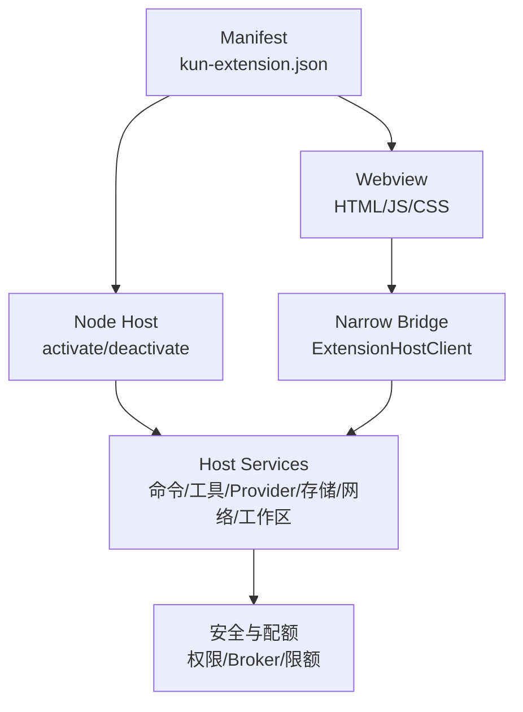
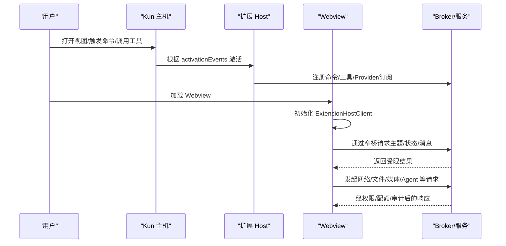
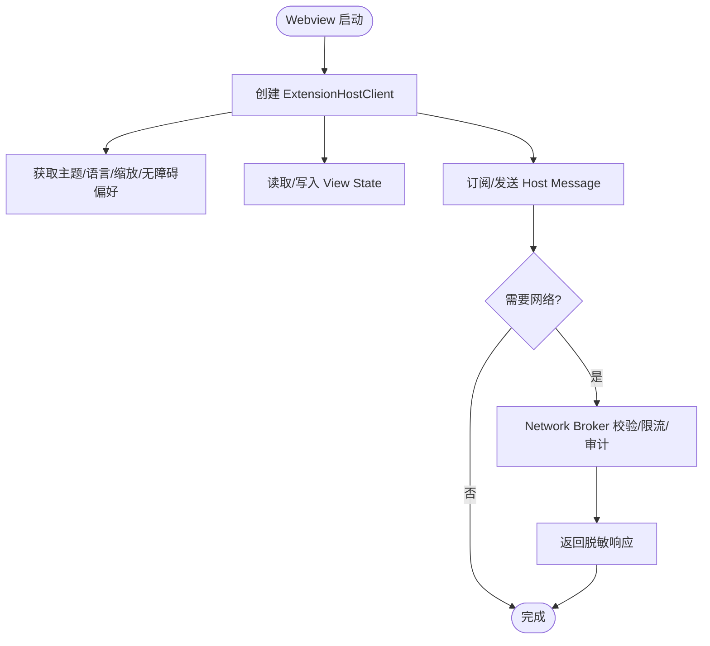
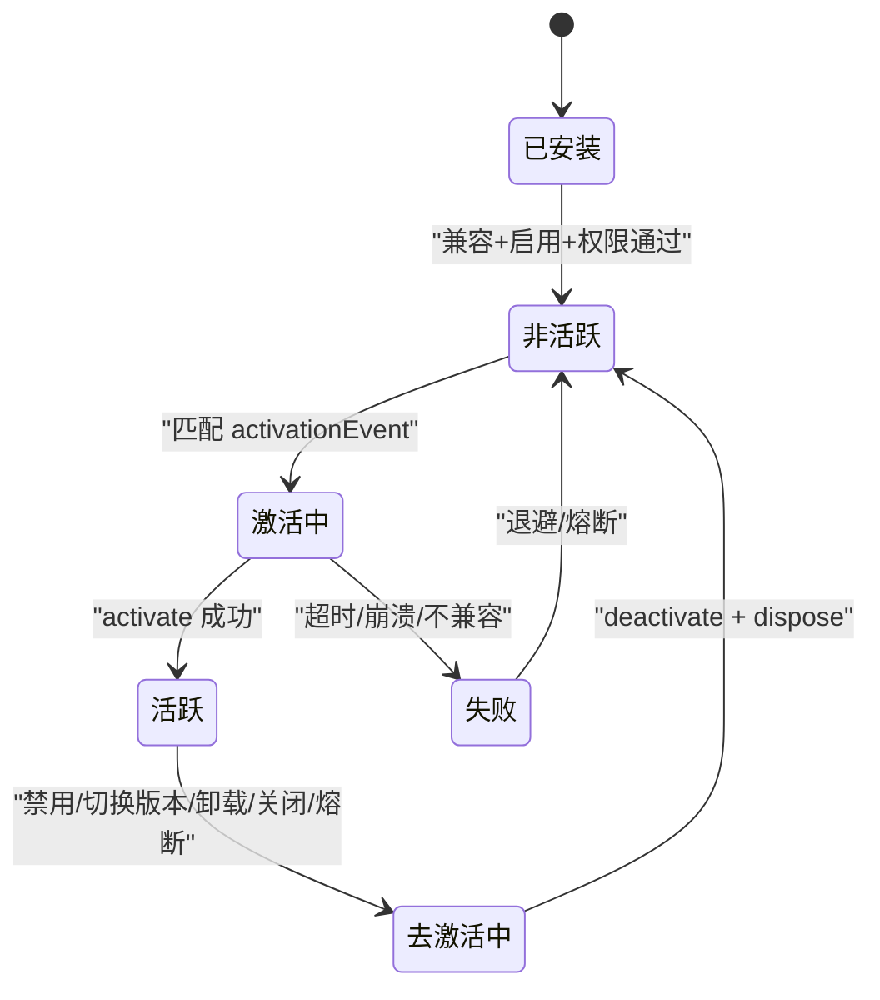
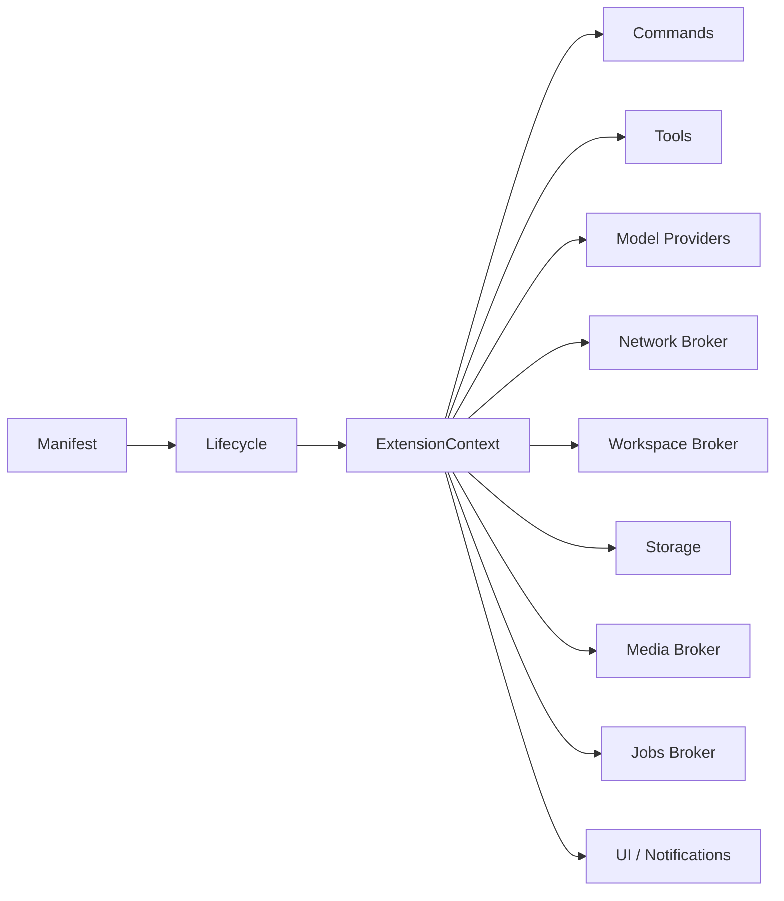

# 扩展API参考

<cite>
**本文引用的文件**
- [docs/extensions/api-reference.md](file://docs/extensions/api-reference.md)
- [docs/extensions/webview-and-dom.md](file://docs/extensions/webview-and-dom.md)
- [docs/extensions/lifecycle.md](file://docs/extensions/lifecycle.md)
- [docs/extensions/security-and-resources.md](file://docs/extensions/security-and-resources.md)
- [docs/extensions/manifest.md](file://docs/extensions/manifest.md)
- [docs/extensions/quick-start.md](file://docs/extensions/quick-start.md)
- [docs/extensions/packaging-and-index.md](file://docs/extensions/packaging-and-index.md)
- [examples/extensions/hello-sidebar/kun-extension.json](file://examples/extensions/hello-sidebar/kun-extension.json)
</cite>

## 目录
1. [简介](#简介)
2. [项目结构](#项目结构)
3. [核心组件](#核心组件)
4. [架构总览](#架构总览)
5. [详细组件分析](#详细组件分析)
6. [依赖关系分析](#依赖关系分析)
7. [性能与资源限制](#性能与资源限制)
8. [故障排查指南](#故障排查指南)
9. [结论](#结论)
10. [附录：开发流程与最佳实践](#附录：开发流程与最佳实践)

## 简介
本参考面向 DeepSeek-GUI（Kun）扩展开发者，系统化说明宿主 API、Webview 通信、生命周期钩子、权限模型、打包发布与调试方法。文档以仓库内官方扩展文档为权威来源，覆盖文件系统访问、窗口管理、通知系统、设置存储、DOM 操作、样式控制、Agent/工具注册、媒体与后台任务等能力边界与安全约束。

## 项目结构
扩展工程通常包含以下关键部分：
- Manifest 声明：入口、贡献点、激活事件、权限、本地化与版本信息
- Node Host 入口：实现 activate/deactivate、命令、工具、Provider、认证处理器等
- Webview 前端：通过窄桥与宿主通信，渲染 UI 并管理 View State
- 构建与打包：产物校验、完整性清单、生成 .kunx 包
- 示例工程：最小可运行侧栏扩展、Direct DOM、媒体与 Provider 示例

**图示来源**
- [docs/extensions/manifest.md:57-88](file://docs/extensions/manifest.md#L57-L88)
- [docs/extensions/lifecycle.md:38-66](file://docs/extensions/lifecycle.md#L38-L66)
- [docs/extensions/webview-and-dom.md:81-125](file://docs/extensions/webview-and-dom.md#L81-L125)
- [docs/extensions/security-and-resources.md:34-46](file://docs/extensions/security-and-resources.md#L34-L46)

**章节来源**
- [docs/extensions/manifest.md:57-88](file://docs/extensions/manifest.md#L57-L88)
- [docs/extensions/quick-start.md:54-70](file://docs/extensions/quick-start.md#L54-L70)

## 核心组件
- ExtensionContext 服务集合：commands、storage/configuration、network、ui、agent/threads、tools、modelProviders、authentication、media、jobs、workspace/workspaceContext
- Webview 窄桥：基于 HostTransport 的 ExtensionHostClient，提供主题、locale、View state、消息、命令、Agent、账号、Provider 等高层能力
- 生命周期：activate(context)、deactivate()、状态迁移 migrateState(state, context)
- 权限与 Broker：精确字符串权限、Network Broker、Account Broker、Workspace Broker、Storage 隔离
- 打包与安装：.kunx 不可变 ZIP、完整性清单、受保护权限确认、原子安装与回滚

**章节来源**
- [docs/extensions/api-reference.md:25-77](file://docs/extensions/api-reference.md#L25-L77)
- [docs/extensions/lifecycle.md:38-66](file://docs/extensions/lifecycle.md#L38-L66)
- [docs/extensions/webview-and-dom.md:81-125](file://docs/extensions/webview-and-dom.md#L81-L125)
- [docs/extensions/security-and-resources.md:61-95](file://docs/extensions/security-and-resources.md#L61-L95)
- [docs/extensions/packaging-and-index.md:137-161](file://docs/extensions/packaging-and-index.md#L137-L161)

## 架构总览
扩展由 Manifest 驱动，Kun 在满足兼容、权限与工作区策略后，按激活事件启动 Node Host；Webview 通过窄桥与 Host 通信，所有敏感能力经 Broker 校验与限流。

**图示来源**
- [docs/extensions/lifecycle.md:81-91](file://docs/extensions/lifecycle.md#L81-L91)
- [docs/extensions/webview-and-dom.md:81-125](file://docs/extensions/webview-and-dom.md#L81-L125)
- [docs/extensions/security-and-resources.md:96-127](file://docs/extensions/security-and-resources.md#L96-L127)

## 详细组件分析

### 宿主 API：文件系统、窗口、通知、设置
- 文件系统访问：通过 workspace.read/workspace.write 与已授权 root 内的路径进行读写，路径需规范化并防止穿越；写入可能继续触发审批或沙箱策略
- 窗口管理：复杂 UI 使用宿主创建的沙箱 Webview；受保护窗口（安装/升级、权限确认、设置、账号输入、审批）不加载扩展代码；外部网站可通过 externalBrowser 在隔离容器中展示
- 通知系统：ui.showNotification(options) 返回用户选择的 action id；关闭、超时、lease 失效或扩展停用返回 undefined；不暴露内部通知实例 ID
- 设置存储：configuration 提供 extension/workspace 隔离的设置；storage.global/storage.workspace 保存结构化、Schema-versioned、配额有界数据；禁止存放密钥、大二进制或私有 prompt

**章节来源**
- [docs/extensions/security-and-resources.md:128-133](file://docs/extensions/security-and-resources.md#L128-L133)
- [docs/extensions/webview-and-dom.md:19-44](file://docs/extensions/webview-and-dom.md#L19-L44)
- [docs/extensions/api-reference.md:43-68](file://docs/extensions/api-reference.md#L43-L68)
- [docs/extensions/security-and-resources.md:61-95](file://docs/extensions/security-and-resources.md#L61-L95)

### Webview API：与宿主通信、DOM 操作、样式控制
- 窄桥通信：Webview 通过 window.kunExtension 提供的 HostTransport 创建 ExtensionHostClient；每次调用验证 method、contribution、payload Schema/大小、速率、生命周期与权限
- DOM 操作：仅当声明 hostContentScripts 且具备 hostDom 权限时，可在受限 isolated world 中读取/修改可见 DOM；选择器无 SemVer 保证，属于高风险能力
- 样式控制：使用公开 theme tokens；避免引用私有 CSS variable/DOM class；Host 会注入带标记的样式元素
- 本地资源协议：kun-extension://<publisher.name>/<package-relative-path>，拒绝穿越、未声明文件、跨扩展读取与远程重定向

**图示来源**
- [docs/extensions/webview-and-dom.md:81-125](file://docs/extensions/webview-and-dom.md#L81-L125)
- [docs/extensions/webview-and-dom.md:176-186](file://docs/extensions/webview-and-dom.md#L176-L186)
- [docs/extensions/webview-and-dom.md:45-63](file://docs/extensions/webview-and-dom.md#L45-L63)

**章节来源**
- [docs/extensions/webview-and-dom.md:81-125](file://docs/extensions/webview-and-dom.md#L81-L125)
- [docs/extensions/webview-and-dom.md:192-223](file://docs/extensions/webview-and-dom.md#L192-L223)
- [docs/extensions/webview-and-dom.md:45-63](file://docs/extensions/webview-and-dom.md#L45-L63)

### 扩展生命周期钩子：加载、初始化、运行、卸载
- 加载与激活：Kun 静态发现 Manifest，满足兼容、权限与工作区策略后，按 activationEvents 触发一次 activate(context)；同一扩展最多一个 Node Host，并发激活合并
- 运行期：注册命令、工具、Provider、事件监听、View Session 等必须加入 context.subscriptions 以便统一释放；长操作支持取消与 terminal outcome
- 卸载与去激活：disable/uninstall/version switch/runtime shutdown/权限撤销/连续崩溃熔断等触发 deactivation；顺序为拒绝新调用→传播取消→调用 deactivate()→dispose 注册→等待 shutdown deadline→终止 Host

**图示来源**
- [docs/extensions/lifecycle.md:9-26](file://docs/extensions/lifecycle.md#L9-L26)
- [docs/extensions/lifecycle.md:81-105](file://docs/extensions/lifecycle.md#L81-L105)

**章节来源**
- [docs/extensions/lifecycle.md:38-66](file://docs/extensions/lifecycle.md#L38-L66)
- [docs/extensions/lifecycle.md:81-105](file://docs/extensions/lifecycle.md#L81-L105)
- [docs/extensions/lifecycle.md:118-132](file://docs/extensions/lifecycle.md#L118-L132)

### 权限模型：申请与使用系统资源
- 权限类型：commands.register、ui.views/actions/notifications、webview/webview.external、hostDom、agent.run/threads.readOwn、tools.register、providers.register、accounts.*、network:*、storage.*、workspace.*
- 生效规则：安装/新增权限需在受保护窗口确认；Grant 绑定 exact extension ID、version permission snapshot 与 workspace policy；每次操作重新检查；撤销立即阻止新调用
- 存储类型：Global State、Workspace State、View State、Credential Store；禁止将密钥放入 state；可变数据默认位于 ~/.kun/extension-data/<publisher>/...
- 网络 Broker：精确 hostname 或显式子域 wildcard；生产直连只接受 public-unicast；redirect 手动模式；CSP 阻止浏览器直连

**章节来源**
- [docs/extensions/manifest.md:282-309](file://docs/extensions/manifest.md#L282-L309)
- [docs/extensions/security-and-resources.md:34-46](file://docs/extensions/security-and-resources.md#L34-L46)
- [docs/extensions/security-and-resources.md:61-95](file://docs/extensions/security-and-resources.md#L61-L95)
- [docs/extensions/security-and-resources.md:96-127](file://docs/extensions/security-and-resources.md#L96-L127)

### 配置与 Manifest 要点
- 顶层字段：manifestVersion、apiVersion、publisher、name、version、displayName/description、icon、engines.kun、main/browser、activationEvents、contributes、permissions、stateSchemaVersion、signature
- 贡献点：commands、views.*、actions.*、settings、contextMenus、notifications、agentProfiles、tools、modelProviders、authentication、hostContentScripts
- 本地化：localizations 覆盖 Host 渲染文案；基础 Manifest 始终为 fallback
- 最小权限原则：仅声明真正需要的贡献与权限；某些贡献隐含必需权限

**章节来源**
- [docs/extensions/manifest.md:57-88](file://docs/extensions/manifest.md#L57-L88)
- [docs/extensions/manifest.md:159-208](file://docs/extensions/manifest.md#L159-L208)
- [docs/extensions/manifest.md:92-116](file://docs/extensions/manifest.md#L92-L116)
- [docs/extensions/manifest.md:282-309](file://docs/extensions/manifest.md#L282-L309)

### 打包与发布流程
- 包根内容：kun-extension.json、integrity.json、README.md、LICENSE、入口与资源
- 完整性清单：由 pack 工具生成，记录 SHA-256；安装前严格校验
- 确定性打包：validate → pack；支持 --include/--ignore；拒绝敏感路径与链接
- 安装布局与原子性：staging → validate → protected review → migration → 原子移动版本目录 → 切换 selected version
- 自定义 Index：HTTPS JSON，版本条目必须精确 SemVer；下载与包校验一致

**章节来源**
- [docs/extensions/packaging-and-index.md:9-39](file://docs/extensions/packaging-and-index.md#L9-L39)
- [docs/extensions/packaging-and-index.md:40-63](file://docs/extensions/packaging-and-index.md#L40-L63)
- [docs/extensions/packaging-and-index.md:63-99](file://docs/extensions/packaging-and-index.md#L63-L99)
- [docs/extensions/packaging-and-index.md:137-161](file://docs/extensions/packaging-and-index.md#L137-L161)
- [docs/extensions/packaging-and-index.md:211-262](file://docs/extensions/packaging-and-index.md#L211-L262)

## 依赖关系分析
- 扩展与宿主：通过 Manifest 声明贡献与权限；Host 负责资源隔离、权限校验、Broker 路由与配额管理
- Webview 与 Host：窄桥限定方法集与 payload Schema；禁止直接网络与 Node 能力
- 服务间耦合：命令/工具/Provider/Agent/媒体/Jobs 均通过统一服务层暴露；错误与诊断标准化

**图示来源**
- [docs/extensions/api-reference.md:43-68](file://docs/extensions/api-reference.md#L43-L68)
- [docs/extensions/lifecycle.md:38-66](file://docs/extensions/lifecycle.md#L38-L66)

**章节来源**
- [docs/extensions/api-reference.md:43-68](file://docs/extensions/api-reference.md#L43-L68)
- [docs/extensions/lifecycle.md:38-66](file://docs/extensions/lifecycle.md#L38-L66)

## 性能与资源限制
- 默认限额：单 IPC 消息 1 MiB、激活截止 15 秒、一般操作截止 60 秒、取消宽限 2 秒、关停截止 5 秒、每扩展并发 16、流窗口 32 事件或 4 MiB、事件率 200 events/s、Node Host 内存上限 256 MiB、连续崩溃阈值 3、日志轮转 5 MiB×3、状态文档 10 MiB、迁移截止 30 秒、网络/认证请求体 8 MiB
- 背压与释放：生产者等待 ack；队列有 item/bytes 双上限；cursor 重连持久事件源；cancel/terminal 后释放 buffer/timer/listener/correlation
- 包体积限制：压缩 .kunx 100 MiB、展开总量 250 MiB、单文件 25 MiB、文件数 5,000

**章节来源**
- [docs/extensions/security-and-resources.md:134-157](file://docs/extensions/security-and-resources.md#L134-L157)
- [docs/extensions/security-and-resources.md:159-167](file://docs/extensions/security-and-resources.md#L159-L167)
- [docs/extensions/packaging-and-index.md:111-122](file://docs/extensions/packaging-and-index.md#L111-L122)

## 故障排查指南
- 诊断与日志：使用 kun extension doctor/logs/reload 查看激活原因、状态、进程、重启数、熔断、限额错误与最后结构化错误；日志按扩展 ID/version/process 归因并轮转
- 常见错误：
  - 权限不足：检查 permissions 与 workspace scope；撤销后立即阻止新调用
  - 网络被拒：确认 network:<hostname> 精确匹配；生产直连仅允许 public-unicast；redirect 需重新走 Broker
  - 激活超时：确保 activate 快速返回，实际工作放到 handler；避免阻塞网络/模型/用户输入
  - Webview 无法加载：检查 CSP、本地资源协议、资源根与完整性清单
  - Direct DOM 失效：选择器变化属不受支持依赖；应降级到稳定贡献或 Webview
- 清理与回滚：disable/uninstall/rollback 保留状态；删除数据需明确确认

**章节来源**
- [docs/extensions/lifecycle.md:143-155](file://docs/extensions/lifecycle.md#L143-L155)
- [docs/extensions/security-and-resources.md:168-195](file://docs/extensions/security-and-resources.md#L168-L195)
- [docs/extensions/packaging-and-index.md:276-289](file://docs/extensions/packaging-and-index.md#L276-L289)

## 结论
DeepSeek-GUI 扩展体系以“身份绑定 + 最小权限 + 受保护同意 + 有界资源”为核心，提供稳定的 Manifest、宿主 API、Webview 窄桥与完整生命周期管理。遵循最小权限、幂等释放、背压与审计原则，可构建安全、可维护、可发布的扩展。

## 附录：开发流程与最佳实践
- 快速开始：使用脚手架创建 React 侧栏扩展，理解最小 Manifest、构建、测试、验证与打包
- 项目结构：分离 host 与 webview 入口，独立 tsconfig，vite 构建产物纳入资源根
- 配置选项：仅声明必要权限与贡献；使用 localizations 覆盖 Host 文案；正确设置 engines.kun 与 apiVersion
- 打包流程：validate → pack → 侧载安装 → 查看 doctor/logs → 必要时 rollback/uninstall
- 最佳实践：
  - 让 activate 快速、确定、可重复诊断
  - 用 context.subscriptions 管理每个资源
  - 对 stream/backpressure 做限流与取消
  - 不在 state/settings/logs/messages 中存 secret
  - 优先使用稳定贡献/Webview，谨慎使用 Direct DOM
  - 发布前用 doctor、测试 harness 与 release checklist 验证 redaction、denial 与 crash path

**章节来源**
- [docs/extensions/quick-start.md:9-70](file://docs/extensions/quick-start.md#L9-L70)
- [docs/extensions/quick-start.md:72-113](file://docs/extensions/quick-start.md#L72-L113)
- [docs/extensions/quick-start.md:115-175](file://docs/extensions/quick-start.md#L115-L175)
- [docs/extensions/packaging-and-index.md:180-209](file://docs/extensions/packaging-and-index.md#L180-L209)
- [docs/extensions/lifecycle.md:161-171](file://docs/extensions/lifecycle.md#L161-L171)