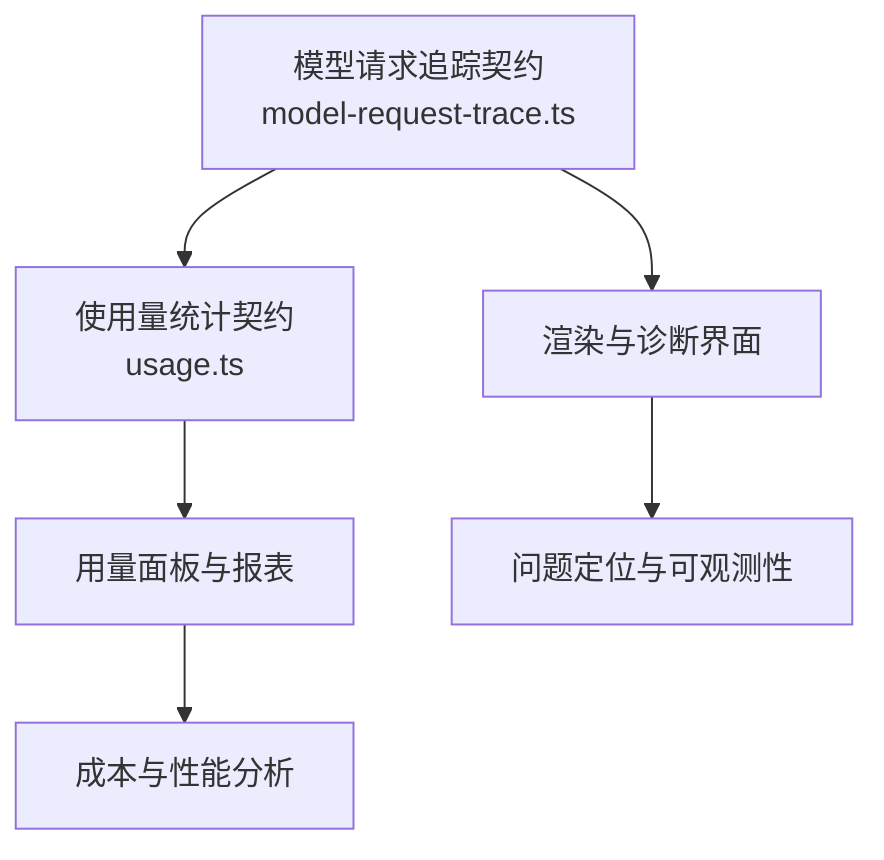
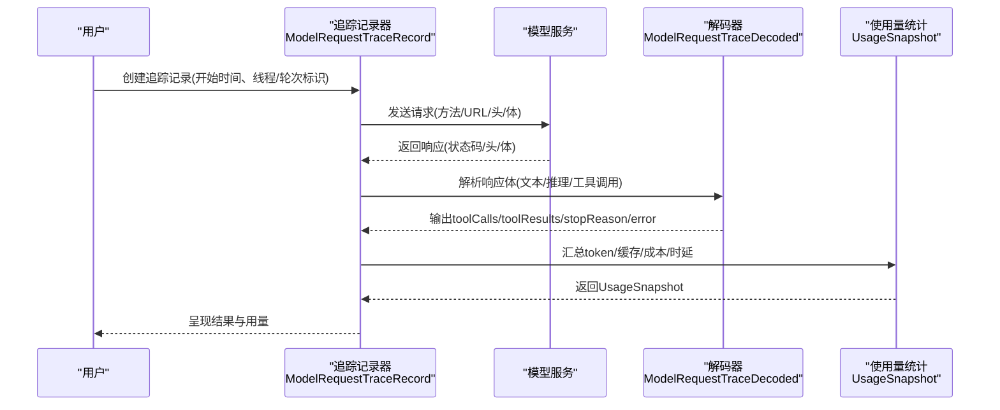
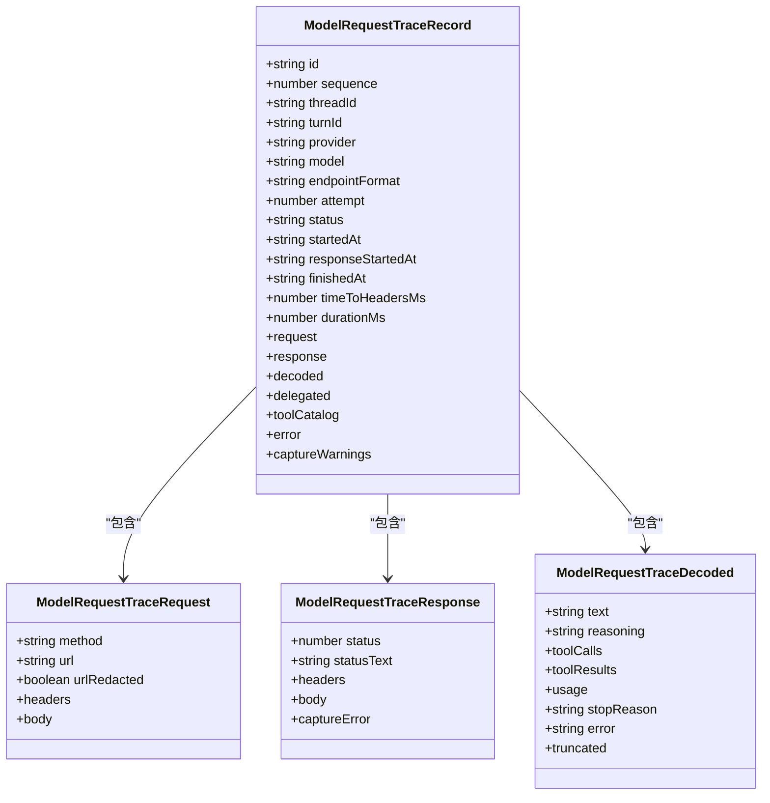
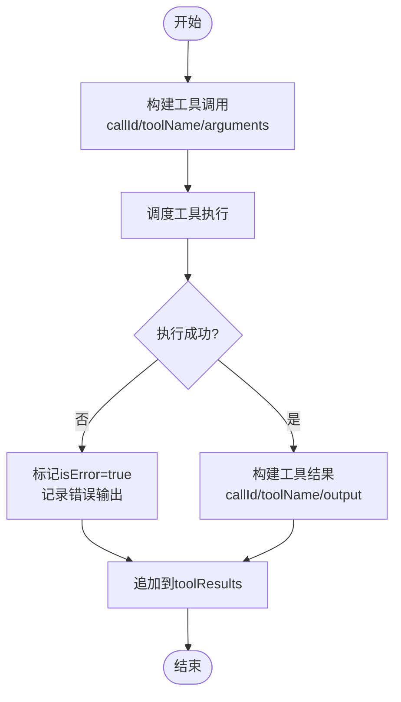
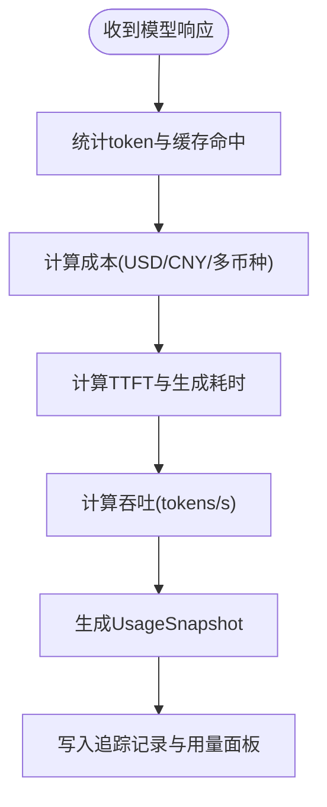
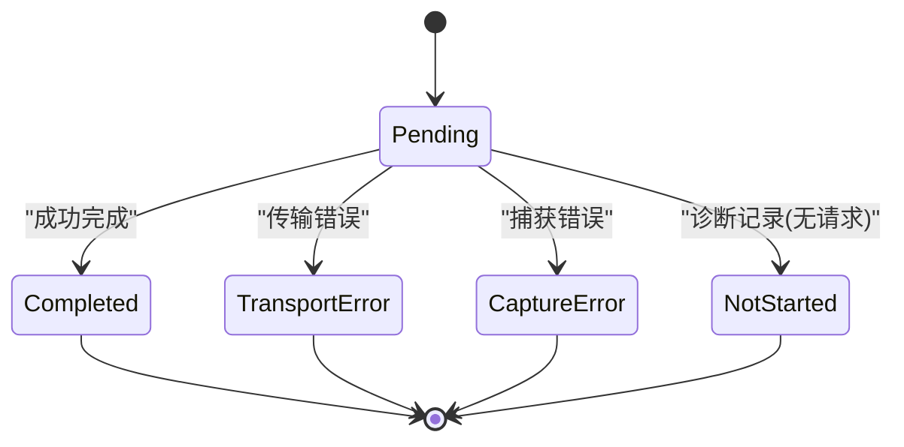
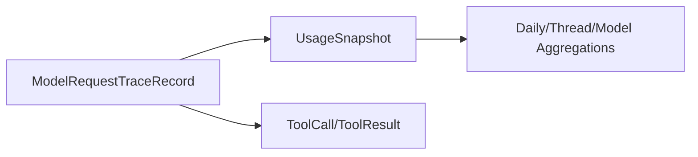

# AI交互数据类型

<cite>
**本文引用的文件**
- [model-request-trace.ts](file://kun/src/contracts/model-request-trace.ts)
- [usage.ts](file://kun/src/contracts/usage.ts)
</cite>

## 目录
1. [简介](#简介)
2. [项目结构](#项目结构)
3. [核心组件](#核心组件)
4. [架构总览](#架构总览)
5. [详细组件分析](#详细组件分析)
6. [依赖关系分析](#依赖关系分析)
7. [性能考量](#性能考量)
8. [故障排查指南](#故障排查指南)
9. [结论](#结论)
10. [附录](#附录)

## 简介
本文件面向DeepSeek-GUI的AI交互数据模型，聚焦以下目标：
- 说明消息与工具调用相关的数据结构（Message、ToolCall等）在系统中的定义与使用方式。
- 解释模型请求追踪（ModelRequestTrace）的数据结构，包括请求参数、响应结果、耗时统计等。
- 说明使用量统计（Usage）的数据格式与计算规则。
- 提供错误处理与异常情况的类型化表达。
- 给出AI交互场景下的数据操作示例与最佳实践。

## 项目结构
本项目将AI交互相关的核心数据结构集中在契约层（contracts），并通过Zod进行严格校验与类型推导。本次文档重点涉及两个契约文件：
- 模型请求追踪契约：用于记录一次或多次模型调用的完整生命周期，包括请求、响应、工具调用、解码后的内容片段以及使用量快照。
- 使用量统计契约：用于聚合每次模型响应的token、缓存命中、成本、时延等指标，并提供按日、按线程、按模型的聚合视图。

图表来源
- [model-request-trace.ts:1-224](file://kun/src/contracts/model-request-trace.ts#L1-L224)
- [usage.ts:1-185](file://kun/src/contracts/usage.ts#L1-L185)

章节来源
- [model-request-trace.ts:1-224](file://kun/src/contracts/model-request-trace.ts#L1-L224)
- [usage.ts:1-185](file://kun/src/contracts/usage.ts#L1-L185)

## 核心组件
本节概述AI交互中最重要的三类数据：
- 模型请求追踪记录（ModelRequestTraceRecord）：描述一次模型调用从准备到完成的全链路信息，包含阶段、状态、请求/响应、工具调用、解码内容、错误与警告等。
- 使用量快照（UsageSnapshot）：随每次模型响应附带的使用量指标，涵盖token计数、缓存命中率、成本、时延、吞吐等。
- 工具调用与结果（ToolCall/ToolResult）：在解码内容中体现的工具调用与执行结果，用于串联“模型思考—工具调用—结果回写”的闭环。

章节来源
- [model-request-trace.ts:20-101](file://kun/src/contracts/model-request-trace.ts#L20-L101)
- [model-request-trace.ts:122-208](file://kun/src/contracts/model-request-trace.ts#L122-L208)
- [usage.ts:11-74](file://kun/src/contracts/usage.ts#L11-L74)

## 架构总览
下图展示了一次典型AI交互的数据流：用户发起请求，系统构造并发送模型请求；模型返回流式内容，系统解码为文本、推理内容与工具调用；工具执行后结果回填；最终生成使用量快照与追踪记录。

图表来源
- [model-request-trace.ts:20-101](file://kun/src/contracts/model-request-trace.ts#L20-L101)
- [model-request-trace.ts:122-208](file://kun/src/contracts/model-request-trace.ts#L122-L208)
- [usage.ts:11-74](file://kun/src/contracts/usage.ts#L11-L74)

## 详细组件分析

### 模型请求追踪（ModelRequestTraceRecord）
- 作用：记录一次模型调用的全生命周期，支持区分不同阶段（凭证、设置、模型、传输、SDK委派），并标注失败来源与诊断码。
- 关键字段：
  - 标识与上下文：id、sequence、threadId、turnId、provider、model、endpointFormat。
  - 尝试与状态：attempt、attemptReason、status（pending/completed/transport_error/capture_error/not_started）。
  - 时间线：startedAt、responseStartedAt、finishedAt、timeToHeadersMs、durationMs。
  - 网络层：request（method/url/headers/body）、response（status/statusText/headers/body/captureError）。
  - 委派信息：delegated（providerKind/phase/contextManagement/nativeHistory/capabilities）。
  - 工具目录：toolCatalog（工具名、提供方种类与ID）。
  - 解码内容：decoded（text/reasoning/toolCalls/toolResults/usage/stopReason/error/truncated）。
  - 错误与告警：error、captureWarnings。
- 约束与校验：
  - not_started状态的记录不得携带伪造的请求负载。
  - 非not_started的记录必须携带请求负载。
  - failureOrigin=credential时必须标记phase=credential。

图表来源
- [model-request-trace.ts:20-101](file://kun/src/contracts/model-request-trace.ts#L20-L101)
- [model-request-trace.ts:122-208](file://kun/src/contracts/model-request-trace.ts#L122-L208)

章节来源
- [model-request-trace.ts:20-101](file://kun/src/contracts/model-request-trace.ts#L20-L101)
- [model-request-trace.ts:122-208](file://kun/src/contracts/model-request-trace.ts#L122-L208)

### 工具调用与结果（ToolCall / ToolResult）
- 工具调用（ModelRequestTraceToolCall）：
  - callId：唯一标识一次工具调用。
  - toolName：工具名称。
  - arguments：结构化参数对象。
- 工具结果（ModelRequestTraceToolResult）：
  - callId：与调用对应。
  - toolName：工具名称。
  - output：字符串化的输出内容。
  - isError：是否发生错误。
- 在解码内容中，toolCalls与toolResults共同构成“调用—结果”的成对关系，便于回放与调试。

图表来源
- [model-request-trace.ts:52-63](file://kun/src/contracts/model-request-trace.ts#L52-L63)
- [model-request-trace.ts:91-101](file://kun/src/contracts/model-request-trace.ts#L91-L101)

章节来源
- [model-request-trace.ts:52-63](file://kun/src/contracts/model-request-trace.ts#L52-L63)
- [model-request-trace.ts:91-101](file://kun/src/contracts/model-request-trace.ts#L91-L101)

### 使用量统计（UsageSnapshot）
- 字段分类：
  - Token计数：promptTokens、completionTokens、reasoningTokens、totalTokens、cachedTokens、cacheHitTokens、cacheMissTokens、cacheWriteTokens。
  - 路由与归属：requestedModelId、actualProviderId、actualModelId、routePoolId、routeTargetId。
  - 缓存指标：cacheHitRate、cacheableTokenHitRate、totalInputTokenHitRate、cacheMissReasons、cacheSuggestions。
  - 会话与成本：turns、costUsd、costCny、costByCurrency、cacheSavingsUsd/CNY、tokenEconomySavings系列。
  - 时延与吞吐：requestTtftMs、requestGenerationMs、turnAvgTtftMs、turnAvgTokensPerSecond、avgTtftMs、avgTokensPerSecond。
  - 错误标志：hasError。
- 计算规则要点：
  - totalTokens通常由输入与输出token合计而来（具体实现以提供者为准）。
  - cacheHitRate可由cacheHitTokens/(cacheHitTokens+cacheMissTokens)推导，缺失时报告null。
  - 成本可按多币种记录（costByCurrency），同时保留USD/CNY以便兼容历史数据。
  - 时延指标可用于计算tokens-per-second（结合requestGenerationMs与completionTokens）。

图表来源
- [usage.ts:11-74](file://kun/src/contracts/usage.ts#L11-L74)

章节来源
- [usage.ts:11-74](file://kun/src/contracts/usage.ts#L11-L74)

### 消息类型系统与差异
- 在本仓库的契约层中，未直接定义统一的Message类型；但通过ModelRequestTraceDecoded中的text与reasoning字段，可以承载“文本消息”和“推理消息”两类内容。
- 工具调用消息通过toolCalls与toolResults表达，形成独立的“工具消息”类型。
- 系统消息（如平台提示、策略指令）通常作为外部上下文注入，不在当前契约中显式建模；可在上层应用通过其他机制管理。
- 差异总结：
  - 文本消息：仅包含纯文本内容（text）。
  - 推理消息：包含推理过程（reasoning），可与文本并存。
  - 工具消息：包含工具调用与结果，用于驱动外部能力。

章节来源
- [model-request-trace.ts:91-101](file://kun/src/contracts/model-request-trace.ts#L91-L101)

### 模型请求追踪的数据结构与流转
- 阶段划分：
  - credential：凭证读取/刷新阶段。
  - setup：提供方/账户初始化阶段。
  - model：实际LLM流式调用阶段。
  - transport：非模型委托传输（CLI/SDK包装）。
  - sdk：agent-sdk/cursor-sdk委派会话。
- 状态机：
  - pending → completed：正常完成。
  - pending → transport_error/capture_error：传输或捕获异常。
  - not_started：诊断记录，无实际请求。
- 关键时序：
  - startedAt：记录开始时间。
  - responseStartedAt：首次响应到达时间。
  - finishedAt：完成时间。
  - timeToHeadersMs：首包头耗时。
  - durationMs：总耗时。

图表来源
- [model-request-trace.ts:103-120](file://kun/src/contracts/model-request-trace.ts#L103-L120)
- [model-request-trace.ts:158-169](file://kun/src/contracts/model-request-trace.ts#L158-L169)

章节来源
- [model-request-trace.ts:103-120](file://kun/src/contracts/model-request-trace.ts#L103-L120)
- [model-request-trace.ts:158-169](file://kun/src/contracts/model-request-trace.ts#L158-L169)

### 错误处理与异常情况
- 失败来源（failureOrigin）：provider、credential、setup、config、runtime、transport。
- 诊断码（diagnosticCode）：稳定的机器可读错误码，便于前端分类展示。
- 捕获错误（captureError）：在响应体捕获阶段产生的错误信息。
- 约束校验：
  - not_started记录不得携带请求负载。
  - 非not_started记录必须携带请求负载。
  - failureOrigin=credential需配合phase=credential。

章节来源
- [model-request-trace.ts:112-120](file://kun/src/contracts/model-request-trace.ts#L112-L120)
- [model-request-trace.ts:185-207](file://kun/src/contracts/model-request-trace.ts#L185-L207)

### 使用量统计的数据格式与计算规则
- 每日用量（DailyUsageBucket/Totals）：
  - 输入/输出/推理token、缓存token、缓存未命中token、总token、成本、缓存节省、token经济节省、轮次数、线程数、缓存命中率。
- 线程用量（ThreadUsageBucket/Totals）：
  - 最近一轮的缓存命中率、可缓存命中率、总输入命中率、最近未命中原因与建议。
- 模型用量（ModelUsageBucket/DayBucket/Response）：
  - 按模型维度聚合，支持按天与总体统计。
- 计算建议：
  - tokens-per-second = completionTokens / requestGenerationMs * 1000。
  - cacheHitRate = cacheHitTokens / (cacheHitTokens + cacheMissTokens)，缺失时为null。
  - 成本聚合可按多币种累加，并映射到USD/CNY用于统一展示。

章节来源
- [usage.ts:78-168](file://kun/src/contracts/usage.ts#L78-L168)

## 依赖关系分析
- ModelRequestTraceRecord依赖UsageSnapshot，用于在一次追踪记录中附带使用量快照。
- UsageSnapshot提供跨维度的用量聚合视图（按日、按线程、按模型），支撑成本与性能分析。
- 工具调用与结果嵌入解码内容，形成完整的“模型—工具—结果”闭环。

图表来源
- [model-request-trace.ts:91-101](file://kun/src/contracts/model-request-trace.ts#L91-L101)
- [usage.ts:78-168](file://kun/src/contracts/usage.ts#L78-L168)

章节来源
- [model-request-trace.ts:91-101](file://kun/src/contracts/model-request-trace.ts#L91-L101)
- [usage.ts:78-168](file://kun/src/contracts/usage.ts#L78-L168)

## 性能考量
- 首包延迟（TTFT）与生成耗时（requestGenerationMs）是衡量用户体验的关键指标。
- 缓存命中率（cacheHitRate）直接影响成本与吞吐，应优先优化提示词与上下文复用。
- 工具调用可能引入额外延迟，建议在UI中明确展示“等待工具执行”的状态。
- 大体积请求/响应需遵循限制（如最大请求/响应字节数），避免内存压力。

[本节为通用指导，不直接分析具体文件]

## 故障排查指南
- 检查status与failureOrigin：
  - transport_error：关注网络与代理配置。
  - capture_error：关注响应体解析与大小限制。
  - credential/setup/config/runtime：根据阶段定位问题。
- 查看diagnosticCode与captureWarnings：
  - 稳定错误码有助于快速归类问题。
  - 捕获告警可指示潜在风险（如截断、超限）。
- 验证请求与响应：
  - not_started不应有request负载。
  - 非not_started必须有request负载。
- 用量异常：
  - token计数与成本不一致时，核对costByCurrency与汇率映射。
  - 吞吐异常时，检查requestGenerationMs与completionTokens。

章节来源
- [model-request-trace.ts:185-207](file://kun/src/contracts/model-request-trace.ts#L185-L207)
- [usage.ts:11-74](file://kun/src/contracts/usage.ts#L11-L74)

## 结论
本文件基于契约层的模型请求追踪与使用量统计，构建了AI交互的核心数据模型体系。通过严格的类型校验与清晰的字段语义，系统能够准确记录一次模型调用的全链路信息，并沉淀用量指标以支撑成本与性能分析。工具调用与结果的成对设计，使得“模型—工具—结果”的闭环可追溯、可回放。在实际使用中，建议结合阶段与状态机进行问题定位，并利用用量聚合视图进行长期优化。

[本节为总结，不直接分析具体文件]

## 附录

### 数据操作示例（概念性）
- 创建追踪记录：
  - 初始化id、threadId、turnId、provider、model、endpointFormat。
  - 记录startedAt，并在响应到达时更新responseStartedAt与timeToHeadersMs。
  - 完成后记录finishedAt与durationMs。
- 解析响应：
  - 将响应体解码为text、reasoning、toolCalls、toolResults。
  - 附加stopReason或error，便于前端展示。
- 汇总用量：
  - 从响应中提取token计数、缓存命中、成本与时延。
  - 生成UsageSnapshot并写入追踪记录。
- 工具调用：
  - 为每个toolCall分配callId，执行后生成对应的toolResult。
  - 若执行失败，标记isError并记录错误输出。

[本节为概念性示例，不直接分析具体文件]