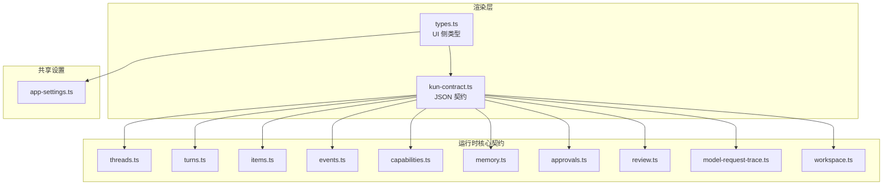
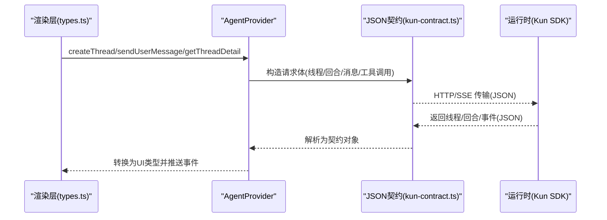
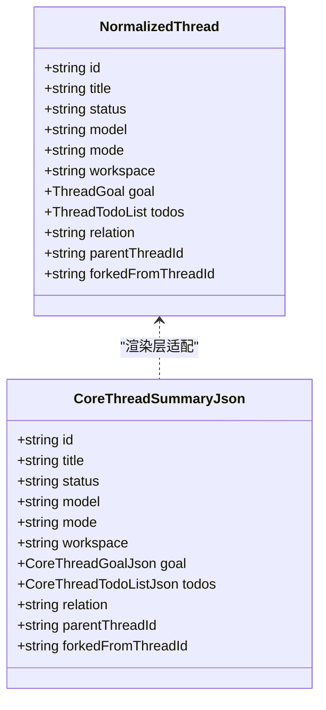
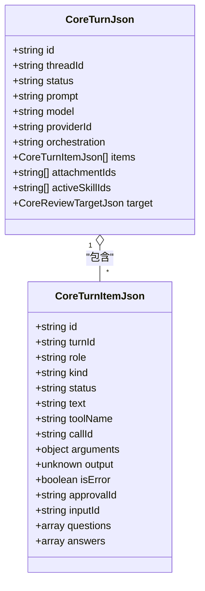
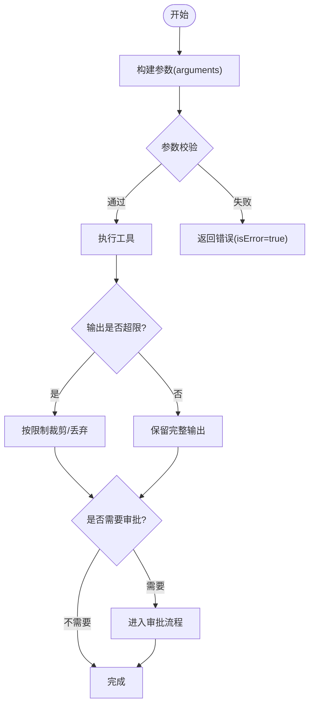
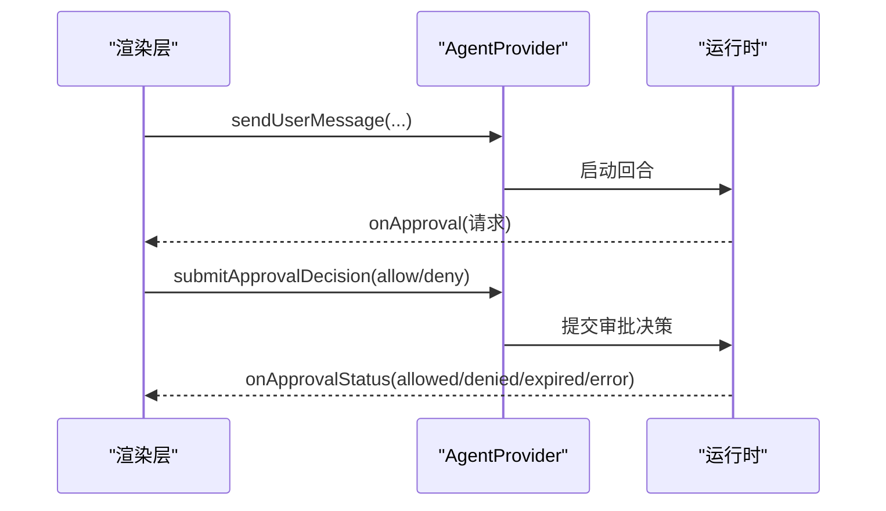
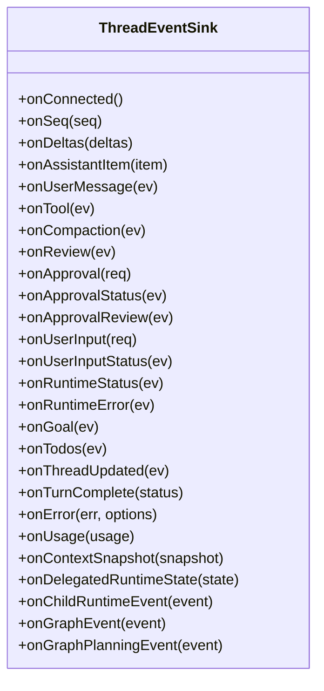
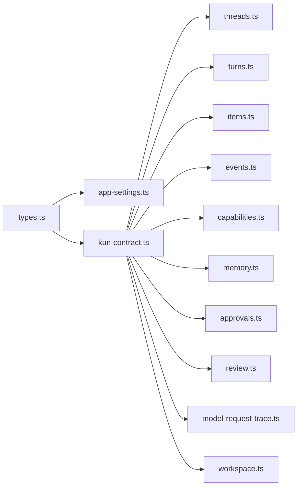

# 数据类型定义

<cite>
**本文引用的文件**
- [src/renderer/src/agent/types.ts](file://src/renderer/src/agent/types.ts)
- [src/renderer/src/agent/kun-contract.ts](file://src/renderer/src/agent/kun-contract.ts)
- [kun/src/contracts/index.ts](file://kun/src/contracts/index.ts)
- [kun/src/contracts/threads.ts](file://kun/src/contracts/threads.ts)
- [kun/src/contracts/turns.ts](file://kun/src/contracts/turns.ts)
- [kun/src/contracts/items.ts](file://kun/src/contracts/items.ts)
- [kun/src/contracts/events.ts](file://kun/src/contracts/events.ts)
- [kun/src/contracts/capabilities.ts](file://kun/src/contracts/capabilities.ts)
- [kun/src/contracts/memory.ts](file://kun/src/contracts/memory.ts)
- [kun/src/contracts/tool-output-limits.ts](file://kun/src/contracts/tool-output-limits.ts)
- [kun/src/contracts/approvals.ts](file://kun/src/contracts/approvals.ts)
- [kun/src/contracts/review.ts](file://kun/src/contracts/review.ts)
- [kun/src/contracts/model-request-trace.ts](file://kun/src/contracts/model-request-trace.ts)
- [kun/src/contracts/workspace.ts](file://kun/src/contracts/workspace.ts)
- [src/shared/app-settings.ts](file://src/shared/app-settings.ts)
</cite>

## 目录
1. [简介](#简介)
2. [项目结构](#项目结构)
3. [核心组件](#核心组件)
4. [架构总览](#架构总览)
5. [详细组件分析](#详细组件分析)
6. [依赖关系分析](#依赖关系分析)
7. [性能考量](#性能考量)
8. [故障排查指南](#故障排查指南)
9. [结论](#结论)
10. [附录](#附录)

## 简介
本文件为 DeepSeek-GUI 的数据类型定义文档，聚焦于与线程、消息、工具调用、审批、记忆、能力声明等核心领域相关的类型契约。内容覆盖：
- 核心数据模型（Thread、Message、ToolCall 等）的字段定义与关系映射
- 接口规范（必需/可选字段、类型约束）
- 枚举值与常量说明及使用场景
- 类型继承与组合模式
- 数据验证规则与业务约束
- 使用示例与序列化/反序列化指引
- 版本管理与向后兼容性策略

## 项目结构
DeepSeek-GUI 的类型定义主要分布在以下位置：
- 渲染层（Renderer）面向 UI 与事件消费的类型：src/renderer/src/agent/types.ts
- 渲染层与运行时之间的 JSON 契约：src/renderer/src/agent/kun-contract.ts
- 运行时核心契约（Kun SDK）：kun/src/contracts/*（如 threads、turns、items、events、capabilities、memory 等）
- 共享设置与全局配置：src/shared/app-settings.ts

图表来源
- [src/renderer/src/agent/types.ts:194-885](file://src/renderer/src/agent/types.ts#L194-L885)
- [src/renderer/src/agent/kun-contract.ts:1-836](file://src/renderer/src/agent/kun-contract.ts#L1-L836)
- [kun/src/contracts/index.ts](file://kun/src/contracts/index.ts)

章节来源
- [src/renderer/src/agent/types.ts:194-885](file://src/renderer/src/agent/types.ts#L194-L885)
- [src/renderer/src/agent/kun-contract.ts:1-836](file://src/renderer/src/agent/kun-contract.ts#L1-L836)
- [kun/src/contracts/index.ts](file://kun/src/contracts/index.ts)

## 核心组件
本节概述关键实体及其职责：
- 线程 Thread：会话级聚合，包含标题、状态、工作区、目标、待办、关系等
- 回合 Turn：一次用户输入到响应完成的生命周期
- 消息项 Item：回合内的最小可展示单元（用户、助手、系统、工具调用、审批、审查、用户输入等）
- 工具调用 ToolCall：工具执行上下文、参数、输出、状态、审批关联
- 审批 Approval：人工或代理决策流程
- 审查 Review：代码/变更审查任务与结果
- 记忆 Memory：跨会话的知识注入与检索
- 能力 Capabilities：运行时能力清单（模型、MCP、Web、技能、附件、子代理等）
- 工作区 Workspace：路径与工作区隔离信息

章节来源
- [src/renderer/src/agent/types.ts:194-885](file://src/renderer/src/agent/types.ts#L194-L885)
- [src/renderer/src/agent/kun-contract.ts:19-836](file://src/renderer/src/agent/kun-contract.ts#L19-L836)
- [kun/src/contracts/threads.ts](file://kun/src/contracts/threads.ts)
- [kun/src/contracts/turns.ts](file://kun/src/contracts/turns.ts)
- [kun/src/contracts/items.ts](file://kun/src/contracts/items.ts)
- [kun/src/contracts/events.ts](file://kun/src/contracts/events.ts)
- [kun/src/contracts/capabilities.ts](file://kun/src/contracts/capabilities.ts)
- [kun/src/contracts/memory.ts](file://kun/src/contracts/memory.ts)
- [kun/src/contracts/approvals.ts](file://kun/src/contracts/approvals.ts)
- [kun/src/contracts/review.ts](file://kun/src/contracts/review.ts)
- [kun/src/contracts/model-request-trace.ts](file://kun/src/contracts/model-request-trace.ts)
- [kun/src/contracts/workspace.ts](file://kun/src/contracts/workspace.ts)

## 架构总览
渲染层通过 AgentProvider 暴露统一 API，内部基于 kun-contract 与运行时交互；运行时以 Kun SDK 的 contracts 提供强类型契约。事件流通过 SSE/HTTP 传输，渲染层将 JSON 契约转换为 UI 友好的类型。

图表来源
- [src/renderer/src/agent/types.ts:701-885](file://src/renderer/src/agent/types.ts#L701-L885)
- [src/renderer/src/agent/kun-contract.ts:458-555](file://src/renderer/src/agent/kun-contract.ts#L458-L555)

## 详细组件分析

### 线程 Thread
- 作用：会话聚合，承载标题、状态、模型、模式、工作区、目标、待办、关系（主/分叉/旁支）、归档/置顶等
- 关键字段：id、title、status、model、mode、workspace、goal、todos、relation、parentThreadId、forkedFromThreadId 等
- 与 Turn/Item 的关系：一个 Thread 包含多个 Turn，每个 Turn 包含多个 Item
- 版本兼容：NormalizedThread 与 CoreThreadSummaryJson/CoreThreadJson 存在字段差异，渲染层负责适配

图表来源
- [src/renderer/src/agent/types.ts:194-232](file://src/renderer/src/agent/types.ts#L194-L232)
- [src/renderer/src/agent/kun-contract.ts:19-60](file://src/renderer/src/agent/kun-contract.ts#L19-L60)

章节来源
- [src/renderer/src/agent/types.ts:194-232](file://src/renderer/src/agent/types.ts#L194-L232)
- [src/renderer/src/agent/kun-contract.ts:19-60](file://src/renderer/src/agent/kun-contract.ts#L19-L60)

### 回合 Turn 与消息项 Item
- Turn：一次对话轮次，包含状态、提示词、模型、提供者、编排方式、时间戳、附件、技能注入、审查目标等
- Item：回合内最小单元，角色包括 user、assistant、system、tool；支持文本、工具调用、审批、审查、用户输入等
- 工具调用相关字段：kind、toolName、callId、arguments、output、isError、approvalId 等
- 事件流：SSE 事件携带 item 增量与状态更新

图表来源
- [src/renderer/src/agent/kun-contract.ts:458-555](file://src/renderer/src/agent/kun-contract.ts#L458-L555)

章节来源
- [src/renderer/src/agent/kun-contract.ts:458-555](file://src/renderer/src/agent/kun-contract.ts#L458-L555)

### 工具调用 ToolCall 与工具输出限制
- 工具调用上下文：turnId、itemId、toolName、callId、arguments、output、isError、approvalId、toolKind（tool_call/command_execution/file_change）
- 工具输出限制：在运行时对工具输出进行限流与裁剪，避免过大输出影响性能与稳定性
- 取消调用：支持 cancelToolCall，返回取消状态

图表来源
- [src/renderer/src/agent/kun-contract.ts:487-555](file://src/renderer/src/agent/kun-contract.ts#L487-L555)
- [kun/src/contracts/tool-output-limits.ts](file://kun/src/contracts/tool-output-limits.ts)

章节来源
- [src/renderer/src/agent/kun-contract.ts:487-555](file://src/renderer/src/agent/kun-contract.ts#L487-L555)
- [kun/src/contracts/tool-output-limits.ts](file://kun/src/contracts/tool-output-limits.ts)

### 审批 Approval 与审查 Review
- 审批：用于高风险操作的人工或代理确认，包含摘要、工具名、状态（allowed/denied/expired/error）、错误信息等
- 审查：针对未提交变更、分支、提交或自定义指令的代码审查，产出发现项与总体正确性判断
- 事件流：审批请求、状态更新、审查事件通过事件通道推送

图表来源
- [src/renderer/src/agent/types.ts:432-464](file://src/renderer/src/agent/types.ts#L432-L464)
- [src/renderer/src/agent/kun-contract.ts:574-596](file://src/renderer/src/agent/kun-contract.ts#L574-L596)

章节来源
- [src/renderer/src/agent/types.ts:432-464](file://src/renderer/src/agent/types.ts#L432-L464)
- [src/renderer/src/agent/kun-contract.ts:574-596](file://src/renderer/src/agent/kun-contract.ts#L574-L596)

### 记忆 Memory
- 记忆记录：id、content、scope（user/workspace/project）、tags、confidence、创建/更新时间、禁用/删除时间
- 诊断：启用状态、根目录、活跃计数、墓碑计数、最近注入 ID
- 生命周期：创建、更新、删除、查询、诊断

章节来源
- [src/renderer/src/agent/kun-contract.ts:120-134](file://src/renderer/src/agent/kun-contract.ts#L120-L134)
- [src/renderer/src/agent/kun-contract.ts:196-202](file://src/renderer/src/agent/kun-contract.ts#L196-L202)
- [kun/src/contracts/memory.ts](file://kun/src/contracts/memory.ts)

### 能力 Capabilities
- 运行时能力清单：模型模态、工具调用支持、MCP/Web/技能/附件/记忆/子代理/图像生成/语音/音乐/视频/电脑使用/浏览器使用等
- 能力状态：available/disabled/unavailable/interaction-required，以及各子能力的开关与指标

章节来源
- [src/renderer/src/agent/kun-contract.ts:204-290](file://src/renderer/src/agent/kun-contract.ts#L204-L290)
- [kun/src/contracts/capabilities.ts](file://kun/src/contracts/capabilities.ts)

### 工作区 Workspace
- 工作区路径与隔离：用于沙箱模式、权限控制、资源访问边界
- 与线程/回合的关系：线程绑定工作区，回合可携带工作区检查点

章节来源
- [src/renderer/src/agent/kun-contract.ts:458-485](file://src/renderer/src/agent/kun-contract.ts#L458-L485)
- [kun/src/contracts/workspace.ts](file://kun/src/contracts/workspace.ts)

### 事件流与订阅
- 事件类型：工具事件、压缩事件、审查事件、审批事件、用户输入事件、运行时状态事件、错误事件、目标/待办事件、使用量快照、上下文快照、委托运行时状态、Graph 事件等
- 订阅接口：subscribeThreadEvents，接收 Sink 回调

图表来源
- [src/renderer/src/agent/types.ts:665-699](file://src/renderer/src/agent/types.ts#L665-L699)

章节来源
- [src/renderer/src/agent/types.ts:665-699](file://src/renderer/src/agent/types.ts#L665-L699)
- [kun/src/contracts/events.ts](file://kun/src/contracts/events.ts)

## 依赖关系分析
- 渲染层 types.ts 依赖共享设置 app-settings.ts（如 ApprovalPolicy、SandboxMode、ApprovalReviewer）
- 渲染层 kun-contract.ts 定义 JSON 契约，被运行时与渲染层共同遵守
- 运行时 contracts 提供领域模型与事件契约，确保跨进程/跨模块一致性

图表来源
- [src/renderer/src/agent/types.ts:1-18](file://src/renderer/src/agent/types.ts#L1-L18)
- [src/renderer/src/agent/kun-contract.ts:1-836](file://src/renderer/src/agent/kun-contract.ts#L1-L836)
- [kun/src/contracts/index.ts](file://kun/src/contracts/index.ts)

章节来源
- [src/renderer/src/agent/types.ts:1-18](file://src/renderer/src/agent/types.ts#L1-L18)
- [src/renderer/src/agent/kun-contract.ts:1-836](file://src/renderer/src/agent/kun-contract.ts#L1-L836)
- [kun/src/contracts/index.ts](file://kun/src/contracts/index.ts)

## 性能考量
- 工具输出限制：避免大输出导致内存与网络压力，采用裁剪与丢弃策略
- 上下文窗口管理：请求级上下文预算（软/硬阈值），估算输入 token 数，减少溢出风险
- 增量事件：使用 delta 与 seq 实现高效增量更新，降低重放成本
- 缓存命中：统计 cacheHitRate，优化重复请求

章节来源
- [src/renderer/src/agent/kun-contract.ts:619-640](file://src/renderer/src/agent/kun-contract.ts#L619-L640)
- [src/renderer/src/agent/kun-contract.ts:677-701](file://src/renderer/src/agent/kun-contract.ts#L677-L701)
- [kun/src/contracts/tool-output-limits.ts](file://kun/src/contracts/tool-output-limits.ts)

## 故障排查指南
- 工具调用失败：检查 isErro、message、code、details、severity；必要时查看工具诊断与 MCP OAuth 诊断
- 审批超时/错误：关注 onApprovalStatus 的状态码与 errorMessage；确认用户输入是否已提交
- 事件丢失/乱序：核对 seq 与 deltaOffset，确保客户端按顺序合并增量
- 能力不可用：检查 capabilities 状态，确认所需能力是否 available/enabled

章节来源
- [src/renderer/src/agent/kun-contract.ts:703-836](file://src/renderer/src/agent/kun-contract.ts#L703-L836)
- [src/renderer/src/agent/types.ts:466-513](file://src/renderer/src/agent/types.ts#L466-L513)

## 结论
DeepSeek-GUI 通过清晰的类型分层（渲染层类型、JSON 契约、运行时契约）实现了高内聚、低耦合的数据模型设计。线程、回合、消息项、工具调用、审批、审查、记忆、能力与工作区等核心实体具备明确的字段约束与关系映射，配合事件流与版本化契约，保障了系统的可扩展性与向后兼容性。

## 附录

### 接口规范与字段约束
- 必需字段：如线程 id/title/status/model/mode、回合 id/threadId/status/prompt、消息项 id/role/kind/status
- 可选字段：如 providerId、orchestration、attachmentIds、activeSkillIds、target、questions/answers 等
- 类型约束：严格枚举（如状态、角色、工具种类），禁止自由字符串

章节来源
- [src/renderer/src/agent/kun-contract.ts:19-836](file://src/renderer/src/agent/kun-contract.ts#L19-L836)

### 枚举值与常量
- 线程/回合/项状态：idle/running/archived/deleted、queued/running/completed/failed/aborted、pending/running/completed/failed/aborted/allowed/denied/expired
- 工具种类：tool_call、command_execution、file_change
- 角色：user、assistant、system、tool
- 编排：direct、graph
- 其他：reasoningEffort、serviceTier、mode 等

章节来源
- [src/renderer/src/agent/kun-contract.ts:6-17](file://src/renderer/src/agent/kun-contract.ts#L6-L17)
- [src/renderer/src/agent/kun-contract.ts:458-555](file://src/renderer/src/agent/kun-contract.ts#L458-L555)

### 类型继承与组合
- 组合：Thread 组合 Goal/Todo；Turn 组合 Item；Item 组合 Questions/Answers/Targets
- 继承/适配：NormalizedThread 与 CoreThreadSummaryJson/CoreThreadJson 的字段映射与兼容处理

章节来源
- [src/renderer/src/agent/types.ts:194-232](file://src/renderer/src/agent/types.ts#L194-L232)
- [src/renderer/src/agent/kun-contract.ts:19-60](file://src/renderer/src/agent/kun-contract.ts#L19-L60)

### 数据验证规则与业务约束
- 工具输出限制：按策略裁剪/丢弃，防止过大输出
- 上下文窗口：软/硬阈值保护，估算输入 token 数
- 审批与审查：必须经过审批的高风险操作需等待决策；审查目标限定范围
- 工作区隔离：路径与权限约束，防止越权访问

章节来源
- [kun/src/contracts/tool-output-limits.ts](file://kun/src/contracts/tool-output-limits.ts)
- [src/renderer/src/agent/kun-contract.ts:619-640](file://src/renderer/src/agent/kun-contract.ts#L619-L640)
- [src/renderer/src/agent/kun-contract.ts:574-596](file://src/renderer/src/agent/kun-contract.ts#L574-L596)

### 使用示例与序列化/反序列化
- 序列化：所有跨进程通信使用 JSON 契约（kun-contract.ts），保证前后端一致
- 反序列化：渲染层将 JSON 契约转换为 UI 友好类型（types.ts），并进行字段兼容处理
- 示例路径：
  - 创建线程/发送消息：[src/renderer/src/agent/types.ts:713-774](file://src/renderer/src/agent/types.ts#L713-L774)
  - 获取线程详情：[src/renderer/src/agent/types.ts:714-731](file://src/renderer/src/agent/types.ts#L714-L731)
  - 事件订阅：[src/renderer/src/agent/types.ts:869-874](file://src/renderer/src/agent/types.ts#L869-L874)

章节来源
- [src/renderer/src/agent/types.ts:713-874](file://src/renderer/src/agent/types.ts#L713-L874)

### 版本管理与向后兼容性
- 版本常量：EXTENSION_REGISTRY_SCHEMA_VERSION、EXTENSION_INDEX_SCHEMA_VERSION、EXTENSION_RPC_VERSION
- 能力清单：contractVersion 与 capabilities 字段用于能力探测与降级
- 兼容策略：渲染层对历史字段缺失做容错处理（如 producer/profile 可选），保持旧数据可读

章节来源
- [kun/src/extensions/types.ts:6-8](file://kun/src/extensions/types.ts#L6-L8)
- [src/renderer/src/agent/kun-contract.ts:204-290](file://src/renderer/src/agent/kun-contract.ts#L204-L290)