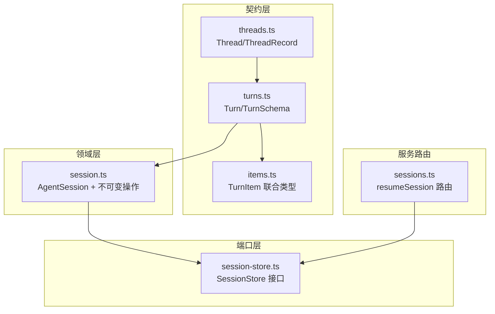
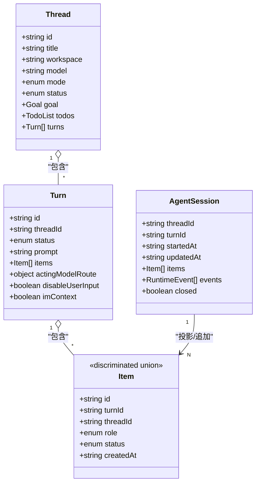
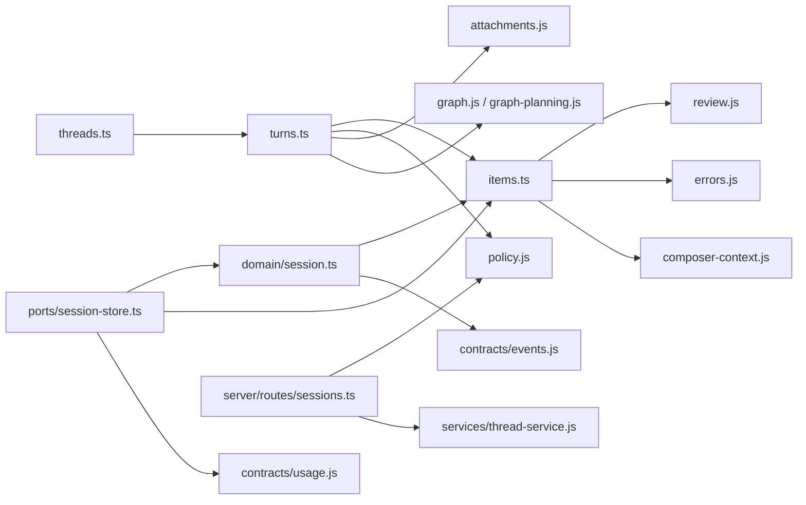

# 核心实体模型

<cite>
**本文引用的文件**
- [threads.ts](file://kun/src/contracts/threads.ts)
- [turns.ts](file://kun/src/contracts/turns.ts)
- [items.ts](file://kun/src/contracts/items.ts)
- [session.ts](file://kun/src/domain/session.ts)
- [session-store.ts](file://kun/src/ports/session-store.ts)
- [sessions.ts](file://kun/src/server/routes/sessions.ts)
</cite>

## 目录
1. [简介](#简介)
2. [项目结构](#项目结构)
3. [核心组件](#核心组件)
4. [架构总览](#架构总览)
5. [详细组件分析](#详细组件分析)
6. [依赖关系分析](#依赖关系分析)
7. [性能考量](#性能考量)
8. [故障排查指南](#故障排查指南)
9. [结论](#结论)
10. [附录：使用示例](#附录使用示例)

## 简介
本文件为 DeepSeek-GUI 的核心实体模型文档，聚焦 Thread、Turn、Item、Session 等关键实体的数据结构定义、字段类型与约束、实体间关系映射、生命周期状态转换、序列化/反序列化逻辑、验证规则与约束条件，并提供实际使用示例。该文档面向不同技术背景的读者，力求以循序渐进的方式解释系统设计与实现要点。

## 项目结构
围绕核心实体，相关代码主要分布在以下模块：
- 契约层（contracts）：定义线程、回合、条目等数据模型的 Zod Schema 与类型，确保跨进程/前后端的数据一致性。
- 领域层（domain）：定义会话（AgentSession）的不可变操作与追加式日志语义。
- 端口层（ports）：定义会话存储接口 SessionStore，抽象持久化与回放能力。
- 服务路由（server/routes）：提供会话恢复等 HTTP 入口，承载请求校验与响应封装。

图表来源
- [threads.ts:191-266](file://kun/src/contracts/threads.ts#L191-L266)
- [turns.ts:147-231](file://kun/src/contracts/turns.ts#L147-L231)
- [items.ts:228-241](file://kun/src/contracts/items.ts#L228-L241)
- [session.ts:12-20](file://kun/src/domain/session.ts#L12-L20)
- [session-store.ts:51-121](file://kun/src/ports/session-store.ts#L51-L121)
- [sessions.ts:16-47](file://kun/src/server/routes/sessions.ts#L16-L47)

章节来源
- [threads.ts:191-266](file://kun/src/contracts/threads.ts#L191-L266)
- [turns.ts:147-231](file://kun/src/contracts/turns.ts#L147-L231)
- [items.ts:228-241](file://kun/src/contracts/items.ts#L228-L241)
- [session.ts:12-20](file://kun/src/domain/session.ts#L12-L20)
- [session-store.ts:51-121](file://kun/src/ports/session-store.ts#L51-L121)
- [sessions.ts:16-47](file://kun/src/server/routes/sessions.ts#L16-L47)

## 核心组件
- Thread（线程）：对话的顶层容器，包含元数据、模式、状态、目标、待办、扩展信息等，并聚合 Turn 列表。
- Turn（回合）：一次用户输入到模型响应的完整交互单元，包含状态、提示、执行上下文、工具调用、审批、错误等 Item 集合。
- Item（条目）：Turn 内的最小可渲染内容单元，如用户消息、助手文本、推理、工具调用/结果、审批、用户输入、压缩、审查、错误等。
- Session（会话）：对 Loop 运行期的投影，绑定 threadId/turnId，维护 items 与 events 的追加式历史，支持关闭与更新。

章节来源
- [threads.ts:191-266](file://kun/src/contracts/threads.ts#L191-L266)
- [turns.ts:147-231](file://kun/src/contracts/turns.ts#L147-L231)
- [items.ts:228-241](file://kun/src/contracts/items.ts#L228-L241)
- [session.ts:12-20](file://kun/src/domain/session.ts#L12-L20)

## 架构总览
下图展示了核心实体之间的关系与数据流：Thread 聚合多个 Turn；每个 Turn 包含多个 Item；Session 作为运行时投影，将 Turn 的 Item 与事件串联成可重放的历史。

图表来源
- [threads.ts:191-266](file://kun/src/contracts/threads.ts#L191-L266)
- [turns.ts:147-231](file://kun/src/contracts/turns.ts#L147-L231)
- [items.ts:228-241](file://kun/src/contracts/items.ts#L228-L241)
- [session.ts:12-20](file://kun/src/domain/session.ts#L12-L20)

## 详细组件分析

### Thread（线程）
- 关键字段
  - 标识与元信息：id、title、workspace、model、agentSurface、providerId、accountId、ownerExtensionId、ownerExtensionVersion、systemPrompt、agentId
  - 控制与策略：mode（agent/plan）、status（idle/running/archived/deleted）、approvalPolicy、sandboxMode、approvalReviewer、modelRequestCaptureEnabled、pinned
  - 预算与成本：costBudgetUsd、costBudgetWarningSent
  - 关系与派生：relation（primary/fork/side）、parentThreadId、forkedFromThreadId、forkedFromTitle、forkedAt、forkedFromMessageCount、forkedFromTurnCount
  - 目标与待办：goal（含 objective/status/tokenBudget/tokensUsed/timeUsedSeconds/createdAt/updatedAt）、todos（含 items 与 in_progress 唯一性约束）
  - 扩展信息：extensionVisibility、extensionProfile、extensionBudget、toolCatalogEpoch
  - 时间戳：createdAt、updatedAt
  - 子项：turns（默认空数组）
- 必填/可选
  - 必填：id、title、workspace、model、mode、status、createdAt、updatedAt、turns（默认 []）
  - 可选：其余字段多为可选或带默认值
- 关系映射
  - 一对多包含 Turn（通过 turns 字段）
  - 通过 relation/parentThreadId/forkedFrom* 表达主线程、分叉、侧聊等关系
- 生命周期状态
  - 状态枚举：idle、running、archived、deleted
  - 说明：通用 PATCH 仅管理归档可见性；执行与删除由服务层控制，客户端不能直接制造 running/deleted
- 序列化/反序列化
  - 使用 Zod Schema 进行强类型校验与默认值处理
- 验证规则与约束
  - additionalWorkspaces 最多 32 个
  - goal.objective 最大字符数限制
  - todos 中至多一个 in_progress
  - Fork 请求需满足 beforeTurn 与 turnId 的联动约束

章节来源
- [threads.ts:12-40](file://kun/src/contracts/threads.ts#L12-L40)
- [threads.ts:61-124](file://kun/src/contracts/threads.ts#L61-L124)
- [threads.ts:191-266](file://kun/src/contracts/threads.ts#L191-L266)
- [threads.ts:310-365](file://kun/src/contracts/threads.ts#L310-L365)
- [threads.ts:367-411](file://kun/src/contracts/threads.ts#L367-L411)
- [threads.ts:423-459](file://kun/src/contracts/threads.ts#L423-L459)

### Turn（回合）
- 关键字段
  - 标识与归属：id、threadId
  - 状态与时间：status（queued/running/completed/failed/aborted）、createdAt、startedAt、finishedAt
  - 输入与上下文：prompt、messageSource、steering（可被用户中途注入）
  - 模型与路由：model、providerId、accountId、actingModelRoute（首次成功解析后不可变）
  - 执行策略：reasoningEffort、serviceTier、clientSurface、orchestration（direct/graph）
  - 权限与安全：approvalPolicy、sandboxMode、approvalReviewer、disableUserInput、imContext
  - 资源与附件：attachmentIds、composerContexts、activeSkillIds、injectedMemoryIds、injectedMemorySummaries、skillInjectionBytes、injectedInstructionSources、instructionInjectionBytes
  - 工作区检查点：workspaceCheckpointId、workspaceCheckpointRequestId
  - 工具目录指纹：toolCatalogFingerprint、toolCatalogToolCount、toolCatalogDrift
  - 特殊流程：requiredToolGate、graphLeadLifecycle、graphPlanningLifecycle
  - 扩展预算统计：extensionBudgetTokenBaseline、extensionModelRequests、extensionToolInvocations
  - GUI/设计模式：guiPlan、guiDesignCanvas、guiDesignMode、agentSurface、guiDesignArtifact
  - 错误：error（可选）
- 必填/可选
  - 必填：id、threadId、status、prompt、createdAt、items（默认 []）、attachmentIds（默认 []）、activeSkillIds（默认 []）、injectedMemorySummaries（默认 []）、injectedInstructionSources（默认 []）、orchestration（默认 direct）
  - 可选：其余字段多为可选或带默认值
- 关系映射
  - 属于 Thread（通过 threadId）
  - 包含多个 Item（通过 items）
- 生命周期状态
  - 状态枚举：queued → running → completed/failed/aborted
  - 中断：支持 InterruptTurn（discard 选项决定是否丢弃已生成 item）
- 序列化/反序列化
  - 使用 Zod Schema 校验 StartTurnRequest、SteerTurnRequest、InterruptTurnRequest、CompactRequest 等
- 验证规则与约束
  - attachmentIds 去重
  - composerContexts 去重
  - guiPlan.relativePath 必须为 .kunsdd/plan 下的 Markdown 文件路径
  - guiDesignArtifact.relativePath 必须为 .kun-design 下版本化的 SVG 路径

章节来源
- [turns.ts:84-91](file://kun/src/contracts/turns.ts#L84-L91)
- [turns.ts:147-231](file://kun/src/contracts/turns.ts#L147-L231)
- [turns.ts:233-309](file://kun/src/contracts/turns.ts#L233-L309)
- [turns.ts:318-367](file://kun/src/contracts/turns.ts#L318-L367)
- [turns.ts:369-399](file://kun/src/contracts/turns.ts#L369-L399)

### Item（条目）
- 基础字段
  - id、turnId、threadId、role（user/assistant/system/tool）、status（pending/running/completed/failed/aborted）、createdAt、finishedAt（可选）
- 具体种类（判别字段 kind）
  - user_message：text、displayText、messageSource、attachmentIds、composerContexts、fileReferences、workspaceCheckpointId
  - goal_context：system 角色、completed 状态、goalKey、text（私有上下文）
  - assistant_text：text
  - assistant_reasoning：text
  - tool_call：toolName、callId、cancelRequestedAt、toolKind、arguments、providerMetadata（按提供商限定）、summary
  - tool_result：toolName、callId、toolKind、output、isError
  - approval：approvalId、toolName、summary、status（pending/allowed/denied/expired）、approvalReviewer、decisionSource、reason
  - user_input：inputId、prompt、questions、answers、status（pending/submitted/cancelled）
  - compaction：summary、replacedTokens、auto、pinnedConstraints、sourceDigest、digestMarker、sourceItemIds
  - review：target、title、reviewText、output
  - error：message、code、details、severity
- 公开性
  - isPublicTurnItem 排除 goal_context 等内部记录
- 序列化/反序列化
  - 通过 discriminatedUnion 统一校验与类型推断
- 验证规则与约束
  - 各子类型的字段均有长度/格式/枚举约束
  - providerMetadata 针对特定提供商严格限定

章节来源
- [items.ts:16-36](file://kun/src/contracts/items.ts#L16-L36)
- [items.ts:38-85](file://kun/src/contracts/items.ts#L38-L85)
- [items.ts:95-107](file://kun/src/contracts/items.ts#L95-L107)
- [items.ts:109-171](file://kun/src/contracts/items.ts#L109-L171)
- [items.ts:173-226](file://kun/src/contracts/items.ts#L173-L226)
- [items.ts:228-254](file://kun/src/contracts/items.ts#L228-L254)

### Session（会话）
- 数据结构
  - threadId、turnId、startedAt、updatedAt、items（TurnItem[]）、events（RuntimeEvent[]）、closed
- 不可变操作
  - createAgentSession：创建新会话，初始化时间戳与空历史
  - appendSessionItem：追加 item（去重），更新时间戳
  - updateSessionItem：按 itemId 局部更新 item（无变更则返回原对象）
  - appendSessionEvent：追加事件（去重），更新时间戳
  - closeSession：标记 closed 并更新时间戳
- 持久化接口（SessionStore）
  - 事件追加与回放：appendEvent、loadEventsSince、watchEventsSince、iterateEventsSince
  - 条目历史：appendItem、loadItemSnapshot、rewriteItems、rewriteItemsIfRevision、updateItem、compactItems
  - 会话：loadSession、upsertSession
  - 用量：allocateEventSeq、highestSeq、loadUsageRecords、loadLatestUsageSnapshots
  - 内存清理：resetMemory、clearThreadMemory
- 序列化和反序列化
  - 通过 JSONL 追加式写入，配合 revision 机制保证并发安全
- 使用场景
  - resumeSession 路由根据 sessionId 恢复会话，返回 thread_id、session_id、message_count、summary

章节来源
- [session.ts:12-89](file://kun/src/domain/session.ts#L12-L89)
- [session-store.ts:6-121](file://kun/src/ports/session-store.ts#L6-L121)
- [sessions.ts:16-47](file://kun/src/server/routes/sessions.ts#L16-L47)

## 依赖关系分析
- 模块耦合
  - threads.ts 依赖 turns.ts（TurnSchema）与 policy/attachments/composer-context 等契约
  - turns.ts 依赖 items.ts、policy、attachments、composer-context、graph 相关契约
  - items.ts 依赖 review、errors、composer-context
  - domain/session.ts 依赖 contracts/items 与 contracts/events
  - ports/session-store.ts 依赖 domain/session、contracts/items/events/usage
  - server/routes/sessions.ts 依赖 services/thread-service 与 contracts/policy
- 循环依赖规避
  - turns.ts 内联 TurnMode 以避免与 threads.ts 的循环导入
- 外部集成点
  - SessionStore 抽象了多种后端实现（内存、文件、混合等），便于替换与扩展

图表来源
- [threads.ts:1-10](file://kun/src/contracts/threads.ts#L1-L10)
- [turns.ts:1-15](file://kun/src/contracts/turns.ts#L1-L15)
- [items.ts:1-7](file://kun/src/contracts/items.ts#L1-L7)
- [session.ts:1-2](file://kun/src/domain/session.ts#L1-L2)
- [session-store.ts:1-4](file://kun/src/ports/session-store.ts#L1-L4)
- [sessions.ts:1-6](file://kun/src/server/routes/sessions.ts#L1-L6)

章节来源
- [threads.ts:1-10](file://kun/src/contracts/threads.ts#L1-L10)
- [turns.ts:1-15](file://kun/src/contracts/turns.ts#L1-L15)
- [items.ts:1-7](file://kun/src/contracts/items.ts#L1-L7)
- [session.ts:1-2](file://kun/src/domain/session.ts#L1-L2)
- [session-store.ts:1-4](file://kun/src/ports/session-store.ts#L1-L4)
- [sessions.ts:1-6](file://kun/src/server/routes/sessions.ts#L1-L6)

## 性能考量
- 追加式历史：SessionStore 采用 JSONL 追加写，避免全量重写，提升大会话下的写入性能。
- 快照与修订号：ItemHistorySnapshot 携带 revision，用于并发安全的 read-compute-rewrite 流程，减少冲突重试。
- 压缩：compactItems 可将追加式更新折叠为最新记录，降低存储体积与回放开销。
- 增量回放：iterateEventsSince/watchEventsSince 支持流式回放，避免一次性加载大量事件。
- 去重与上限：attachmentIds/composerContexts 去重校验，防止重复与过大负载；additionalWorkspaces、MAX_THREAD_TODOS 等限制控制数据规模。

[本节为通用指导，不直接分析具体文件]

## 故障排查指南
- 常见校验错误
  - 附件 ID 重复：StartTurnRequest.attachmentIds 必须去重
  - 组合上下文重复：StartTurnRequest.composerContexts 的 attachmentId 必须去重
  - 计划路径非法：GuiPlanContext.relativePath 必须指向 .kunsdd/plan 下的 Markdown 文件
  - 设计工件路径非法：GuiDesignArtifactContext.relativePath 必须指向 .kun-design 下版本化的 SVG 文件
  - 待办任务并发：ThreadTodoList 中至多一个 in_progress
  - 目标更新为空：SetThreadGoalRequest 至少修改一个字段
  - 更新请求为空：UpdateThreadRequest 至少修改一个字段
- 会话恢复失败
  - 404 not_found：sessionId 不存在或已被清理
- 建议定位步骤
  - 检查请求体是否符合 Zod Schema 约束
  - 查看 SessionStore 的 rewriteItemsIfRevision 是否因 conflict/closed 拒绝写入
  - 核对 Thread 状态与权限策略（approvalPolicy/sandboxMode）是否允许当前操作

章节来源
- [turns.ts:233-309](file://kun/src/contracts/turns.ts#L233-L309)
- [threads.ts:367-411](file://kun/src/contracts/threads.ts#L367-L411)
- [threads.ts:423-459](file://kun/src/contracts/threads.ts#L423-L459)
- [sessions.ts:16-47](file://kun/src/server/routes/sessions.ts#L16-L47)

## 结论
DeepSeek-GUI 的核心实体模型以 Zod Schema 为核心，提供了强类型、可扩展且可验证的数据契约。Thread、Turn、Item 形成清晰的层级关系，Session 作为运行时投影连接事件与条目，支持追加式历史与并发安全。通过明确的验证规则与状态机，系统在复杂交互场景中保持了稳定性与可观测性。

[本节为总结，不直接分析具体文件]

## 附录：使用示例
以下为典型操作流程的概念性示例（不包含具体代码片段），展示如何创建与操作核心实体：

- 创建线程
  - 构造 CreateThreadRequest（包含 workspace、model、mode 等），提交后获得 ThreadRecord
  - 参考：[threads.ts:310-339](file://kun/src/contracts/threads.ts#L310-L339)

- 启动回合
  - 构造 StartTurnRequest（prompt、model/provider/account、attachments、composerContexts、guiPlan 等），获取 turnId 与 userMessageItemId
  - 参考：[turns.ts:233-309](file://kun/src/contracts/turns.ts#L233-L309)

- 追加/更新条目
  - 通过 SessionStore.appendItem/updateItem 追加或更新 Turn 中的 Item
  - 参考：[session-store.ts:61-79](file://kun/src/ports/session-store.ts#L61-L79)

- 会话恢复
  - 调用 resumeSession，传入 sessionId 与可选 workspace/model/mode，获取 thread_id、session_id、message_count、summary
  - 参考：[sessions.ts:16-47](file://kun/src/server/routes/sessions.ts#L16-L47)

- 中止回合
  - 发送 InterruptTurnRequest（可选 discard），将 Turn 状态置为 aborted，并可丢弃已生成 item
  - 参考：[turns.ts:344-367](file://kun/src/contracts/turns.ts#L344-L367)

- 压缩历史
  - 发送 CompactRequest（可选 budgetTokens），得到 replacedTokens、summary、pinnedConstraints 等
  - 参考：[turns.ts:369-385](file://kun/src/contracts/turns.ts#L369-L385)

- 设置目标与待办
  - SetThreadGoalRequest 更新目标（objective/status/tokenBudget）
  - SetThreadTodosRequest 批量更新待办（注意 in_progress 唯一性）
  - 参考：[threads.ts:367-411](file://kun/src/contracts/threads.ts#L367-L411)

- 分叉线程
  - ForkThreadRequest 指定 relation（fork/side）、turnId、beforeTurn 等，创建分支线程
  - 参考：[threads.ts:341-365](file://kun/src/contracts/threads.ts#L341-L365)

章节来源
- [threads.ts:310-365](file://kun/src/contracts/threads.ts#L310-L365)
- [threads.ts:367-411](file://kun/src/contracts/threads.ts#L367-L411)
- [turns.ts:233-385](file://kun/src/contracts/turns.ts#L233-L385)
- [session-store.ts:61-79](file://kun/src/ports/session-store.ts#L61-L79)
- [sessions.ts:16-47](file://kun/src/server/routes/sessions.ts#L16-L47)