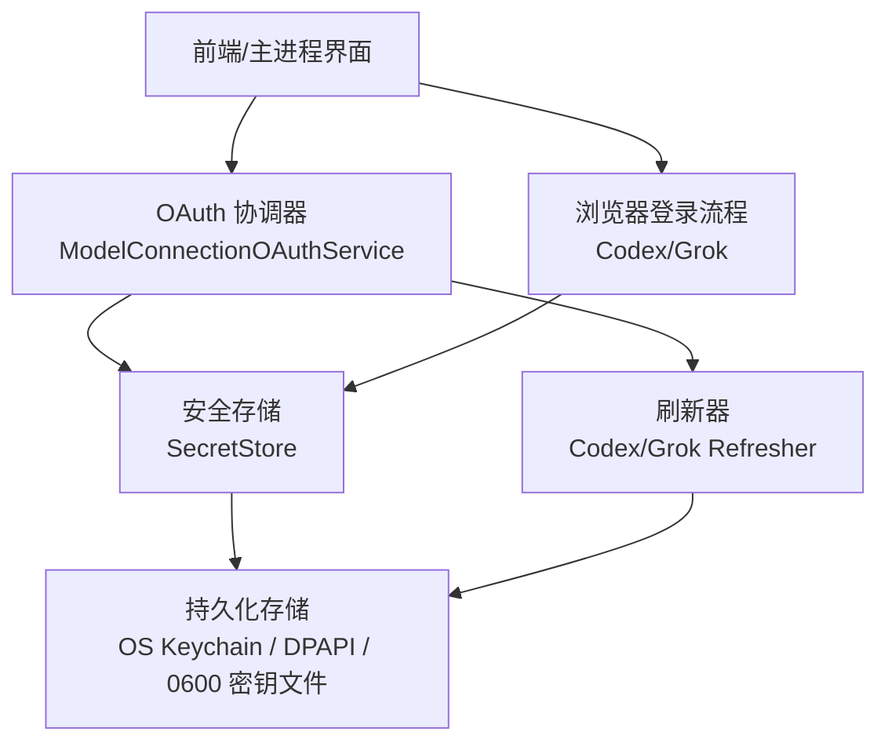
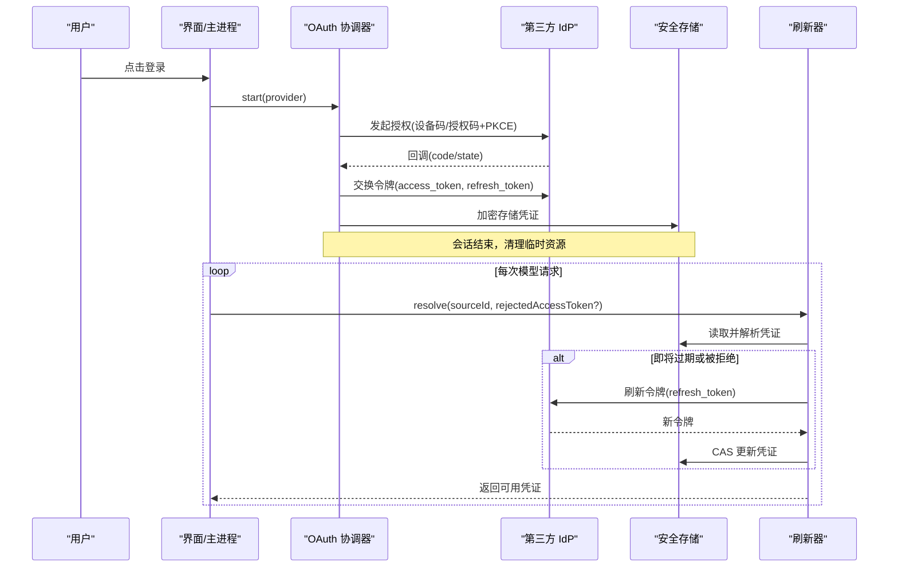
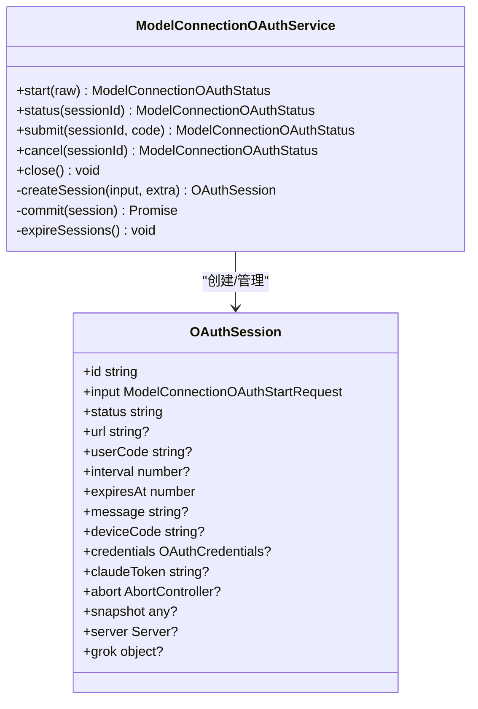
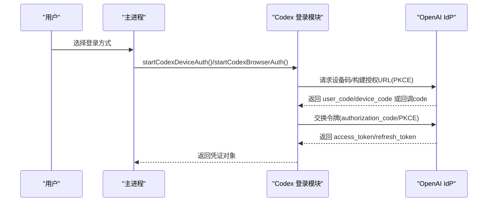
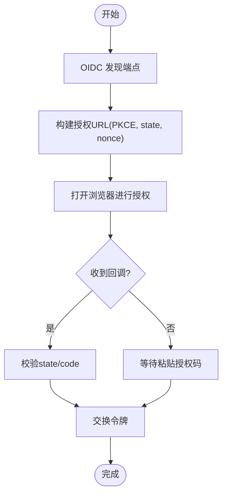
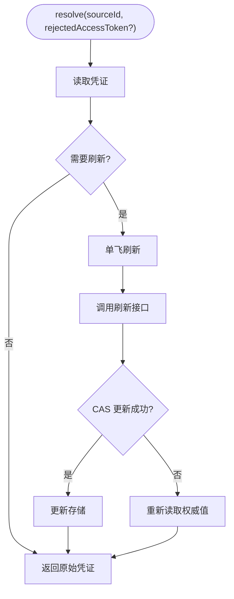
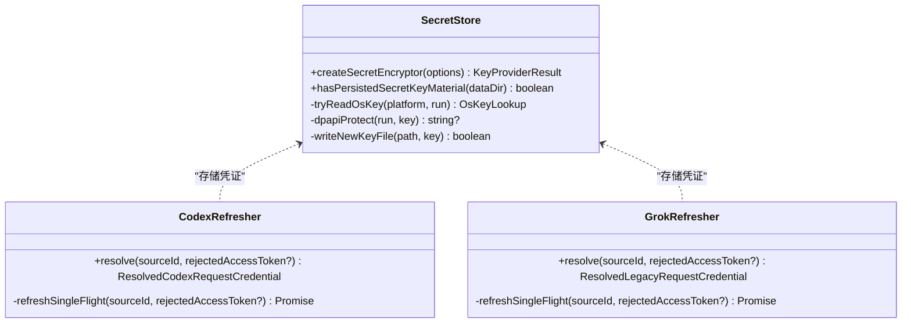
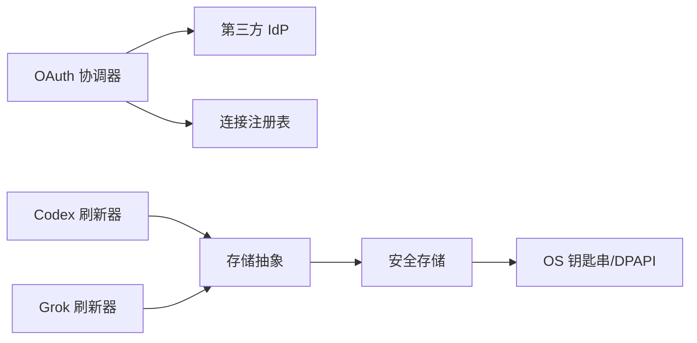

# 令牌管理

<cite>
**本文引用的文件**
- [auth.ts](file://kun/src/server/auth.ts)
- [secret-store.ts](file://kun/src/security/secret-store.ts)
- [model-connection-oauth.ts](file://kun/src/services/model-connection-oauth.ts)
- [codex-auth.ts](file://src/main/codex-auth.ts)
- [grok-auth.ts](file://src/main/grok-auth.ts)
- [codex-oauth-credential-refresher.ts](file://kun/src/services/codex-oauth-credential-refresher.ts)
- [grok-oauth-credential-refresher.ts](file://kun/src/services/grok-oauth-credential-refresher.ts)
- [settings-credential-redaction.ts](file://src/main/settings-credential-redaction.ts)
</cite>

## 目录
1. [简介](#简介)
2. [项目结构](#项目结构)
3. [核心组件](#核心组件)
4. [架构总览](#架构总览)
5. [详细组件分析](#详细组件分析)
6. [依赖关系分析](#依赖关系分析)
7. [性能考量](#性能考量)
8. [故障排查指南](#故障排查指南)
9. [结论](#结论)
10. [附录](#附录)

## 简介
本文件面向 DeepSeek-GUI 的令牌管理系统，系统化说明 OAuth 认证流程（授权码模式、设备码模式、刷新令牌机制）、JWT 令牌的生成与验证策略、令牌生命周期与安全存储、API 密钥管理与轮换、第三方服务集成示例（ChatGPT/Codex、Grok）、令牌缓存与并发控制、以及令牌泄露防护与审计日志最佳实践。文档以仓库实际实现为依据，提供可追溯的代码级图示与路径引用。

## 项目结构
令牌相关能力分布在以下层次：
- 服务端鉴权与 Bearer 校验：用于内部服务间访问控制。
- 安全存储：基于 AES-256-GCM 的“静默加密”，密钥来源优先 OS 钥匙串/DPAPI，回退到 0600 权限密钥文件。
- OAuth 协调器：统一编排 ChatGPT（设备码+授权码）、Grok（OIDC 授权码+PKCE）等提供商登录流程。
- 浏览器端登录：本地回调服务器接收授权码，完成令牌交换并返回凭证。
- 刷新器：按请求前解析并刷新过期或即将过期的令牌，支持单飞并发与冲突解决。
- 设置层保护：渲染层对敏感字段脱敏，避免误写覆盖真实密钥。

**图表来源**
- [model-connection-oauth.ts:55-120](file://kun/src/services/model-connection-oauth.ts#L55-L120)
- [secret-store.ts:1-120](file://kun/src/security/secret-store.ts#L1-L120)
- [codex-auth.ts:148-221](file://src/main/codex-auth.ts#L148-L221)
- [grok-auth.ts:317-431](file://src/main/grok-auth.ts#L317-L431)

**章节来源**
- [auth.ts:1-17](file://kun/src/server/auth.ts#L1-L17)
- [secret-store.ts:1-120](file://kun/src/security/secret-store.ts#L1-L120)
- [model-connection-oauth.ts:55-120](file://kun/src/services/model-connection-oauth.ts#L55-L120)

## 核心组件
- 服务端鉴权：提取并校验 Bearer Token，支持敏感控制面强制鉴权。
- 安全存储：AES-256-GCM 加密，密钥来源优先级：OS 钥匙串/DPAPI > 0600 密钥文件；提供原子写入、租约与心跳防止并发破坏。
- OAuth 协调器：集中处理 ChatGPT（设备码+授权码）、Grok（OIDC 授权码+PKCE）、Claude SDK 令牌获取，维护会话状态与回调服务。
- 浏览器登录：本地回调服务器接收授权码，执行令牌交换，输出成功/失败页面。
- 刷新器：在请求前解析并刷新即将过期或被拒绝的令牌，单飞并发，CAS 更新。
- 设置脱敏：渲染层投影隐藏敏感字段，避免误写覆盖真实密钥。

**章节来源**
- [auth.ts:1-17](file://kun/src/server/auth.ts#L1-L17)
- [secret-store.ts:14-120](file://kun/src/security/secret-store.ts#L14-L120)
- [model-connection-oauth.ts:55-120](file://kun/src/services/model-connection-oauth.ts#L55-L120)
- [codex-auth.ts:148-221](file://src/main/codex-auth.ts#L148-L221)
- [grok-auth.ts:317-431](file://src/main/grok-auth.ts#L317-L431)
- [codex-oauth-credential-refresher.ts:30-117](file://kun/src/services/codex-oauth-credential-refresher.ts#L30-L117)
- [grok-oauth-credential-refresher.ts:39-131](file://kun/src/services/grok-oauth-credential-refresher.ts#L39-L131)
- [settings-credential-redaction.ts:19-89](file://src/main/settings-credential-redaction.ts#L19-L89)

## 架构总览
下图展示从用户触发登录到令牌落地存储、再到请求前自动刷新的完整链路。

**图表来源**
- [model-connection-oauth.ts:66-120](file://kun/src/services/model-connection-oauth.ts#L66-L120)
- [codex-auth.ts:148-221](file://src/main/codex-auth.ts#L148-L221)
- [grok-auth.ts:317-431](file://src/main/grok-auth.ts#L317-L431)
- [codex-oauth-credential-refresher.ts:43-117](file://kun/src/services/codex-oauth-credential-refresher.ts#L43-L117)
- [grok-oauth-credential-refresher.ts:57-131](file://kun/src/services/grok-oauth-credential-refresher.ts#L57-L131)
- [secret-store.ts:573-653](file://kun/src/security/secret-store.ts#L573-L653)

## 详细组件分析

### OAuth 协调器（ModelConnectionOAuthService）
- 职责：统一管理不同提供商的登录流程（ChatGPT 设备码、Grok OIDC 授权码、Claude SDK），维护会话、回调服务、令牌交换与连接注册。
- 关键点：
  - 会话 TTL 与过期清理。
  - Grok 使用 PKCE 与本地回调端口，支持粘贴授权码回退。
  - ChatGPT 使用设备码轮询后走授权码交换。
  - 成功后将凭证序列化并写入连接注册表。

**图表来源**
- [model-connection-oauth.ts:25-53](file://kun/src/services/model-connection-oauth.ts#L25-L53)
- [model-connection-oauth.ts:55-120](file://kun/src/services/model-connection-oauth.ts#L55-L120)

**章节来源**
- [model-connection-oauth.ts:66-120](file://kun/src/services/model-connection-oauth.ts#L66-L120)
- [model-connection-oauth.ts:137-179](file://kun/src/services/model-connection-oauth.ts#L137-L179)
- [model-connection-oauth.ts:181-240](file://kun/src/services/model-connection-oauth.ts#L181-L240)
- [model-connection-oauth.ts:242-324](file://kun/src/services/model-connection-oauth.ts#L242-L324)

### 浏览器端 Codex（ChatGPT）登录流程
- 流程要点：
  - 设备码模式：获取 device_code/user_code，轮询换取 authorization_code 后再换 access_token/refresh_token。
  - 浏览器模式：本地回调服务器监听固定端口，接收 code 并交换令牌，支持端口占用回退。
  - 错误处理：超时、端口占用、状态校验失败、网络异常等均有明确提示。

**图表来源**
- [codex-auth.ts:148-221](file://src/main/codex-auth.ts#L148-L221)
- [codex-auth.ts:315-439](file://src/main/codex-auth.ts#L315-L439)

**章节来源**
- [codex-auth.ts:148-221](file://src/main/codex-auth.ts#L148-L221)
- [codex-auth.ts:315-439](file://src/main/codex-auth.ts#L315-L439)

### 浏览器端 Grok 登录流程（OIDC 授权码+PKCE）
- 流程要点：
  - 发现端点：通过 OIDC discovery 获取授权/令牌端点。
  - 本地回调：绑定 127.0.0.1 随机端口，接收 code/state，校验 state 防 CSRF。
  - 令牌交换：携带 code_verifier 与客户端版本头。
  - 回退：支持用户粘贴授权码或回调 URL。

**图表来源**
- [grok-auth.ts:145-203](file://src/main/grok-auth.ts#L145-L203)
- [grok-auth.ts:317-431](file://src/main/grok-auth.ts#L317-L431)
- [grok-auth.ts:437-463](file://src/main/grok-auth.ts#L437-L463)

**章节来源**
- [grok-auth.ts:317-431](file://src/main/grok-auth.ts#L317-L431)
- [grok-auth.ts:437-463](file://src/main/grok-auth.ts#L437-L463)

### 令牌刷新与生命周期管理
- 刷新策略：
  - 提前失效窗口：在到期前若干分钟主动刷新，降低请求时失败概率。
  - 被拒绝刷新：当上游返回 401 且当前令牌仍为被拒绝令牌时触发刷新。
  - 单飞并发：同一 sourceId 的刷新操作串行化，避免重复刷新与旋转冲突。
  - CAS 更新：仅当存储值未变更时才写入，避免覆盖其他写入者。
- 生命周期计算：
  - 优先使用 expires_in，其次解析 JWT exp，最后使用默认 TTL。

**图表来源**
- [codex-oauth-credential-refresher.ts:43-117](file://kun/src/services/codex-oauth-credential-refresher.ts#L43-L117)
- [grok-oauth-credential-refresher.ts:57-131](file://kun/src/services/grok-oauth-credential-refresher.ts#L57-L131)
- [grok-oauth-credential-refresher.ts:171-229](file://kun/src/services/grok-oauth-credential-refresher.ts#L171-L229)
- [codex-oauth-credential-refresher.ts:157-211](file://kun/src/services/codex-oauth-credential-refresher.ts#L157-L211)

**章节来源**
- [codex-oauth-credential-refresher.ts:43-117](file://kun/src/services/codex-oauth-credential-refresher.ts#L43-L117)
- [grok-oauth-credential-refresher.ts:57-131](file://kun/src/services/grok-oauth-credential-refresher.ts#L57-L131)
- [grok-oauth-credential-refresher.ts:171-229](file://kun/src/services/grok-oauth-credential-refresher.ts#L171-L229)
- [codex-oauth-credential-refresher.ts:157-211](file://kun/src/services/codex-oauth-credential-refresher.ts#L157-L211)

### 安全存储与 API 密钥管理
- 加密算法：AES-256-GCM，信封格式包含 IV、标签与密文。
- 密钥来源：
  - macOS/Linux：系统钥匙串/secret-tool。
  - Windows：DPAPI（CurrentUser）包裹密钥文件。
  - 回退：0600 权限密钥文件，保证即使无钥匙串也保持“静默加密”。
- 并发安全：
  - 首次密钥引导通过租约与心跳确保唯一性。
  - 原子写入与临时文件重命名避免部分写入。
- API 密钥管理：
  - 支持 JSON 编码的 OAuth 凭证（kind 区分 codex/grok）。
  - 解析/编码/刷新工具函数，结合刷新器实现透明续期。
  - 设置层脱敏：渲染层投影隐藏敏感字段，避免误写覆盖真实密钥。

**图表来源**
- [secret-store.ts:573-653](file://kun/src/security/secret-store.ts#L573-L653)
- [codex-oauth-credential-refresher.ts:30-117](file://kun/src/services/codex-oauth-credential-refresher.ts#L30-L117)
- [grok-oauth-credential-refresher.ts:39-131](file://kun/src/services/grok-oauth-credential-refresher.ts#L39-L131)

**章节来源**
- [secret-store.ts:14-120](file://kun/src/security/secret-store.ts#L14-L120)
- [secret-store.ts:573-653](file://kun/src/security/secret-store.ts#L573-L653)
- [settings-credential-redaction.ts:19-89](file://src/main/settings-credential-redaction.ts#L19-L89)

### 第三方服务集成示例
- ChatGPT/Codex：
  - 设备码模式：获取 device_code/user_code，轮询换取 authorization_code，再交换令牌。
  - 浏览器模式：本地回调服务器接收 code，交换令牌，支持端口占用回退。
- Grok：
  - OIDC 授权码+PKCE：发现端点、本地回调、state 校验、粘贴授权码回退。
  - 刷新：支持 OIDC 发现或直连 /oauth2/token，保留 refresh_token 以防缺失。

**章节来源**
- [codex-auth.ts:148-221](file://src/main/codex-auth.ts#L148-L221)
- [codex-auth.ts:315-439](file://src/main/codex-auth.ts#L315-L439)
- [grok-auth.ts:317-431](file://src/main/grok-auth.ts#L317-L431)
- [grok-auth.ts:474-509](file://src/main/grok-auth.ts#L474-L509)

## 依赖关系分析
- 组件耦合：
  - OAuth 协调器依赖提供商适配器与连接注册表。
  - 刷新器依赖存储抽象（resolve/update），与 IdP 通信。
  - 安全存储与平台命令执行解耦，便于测试与降级。
- 外部依赖：
  - 第三方 IdP（OpenAI、X.AI）的 OIDC/OAuth 端点。
  - 操作系统钥匙串/DPAPI/secret-tool。
- 潜在循环依赖：
  - 各刷新器与存储抽象之间无直接循环，协调器与刷新器职责分离清晰。

**图表来源**
- [model-connection-oauth.ts:55-120](file://kun/src/services/model-connection-oauth.ts#L55-L120)
- [codex-oauth-credential-refresher.ts:30-117](file://kun/src/services/codex-oauth-credential-refresher.ts#L30-L117)
- [grok-oauth-credential-refresher.ts:39-131](file://kun/src/services/grok-oauth-credential-refresher.ts#L39-L131)
- [secret-store.ts:573-653](file://kun/src/security/secret-store.ts#L573-L653)

**章节来源**
- [model-connection-oauth.ts:55-120](file://kun/src/services/model-connection-oauth.ts#L55-L120)
- [codex-oauth-credential-refresher.ts:30-117](file://kun/src/services/codex-oauth-credential-refresher.ts#L30-L117)
- [grok-oauth-credential-refresher.ts:39-131](file://kun/src/services/grok-oauth-credential-refresher.ts#L39-L131)
- [secret-store.ts:573-653](file://kun/src/security/secret-store.ts#L573-L653)

## 性能考量
- 刷新单飞：避免并发刷新导致令牌旋转冲突与重复网络请求。
- 提前失效窗口：减少请求时刷新带来的延迟抖动。
- 本地回调端口：快速响应授权回调，避免跨进程通信开销。
- 存储降级：钥匙串不可用时回退到 0600 密钥文件，保证可用性。

[本节为通用指导，不直接分析具体文件]

## 故障排查指南
- 登录失败：
  - 检查回调端口是否被占用（Codex/Grok 均支持错误提示与回退）。
  - 确认 state 校验通过，避免 CSRF 拦截。
  - 查看网络错误摘要，注意敏感信息已脱敏。
- 刷新失败：
  - 检查 refresh_token 是否有效，必要时重新登录。
  - 观察单飞刷新是否被其他写入者覆盖。
- 存储问题：
  - 钥匙串不可用时会抛出明确原因，允许回退到密钥文件。
  - 若 DPAPI 保护密钥不可读，会阻止替换以避免数据丢失。

**章节来源**
- [codex-auth.ts:399-439](file://src/main/codex-auth.ts#L399-L439)
- [grok-auth.ts:386-431](file://src/main/grok-auth.ts#L386-L431)
- [codex-oauth-credential-refresher.ts:157-211](file://kun/src/services/codex-oauth-credential-refresher.ts#L157-L211)
- [grok-oauth-credential-refresher.ts:171-229](file://kun/src/services/grok-oauth-credential-refresher.ts#L171-L229)
- [secret-store.ts:248-333](file://kun/src/security/secret-store.ts#L248-L333)

## 结论
DeepSeek-GUI 的令牌管理系统通过统一的 OAuth 协调器、安全的静默加密存储、智能的刷新策略与严格的并发控制，实现了多提供商的稳定接入与高可用运行。结合设置层脱敏与完善的错误处理，系统在安全性与用户体验之间取得良好平衡。建议在生产环境中启用 OS 钥匙串/DPAPI 以获得更强保护，并配合监控与审计日志持续优化。

[本节为总结，不直接分析具体文件]

## 附录
- 服务端鉴权：
  - Bearer 提取与校验，支持敏感控制面强制鉴权。
- 令牌缓存与并发控制：
  - 刷新器按 sourceId 单飞刷新，CAS 更新避免竞态。
- 令牌泄露防护：
  - 静默加密存储、钥匙串/DPAPI 保护、设置层脱敏。
- 审计日志建议：
  - 记录登录事件、刷新结果、错误摘要（已脱敏敏感信息）。
  - 记录存储降级原因与回退路径。

**章节来源**
- [auth.ts:1-17](file://kun/src/server/auth.ts#L1-L17)
- [codex-oauth-credential-refresher.ts:43-117](file://kun/src/services/codex-oauth-credential-refresher.ts#L43-L117)
- [grok-oauth-credential-refresher.ts:57-131](file://kun/src/services/grok-oauth-credential-refresher.ts#L57-L131)
- [secret-store.ts:573-653](file://kun/src/security/secret-store.ts#L573-L653)
- [settings-credential-redaction.ts:19-89](file://src/main/settings-credential-redaction.ts#L19-L89)