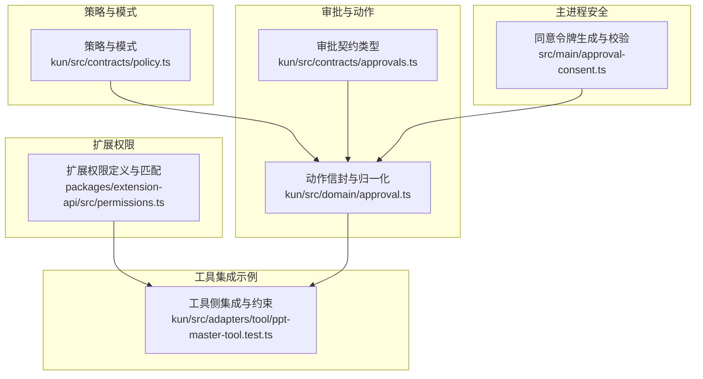
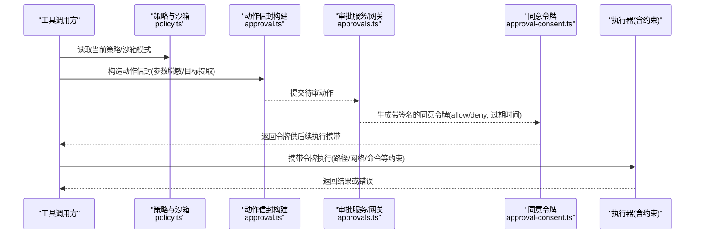
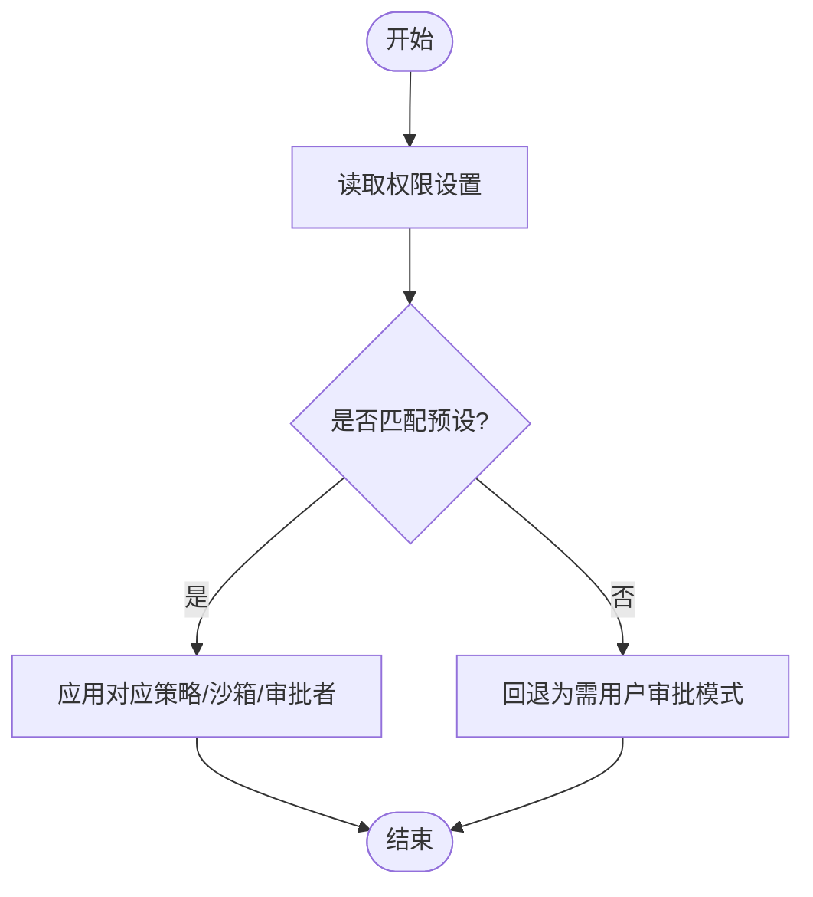
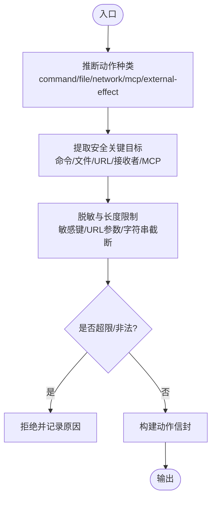
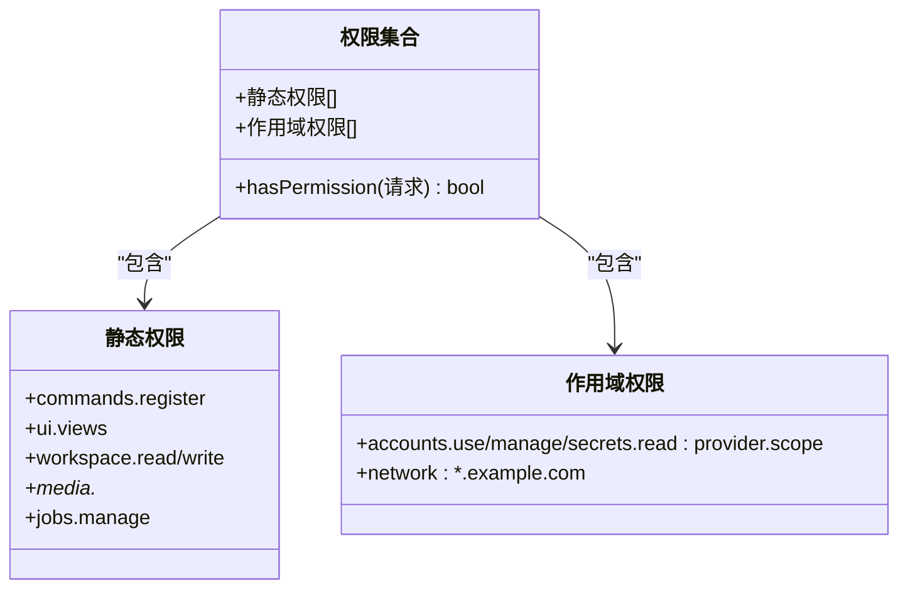
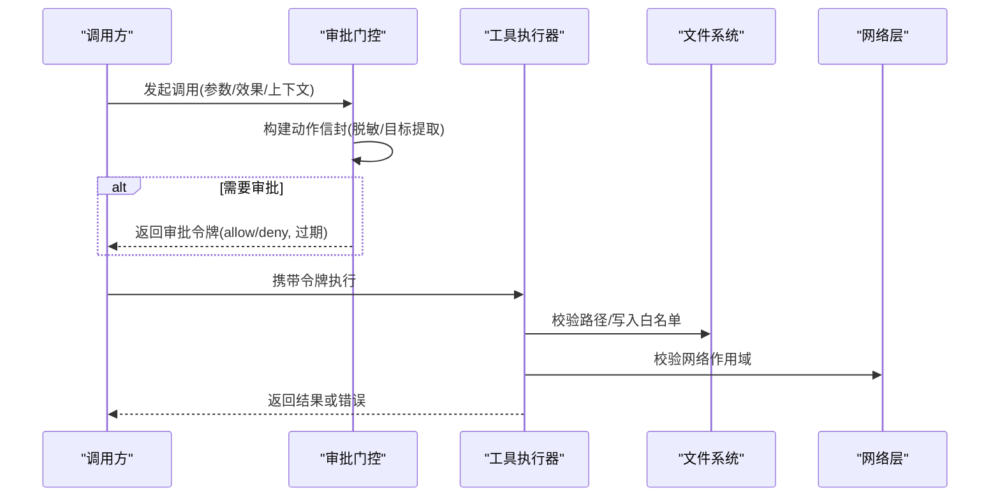
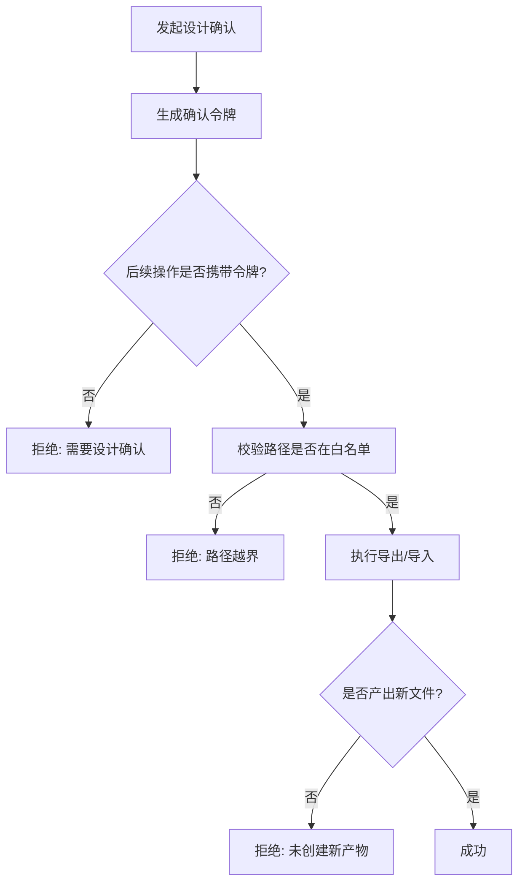
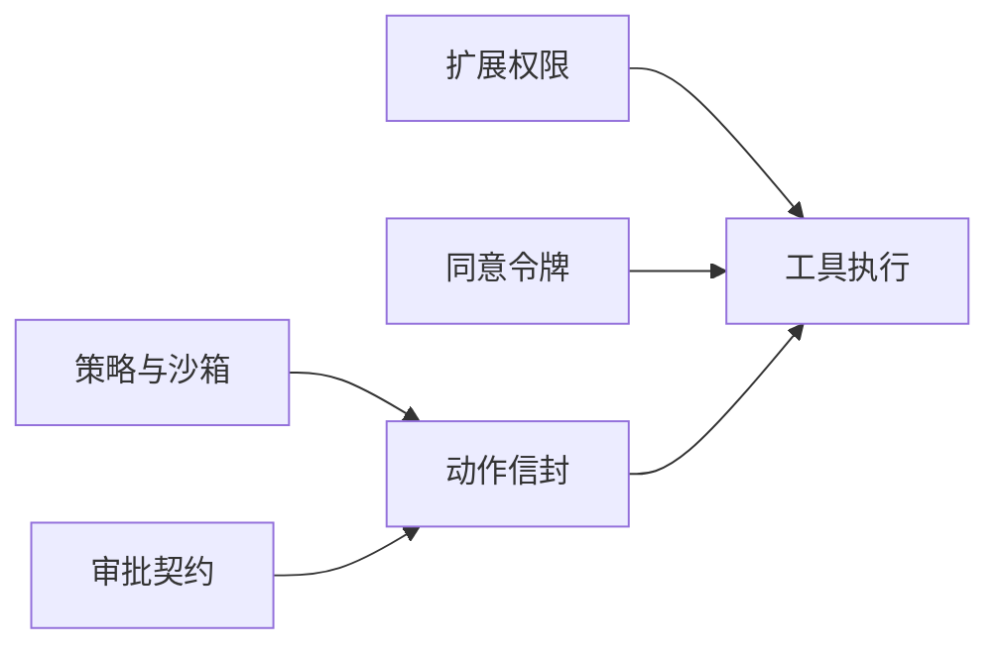

# 权限验证

<cite>
**本文引用的文件**
- [policy.ts](file://kun/src/contracts/policy.ts)
- [approvals.ts](file://kun/src/contracts/approvals.ts)
- [approval.ts](file://kun/src/domain/approval.ts)
- [permissions.ts](file://packages/extension-api/src/permissions.ts)
- [approval-consent.ts](file://src/main/approval-consent.ts)
- [ppt-master-tool.test.ts](file://kun/src/adapters/tool/ppt-master-tool.test.ts)
</cite>

## 目录
1. [简介](#简介)
2. [项目结构](#项目结构)
3. [核心组件](#核心组件)
4. [架构总览](#架构总览)
5. [详细组件分析](#详细组件分析)
6. [依赖关系分析](#依赖关系分析)
7. [性能考量](#性能考量)
8. [故障排查指南](#故障排查指南)
9. [结论](#结论)
10. [附录](#附录)

## 简介
本文件面向DeepSeek-GUI的权限验证系统，聚焦角色基础访问控制（RBAC）模型、细粒度权限检查、扩展权限模型以及权限在工具调用、文件操作与API请求中的集成方式。文档同时覆盖动态授权、撤销与批量管理思路，并给出权限审计与违规检测的实现方案。内容基于仓库中已实现的策略、审批信封、扩展权限与主进程同意令牌等模块进行说明。

## 项目结构
权限相关能力分布在以下层次：
- 策略与模式定义：统一策略枚举、沙箱模式、工具权限预设映射
- 审批与动作信封：将工具调用抽象为可审计、可审查的动作包
- 扩展权限模型：插件/扩展声明式静态权限与带作用域的动态权限
- 主进程安全令牌：用于跨进程传递受保护的审批同意结果
- 工具侧集成示例：通过测试用例展示路径限制、确认令牌与输出白名单

**图表来源**
- [policy.ts:1-129](file://kun/src/contracts/policy.ts#L1-L129)
- [approvals.ts:1-87](file://kun/src/contracts/approvals.ts#L1-L87)
- [approval.ts:1-604](file://kun/src/domain/approval.ts#L1-L604)
- [permissions.ts:1-54](file://packages/extension-api/src/permissions.ts#L1-L54)
- [approval-consent.ts:1-29](file://src/main/approval-consent.ts#L1-L29)
- [ppt-master-tool.test.ts:1-329](file://kun/src/adapters/tool/ppt-master-tool.test.ts#L1-L329)

**章节来源**
- [policy.ts:1-129](file://kun/src/contracts/policy.ts#L1-L129)
- [approvals.ts:1-87](file://kun/src/contracts/approvals.ts#L1-L87)
- [approval.ts:1-604](file://kun/src/domain/approval.ts#L1-L604)
- [permissions.ts:1-54](file://packages/extension-api/src/permissions.ts#L1-L54)
- [approval-consent.ts:1-29](file://src/main/approval-consent.ts#L1-L29)
- [ppt-master-tool.test.ts:1-329](file://kun/src/adapters/tool/ppt-master-tool.test.ts#L1-L329)

## 核心组件
- 策略与沙箱模式：定义审批策略、沙箱模式、审批者角色及三态产品级权限预设，提供从设置到模式的互转与等价判断
- 审批动作信封：将任意工具调用收敛为受限、脱敏、可审计的“动作包”，包含目标提取、敏感信息清洗、尺寸与深度限制
- 扩展权限模型：声明式静态权限与带作用域的网络/账户权限，支持通配匹配与批量判定
- 主进程同意令牌：对审批同意结果进行签名与过期控制，确保跨进程传输安全
- 工具集成约束：以PPT Master为例，演示路径白名单、确认令牌、输出产物校验与只读读取边界

**章节来源**
- [policy.ts:1-129](file://kun/src/contracts/policy.ts#L1-L129)
- [approvals.ts:1-87](file://kun/src/contracts/approvals.ts#L1-L87)
- [approval.ts:1-604](file://kun/src/domain/approval.ts#L1-L604)
- [permissions.ts:1-54](file://packages/extension-api/src/permissions.ts#L1-L54)
- [approval-consent.ts:1-29](file://src/main/approval-consent.ts#L1-L29)
- [ppt-master-tool.test.ts:1-329](file://kun/src/adapters/tool/ppt-master-tool.test.ts#L1-L329)

## 架构总览
下图展示了从工具调用到权限决策与执行的端到端流程，涵盖策略选择、动作信封构建、审批流与执行约束。

**图表来源**
- [policy.ts:1-129](file://kun/src/contracts/policy.ts#L1-L129)
- [approval.ts:1-604](file://kun/src/domain/approval.ts#L1-L604)
- [approvals.ts:1-87](file://kun/src/contracts/approvals.ts#L1-L87)
- [approval-consent.ts:1-29](file://src/main/approval-consent.ts#L1-L29)

## 详细组件分析

### RBAC模型与权限预设
- 角色与模式映射：通过三态产品级权限预设（询问用户批准、替我批准、完全访问）映射到底层审批策略与沙箱模式，并指定审批者角色
- 默认值与兼容性：提供兼容旧设置的默认策略，避免升级后权限意外放宽
- 模式互转与等价判断：支持从设置反推产品模式，并提供严格相等比较，便于界面渲染与持久化

**图表来源**
- [policy.ts:1-129](file://kun/src/contracts/policy.ts#L1-L129)

**章节来源**
- [policy.ts:1-129](file://kun/src/contracts/policy.ts#L1-L129)

### 细粒度权限检查机制
- 资源级权限：从工具参数中提取关键目标（命令、文件、URL、接收者、MCP资源），并进行去重与上限控制
- 操作级权限：根据工具效果标记（网络、外部写入、进程执行、GUI自动化）推断动作种类，驱动不同审批策略
- 上下文感知：结合工作区、当前目录、工具名称与提供者类型，限定可访问范围与可见性

**图表来源**
- [approval.ts:148-203](file://kun/src/domain/approval.ts#L148-L203)
- [approval.ts:214-351](file://kun/src/domain/approval.ts#L214-L351)
- [approval.ts:375-450](file://kun/src/domain/approval.ts#L375-L450)
- [approvals.ts:1-87](file://kun/src/contracts/approvals.ts#L1-L87)

**章节来源**
- [approval.ts:148-203](file://kun/src/domain/approval.ts#L148-L203)
- [approval.ts:214-351](file://kun/src/domain/approval.ts#L214-L351)
- [approval.ts:375-450](file://kun/src/domain/approval.ts#L375-L450)
- [approvals.ts:1-87](file://kun/src/contracts/approvals.ts#L1-L87)

### 扩展权限模型（Webview、文件系统、网络请求）
- 静态权限：插件可声明一组固定能力（如UI视图、通知、工作区读写、媒体处理、作业管理等）
- 作用域权限：
  - 账户类：按提供者与作用域精确匹配（使用/管理/密钥读取）
  - 网络类：支持域名前缀通配，实现子域级别的授权
- 匹配算法：支持精确匹配与通配后缀匹配，提供批量判定接口

**图表来源**
- [permissions.ts:1-54](file://packages/extension-api/src/permissions.ts#L1-L54)

**章节来源**
- [permissions.ts:1-54](file://packages/extension-api/src/permissions.ts#L1-L54)

### 权限配置与管理接口
- 动态授予：通过策略与沙箱模式组合，在运行时切换审批策略与执行边界；扩展权限可在加载时声明并按作用域授予
- 撤销与批量管理：通过更新策略/沙箱模式与撤销扩展权限列表实现；利用等价比较函数识别变更并触发重新评估
- 建议实践：
  - 最小权限原则：默认采用“询问用户批准”+“工作区写入”
  - 渐进提权：仅在必要时切换到“替我批准”或“完全访问”
  - 作用域收敛：网络权限尽量限定到具体域名或子域

**章节来源**
- [policy.ts:1-129](file://kun/src/contracts/policy.ts#L1-L129)
- [permissions.ts:1-54](file://packages/extension-api/src/permissions.ts#L1-L54)

### 权限验证在工具调用、文件操作与API请求中的集成
- 工具调用：在执行前构造动作信封，依据策略决定是否进入审批流；通过后由执行器校验路径/网络/命令等约束
- 文件操作：通过“exactFileTargets”与路径白名单双重约束，拒绝越界写入；输出产物需位于允许目录
- API请求：网络权限按作用域匹配；浏览器类工具会对URL进行脱敏与目标抽取，避免凭据泄露

**图表来源**
- [approval.ts:148-203](file://kun/src/domain/approval.ts#L148-L203)
- [approvals.ts:1-87](file://kun/src/contracts/approvals.ts#L1-L87)
- [permissions.ts:1-54](file://packages/extension-api/src/permissions.ts#L1-L54)

**章节来源**
- [approval.ts:148-203](file://kun/src/domain/approval.ts#L148-L203)
- [approvals.ts:1-87](file://kun/src/contracts/approvals.ts#L1-L87)
- [permissions.ts:1-54](file://packages/extension-api/src/permissions.ts#L1-L54)

### 权限审计与违规检测
- 审计数据：动作信封包含工具名、提供者、效果标记、工作区、目标与原因，适合持久化与回放
- 脱敏与限制：所有敏感字段均被清洗，字符串/数组/对象深度与字节数受限，避免存储膨胀与泄露
- 违规检测：
  - 路径越界：拒绝不在白名单目录的读写
  - 未授权网络：作用域不匹配则拒绝
  - 缺少令牌：需要审批的操作未携带有效令牌
  - 过期令牌：超过有效期视为无效
- 建议：对拒绝事件与异常路径进行集中上报，形成告警与回溯

**章节来源**
- [approval.ts:148-203](file://kun/src/domain/approval.ts#L148-L203)
- [approval.ts:375-450](file://kun/src/domain/approval.ts#L375-L450)
- [approvals.ts:1-87](file://kun/src/contracts/approvals.ts#L1-L87)

### 工具集成示例：PPT Master
- 设计确认令牌：生成一次性令牌，后续导出/导入等操作必须携带该令牌
- 路径白名单：项目根、输出目录严格限定，越界即拒绝
- 产物校验：导出成功后必须产生新文件，拒绝复用旧产物
- 只读边界：读取技能包内文档时限制路径与输出大小

**图表来源**
- [ppt-master-tool.test.ts:31-47](file://kun/src/adapters/tool/ppt-master-tool.test.ts#L31-L47)
- [ppt-master-tool.test.ts:156-200](file://kun/src/adapters/tool/ppt-master-tool.test.ts#L156-L200)
- [ppt-master-tool.test.ts:220-260](file://kun/src/adapters/tool/ppt-master-tool.test.ts#L220-L260)
- [ppt-master-tool.test.ts:304-329](file://kun/src/adapters/tool/ppt-master-tool.test.ts#L304-L329)

**章节来源**
- [ppt-master-tool.test.ts:31-47](file://kun/src/adapters/tool/ppt-master-tool.test.ts#L31-L47)
- [ppt-master-tool.test.ts:156-200](file://kun/src/adapters/tool/ppt-master-tool.test.ts#L156-L200)
- [ppt-master-tool.test.ts:220-260](file://kun/src/adapters/tool/ppt-master-tool.test.ts#L220-L260)
- [ppt-master-tool.test.ts:304-329](file://kun/src/adapters/tool/ppt-master-tool.test.ts#L304-L329)

## 依赖关系分析
- 策略层依赖：策略与沙箱模式为上层审批与执行提供基线
- 动作信封依赖：依赖契约类型定义，确保跨模块数据结构一致
- 扩展权限依赖：插件侧声明权限，运行期进行匹配与判定
- 主进程令牌依赖：审批结果经主进程签名后下发给执行器，防止伪造

**图表来源**
- [policy.ts:1-129](file://kun/src/contracts/policy.ts#L1-L129)
- [approvals.ts:1-87](file://kun/src/contracts/approvals.ts#L1-L87)
- [approval.ts:1-604](file://kun/src/domain/approval.ts#L1-L604)
- [permissions.ts:1-54](file://packages/extension-api/src/permissions.ts#L1-L54)
- [approval-consent.ts:1-29](file://src/main/approval-consent.ts#L1-L29)

**章节来源**
- [policy.ts:1-129](file://kun/src/contracts/policy.ts#L1-L129)
- [approvals.ts:1-87](file://kun/src/contracts/approvals.ts#L1-L87)
- [approval.ts:1-604](file://kun/src/domain/approval.ts#L1-L604)
- [permissions.ts:1-54](file://packages/extension-api/src/permissions.ts#L1-L54)
- [approval-consent.ts:1-29](file://src/main/approval-consent.ts#L1-L29)

## 性能考量
- 动作信封构建：对参数进行递归归一化与脱敏，存在深度与字节限制，避免大对象导致性能问题
- 目标提取：仅收集有限数量的关键目标，减少序列化与存储开销
- 权限匹配：静态权限为常量集，作用域匹配采用正则与字符串前缀判断，复杂度低
- 建议：在高并发场景下缓存策略与权限判定结果，避免重复计算

[本节为通用指导，不直接分析具体文件]

## 故障排查指南
- 常见错误与定位
  - 路径越界：检查工具输出的路径是否在白名单目录
  - 未携带令牌：需要审批的操作必须携带有效的确认令牌
  - 令牌过期：检查令牌的过期时间是否仍在有效期内
  - 网络作用域不匹配：核对网络权限是否包含目标域名或其子域
  - 产物缺失：导出操作必须产生新文件，否则视为失败
- 调试建议
  - 查看动作信封的目标与脱敏后的参数，确认是否包含敏感信息
  - 对比策略与沙箱模式，确认是否符合预期
  - 对拒绝事件进行日志采集，记录工具名、动作种类、目标与原因

**章节来源**
- [approval.ts:148-203](file://kun/src/domain/approval.ts#L148-L203)
- [approval.ts:375-450](file://kun/src/domain/approval.ts#L375-L450)
- [approvals.ts:1-87](file://kun/src/contracts/approvals.ts#L1-L87)
- [ppt-master-tool.test.ts:156-200](file://kun/src/adapters/tool/ppt-master-tool.test.ts#L156-L200)
- [ppt-master-tool.test.ts:220-260](file://kun/src/adapters/tool/ppt-master-tool.test.ts#L220-L260)

## 结论
DeepSeek-GUI的权限验证体系以策略与沙箱模式为基础，结合动作信封与扩展权限模型，实现了从工具调用到执行的全链路可控。通过主进程同意令牌保障跨进程安全，配合严格的资源与操作级检查，满足细粒度权限需求。建议在实践中遵循最小权限原则，逐步提升权限，并对拒绝与异常进行集中审计与告警。

[本节为总结性内容，不直接分析具体文件]

## 附录
- 术语
  - 策略：决定是否需要审批以及审批者的策略
  - 沙箱模式：限制工具的执行边界（只读、工作区写入、完全访问等）
  - 动作信封：对工具调用进行脱敏与约束后的可审计表示
  - 作用域权限：按提供者或域名划分的细粒度权限
  - 同意令牌：主进程签名的审批结果载体，具备过期控制

[本节为概念性说明，不直接分析具体文件]