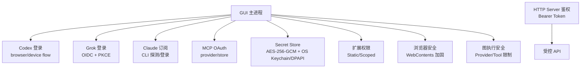
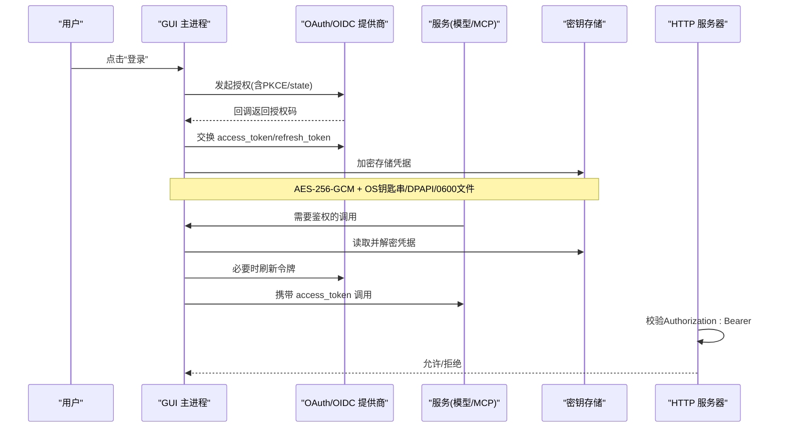
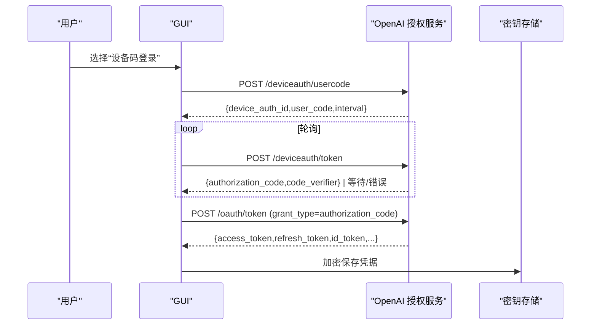
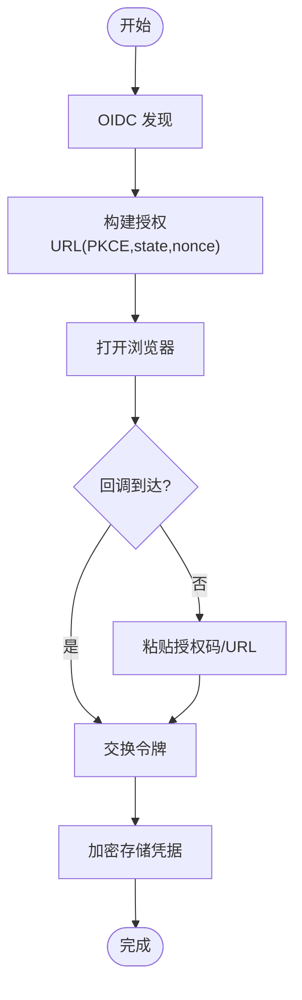
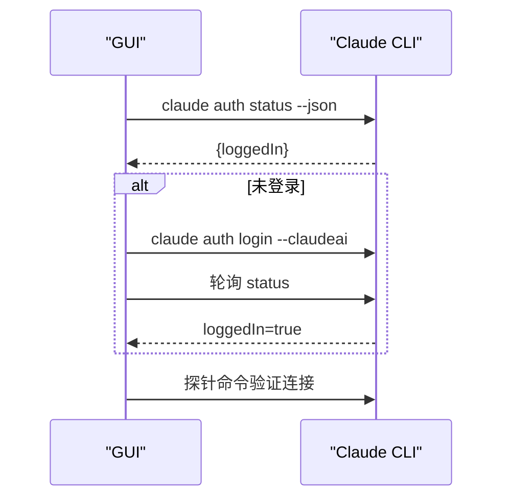
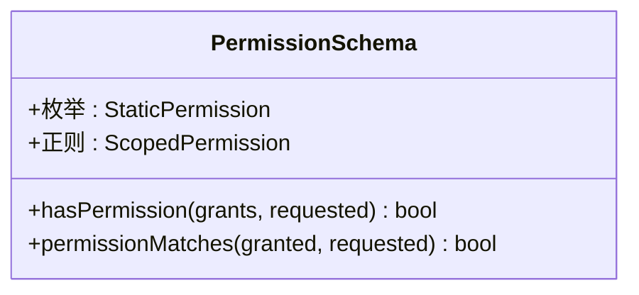
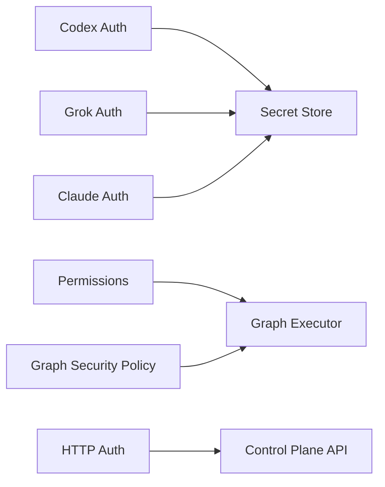

# 认证与授权

<cite>
**本文引用的文件**
- [auth.ts](file://kun/src/server/auth.ts)
- [codex-auth.ts](file://src/main/codex-auth.ts)
- [grok-auth.ts](file://src/main/grok-auth.ts)
- [claude-subscription-auth.ts](file://src/main/claude-subscription-auth.ts)
- [secret-store.ts](file://kun/src/security/secret-store.ts)
- [web-contents-hardening.ts](file://src/main/browser-security/web-contents-hardening.ts)
- [permissions.ts](file://packages/extension-api/src/permissions.ts)
- [graph-security-policy.ts](file://kun/src/graph/graph-security-policy.ts)
- [mcp-oauth-provider.ts](file://kun/src/adapters/tool/mcp-oauth-provider.ts)
- [mcp-oauth-store.ts](file://kun/src/adapters/tool/mcp-oauth-store.ts)
- [model-connection-oauth.ts](file://kun/src/services/model-connection-oauth.ts)
- [SidebarClawDialogHelpers.ts](file://src/renderer/src/components/chat/SidebarClawDialogHelpers.ts)
</cite>

## 目录
1. [简介](#简介)
2. [项目结构](#项目结构)
3. [核心组件](#核心组件)
4. [架构总览](#架构总览)
5. [详细组件分析](#详细组件分析)
6. [依赖关系分析](#依赖关系分析)
7. [性能考虑](#性能考虑)
8. [故障排查指南](#故障排查指南)
9. [结论](#结论)
10. [附录](#附录)

## 简介
本文件面向 DeepSeek-GUI 的认证与授权系统，聚焦令牌管理（OAuth、JWT、刷新策略）、权限模型（RBAC 与细粒度权限）、会话管理（登录态、超时、并发控制）与安全最佳实践（敏感信息存储、传输加密、审计日志），并提供常见场景的实现指引（第三方服务集成、API 密钥管理、企业 SSO）以及安全威胁防护与漏洞修复策略。

## 项目结构
本项目在多个层次实现认证与授权：
- 服务端鉴权：基于 Bearer Token 的轻量校验与运行时敏感接口保护
- 第三方 OAuth：Codex（OpenAI）、Grok（xAI）、Claude 订阅登录流程
- MCP 工具 OAuth：MCP 协议的 OAuth 提供与持久化
- 密钥与凭据：本地加密存储（AES-256-GCM + OS 钥匙串/DPAPI）
- 扩展权限：静态与范围化权限声明与匹配
- 浏览器安全：WebContents 加固与 Session 默认拒绝策略
- 图执行安全：网络与工具访问限制

**图示来源**
- [auth.ts:1-16](file://kun/src/server/auth.ts#L1-L16)
- [codex-auth.ts:148-489](file://src/main/codex-auth.ts#L148-L489)
- [grok-auth.ts:145-601](file://src/main/grok-auth.ts#L145-L601)
- [claude-subscription-auth.ts:131-356](file://src/main/claude-subscription-auth.ts#L131-L356)
- [secret-store.ts:1-653](file://kun/src/security/secret-store.ts#L1-L653)
- [permissions.ts:1-54](file://packages/extension-api/src/permissions.ts#L1-L54)
- [web-contents-hardening.ts:1-33](file://src/main/browser-security/web-contents-hardening.ts#L1-L33)
- [graph-security-policy.ts:1-62](file://kun/src/graph/graph-security-policy.ts#L1-L62)

**章节来源**
- [auth.ts:1-16](file://kun/src/server/auth.ts#L1-L16)
- [codex-auth.ts:148-489](file://src/main/codex-auth.ts#L148-L489)
- [grok-auth.ts:145-601](file://src/main/grok-auth.ts#L145-L601)
- [claude-subscription-auth.ts:131-356](file://src/main/claude-subscription-auth.ts#L131-L356)
- [secret-store.ts:1-653](file://kun/src/security/secret-store.ts#L1-L653)
- [permissions.ts:1-54](file://packages/extension-api/src/permissions.ts#L1-L54)
- [web-contents-hardening.ts:1-33](file://src/main/browser-security/web-contents-hardening.ts#L1-L33)
- [graph-security-policy.ts:1-62](file://kun/src/graph/graph-security-policy.ts#L1-L62)

## 核心组件
- HTTP 鉴权：解析 Authorization 头并校验 Bearer Token；对运行时敏感接口强制要求 Token
- Codex 认证：设备码流程与浏览器授权码+PKCE 流程，支持刷新与账号提取
- Grok 认证：OIDC 发现、授权码+PKCE、手动粘贴授权码回退、刷新与过期提前失效窗口
- Claude 订阅：通过 CLI 探测/登录，输出脱敏与超时保护
- MCP OAuth：提供 OAuth 回调与状态持久化，供工具链使用
- 密钥存储：AES-256-GCM 信封格式，优先 OS 钥匙串/DPAPI，否则 0600 密钥文件
- 扩展权限：静态权限与带前缀的范围化权限（accounts.*、network:*）
- 浏览器安全：禁用 Node 集成、沙箱、严格安全策略与默认拒绝权限
- 图执行安全：按配置屏蔽网络 Provider 与受限工具集

**章节来源**
- [auth.ts:1-16](file://kun/src/server/auth.ts#L1-L16)
- [codex-auth.ts:148-489](file://src/main/codex-auth.ts#L148-L489)
- [grok-auth.ts:145-601](file://src/main/grok-auth.ts#L145-L601)
- [claude-subscription-auth.ts:131-356](file://src/main/claude-subscription-auth.ts#L131-L356)
- [mcp-oauth-provider.ts](file://kun/src/adapters/tool/mcp-oauth-provider.ts)
- [mcp-oauth-store.ts](file://kun/src/adapters/tool/mcp-oauth-store.ts)
- [secret-store.ts:1-653](file://kun/src/security/secret-store.ts#L1-L653)
- [permissions.ts:1-54](file://packages/extension-api/src/permissions.ts#L1-L54)
- [web-contents-hardening.ts:1-33](file://src/main/browser-security/web-contents-hardening.ts#L1-L33)
- [graph-security-policy.ts:1-62](file://kun/src/graph/graph-security-policy.ts#L1-L62)

## 架构总览
下图展示从用户触发到令牌获取、刷新、存储与请求鉴权的端到端流程。

**图示来源**
- [codex-auth.ts:148-489](file://src/main/codex-auth.ts#L148-L489)
- [grok-auth.ts:145-601](file://src/main/grok-auth.ts#L145-L601)
- [secret-store.ts:1-653](file://kun/src/security/secret-store.ts#L1-L653)
- [auth.ts:1-16](file://kun/src/server/auth.ts#L1-L16)

## 详细组件分析

### Codex（OpenAI）认证与令牌管理
- 设备码流程：获取 device_code/user_code/interval，轮询换取 authorization_code 与 code_verifier，再交换令牌
- 浏览器流程：本地回调端口监听，校验 state，交换令牌，成功页面自动关闭
- JWT 处理：解析 id_token/accessToken 中的 claims 提取账号 ID 与邮箱
- 刷新策略：使用 refresh_token 刷新，失败返回空
- 错误处理：超时、端口占用、CSRF 校验失败等

**图示来源**
- [codex-auth.ts:148-250](file://src/main/codex-auth.ts#L148-L250)
- [codex-auth.ts:315-439](file://src/main/codex-auth.ts#L315-L439)
- [secret-store.ts:1-653](file://kun/src/security/secret-store.ts#L1-L653)

**章节来源**
- [codex-auth.ts:148-489](file://src/main/codex-auth.ts#L148-L489)

### Grok（xAI）认证与令牌管理
- OIDC 发现：/.well-known/openid-configuration 获取授权与令牌端点
- 授权码+PKCE：state/nonce/PKCE，本地回调或手动粘贴授权码
- 刷新策略：支持 refresh_token，若响应缺失则保留旧值；支持提前失效窗口
- 错误处理：超时、端口占用、CSRF、无效 URL/Code

**图示来源**
- [grok-auth.ts:145-234](file://src/main/grok-auth.ts#L145-L234)
- [grok-auth.ts:317-463](file://src/main/grok-auth.ts#L317-L463)
- [grok-auth.ts:474-550](file://src/main/grok-auth.ts#L474-L550)

**章节来源**
- [grok-auth.ts:145-601](file://src/main/grok-auth.ts#L145-L601)

### Claude 订阅认证
- 不直接进行应用内 OAuth，而是通过官方 CLI 进行登录与状态探测
- 支持内置 CLI 二进制查找与环境隔离，避免泄露敏感环境变量
- 输出脱敏与超时保护，探针命令验证上游连通性

**图示来源**
- [claude-subscription-auth.ts:131-356](file://src/main/claude-subscription-auth.ts#L131-L356)

**章节来源**
- [claude-subscription-auth.ts:131-356](file://src/main/claude-subscription-auth.ts#L131-L356)

### MCP OAuth（工具链）
- 提供 OAuth 回调与状态持久化，便于工具链获取访问令牌
- 与 Secret Store 配合，确保令牌不落盘明文

**章节来源**
- [mcp-oauth-provider.ts](file://kun/src/adapters/tool/mcp-oauth-provider.ts)
- [mcp-oauth-store.ts](file://kun/src/adapters/tool/mcp-oauth-store.ts)

### 权限模型（RBAC 与细粒度权限）
- 静态权限：如 commands.register、workspace.read/write、media.*、jobs.manage 等
- 范围化权限：
  - accounts.use/manage/secrets.read:<scope>
  - network:<host> 支持通配符子域匹配
- 匹配函数：支持精确匹配与 network:* 的子域匹配

**图示来源**
- [permissions.ts:1-54](file://packages/extension-api/src/permissions.ts#L1-L54)

**章节来源**
- [permissions.ts:1-54](file://packages/extension-api/src/permissions.ts#L1-L54)

### 会话管理与并发控制
- 登录态维护：通过加密存储凭据，按需刷新令牌
- 超时处理：各登录流程均设置超时（Codex/Grok/Claude）
- 并发控制：
  - 密钥引导租约：防止多进程同时创建/替换密钥
  - 浏览器登录会话：单例 pending session，避免重复登录
  - 回调端口冲突：自动切换端口或报错提示

**章节来源**
- [secret-store.ts:409-558](file://kun/src/security/secret-store.ts#L409-L558)
- [codex-auth.ts:315-439](file://src/main/codex-auth.ts#L315-L439)
- [grok-auth.ts:317-463](file://src/main/grok-auth.ts#L317-L463)

### 安全最佳实践
- 敏感信息存储：
  - 使用 AES-256-GCM 信封格式加密
  - 优先 OS 钥匙串（macOS/Linux）或 DPAPI（Windows），否则 0600 密钥文件
  - 禁止明文落盘，未知格式视为已加密以 fail-closed
- 传输加密：
  - 所有外部通信使用 HTTPS（OIDC/OAuth 端点）
  - 本地回调仅绑定 127.0.0.1
- 审计日志：
  - 登录/刷新/错误路径记录结构化日志（不含敏感字段）
  - 输出脱敏（Claude CLI 输出、错误消息）
- 浏览器安全：
  - 禁用 Node 集成、沙箱、严格安全策略
  - 默认拒绝权限与下载

**章节来源**
- [secret-store.ts:1-653](file://kun/src/security/secret-store.ts#L1-L653)
- [web-contents-hardening.ts:1-33](file://src/main/browser-security/web-contents-hardening.ts#L1-L33)
- [claude-subscription-auth.ts:62-75](file://src/main/claude-subscription-auth.ts#L62-L75)

### 常见认证场景示例
- 第三方服务集成（Codex/Grok）
  - 使用授权码+PKCE，本地回调或设备码流程
  - 刷新策略：在接近过期时主动刷新，失败降级提示重新登录
- API 密钥管理
  - 将 JSON 编码的 OAuth 凭据作为 provider.apiKey 传递
  - 解析器自动识别并注入必要请求头
- 企业 SSO
  - 通过 OIDC 发现端点适配不同 IdP
  - 结合范围化权限（accounts.*）控制资源访问

**章节来源**
- [codex-auth.ts:148-489](file://src/main/codex-auth.ts#L148-L489)
- [grok-auth.ts:145-601](file://src/main/grok-auth.ts#L145-L601)
- [permissions.ts:1-54](file://packages/extension-api/src/permissions.ts#L1-L54)

### 安全威胁防护与漏洞修复策略
- CSRF/XSS：state 校验、XSS 转义、禁用 webviewTag、上下文隔离
- 端口占用：捕获 EADDRINUSE，提示或切换端口
- 令牌泄露：最小化日志、输出脱敏、禁止明文存储
- 越权访问：RBAC + 范围化权限匹配；图执行层屏蔽网络 Provider 与受限工具
- 数据完整性：AES-GCM 认证标签校验，未知格式 fail-closed

**章节来源**
- [codex-auth.ts:315-439](file://src/main/codex-auth.ts#L315-L439)
- [grok-auth.ts:317-463](file://src/main/grok-auth.ts#L317-L463)
- [graph-security-policy.ts:1-62](file://kun/src/graph/graph-security-policy.ts#L1-L62)
- [secret-store.ts:1-653](file://kun/src/security/secret-store.ts#L1-L653)

## 依赖关系分析
- 认证模块依赖：
  - codex-auth.ts 与 grok-auth.ts 依赖 OIDC/OAuth 协议与本地回调服务
  - claude-subscription-auth.ts 依赖 CLI 进程与状态轮询
  - secret-store.ts 为所有凭据提供加密能力
  - permissions.ts 为扩展提供权限判定
  - graph-security-policy.ts 约束图执行的网络与工具访问
- 耦合与内聚：
  - 认证与存储解耦：通过统一 Secret Encryptor 抽象
  - 权限与执行解耦：通过静态/范围化权限与工具白名单

**图示来源**
- [codex-auth.ts:148-489](file://src/main/codex-auth.ts#L148-L489)
- [grok-auth.ts:145-601](file://src/main/grok-auth.ts#L145-L601)
- [claude-subscription-auth.ts:131-356](file://src/main/claude-subscription-auth.ts#L131-L356)
- [secret-store.ts:1-653](file://kun/src/security/secret-store.ts#L1-L653)
- [permissions.ts:1-54](file://packages/extension-api/src/permissions.ts#L1-L54)
- [graph-security-policy.ts:1-62](file://kun/src/graph/graph-security-policy.ts#L1-L62)
- [auth.ts:1-16](file://kun/src/server/auth.ts#L1-L16)

**章节来源**
- [auth.ts:1-16](file://kun/src/server/auth.ts#L1-L16)
- [permissions.ts:1-54](file://packages/extension-api/src/permissions.ts#L1-L54)
- [graph-security-policy.ts:1-62](file://kun/src/graph/graph-security-policy.ts#L1-L62)

## 性能考虑
- 令牌刷新：提前失效窗口减少请求失败率（Grok）
- 回调服务：本地绑定 127.0.0.1，避免网络开销
- 密钥加载：OS 钥匙串/DPAPI 优先，降低 IO 与加解密成本
- 超时控制：登录/轮询/探针均设超时，避免阻塞 UI

[本节为通用指导，无需特定文件引用]

## 故障排查指南
- 登录失败
  - 检查回调端口是否被占用（EADDRINUSE）
  - 确认 state 校验是否通过（防 CSRF）
  - 查看 OIDC 发现文档是否可达
- 令牌刷新失败
  - 确认 refresh_token 有效且未过期
  - 检查 IdP 返回的 expires_in 与提前失效窗口
- 密钥不可用
  - 检查 OS 钥匙串/DPAPI 是否可用
  - 若为未知格式，视为已加密，需恢复原密钥
- 权限不足
  - 核对扩展声明的权限与实际请求是否匹配
  - 检查 network:* 通配符是否正确

**章节来源**
- [codex-auth.ts:315-439](file://src/main/codex-auth.ts#L315-L439)
- [grok-auth.ts:317-463](file://src/main/grok-auth.ts#L317-L463)
- [secret-store.ts:573-653](file://kun/src/security/secret-store.ts#L573-L653)
- [permissions.ts:43-54](file://packages/extension-api/src/permissions.ts#L43-L54)

## 结论
DeepSeek-GUI 的认证与授权体系围绕“安全存储、标准协议、严格校验、可观测性”展开：通过 OAuth/OIDC 与 PKCE 保障令牌流转安全，借助 AES-256-GCM 与 OS 钥匙串/DPAPI 实现强加密存储，结合 RBAC 与范围化权限实现细粒度控制，并以超时、并发控制与浏览器加固提升整体鲁棒性。建议在生产环境持续审计日志、定期轮换密钥、强化权限最小化原则，并及时修复已知漏洞。

[本节为总结，无需特定文件引用]

## 附录
- 第三方集成参考：
  - Codex：设备码与浏览器流程并存，适合桌面端体验
  - Grok：OIDC 发现与手动粘贴回退，兼容更多网络环境
  - Claude：通过 CLI 完成合规登录，GUI 仅负责编排与探测
- 企业 SSO：
  - 基于 OIDC 发现适配不同 IdP
  - 使用范围化权限控制资源访问
- 安全基线：
  - 禁用不安全内容、默认拒绝权限、上下文隔离
  - 输出脱敏与最小化日志

[本节为补充说明，无需特定文件引用]