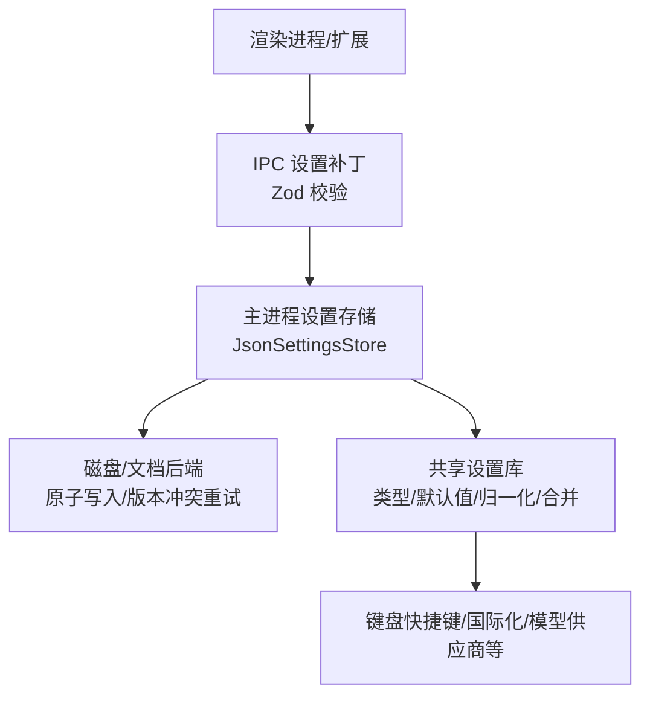
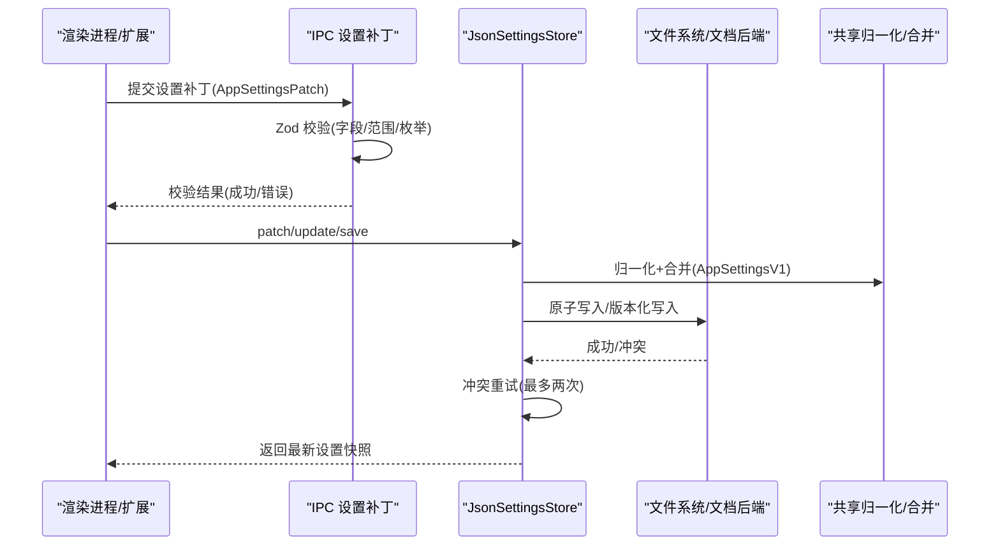
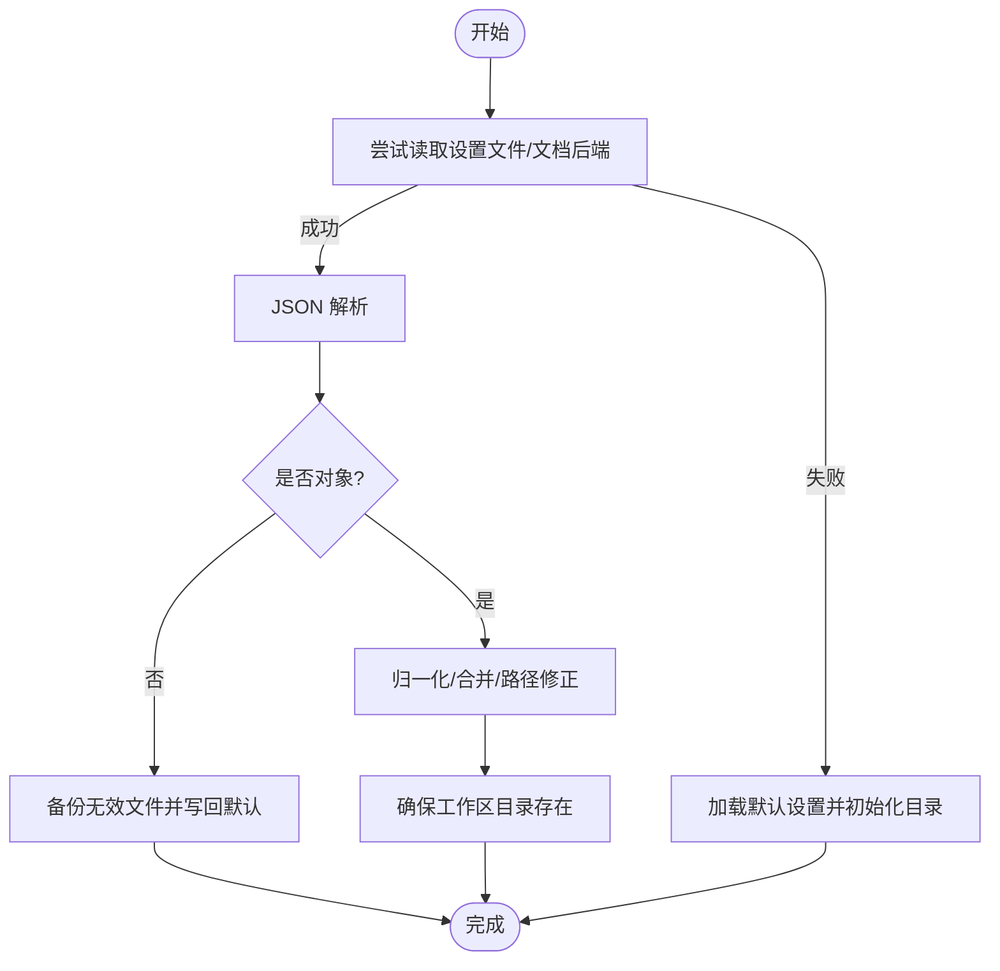
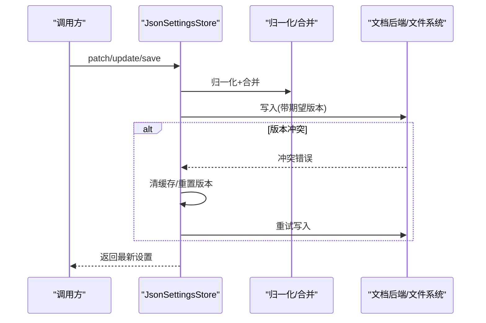
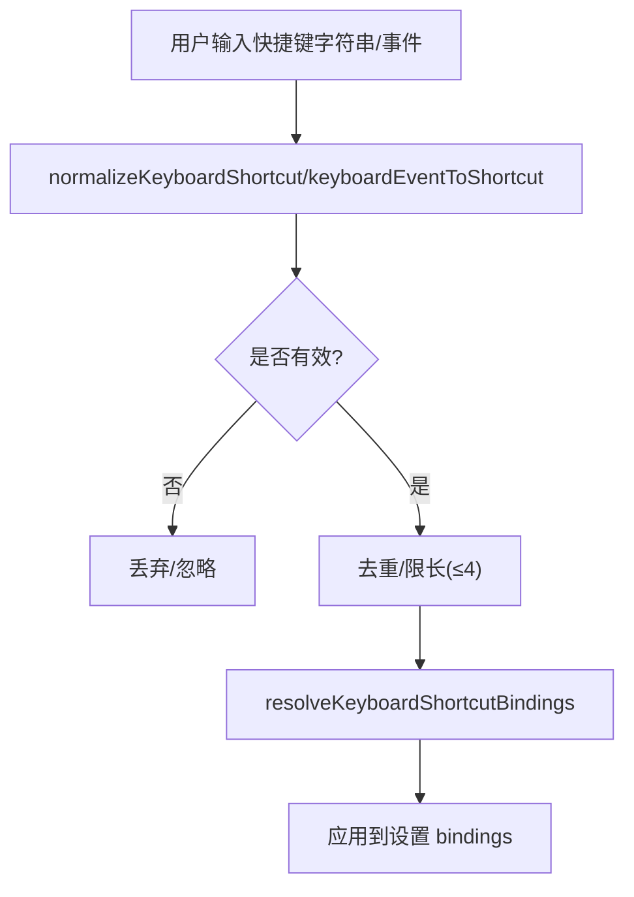
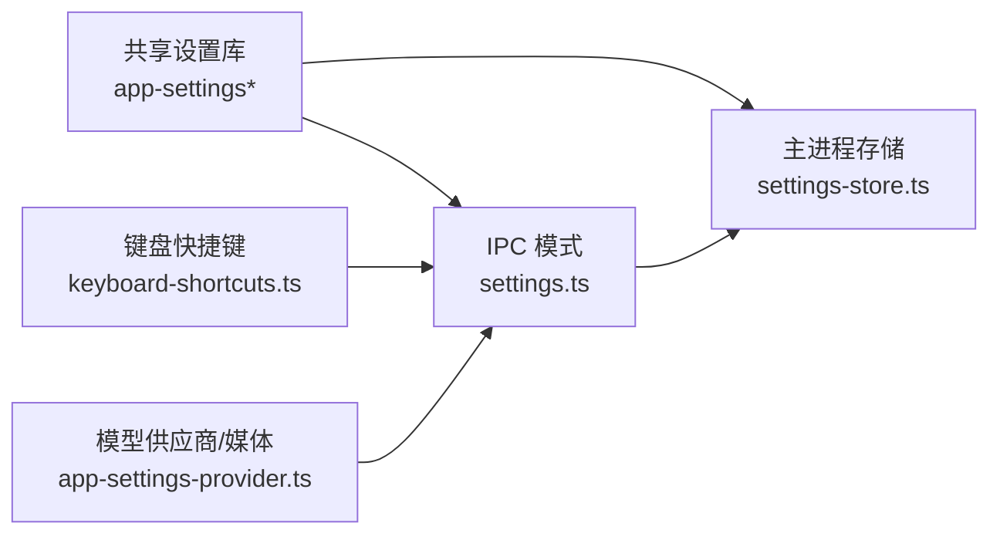

# 应用设置接口

<cite>
**本文引用的文件**
- [src/shared/app-settings.ts](file://src/shared/app-settings.ts)
- [src/shared/app-settings-types.ts](file://src/shared/app-settings-types.ts)
- [src/shared/app-settings-provider.ts](file://src/shared/app-settings-provider.ts)
- [src/shared/keyboard-shortcuts.ts](file://src/shared/keyboard-shortcuts.ts)
- [src/main/settings-store.ts](file://src/main/settings-store.ts)
- [src/main/ipc/app-ipc-schemas/settings.ts](file://src/main/ipc/app-ipc-schemas/settings.ts)
</cite>

## 目录
1. [简介](#简介)
2. [项目结构](#项目结构)
3. [核心组件](#核心组件)
4. [架构总览](#架构总览)
5. [详细组件分析](#详细组件分析)
6. [依赖关系分析](#依赖关系分析)
7. [性能考虑](#性能考虑)
8. [故障排查指南](#故障排查指南)
9. [结论](#结论)
10. [附录](#附录)

## 简介
本文件面向 DeepSeek-GUI 的“全局应用设置”能力，系统化说明设置的读取、写入与监听机制；覆盖用户偏好、界面配置、主题、国际化、键盘快捷键、工作区路径、模型供应商、Kun 运行时、Claw（IM）、计划任务、工作流、设计器、终端等设置域；解释默认值处理、校验规则、持久化存储与变更事件通知机制，并提供使用示例。

## 项目结构
DeepSeek-GUI 的设置体系由“共享类型与归一化逻辑 + IPC 模式定义 + 主进程存储实现”三部分构成：
- 共享层：定义设置类型、默认值、归一化与合并策略，以及键盘快捷键等通用能力。
- IPC 层：以 Zod Schema 严格约束前端传入的设置补丁，保证跨进程数据契约一致。
- 主进程层：提供 JsonSettingsStore 负责加载、校验、迁移、持久化与并发安全更新。

图表来源
- [src/main/settings-store.ts:470-783](file://src/main/settings-store.ts#L470-L783)
- [src/main/ipc/app-ipc-schemas/settings.ts:1373-1409](file://src/main/ipc/app-ipc-schemas/settings.ts#L1373-L1409)
- [src/shared/app-settings.ts:1-19](file://src/shared/app-settings.ts#L1-L19)

章节来源
- [src/shared/app-settings.ts:1-19](file://src/shared/app-settings.ts#L1-L19)
- [src/main/settings-store.ts:470-783](file://src/main/settings-store.ts#L470-L783)
- [src/main/ipc/app-ipc-schemas/settings.ts:1373-1409](file://src/main/ipc/app-ipc-schemas/settings.ts#L1373-L1409)

## 核心组件
- 设置类型与默认值
  - 统一导出入口聚合了国际化、类型、提供者、Kun、图、提示词、归一化、计划、工作流、Claw、写入、设计、终端、键盘快捷键等模块。
  - 类型与常量集中定义在类型文件中，包含 UI 缩放、聊天宽度、发送键、日志保留、检查点清理、模型供应商、媒体协议、端口范围等。
- 设置提供者与合并
  - 提供默认模型供应商、代理、路由池、能力探测、模型列表、协议解析等工具函数，支持增量合并与投影到可执行配置。
- IPC 设置模式
  - 通过 Zod 严格定义所有可更新的设置字段与取值范围，包括 locale、theme、uiFontScale、chatContentMaxWidthPx、composerSendKey、provider、agents.kun、workspaceRoot、conversationWorkspaceRoot、log、checkpointCleanup、notifications、appBehavior、keyboardShortcuts、write、claw、schedule、workflow、design、terminal、guiUpdate、codePromptPrefix、disabledSkillIds 等。
- 主进程设置存储
  - JsonSettingsStore 负责：
    - 加载：从兼容路径读取 JSON，失败时回退到默认并备份无效文件。
    - 归一化：调用共享层的归一化与合并逻辑，确保路径、工作区、Claw 通道与工作区根目录合法。
    - 持久化：原子写入或基于文档后端的版本化写入，支持冲突重试。
    - 迁移：检测并迁移旧版明文凭据至受保护存储，必要时创建备份与修复刷新令牌。
    - 并发：操作排队与 revision 冲突重试，避免竞态。

章节来源
- [src/shared/app-settings.ts:1-19](file://src/shared/app-settings.ts#L1-L19)
- [src/shared/app-settings-types.ts:48-200](file://src/shared/app-settings-types.ts#L48-L200)
- [src/shared/app-settings-provider.ts:106-179](file://src/shared/app-settings-provider.ts#L106-L179)
- [src/main/ipc/app-ipc-schemas/settings.ts:49-520](file://src/main/ipc/app-ipc-schemas/settings.ts#L49-L520)
- [src/main/settings-store.ts:254-305](file://src/main/settings-store.ts#L254-L305)
- [src/main/settings-store.ts:438-468](file://src/main/settings-store.ts#L438-L468)
- [src/main/settings-store.ts:470-783](file://src/main/settings-store.ts#L470-L783)

## 架构总览
设置生命周期分为“读取 → 归一化/合并 → 持久化 → 变更传播”。IPC 层作为边界进行强校验；主进程层负责安全与一致性；共享层提供领域知识与默认值。

图表来源
- [src/main/ipc/app-ipc-schemas/settings.ts:1373-1409](file://src/main/ipc/app-ipc-schemas/settings.ts#L1373-L1409)
- [src/main/settings-store.ts:645-713](file://src/main/settings-store.ts#L645-L713)
- [src/main/settings-store.ts:769-783](file://src/main/settings-store.ts#L769-L783)

## 详细组件分析

### 设置读取与默认值
- 首次启动或无配置文件时，生成完整默认设置，并确保工作区目录存在。
- 读取兼容路径集合，若 JSON 非法则自动备份并替换为默认值。
- 对存储中的路径、工作区、Claw 通道与对话工作区进行规范化，保证绝对路径与平台约定一致。

图表来源
- [src/main/settings-store.ts:420-441](file://src/main/settings-store.ts#L420-L441)
- [src/main/settings-store.ts:487-597](file://src/main/settings-store.ts#L487-L597)
- [src/main/settings-store.ts:193-227](file://src/main/settings-store.ts#L193-L227)

章节来源
- [src/main/settings-store.ts:254-305](file://src/main/settings-store.ts#L254-L305)
- [src/main/settings-store.ts:487-597](file://src/main/settings-store.ts#L487-L597)

### 设置写入与并发安全
- 支持三种写入方式：
  - save(data): 直接保存完整设置。
  - patch(partial): 增量补丁，内部调用 applySettingsPatchToSnapshot 合并。
  - update(mutation): 原子更新，先读当前快照再计算新值，遇到版本冲突自动重试。
- 写入前再次归一化，并在需要时触发凭据迁移与备份。
- 持久化采用原子写入或带 revision 的文档后端写入，冲突时清空缓存并重试。

图表来源
- [src/main/settings-store.ts:599-643](file://src/main/settings-store.ts#L599-L643)
- [src/main/settings-store.ts:645-713](file://src/main/settings-store.ts#L645-L713)
- [src/main/settings-store.ts:769-783](file://src/main/settings-store.ts#L769-L783)

章节来源
- [src/main/settings-store.ts:599-713](file://src/main/settings-store.ts#L599-L713)

### 设置变更的事件通知机制
- 当前仓库未暴露统一的“设置变更事件总线”给渲染进程或扩展。典型做法是在上层服务中订阅设置快照变化，或在 IPC 层广播变更。
- 建议实践：
  - 在渲染进程侧，每次收到 patch/update/save 返回值后，主动刷新本地状态与 UI。
  - 在主进程侧，可在设置持久化成功后派发内部事件，供其他服务（如窗口行为、通知、Kun 运行时）响应。
  - 若需跨进程通知，可在 IPC 层新增“settings:changed”消息，携带变更片段或全量快照。

[本节为概念性说明，不直接分析具体文件]

### 设置类型与校验规则
- 国际化与界面
  - locale: 限定为支持的地区枚举。
  - theme: system/light/dark。
  - uiFontScale: 数值范围或历史枚举映射。
  - chatContentMaxWidthPx: 像素范围且对齐到 8px。
  - composerSendKey: enter 或 shiftEnter。
  - cursorSpotlight/cursorSpotlightColor: 布尔与十六进制颜色。
- 模型供应商与 Kun 运行时
  - provider: apiKey/baseUrl/proxy/providers/routePools/localGateway，含模型能力、重试策略、服务等级、端点格式等。
  - agents.kun: 二进制路径、端口、自动启动、API Key/BaseUrl、审批策略、沙箱模式、MCP 搜索、上下文压缩、运行时调优、图像/语音/音乐/视频生成、浏览器使用、质量检查、子代理、Graph、Lab 等。
- 工作区与日志
  - workspaceRoot/conversationWorkspaceRoot: 路径规范化与平台默认。
  - log.enabled/log.retentionDays: 开关与保留天数。
  - checkpointCleanup: 创建/清理开关、间隔、目录、每线程上限。
  - gitBranchPrefix: Git 分支前缀。
- 通知与应用行为
  - notifications.turnComplete/mainAgentTurnComplete/subagentTurnComplete。
  - appBehavior.openAtLogin/startMinimized/closeAction/closeToTray。
- 键盘快捷键
  - keyboardShortcuts.bindings: 命令 ID 到按键组合数组的映射，限制命令集与长度。
- 写入、Claw、计划、工作流、设计、终端、GUI 更新
  - write: 工作区、自动保存、内联补全、选择辅助、排版、智能体预设。
  - claw: IM 渠道、凭证、会话、任务、技能目录、工作区根。
  - schedule: 启用、工作区、提供商、模型、模式、技能、保活、内部端口/密钥、任务、守护进程。
  - workflow: 启用、工作区、提供商、模型、模式、Webhook、工作流节点与连接、钩子触发器等。
  - design: 品牌色、风格、系统预设、画布背景、视口、实时刷新等。
  - terminal: 颜色主题。
  - guiUpdate.channel: 更新通道。

章节来源
- [src/main/ipc/app-ipc-schemas/settings.ts:49-520](file://src/main/ipc/app-ipc-schemas/settings.ts#L49-L520)
- [src/main/ipc/app-ipc-schemas/settings.ts:522-823](file://src/main/ipc/app-ipc-schemas/settings.ts#L522-L823)
- [src/main/ipc/app-ipc-schemas/settings.ts:825-1291](file://src/main/ipc/app-ipc-schemas/settings.ts#L825-L1291)
- [src/main/ipc/app-ipc-schemas/settings.ts:1321-1409](file://src/main/ipc/app-ipc-schemas/settings.ts#L1321-L1409)
- [src/shared/app-settings-types.ts:48-200](file://src/shared/app-settings-types.ts#L48-L200)

### 键盘快捷键配置
- 命令定义与默认绑定
  - KEYBOARD_SHORTCUT_COMMANDS 定义了可用命令及其默认绑定，支持平台差异化默认。
- 归一化与解析
  - normalizeKeyboardShortcuts: 过滤非法命令与重复项，限制每个命令最多 4 个组合。
  - resolveKeyboardShortcutBindings: 根据平台与用户配置解析最终绑定。
  - normalizeKeyboardShortcut/keyboardEventToShortcut: 将字符串或键盘事件标准化为“修饰键+主键”格式。
  - findKeyboardShortcutCommand/findKeyboardShortcutConflict: 查找命令与冲突检测。

图表来源
- [src/shared/keyboard-shortcuts.ts:162-199](file://src/shared/keyboard-shortcuts.ts#L162-L199)
- [src/shared/keyboard-shortcuts.ts:218-295](file://src/shared/keyboard-shortcuts.ts#L218-L295)

章节来源
- [src/shared/keyboard-shortcuts.ts:10-138](file://src/shared/keyboard-shortcuts.ts#L10-L138)
- [src/shared/keyboard-shortcuts.ts:162-199](file://src/shared/keyboard-shortcuts.ts#L162-L199)
- [src/shared/keyboard-shortcuts.ts:218-295](file://src/shared/keyboard-shortcuts.ts#L218-L295)

### 国际化设置
- locale 字段用于切换界面语言，受 IPC 模式限制为支持的地区枚举。
- 结合渲染进程的 i18n 资源，切换 locale 后应重新加载对应文案。
- 建议在设置变更后立即刷新 UI 文本与布局。

章节来源
- [src/main/ipc/app-ipc-schemas/settings.ts:49-55](file://src/main/ipc/app-ipc-schemas/settings.ts#L49-L55)
- [src/main/ipc/app-ipc-schemas/settings.ts:1373-1409](file://src/main/ipc/app-ipc-schemas/settings.ts#L1373-L1409)

### 模型供应商与媒体能力
- 默认供应商与基础 URL、代理、路由池、健康/失败策略均受类型与归一化保护。
- 支持图像、语音转文字、文字转语音、音乐、视频等多模态能力，按协议与模型清单管理。
- 可通过 providers[].modelProfiles 为特定模型设定上下文窗口、输出 token、消息部件、推理深度、服务等级、端点格式等。

章节来源
- [src/shared/app-settings-provider.ts:106-179](file://src/shared/app-settings-provider.ts#L106-L179)
- [src/shared/app-settings-provider.ts:181-294](file://src/shared/app-settings-provider.ts#L181-L294)
- [src/shared/app-settings-types.ts:216-374](file://src/shared/app-settings-types.ts#L216-L374)

### 工作区与路径规范
- workspaceRoot 与 conversationWorkspaceRoot 支持 ~ 展开与平台默认路径。
- write.workspaces 与 active/default 工作区根会去重与规范化。
- Claw 通道与对话的工作区根按平台与凭证信息推导，确保目录存在。

章节来源
- [src/main/settings-store.ts:121-191](file://src/main/settings-store.ts#L121-L191)
- [src/main/settings-store.ts:193-227](file://src/main/settings-store.ts#L193-L227)
- [src/main/settings-store.ts:229-252](file://src/main/settings-store.ts#L229-L252)

### 凭据迁移与安全
- 检测到旧版明文 API Key 时，会在读取/写入阶段尝试迁移到受保护存储，并创建备份文件。
- 若受保护存储不可用，读取阶段可能仅保留兼容性设置但不重写；写入阶段会抛出明确错误以避免泄露明文。
- 支持从备份恢复可刷新 OAuth 凭据。

章节来源
- [src/main/settings-store.ts:307-397](file://src/main/settings-store.ts#L307-L397)
- [src/main/settings-store.ts:548-597](file://src/main/settings-store.ts#L548-L597)
- [src/main/settings-store.ts:612-643](file://src/main/settings-store.ts#L612-L643)
- [src/main/settings-store.ts:715-767](file://src/main/settings-store.ts#L715-L767)

## 依赖关系分析
- 主进程设置存储依赖共享设置库进行类型与默认值处理，并通过 IPC 模式与前端交互。
- 键盘快捷键、模型供应商、媒体协议等均在共享层定义，被 IPC 模式引用以保证前后端一致。
- 设置补丁通过 Zod 严格校验，任何未知字段将被拒绝，降低耦合风险。

图表来源
- [src/shared/app-settings.ts:1-19](file://src/shared/app-settings.ts#L1-L19)
- [src/main/ipc/app-ipc-schemas/settings.ts:1373-1409](file://src/main/ipc/app-ipc-schemas/settings.ts#L1373-L1409)
- [src/main/settings-store.ts:470-783](file://src/main/settings-store.ts#L470-L783)

章节来源
- [src/shared/app-settings.ts:1-19](file://src/shared/app-settings.ts#L1-L19)
- [src/main/ipc/app-ipc-schemas/settings.ts:1373-1409](file://src/main/ipc/app-ipc-schemas/settings.ts#L1373-L1409)
- [src/main/settings-store.ts:470-783](file://src/main/settings-store.ts#L470-L783)

## 性能考虑
- 设置读写采用原子写入与文档后端版本控制，减少损坏与竞争条件。
- 归一化与合并逻辑在内存中进行，避免频繁磁盘 IO。
- 工作区目录按需创建，避免启动阻塞。
- 键盘快捷键归一化限制长度与去重，防止异常配置影响性能。

[本节提供一般性指导，不直接分析具体文件]

## 故障排查指南
- 设置文件损坏
  - 现象：无法解析 JSON 或非对象。
  - 处理：自动备份为 .invalid-时间戳.json 并替换为默认设置。
  - 定位：查看日志中的备份路径与原因。
- 明文凭据迁移失败
  - 现象：写入时报错提示受保护存储不可用。
  - 处理：检查凭据迁移实现与权限，确认备份文件是否存在并可恢复。
- 版本冲突
  - 现象：文档后端返回冲突错误。
  - 处理：存储层会自动清缓存并重试一次；若仍失败，检查并发写入逻辑。
- 路径无效
  - 现象：工作区路径为空或非法。
  - 处理：归一化时会展开 ~ 并使用平台默认路径；检查用户输入与权限。

章节来源
- [src/main/settings-store.ts:399-418](file://src/main/settings-store.ts#L399-L418)
- [src/main/settings-store.ts:517-537](file://src/main/settings-store.ts#L517-L537)
- [src/main/settings-store.ts:688-713](file://src/main/settings-store.ts#L688-L713)
- [src/main/settings-store.ts:715-767](file://src/main/settings-store.ts#L715-L767)

## 结论
DeepSeek-GUI 的应用设置接口通过严格的 IPC 模式、健壮的归一化与合并逻辑、安全的持久化与迁移机制，提供了稳定可靠的全局设置管理能力。开发者可基于该接口安全地扩展新的设置域，同时保持向后兼容与数据一致性。对于事件通知，建议在上层服务中订阅设置快照变化或通过 IPC 广播变更，以实现 UI 与服务的即时响应。

## 附录
- 常用设置字段速查
  - 国际化与界面：locale、theme、uiFontScale、chatContentMaxWidthPx、composerSendKey、cursorSpotlight、cursorSpotlightColor。
  - 工作区与日志：workspaceRoot、conversationWorkspaceRoot、log.enabled、log.retentionDays、checkpointCleanup.*、gitBranchPrefix。
  - 通知与行为：notifications.*、appBehavior.*。
  - 键盘快捷键：keyboardShortcuts.bindings。
  - 模型与运行时：provider.*、agents.kun.*。
  - 写入/Claw/计划/工作流/设计/终端：write.*、claw.*、schedule.*、workflow.*、design.*、terminal.*。
  - GUI 更新：guiUpdate.channel。
- 使用示例
  - 修改主题与字体缩放
    - 通过 IPC 提交补丁 { theme: "dark", uiFontScale: 0.9 }，等待返回最新设置并刷新 UI。
  - 配置键盘快捷键
    - 提交补丁 { keyboardShortcuts: { bindings: { "new-chat": ["Ctrl+N"], "settings": ["Ctrl+,"] } } }，系统将归一化并持久化。
  - 设置国际化
    - 提交补丁 { locale: "zh-CN" }，随后在渲染进程切换语言资源。
  - 调整模型供应商
    - 提交补丁 { provider: { baseUrl: "...", providers: [...] } }，系统将归一化路由池与能力。
  - 配置工作区
    - 提交补丁 { workspaceRoot: "~/my-project", conversationWorkspaceRoot: "~/Documents/Kun" }，系统将确保目录存在。

[本节为概念性说明，不直接分析具体文件]