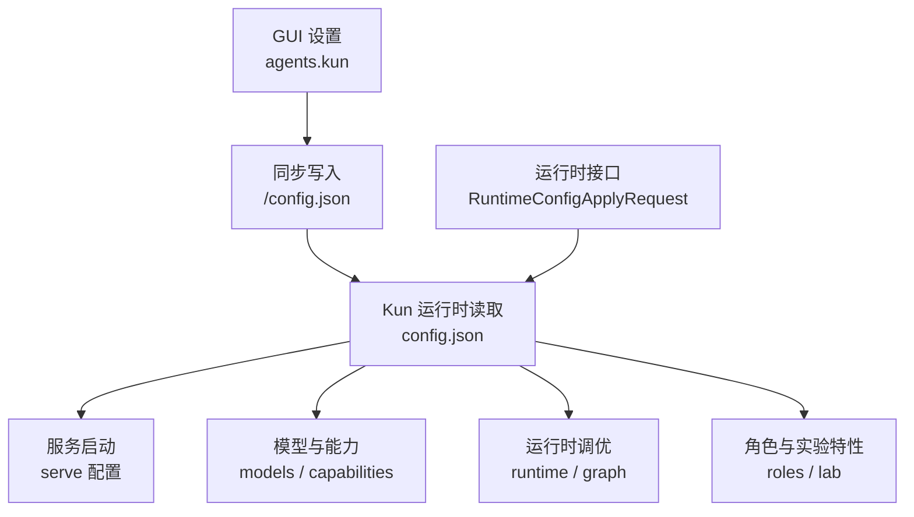
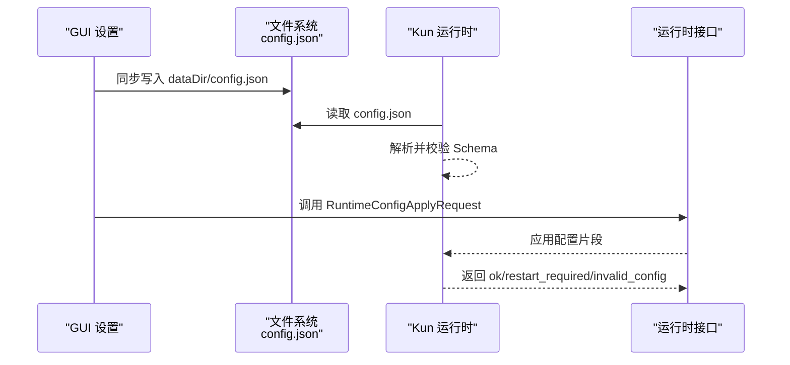
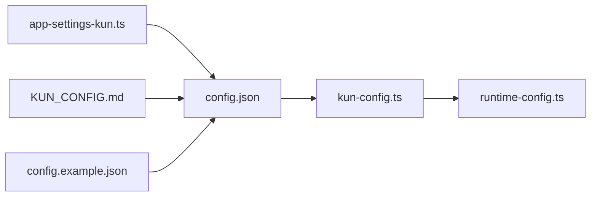

# 运行时配置接口

<cite>
**本文引用的文件**
- [kun-config.ts](file://kun/src/config/kun-config.ts)
- [runtime-config.ts](file://kun/src/contracts/runtime-config.ts)
- [KUN_CONFIG.md](file://docs/KUN_CONFIG.md)
- [config.example.json](file://kun/config.example.json)
- [app-settings-kun.ts](file://src/shared/app-settings-kun.ts)
</cite>

## 目录
1. [简介](#简介)
2. [项目结构](#项目结构)
3. [核心组件](#核心组件)
4. [架构总览](#架构总览)
5. [详细组件分析](#详细组件分析)
6. [依赖关系分析](#依赖关系分析)
7. [性能调优与资源限制](#性能调优与资源限制)
8. [故障排查指南](#故障排查指南)
9. [结论](#结论)
10. [附录：配置字段速查](#附录：配置字段速查)

## 简介
本文件面向 DeepSeek-GUI 的“运行时配置接口”，聚焦 Kun 运行时的配置选项、项目级配置文件格式、优先级与环境变量覆盖机制，以及性能调优相关的并发与内存控制。文档同时涵盖配置校验规则与错误处理机制，帮助你在 GUI 设置页、本地 config.json、CLI 参数与环境变量之间正确编排配置。

## 项目结构
- GUI 设置层：桌面应用通过 settings 管理 Agent 运行时基础项（端口、dataDir、默认模型、审批策略、sandbox、token economy 等）。
- 运行时配置层：Kun 本地运行时读取 `<dataDir>/config.json`，承载 serve、models、contextCompaction、runtime、graph、roles、hooks、quality、lab 等高级配置。
- 运行时接口层：提供运行时动态应用配置的请求/响应契约，支持热更新部分配置并返回是否需要重启或配置无效。

图表来源
- [KUN_CONFIG.md:6-43](file://docs/KUN_CONFIG.md#L6-L43)
- [kun-config.ts:677-690](file://kun/src/config/kun-config.ts#L677-L690)
- [runtime-config.ts:33-47](file://kun/src/contracts/runtime-config.ts#L33-L47)

章节来源
- [KUN_CONFIG.md:6-43](file://docs/KUN_CONFIG.md#L6-L43)
- [kun-config.ts:677-690](file://kun/src/config/kun-config.ts#L677-L690)
- [runtime-config.ts:33-47](file://kun/src/contracts/runtime-config.ts#L33-L47)

## 核心组件
- 运行时配置 Schema：定义 serve、models、contextCompaction、runtime、graph、roles、capabilities、hooks、quality、lab 等字段的类型与约束。
- 运行时应用接口：定义可热更新的配置片段与返回码（需要重启/配置无效）。
- GUI 设置合并器：将 GUI 设置与运行时配置进行规范化与合并，生成最终生效的配置。
- 示例配置：提供完整的 JSON 模板，便于快速上手。

章节来源
- [kun-config.ts:677-690](file://kun/src/config/kun-config.ts#L677-L690)
- [runtime-config.ts:33-47](file://kun/src/contracts/runtime-config.ts#L33-L47)
- [app-settings-kun.ts:156-200](file://src/shared/app-settings-kun.ts#L156-L200)
- [config.example.json:1-124](file://kun/config.example.json#L1-L124)

## 架构总览
下图展示从 GUI 到运行时配置加载与应用的整体流程，包括读取顺序、合并策略与运行时接口。

图表来源
- [KUN_CONFIG.md:35-43](file://docs/KUN_CONFIG.md#L35-L43)
- [kun-config.ts:709-731](file://kun/src/config/kun-config.ts#L709-L731)
- [runtime-config.ts:33-58](file://kun/src/contracts/runtime-config.ts#L33-L58)

## 详细组件分析

### 项目级配置文件：config.json
- 位置与命名：位于 `<dataDir>/config.json`；可通过 `kun serve --config <path>` 显式指定。
- 顶层字段：
  - serve：服务与连接相关（host/port/dataDir/runtimeToken/apiKey/baseUrl/model 等）
  - models：模型画像与上下文压缩阈值
  - contextCompaction：全局摘要与兜底阈值
  - runtime：流式空闲超时、工具风暴、回合限制、调试捕获、参数修复等
  - graph：图模式调度、邮箱、监督、写隔离、路由、学习、保留策略
  - roles：内部小模型角色路由（标题、摘要、代码审查）
  - capabilities：MCP/Web/Skills/Subagents/Attachments/Memory/ComputerUse 等能力开关
  - hooks：生命周期钩子
  - quality：设计质量检查
  - lab：实验特性（如 exploreAgent）
- 示例参考：见示例配置中的完整结构。

章节来源
- [KUN_CONFIG.md:19-43](file://docs/KUN_CONFIG.md#L19-L43)
- [kun-config.ts:677-690](file://kun/src/config/kun-config.ts#L677-L690)
- [config.example.json:1-124](file://kun/config.example.json#L1-L124)

### 运行时配置应用接口：RuntimeConfigApplyRequest
- 作用：在不重启进程的情况下，动态应用部分配置（如 serve、models、contextCompaction、runtime、graph、roles、capabilities、hooks、quality、lab），并可选择 modelSelection 切换当前会话使用的 providerId/accountId/model。
- 返回：
  - ok: true：应用成功
  - ok: false, code: restart_required：需要重启才能生效
  - ok: false, code: invalid_config：配置校验失败，附带 message
- 注意：该接口会剔除 host/port/dataDir/runtimeToken/insecure/storage 等启动期字段，避免运行时非法变更。

章节来源
- [runtime-config.ts:16-58](file://kun/src/contracts/runtime-config.ts#L16-L58)

### GUI 设置与运行时配置的映射
- GUI 设置中 agents.kun 下的字段（端口、dataDir、默认模型、审批策略、sandbox、token economy、存储、上下文压缩、运行时调优、能力开关等）会被规范化并同步到 `<dataDir>/config.json`。
- GUI 还会维护模型画像、MCP 搜索、附件能力、浏览器使用、计算机使用、图像/语音/视频生成等能力的默认值与合并逻辑。

章节来源
- [KUN_CONFIG.md:6-43](file://docs/KUN_CONFIG.md#L6-L43)
- [app-settings-kun.ts:156-200](file://src/shared/app-settings-kun.ts#L156-L200)
- [app-settings-kun.ts:466-715](file://src/shared/app-settings-kun.ts#L466-L715)

### 配置优先级与环境变量覆盖
- 启动时读取顺序：
  1) GUI 读取 kun-settings.json（旧版 deepseek-gui-settings.json 自动迁移）
  2) GUI 在启动前同步 `<dataDir>/config.json`，写入 UI 管理的 token economy、默认压缩摘要参数、默认模型 profiles、runtime tuning、MCP search、附件能力
  3) Kun serve 读取 `<dataDir>/config.json` 或 `--config` 指定的文件
  4) CLI 参数与环境变量覆盖 serve 的基础启动字段（例如 --model、--port、KUN_MODEL、KUN_PORT）
  5) AgentLoop、review loop、子 Agent 均从同一份模型配置加载能力与阈值
- 环境变量覆盖：
  - 明确支持的 serve 基础字段覆盖：--model、--port、KUN_MODEL、KUN_PORT
  - 其他模块的环境变量（如 Gemini Code Assist、浏览器桥接等）按各自实现读取，但不影响 serve 基础字段优先级

章节来源
- [KUN_CONFIG.md:35-43](file://docs/KUN_CONFIG.md#L35-L43)

### 配置验证与错误处理
- 使用 Zod Schema 严格校验所有配置段，缺失必填字段、类型不匹配、范围越界都会报错。
- 常见校验点：
  - URL 必须为 http/https
  - 数值范围限制（如最大尝试次数、超时毫秒数、并发上限）
  - 字段间一致性（如 hardThreshold >= softThreshold）
  - 特定模式组合（如 defaultStrategy=graph 时 graph.enabled 必须为真）
- 兼容性与迁移：
  - 对历史 provider kind 做向后兼容改写
  - 向前兼容：未知能力片段被忽略，仅关键 serve 段严格校验
- 错误信息：
  - 解析失败抛出包含路径的错误消息
  - 运行时接口返回 invalid_config 并提供 message

章节来源
- [kun-config.ts:50-75](file://kun/src/config/kun-config.ts#L50-L75)
- [kun-config.ts:145-175](file://kun/src/config/kun-config.ts#L145-L175)
- [kun-config.ts:217-342](file://kun/src/config/kun-config.ts#L217-L342)
- [kun-config.ts:709-731](file://kun/src/config/kun-config.ts#L709-L731)
- [runtime-config.ts:49-58](file://kun/src/contracts/runtime-config.ts#L49-L58)

## 依赖关系分析
- 配置 Schema 集中在 kun-config.ts，被 contracts/runtime-config.ts 引用以构建运行时应用接口。
- GUI 设置合并逻辑在 app-settings-kun.ts，负责将 GUI 设置规范化并写入 config.json。
- 文档 KUN_CONFIG.md 描述读取顺序、推荐结构与迁移策略。
- 示例配置 config.example.json 提供完整字段参考。

图表来源
- [app-settings-kun.ts:156-200](file://src/shared/app-settings-kun.ts#L156-L200)
- [kun-config.ts:677-690](file://kun/src/config/kun-config.ts#L677-L690)
- [runtime-config.ts:33-47](file://kun/src/contracts/runtime-config.ts#L33-L47)
- [KUN_CONFIG.md:6-43](file://docs/KUN_CONFIG.md#L6-L43)
- [config.example.json:1-124](file://kun/config.example.json#L1-L124)

章节来源
- [app-settings-kun.ts:156-200](file://src/shared/app-settings-kun.ts#L156-L200)
- [kun-config.ts:677-690](file://kun/src/config/kun-config.ts#L677-L690)
- [runtime-config.ts:33-47](file://kun/src/contracts/runtime-config.ts#L33-L47)
- [KUN_CONFIG.md:6-43](file://docs/KUN_CONFIG.md#L6-L43)
- [config.example.json:1-124](file://kun/config.example.json#L1-L124)

## 性能调优与资源限制
- 流式空闲超时：streamIdleTimeoutMs 控制流式分片间的最大空闲间隔，防止长预填充导致假死；设为 0 可禁用保护。
- 工具风暴防护：toolStorm.enabled 启用后增强对工具调用风暴的限制。
- 回合限制：turnLimits.maxSteps、maxWallTimeMs、maxToolCallsPerStep、maxConcurrentTurns 限制单回合步骤、总耗时、每步工具调用数与全局并发回合数。
- LLM 调试捕获：llmDebug.enabled 与 defaultThreadCaptureEnabled 控制敏感线程内容捕获。
- 工具参数修复：toolArgumentRepair.maxStringBytes 限制字符串参数大小。
- 图模式资源：scheduler 的节点/边/并发/重试/轮次/时间/令牌/产物字节上限；mailbox 的消息数量与 TTL；supervision 的监督与人工介入；writeIsolation 的写隔离模式与租约；routing 召回与置信度阈值；learning 的学习模式与保留策略；retention 的数据保留天数与快照频率。
- Token 经济与历史卫生：compressToolDescriptions/Results、conciseResponses、historyHygiene 的 lines/bytes/tokens/arrayItems 限制。
- 存储后端：storage.backend 选择 hybrid/file，sqlitePath 可选。

章节来源
- [kun-config.ts:177-215](file://kun/src/config/kun-config.ts#L177-L215)
- [kun-config.ts:217-342](file://kun/src/config/kun-config.ts#L217-L342)
- [kun-config.ts:440-471](file://kun/src/config/kun-config.ts#L440-L471)
- [kun-config.ts:473-497](file://kun/src/config/kun-config.ts#L473-L497)
- [config.example.json:13-30](file://kun/config.example.json#L13-L30)

## 故障排查指南
- 配置解析失败：检查 JSON 语法与字段类型；关注 Zod 错误中的路径与消息。
- 需要重启：当修改了启动期字段或某些运行时无法热更的配置时，接口会返回 restart_required。
- 配置无效：根据 invalid_config 的 message 定位问题字段。
- 流式超时：若本地 LLM 预填充较长，适当增大 streamIdleTimeoutMs 或临时关闭保护。
- 工具风暴：开启 toolStorm 并调整 toolArgumentRepair 限制。
- 并发与内存：降低 maxConcurrentTurns、maxNodeWallTimeMs、maxArtifactBytes 等，缓解资源压力。
- 兼容性：如遇旧 provider kind，系统会自动迁移；若仍报错，检查是否混用了新旧配置位置。

章节来源
- [kun-config.ts:709-731](file://kun/src/config/kun-config.ts#L709-L731)
- [runtime-config.ts:49-58](file://kun/src/contracts/runtime-config.ts#L49-L58)
- [kun-config.ts:177-215](file://kun/src/config/kun-config.ts#L177-L215)
- [kun-config.ts:217-342](file://kun/src/config/kun-config.ts#L217-L342)

## 结论
DeepSeek-GUI 的运行时配置体系通过 GUI 设置、本地 config.json、CLI 与环境变量分层协作，配合严格的 Schema 校验与运行时接口，实现了灵活且安全的配置管理。建议优先通过 GUI 设置管理常用项，仅在必要时手工编辑 config.json，并结合性能调优字段保障稳定性与吞吐。

## 附录：配置字段速查
- serve：host、port、dataDir、runtimeToken、apiKey、baseUrl、endpointFormat、retry、model、approvalPolicy、sandboxMode、headers、providers、routePools、localModelGateway
- models.profiles：aliases、contextWindowTokens、contextCompaction（soft/hard threshold 或 ratio）、inputModalities、outputModalities、supportsToolCalling、messageParts、reasoning、serviceTiers、endpointFormat、responsesMode
- contextCompaction：defaultSoftThreshold、defaultHardThreshold、summaryMode、summaryTimeoutMs、summaryMaxTokens、summaryInputMaxBytes、modelProfiles
- runtime：streamIdleTimeoutMs、toolStorm.enabled、turnLimits.*、llmDebug.*、toolArgumentRepair.*
- graph：enabled、defaultStrategy、rolloutStage、workerModel、scheduler、context、mailbox、supervision、writeIsolation、routing、learning、retention
- roles：small/title/summary/codeReview 的 model、providerId、accountId 及 reasoningEffort
- capabilities：mcp/web/skills/subagents/attachments/memory/imageGen/speechGen/musicGen/videoGen/computerUse
- hooks：phase、matcher、command、timeoutMs
- quality：enabled、strictness、ignoreRules、ignoreFiles、maxFindings
- lab：exploreAgent.enabled、model、providerId、reasoningEffort、fast

章节来源
- [kun-config.ts:145-175](file://kun/src/config/kun-config.ts#L145-L175)
- [kun-config.ts:177-215](file://kun/src/config/kun-config.ts#L177-L215)
- [kun-config.ts:217-342](file://kun/src/config/kun-config.ts#L217-L342)
- [kun-config.ts:617-675](file://kun/src/config/kun-config.ts#L617-L675)
- [config.example.json:32-124](file://kun/config.example.json#L32-L124)