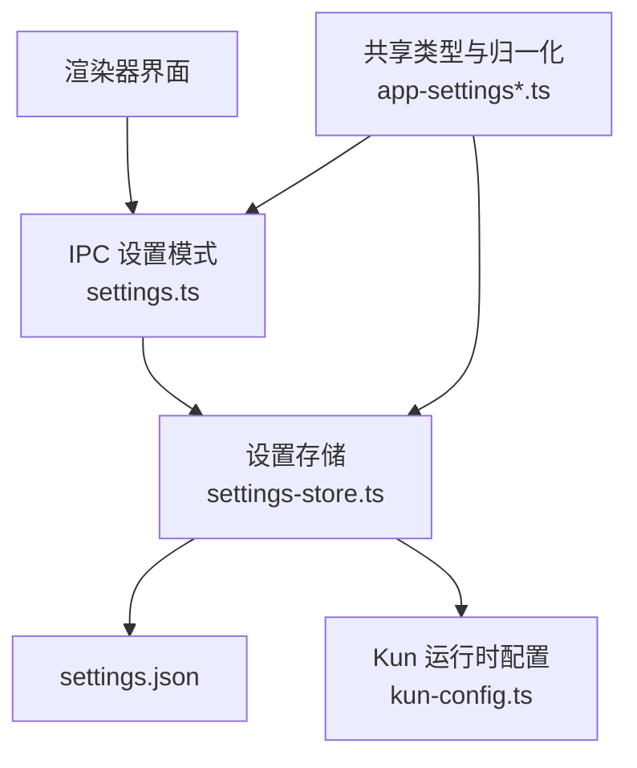
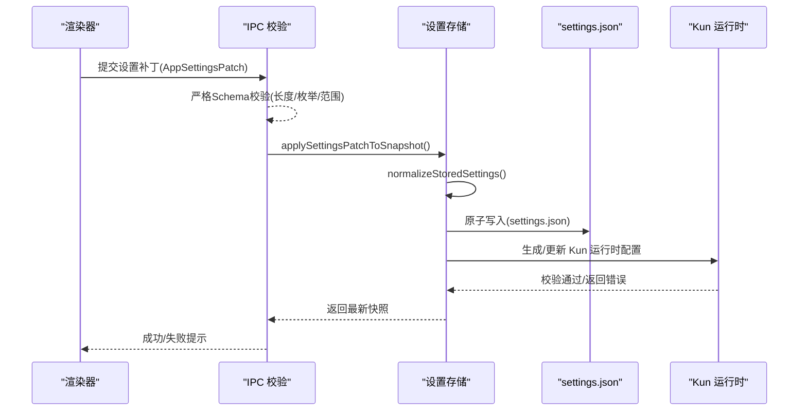
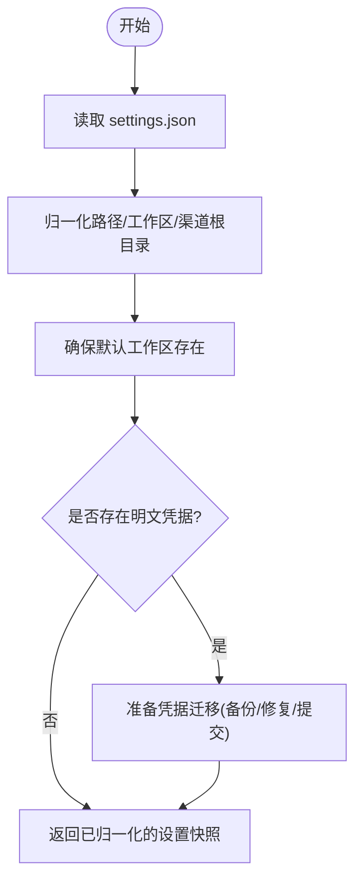
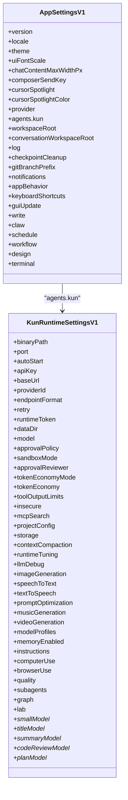
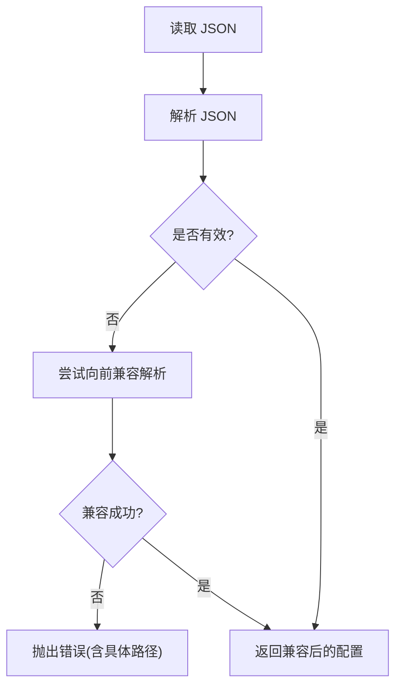
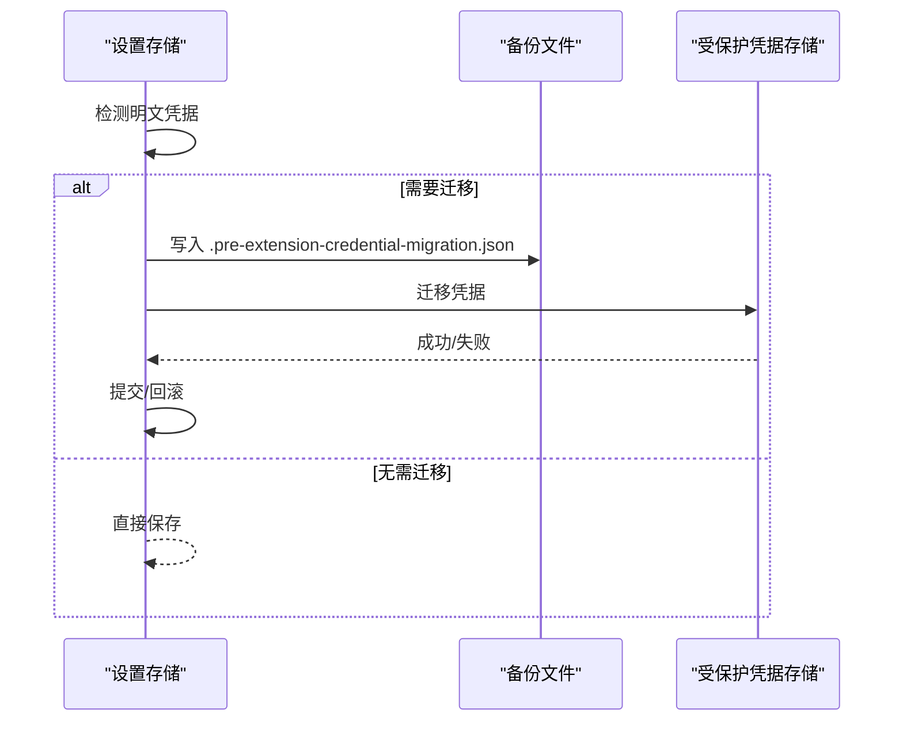
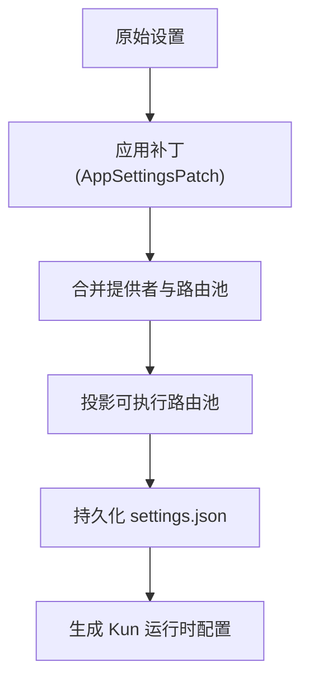
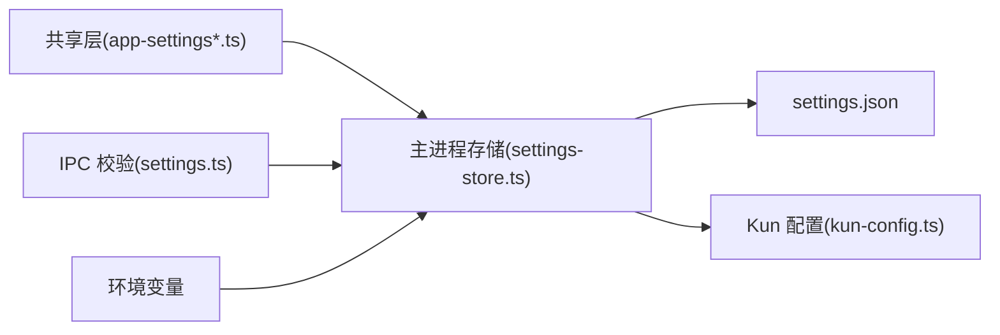

# 配置接口

<cite>
**本文引用的文件**
- [src/shared/app-settings.ts](file://src/shared/app-settings.ts)
- [src/shared/app-settings-types.ts](file://src/shared/app-settings-types.ts)
- [src/shared/app-settings-provider.ts](file://src/shared/app-settings-provider.ts)
- [src/main/settings-store.ts](file://src/main/settings-store.ts)
- [src/main/ipc/app-ipc-schemas/settings.ts](file://src/main/ipc/app-ipc-schemas/settings.ts)
- [kun/src/config/kun-config.ts](file://kun/src/config/kun-config.ts)
</cite>

## 目录
1. [简介](#简介)
2. [项目结构](#项目结构)
3. [核心组件](#核心组件)
4. [架构总览](#架构总览)
5. [详细组件分析](#详细组件分析)
6. [依赖关系分析](#依赖关系分析)
7. [性能与调优](#性能与调优)
8. [故障排查指南](#故障排查指南)
9. [结论](#结论)
10. [附录：模板、最佳实践与迁移](#附录模板最佳实践与迁移)

## 简介
本文件为 DeepSeek-GUI 的配置系统提供完整的 API 文档，覆盖以下方面：
- 应用设置接口：全局配置、用户偏好与环境变量
- 运行时配置选项：Agent 参数、工具设置、性能调优
- 项目配置文件格式：JSON/YAML 语法约定、字段定义与校验规则
- 配置迁移指南：版本升级时的兼容与变更处理
- 配置验证机制：默认值、约束检查与错误提示
- 配置模板与最佳实践示例
- 配置的优先级与覆盖规则

## 项目结构
DeepSeek-GUI 的配置体系由“共享类型/归一化”、“主进程存储与持久化”、“IPC 输入校验”和“Kun 运行时配置”四部分组成：
- 共享层（shared）：定义统一的类型、默认值、归一化与合并逻辑，供渲染器与主进程共用
- 主进程（main）：负责读取/写入 settings.json、路径规范化、工作区初始化、凭据迁移与原子写入
- IPC 层（main/ipc/schemas）：对前端传入的设置补丁进行严格校验，防止非法或越界数据进入持久化层
- Kun 运行时（kun/config）：定义并校验 Kun 的 config.json，包括模型路由、上下文压缩、能力开关、可观测性等

**图示来源**
- [src/main/ipc/app-ipc-schemas/settings.ts:1-120](file://src/main/ipc/app-ipc-schemas/settings.ts#L1-L120)
- [src/main/settings-store.ts:470-643](file://src/main/settings-store.ts#L470-L643)
- [src/shared/app-settings-provider.ts:106-179](file://src/shared/app-settings-provider.ts#L106-L179)
- [kun/src/config/kun-config.ts:677-690](file://kun/src/config/kun-config.ts#L677-L690)

**章节来源**
- [src/shared/app-settings.ts:1-19](file://src/shared/app-settings.ts#L1-L19)
- [src/main/settings-store.ts:470-643](file://src/main/settings-store.ts#L470-L643)
- [src/main/ipc/app-ipc-schemas/settings.ts:1-120](file://src/main/ipc/app-ipc-schemas/settings.ts#L1-L120)
- [kun/src/config/kun-config.ts:677-690](file://kun/src/config/kun-config.ts#L677-L690)

## 核心组件
- 共享类型与默认值：集中定义所有配置项的类型、枚举、默认值与边界常量
- 提供者与归一化：将用户意图映射到可执行配置，合并补丁、规范化 URL/代理/协议等
- 设置存储：加载、合并、持久化 settings.json，处理路径与工作区、凭据迁移与原子写入
- IPC 校验：对前端传入的补丁做严格 schema 校验，限制长度、范围与枚举
- Kun 配置：以 Zod Schema 校验 Kun 的 config.json，包含 serve、models、runtime、graph、roles、lab、hooks、quality 等

**章节来源**
- [src/shared/app-settings-types.ts:1-200](file://src/shared/app-settings-types.ts#L1-L200)
- [src/shared/app-settings-provider.ts:106-179](file://src/shared/app-settings-provider.ts#L106-L179)
- [src/main/settings-store.ts:254-305](file://src/main/settings-store.ts#L254-L305)
- [src/main/ipc/app-ipc-schemas/settings.ts:269-474](file://src/main/ipc/app-ipc-schemas/settings.ts#L269-L474)
- [kun/src/config/kun-config.ts:677-690](file://kun/src/config/kun-config.ts#L677-L690)

## 架构总览
下图展示从 UI 到持久化再到运行时的完整配置流。

**图示来源**
- [src/main/ipc/app-ipc-schemas/settings.ts:269-474](file://src/main/ipc/app-ipc-schemas/settings.ts#L269-L474)
- [src/main/settings-store.ts:438-468](file://src/main/settings-store.ts#L438-L468)
- [src/main/settings-store.ts:599-643](file://src/main/settings-store.ts#L599-L643)
- [kun/src/config/kun-config.ts:709-731](file://kun/src/config/kun-config.ts#L709-L731)

## 详细组件分析

### 应用设置接口（全局配置、用户偏好、环境变量）
- 全局配置
  - 语言、主题、字体缩放、聊天列宽、发送键、光标高亮色等
  - 日志保留天数、检查点清理策略、Git 分支前缀
  - GUI 更新通道
- 用户偏好
  - 快捷键绑定、Write 工作区、Claw IM、计划任务、工作流、设计质量、终端颜色等
- 环境变量
  - 开发期渲染器地址、浏览器自动化桥接相关环境变量在运行时被捕获并清理
  - 注意：这些环境变量用于运行时注入，不直接写入 settings.json

**图示来源**
- [src/main/settings-store.ts:193-227](file://src/main/settings-store.ts#L193-L227)
- [src/main/settings-store.ts:337-341](file://src/main/settings-store.ts#L337-L341)
- [src/main/settings-store.ts:548-596](file://src/main/settings-store.ts#L548-L596)

**章节来源**
- [src/main/settings-store.ts:254-298](file://src/main/settings-store.ts#L254-L298)
- [src/main/settings-store.ts:438-468](file://src/main/settings-store.ts#L438-L468)
- [src/main/settings-store.ts:599-643](file://src/main/settings-store.ts#L599-L643)

### 运行时配置选项（Agent 参数、工具设置、性能调优）
- Agent 参数
  - 二进制路径、端口、自动启动、API Key/BaseUrl/ProviderId/EndpointFormat
  - 审批策略、沙箱模式、审批人、Token 经济模式、工具输出限制
  - MCP 搜索、项目配置授权、存储后端、上下文压缩、运行时微调、LLM 调试
  - 图像/语音/音乐/视频生成、提示词优化、指令注入、计算机使用、浏览器自动化
  - 子代理、Graph 编排、实验特性 Lab
- 工具设置
  - 内置工具输出上限、请求历史净化、工具风暴防护、工具参数修复
- 性能调优
  - 并发度、超时、重试策略、健康检查、预算告警比例、消息队列与 TTL、学习/保留策略

**图示来源**
- [src/shared/app-settings-types.ts:625-728](file://src/shared/app-settings-types.ts#L625-L728)
- [src/shared/app-settings-types.ts:1-200](file://src/shared/app-settings-types.ts#L1-L200)

**章节来源**
- [src/shared/app-settings-types.ts:625-728](file://src/shared/app-settings-types.ts#L625-L728)
- [src/main/ipc/app-ipc-schemas/settings.ts:269-474](file://src/main/ipc/app-ipc-schemas/settings.ts#L269-L474)

### 项目配置文件格式（JSON/YAML 语法、字段定义、验证规则）
- 文件格式
  - settings.json：JSON 文本，支持 ~ 展开为用户主目录；保存采用原子写入
  - Kun config.json：JSON 文本，由 Kun 侧 Zod Schema 严格校验
- 字段定义
  - 见“运行时配置选项”与“应用设置接口”中的字段说明
- 验证规则
  - IPC 层对每个补丁字段进行长度、范围、枚举校验
  - Kun 配置使用 Zod Schema 进行强校验，包含自定义约束与跨字段校验
  - 旧版 provider kind 会进行向前兼容迁移

**图示来源**
- [kun/src/config/kun-config.ts:709-731](file://kun/src/config/kun-config.ts#L709-L731)
- [kun/src/config/kun-config.ts:739-757](file://kun/src/config/kun-config.ts#L739-L757)
- [kun/src/config/kun-config.ts:783-800](file://kun/src/config/kun-config.ts#L783-L800)

**章节来源**
- [kun/src/config/kun-config.ts:709-731](file://kun/src/config/kun-config.ts#L709-L731)
- [src/main/settings-store.ts:497-528](file://src/main/settings-store.ts#L497-L528)

### 配置迁移指南（版本升级时的配置变更处理）
- 凭据迁移
  - 检测到明文凭据时创建受保护的备份，并在可用时迁移至安全存储
  - 若迁移不可用，记录警告并回退到兼容模式
- 旧版 Provider Kind 迁移
  - 将历史 kind 值映射到当前枚举成员，保持向后兼容
- 运行时微调默认值迁移
  - 检测是否需要迁移 runtimeTuning 默认值并在必要时重写

**图示来源**
- [src/main/settings-store.ts:343-397](file://src/main/settings-store.ts#L343-L397)
- [src/main/settings-store.ts:548-596](file://src/main/settings-store.ts#L548-L596)
- [src/main/settings-store.ts:612-643](file://src/main/settings-store.ts#L612-L643)
- [kun/src/config/kun-config.ts:739-757](file://kun/src/config/kun-config.ts#L739-L757)

**章节来源**
- [src/main/settings-store.ts:343-397](file://src/main/settings-store.ts#L343-L397)
- [src/main/settings-store.ts:548-596](file://src/main/settings-store.ts#L548-L596)
- [src/main/settings-store.ts:612-643](file://src/main/settings-store.ts#L612-L643)
- [kun/src/config/kun-config.ts:739-757](file://kun/src/config/kun-config.ts#L739-L757)

### 配置验证机制（默认值、约束检查、错误提示）
- 默认值
  - 共享层提供大量默认值与边界常量（如端口、超时、重试次数、分辨率、质量等级等）
  - Kun 配置提供默认对象，缺失字段按默认填充
- 约束检查
  - IPC 层：字符串长度、数值范围、枚举白名单、数组大小限制
  - Kun 层：Zod Schema 的正则、范围、组合约束与 superRefine 跨字段校验
- 错误提示
  - Kun 配置解析失败时抛出包含具体路径的错误信息
  - 设置存储遇到无效 JSON 或非对象顶层值时，备份原文件并恢复默认设置

**章节来源**
- [src/shared/app-settings-types.ts:106-200](file://src/shared/app-settings-types.ts#L106-L200)
- [src/main/ipc/app-ipc-schemas/settings.ts:269-474](file://src/main/ipc/app-ipc-schemas/settings.ts#L269-L474)
- [kun/src/config/kun-config.ts:709-731](file://kun/src/config/kun-config.ts#L709-L731)
- [src/main/settings-store.ts:497-528](file://src/main/settings-store.ts#L497-L528)

### 配置模板与最佳实践示例
- 最小可用设置
  - 仅设置必要的 providerId、model、端口与存储后端，其余使用默认值
- 多提供商与路由池
  - 为不同提供商配置 modelProfiles，使用 routePools 实现负载均衡与健康检查
- 性能调优建议
  - 合理设置 maxConcurrentTurns、maxWallTimeMs、streamIdleTimeoutMs
  - 根据模型能力调整 contextWindowTokens、maxOutputTokens 与压缩阈值
- 安全与隐私
  - 避免在 settings.json 中保留明文凭据；启用凭据迁移
  - 谨慎开启 insecure 与 full-access 沙箱模式

[本节为通用指导，不直接引用具体代码文件]

### 配置的优先级与覆盖规则
- 补丁合并顺序
  - 先应用 Kun 运行时补丁，再合并 provider 与子模块（日志、检查点、通知、行为、快捷键、Write、Claw、计划、工作流、设计、终端、GUI 更新）
- 提供者与路由池
  - 提供者 ID 去重，目标模型与权重归一化；未生效的目标会被过滤
- 运行时投影
  - 不可用的目标引用不会进入运行时，保证运行期配置的可执行性

**图示来源**
- [src/main/settings-store.ts:438-468](file://src/main/settings-store.ts#L438-L468)
- [src/shared/app-settings-provider.ts:161-179](file://src/shared/app-settings-provider.ts#L161-L179)
- [src/shared/app-settings-provider.ts:194-256](file://src/shared/app-settings-provider.ts#L194-L256)
- [src/shared/app-settings-provider.ts:275-294](file://src/shared/app-settings-provider.ts#L275-L294)

**章节来源**
- [src/main/settings-store.ts:438-468](file://src/main/settings-store.ts#L438-L468)
- [src/shared/app-settings-provider.ts:161-179](file://src/shared/app-settings-provider.ts#L161-L179)
- [src/shared/app-settings-provider.ts:194-256](file://src/shared/app-settings-provider.ts#L194-L256)
- [src/shared/app-settings-provider.ts:275-294](file://src/shared/app-settings-provider.ts#L275-L294)

## 依赖关系分析
- 耦合与内聚
  - 共享层高度内聚，提供类型与归一化逻辑，降低主进程与 IPC 层的重复实现
  - 主进程存储依赖共享层进行归一化与合并，同时对接磁盘与可选的文档后端
  - Kun 配置独立于 GUI 设置，但通过运行时配置与 GUI 设置联动
- 外部依赖与集成点
  - 文件系统读写、原子写入、路径展开
  - 可选的受保护凭据存储与文档后端（用于并发与冲突处理）
  - 环境变量注入（浏览器自动化、开发服务器地址等）

**图示来源**
- [src/shared/app-settings-provider.ts:106-179](file://src/shared/app-settings-provider.ts#L106-L179)
- [src/main/settings-store.ts:470-643](file://src/main/settings-store.ts#L470-L643)
- [kun/src/config/kun-config.ts:677-690](file://kun/src/config/kun-config.ts#L677-L690)

**章节来源**
- [src/main/settings-store.ts:470-643](file://src/main/settings-store.ts#L470-L643)
- [src/shared/app-settings-provider.ts:106-179](file://src/shared/app-settings-provider.ts#L106-L179)
- [kun/src/config/kun-config.ts:677-690](file://kun/src/config/kun-config.ts#L677-L690)

## 性能与调优
- 并发与超时
  - 调整 maxConcurrentTurns、maxWallTimeMs、streamIdleTimeoutMs 以平衡吞吐与稳定性
- 重试与健康检查
  - 合理设置 retry.maxAttempts、initialDelayMs、httpStatusCodes
  - 配置 routePools 的健康策略（failureThreshold、cooldownMs、halfOpenMaxAttempts）
- 上下文压缩
  - 根据模型能力设置 soft/hard 阈值与 summaryMode，减少长对话开销
- 工具输出限制
  - 限制 toolOutputLimits 的 maxLines/maxBytes，避免大输出影响性能

[本节为通用指导，不直接引用具体代码文件]

## 故障排查指南
- 常见错误
  - 无效 JSON：自动备份并恢复默认设置
  - 非对象顶层值：同上
  - 明文凭据：迁移失败时会抛出错误并阻止写入
  - 路由池目标无效：投影阶段过滤，导致路由池禁用
- 定位方法
  - 查看 Kun 配置解析错误中的具体路径
  - 检查 settings.json 备份文件（.invalid-*.json 与 .pre-extension-credential-migration.json）
  - 确认环境变量是否正确注入且已被清理

**章节来源**
- [src/main/settings-store.ts:497-528](file://src/main/settings-store.ts#L497-L528)
- [src/main/settings-store.ts:548-596](file://src/main/settings-store.ts#L548-L596)
- [kun/src/config/kun-config.ts:709-731](file://kun/src/config/kun-config.ts#L709-L731)

## 结论
DeepSeek-GUI 的配置系统通过“共享类型 + 严格 IPC 校验 + 原子持久化 + Kun 运行时强校验”的分层设计，实现了安全、稳定、可扩展的配置管理。推荐在生产环境中启用凭据迁移、合理设置性能参数，并遵循最小可用原则与最佳实践。

[本节为总结，不直接引用具体代码文件]

## 附录：模板、最佳实践与迁移
- 模板
  - 最小 providers：仅包含一个提供商与必要模型
  - 路由池：为高可用场景配置多目标与失败策略
  - 运行时微调：针对长对话与高并发场景调整超时与并发
- 最佳实践
  - 使用 provider modelProfiles 声明模型能力，避免硬编码
  - 控制工具输出大小，启用请求历史净化
  - 定期清理检查点与日志，避免磁盘膨胀
- 迁移
  - 关注旧版 provider kind 的自动迁移
  - 留意 runtimeTuning 默认值迁移标志位
  - 在升级后检查路由池与模型引用是否仍有效

[本节为通用指导，不直接引用具体代码文件]