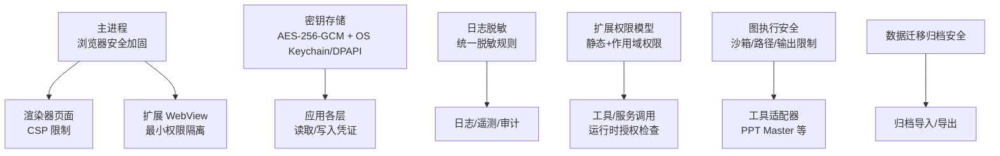
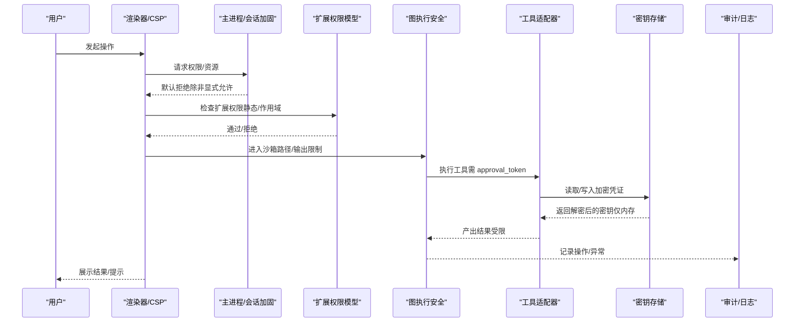
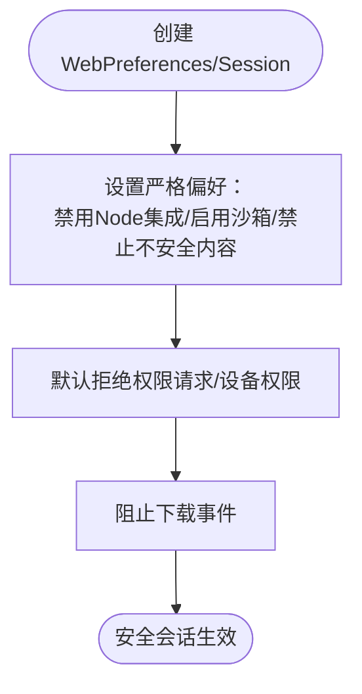
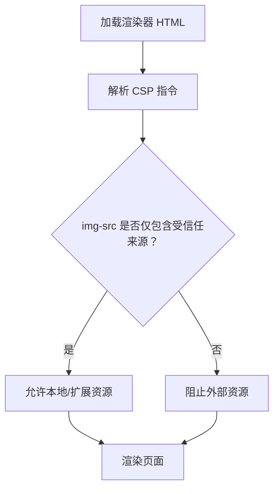
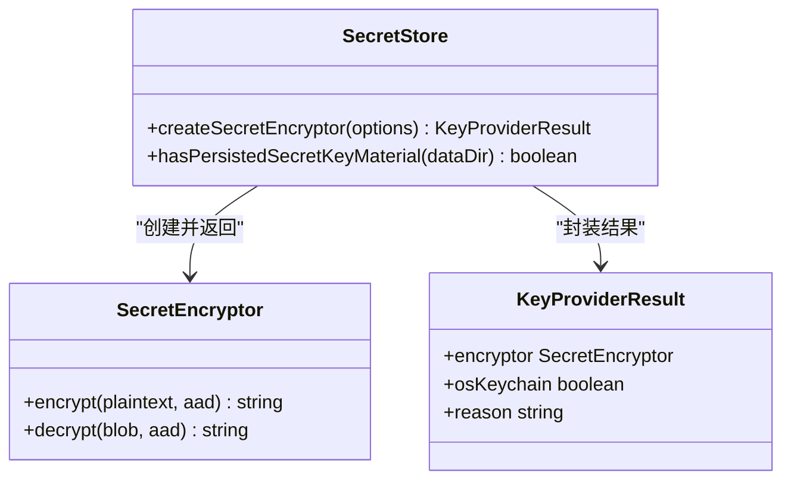
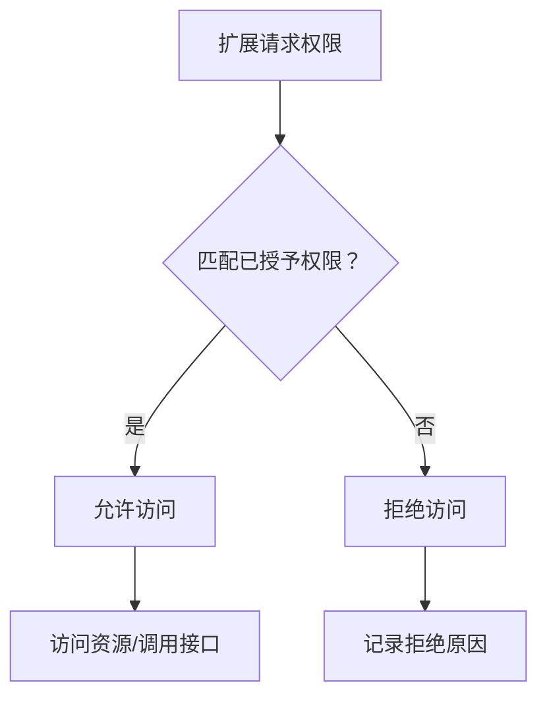
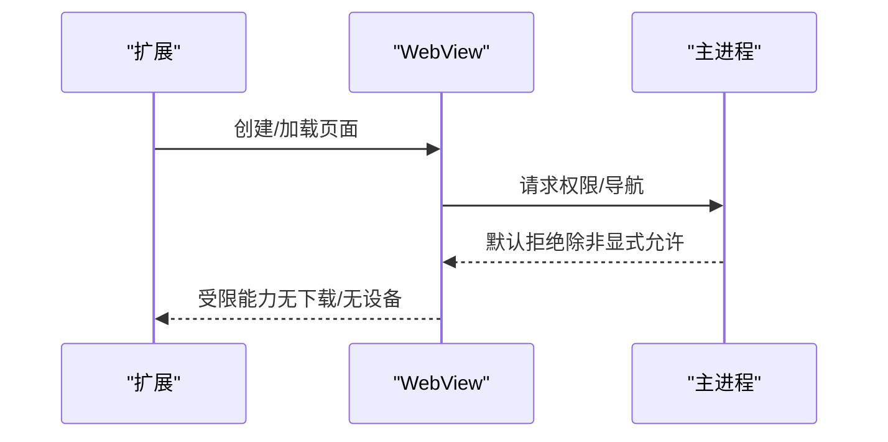
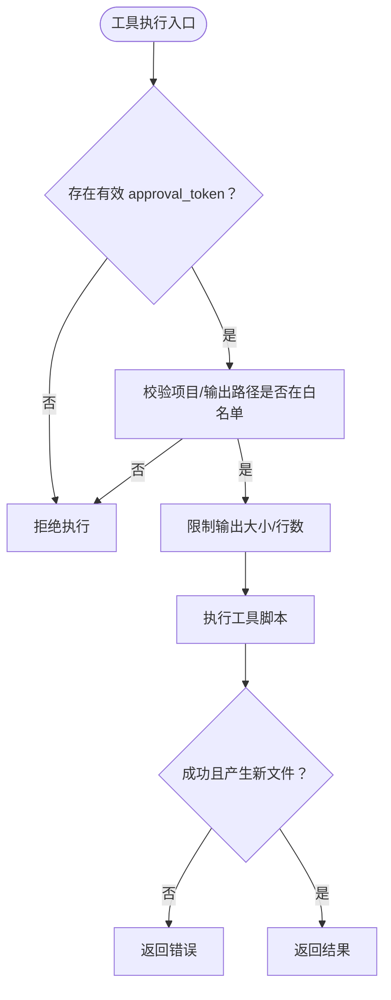
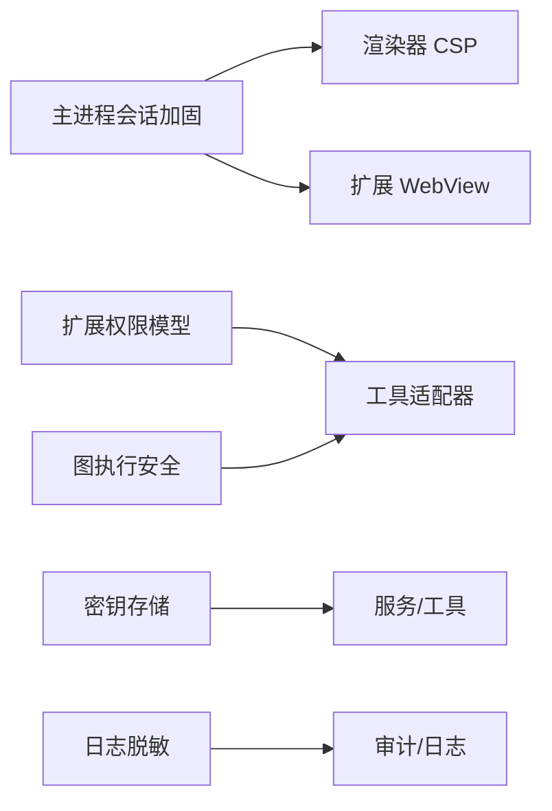

# 安全模型

<cite>
**本文引用的文件**
- [web-contents-hardening.ts](file://src/main/browser-security/web-contents-hardening.ts)
- [renderer-csp.test.ts](file://src/main/renderer-csp.test.ts)
- [secret-store.ts](file://kun/src/security/secret-store.ts)
- [secret-redaction.ts](file://src/shared/secret-redaction.ts)
- [permissions.ts](file://packages/extension-api/src/permissions.ts)
- [graph-security-policy.ts](file://kun/src/graph/graph-security-policy.ts)
- [graph-worker-security.ts](file://kun/src/graph/graph-worker-security.ts)
- [extension-webview-security.ts](file://src/main/extensions/extension-webview-security.ts)
- [archive-security.ts](file://src/main/data-migration/archive-security.ts)
- [ppt-master-tool.test.ts](file://kun/src/adapters/tool/ppt-master-tool.test.ts)
</cite>

## 目录
1. [简介](#简介)
2. [项目结构](#项目结构)
3. [核心组件](#核心组件)
4. [架构总览](#架构总览)
5. [详细组件分析](#详细组件分析)
6. [依赖关系分析](#依赖关系分析)
7. [性能与安全权衡](#性能与安全权衡)
8. [故障排查指南](#故障排查指南)
9. [结论](#结论)
10. [附录：配置与最佳实践](#附录配置与最佳实践)

## 简介
本文件系统化阐述 DeepSeek-GUI 的安全模型，覆盖多层防护体系（进程隔离、权限控制、沙箱机制）、扩展安全模型（权限声明、运行时授权、资源访问控制）、WebView 安全策略（CSP、跨域限制、内容过滤）、敏感信息保护（密钥存储、日志脱敏、内存清理）、网络安全措施（HTTPS 强制、证书校验、代理配置）、用户确认机制（危险操作警告、权限请求、撤销）以及审计日志系统（操作记录、异常追踪、合规报告）。文档同时提供可操作的配置指南与最佳实践建议。

## 项目结构
DeepSeek-GUI 的安全能力分布在主进程、渲染器、扩展 API、图执行环境与工具适配器等多个层次：
- 主进程浏览器安全加固：默认拒绝设备/下载等权限，启用严格 Web 安全策略。
- 渲染器 CSP：通过 HTML 中的 Content-Security-Policy 限制资源来源，仅允许本地与受信任扩展资源。
- 密钥存储：使用 AES-256-GCM 加密持久化令牌，优先使用操作系统钥匙串或 DPAPI，回退到 0600 权限的密钥文件。
- 日志脱敏：统一对敏感字段和文本进行脱敏，避免泄露。
- 扩展权限模型：静态权限白名单 + 作用域化网络/账户权限，支持匹配与判定。
- 图执行安全：工作区写沙箱、路径白名单、输出限制、用户确认令牌。
- WebView 安全：为扩展 WebView 设置最小权限与隔离策略。
- 数据迁移归档安全：对归档内容进行安全检查与限制。

**图表来源**
- [web-contents-hardening.ts:1-33](file://src/main/browser-security/web-contents-hardening.ts#L1-L33)
- [renderer-csp.test.ts:1-16](file://src/main/renderer-csp.test.ts#L1-L16)
- [secret-store.ts:1-653](file://kun/src/security/secret-store.ts#L1-L653)
- [secret-redaction.ts:1-37](file://src/shared/secret-redaction.ts#L1-L37)
- [permissions.ts:1-54](file://packages/extension-api/src/permissions.ts#L1-L54)
- [graph-security-policy.ts](file://kun/src/graph/graph-security-policy.ts)
- [graph-worker-security.ts](file://kun/src/graph/graph-worker-security.ts)
- [extension-webview-security.ts](file://src/main/extensions/extension-webview-security.ts)
- [archive-security.ts](file://src/main/data-migration/archive-security.ts)

**章节来源**
- [web-contents-hardening.ts:1-33](file://src/main/browser-security/web-contents-hardening.ts#L1-L33)
- [renderer-csp.test.ts:1-16](file://src/main/renderer-csp.test.ts#L1-L16)
- [secret-store.ts:1-653](file://kun/src/security/secret-store.ts#L1-L653)
- [secret-redaction.ts:1-37](file://src/shared/secret-redaction.ts#L1-L37)
- [permissions.ts:1-54](file://packages/extension-api/src/permissions.ts#L1-L54)
- [graph-security-policy.ts](file://kun/src/graph/graph-security-policy.ts)
- [graph-worker-security.ts](file://kun/src/graph/graph-worker-security.ts)
- [extension-webview-security.ts](file://src/main/extensions/extension-webview-security.ts)
- [archive-security.ts](file://src/main/data-migration/archive-security.ts)

## 核心组件
- 浏览器内容加固：禁用 Node 集成、启用上下文隔离与沙箱、禁止不安全内容、禁用 webview 标签、阻止自动播放与下载、默认拒绝所有权限请求。
- 渲染器 CSP：仅允许本地与扩展图片来源（如 blob:、kun-extension:），禁止 https: 等外部来源。
- 密钥存储：AES-256-GCM 信封格式；优先 OS 钥匙串（macOS/Linux）或 Windows DPAPI；回退到 0600 权限密钥文件；带租约协调避免并发冲突。
- 日志脱敏：按键名模式与文本模式替换敏感值，统一输出 <redacted>。
- 扩展权限：静态权限白名单 + 作用域化 network:/accounts.* 权限，支持通配匹配与 hasPermission 判定。
- 图执行安全：工作区写沙箱、路径白名单校验、输出大小限制、用户确认令牌（approval_token）强制。
- WebView 安全：为扩展 WebView 设置最小权限与隔离策略，限制导航与脚本能力。
- 归档安全：在数据迁移过程中对归档内容进行安全检查与限制。

**章节来源**
- [web-contents-hardening.ts:1-33](file://src/main/browser-security/web-contents-hardening.ts#L1-L33)
- [renderer-csp.test.ts:1-16](file://src/main/renderer-csp.test.ts#L1-L16)
- [secret-store.ts:1-653](file://kun/src/security/secret-store.ts#L1-L653)
- [secret-redaction.ts:1-37](file://src/shared/secret-redaction.ts#L1-L37)
- [permissions.ts:1-54](file://packages/extension-api/src/permissions.ts#L1-L54)
- [graph-security-policy.ts](file://kun/src/graph/graph-security-policy.ts)
- [graph-worker-security.ts](file://kun/src/graph/graph-worker-security.ts)
- [extension-webview-security.ts](file://src/main/extensions/extension-webview-security.ts)
- [archive-security.ts](file://src/main/data-migration/archive-security.ts)

## 架构总览
下图展示从用户操作到工具执行的完整安全链路：用户触发 → 权限检查 → 沙箱约束 → 用户确认 → 工具执行 → 结果审计。

**图表来源**
- [web-contents-hardening.ts:1-33](file://src/main/browser-security/web-contents-hardening.ts#L1-L33)
- [permissions.ts:1-54](file://packages/extension-api/src/permissions.ts#L1-L54)
- [graph-security-policy.ts](file://kun/src/graph/graph-security-policy.ts)
- [graph-worker-security.ts](file://kun/src/graph/graph-worker-security.ts)
- [secret-store.ts:1-653](file://kun/src/security/secret-store.ts#L1-L653)
- [ppt-master-tool.test.ts:1-329](file://kun/src/adapters/tool/ppt-master-tool.test.ts#L1-L329)

## 详细组件分析

### 浏览器内容与会话加固
- 默认拒绝所有权限请求与设备权限，禁止下载，禁用 webview 标签，关闭不安全内容加载，启用上下文隔离与沙箱。
- 适用于远程或第三方内容的宿主窗口，确保最小攻击面。

**图表来源**
- [web-contents-hardening.ts:1-33](file://src/main/browser-security/web-contents-hardening.ts#L1-L33)

**章节来源**
- [web-contents-hardening.ts:1-33](file://src/main/browser-security/web-contents-hardening.ts#L1-L33)

### 渲染器内容安全策略（CSP）
- 通过 HTML 中的 CSP 限制 img-src 等指令，仅允许本地与扩展资源（如 blob:、kun-extension:），禁止 https: 等外部来源，降低注入风险。
- 测试用例验证 CSP 中不包含 https: 白名单。

**图表来源**
- [renderer-csp.test.ts:1-16](file://src/main/renderer-csp.test.ts#L1-L16)

**章节来源**
- [renderer-csp.test.ts:1-16](file://src/main/renderer-csp.test.ts#L1-L16)

### 密钥存储与敏感信息保护
- 使用 AES-256-GCM 信封格式加密令牌，支持附加认证数据（AAD）。
- 密钥来源优先级：OS 钥匙串（macOS/Linux）→ Windows DPAPI（CurrentUser）→ 0600 权限密钥文件。
- 首次启动通过租约协调避免并发冲突；迁移旧密钥至更安全存储。
- 日志与输出统一脱敏，避免敏感信息泄露。

**图表来源**
- [secret-store.ts:1-653](file://kun/src/security/secret-store.ts#L1-L653)

**章节来源**
- [secret-store.ts:1-653](file://kun/src/security/secret-store.ts#L1-L653)
- [secret-redaction.ts:1-37](file://src/shared/secret-redaction.ts#L1-L37)

### 扩展安全模型（权限声明、运行时授权、资源访问控制）
- 静态权限：命令注册、UI 视图/动作/通知、Webview、Agent 运行、线程只读、工具/提供者注册、账户读取、全局/工作区存储、工作区读写、媒体处理、作业管理等。
- 作用域权限：network:*（支持 *. 前缀通配匹配）、accounts.use/manage/secrets.read:<provider>。
- 运行时授权：通过 hasPermission 与 permissionMatches 判断授予是否满足请求。

**图表来源**
- [permissions.ts:1-54](file://packages/extension-api/src/permissions.ts#L1-L54)

**章节来源**
- [permissions.ts:1-54](file://packages/extension-api/src/permissions.ts#L1-L54)

### WebView 安全策略（CSP、跨域限制、内容过滤）
- 为扩展 WebView 设置最小权限与隔离策略，限制导航、脚本与外部资源加载。
- 结合主进程会话加固，默认拒绝设备/下载权限，阻断潜在恶意行为。

**图表来源**
- [extension-webview-security.ts](file://src/main/extensions/extension-webview-security.ts)
- [web-contents-hardening.ts:1-33](file://src/main/browser-security/web-contents-hardening.ts#L1-L33)

**章节来源**
- [extension-webview-security.ts](file://src/main/extensions/extension-webview-security.ts)
- [web-contents-hardening.ts:1-33](file://src/main/browser-security/web-contents-hardening.ts#L1-L33)

### 图执行安全与工具适配器（沙箱、路径白名单、输出限制、用户确认）
- 工作区写沙箱：限制工具只能在受控目录下写入，防止越权修改。
- 路径白名单：拒绝不在允许范围内的项目路径与输出路径。
- 输出限制：限制读取文档行数与生成文件大小，避免资源耗尽。
- 用户确认：关键操作需 approval_token，未获批准则拒绝执行。

**图表来源**
- [ppt-master-tool.test.ts:1-329](file://kun/src/adapters/tool/ppt-master-tool.test.ts#L1-L329)
- [graph-security-policy.ts](file://kun/src/graph/graph-security-policy.ts)
- [graph-worker-security.ts](file://kun/src/graph/graph-worker-security.ts)

**章节来源**
- [ppt-master-tool.test.ts:1-329](file://kun/src/adapters/tool/ppt-master-tool.test.ts#L1-L329)
- [graph-security-policy.ts](file://kun/src/graph/graph-security-policy.ts)
- [graph-worker-security.ts](file://kun/src/graph/graph-worker-security.ts)

### 数据安全迁移与归档安全
- 在数据迁移过程中对归档内容进行安全检查与限制，防止恶意归档破坏系统状态。

**章节来源**
- [archive-security.ts](file://src/main/data-migration/archive-security.ts)

## 依赖关系分析
- 主进程会话加固为渲染器与 WebView 提供基础安全基线。
- 渲染器 CSP 与 WebView 安全共同约束前端资源加载与交互。
- 扩展权限模型贯穿工具与服务调用链，确保最小权限原则。
- 图执行安全在工具层面进一步收敛文件系统与网络访问面。
- 密钥存储为上层服务提供安全的凭证存取能力，日志脱敏保障审计安全。

**图表来源**
- [web-contents-hardening.ts:1-33](file://src/main/browser-security/web-contents-hardening.ts#L1-L33)
- [renderer-csp.test.ts:1-16](file://src/main/renderer-csp.test.ts#L1-L16)
- [permissions.ts:1-54](file://packages/extension-api/src/permissions.ts#L1-L54)
- [graph-security-policy.ts](file://kun/src/graph/graph-security-policy.ts)
- [graph-worker-security.ts](file://kun/src/graph/graph-worker-security.ts)
- [secret-store.ts:1-653](file://kun/src/security/secret-store.ts#L1-L653)
- [secret-redaction.ts:1-37](file://src/shared/secret-redaction.ts#L1-L37)

**章节来源**
- [web-contents-hardening.ts:1-33](file://src/main/browser-security/web-contents-hardening.ts#L1-L33)
- [renderer-csp.test.ts:1-16](file://src/main/renderer-csp.test.ts#L1-L16)
- [permissions.ts:1-54](file://packages/extension-api/src/permissions.ts#L1-L54)
- [graph-security-policy.ts](file://kun/src/graph/graph-security-policy.ts)
- [graph-worker-security.ts](file://kun/src/graph/graph-worker-security.ts)
- [secret-store.ts:1-653](file://kun/src/security/secret-store.ts#L1-L653)
- [secret-redaction.ts:1-37](file://src/shared/secret-redaction.ts#L1-L37)

## 性能与安全权衡
- 会话加固与 CSP 会增加少量初始化开销，但显著降低攻击面。
- 密钥存储的 OS 钥匙串/DPAPI 调用有延迟，建议缓存短期密钥并在内存中尽快释放。
- 图执行沙箱与路径校验带来额外检查成本，但能防止越权与资源滥用。
- 日志脱敏在大规模输出时可能影响吞吐，建议按需启用与批量处理。

[本节为通用指导，不直接分析具体文件]

## 故障排查指南
- 权限被拒：检查扩展权限声明与作用域匹配，确认 hasPermission 判定逻辑。
- WebView 无法加载资源：核对 CSP 指令与资源域名，确保仅允许受信任来源。
- 密钥不可用：查看 OS 钥匙串/DPAPI 可用性，必要时回退到 0600 密钥文件；关注租约冲突与超时。
- 工具执行失败：确认 approval_token 是否有效，路径是否在白名单，输出是否超限。
- 日志泄露：确认脱敏规则是否覆盖所有敏感键名与文本模式。

**章节来源**
- [permissions.ts:1-54](file://packages/extension-api/src/permissions.ts#L1-L54)
- [renderer-csp.test.ts:1-16](file://src/main/renderer-csp.test.ts#L1-L16)
- [secret-store.ts:1-653](file://kun/src/security/secret-store.ts#L1-L653)
- [ppt-master-tool.test.ts:1-329](file://kun/src/adapters/tool/ppt-master-tool.test.ts#L1-L329)
- [secret-redaction.ts:1-37](file://src/shared/secret-redaction.ts#L1-L37)

## 结论
DeepSeek-GUI 采用分层安全架构，从主进程会话加固、渲染器 CSP、扩展权限模型、图执行沙箱到密钥存储与日志脱敏，形成闭环防护。通过严格的默认拒绝策略、最小权限原则与用户确认机制，有效降低恶意代码、越权访问与敏感信息泄露的风险。建议在部署与开发中遵循本文的配置指南与最佳实践，持续评估与强化安全边界。

[本节为总结性内容，不直接分析具体文件]

## 附录：配置与最佳实践
- 浏览器与会话
  - 保持 nodeIntegration=false、contextIsolation=true、sandbox=true。
  - 默认拒绝所有权限请求，禁止下载与不安全内容。
- 渲染器 CSP
  - 仅允许本地与扩展资源（blob:、kun-extension:），禁止 https: 等外部来源。
- 密钥存储
  - 优先使用 OS 钥匙串或 DPAPI；若不可用，确保密钥文件权限为 0600。
  - 避免在命令行参数中传递敏感信息，使用 stdin 输入。
- 扩展权限
  - 精确声明所需静态权限与作用域权限，避免过度授权。
  - 使用 hasPermission 与 permissionMatches 进行运行时校验。
- 图执行与工具
  - 限制工作区写路径与输出大小，要求 approval_token 才能执行关键操作。
  - 对工具输入进行白名单校验，拒绝越界路径与不受支持的文件类型。
- WebView
  - 最小权限加载，禁用 webview 标签与不必要功能。
- 日志与审计
  - 统一使用脱敏函数处理敏感字段与文本。
  - 记录操作、异常与权限判定结果，便于合规审计。
- 网络安全
  - 强制 HTTPS，启用证书校验，谨慎配置代理，避免中间人攻击。
  - 对外部资源加载实施白名单与内容过滤。

[本节为通用指导，不直接分析具体文件]