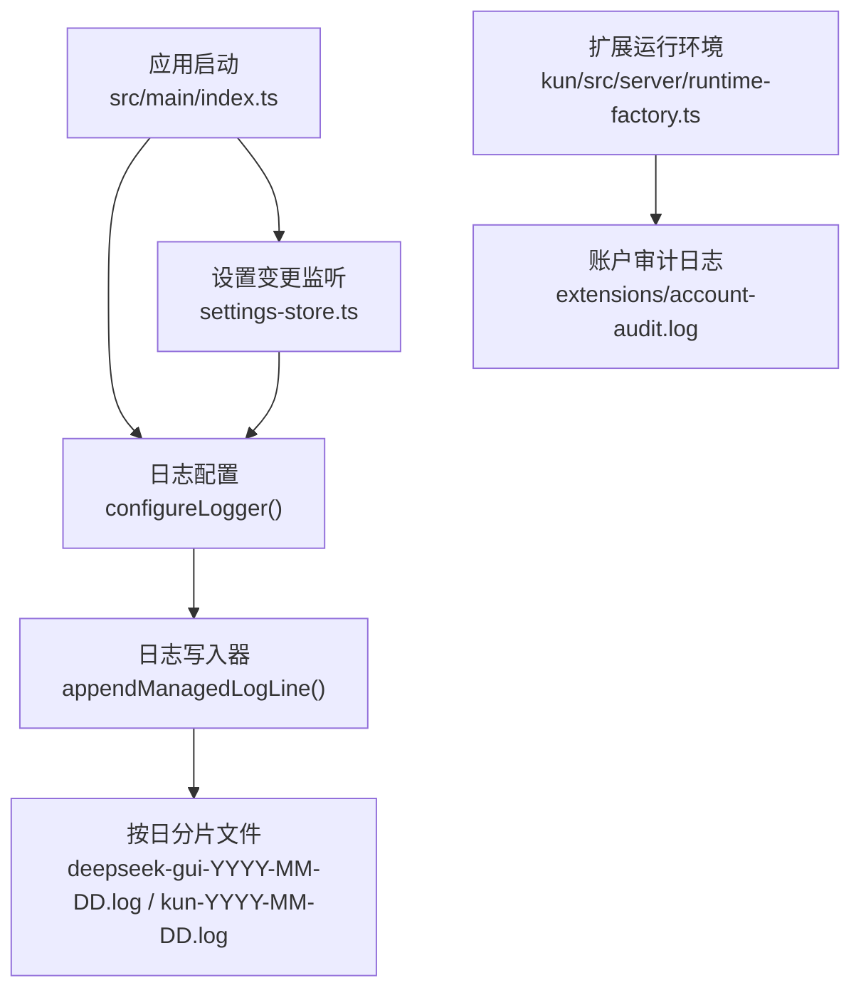
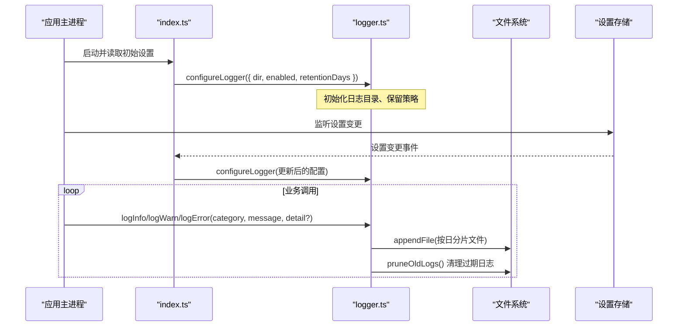
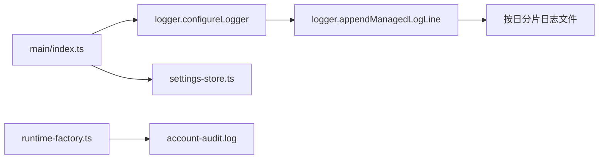

# 审计日志系统

<cite>
**本文引用的文件**
- [src/main/logger.ts](file://src/main/logger.ts)
- [src/main/logger.test.ts](file://src/main/logger.test.ts)
- [src/shared/app-settings-types.ts](file://src/shared/app-settings-types.ts)
- [src/main/index.ts](file://src/main/index.ts)
- [src/main/settings-store.ts](file://src/main/settings-store.ts)
- [kun/src/server/runtime-factory.ts](file://kun/src/server/runtime-factory.ts)
</cite>

## 目录
1. [简介](#简介)
2. [项目结构](#项目结构)
3. [核心组件](#核心组件)
4. [架构总览](#架构总览)
5. [详细组件分析](#详细组件分析)
6. [依赖关系分析](#依赖关系分析)
7. [性能考虑](#性能考虑)
8. [故障排查指南](#故障排查指南)
9. [结论](#结论)
10. [附录](#附录)

## 简介
本文件为 DeepSeek-GUI 的审计日志系统提供完整技术文档。内容涵盖：
- 日志级别分类与用途（调试/信息、警告、错误）
- 结构化日志格式（时间戳、来源标识、上下文信息、标准化字段）
- 敏感信息过滤与安全存储策略
- 日志聚合与分析建议（集中式收集、实时查询、趋势分析）
- 合规性报告生成思路（安全事件统计、访问模式分析、审计报告导出）
- 日志配置指南与性能优化建议

## 项目结构
DeepSeek-GUI 的日志能力集中在主进程，采用“按日分片”的文件落盘方式，并通过设置项动态控制开关与保留天数。运行时还会在扩展数据目录下维护账户审计日志。

图表来源
- [src/main/index.ts:3100-3108](file://src/main/index.ts#L3100-L3108)
- [src/main/logger.ts:20-75](file://src/main/logger.ts#L20-L75)
- [src/main/settings-store.ts:272-272](file://src/main/settings-store.ts#L272-L272)
- [kun/src/server/runtime-factory.ts:626-626](file://kun/src/server/runtime-factory.ts#L626-L626)

章节来源
- [src/main/index.ts:3100-3108](file://src/main/index.ts#L3100-L3108)
- [src/main/logger.ts:20-75](file://src/main/logger.ts#L20-L75)
- [src/main/settings-store.ts:272-272](file://src/main/settings-store.ts#L272-L272)
- [kun/src/server/runtime-factory.ts:626-626](file://kun/src/server/runtime-factory.ts#L626-L626)

## 核心组件
- 日志配置与生命周期管理
  - 通过配置对象控制日志目录、是否启用、保留天数；支持热更新。
- 结构化日志写入
  - 统一封装 error/warn/info 三个级别，输出包含 ISO 时间戳、级别、类别和消息体。
- 日志归档与清理
  - 每次写入后尝试清理超过保留天数的旧日志文件，避免磁盘膨胀。
- 设置联动
  - 应用启动时从初始设置加载日志配置；设置变更时动态刷新日志行为。
- 扩展审计日志
  - 在扩展数据目录中维护独立的账户审计日志，用于记录凭证访问等安全相关事件。

章节来源
- [src/main/logger.ts:5-15](file://src/main/logger.ts#L5-L15)
- [src/main/logger.ts:20-75](file://src/main/logger.ts#L20-L75)
- [src/main/logger.ts:77-102](file://src/main/logger.ts#L77-L102)
- [src/main/logger.ts:107-110](file://src/main/logger.ts#L107-L110)
- [src/main/index.ts:3100-3108](file://src/main/index.ts#L3100-L3108)
- [src/main/index.ts:3267-3272](file://src/main/index.ts#L3267-L3272)
- [src/main/settings-store.ts:272-272](file://src/main/settings-store.ts#L272-L272)
- [kun/src/server/runtime-factory.ts:626-626](file://kun/src/server/runtime-factory.ts#L626-L626)

## 架构总览
下图展示了从应用启动到日志落盘的端到端流程，以及设置变更对日志行为的动态影响。

图表来源
- [src/main/index.ts:3100-3108](file://src/main/index.ts#L3100-L3108)
- [src/main/index.ts:3267-3272](file://src/main/index.ts#L3267-L3272)
- [src/main/logger.ts:20-75](file://src/main/logger.ts#L20-L75)
- [src/main/logger.ts:77-102](file://src/main/logger.ts#L77-L102)

## 详细组件分析

### 日志级别与用途
- 信息（info）
  - 用于常规诊断与操作记录，例如启动阶段清理日志、关键流程节点。
- 警告（warn）
  - 用于非致命异常或需要关注的状态，如配置热更新失败、重试提示等。
- 错误（error）
  - 用于失败路径与异常堆栈的摘要，便于快速定位问题。

实现要点
- 统一的 writeLogLine 将级别、类别、消息组合成一行结构化文本。
- 支持可选 detail 参数，自动序列化为 JSON 片段并截断长度，避免日志过大。

章节来源
- [src/main/logger.ts:77-102](file://src/main/logger.ts#L77-L102)
- [src/main/logger.ts:112-119](file://src/main/logger.ts#L112-L119)

### 结构化日志格式
每行日志包含以下标准化字段：
- 时间戳：ISO 8601 格式，便于排序与解析。
- 级别：ERROR/WARN/INFO。
- 类别：模块或子系统标识（如 logger、mcp-config、project-config）。
- 消息：人类可读描述 + 可选的结构化 detail（JSON 片段）。

示例字段说明
- 时间戳：用于时序分析与窗口聚合。
- 级别：用于告警阈值与过滤。
- 类别：用于按子系统检索与统计。
- 消息：结合 detail 可还原上下文。

章节来源
- [src/main/logger.ts:77-81](file://src/main/logger.ts#L77-L81)
- [src/main/logger.ts:83-102](file://src/main/logger.ts#L83-L102)

### 日志文件组织与保留
- 文件命名：按日期分片，前缀区分 deepseek-gui 与 kun。
- 目录：由配置指定，不存在时自动创建。
- 保留策略：每次写入后尝试删除早于保留天数的日志文件。
- 健壮性：IO 异常被吞掉，确保不影响主流程。

章节来源
- [src/main/logger.ts:24-33](file://src/main/logger.ts#L24-L33)
- [src/main/logger.ts:39-57](file://src/main/logger.ts#L39-L57)
- [src/main/logger.ts:59-75](file://src/main/logger.ts#L59-L75)

### 敏感信息过滤与安全存储
- 脱敏序列化：detail 使用安全的字符串化函数，限制最大长度，防止超大 payload。
- 最小暴露原则：仅记录必要上下文，避免直接输出密钥、令牌等敏感值。
- 独立审计日志：扩展层在数据目录下维护 account-audit.log，用于记录凭证访问等安全事件，便于合规审计。

章节来源
- [src/main/logger.ts:112-119](file://src/main/logger.ts#L112-L119)
- [kun/src/server/runtime-factory.ts:626-626](file://kun/src/server/runtime-factory.ts#L626-L626)

### 日志聚合与分析
- 集中式收集：可将按日分片的日志文件纳入集中式采集（如日志代理），按主机/进程维度打标。
- 实时查询：基于时间戳与级别进行流式过滤，结合类别做多维度检索。
- 趋势分析：统计单位时间内 ERROR/WARN 比例、特定类别的峰值时段，辅助容量规划与稳定性评估。

[本节为通用实践建议，不直接引用具体代码]

### 合规性报告生成
- 安全事件统计：基于 ERROR 级别与特定类别（如 mcp-config、project-config）汇总失败次数与分布。
- 访问模式分析：结合类别与时间戳，识别高频操作与异常时段。
- 审计报告导出：定期导出 account-audit.log 与主日志摘要，形成可审计材料。

[本节为通用实践建议，不直接引用具体代码]

### 日志配置指南
- 启用/禁用：通过设置项控制日志开关，默认启用。
- 保留天数：默认 3 天，可在设置中调整（范围受校验约束）。
- 热更新：设置变更后即时生效，无需重启。
- 目录选择：由应用根据平台与用户数据目录决定，避免越权写入。

章节来源
- [src/shared/app-settings-types.ts:187-187](file://src/shared/app-settings-types.ts#L187-L187)
- [src/main/index.ts:3100-3108](file://src/main/index.ts#L3100-L3108)
- [src/main/index.ts:3267-3272](file://src/main/index.ts#L3267-L3272)
- [src/main/settings-store.ts:272-272](file://src/main/settings-store.ts#L272-L272)

### 性能优化建议
- 异步写入：日志写入为异步 IO，尽量不在关键路径阻塞。
- 批量与节流：在高吞吐场景下，可对日志写入做批处理或限流，降低频繁 fsync 带来的开销。
- 合理保留期：生产环境建议缩短保留期，配合外部集中式存储做长期归档。
- 控制 detail 大小：避免在 detail 中放入大对象，必要时只记录关键键值。

[本节为通用实践建议，不直接引用具体代码]

## 依赖关系分析
- 主进程入口负责初始化日志配置，并在设置变更时重新配置。
- 日志模块依赖共享设置常量（默认保留天数）。
- 扩展服务在数据目录内维护独立的审计日志，与主日志解耦。

图表来源
- [src/main/index.ts:3100-3108](file://src/main/index.ts#L3100-L3108)
- [src/main/index.ts:3267-3272](file://src/main/index.ts#L3267-L3272)
- [src/main/logger.ts:20-75](file://src/main/logger.ts#L20-L75)
- [kun/src/server/runtime-factory.ts:626-626](file://kun/src/server/runtime-factory.ts#L626-L626)

章节来源
- [src/main/index.ts:3100-3108](file://src/main/index.ts#L3100-L3108)
- [src/main/index.ts:3267-3272](file://src/main/index.ts#L3267-L3272)
- [src/main/logger.ts:20-75](file://src/main/logger.ts#L20-L75)
- [kun/src/server/runtime-factory.ts:626-626](file://kun/src/server/runtime-factory.ts#L626-L626)

## 性能考虑
- 写入路径短小且容错：IO 异常不会导致应用崩溃。
- 每日分片：天然具备滚动归档效果，便于清理与轮转。
- 启动即清理：启动时执行一次清理，减少历史垃圾文件。
- 建议：在生产环境中结合外部日志采集工具进行聚合与压缩，本地仅保留短期原始日志。

[本节为通用实践建议，不直接引用具体代码]

## 故障排查指南
- 日志未写入
  - 检查日志目录是否存在、是否有写权限。
  - 确认日志已启用且目录配置正确。
- 日志过多或增长过快
  - 调整保留天数，或增加外部采集频率。
  - 审查 detail 是否包含过大对象。
- 无法清理旧日志
  - 检查磁盘空间与权限，确认清理逻辑未被异常中断。
- 审计日志缺失
  - 确认扩展运行环境的数据目录可用，检查 account-audit.log 所在路径。

章节来源
- [src/main/logger.ts:39-57](file://src/main/logger.ts#L39-L57)
- [src/main/logger.ts:59-75](file://src/main/logger.ts#L59-L75)
- [src/main/logger.ts:107-110](file://src/main/logger.ts#L107-L110)
- [kun/src/server/runtime-factory.ts:626-626](file://kun/src/server/runtime-factory.ts#L626-L626)

## 结论
DeepSeek-GUI 的审计日志系统以简洁可靠的文件落盘为核心，提供结构化、可配置的日志能力，并通过设置热更新与启动清理保障易用性与可维护性。结合外部集中式采集与分析平台，可实现完整的日志聚合、实时查询与合规报告生成。建议在生产环境中严格控制 detail 大小、合理设置保留期，并配合外部工具完成长期归档与审计。

[本节为总结性内容，不直接引用具体代码]

## 附录

### 日志级别与字段对照表
- 级别：INFO / WARN / ERROR
- 字段：时间戳、级别、类别、消息（含可选 detail）
- 文件：按日分片，前缀区分 deepseek-gui 与 kun

章节来源
- [src/main/logger.ts:77-102](file://src/main/logger.ts#L77-L102)
- [src/main/logger.ts:24-33](file://src/main/logger.ts#L24-L33)

### 测试用例参考
- 验证结构化 detail 持久化与内容完整性。

章节来源
- [src/main/logger.test.ts:19-34](file://src/main/logger.test.ts#L19-L34)