# 敏感信息存储安全

<cite>
**本文引用的文件**
- [secret-store.ts](file://kun/src/security/secret-store.ts)
- [credential-recovery.ts](file://src/main/credential-recovery.ts)
- [archive-security.ts](file://src/main/data-migration/archive-security.ts)
- [secret-redaction.ts](file://src/shared/secret-redaction.ts)
- [settings-credential-redaction.ts](file://src/main/settings-credential-redaction.ts)
</cite>

## 目录
1. [简介](#简介)
2. [项目结构](#项目结构)
3. [核心组件](#核心组件)
4. [架构总览](#架构总览)
5. [详细组件分析](#详细组件分析)
6. [依赖关系分析](#依赖关系分析)
7. [性能考量](#性能考量)
8. [故障排查指南](#故障排查指南)
9. [结论](#结论)
10. [附录](#附录)

## 简介
本文件面向 DeepSeek-GUI 的“敏感信息存储安全”，系统性说明以下内容：
- AES-256-GCM 加密实现（密钥管理、初始化向量生成、认证标签验证）
- 操作系统密钥链集成（macOS Keychain、Windows DPAPI、Linux Secret Service）
- 密钥文件保护机制（0600 权限、原子写入与临时文件清理）
- 凭据存储格式（加密信封结构、版本兼容性与数据迁移策略）
- 并发访问控制（租约机制、心跳检测、死锁预防）
- 配置选项与安全最佳实践

## 项目结构
围绕敏感信息存储，代码主要分布在以下模块：
- 加密与密钥管理：kun/src/security/secret-store.ts
- Windows 凭据恢复：src/main/credential-recovery.ts
- 迁移包安全校验：src/main/data-migration/archive-security.ts
- 日志与设置中的敏感信息脱敏：src/shared/secret-redaction.ts、src/main/settings-credential-redaction.ts

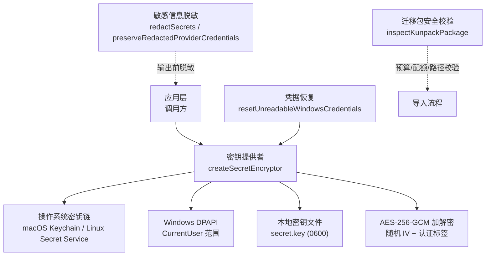

**图示来源**
- [secret-store.ts:31-62](file://kun/src/security/secret-store.ts#L31-L62)
- [secret-store.ts:193-242](file://kun/src/security/secret-store.ts#L193-L242)
- [secret-store.ts:272-316](file://kun/src/security/secret-store.ts#L272-L316)
- [secret-store.ts:333-362](file://kun/src/security/secret-store.ts#L333-L362)
- [credential-recovery.ts:33-105](file://src/main/credential-recovery.ts#L33-L105)
- [archive-security.ts:52-115](file://src/main/data-migration/archive-security.ts#L52-L115)
- [secret-redaction.ts:9-36](file://src/shared/secret-redaction.ts#L9-L36)
- [settings-credential-redaction.ts:19-89](file://src/main/settings-credential-redaction.ts#L19-L89)

**章节来源**
- [secret-store.ts:1-653](file://kun/src/security/secret-store.ts#L1-L653)
- [credential-recovery.ts:1-115](file://src/main/credential-recovery.ts#L1-L115)
- [archive-security.ts:1-220](file://src/main/data-migration/archive-security.ts#L1-L220)
- [secret-redaction.ts:1-37](file://src/shared/secret-redaction.ts#L1-L37)
- [settings-credential-redaction.ts:1-90](file://src/main/settings-credential-redaction.ts#L1-L90)

## 核心组件
- AES-256-GCM 加密器：提供统一 encrypt/decrypt 接口，使用随机 12 字节 IV 和认证标签，支持附加认证数据（AAD）。
- 密钥提供者：按优先级从 OS 密钥链或 DPAPI 获取/生成密钥；不可用时回退到 0600 权限的本地密钥文件。
- 并发引导租约：通过 Manager 原子 JSON 文件实现首次密钥解析的串行化，包含心跳续期与超时等待，避免竞态与死锁。
- 凭据恢复：针对 Windows DPAPI 密钥不可读场景，备份并重置相关凭据文件。
- 迁移包安全：对 Kunpack 包进行头检查、预算限制、路径与链接合法性校验，防止资源耗尽与恶意包。
- 敏感信息脱敏：在日志与设置投影中自动隐藏 API Key、Bearer Token 等敏感字段。

**章节来源**
- [secret-store.ts:31-62](file://kun/src/security/secret-store.ts#L31-L62)
- [secret-store.ts:573-652](file://kun/src/security/secret-store.ts#L573-L652)
- [secret-store.ts:472-558](file://kun/src/security/secret-store.ts#L472-L558)
- [credential-recovery.ts:33-105](file://src/main/credential-recovery.ts#L33-L105)
- [archive-security.ts:52-115](file://src/main/data-migration/archive-security.ts#L52-L115)
- [secret-redaction.ts:9-36](file://src/shared/secret-redaction.ts#L9-L36)
- [settings-credential-redaction.ts:19-89](file://src/main/settings-credential-redaction.ts#L19-L89)

## 架构总览
下图展示了密钥获取与加解密的整体流程，以及在不同平台上的密钥来源选择。

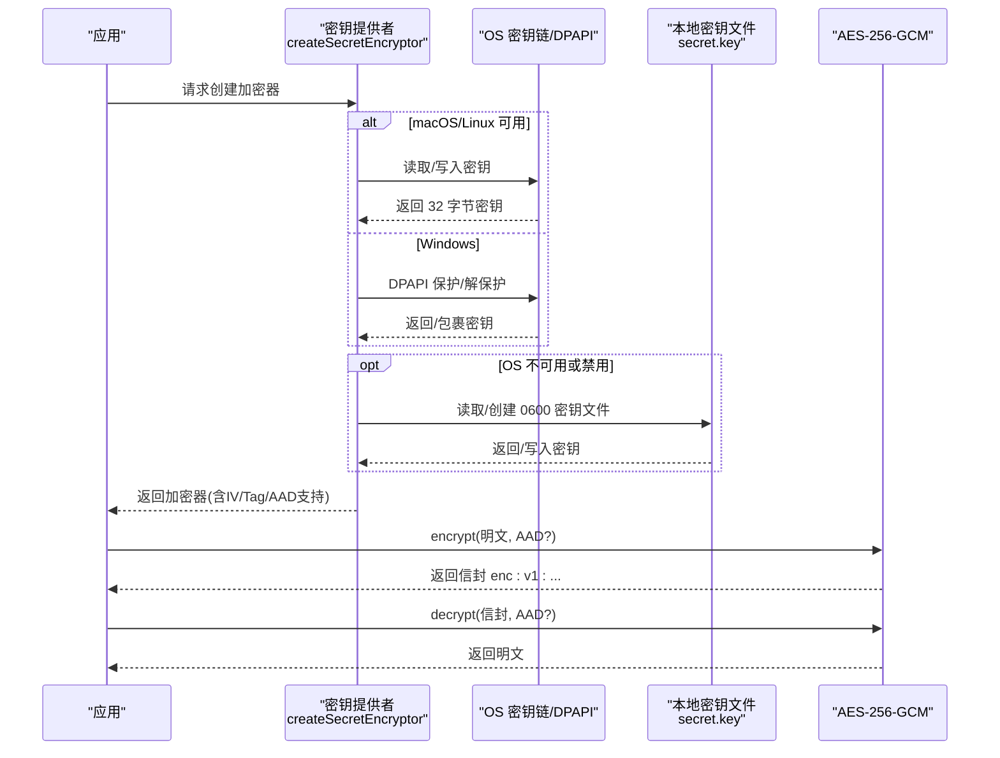

**图示来源**
- [secret-store.ts:31-62](file://kun/src/security/secret-store.ts#L31-L62)
- [secret-store.ts:193-242](file://kun/src/security/secret-store.ts#L193-L242)
- [secret-store.ts:272-316](file://kun/src/security/secret-store.ts#L272-L316)
- [secret-store.ts:333-362](file://kun/src/security/secret-store.ts#L333-L362)
- [secret-store.ts:573-652](file://kun/src/security/secret-store.ts#L573-L652)

## 详细组件分析

### AES-256-GCM 加密实现
- 算法与参数：使用 aes-256-gcm，32 字节密钥，12 字节随机 IV，生成认证标签用于完整性校验。
- 信封格式：enc:v1:<iv_base64>:<tag_base64>:<data_base64>，便于向后兼容与识别。
- 附加认证数据（AAD）：可选传入，参与认证但不进入密文，适合绑定上下文（如用户ID、时间戳）。
- 复杂度：单次加解密为 O(n)，n 为明文长度；内存占用与数据量线性相关。

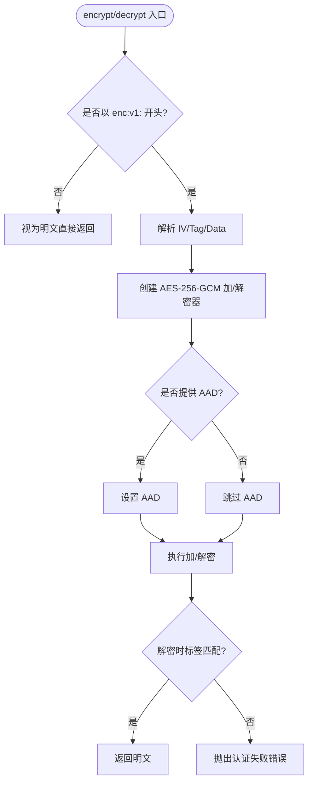

**图示来源**
- [secret-store.ts:31-62](file://kun/src/security/secret-store.ts#L31-L62)

**章节来源**
- [secret-store.ts:31-62](file://kun/src/security/secret-store.ts#L31-L62)

### 密钥管理与操作系统密钥链集成
- 优先级策略：
  - macOS：security find-generic-password/add-generic-password
  - Linux：secret-tool lookup/store
  - Windows：PowerShell 调用 DPAPI（CurrentUser 范围），将 AES 密钥封装后存入 secret.key
- 回退机制：当 OS 密钥链不可用或被禁用时，回退到 0600 权限的本地密钥文件，确保令牌仍为“落盘加密”。
- 迁移行为：若存在旧版 raw key，尝试迁移到 OS 密钥链或 DPAPI；迁移失败则保留原 key 文件。

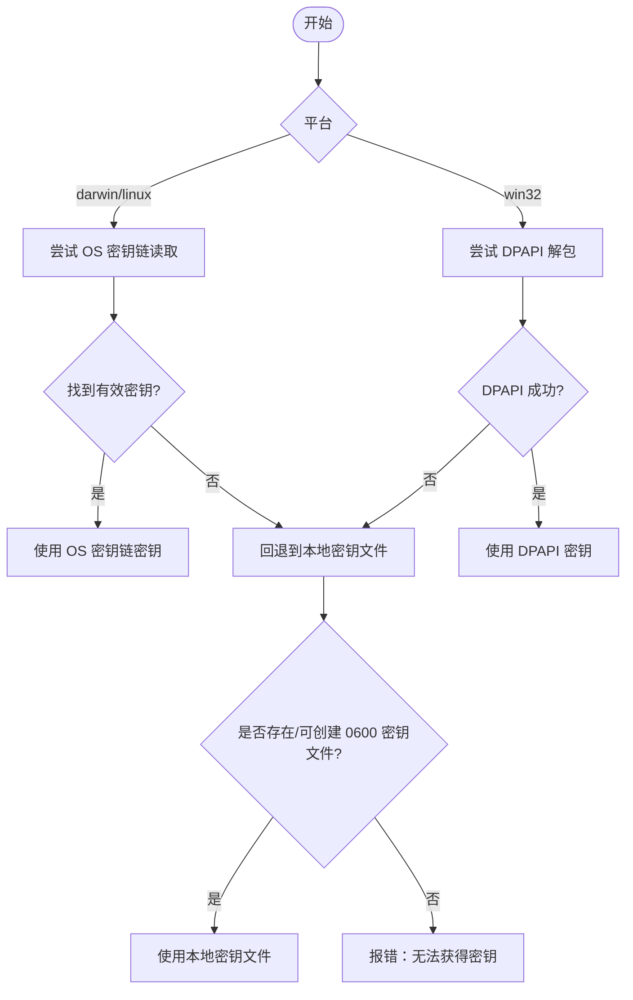

**图示来源**
- [secret-store.ts:193-242](file://kun/src/security/secret-store.ts#L193-L242)
- [secret-store.ts:272-316](file://kun/src/security/secret-store.ts#L272-L316)
- [secret-store.ts:573-652](file://kun/src/security/secret-store.ts#L573-L652)

**章节来源**
- [secret-store.ts:193-242](file://kun/src/security/secret-store.ts#L193-L242)
- [secret-store.ts:272-316](file://kun/src/security/secret-store.ts#L272-L316)
- [secret-store.ts:573-652](file://kun/src/security/secret-store.ts#L573-L652)

### 密钥文件保护机制（0600 权限、原子写入、临时文件清理）
- 新建密钥文件：以独占模式打开并立即同步，随后强制设置为 0600 权限。
- 原子写入：先写临时文件（包含进程号与时间戳），成功后 rename 到目标路径，最后删除临时文件，避免部分写入导致损坏。
- 目录权限：密钥所在目录以 0700 创建，限制其他用户访问。

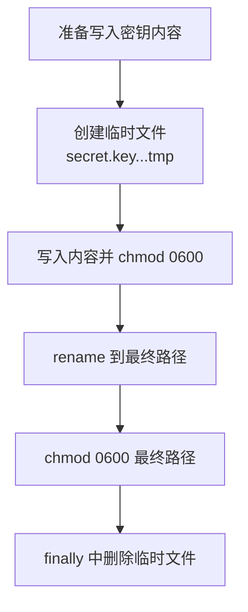

**图示来源**
- [secret-store.ts:333-362](file://kun/src/security/secret-store.ts#L333-L362)

**章节来源**
- [secret-store.ts:333-362](file://kun/src/security/secret-store.ts#L333-L362)

### 凭据存储格式与数据迁移策略
- 扩展凭据：credentials.enc.json，schemaVersion 固定为 1，profileId 标识，credentials 对象保存各凭据条目。
- MCP OAuth 状态：mcp-oauth 目录下多个 JSON 文件，扫描时若发现任何未知或包含加密信封的内容，均视为已加密。
- 迁移策略：
  - 若检测到旧版 raw key，优先尝试迁移到 OS 密钥链或 DPAPI。
  - 迁移失败保持现有 key 文件不变，保证既有凭据仍可解密。
  - 对未知格式采取保守策略（fail-closed），避免破坏已有加密数据。

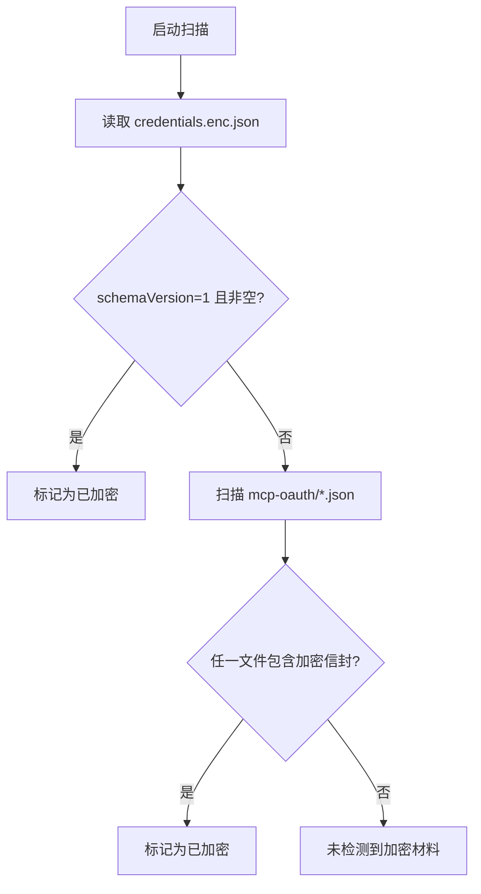

**图示来源**
- [secret-store.ts:77-121](file://kun/src/security/secret-store.ts#L77-L121)
- [secret-store.ts:573-652](file://kun/src/security/secret-store.ts#L573-L652)

**章节来源**
- [secret-store.ts:77-121](file://kun/src/security/secret-store.ts#L77-L121)
- [secret-store.ts:573-652](file://kun/src/security/secret-store.ts#L573-L652)

### 并发访问控制（租约、心跳、死锁预防）
- 租约文件：基于 Manager 原子 JSON 文件，记录 ownerId、leaseExpiresAtMs。
- 获取租约：轮询观察当前租约，若过期且所有者进程已死亡则可抢占；否则等待至截止时间。
- 心跳续期：持有租约期间周期性更新过期时间，防止意外退出导致长期占用。
- 释放租约：操作完成后清空租约；若释放失败，成功路径会抛错以提示上层处理。
- 死锁预防：不持有长锁，仅做短暂 CAS 更新；心跳失败不影响主流程但会在结束时上报。

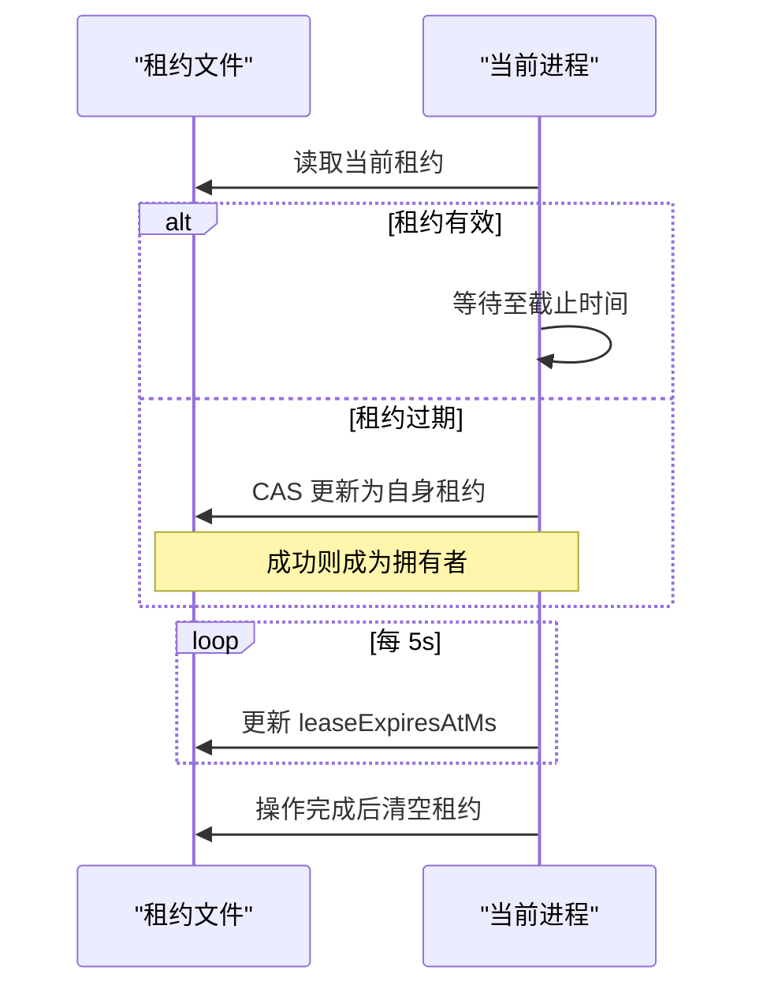

**图示来源**
- [secret-store.ts:419-456](file://kun/src/security/secret-store.ts#L419-L456)
- [secret-store.ts:472-558](file://kun/src/security/secret-store.ts#L472-L558)

**章节来源**
- [secret-store.ts:419-456](file://kun/src/security/secret-store.ts#L419-L456)
- [secret-store.ts:472-558](file://kun/src/security/secret-store.ts#L472-L558)

### 凭据恢复（Windows DPAPI 密钥不可读）
- 触发条件：secret.key 为 DPAPI 包裹格式但无法解密。
- 动作：将关键凭据项移动到带时间戳的备份目录，以便后续重建。
- 回滚：移动过程中若失败，尝试反向回滚；若回滚不完整，保留备份目录供人工处理。

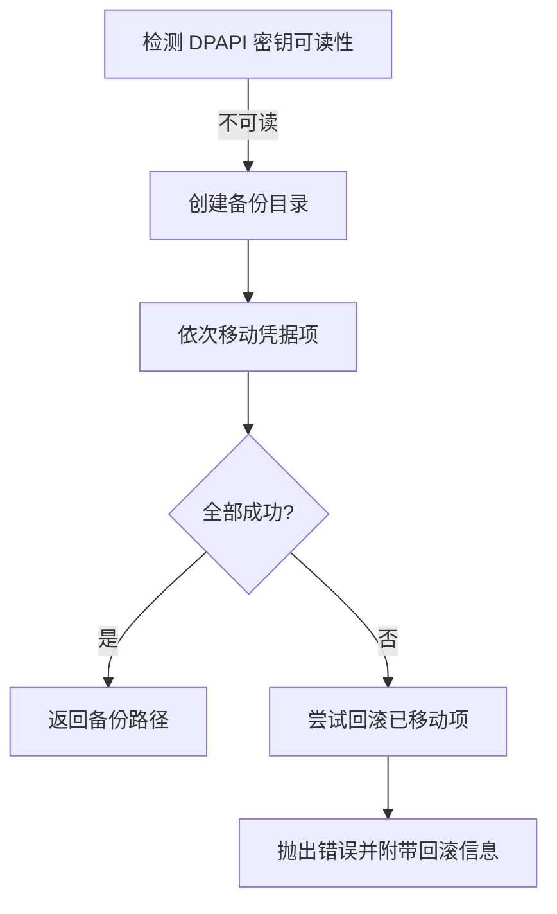

**图示来源**
- [credential-recovery.ts:33-105](file://src/main/credential-recovery.ts#L33-L105)

**章节来源**
- [credential-recovery.ts:33-105](file://src/main/credential-recovery.ts#L33-L105)

### 迁移包安全校验（Kunpack）
- 头部检查：验证格式版本、加密模式与口令要求。
- 预算限制：限制条目数量、展开大小、单条大小、压缩比、元数据大小及剩余空间比例。
- 路径与链接：禁止非法字符、保留名、过长路径；校验链接目标存在且无环。
- 临时目录：解压与验证过程使用受限权限临时目录，并在结束后清理。

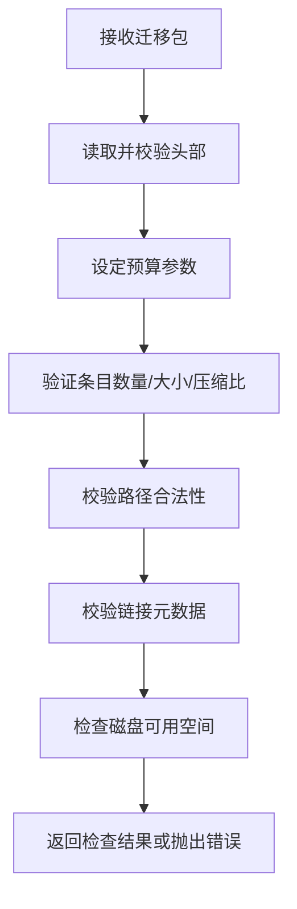

**图示来源**
- [archive-security.ts:52-115](file://src/main/data-migration/archive-security.ts#L52-L115)
- [archive-security.ts:117-202](file://src/main/data-migration/archive-security.ts#L117-L202)
- [archive-security.ts:204-219](file://src/main/data-migration/archive-security.ts#L204-L219)

**章节来源**
- [archive-security.ts:52-115](file://src/main/data-migration/archive-security.ts#L52-L115)
- [archive-security.ts:117-202](file://src/main/data-migration/archive-security.ts#L117-L202)
- [archive-security.ts:204-219](file://src/main/data-migration/archive-security.ts#L204-L219)

### 敏感信息脱敏与设置保护
- 日志脱敏：递归替换键名匹配敏感模式的值，以及文本中的 Authorization/Bearer Token。
- 设置投影：Renderer 侧设置的空 apiKey 不应被视作“清除”，需保留历史值以避免误删绑定。

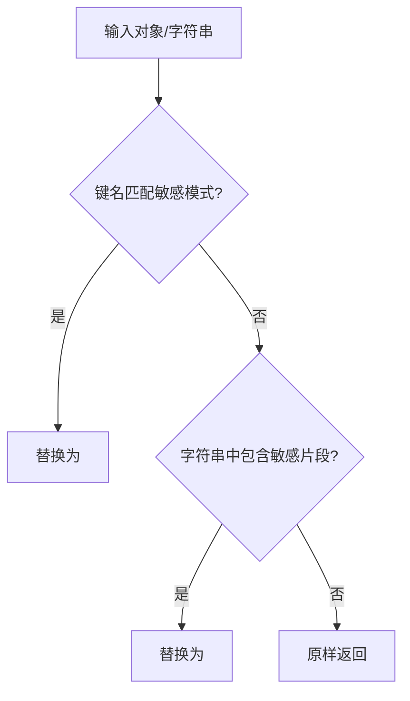

**图示来源**
- [secret-redaction.ts:9-36](file://src/shared/secret-redaction.ts#L9-L36)
- [settings-credential-redaction.ts:19-89](file://src/main/settings-credential-redaction.ts#L19-L89)

**章节来源**
- [secret-redaction.ts:9-36](file://src/shared/secret-redaction.ts#L9-L36)
- [settings-credential-redaction.ts:19-89](file://src/main/settings-credential-redaction.ts#L19-L89)

## 依赖关系分析
- secret-store.ts 依赖 Node.js crypto、fs/promises、child_process，并通过注入 CommandRunner 使测试可替换。
- credential-recovery.ts 依赖 secret-store 提供的能力与常量，实现特定平台的恢复流程。
- archive-security.ts 依赖共享的数据迁移契约与 unpack 工具，确保导入安全。
- secret-redaction.ts 与 settings-credential-redaction.ts 为跨层通用工具，保障输出安全。

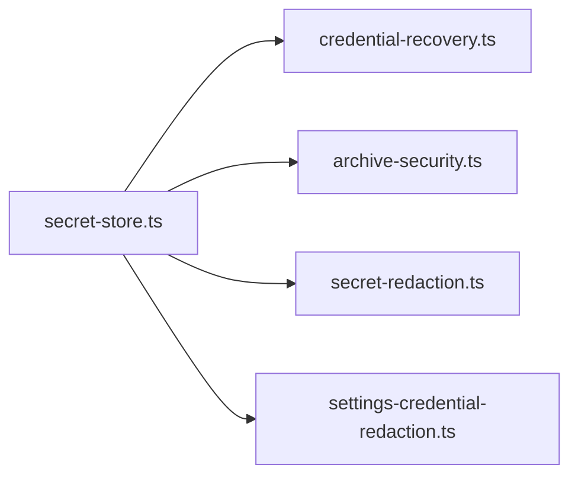

**图示来源**
- [secret-store.ts:1-653](file://kun/src/security/secret-store.ts#L1-L653)
- [credential-recovery.ts:1-115](file://src/main/credential-recovery.ts#L1-L115)
- [archive-security.ts:1-220](file://src/main/data-migration/archive-security.ts#L1-L220)
- [secret-redaction.ts:1-37](file://src/shared/secret-redaction.ts#L1-L37)
- [settings-credential-redaction.ts:1-90](file://src/main/settings-credential-redaction.ts#L1-L90)

**章节来源**
- [secret-store.ts:1-653](file://kun/src/security/secret-store.ts#L1-L653)
- [credential-recovery.ts:1-115](file://src/main/credential-recovery.ts#L1-L115)
- [archive-security.ts:1-220](file://src/main/data-migration/archive-security.ts#L1-L220)
- [secret-redaction.ts:1-37](file://src/shared/secret-redaction.ts#L1-L37)
- [settings-credential-redaction.ts:1-90](file://src/main/settings-credential-redaction.ts#L1-L90)

## 性能考量
- 加解密开销：AES-256-GCM 为对称加密，性能良好；IV 与 Tag 生成成本较低。
- 命令调用开销：OS 密钥链/DPAPI 通过子进程调用，存在启动延迟；默认超时 10 秒，避免阻塞。
- 文件 IO：原子写入与权限设置带来少量额外 IO，但可保证一致性。
- 租约心跳：轻量级定时更新，影响极小。

[本节为一般性指导，无需具体文件引用]

## 故障排查指南
- 无法解密 DPAPI 密钥：
  - 现象：抛出“不可读的凭据密钥”错误。
  - 处理：运行凭据恢复，备份并重置相关凭据文件。
- OS 密钥链不可用：
  - 现象：macOS/Linux 下查找失败或返回无效密钥。
  - 处理：检查 security/secret-tool 可用性；必要时允许回退到本地密钥文件。
- 迁移包过大或路径非法：
  - 现象：预算超限、路径包含非法字符或设备名。
  - 处理：调整包大小与路径，确保符合规范。
- 设置中 API Key 被误清空：
  - 现象：Renderer 侧空 apiKey 被当作清除。
  - 处理：使用 preserveRedactedProviderCredentials 逻辑，保留历史值。

**章节来源**
- [credential-recovery.ts:33-105](file://src/main/credential-recovery.ts#L33-L105)
- [secret-store.ts:248-263](file://kun/src/security/secret-store.ts#L248-L263)
- [archive-security.ts:117-202](file://src/main/data-migration/archive-security.ts#L117-L202)
- [settings-credential-redaction.ts:19-89](file://src/main/settings-credential-redaction.ts#L19-L89)

## 结论
DeepSeek-GUI 的敏感信息存储采用“系统密钥链优先、本地密钥文件兜底”的策略，结合 AES-256-GCM 强加密、原子写入与严格权限控制，确保凭据在落盘时始终受保护。通过租约与心跳机制，实现了安全的并发引导与死锁预防。配合迁移包安全校验与全面的敏感信息脱敏，形成端到端的安全闭环。建议在生产环境中启用 OS 密钥链/DPAPI，并遵循最小权限原则与定期轮换策略。

[本节为总结性内容，无需具体文件引用]

## 附录
- 配置选项
  - 禁用 OS 凭据存储：KUN_DISABLE_OS_CREDENTIAL_STORE=1
  - 自定义命令执行器：通过 run 注入，便于测试与隔离
  - 平台指定：platform 参数用于模拟不同平台行为
- 安全最佳实践
  - 优先使用 OS 密钥链/DPAPI，避免明文密钥落盘
  - 保持密钥文件 0600 权限与目录 0700 权限
  - 使用原子写入与临时文件清理，避免部分写入
  - 对所有输出进行敏感信息脱敏
  - 对迁移包实施严格的预算与路径校验

[本节为补充信息，无需具体文件引用]