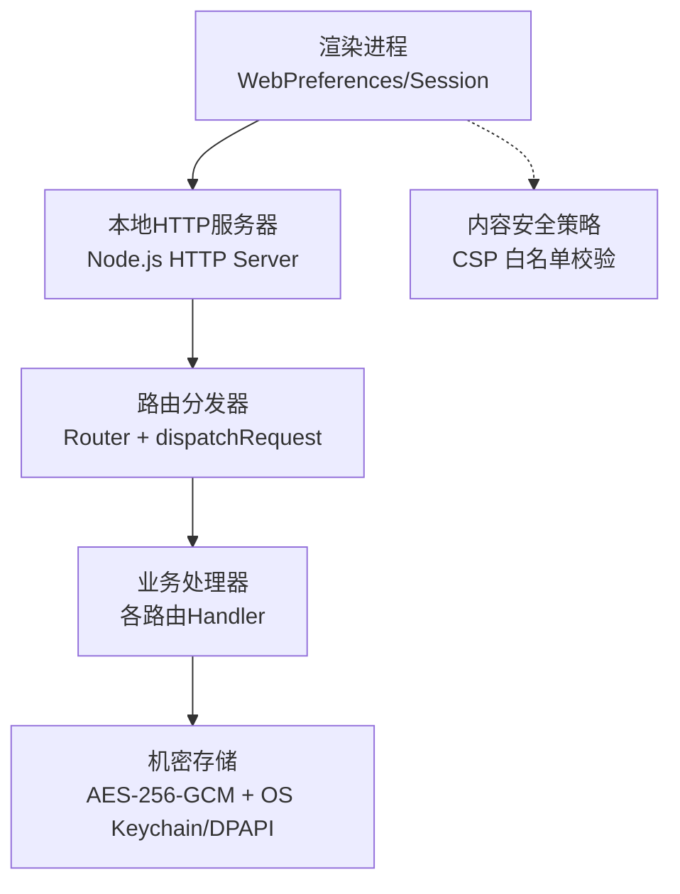
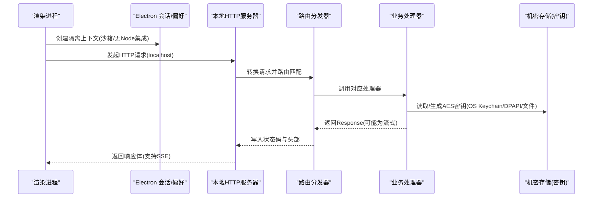
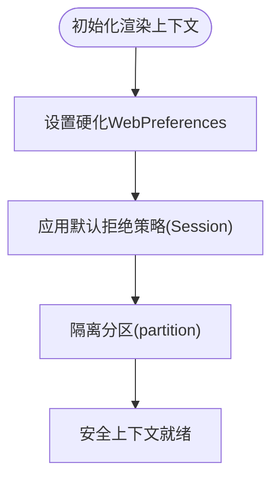
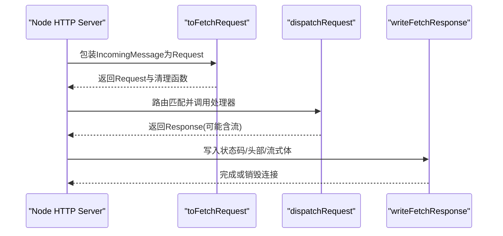
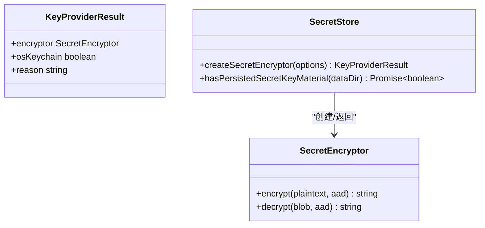
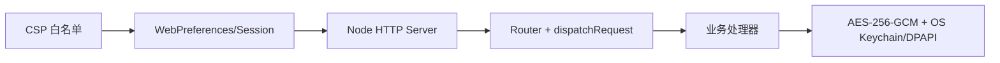

# 数据传输安全

<cite>
**本文引用的文件**
- [web-contents-hardening.ts](file://src/main/browser-security/web-contents-hardening.ts)
- [web-contents-hardening.test.ts](file://src/main/browser-security/web-contents-hardening.test.ts)
- [node-http-server.ts](file://kun/src/server/node-http-server.ts)
- [http-server.ts](file://kun/src/server/http-server.ts)
- [secret-store.ts](file://kun/src/security/secret-store.ts)
- [renderer-csp.test.ts](file://src/main/renderer-csp.test.ts)
</cite>

## 目录
1. [简介](#简介)
2. [项目结构](#项目结构)
3. [核心组件](#核心组件)
4. [架构总览](#架构总览)
5. [详细组件分析](#详细组件分析)
6. [依赖关系分析](#依赖关系分析)
7. [性能考虑](#性能考虑)
8. [故障排查指南](#故障排查指南)
9. [结论](#结论)
10. [附录](#附录)

## 简介
本文件聚焦 DeepSeek-GUI 的数据传输安全，覆盖 HTTPS 强制启用机制、数据完整性校验、通信加密方案、网络请求安全策略与安全头设置。文档基于仓库中的 Electron 渲染进程加固、本地 HTTP 服务器实现与密钥管理模块进行说明，并提供可操作的配置建议与漏洞防护措施。

## 项目结构
与数据传输安全直接相关的代码主要分布在以下位置：
- 渲染进程与浏览器安全加固：Electron WebPreferences 与 Session 的默认拒绝策略
- 本地 HTTP 服务器：Node.js HTTP 服务封装、请求路由与响应写入
- 密钥与机密存储：AES-256-GCM 加密、操作系统密钥链/DPAPI 集成与降级策略
- 内容安全策略（CSP）测试：对渲染页面资源白名单的断言

图表来源
- [web-contents-hardening.ts:1-33](file://src/main/browser-security/web-contents-hardening.ts#L1-L33)
- [node-http-server.ts:1-232](file://kun/src/server/node-http-server.ts#L1-L232)
- [http-server.ts:1-28](file://kun/src/server/http-server.ts#L1-L28)
- [secret-store.ts:1-653](file://kun/src/security/secret-store.ts#L1-L653)
- [renderer-csp.test.ts:1-16](file://src/main/renderer-csp.test.ts#L1-L16)

章节来源
- [web-contents-hardening.ts:1-33](file://src/main/browser-security/web-contents-hardening.ts#L1-L33)
- [node-http-server.ts:1-232](file://kun/src/server/node-http-server.ts#L1-L232)
- [http-server.ts:1-28](file://kun/src/server/http-server.ts#L1-L28)
- [secret-store.ts:1-653](file://kun/src/security/secret-store.ts#L1-L653)
- [renderer-csp.test.ts:1-16](file://src/main/renderer-csp.test.ts#L1-L16)

## 核心组件
- 渲染进程安全基线：通过硬化的 WebPreferences 与 Session 策略，禁用 Node 集成、启用沙箱与网页安全，禁止不安全内容与下载，限制权限请求。
- 本地 HTTP 服务器：提供 Node.js HTTP 服务封装，将原生请求转换为 Fetch Request，统一路由匹配与响应写入，支持流式响应与错误处理。
- 机密存储与密钥管理：使用 AES-256-GCM 对称加密，优先从操作系统密钥链或 DPAPI 获取密钥，不可用时回退到 0600 权限的本地密钥文件；提供原子写入、租约协调与迁移能力。
- 内容安全策略（CSP）：通过测试用例确保渲染页面仅允许必要的本地与扩展资源来源，阻断不安全的远程图片加载。

章节来源
- [web-contents-hardening.ts:1-33](file://src/main/browser-security/web-contents-hardening.ts#L1-L33)
- [web-contents-hardening.test.ts:1-49](file://src/main/browser-security/web-contents-hardening.test.ts#L1-L49)
- [node-http-server.ts:1-232](file://kun/src/server/node-http-server.ts#L1-L232)
- [http-server.ts:1-28](file://kun/src/server/http-server.ts#L1-L28)
- [secret-store.ts:1-653](file://kun/src/security/secret-store.ts#L1-L653)
- [renderer-csp.test.ts:1-16](file://src/main/renderer-csp.test.ts#L1-L16)

## 架构总览
下图展示了从渲染进程发起网络请求到本地 HTTP 服务器处理并返回响应的完整流程，以及机密数据的加解密路径。

图表来源
- [web-contents-hardening.ts:1-33](file://src/main/browser-security/web-contents-hardening.ts#L1-L33)
- [node-http-server.ts:1-232](file://kun/src/server/node-http-server.ts#L1-L232)
- [http-server.ts:1-28](file://kun/src/server/http-server.ts#L1-L28)
- [secret-store.ts:1-653](file://kun/src/security/secret-store.ts#L1-L653)

## 详细组件分析

### 渲染进程安全加固（WebPreferences/Session）
- 默认拒绝所有权限请求、设备权限与下载事件，避免恶意页面滥用系统能力。
- 强制启用 webSecurity、contextIsolation、sandbox，关闭 nodeIntegration 与 webviewTag，禁止运行不安全内容。
- 通过独立 partition 隔离不同页面的会话与缓存，防止跨页面数据泄露。

图表来源
- [web-contents-hardening.ts:1-33](file://src/main/browser-security/web-contents-hardening.ts#L1-L33)
- [web-contents-hardening.test.ts:1-49](file://src/main/browser-security/web-contents-hardening.test.ts#L1-L49)

章节来源
- [web-contents-hardening.ts:1-33](file://src/main/browser-security/web-contents-hardening.ts#L1-L33)
- [web-contents-hardening.test.ts:1-49](file://src/main/browser-security/web-contents-hardening.test.ts#L1-L49)

### 本地 HTTP 服务器（Node.js）
- 将 IncomingMessage 转换为标准 Request，注入远端地址头以用于生命周期路由的本地性判断。
- 统一路由匹配与响应写入，支持流式响应（如 SSE），并在异常时安全关闭套接字。
- 提供故障注入点（超时、限流、无效JSON、SSE断开）用于测试健壮性。

图表来源
- [node-http-server.ts:1-232](file://kun/src/server/node-http-server.ts#L1-L232)
- [http-server.ts:1-28](file://kun/src/server/http-server.ts#L1-L28)

章节来源
- [node-http-server.ts:1-232](file://kun/src/server/node-http-server.ts#L1-L232)
- [http-server.ts:1-28](file://kun/src/server/http-server.ts#L1-L28)

### 机密存储与密钥管理（AES-256-GCM）
- 算法与信封：使用 AES-256-GCM 对称加密，输出包含 IV、认证标签与密文的信封格式，支持附加数据（AAD）。
- 密钥来源优先级：
  - 首选操作系统密钥链（macOS security、Linux secret-tool）或 Windows DPAPI（CurrentUser 范围）。
  - 不可用时回退到 0600 权限的本地密钥文件，保证令牌仍为“静默加密”存储。
- 并发与迁移：通过租约文件协调首次引导，避免多进程竞争；支持旧密钥迁移至更安全存储。
- 安全特性：命令执行通过子进程且输入走 stdin，避免敏感信息出现在命令行参数中；输出长度限制与超时保护。

图表来源
- [secret-store.ts:1-653](file://kun/src/security/secret-store.ts#L1-L653)

章节来源
- [secret-store.ts:1-653](file://kun/src/security/secret-store.ts#L1-L653)

### 内容安全策略（CSP）与资源白名单
- 通过测试断言渲染页面 CSP 仅允许本地与扩展资源来源（例如 blob:、kun-extension:），明确不包含 https:，从而降低外部资源注入风险。
- 该策略配合渲染进程的沙箱与无 Node 集成，形成纵深防御。

章节来源
- [renderer-csp.test.ts:1-16](file://src/main/renderer-csp.test.ts#L1-L16)

## 依赖关系分析
- 渲染进程安全加固依赖于 Electron 的 WebPreferences 与 Session API，并通过单元测试验证默认拒绝策略生效。
- 本地 HTTP 服务器依赖 Node.js http 模块与标准 Fetch API，路由分发器负责方法+路径匹配。
- 机密存储模块依赖操作系统工具（security、secret-tool、PowerShell DPAPI）与文件系统原子操作，提供健壮的密钥管理与降级路径。

图表来源
- [web-contents-hardening.ts:1-33](file://src/main/browser-security/web-contents-hardening.ts#L1-L33)
- [node-http-server.ts:1-232](file://kun/src/server/node-http-server.ts#L1-L232)
- [http-server.ts:1-28](file://kun/src/server/http-server.ts#L1-L28)
- [secret-store.ts:1-653](file://kun/src/security/secret-store.ts#L1-L653)
- [renderer-csp.test.ts:1-16](file://src/main/renderer-csp.test.ts#L1-L16)

章节来源
- [web-contents-hardening.ts:1-33](file://src/main/browser-security/web-contents-hardening.ts#L1-L33)
- [node-http-server.ts:1-232](file://kun/src/server/node-http-server.ts#L1-L232)
- [http-server.ts:1-28](file://kun/src/server/http-server.ts#L1-L28)
- [secret-store.ts:1-653](file://kun/src/security/secret-store.ts#L1-L653)
- [renderer-csp.test.ts:1-16](file://src/main/renderer-csp.test.ts#L1-L16)

## 性能考虑
- 流式响应：本地 HTTP 服务器在写流时使用背压控制（drain），避免阻塞事件循环。
- 故障注入：通过可控的超时、限流与 SSE 断开注入，验证服务端在高负载与异常下的稳定性。
- 密钥访问：操作系统密钥链/DPAPI 调用存在 I/O 开销，建议在启动阶段预热或缓存结果以减少冷启动延迟。

[本节为通用指导，无需特定文件引用]

## 故障排查指南
- 渲染进程无法访问资源：检查 CSP 是否误放行了 https: 或禁用了必要来源；确认 WebPreferences 已启用 webSecurity 与沙箱。
- 本地 HTTP 请求失败：查看路由匹配是否正确；检查响应写入是否因流式传输异常而提前销毁连接。
- 机密解密失败：确认操作系统密钥链可用或 DPAPI 正常；若回退到本地密钥文件，检查文件权限是否为 0600 且未被篡改。
- 下载被阻止：确认 Session 的 will-download 事件未阻止下载；如需允许，需显式放行并限制目标域。

章节来源
- [web-contents-hardening.ts:1-33](file://src/main/browser-security/web-contents-hardening.ts#L1-L33)
- [node-http-server.ts:1-232](file://kun/src/server/node-http-server.ts#L1-L232)
- [secret-store.ts:1-653](file://kun/src/security/secret-store.ts#L1-L653)
- [renderer-csp.test.ts:1-16](file://src/main/renderer-csp.test.ts#L1-L16)

## 结论
DeepSeek-GUI 在数据传输安全方面采用多层防护：渲染进程严格的安全基线与沙箱、本地 HTTP 服务器的稳健路由与流式响应、以及强加密的机密存储与密钥管理。结合 CSP 白名单与默认拒绝策略，有效降低了注入、越权与数据泄露风险。生产部署时应遵循最小权限原则，保持密钥链可用性，并持续监控与审计网络与文件访问行为。

[本节为总结性内容，无需特定文件引用]

## 附录

### HTTPS 强制启用机制（实践建议）
- 证书验证：在生产环境中，对外暴露的服务应配置受信任 CA 签发的证书，并启用严格的证书链验证；本地开发可使用自签名证书但需明确风险提示。
- 协议升级：通过 HSTS 强制浏览器仅使用 HTTPS 访问，避免降级攻击。
- 安全连接建立：启用 TLS 1.2+，禁用过时套件与弱密码算法；在服务端启用前向保密（ECDHE）与合适的密钥交换。

[本节为通用指导，无需特定文件引用]

### 数据完整性校验（实践建议）
- 哈希验证：对关键响应体或文件计算哈希（如 SHA-256），并在客户端校验，确保传输过程中未被篡改。
- 数字签名：对敏感载荷使用非对称签名（如 RSA/ECDSA），接收方用公钥验证签名，确保来源可信与完整性。
- 防篡改机制：结合时间戳与一次性随机数（nonce），防止重放攻击；对长连接（如 SSE）增加序列号校验。

[本节为通用指导，无需特定文件引用]

### 通信加密方案（TLS 配置、会话管理、密钥交换）
- TLS 配置：启用现代密码套件，开启 OCSP Stapling 与 SNI；定期轮换证书与私钥。
- 会话管理：使用短期会话标识符与会话恢复（Session Resumption/Ticket），避免敏感会话数据持久化。
- 密钥交换：优先使用 ECDHE 曲线（如 X25519），确保前向保密；避免静态 RSA 密钥交换。

[本节为通用指导，无需特定文件引用]

### 网络请求安全（CORS、CSRF、XSS）
- CORS 策略：仅允许受信任源与方法；对预检请求进行严格校验；避免使用通配符。
- CSRF 防护：对状态变更请求使用同源策略与自定义头校验；必要时引入一次性令牌。
- XSS 防护：启用 CSP 白名单，限制脚本来源；对用户输入进行转义与富文本白名单过滤。

[本节为通用指导，无需特定文件引用]

### 安全头设置（HSTS、CSP、X-Frame-Options）
- HSTS：设置 Strict-Transport-Security 头，指定最大有效期与子域包含，强制 HTTPS。
- CSP：定义 script-src、style-src、img-src、connect-src 等白名单，禁止内联脚本与危险协议。
- X-Frame-Options：设置为 DENY 或 SAMEORIGIN，防止点击劫持。

[本节为通用指导，无需特定文件引用]

### 安全配置指南与漏洞防护
- 最小权限：仅授予必要的系统权限与文件系统访问；禁用不必要的功能（如 webviewTag、Node 集成）。
- 默认拒绝：对所有权限请求、设备访问与下载默认拒绝，按需显式放行。
- 日志与审计：记录关键安全事件（权限申请、下载拦截、解密失败），并进行脱敏与留存。
- 更新与补丁：及时更新依赖与运行时，修复已知漏洞；定期进行安全扫描与渗透测试。

[本节为通用指导，无需特定文件引用]