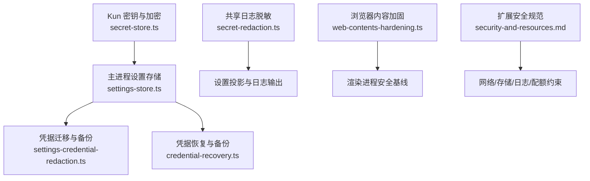
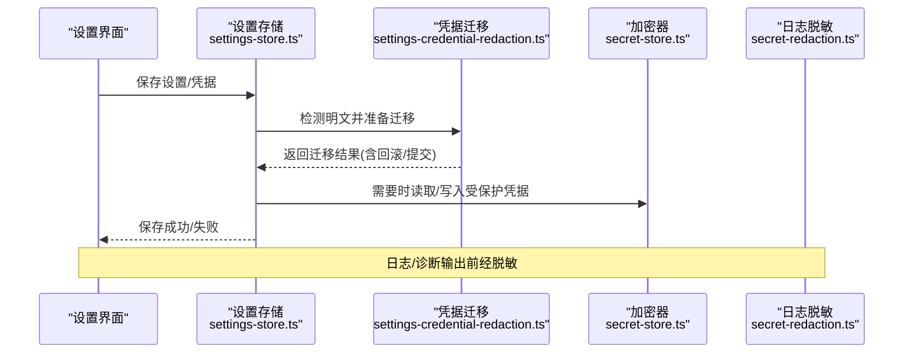
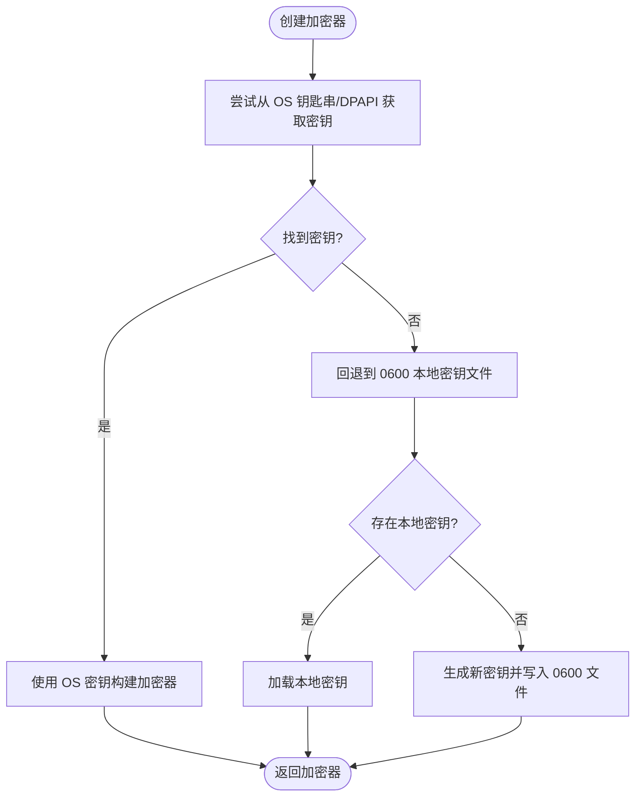
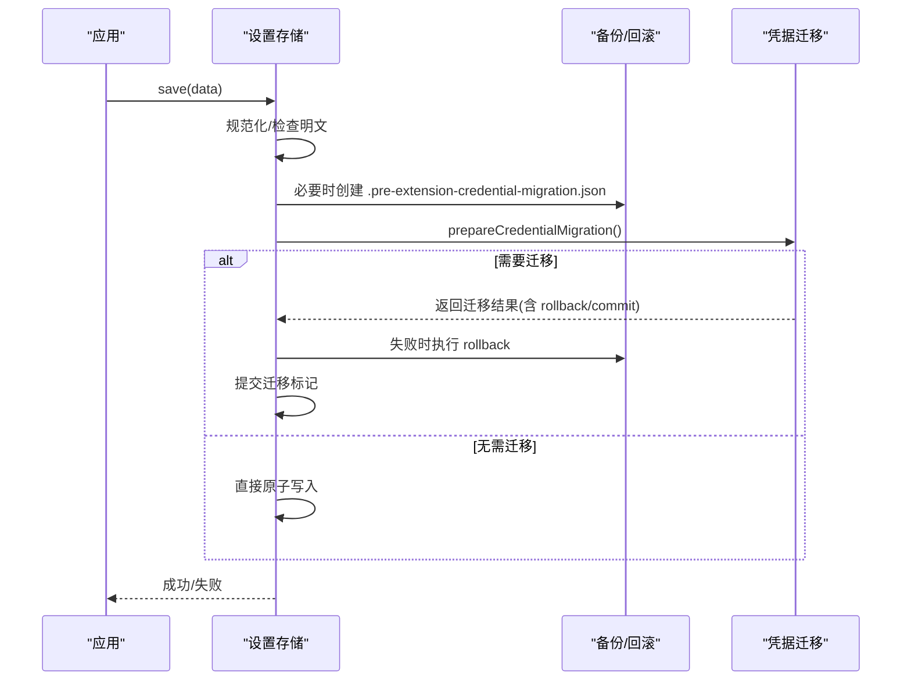
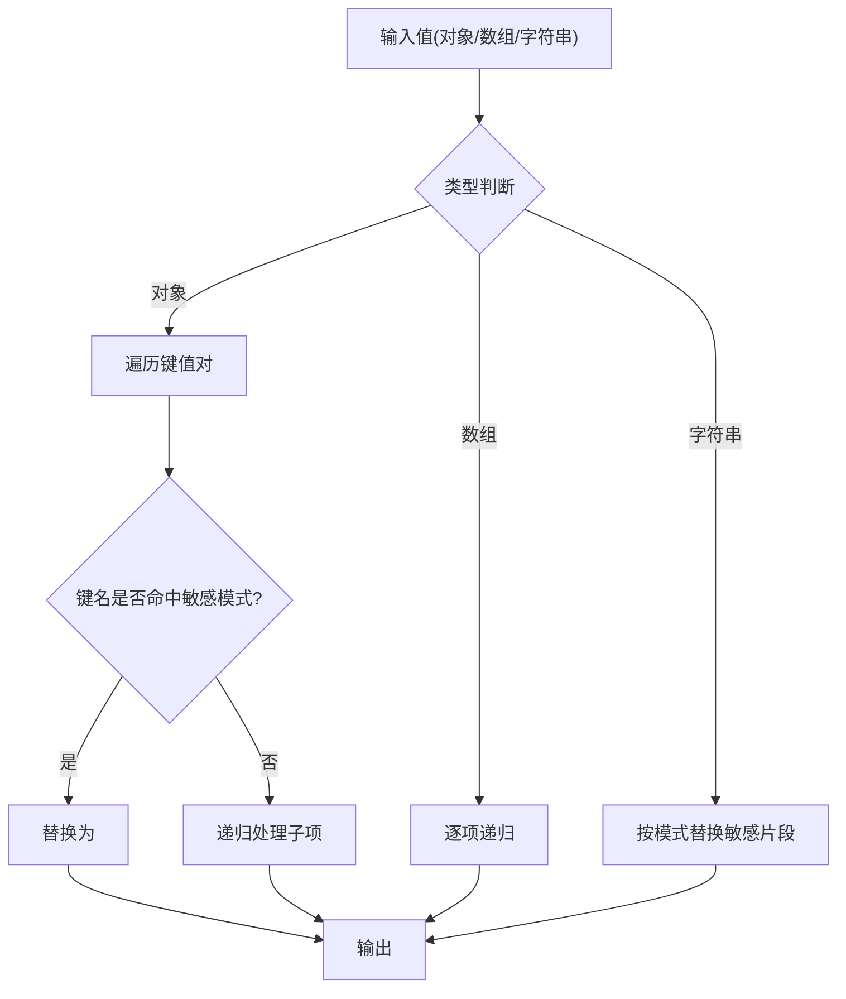
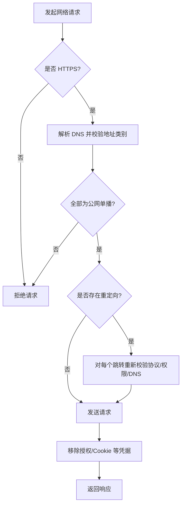
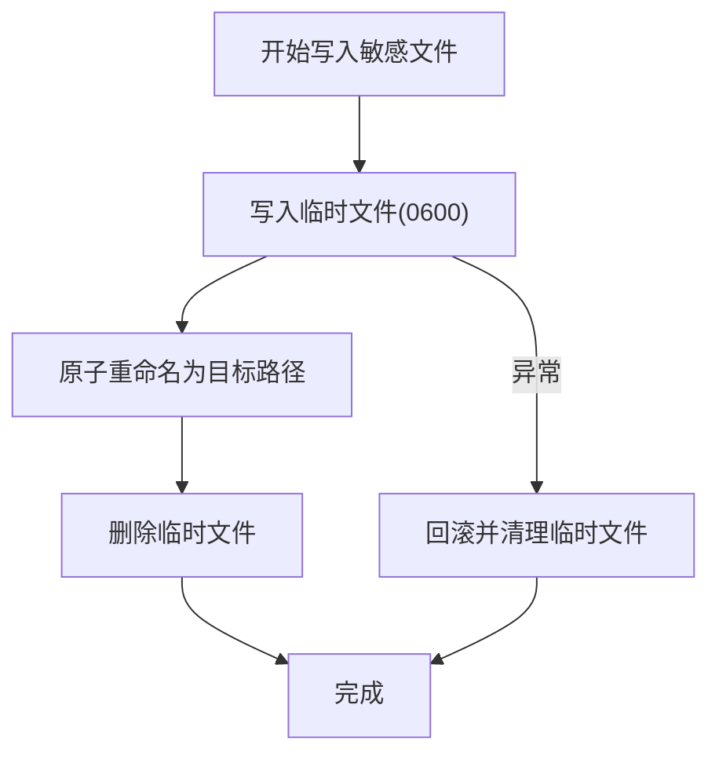
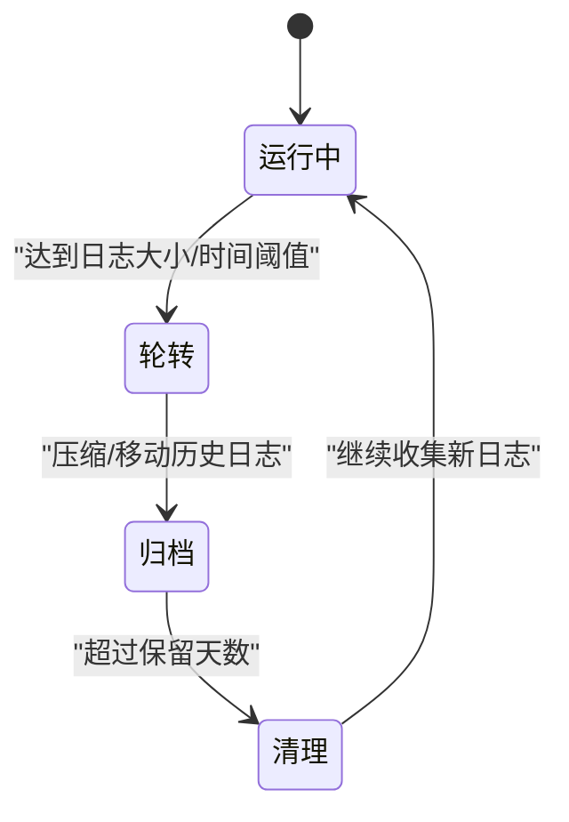
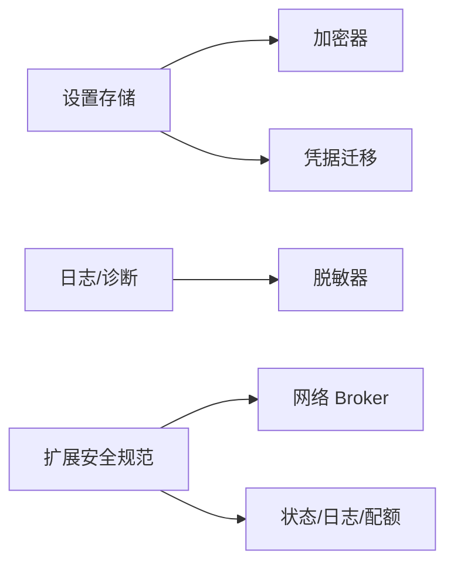

# 数据保护机制

<cite>
**本文引用的文件**
- [secret-store.ts](file://kun/src/security/secret-store.ts)
- [secret-redaction.ts](file://src/shared/secret-redaction.ts)
- [settings-credential-redaction.ts](file://src/main/settings-credential-redaction.ts)
- [credential-recovery.ts](file://src/main/credential-recovery.ts)
- [settings-store.ts](file://src/main/settings-store.ts)
- [web-contents-hardening.ts](file://src/main/browser-security/web-contents-hardening.ts)
- [security-and-resources.md](file://docs/extensions/security-and-resources.md)
</cite>

## 目录
1. [简介](#简介)
2. [项目结构](#项目结构)
3. [核心组件](#核心组件)
4. [架构总览](#架构总览)
5. [详细组件分析](#详细组件分析)
6. [依赖关系分析](#依赖关系分析)
7. [性能考量](#性能考量)
8. [故障排查指南](#故障排查指南)
9. [结论](#结论)
10. [附录：配置与合规实现](#附录配置与合规实现)

## 简介
本文件系统性说明 DeepSeek-GUI 的数据保护机制，覆盖以下方面：
- 敏感信息存储方案：密钥加密、凭据管理与内存安全清理
- 日志脱敏机制：自动识别敏感字段、动态替换与安全输出
- 数据传输安全：HTTPS 强制、证书验证与数据完整性校验
- 本地数据安全：文件权限控制、临时文件清理与备份加密
- 数据生命周期管理：自动过期、安全删除与审计追踪
- 配置指南与合规性要求实现方法

## 项目结构
数据保护相关能力分布在主进程、共享模块与 Kun 运行时安全层：
- 密钥与凭据加密：Kun 安全层的 AES-256-GCM 加密器与 OS 钥匙串/DPAPI 集成
- 设置与凭据迁移：主进程设置存储与凭据迁移、回滚与备份
- 日志脱敏：共享层通用脱敏工具与主进程对设置投影的凭据保留逻辑
- 浏览器内容加固：Electron WebPreferences 与 Session 默认拒绝策略
- 扩展安全规范：网络、存储、日志与配额等约束

**图表来源**
- [settings-store.ts:470-782](file://src/main/settings-store.ts#L470-L782)
- [settings-credential-redaction.ts:1-90](file://src/main/settings-credential-redaction.ts#L1-L90)
- [credential-recovery.ts:1-115](file://src/main/credential-recovery.ts#L1-L115)
- [secret-redaction.ts:1-37](file://src/shared/secret-redaction.ts#L1-L37)
- [secret-store.ts:1-653](file://kun/src/security/secret-store.ts#L1-L653)
- [web-contents-hardening.ts:1-33](file://src/main/browser-security/web-contents-hardening.ts#L1-L33)
- [security-and-resources.md:1-210](file://docs/extensions/security-and-resources.md#L1-L210)

**章节来源**
- [settings-store.ts:470-782](file://src/main/settings-store.ts#L470-L782)
- [secret-store.ts:1-653](file://kun/src/security/secret-store.ts#L1-L653)
- [secret-redaction.ts:1-37](file://src/shared/secret-redaction.ts#L1-L37)
- [settings-credential-redaction.ts:1-90](file://src/main/settings-credential-redaction.ts#L1-L90)
- [credential-recovery.ts:1-115](file://src/main/credential-recovery.ts#L1-L115)
- [web-contents-hardening.ts:1-33](file://src/main/browser-security/web-contents-hardening.ts#L1-L33)
- [security-and-resources.md:1-210](file://docs/extensions/security-and-resources.md#L1-L210)

## 核心组件
- 密钥与加密器（AES-256-GCM）：提供对称加密/解密，密钥来源优先级为 OS 钥匙串/DPAPI/本地 0600 密钥文件；支持附加认证数据（AAD）与信封格式。
- 凭据存储与迁移：检测并迁移明文 API Key/OAuth 到受保护存储，生成不可逆或最小化持久化；失败时回滚并保留备份。
- 设置存储：原子写入、版本冲突重试、非法设置自动恢复默认值并备份；在保护凭据不可用时拒绝写入明文。
- 日志脱敏：基于键名模式与文本模式自动替换敏感值，避免将密钥、令牌、授权头写入日志。
- 浏览器内容加固：禁用 Node 集成、启用沙箱与上下文隔离、拒绝危险权限与下载。
- 扩展安全规范：网络仅 HTTPS、严格 DNS 校验、状态/日志/配额限制与审计。

**章节来源**
- [secret-store.ts:1-653](file://kun/src/security/secret-store.ts#L1-L653)
- [settings-store.ts:470-782](file://src/main/settings-store.ts#L470-L782)
- [secret-redaction.ts:1-37](file://src/shared/secret-redaction.ts#L1-L37)
- [web-contents-hardening.ts:1-33](file://src/main/browser-security/web-contents-hardening.ts#L1-L33)
- [security-and-resources.md:1-210](file://docs/extensions/security-and-resources.md#L1-L210)

## 架构总览
数据保护贯穿“输入—处理—输出”全链路：
- 输入：用户/扩展通过设置界面或 API 提交凭据与配置
- 处理：设置存储进行规范化、迁移与原子持久化；加密器负责密钥获取与加解密；脱敏器在日志/诊断路径中过滤敏感信息
- 输出：渲染进程受限访问；网络请求遵循扩展 Broker 规则；本地文件以最小权限与临时文件策略落地

**图表来源**
- [settings-store.ts:548-643](file://src/main/settings-store.ts#L548-L643)
- [settings-credential-redaction.ts:1-90](file://src/main/settings-credential-redaction.ts#L1-L90)
- [secret-store.ts:573-653](file://kun/src/security/secret-store.ts#L573-L653)
- [secret-redaction.ts:9-37](file://src/shared/secret-redaction.ts#L9-L37)

## 详细组件分析

### 密钥与凭据加密（AES-256-GCM + OS 钥匙串/DPAPI）
- 算法与信封：使用 AES-256-GCM，带随机 IV 与认证标签；采用统一信封前缀便于兼容旧明文。
- 密钥来源：优先 OS 钥匙串（macOS/Linux），Windows 使用 DPAPI 包裹密钥；均不可用则降级到 0600 本地密钥文件。
- 并发与租约：通过 Manager 租约序列化首次密钥解析/迁移，避免多进程竞争。
- 错误处理：当 DPAPI 密钥不可读时抛出专用错误，阻止替换现有密钥，保障已加密凭据可恢复。

**图表来源**
- [secret-store.ts:573-653](file://kun/src/security/secret-store.ts#L573-L653)
- [secret-store.ts:318-362](file://kun/src/security/secret-store.ts#L318-L362)
- [secret-store.ts:244-304](file://kun/src/security/secret-store.ts#L244-L304)

**章节来源**
- [secret-store.ts:1-653](file://kun/src/security/secret-store.ts#L1-L653)

### 设置存储与凭据迁移
- 原子写入与版本冲突：使用原子写与文档修订号重试，避免部分提交与并发冲突。
- 明文检测与迁移：检测到明文 API Key/OAuth 时，先备份再迁移至受保护存储；迁移失败回滚。
- 保护不可用时拒绝写入：若受保护凭据存储不可用且包含明文，直接拒绝保存，防止泄露。
- 非法设置恢复：JSON 解析失败或结构不合法时，备份原文件并恢复默认设置。

**图表来源**
- [settings-store.ts:599-643](file://src/main/settings-store.ts#L599-L643)
- [settings-store.ts:343-397](file://src/main/settings-store.ts#L343-L397)
- [settings-store.ts:715-737](file://src/main/settings-store.ts#L715-L737)

**章节来源**
- [settings-store.ts:470-782](file://src/main/settings-store.ts#L470-L782)
- [settings-credential-redaction.ts:1-90](file://src/main/settings-credential-redaction.ts#L1-L90)

### 日志脱敏机制
- 键名匹配：对包含 api-key、authorization、bearer、client-secret、password、secret、token 等键名的字段直接替换为固定占位符。
- 文本匹配：对字符串中的授权头、Bearer 令牌等进行正则替换，确保即使混入对象值也能被脱敏。
- 适用场景：日志、诊断、错误上报与跨进程传输前的二次清洗。

**图表来源**
- [secret-redaction.ts:1-37](file://src/shared/secret-redaction.ts#L1-L37)

**章节来源**
- [secret-redaction.ts:1-37](file://src/shared/secret-redaction.ts#L1-L37)

### 数据传输安全（HTTPS 强制、证书验证、完整性）
- 仅允许 HTTPS：扩展网络 Broker 强制 scheme 为 HTTPS，并对目标主机名、DNS 解析结果、重定向链进行校验。
- 地址白名单：生产环境仅接受公网单播地址；出现环回、私有、组播等特殊地址即整体失败。
- 重定向安全：手动/错误模式重定向，每次跳转重新校验协议、权限与账户范围。
- 响应清洗：认证相关头部/Cookie 等在返回前移除，避免泄露。

**图表来源**
- [security-and-resources.md:96-127](file://docs/extensions/security-and-resources.md#L96-L127)

**章节来源**
- [security-and-resources.md:96-127](file://docs/extensions/security-and-resources.md#L96-L127)

### 本地数据安全（文件权限、临时文件、备份加密）
- 文件权限：密钥文件与备份文件使用 0600 权限；目录创建时使用 0700，确保仅当前用户可读写。
- 临时文件：写入采用临时文件+原子重命名，并在完成后清理临时文件，降低中间态泄露风险。
- 备份与恢复：设置迁移与凭据恢复流程会创建时间戳命名的备份目录，失败时支持回滚与残留清理。

**图表来源**
- [secret-store.ts:333-362](file://kun/src/security/secret-store.ts#L333-L362)
- [credential-recovery.ts:59-104](file://src/main/credential-recovery.ts#L59-L104)
- [settings-store.ts:343-397](file://src/main/settings-store.ts#L343-L397)

**章节来源**
- [secret-store.ts:318-362](file://kun/src/security/secret-store.ts#L318-L362)
- [credential-recovery.ts:1-115](file://src/main/credential-recovery.ts#L1-L115)
- [settings-store.ts:343-397](file://src/main/settings-store.ts#L343-L397)

### 数据生命周期管理（自动过期、安全删除、审计追踪）
- 日志轮转与保留：默认按大小与天数轮转，避免无限增长；可通过设置调整保留天数。
- 会话与工作区目录：默认工作区与对话目录由设置存储初始化并归一化，便于后续清理策略实施。
- 审计与诊断：扩展日志与诊断输出需记录操作 ID、状态、耗时与结构化错误；禁止记录敏感内容。

**图表来源**
- [settings-store.ts:254-298](file://src/main/settings-store.ts#L254-L298)
- [security-and-resources.md:168-185](file://docs/extensions/security-and-resources.md#L168-L185)

**章节来源**
- [settings-store.ts:254-298](file://src/main/settings-store.ts#L254-L298)
- [security-and-resources.md:168-185](file://docs/extensions/security-and-resources.md#L168-L185)

### 浏览器内容加固（渲染进程安全基线）
- 默认拒绝：禁用 Node 集成、Worker 集成、子帧集成；启用上下文隔离与沙箱；禁止不安全内容。
- Session 加固：拒绝所有权限请求、设备权限与下载；减少攻击面。

**章节来源**
- [web-contents-hardening.ts:1-33](file://src/main/browser-security/web-contents-hardening.ts#L1-L33)

## 依赖关系分析
- 设置存储依赖加密器与凭据迁移：在保存/加载时触发迁移与回滚；在保护凭据不可用时拒绝明文写入。
- 日志脱敏独立于存储：可在任意输出路径调用，保证日志/诊断安全。
- 扩展安全规范作为上层约束：指导网络、存储、日志与配额行为，与底层实现协同。

**图表来源**
- [settings-store.ts:548-643](file://src/main/settings-store.ts#L548-L643)
- [secret-store.ts:573-653](file://kun/src/security/secret-store.ts#L573-L653)
- [secret-redaction.ts:9-37](file://src/shared/secret-redaction.ts#L9-L37)
- [security-and-resources.md:96-185](file://docs/extensions/security-and-resources.md#L96-L185)

**章节来源**
- [settings-store.ts:548-643](file://src/main/settings-store.ts#L548-L643)
- [secret-store.ts:573-653](file://kun/src/security/secret-store.ts#L573-L653)
- [secret-redaction.ts:9-37](file://src/shared/secret-redaction.ts#L9-L37)
- [security-and-resources.md:96-185](file://docs/extensions/security-and-resources.md#L96-L185)

## 性能考量
- 加密器开销：AES-256-GCM 加解密成本较低；关键路径应避免频繁重复加解密，缓存必要结果。
- 设置存储并发：通过队列串行化写操作，减少锁竞争与冲突；版本冲突重试次数有限，避免无限重试。
- 日志轮转：按大小/时间切分，避免单次写入过大；归档与清理后台执行，不影响主流程。
- 网络请求：Broker 校验与 DNS 解析在连接前完成，减少无效往返；重定向逐跳校验，增加少量延迟但提升安全性。

[本节为通用性能建议，不直接分析具体文件]

## 故障排查指南
- 无法读取 DPAPI 密钥：检查 Windows 用户上下文与 PowerShell 可用性；必要时执行凭据恢复流程，将敏感文件移动到备份目录并重建密钥。
- 明文凭据无法保存：确认受保护凭据存储可用；若不可用，修复后重试；不要直接写入明文。
- 设置文件损坏：查看生成的 invalid 备份文件，恢复默认设置并逐步迁移配置。
- 日志泄露风险：确保所有日志/诊断输出经过脱敏函数；避免直接打印完整请求体或响应体。

**章节来源**
- [credential-recovery.ts:33-104](file://src/main/credential-recovery.ts#L33-L104)
- [settings-store.ts:343-418](file://src/main/settings-store.ts#L343-L418)
- [secret-redaction.ts:9-37](file://src/shared/secret-redaction.ts#L9-L37)

## 结论
DeepSeek-GUI 通过“强加密 + 受保护存储 + 原子持久化 + 严格脱敏 + 浏览器加固 + 扩展网络策略”的组合，构建了端到端的数据保护体系。其设计强调：
- 密钥与凭据不落盘明文
- 设置变更具备回滚与备份能力
- 日志与诊断默认脱敏
- 网络请求强制 HTTPS 与严格地址校验
- 本地文件最小权限与临时文件策略
- 生命周期可控与审计可追溯

## 附录：配置与合规实现
- 密钥与凭据
  - 使用加密器封装凭据；避免在设置/日志中存放明文
  - 在受保护存储不可用时拒绝写入明文
  - 定期轮换密钥并验证可解密性
- 日志脱敏
  - 所有 stdout/stderr、诊断输出必须经脱敏函数
  - 禁止记录完整请求/响应体、Cookie、Authorization 头
- 数据传输
  - 仅允许 HTTPS；对 DNS 解析结果与重定向链进行校验
  - 响应中移除凭据相关头部/Cookie
- 本地安全
  - 密钥与备份文件使用 0600；目录 0700
  - 使用临时文件+原子重命名；及时清理临时文件
  - 凭据恢复流程支持备份与回滚
- 生命周期
  - 配置日志保留天数与轮转策略
  - 工作区/对话目录归一化，便于后续清理
  - 审计记录操作 ID、状态、耗时与结构化错误
- 合规要点
  - 最小权限原则：仅声明必要网络/存储/UI 权限
  - 数据最小化：不存储不必要的大文件或敏感内容
  - 可审计：日志与诊断输出可安全附到问题报告

**章节来源**
- [secret-store.ts:573-653](file://kun/src/security/secret-store.ts#L573-L653)
- [settings-store.ts:599-643](file://src/main/settings-store.ts#L599-L643)
- [secret-redaction.ts:9-37](file://src/shared/secret-redaction.ts#L9-L37)
- [security-and-resources.md:96-185](file://docs/extensions/security-and-resources.md#L96-L185)